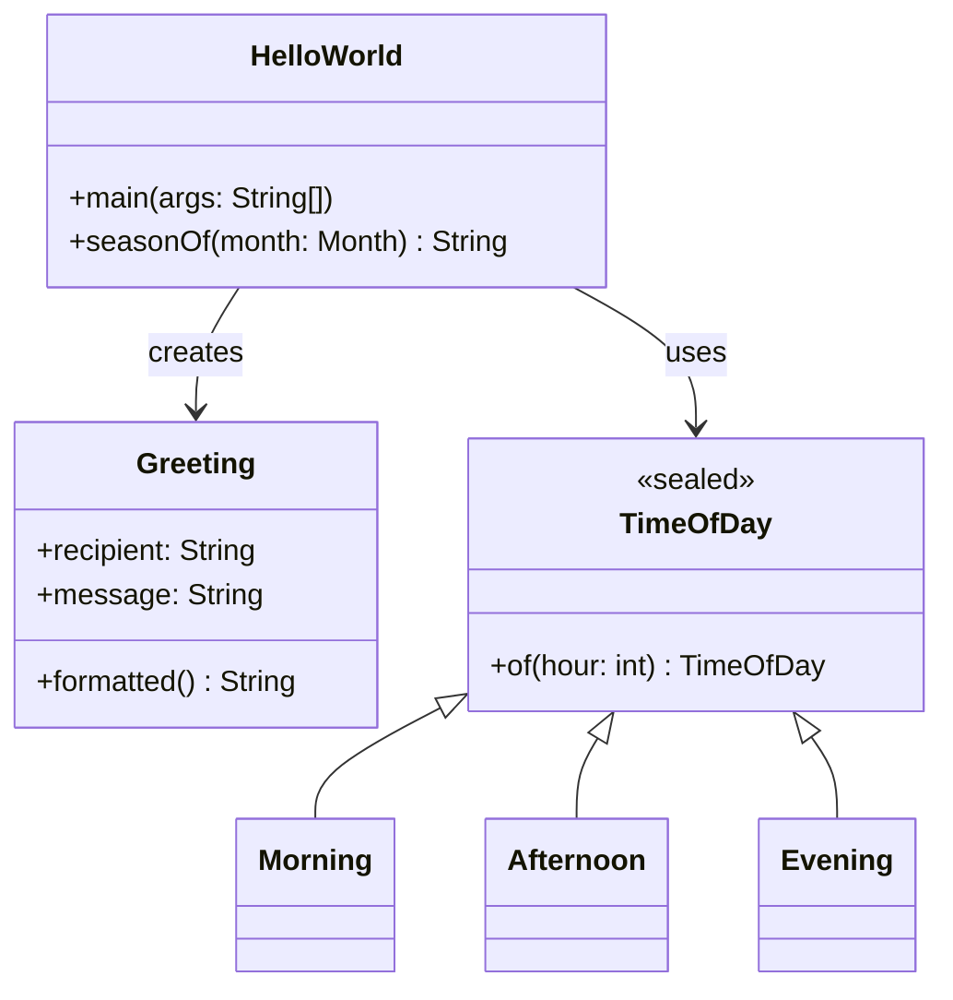

# Skill: Architecture Documentation with Mermaid

## Purpose

Keep architecture documentation accurate and visual. Every architecture-relevant code change must be
reflected in Mermaid diagrams so that the docs never drift from the code.

## When This Skill Triggers

Apply this skill when:
- A new class, module, service, or component is introduced
- An existing class or module is significantly restructured
- New interactions between components are added
- Sealed type hierarchies or domain model structures are added or changed
- A Java version upgrade introduces new structural patterns (e.g., records, sealed interfaces)

## Required Diagrams (minimum)

Every architecture documentation set must include at least:

| Diagram | Mermaid Type | Purpose |
|---|---|---|
| System context | `graph TD` or `flowchart TD` | High-level view of system and external actors |
| Component/module interactions | `graph LR` or `flowchart LR` | How internal components relate and communicate |
| Runtime flow | `sequenceDiagram` | Key user or service request flows end-to-end |

Add more diagrams when the domain warrants it (e.g., `classDiagram` for domain models).

## Diagram Standards

- **Node names must match** real package, class, module, or service names in code — never invent names.
- **Update diagrams** whenever a related code change is made; stale diagrams are worse than no diagrams.
- **Embed diagrams** in Markdown files using fenced code blocks with the `mermaid` tag.
- **Keep diagrams concise** — show relationships and flows, not every implementation detail.

## Recommended Mermaid Types

| Type | Use For |
|---|---|
| `flowchart` | Process flows, request handling pipelines |
| `sequenceDiagram` | Service-to-service or component interactions over time |
| `classDiagram` | Domain model structure, inheritance, sealed hierarchies |
| `graph TD` / `graph LR` | Component dependency overviews, module maps |

## Example — Class Diagram for HelloWorld Domain



## Checklist

- [ ] High-level system context diagram exists and is up to date
- [ ] Component interaction diagram reflects current module/class structure
- [ ] Runtime flow diagram covers the primary use case
- [ ] All node names match actual code names
- [ ] Diagrams are embedded in Markdown with ` ```mermaid ``` ` blocks
- [ ] Documentation was updated in the same commit/PR as the code change

## Source

Derived from `cookbooks/mermaid-architecture-documentation-guideline.md`.
