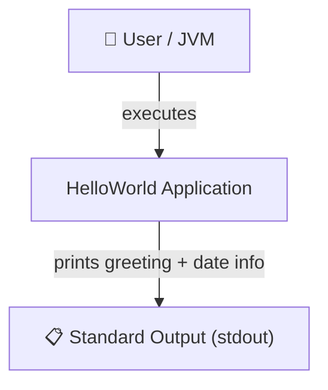
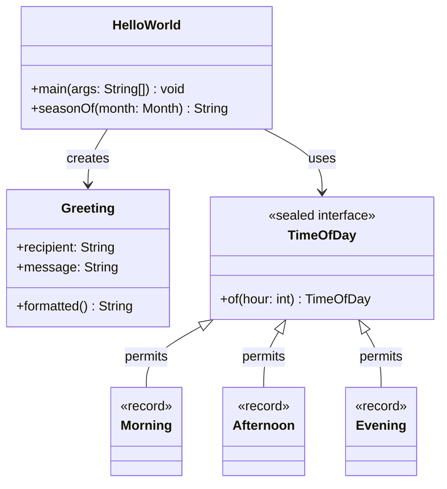
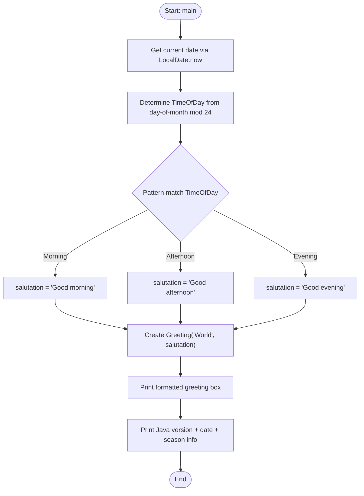

# Obligatory Mermaid Architecture Documentation Skill

## Purpose

Ensure that all architecture documentation includes Mermaid diagrams to visually represent the system structure and flow. Diagrams must be kept in sync with the actual codebase, and diagram node names must reflect real package, module, class, or service names.

## Source

Derived from: `cookbooks/mermaid-architecture-documentation-guideline.md`

## When to Apply

- When **creating or updating any architecture documentation** (arc42, ADRs, README architecture sections, design docs).
- When **making architecture-relevant code changes** (adding services, changing module boundaries, modifying request flows).
- When **generating technical documentation** for a new feature or system.
- This rule is **obligatory** — documentation without Mermaid diagrams is incomplete.

## Minimum Required Diagrams

Every architecture document must include **at minimum** these three diagram types:

| Diagram | Purpose | Recommended Mermaid Type |
|---------|---------|--------------------------|
| **System Context** | High-level view showing the system and its external actors/systems | `graph TD` or `C4Context` |
| **Component / Module Interaction** | Shows how internal components relate and interact | `graph LR`, `graph TD`, or `classDiagram` |
| **Runtime Flow** | Key user or service execution paths through the system | `flowchart TD` or `sequenceDiagram` |

## Diagram Rules

### Node Alignment
- Diagram nodes **must match** real package names, module names, class names, or service names in the code.
- Do not use generic labels like `"Service"` or `"Module"` — use the actual names (e.g., `HelloWorld`, `TimeOfDay`, `Greeting`).

### Diagram Currency
- Update Mermaid diagrams **whenever architecture-relevant code changes** are made.
- A diagram that does not reflect the current code is worse than no diagram — keep them current.

### Diagram Types Reference

| Use Case | Mermaid Diagram Type |
|----------|----------------------|
| Process and request flows | `flowchart` |
| Service interactions over time | `sequenceDiagram` |
| Domain model / class structure | `classDiagram` |
| Component dependency overviews | `graph TD` or `graph LR` |
| State machines | `stateDiagram-v2` |
| Deployment topology | `graph TD` with deployment nodes |

## Example Diagrams

### System Context (Hello World Example)



### Component Interaction



### Runtime Flow



## Embedding Diagrams in Documentation

Always embed Mermaid diagrams in fenced code blocks with the `mermaid` language tag:

````markdown

````

Do **not** use PlantUML, draw.io exports, or inline images for new diagrams — only Mermaid.

## Checklist

Before finalising any architecture documentation change, verify:

- [ ] A **system context diagram** is present and up to date.
- [ ] A **component/module interaction diagram** is present and up to date.
- [ ] A **runtime flow diagram** for at least one key path is present.
- [ ] All diagram **node names match real code artefacts** (classes, packages, services).
- [ ] Diagrams are embedded as Mermaid ```` ```mermaid ```` code blocks (not images or PlantUML).
- [ ] Diagrams were **updated** to reflect any architecture-relevant code changes in this PR.
