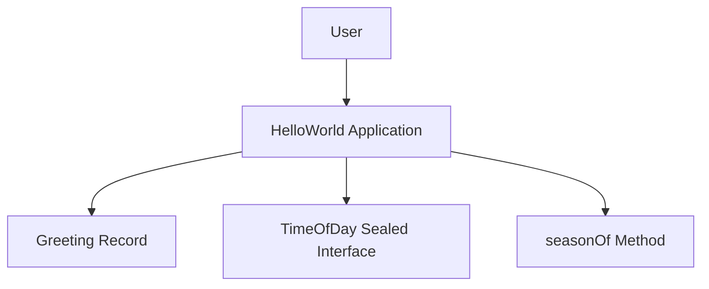

# Obligatory Mermaid Architecture Documentation

## Rule

When creating or updating application architecture documentation, include Mermaid diagrams to visualize structure and flow.

## Minimum Requirements

- Add a **high-level system context diagram**.
- Add a **component or module interaction diagram**.
- Add a **runtime flow diagram** for key user or service paths.
- Keep diagram nodes aligned with real package/module/service names in code.
- Update Mermaid diagrams whenever architecture-relevant code changes.

## Recommended Diagram Types

- `flowchart` — for process and request flows.
- `sequenceDiagram` — for service interactions over time.
- `classDiagram` — for domain model structure.
- `graph TD` or `graph LR` — for component dependency overviews.

## Example

