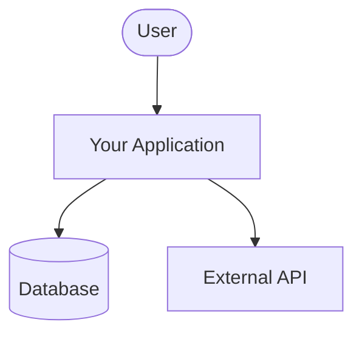
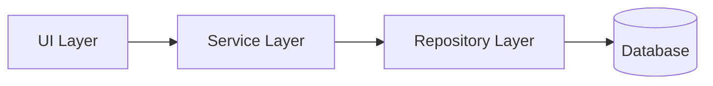
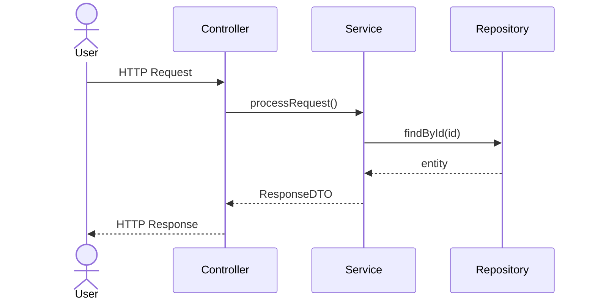
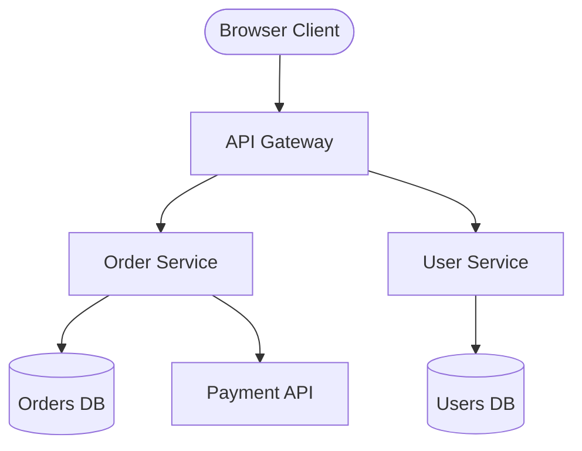
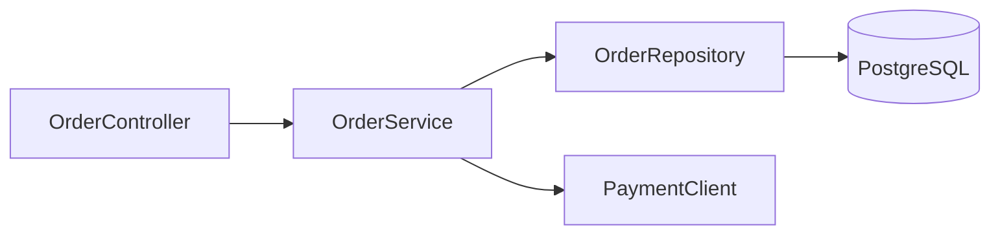
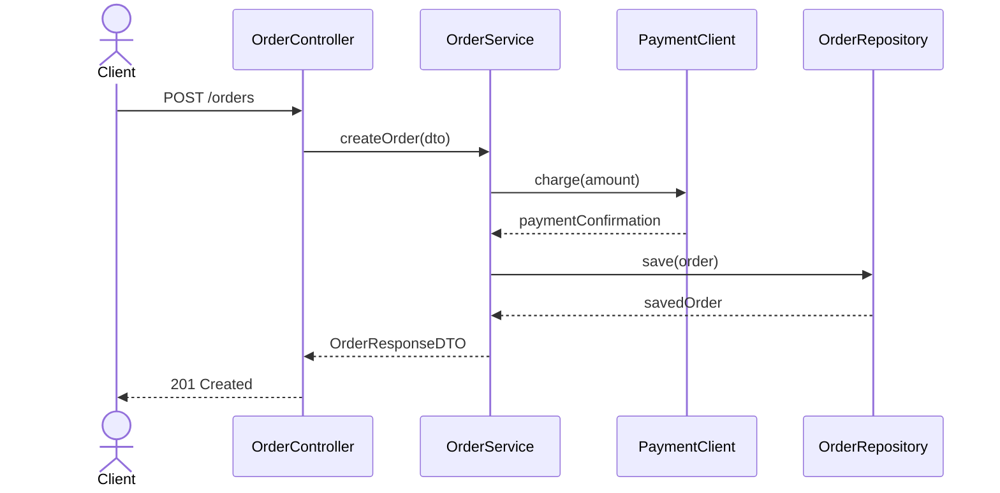

# Skill: Mermaid Architecture Documentation

**Enforcement level:** Obligatory — every architecture document must contain the required Mermaid diagrams.

## Rule

When creating or updating application architecture documentation, always include Mermaid diagrams.
Three diagram types are the minimum requirement; additional diagrams are encouraged.

## Required Diagrams (minimum set)

Every architecture document MUST contain all three of the following:

### 1. High-Level System Context Diagram
Shows the system as a whole and its relationships with external actors and systems.

**Recommended syntax:** `flowchart TD` or `graph TD`



### 2. Component / Module Interaction Diagram
Shows the internal components or modules and how they interact with each other.

**Recommended syntax:** `flowchart LR`, `graph LR`, or `classDiagram`



### 3. Runtime Flow Diagram
Shows the step-by-step flow of a key user journey or service interaction at runtime.

**Recommended syntax:** `sequenceDiagram`



## Diagram Standards

- **Node naming**: diagram nodes MUST match real package/module/service/class names from the codebase.
- **No fictional components**: do not invent components that do not exist in the code.
- **Keep updated**: whenever architecture-relevant code changes, update the corresponding Mermaid diagrams.

## Recommended Mermaid Diagram Types Reference

| Diagram type      | Mermaid keyword     | Best for                                      |
|-------------------|---------------------|-----------------------------------------------|
| Process flow      | `flowchart`         | Request flows, data flows, process steps      |
| Component graph   | `graph TD / LR`     | Component dependency overviews                |
| Sequence          | `sequenceDiagram`   | Service interactions over time                |
| Class/domain model| `classDiagram`      | Domain model structure, entity relationships  |
| State machine     | `stateDiagram-v2`   | Lifecycle states of an entity or process      |
| Entity-relationship| `erDiagram`        | Database schema relationships                 |

## Example: Complete Architecture Document Section

```markdown
## System Architecture

### System Context



### Component Interactions



### Key Runtime Flow: Place Order


```

## Checklist Before Finalising Any Architecture Document

- [ ] High-level system context diagram is present (using `flowchart` or `graph`).
- [ ] Component/module interaction diagram is present.
- [ ] Runtime flow diagram is present (using `sequenceDiagram`).
- [ ] All diagram nodes correspond to real names in the codebase.
- [ ] Diagrams are enclosed in fenced code blocks with the `mermaid` language tag.
- [ ] Diagrams have been updated if any architecture-relevant code changed.
