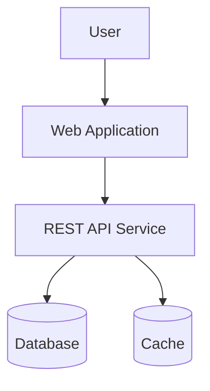
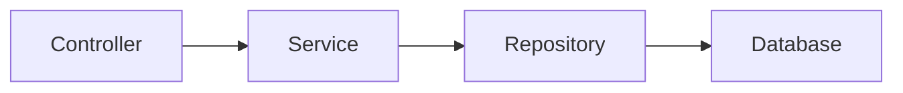
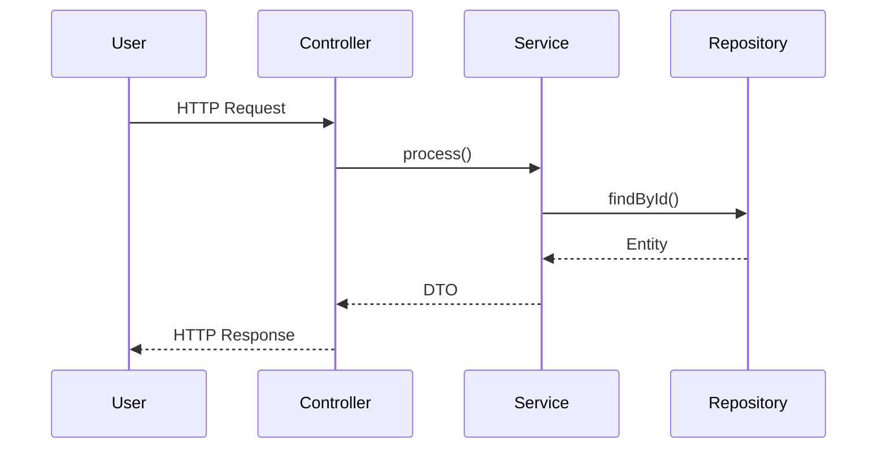

# Skill: Mermaid Architecture Documentation (Obligatory)

## Purpose
Ensure application architecture documentation is always accompanied by Mermaid diagrams that visualize structure and flow.

## Rules

### Minimum Required Diagrams
Every architecture documentation must include at least:

1. **High-Level System Context Diagram** — shows the system boundary and external actors/systems.
2. **Component or Module Interaction Diagram** — shows how internal components communicate.
3. **Runtime Flow Diagram** — illustrates key user journeys or service call paths at runtime.

### Diagram Node Alignment
- Diagram nodes **must match** real package, module, or service names used in code.
- Do not use generic placeholder names — use actual identifiers from the codebase.

### Keeping Diagrams Up to Date
- Update Mermaid diagrams **whenever architecture-relevant code changes** (e.g., new services, changed interfaces, removed components).
- Architecture documentation is considered stale if it no longer reflects actual code structure.

### Recommended Diagram Types
| Use Case | Mermaid Type |
|---|---|
| Process and request flows | `flowchart` |
| Service interactions over time | `sequenceDiagram` |
| Domain model structure | `classDiagram` |
| Component dependency overview | `graph TD` or `graph LR` |

## Example

### System Context (flowchart)

### Component Interaction (graph LR)

### Runtime Flow (sequenceDiagram)

## Rationale
Mermaid diagrams are version-controlled alongside code, making them the single source of truth for architecture visualization. They enable faster onboarding, clearer code reviews, and reliable documentation.
