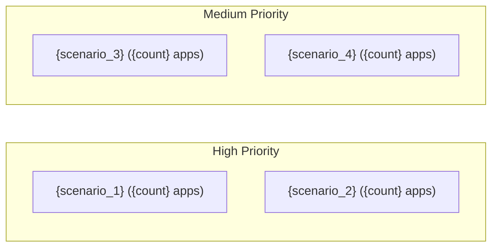
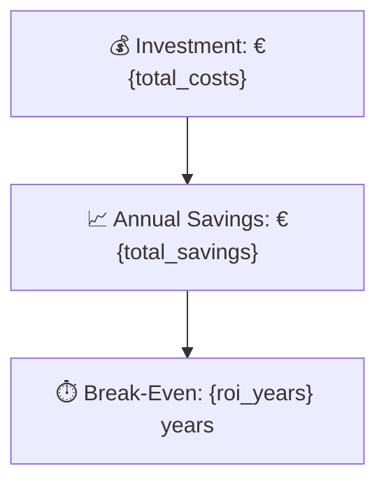

# Portfolio Reporting

Generate Markdown reports from the analysis results. All reports use Mermaid for diagrams.

## Input

Read all per-application JSON files from these directories:
- `output/applications/consolidated_schema/consolidated_schema_application_<app_id>.json` — application metadata
- `output/applications/internal_app_model/internal_app_model_application_<app_id>.json` — normalized identity fields
- `output/out_of_scope_results/out_of_scope_<app_id>.json` — out-of-scope decisions
- `output/technology_assessment/technology_assessment_<app_id>.json` — component lifecycle data
- `output/complexity_results/complexity_<app_id>.json` — complexity scores
- `output/scenario_applicability_results/scenario_assessment_<app_id>.json` — scenario applicability
- `output/business_case_results/business_case.json` — portfolio-level financial analysis

Exclude applications where out-of-scope assessment has `out_of_scope: true`.

## Report 1: Per-Application Reports

Create one Markdown file per application in `output/reports/apps/<app_id>.md`.

### Template

````markdown
# Application Report: {app_name}

**ID:** {app_id}
**Generated:** {date}

## Overview

| Attribute | Value |
|-----------|-------|
| Owner | {owner} |
| Environment | {environment_type} |
| Business Criticality | {business_criticality} |
| Users | {user_count} |
| Servers | {server_count} |

## Technology Stack

| Component | Technology | Version | Status |
|-----------|-----------|---------|--------|
| Operating System | {os} | {os_version} | {os_status_badge} |
| Database | {db} | {db_version} | {db_status_badge} |
| Language | {lang} | {lang_version} | {lang_status_badge} |
| Framework | {fw} | {fw_version} | {fw_status_badge} |
| App Server | {as} | {as_version} | {as_status_badge} |


## Complexity Assessment

**Score:** {complexity_score}/10 — **{complexity_level}**
**Confidence:** {confidence}

| Factor | Score | Notes |
|--------|-------|-------|
| Technology Age | {tech_score}/10 | {tech_reasoning} |
| Integration | {int_score}/10 | {int_reasoning} |
| Infrastructure | {infra_score}/10 | {infra_reasoning} |
| Business Criticality | {crit_score}/10 | {crit_reasoning} |
| Architecture | {arch_score}/10 | {arch_reasoning} |
| Data | {data_score}/10 | {data_reasoning} |

## Modernization Scenarios

### Applicable Scenarios

{for each applicable scenario:}

#### ✅ {scenario_name}

- **Priority:** {priority}
- **Effort:** {effort}
- **Effects:** {effects}
- **Cost:** €{adjusted_cost} (one-time)
- **Savings:** €{adjusted_yearly_savings}/year
- **Reasoning:** {reasoning}

### Not Applicable / Other

| Scenario | Status | Reason |
|----------|--------|--------|
| {scenario_name} | {status} | {short_reasoning} |

## Financial Summary

| Metric | Value |
|--------|-------|
| Total One-Time Cost | €{total_cost} |
| Total Yearly Savings | €{total_yearly_savings} |
| Break-Even | {roi_years} years |
````

### Status badges

Use these emoji indicators for technology status:
- CURRENT_VERSION: 🟢
- OUTDATED: 🟡
- EOL: 🔴
- NO_KNOWLEDGE: ⚪

## Report 2: Portfolio Summary

Create `output/reports/portfolio_report.md`.

### Template

````markdown
# Portfolio Modernization Report

**Generated:** {date}
**Applications Analyzed:** {total_apps}

## Executive Summary

{Write 3-5 sentences summarizing key findings: how many apps, main risks, top opportunities, estimated ROI.}

## Portfolio Overview


## Top Modernization Opportunities



| Scenario | Applicable Apps | Priority | Total Cost | Yearly Savings | ROI |
|----------|----------------|----------|------------|---------------|-----|
| {scenario_name} | {count} | {priority} | €{cost} | €{savings} | {roi}y |

## Scenario Applicability Matrix

| Application | {scenario_1} | {scenario_2} | {scenario_3} | ... |
|-------------|:---:|:---:|:---:|:---:|
| {app_name} | ✅ | ❌ | ✅ | ... |

Legend: ✅ Applicable | ❌ Not Applicable | ✔️ Already Fulfilled | 🚫 Blocked | ❓ Unknown

## Financial Summary

| Metric | Value |
|--------|-------|
| Total One-Time Investment | €{total_costs} |
| Total Annual Savings | €{total_savings} |
| Portfolio Break-Even | {roi_years} years |



## Risk Applications

Applications with the highest modernization complexity or most EOL components:

| Application | Complexity | EOL Components | Applicable Scenarios |
|-------------|-----------|---------------|---------------------|
| {app_name} | {score}/10 ({level}) | {eol_count} | {scenario_count} |

## Per-Application Reports

| Application | Report |
|-------------|--------|
| {app_name} | [View Report](apps/{app_id}.md) |
````

## Guidelines

- **Mermaid diagrams**: Use `pie`, `graph`, and `gantt` chart types. Keep them simple — max 10 items per chart.
- **Numbers**: Format large numbers with thousand separators in prose, but keep them plain in tables for sorting.
- **Links**: Use relative links between reports (e.g., `[View Report](apps/APP_001.md)`).
- **Adapt the template**: If data is missing for a section, omit that section rather than showing empty tables.
- **Executive summary**: Write it last, after all data is compiled. It should be useful to a CTO who reads only this section.
