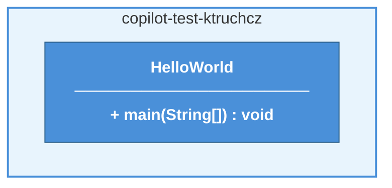
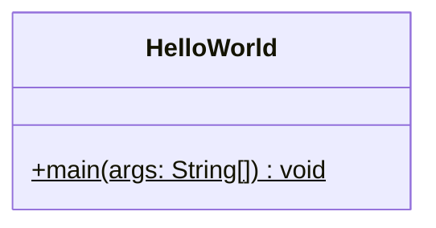
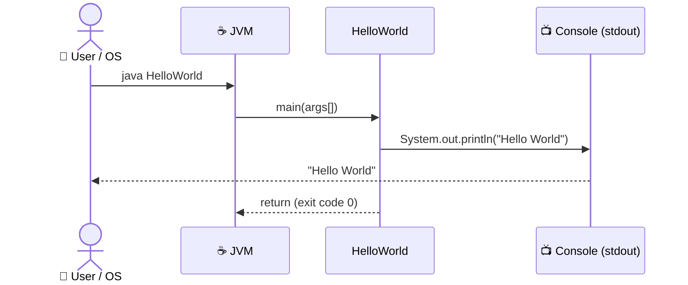
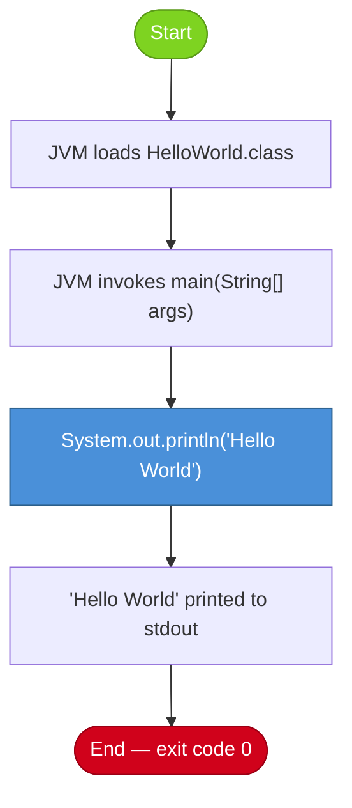
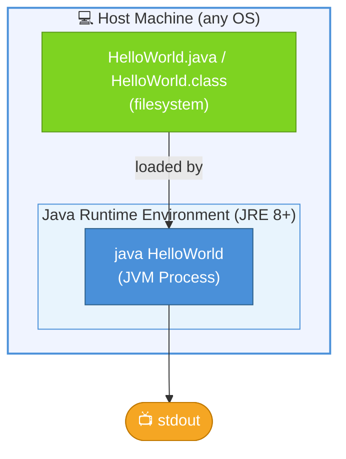
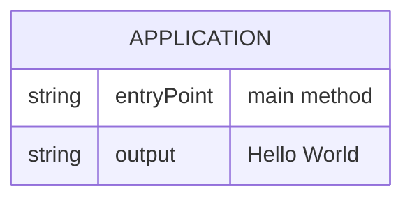
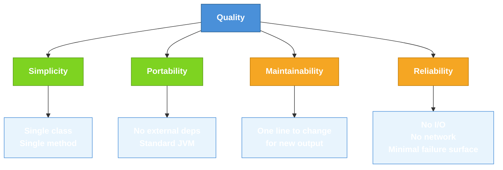

# Architecture Documentation (Arc42)

**Project**: copilot-test-ktruchcz  
**Version**: 1.0  
**Date**: 2026-03-09  
**Generated by**: Arc42 Documentation Generator

---

## Table of Contents
1. [Introduction and Goals](#1-introduction-and-goals)
2. [Constraints](#2-constraints)
3. [Context and Scope](#3-context-and-scope)
4. [Solution Strategy](#4-solution-strategy)
5. [Building Block View](#5-building-block-view)
6. [Runtime View](#6-runtime-view)
7. [Deployment View](#7-deployment-view)
8. [Crosscutting Concepts](#8-crosscutting-concepts)
9. [Architecture Decisions](#9-architecture-decisions)
10. [Quality Requirements](#10-quality-requirements)
11. [Risks and Technical Debt](#11-risks-and-technical-debt)
12. [Glossary](#12-glossary)

---

## 1. Introduction and Goals

### 1.1 Requirements Overview

The `copilot-test-ktruchcz` project is a minimal Java application that serves as a proof-of-concept or test harness for the GitHub Copilot toolchain. Its sole functional requirement is to print `"Hello World"` to standard output when executed.

| ID  | Requirement              | Description                                              |
|-----|--------------------------|----------------------------------------------------------|
| R01 | Console Output           | The application must print "Hello World" to stdout.      |
| R02 | Standalone Execution     | The application must be runnable via the JVM directly.   |

### 1.2 Quality Goals

| Priority | Quality Goal    | Motivation                                                        |
|----------|-----------------|-------------------------------------------------------------------|
| 1        | Simplicity      | Keep the codebase minimal to focus on toolchain validation.       |
| 2        | Portability     | Must run on any JVM-compatible environment without dependencies.  |
| 3        | Maintainability | Single-class structure makes future changes trivial.              |

### 1.3 Stakeholders

| Role                 | Description                | Expectations                                          |
|----------------------|----------------------------|-------------------------------------------------------|
| Developer            | ktruchcz                   | Working baseline application for Copilot testing.     |
| GitHub Copilot Agent | Automated toolchain agent  | Repository to analyse and generate documentation for. |

---

## 2. Constraints

### 2.1 Technical Constraints

| Constraint            | Description                                                        |
|-----------------------|--------------------------------------------------------------------|
| Java Language         | The entire application is written in Java.                         |
| No build tool         | No Maven, Gradle, or other build tool is present in the repository.|
| No external libraries | The application uses only the Java standard library (`java.lang`). |
| Single source file    | All code resides in `HelloWorld.java`.                             |

### 2.2 Organizational Constraints

| Constraint      | Description                                                               |
|-----------------|---------------------------------------------------------------------------|
| Repository scope| This repository is used specifically for Copilot agent testing purposes.  |
| Minimal codebase| Changes to production code should remain minimal and focused.             |

### 2.3 Conventions

- Java naming conventions are followed (`HelloWorld` class name in PascalCase).
- The `main` method signature follows the Java standard: `public static void main(String[] args)`.

---

## 3. Context and Scope

### 3.1 Business Context

The system is a standalone Java console application. It has no external business partners, databases, or third-party integrations.


### 3.2 Technical Context

```mermaid
graph TB
    src["HelloWorld.java\n(Source file)"]:::src -->|javac compile| HW
    subgraph JVM ["☕ Java Virtual Machine"]
        HW["HelloWorld.class\n(Compiled bytecode)"]:::class
    end
    HW -->|java HelloWorld| Console(["Console / stdout"]):::console

    style JVM fill:#E8F4FD,stroke:#4A90D9,stroke-width:2px
    classDef class fill:#4A90D9,color:#fff,stroke:#2C5F8A
    classDef src fill:#7ED321,color:#fff,stroke:#5A9A18
    classDef console fill:#F5A623,color:#fff,stroke:#C07800
```

---

## 4. Solution Strategy

### 4.1 Technology Decisions

| Decision         | Choice       | Rationale                                                                     |
|------------------|--------------|-------------------------------------------------------------------------------|
| Language         | Java         | Widely supported, platform-independent via JVM.                               |
| Application Type | Console app  | Simplest form of a Java program; no UI framework overhead.                    |
| Entry Point      | `main` method| Standard Java entry point; compatible with all JVM-based runtimes.            |
| Dependencies     | None         | Zero external dependencies keep the project portable and easy to compile/run. |

### 4.2 Top-Level Decomposition

The system is decomposed into a single class:

- **`HelloWorld`** — Contains the `main` method, which is the sole execution entry point.

### 4.3 Approach to Quality Goals

| Quality Goal    | Approach                                                               |
|-----------------|------------------------------------------------------------------------|
| Simplicity      | One class, one method, one line of logic.                              |
| Portability     | Standard Java; compile with `javac`, run with `java`.                  |
| Maintainability | Any change to output requires editing exactly one `println` statement. |

---

## 5. Building Block View

### 5.1 Level 1 — Overall System



### 5.2 Level 2 — Class Structure



### 5.3 Building Blocks Description

| Block        | Responsibility                                            | Technology |
|--------------|-----------------------------------------------------------|------------|
| `HelloWorld` | Application entry point; prints "Hello World" to stdout. | Java       |

---

## 6. Runtime View

### 6.1 Scenario: Application Startup and Output

The following sequence diagram shows the runtime behaviour when the application is invoked:



### 6.2 Process Flow



---

## 7. Deployment View

### 7.1 Infrastructure Overview

The application has no server infrastructure. It runs as an ephemeral JVM process on any host machine.



### 7.2 Deployment Steps

| Step | Command                 | Description                       |
|------|-------------------------|-----------------------------------|
| 1    | `javac HelloWorld.java` | Compile source to bytecode.       |
| 2    | `java HelloWorld`       | Execute the compiled application. |

---

## 8. Crosscutting Concepts

### 8.1 Domain Model

The application has no complex domain model. The only domain concept is the console greeting.



### 8.2 Design Patterns

| Pattern              | Applied?  | Notes                                                  |
|----------------------|-----------|--------------------------------------------------------|
| Singleton            | Implicit  | Single class, single static method; no instantiation.  |
| Entry-Point          | Yes       | Standard Java `main(String[])` entry point pattern.    |
| Layered Architecture | N/A       | Not applicable; single-layer application.              |

### 8.3 Error Handling

The application does not contain explicit error handling. The JVM default exception propagation is relied upon. Since the only operation is a `println` to stdout, runtime failures are extremely unlikely.

### 8.4 Logging

No logging framework is used. Output is produced directly via `System.out.println`.

---

## 9. Architecture Decisions

### ADR-001: Use Plain Java Without a Build Tool

| Field            | Value                                                                        |
|------------------|------------------------------------------------------------------------------|
| **Status**       | Accepted                                                                     |
| **Context**      | This is a test/demo repository used for Copilot toolchain exploration.       |
| **Decision**     | No build tool (Maven/Gradle) is used; the project is compiled with `javac`.  |
| **Rationale**    | Maximum simplicity; no configuration files needed.                           |
| **Consequences** | Cannot manage dependencies; acceptable given zero external dependencies.     |

### ADR-002: Single-Class Architecture

| Field            | Value                                                                      |
|------------------|----------------------------------------------------------------------------|
| **Status**       | Accepted                                                                   |
| **Context**      | The application's only function is to print one string.                    |
| **Decision**     | All logic resides in a single `HelloWorld` class.                          |
| **Rationale**    | Anything more complex would add unjustified overhead for this use-case.    |
| **Consequences** | No package structure; not extensible — but that is intentional.            |

---

## 10. Quality Requirements

### 10.1 Quality Tree



### 10.2 Quality Scenarios

| ID  | Quality Attribute | Scenario                                       | Response                              |
|-----|-------------------|------------------------------------------------|---------------------------------------|
| QS1 | Portability       | Run on a machine with JRE 8+.                  | Compiles and executes without errors. |
| QS2 | Maintainability   | Change the output message.                     | One `println` statement to modify.    |
| QS3 | Reliability       | Application launched with no arguments.        | Runs successfully; args ignored.      |
| QS4 | Reliability       | Application launched with arbitrary arguments. | Runs successfully; args ignored.      |

### 10.3 Code Metrics

| Metric                   | Value |
|--------------------------|-------|
| Total source files       | 1     |
| Lines of code (LoC)      | 5     |
| Classes                  | 1     |
| Methods                  | 1     |
| External dependencies    | 0     |
| Cyclomatic complexity    | 1     |

---

## 11. Risks and Technical Debt

### 11.1 Identified Risks

| ID  | Risk                              | Likelihood | Impact | Mitigation                                       |
|-----|-----------------------------------|------------|--------|--------------------------------------------------|
| R01 | JVM not installed on target host  | Low        | High   | Document JRE prerequisite in README.             |
| R02 | No automated build/test pipeline  | Medium     | Low    | Add a GitHub Actions workflow if needed.         |

### 11.2 Technical Debt

| ID  | Debt Item                              | Impact | Effort to Fix |
|-----|----------------------------------------|--------|---------------|
| TD1 | No build tool (javac manual only)      | Low    | Low           |
| TD2 | No automated tests (unit/integration)  | Low    | Low           |
| TD3 | README contains no usage instructions  | Low    | Very Low      |

### 11.3 Mitigation Strategies

- **TD1**: Introduce Maven or Gradle (`pom.xml` / `build.gradle`) for reproducible builds.
- **TD2**: Add a JUnit 5 test class to assert `System.out` output.
- **TD3**: Expand `README.md` with build and run instructions.

---

## 12. Glossary

| Term              | Definition                                                                               |
|-------------------|------------------------------------------------------------------------------------------|
| **Arc42**         | A template for software architecture documentation with 12 standardised sections.        |
| **JVM**           | Java Virtual Machine — the runtime environment for executing Java bytecode.              |
| **JRE**           | Java Runtime Environment — includes the JVM and standard class libraries.                |
| **JDK**           | Java Development Kit — includes the JRE plus `javac` compiler and development tools.     |
| **`javac`**       | The Java compiler that converts `.java` source files to `.class` bytecode files.         |
| **`main` method** | The conventional entry point for a Java application: `public static void main(String[])`. |
| **stdout**        | Standard output — the default text output stream of a process, typically the console.    |
| **Copilot**       | GitHub Copilot — the AI coding assistant used to generate this documentation.            |
| **HelloWorld**    | The single class in this repository that demonstrates a minimal Java application.        |
