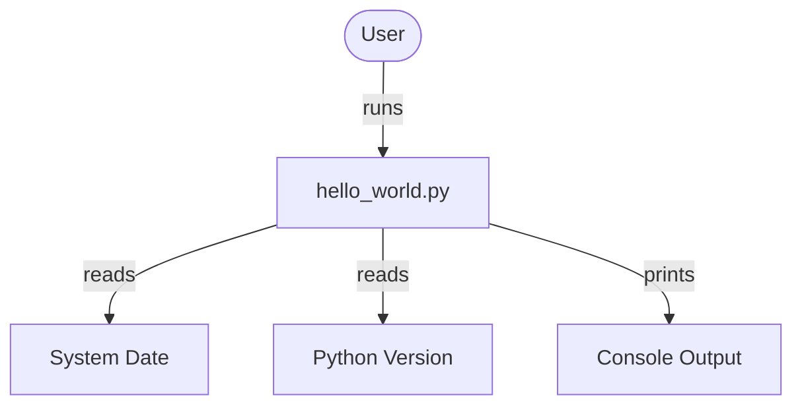
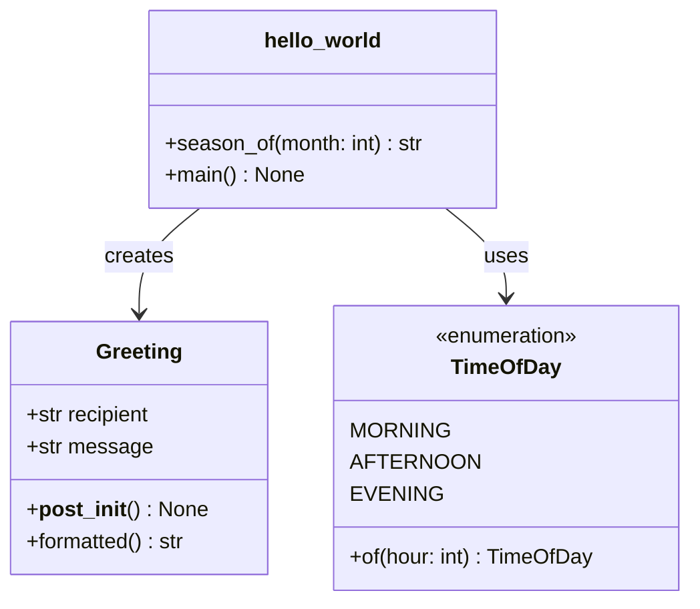
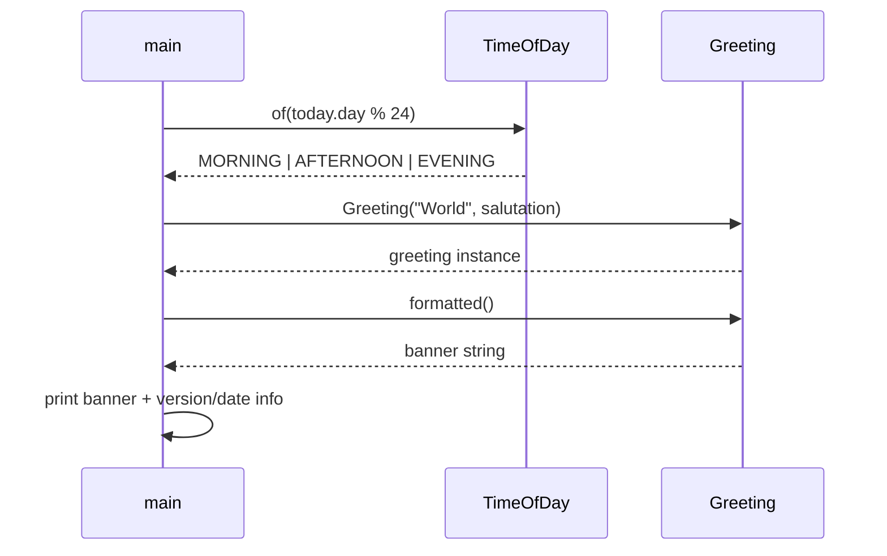

# copilot-test-ktruchcz

A Hello World application migrated from Java 21 to Python 3.10+.

## Running

```bash
python src/hello_world.py
```

## Testing

```bash
pip install -e .[test]
pytest tests/
```

## Architecture

### System Context



### Module Structure



### Runtime Flow

