# Architecture Documentation (Arc42)
**Project**: copilot-test-ktruchcz (HelloWorld)  
**Version**: 1.0.0  
**Date**: 2026-03-17  
**Generated by**: Arc42 Documentation Generator

---

## Table of Contents
1. [Introduction and Goals](#1-introduction-and-goals)
2. [Constraints](#2-constraints)
3. [Context and Scope](#3-context-and-scope)
4. [Solution Strategy](#4-solution-strategy)
5. [Building Block View](#5-building-block-view)
6. [Runtime View](#6-runtime-view)
7. [Deployment View](#7-deployment-view)
8. [Crosscutting Concepts](#8-crosscutting-concepts)
9. [Architecture Decisions](#9-architecture-decisions)
10. [Quality Requirements](#10-quality-requirements)
11. [Risks and Technical Debt](#11-risks-and-technical-debt)
12. [Glossary](#12-glossary)

---

## 1. Introduction and Goals

### 1.1 Business Context and Objectives

The `copilot-test-ktruchcz` project is a minimal Java application that serves as a demonstration and testing platform for the multi-agent code analysis framework. The application outputs a "Hello World" greeting to the standard output, representing the simplest possible entry point for a Java program.

**Key Objectives:**
- Demonstrate a working Java application structure
- Serve as a test subject for the code analysis orchestration framework
- Provide a baseline for verifying analysis agent functionality

### 1.2 Quality Goals

| Priority | Quality Goal | Motivation |
|----------|-------------|------------|
| 1 | Simplicity | Code should be easy to understand for any Java developer |
| 2 | Correctness | The application must compile and run without errors |
| 3 | Portability | Should run on any standard JVM without additional dependencies |

### 1.3 Stakeholders

| Stakeholder | Role | Expectations |
|-------------|------|-------------|
| Developer | Creator and maintainer | Clean, runnable Java source code |
| Analysis Framework | Automated code analysis tool | Parseable Java source with identifiable structures |
| Repository Owner (ktruchcz) | Project owner | Functional test subject for Copilot agent workflows |

---

## 2. Constraints

### 2.1 Technical Constraints

| Constraint | Description |
|-----------|-------------|
| **Language** | Java (any version supporting standard `public static void main`) |
| **No external dependencies** | The application uses only `java.lang` (implicitly imported) |
| **Single-file application** | The entire application is contained in `HelloWorld.java` |
| **Standard JDK** | Requires a standard JDK to compile; standard JRE to run |

### 2.2 Organizational Constraints

| Constraint | Description |
|-----------|-------------|
| **Repository structure** | Code resides in root directory alongside `.github/` agent configuration |
| **Agent framework** | Analysis agents are defined in `.github/agents/` and must not modify source files |
| **Output isolation** | All generated analysis outputs are stored in `analysis_output/` folder |

### 2.3 Conventions

- Java naming conventions: Class name (`HelloWorld`) matches file name (`HelloWorld.java`)
- Single `public` class per file
- Entry point via `public static void main(String[] args)`

---

## 3. Context and Scope

### 3.1 Business Context

The HelloWorld application operates as a standalone program with no external system integrations. Its sole external interaction is writing a greeting message to the console (standard output).

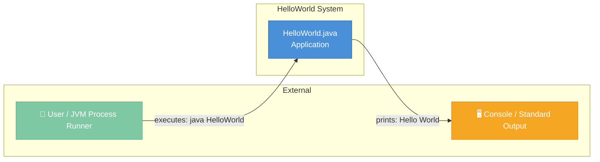

### 3.2 Technical Context

The application runs entirely within the Java Virtual Machine (JVM) with no network interfaces, database connections, or file system access beyond stdout.

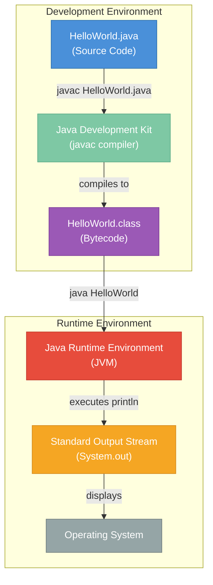

---

## 4. Solution Strategy

### 4.1 Technology Decisions

| Decision | Choice | Rationale |
|----------|--------|-----------|
| **Programming Language** | Java | Industry-standard, platform-independent, widely supported |
| **Runtime** | Standard JVM | No containerization required for this minimal application |
| **Architecture Style** | Procedural / single-class | Appropriate for the simplest possible demonstration |
| **Output Mechanism** | `System.out.println` | Standard Java idiom for console output |

### 4.2 Top-Level Decomposition

The application follows a single-entry-point pattern:

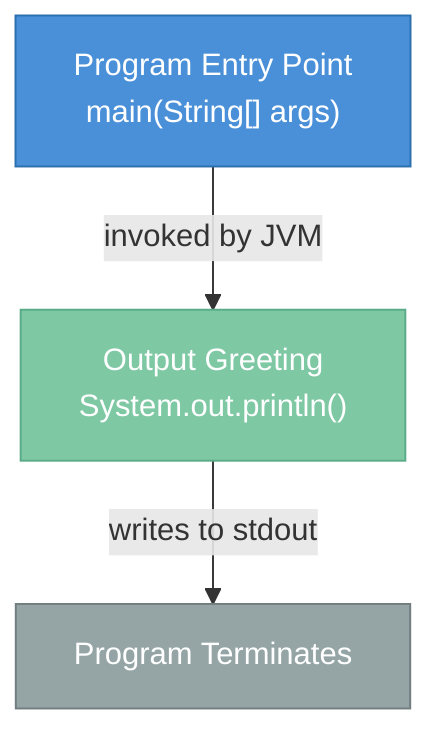

### 4.3 Approaches to Achieve Quality Goals

- **Simplicity**: Single class with one method; no unnecessary abstractions
- **Correctness**: Java compiler enforces syntax correctness; no runtime errors possible in this design
- **Portability**: Pure Java with no platform-specific APIs

---

## 5. Building Block View

### 5.1 Level 1: High-Level System

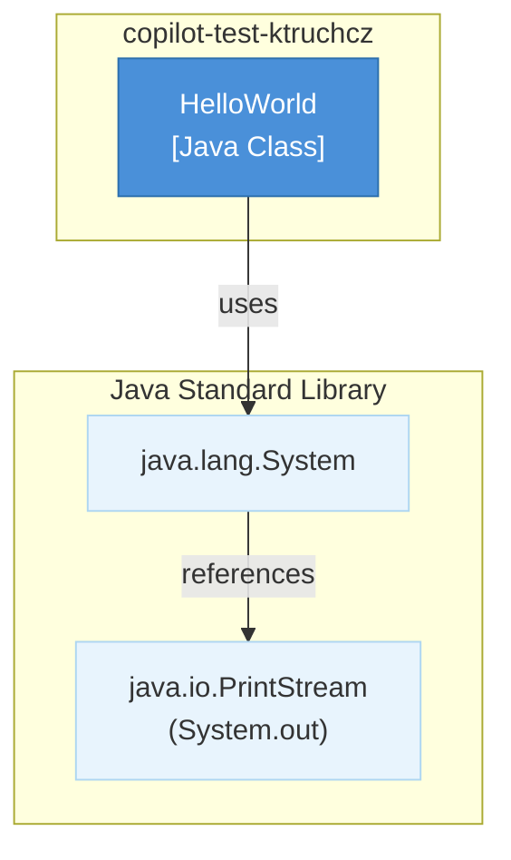

### 5.2 Level 2: Package Structure

The application has no explicit package declaration, residing in the default package.

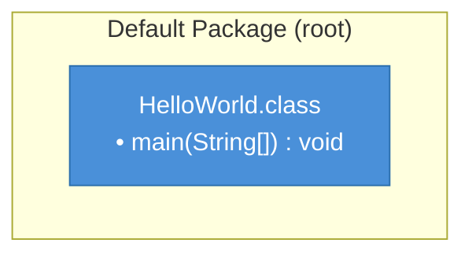

### 5.3 Level 3: Class Structure

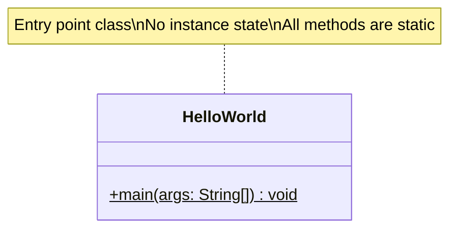

---

## 6. Runtime View

### 6.1 Main Execution Scenario: Program Start and Output

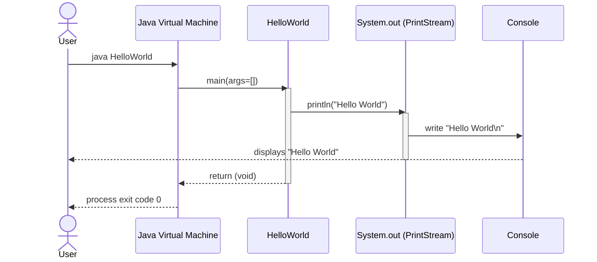

### 6.2 Business Process Flow

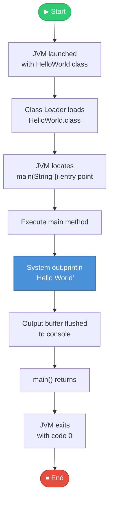

---

## 7. Deployment View

### 7.1 Infrastructure Requirements

| Component | Requirement |
|-----------|-------------|
| **Java Runtime** | JRE 8+ (or JDK for compilation) |
| **Memory** | Minimal (~32MB JVM heap) |
| **Operating System** | Any OS with JVM support (Windows, Linux, macOS) |
| **Network** | Not required |
| **Database** | Not required |
| **File System** | Read access to `HelloWorld.class` |

### 7.2 Deployment Topology

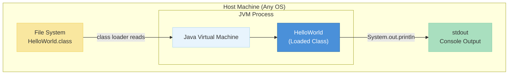

### 7.3 Deployment Steps

---

## 8. Crosscutting Concepts

### 8.1 Domain Model

The application domain is a minimal greeting system.

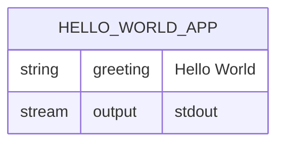

### 8.2 Design Patterns Identified

| Pattern | Usage |
|---------|-------|
| **Static Entry Point** | `main(String[] args)` — standard Java application entry point pattern |
| **Procedural Style** | No object instantiation; purely procedural execution flow |

### 8.3 Architecture Patterns

- **Single Responsibility**: The class has exactly one purpose — printing a greeting
- **No-dependency pattern**: Zero external libraries or frameworks required

### 8.4 Business Rules

1. **Output Rule**: The application always outputs the fixed string `"Hello World"` to standard output
2. **Termination Rule**: The application exits normally (exit code 0) after printing the greeting
3. **No-Input Rule**: Command-line arguments (`args`) are accepted but not processed

### 8.5 Error Handling Concepts

No explicit error handling is required for this application. The JVM handles:
- `OutOfMemoryError` — system-level
- `SecurityException` — if `System.out` access is restricted

---

## 9. Architecture Decisions

### ADR-001: Single Class, Default Package

**Status**: Accepted  
**Date**: Initial commit  
**Context**: Minimal demonstration application needs the simplest possible structure.  
**Decision**: Use a single public class in the default (unnamed) package.  
**Consequences**:  
- ✅ No package import statements needed
- ✅ Easier to compile and run from command line
- ⚠️ Not scalable for larger applications
- ⚠️ Default package is considered bad practice in production Java

---

### ADR-002: No Object Instantiation

**Status**: Accepted  
**Context**: The application needs to print one message and exit.  
**Decision**: Use only `static` context (no `new HelloWorld()` needed).  
**Consequences**:  
- ✅ Minimal memory footprint
- ✅ Direct, clear execution path
- ⚠️ Limits extensibility to OOP patterns

---

### ADR-003: Hardcoded Output String

**Status**: Accepted  
**Context**: The greeting is a fixed, well-known test string.  
**Decision**: Hardcode `"Hello World"` directly in the `println` call rather than externalizing it.  
**Consequences**:  
- ✅ No configuration files needed
- ✅ Immediate readability
- ⚠️ Changing the output requires source code modification and recompilation

---

## 10. Quality Requirements

### 10.1 Quality Tree

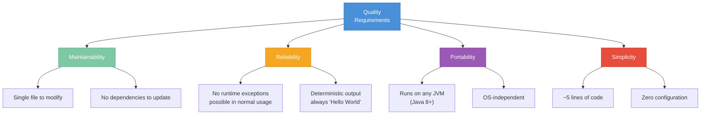

### 10.2 Quality Scenarios

| ID | Quality Attribute | Scenario | Response Measure |
|----|------------------|----------|-----------------|
| QS-1 | Reliability | JVM executes `java HelloWorld` | Prints "Hello World" and exits with code 0, 100% of the time |
| QS-2 | Portability | Compiled on Java 8, run on Java 21 JRE | Application executes without modification |
| QS-3 | Maintainability | Developer modifies the greeting string | Change requires editing 1 line in 1 file |
| QS-4 | Performance | Application start and completion time | Completes in < 1 second on any modern hardware |

### 10.3 Technical Debt Summary

| Category | Debt Item | Priority | Effort to Fix |
|----------|-----------|----------|---------------|
| Architecture | Default (unnamed) package | Low | Low — add `package` declaration |
| Maintainability | Hardcoded string | Low | Low — externalize to constant or config |
| Documentation | Minimal README | Medium | Low — expand README.md |

---

## 11. Risks and Technical Debt

### 11.1 Identified Risks

| ID | Risk | Probability | Impact | Mitigation |
|----|------|------------|--------|------------|
| R-1 | JVM version incompatibility | Very Low | Low | Test on target JVM versions |
| R-2 | `System.out` restricted by SecurityManager | Very Low | Low | No mitigation needed for demo use |
| R-3 | Class name conflict in default package | Low | Low | Move to named package if project grows |

### 11.2 Technical Debt Items

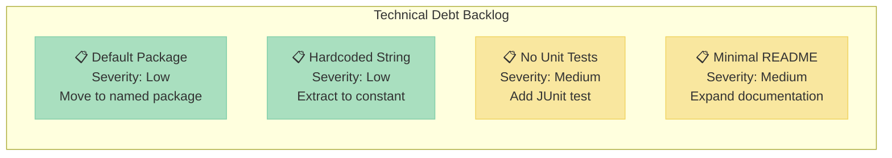

### 11.3 Mitigation Strategies

1. **For No Unit Tests**: Add a JUnit 5 test that captures `System.out` and asserts the output equals `"Hello World\n"`
2. **For Default Package**: Introduce a package declaration (e.g., `package com.ktruchcz.demo;`)
3. **For Minimal README**: Add build instructions, prerequisites, and usage examples
4. **For Hardcoded String**: Extract to a `public static final String GREETING = "Hello World";` constant

---

## 12. Glossary

| Term | Definition |
|------|-----------|
| **Arc42** | A template for software and system architecture documentation, structured in 12 sections |
| **JVM** | Java Virtual Machine — the runtime environment that executes Java bytecode |
| **JDK** | Java Development Kit — includes the Java compiler (`javac`) and the JRE |
| **JRE** | Java Runtime Environment — includes the JVM and standard class libraries |
| **Bytecode** | Platform-independent intermediate representation compiled from Java source code (`.class` files) |
| **Entry Point** | The `public static void main(String[] args)` method that serves as the program's starting point |
| **Default Package** | In Java, classes without a `package` declaration reside in the unnamed/default package |
| **stdout** | Standard output stream — the default output destination for `System.out.println()` |
| **Hello World** | Traditional first program in any programming language; prints "Hello World" to the console |
| **Mermaid** | A JavaScript-based diagramming tool using text definitions to generate diagrams |
| **ADR** | Architecture Decision Record — a document capturing an architectural decision and its rationale |
| **Static Method** | A method belonging to the class itself, not to a class instance; callable without instantiation |

---

*Generated by: arc42-documentor agent*  
*Source analyzed: `HelloWorld.java`*  
*Framework: copilot-test-ktruchcz multi-agent code analysis*
