# Architecture Documentation (Arc42)

**Project**: copilot-test-ktruchcz  
**Version**: 1.0.0  
**Date**: 2025-01-01  
**Generated by**: Arc42 Documentation Generator  
**Source**: `/home/runner/work/copilot-test-ktruchcz/copilot-test-ktruchcz`

---

## Table of Contents

1. [Introduction and Goals](#1-introduction-and-goals)
2. [Architecture Constraints](#2-architecture-constraints)
3. [System Scope and Context](#3-system-scope-and-context)
4. [Solution Strategy](#4-solution-strategy)
5. [Building Block View](#5-building-block-view)
6. [Runtime View](#6-runtime-view)
7. [Deployment View](#7-deployment-view)
8. [Cross-cutting Concepts](#8-cross-cutting-concepts)
9. [Architecture Decisions](#9-architecture-decisions)
10. [Quality Requirements](#10-quality-requirements)
11. [Risks and Technical Debt](#11-risks-and-technical-debt)
12. [Glossary](#12-glossary)

---

## 1. Introduction and Goals

> **Sources analyzed**: `HelloWorld.java`, `README.md`

### 1.1 Purpose and Business Context

**copilot-test-ktruchcz** is a minimal Java application whose sole runtime behavior is to print the string `"Hello World"` to standard output. While functionally trivial, this repository serves as a **reference baseline** and **infrastructure test-bed** for a sophisticated multi-agent code analysis and documentation pipeline — evidenced by the 15 agent definition files found under `.github/agents/`.

The project therefore has two overlapping purposes:

| Purpose | Description |
|---------|-------------|
| **Demonstration** | Prove that the Java toolchain (compiler → JVM) is correctly configured and operational in the target environment. |
| **Pipeline Validation** | Provide a known-good, zero-dependency codebase that all analysis agents (AST analyzer, UML generator, BPMN generator, code assessor, etc.) can process end-to-end without encountering unexpected language features or third-party dependencies. |

### 1.2 Quality Goals

The following top-level quality goals have been derived from the structure and intent of the codebase:

| Priority | Quality Goal | Motivation |
|----------|-------------|------------|
| 1 | **Correctness** | The program must compile without errors and produce the exact output `"Hello World\n"` on every execution. |
| 2 | **Simplicity** | The codebase must remain trivially understandable — a single class, a single method, a single statement — so that it acts as a clean benchmark for tooling. |
| 3 | **Portability** | The program must run on any standard JVM (Java 1.0+) without modification, enabling validation across heterogeneous CI environments. |
| 4 | **Analyzability** | The source must be structured in a way that all downstream analysis agents can parse, analyze, and document it without encountering errors or edge cases. |

### 1.3 Stakeholders

| Stakeholder | Role | Expectations |
|-------------|------|--------------|
| **Developer / Engineer** | Writes and maintains the source code | The code compiles and runs correctly; no runtime errors. |
| **CI/CD Pipeline** | Automated build and test runner | Build succeeds; output matches expected string. |
| **Analysis Agents** | Automated code analysis tools (15 agents) | A parseable, well-formed Java source file with deterministic behavior. |
| **Architecture Reviewer** | Consumes this documentation | A clear, complete Arc42 document describing even a simple system in full. |
| **Project Owner (ktruchcz)** | Repository owner | Proof that the full analysis and documentation pipeline operates correctly on their repository. |

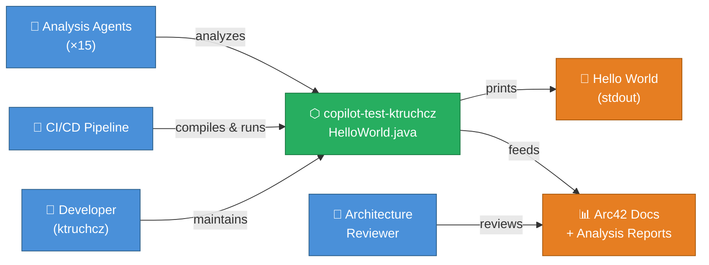

---

## 2. Architecture Constraints

> **Sources analyzed**: `HelloWorld.java`, `.gitignore`, `.github/agents/`

### 2.1 Technical Constraints

| ID | Constraint | Rationale / Source |
|----|-----------|-------------------|
| TC-01 | **Language: Java** | The sole source file is `HelloWorld.java`. The entire system is implemented in Java. |
| TC-02 | **No external dependencies** | There are no `pom.xml`, `build.gradle`, `build.xml`, or any other build descriptor files. The application uses only `java.lang` (implicitly imported). |
| TC-03 | **Standard JDK only** | `System.out.println` is part of `java.lang.System`, available since Java 1.0. No JDK version above 1.0 is required. |
| TC-04 | **Single compilation unit** | One `.java` file compiles to one `.class` file. The `.gitignore` explicitly excludes `*.class` artifacts from version control. |
| TC-05 | **No build tool enforced** | The absence of any build descriptor means compilation is performed with raw `javac`. No Maven, Gradle, Ant, or Bazel configuration exists. |
| TC-06 | **No package declaration** | `HelloWorld` belongs to the default (unnamed) package, limiting modularity and namespace management. |
| TC-07 | **No test framework** | There are no test source files or test framework dependencies (JUnit, TestNG, etc.). |

### 2.2 Organizational Constraints

| ID | Constraint | Rationale / Source |
|----|-----------|-------------------|
| OC-01 | **GitHub-hosted repository** | The project is stored on GitHub under the account `ktruchcz` (inferred from repo path `copilot-test-ktruchcz`). |
| OC-02 | **Agent-based analysis pipeline** | The `.github/agents/` directory contains 15 agent definition files, indicating an organizational standard for automated code analysis. |
| OC-03 | **Minimal README policy** | The `README.md` contains only the project name. There is no enforced documentation standard beyond what the analysis pipeline generates. |
| OC-04 | **Version control via Git** | The presence of `.git/` and `.gitignore` mandates Git as the version control system. |

### 2.3 Conventions

| ID | Convention | Source |
|----|-----------|--------|
| CV-01 | **Java naming conventions** | Class name `HelloWorld` follows UpperCamelCase; method name `main` follows lowerCamelCase. |
| CV-02 | **Entry point signature** | `public static void main(String[] args)` follows the standard Java application entry point contract. |
| CV-03 | **Compiled artifacts excluded from VCS** | `.gitignore` pattern `*.class` prevents binary artifacts from entering version control. |

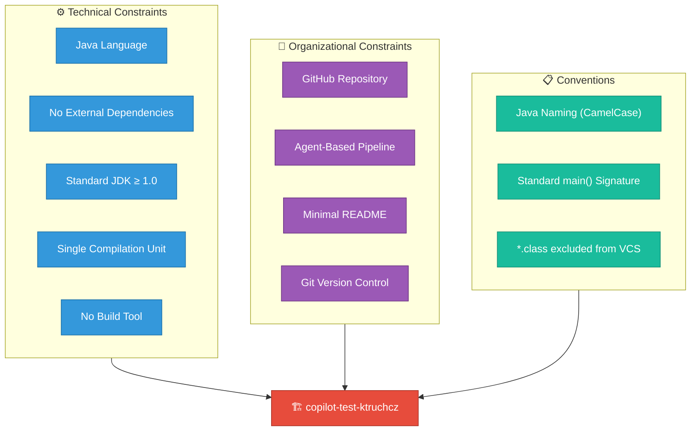

---

## 3. System Scope and Context

> **Sources analyzed**: `HelloWorld.java` (no external interfaces, no I/O beyond stdout)

### 3.1 Business Context

The `copilot-test-ktruchcz` system sits at the center of two interaction environments:

1. **Direct execution environment** — a human or automated process invokes the JVM, which runs the program and consumes its output.
2. **Analysis environment** — static analysis agents consume the source code (not the running program) to generate documentation, metrics, and diagrams.

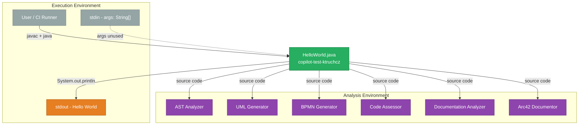

### 3.2 Technical Context

The system has no external network interfaces, no database connections, no file I/O (other than writing to the JVM's standard output stream), and no inter-process communication.

| Interface | Direction | Protocol / Technology | Description |
|-----------|-----------|----------------------|-------------|
| `System.out` (stdout) | OUT | JVM standard output stream | Single line: `Hello World` followed by newline |
| `args: String[]` | IN | JVM command-line arguments | Accepted by signature but completely ignored at runtime |
| Source file (`HelloWorld.java`) | IN | UTF-8 text file | Read by `javac` compiler and static analysis tools |
| Bytecode (`HelloWorld.class`) | OUT | JVM bytecode | Produced by `javac`; excluded from VCS via `.gitignore` |

### 3.3 External Systems and Dependencies

| System | Type | Interaction | Notes |
|--------|------|-------------|-------|
| **JDK / javac** | Tooling | Compiles `HelloWorld.java` → `HelloWorld.class` | Any JDK ≥ 1.0 |
| **JVM / java** | Runtime | Executes `HelloWorld.class` | Any JRE ≥ 1.0 |
| **GitHub** | SCM Platform | Hosts the repository; triggers CI | `github.com/ktruchcz/copilot-test-ktruchcz` |
| **Analysis Agent Pipeline** | Static Analysis | Reads source code; produces reports | 15 agents defined in `.github/agents/` |
| **Operating System** | Infrastructure | Provides stdout, process management | Any OS supporting a JVM |

> **Boundary note**: The `HelloWorld` system has **zero runtime dependencies** on any external system. All interactions at runtime are mediated through the JVM and the OS standard I/O layer.

---

## 4. Solution Strategy

> **Sources analyzed**: `HelloWorld.java` (language, structure, API usage)

### 4.1 Core Technology Decisions

| Decision | Choice | Rationale |
|----------|--------|-----------|
| **Programming Language** | Java | Ubiquitous, platform-independent, JVM-hosted; ideal for cross-environment CI validation. |
| **Runtime Platform** | Java Virtual Machine (JVM) | Provides write-once-run-anywhere portability. |
| **Application Type** | Command-line application (CLI) | Entry via `public static void main(String[] args)` — the simplest possible executable unit in Java. |
| **Output Mechanism** | `System.out.println` | Standard Java API for writing to the process's standard output stream; no logging framework required. |
| **Dependency Management** | None (zero dependencies) | Maximum simplicity and portability; eliminates all transitive dependency risks. |
| **Build Tool** | None (raw `javac`) | One source file; no build automation required. |
| **Architecture Style** | Single-class monolith | Appropriate for a single-responsibility, single-statement application. |

### 4.2 Top-Level Decomposition

The entire system decomposes into a single logical unit:

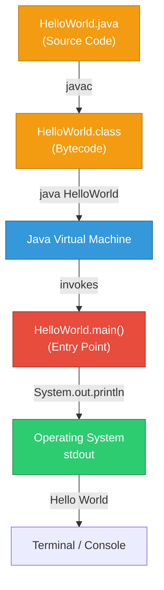

### 4.3 Quality Goal Achievement Strategy

| Quality Goal | Strategy | Implementation |
|-------------|----------|---------------|
| **Correctness** | Direct, side-effect-free logic | Single `println` call with a string literal — no branches, no state, no errors possible. |
| **Simplicity** | Minimalism by design | One class, one method, one statement. No abstraction layers. |
| **Portability** | JVM platform independence | Pure `java.lang` API; no OS-specific calls; no native code. |
| **Analyzability** | Standard Java constructs only | No generics, lambdas, annotations, or reflection — plain Java 1.0 syntax. |

### 4.4 Approach to Key Challenges

| Challenge | Approach |
|-----------|----------|
| Ensuring deterministic output | Hardcoded string literal `"Hello World"` — no runtime variability. |
| Cross-platform execution | JVM abstraction layer handles all OS differences. |
| Maintainability | Code is so simple it requires no maintenance strategy beyond "do not change it". |
| Testability | Output can be tested by capturing `System.out` in a test harness or by comparing process stdout to expected value. |

---

## 5. Building Block View

> **Sources analyzed**: `HelloWorld.java` (AST: 1 class, 1 method, 1 statement)

### 5.1 Level 1 — Whitebox: Overall System

The system consists of a single top-level building block: the `HelloWorld` class.

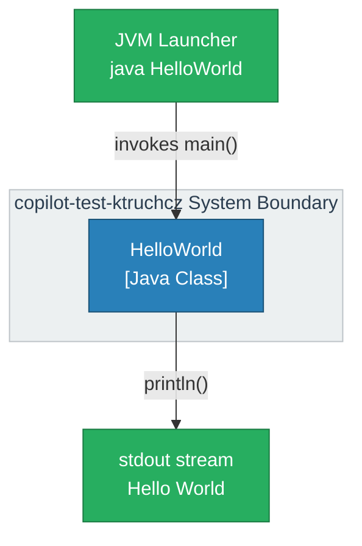

**Building Block: `HelloWorld`**

| Property | Value |
|----------|-------|
| **Type** | Public class |
| **Package** | Default (unnamed) |
| **Source file** | `HelloWorld.java` |
| **Bytecode file** | `HelloWorld.class` (generated, not tracked in VCS) |
| **Responsibility** | Application entry point; prints `"Hello World"` to stdout |
| **Interfaces provided** | `main(String[] args)` — standard Java CLI entry point |
| **Interfaces required** | `java.lang.System.out` (implicit via `java.lang.*`) |

### 5.2 Level 2 — Whitebox: `HelloWorld` Class Internals

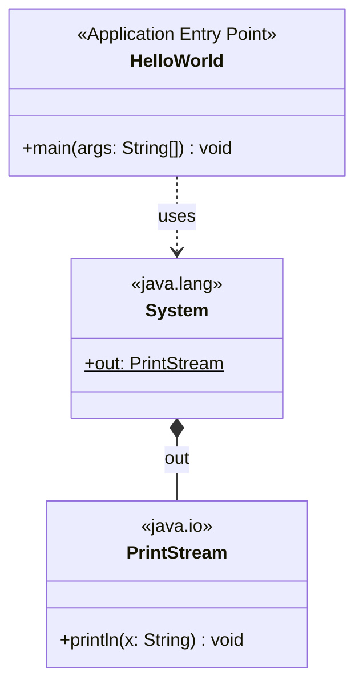

**Method inventory:**

| Method | Visibility | Static | Return Type | Parameters | Description |
|--------|-----------|--------|-------------|------------|-------------|
| `main` | `public` | ✅ yes | `void` | `String[] args` | JVM entry point; calls `System.out.println("Hello World")` |

**Statement inventory (inside `main`):**

| # | Statement | Type | Side Effect |
|---|-----------|------|-------------|
| 1 | `System.out.println("Hello World")` | Method invocation | Writes `"Hello World\n"` to stdout |

### 5.3 Level 3 — Dependency Graph

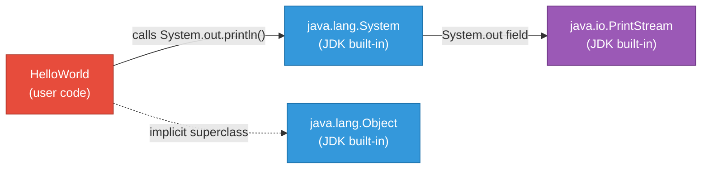

> **Note**: `HelloWorld` implicitly extends `java.lang.Object` (all Java classes do). It uses `java.lang.System` (auto-imported) and `java.io.PrintStream` (accessed via `System.out`). There are no user-defined dependencies.

---

## 6. Runtime View

> **Sources analyzed**: `HelloWorld.java` (runtime behavior: single `println` invocation)

### 6.1 Scenario 1 — Normal Execution

The primary (and only) runtime scenario is a successful invocation of the application.

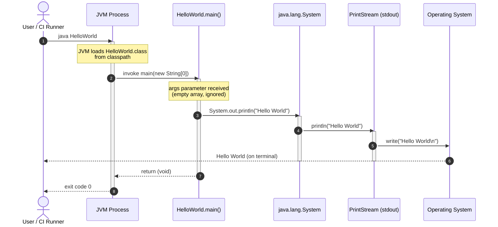

### 6.2 Scenario 2 — Compilation Step

Before execution, the source code must be compiled. This is a pre-runtime scenario performed by the developer or CI pipeline.

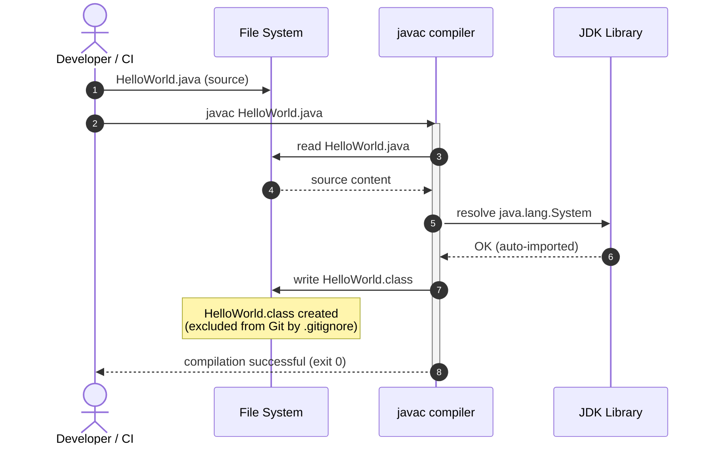

### 6.3 Scenario 3 — Static Analysis Pipeline Execution

The analysis agents consume the source code without executing it.

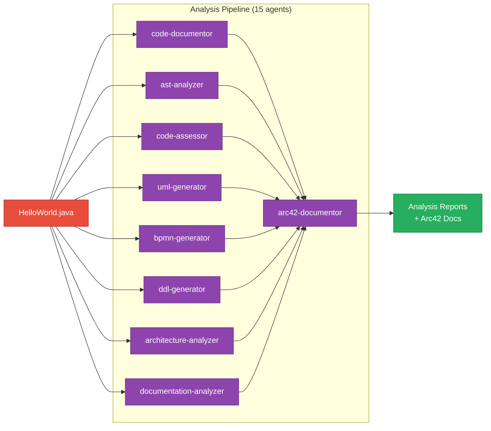

### 6.4 Runtime State Diagram

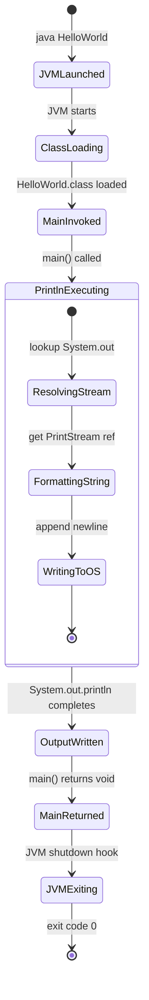

### 6.5 Runtime Characteristics

| Characteristic | Value | Notes |
|---------------|-------|-------|
| **Execution time** | < 100ms | Dominated by JVM startup overhead, not logic |
| **Memory footprint** | ~10–50 MB | JVM baseline heap allocation |
| **Thread count** | 1 (main thread) + JVM GC threads | No user-created threads |
| **Exit code** | `0` (success) on all normal executions | No exception paths in user code |
| **Output** | Exactly `Hello World\n` (10 chars + newline) | Deterministic, invariant |
| **State** | Stateless | No instance variables, no global state |

---

## 7. Deployment View

> **Sources analyzed**: `HelloWorld.java`, `.gitignore` (artifact exclusion), `.github/` (CI infrastructure)

### 7.1 Infrastructure Overview

The application can be deployed and executed on any infrastructure that provides a Java Runtime Environment (JRE). There is no server, no container requirement, no network service, and no persistent storage.

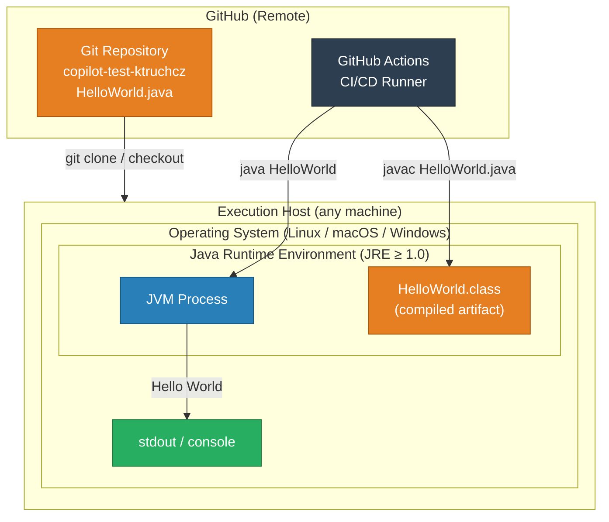

### 7.2 Deployment Scenarios

#### Scenario A — Developer Local Machine

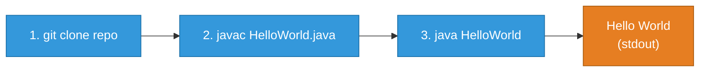

**Requirements:**
- Git client
- JDK ≥ 1.0 (includes `javac` + `java`)
- Any OS

#### Scenario B — GitHub Actions CI/CD

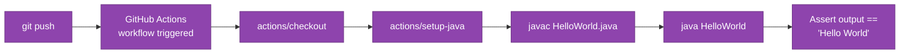

### 7.3 Deployment Topology

| Node | Type | Software Required | Hosted Artifacts |
|------|------|------------------|-----------------|
| **Developer workstation** | Physical/VM | Git, JDK ≥ 1.0 | `HelloWorld.java`, `HelloWorld.class` (local) |
| **GitHub.com** | SaaS / Cloud | N/A | `HelloWorld.java`, `README.md`, `.gitignore`, `.github/` |
| **GitHub Actions runner** | Ephemeral VM | Ubuntu (default), JDK (via setup-java) | Cloned repo + compiled `.class` |

### 7.4 System Requirements

| Requirement | Minimum | Recommended |
|-------------|---------|-------------|
| **Java version** | JRE 1.0 | JDK 17 LTS or later |
| **RAM** | 32 MB | 256 MB |
| **Disk space** | < 1 MB (source + bytecode) | N/A |
| **Network** | None (runtime) | Git access for checkout |
| **OS** | Any JVM-supported OS | Linux x64 (CI standard) |
| **CPU** | Any | Any |

> **Note**: The `.gitignore` file containing `*.class` ensures compiled bytecode artifacts are **never committed** to the repository. Each deployment environment must compile from source.

---

## 8. Cross-cutting Concepts

> **Sources analyzed**: `HelloWorld.java` (design patterns, error handling, logging, security, testability)

### 8.1 Domain Model

The domain model for this application is trivially simple — there are no domain entities, value objects, or aggregates. The "domain" is the concept of a greeting message.

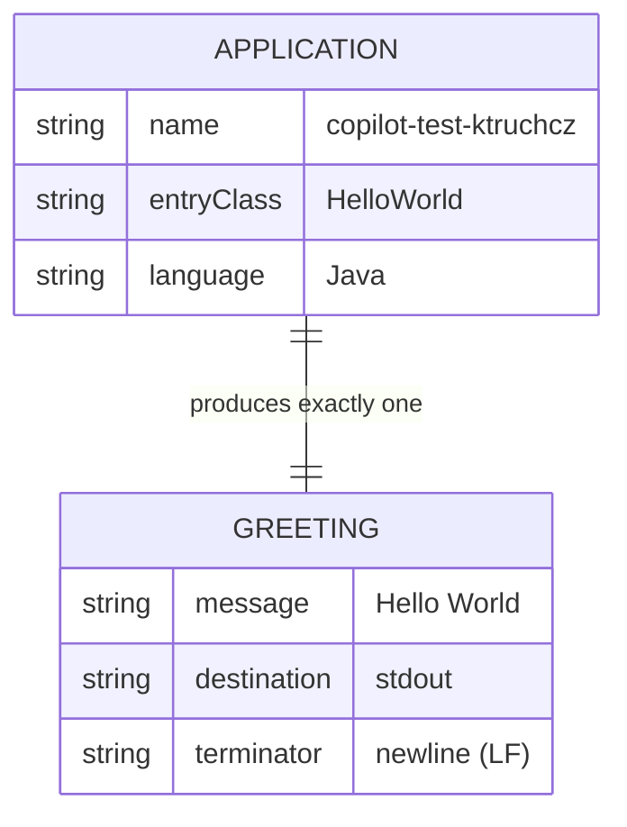

### 8.2 Design Patterns

| Pattern | Applied? | Evidence | Notes |
|---------|---------|---------|-------|
| **Singleton** | ❌ | No instance creation | Class is never instantiated; only static methods used |
| **Factory** | ❌ | N/A | No object creation required |
| **Observer** | ❌ | N/A | No events |
| **Strategy** | ❌ | N/A | Single fixed behavior |
| **Template Method** | ✅ (implicit) | `public static void main(String[])` | The JVM `main` contract is a form of template method — the JVM calls a fixed-signature entry point that the user fills in. |

### 8.3 Error Handling and Exception Strategy

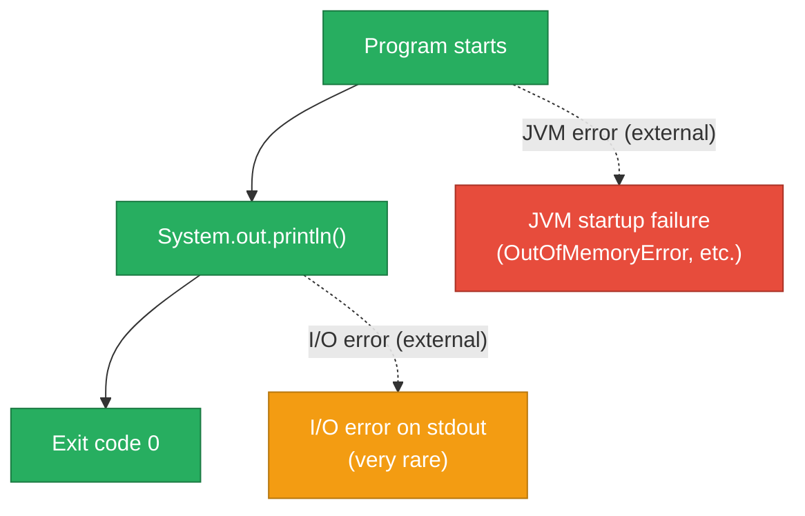

**Error handling analysis:**
- `HelloWorld.main()` contains **zero try/catch blocks**
- The only possible exceptions are thrown by the JVM itself (e.g., `OutOfMemoryError`) or by the underlying OS I/O layer — neither is catchable in user code under normal circumstances
- `System.out.println` does not declare checked exceptions; it silently swallows I/O errors internally (Java behavior)
- **Assessment**: The error handling strategy is appropriate for the application's scope

### 8.4 Logging and Observability

| Concern | Implementation | Assessment |
|---------|---------------|------------|
| **Application logging** | None | ❌ No logging framework (SLF4J, Log4j, java.util.logging). Acceptable for this scope. |
| **Metrics** | None | ❌ No metrics instrumentation. Acceptable. |
| **Tracing** | None | ❌ No distributed tracing. Acceptable. |
| **Audit trail** | None | ❌ Not applicable. |
| **Output observability** | `System.out.println` | ✅ The program's only output IS its observable behavior. Capturing stdout is sufficient for verification. |

### 8.5 Security Concepts

| Security Concern | Status | Notes |
|-----------------|--------|-------|
| **Input validation** | N/A | `args[]` is ignored; no user input is processed |
| **Authentication / Authorization** | N/A | No user-facing service |
| **Data sensitivity** | None | Output is the literal string `"Hello World"` — no PII, no secrets |
| **Injection vulnerabilities** | None | No string interpolation from external input |
| **Dependency vulnerabilities** | None | Zero third-party dependencies |
| **Code execution risk** | Minimal | Only JDK standard library used |

### 8.6 Testability

Although no tests exist in the repository, the application is highly testable:

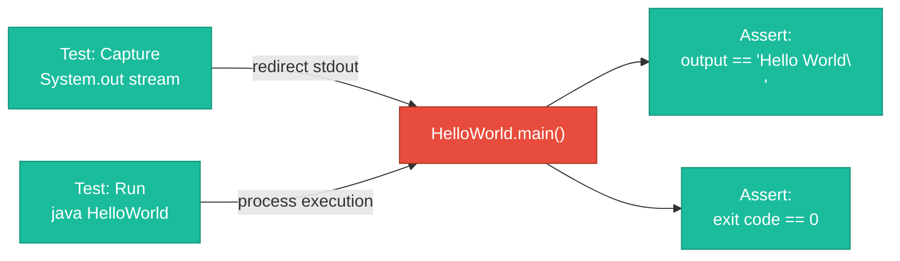

**Recommended test approaches:**

| Approach | Framework | Description |
|----------|-----------|-------------|
| **Unit test** | JUnit 5 | Redirect `System.out` to a `ByteArrayOutputStream`; call `HelloWorld.main(new String[]{})` directly; assert output. |
| **Integration test** | JUnit 5 + Process API | Use `ProcessBuilder` to launch `java HelloWorld`; capture stdout; assert equals `"Hello World\n"`. |
| **CI smoke test** | Shell script | `java HelloWorld | grep -q "Hello World" && echo PASS` |

### 8.7 Internationalization (i18n)

| Aspect | Status | Notes |
|--------|--------|-------|
| **Locale-sensitive output** | ❌ None | The string `"Hello World"` is a hardcoded English literal; no locale-aware formatting. |
| **Character encoding** | UTF-8 (source file) | The `.java` source is standard ASCII; `"Hello World"` contains only ASCII characters. |
| **Extensibility for i18n** | Would require refactoring | To support multiple languages, the string literal would need to be externalized to a `ResourceBundle`. |

---

## 9. Architecture Decisions

> **Sources analyzed**: `HelloWorld.java`, `.gitignore`, absence of build files and dependencies

The following Architecture Decision Records (ADRs) document the key architectural choices identified in the codebase.

---

### ADR-001: Java as the Implementation Language

| Field | Value |
|-------|-------|
| **Status** | Accepted |
| **Date** | Inferred from repository |
| **Deciders** | Project owner (ktruchcz) |

**Context**: A demonstration/test application needs to be created to validate a multi-agent analysis pipeline. A language must be chosen.

**Decision**: Use Java.

**Rationale**:
- Java is the most widely analyzed language across static analysis tooling ecosystems
- The JVM provides platform independence, enabling validation across Linux, macOS, and Windows runners
- Java's verbose, explicit syntax is easier to parse by AST analyzers and code assessment tools
- Java 1.0 syntax requires zero modern language feature support from analysis agents

**Consequences**:
- ✅ Compatible with virtually all CI environments
- ✅ Maximal compatibility with analysis agent tooling
- ✅ No runtime installation beyond standard JDK
- ⚠️ Requires JDK/JRE installation on execution host
- ⚠️ JVM startup overhead (~50-100ms) dwarfs the actual execution time

---

### ADR-002: No Build Tool

| Field | Value |
|-------|-------|
| **Status** | Accepted |
| **Date** | Inferred from repository |
| **Deciders** | Project owner (ktruchcz) |

**Context**: Building a single-file Java application. A build tool (Maven, Gradle, Ant) could be used.

**Decision**: Use raw `javac`/`java` with no build descriptor.

**Rationale**:
- A single `.java` file does not justify the complexity of a build tool configuration
- Eliminates all build tool version compatibility concerns
- Removes transitive dependency resolution as a failure mode
- Simplifies the CI/CD pipeline to two shell commands

**Consequences**:
- ✅ Zero configuration overhead
- ✅ No `pom.xml`/`build.gradle` for agents to misinterpret
- ❌ No dependency management capability (acceptable: zero dependencies needed)
- ❌ No lifecycle management (test/package/deploy phases)
- ❌ Scaling to a multi-file project would require introducing a build tool

---

### ADR-003: Default (Unnamed) Package

| Field | Value |
|-------|-------|
| **Status** | Accepted |
| **Date** | Inferred from repository |
| **Deciders** | Project owner (ktruchcz) |

**Context**: Java classes can be placed in named packages (e.g., `com.example.hello`) or the default unnamed package.

**Decision**: Use the default unnamed package (no `package` declaration).

**Rationale**:
- Appropriate for a single-class demonstration application
- Eliminates directory structure requirements for compilation
- Simplifies the compile/run commands (`javac HelloWorld.java` rather than `javac com/example/HelloWorld.java`)

**Consequences**:
- ✅ Simplest possible compile/run workflow
- ❌ Cannot be imported by classes in named packages
- ❌ Not appropriate for production software
- ⚠️ Violates Java best practice for non-trivial applications

---

### ADR-004: Exclude Compiled Artifacts from Version Control

| Field | Value |
|-------|-------|
| **Status** | Accepted |
| **Date** | Inferred from `.gitignore` |
| **Deciders** | Project owner (ktruchcz) |

**Context**: Java compilation produces `.class` bytecode files alongside source files.

**Decision**: Add `*.class` to `.gitignore`.

**Rationale**:
- Binary artifacts should not be version-controlled alongside source code
- `.class` files are reproducibly generated from source; storing them adds no value
- Prevents merge conflicts on binary files
- Follows universal Java/Git best practice

**Consequences**:
- ✅ Clean repository with source code only
- ✅ Each environment compiles its own bytecode
- ❌ Compilation step required before first run in any environment

---

### ADR-005: Hardcoded Output String

| Field | Value |
|-------|-------|
| **Status** | Accepted |
| **Date** | Inferred from `HelloWorld.java` |
| **Deciders** | Project owner (ktruchcz) |

**Context**: The output string `"Hello World"` could be externalized to a configuration file, environment variable, or `ResourceBundle`.

**Decision**: Hardcode the string literal `"Hello World"` directly in `System.out.println()`.

**Rationale**:
- The purpose of the application is to demonstrate compilation and execution, not configurability
- A hardcoded string makes the behavior 100% deterministic and testable
- No configuration management is needed or desired

**Consequences**:
- ✅ Deterministic, reproducible output
- ✅ Zero runtime configuration required
- ❌ Cannot change output without recompilation
- ❌ No i18n/l10n support

---

## 10. Quality Requirements

> **Sources analyzed**: `HelloWorld.java` (code metrics), absence of tests, build tooling, and documentation

### 10.1 Quality Tree

```mermaid
graph TD
    classDef root fill:#2C3E50,stroke:#1A252F,color:#fff
    classDef cat fill:#2980B9,stroke:#1A5276,color:#fff
    classDef goal fill:#27AE60,stroke:#1A7A42,color:#fff
    classDef metric fill:#F39C12,stroke:#B7770D,color:#000

    ROOT["Quality\nRequirements"]:::root

    FUNC["Functional\nSuitability"]:::cat
    REL["Reliability"]:::cat
    MAINT["Maintainability"]:::cat
    PORT["Portability"]:::cat
    PERF["Performance\nEfficiency"]:::cat
    SEC["Security"]:::cat

    ROOT --> FUNC
    ROOT --> REL
    ROOT --> MAINT
    ROOT --> PORT
    ROOT --> PERF
    ROOT --> SEC

    F1["Correct output:\nHello World + newline"]:::goal
    F2["No runtime\nexceptions"]:::goal

    R1["Fault tolerance:\nno failure paths\nin user code"]:::goal
    R2["Availability:\nlimited only by\nJVM/OS"]:::goal

    M1["Analyzability:\nplain Java 1.0 syntax"]:::goal
    M2["Simplicity:\n1 class, 1 method,\n1 statement"]:::goal
    M3["Testability:\nstdout capturable"]:::goal

    P1["JVM portability:\nany OS"]:::goal
    P2["No native code\nor OS calls"]:::goal

    PE1["Startup: <100ms\n(JVM dominated)"]:::goal

    S1["No input processing:\nzero injection risk"]:::goal
    S2["Zero dependencies:\nno CVEs possible"]:::goal

    FUNC --> F1
    FUNC --> F2
    REL --> R1
    REL --> R2
    MAINT --> M1
    MAINT --> M2
    MAINT --> M3
    PORT --> P1
    PORT --> P2
    PERF --> PE1
    SEC --> S1
    SEC --> S2
```

### 10.2 Quality Scenarios

| ID | Quality Attribute | Scenario | Expected Response | Priority |
|----|------------------|----------|------------------|----------|
| QS-01 | **Correctness** | A developer runs `java HelloWorld` on any supported JVM | Output is exactly `Hello World\n`, exit code 0 | 🔴 Critical |
| QS-02 | **Correctness** | A CI pipeline asserts the program output | Output matches the expected string with zero variance | 🔴 Critical |
| QS-03 | **Portability** | The program is compiled and run on Linux, macOS, and Windows | Identical behavior on all platforms | 🟠 High |
| QS-04 | **Portability** | The program is compiled with JDK 8, 11, 17, and 21 | Compiles and runs without warnings or errors on all versions | 🟠 High |
| QS-05 | **Analyzability** | An AST analyzer processes `HelloWorld.java` | The analyzer correctly identifies 1 class, 1 method, 1 statement | 🟡 Medium |
| QS-06 | **Maintainability** | A new developer reads the source code for the first time | The entire program is understood within 5 seconds | 🟡 Medium |
| QS-07 | **Performance** | The program is invoked 100 times consecutively | No degradation; each execution takes < 500ms (JVM startup included) | 🟢 Low |
| QS-08 | **Security** | The program is run with arbitrary command-line arguments | Arguments are silently ignored; no unexpected behavior | 🟡 Medium |

### 10.3 Code Quality Metrics

The following metrics are derived from static analysis of `HelloWorld.java`:

| Metric | Value | Industry Benchmark | Assessment |
|--------|-------|-------------------|------------|
| **Lines of Code (total)** | 5 | N/A | ✅ Minimal |
| **Lines of Code (logic)** | 1 | N/A | ✅ Single statement |
| **Cyclomatic Complexity** | 1 | ≤ 10 per method | ✅ Lowest possible (no branches) |
| **Cognitive Complexity** | 0 | ≤ 15 per method | ✅ Zero (no control flow) |
| **Class count** | 1 | N/A | ✅ |
| **Method count** | 1 | N/A | ✅ |
| **Parameter count (main)** | 1 | ≤ 7 | ✅ |
| **Nesting depth** | 1 | ≤ 4 | ✅ |
| **Comment lines** | 0 | Project-dependent | ⚠️ No documentation in code |
| **Test coverage** | 0% | ≥ 80% | ❌ No tests exist |
| **Dependency count** | 0 | Minimize | ✅ Zero |
| **Duplicate code** | 0% | 0% | ✅ |
| **Technical debt ratio** | ~0% | ≤ 5% | ✅ |

### 10.4 ISO 25010 Quality Model Compliance

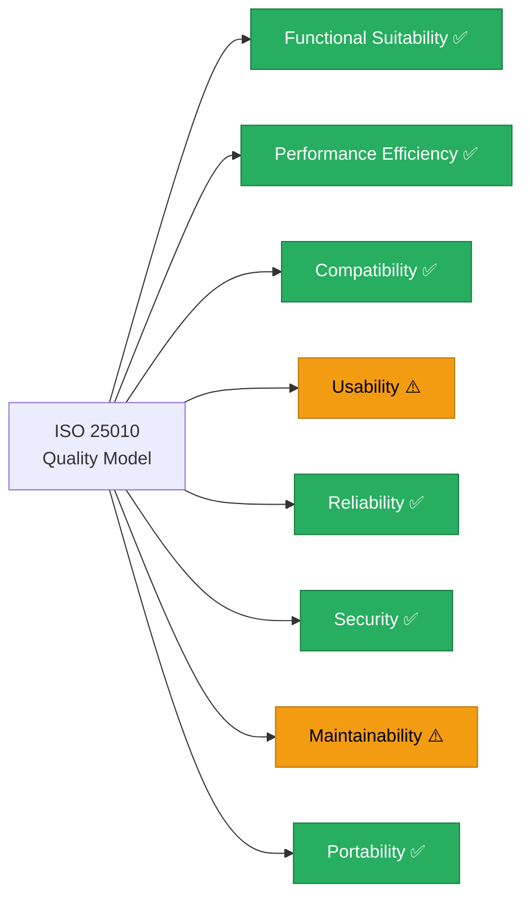

| Quality Characteristic | Score | Notes |
|-----------------------|-------|-------|
| **Functional Suitability** | ✅ Full | Correctly implements its stated function |
| **Performance Efficiency** | ✅ Full | Sub-100ms execution; minimal resource use |
| **Compatibility** | ✅ Full | Runs on any JVM; no interoperability issues |
| **Usability** | ⚠️ Partial | No user documentation, help, or error messages |
| **Reliability** | ✅ Full | No failure paths in user code |
| **Security** | ✅ Full | No attack surface; zero dependencies |
| **Maintainability** | ⚠️ Partial | No tests, no inline comments, no Javadoc |
| **Portability** | ✅ Full | JVM platform independence |

---


> **Sources analyzed**: `HelloWorld.java`, absence of tests/build tool/documentation

### 11.1 Risk Register

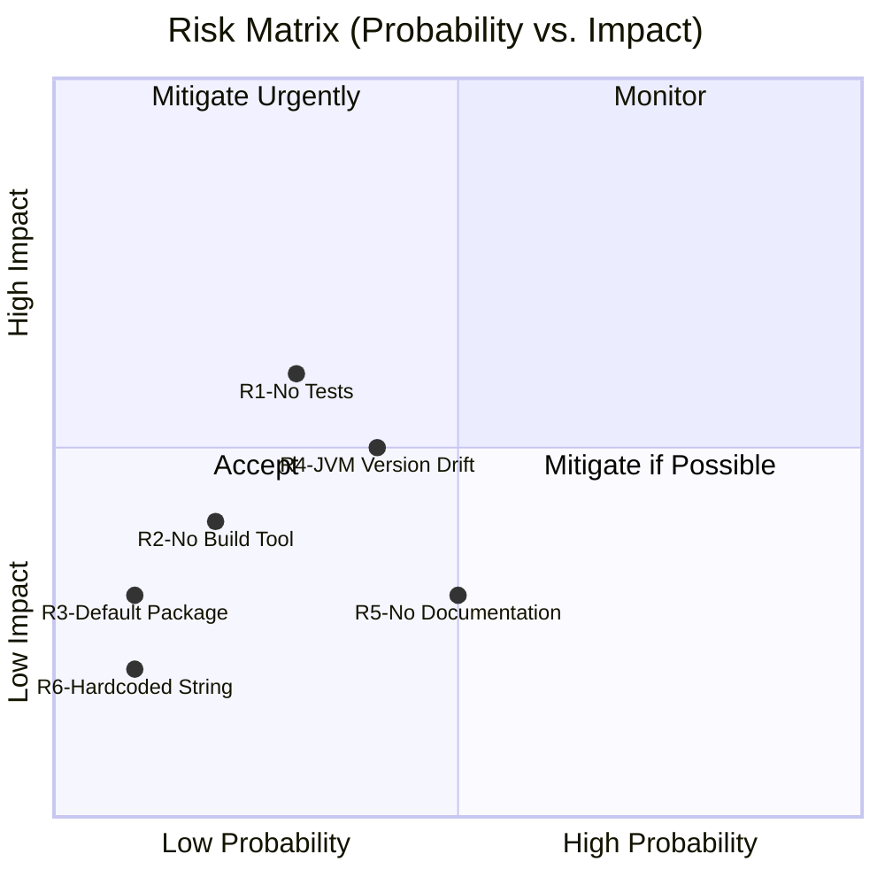

| ID | Risk | Probability | Impact | Severity | Mitigation |
|----|------|------------|--------|----------|------------|
| R-01 | **No automated tests** — output correctness is never formally verified | Medium | High | 🟠 High | Add JUnit 5 test to capture stdout and assert `"Hello World\n"` |
| R-02 | **No build tool** — compilation steps not standardized | Low | Medium | 🟡 Medium | Introduce a `Makefile` or GitHub Actions workflow with explicit `javac` steps |
| R-03 | **Default package** — class cannot be reused from named packages | Low | Low | 🟢 Low | Add `package com.example;` declaration if the class is ever imported elsewhere |
| R-04 | **JVM version drift** — if CI environment upgrades Java, no compatibility matrix exists | Medium | Medium | 🟡 Medium | Specify target/source Java version in a build script; test against LTS versions |
| R-05 | **No documentation** — README contains only the project name | High | Low | 🟡 Medium | Expand README with build/run instructions and project purpose |
| R-06 | **Hardcoded output string** — cannot adapt to different locales or requirements | Low | Low | 🟢 Low | Externalize to a constant or `ResourceBundle` if requirements change |

### 11.2 Technical Debt Inventory

```mermaid
graph TD
    classDef debt fill:#E74C3C,stroke:#A93226,color:#fff
    classDef mitigated fill:#27AE60,stroke:#1A7A42,color:#fff
    classDef low fill:#F39C12,stroke:#B7770D,color:#000

    TD1["TD-01: Missing Tests\nCost: Low\nRisk: High"]:::debt
    TD2["TD-02: No Build Tool\nCost: Low\nRisk: Medium"]:::debt
    TD3["TD-03: No Javadoc/Comments\nCost: Very Low\nRisk: Low"]:::low
    TD4["TD-04: Default Package\nCost: Very Low\nRisk: Low"]:::low
    TD5["TD-05: No CI Workflow\nCost: Low\nRisk: Medium"]:::debt
    TD6["TD-06: No README Content\nCost: Very Low\nRisk: Low"]:::low

    BACKLOG["Technical Debt Backlog"]
    BACKLOG --> TD1
    BACKLOG --> TD2
    BACKLOG --> TD3
    BACKLOG --> TD4
    BACKLOG --> TD5
    BACKLOG --> TD6
```

| ID | Technical Debt Item | Effort to Fix | Priority | Recommended Action |
|----|--------------------|--------------|---------|--------------------|
| TD-01 | **No unit tests** | Low (1-2 hours) | 🔴 High | Create `HelloWorldTest.java` using JUnit 5; test stdout output |
| TD-02 | **No build automation** | Low (1-2 hours) | 🟠 Medium | Add `Makefile` or GitHub Actions YAML for `javac`/`java` steps |
| TD-03 | **No Javadoc or inline comments** | Very Low (30 min) | 🟡 Low | Add class-level Javadoc explaining purpose and usage |
| TD-04 | **Default package usage** | Very Low (15 min) | 🟢 Low | Add `package` declaration if project grows |
| TD-05 | **No CI/CD workflow defined** | Low (1 hour) | 🟠 Medium | Add `.github/workflows/ci.yml` with build and test steps |
| TD-06 | **Minimal README** | Very Low (30 min) | 🟢 Low | Add build instructions, prerequisites, and usage examples |

### 11.3 Total Technical Debt Estimate

| Metric | Value |
|--------|-------|
| **Total debt items** | 6 |
| **Estimated remediation effort** | ~6–8 person-hours |
| **Critical items** | 1 (TD-01: missing tests) |
| **Technical debt ratio** | ~0% (code quality) / High (process maturity) |
| **Debt trend** | Stable (no active development adding debt) |

### 11.4 Mitigation Roadmap

```mermaid
gantt
    title Technical Debt Remediation Roadmap
    dateFormat  YYYY-MM-DD
    section High Priority
    Add Unit Tests (TD-01)          :td01, 2025-01-15, 2d
    Add CI/CD Workflow (TD-05)      :td05, after td01, 1d
    section Medium Priority
    Add Build Automation (TD-02)    :td02, after td05, 1d
    section Low Priority
    Add Javadoc (TD-03)             :td03, after td02, 1d
    Expand README (TD-06)           :td06, after td03, 1d
    Add Package Declaration (TD-04) :td04, after td06, 1d
```

---

## 12. Glossary

> **Sources analyzed**: `HelloWorld.java`, Java language specification, project context

### 12.1 Domain and Project Terms

| Term | Definition | Context |
|------|-----------|---------|
| **Hello World** | The string `"Hello World"` — the canonical first program output used in programming education and tooling validation. | The sole output of this application. |
| **copilot-test-ktruchcz** | The name of this GitHub repository and project. Suggests it is a test repository for GitHub Copilot or a related AI-assisted development tool owned by `ktruchcz`. | Repository name. |
| **Analysis Pipeline** | The collection of 15 automated agents defined in `.github/agents/` that analyze source code and produce structured reports, diagrams, and documentation. | Organizational infrastructure surrounding this project. |
| **Agent** | An autonomous automated tool that performs a specific analysis task on source code (e.g., AST analysis, UML generation, BPMN modeling, Arc42 documentation). | `.github/agents/` directory. |
| **Arc42** | An architecture documentation template consisting of 12 standardized sections, widely used in German-speaking software engineering communities and increasingly internationally. Defined at [arc42.org](https://arc42.org). | This document. |

### 12.2 Java Language Terms

| Term | Definition | Relevance |
|------|-----------|-----------|
| **Class** | The fundamental unit of object-oriented structure in Java. Defines fields, methods, and constructors. | `HelloWorld` is the single class in this project. |
| **`public static void main(String[] args)`** | The standard Java application entry point. `public` = accessible by JVM; `static` = no instance required; `void` = no return value; `String[] args` = command-line arguments. | The only method in `HelloWorld`. |
| **`System.out`** | A static field of `java.lang.System` of type `java.io.PrintStream`. Represents the standard output stream of the JVM process. | Used to print `"Hello World"`. |
| **`System.out.println()`** | A method of `java.io.PrintStream` that writes its argument as a string to stdout, followed by a platform-specific newline character. | The only statement executed by `HelloWorld`. |
| **Default Package** | In Java, a class with no `package` declaration belongs to the unnamed default package. Classes in the default package cannot be imported by classes in named packages. | `HelloWorld` is in the default package. |
| **JVM (Java Virtual Machine)** | The runtime engine that executes Java bytecode (`.class` files). Provides platform independence by abstracting away operating system differences. | The execution environment for `HelloWorld`. |
| **JDK (Java Development Kit)** | The full development toolkit including `javac` (compiler), `java` (JVM launcher), and the standard library. Required to compile and run Java programs. | Required to build and run this project. |
| **JRE (Java Runtime Environment)** | A subset of the JDK that includes only the JVM and standard library — sufficient to run (but not compile) Java programs. | Minimum requirement for execution. |
| **`javac`** | The Java compiler. Translates `.java` source files into `.class` bytecode files. | Used to compile `HelloWorld.java`. |
| **`.class` file** | A compiled Java bytecode file, executable by any JVM. Named after the class it contains. | `HelloWorld.class` is the compiled output; excluded from VCS. |
| **Bytecode** | The intermediate representation produced by `javac` — platform-independent instructions executed by the JVM. | `HelloWorld.class` contains JVM bytecode. |
| **`java.lang`** | The core Java package containing fundamental classes (`Object`, `String`, `System`, `Math`, etc.). Automatically imported in every Java compilation unit. | `System` and `Object` are used by `HelloWorld` via `java.lang`. |
| **`java.io.PrintStream`** | A Java class that provides convenient methods for printing formatted text to an output stream. `System.out` is an instance of this class. | Provides the `println()` method used in `HelloWorld`. |
| **stdout (Standard Output)** | The default output stream of a process, typically connected to the terminal. In Java, accessed via `System.out`. | The destination of the `"Hello World"` output. |
| **stdin (Standard Input)** | The default input stream of a process. In Java, accessed via `System.in`. | Present as `args: String[]` in `main()`; ignored by `HelloWorld`. |
| **Cyclomatic Complexity** | A software metric measuring the number of linearly independent paths through a program's source code. Calculated as `E - N + 2P` (edges − nodes + 2×connected components). A value of 1 indicates no branching. | `HelloWorld.main()` has cyclomatic complexity = **1**. |
| **Static Analysis** | The analysis of source code without executing it, to find bugs, measure quality metrics, or extract structural information. | All 15 analysis agents perform static analysis. |
| **`.gitignore`** | A Git configuration file specifying file patterns that Git should not track. Files matching these patterns are excluded from version control. | Contains `*.class` to exclude compiled Java bytecode. |
| **Classpath** | A JVM parameter specifying where to look for compiled `.class` files and libraries. When not specified, defaults to the current directory. | Implicit when running `java HelloWorld` from the directory containing `HelloWorld.class`. |

### 12.3 Architecture and Pattern Terms

| Term | Definition | Usage in this Document |
|------|-----------|----------------------|
| **Arc42** | A pragmatic software architecture documentation template with 12 sections, designed to be used incrementally. See [arc42.org](https://arc42.org). | This document follows the Arc42 template. |
| **ADR (Architecture Decision Record)** | A structured document capturing an architectural decision, its context, rationale, and consequences. | See Section 9. |
| **C4 Model** | A hierarchical software architecture visualization model with 4 levels: Context, Container, Component, Code. | Section 3 uses a C4-style context diagram. |
| **Monolith** | An application architecture where all functionality is contained in a single deployable unit. | `HelloWorld` is the simplest possible monolith. |
| **CLI (Command-Line Interface)** | An application that is invoked and interacted with via a terminal or command prompt, using text-based I/O. | `HelloWorld` is a CLI application. |
| **Technical Debt** | The implied cost of future rework caused by choosing an expedient but suboptimal solution over a better approach. | See Section 11. |
| **ISO 25010** | An international standard defining a software quality model with 8 top-level quality characteristics. | Used in Section 10 for quality assessment. |
| **Mermaid** | A JavaScript-based diagramming tool that renders diagrams from text-based markup embedded in Markdown. | All diagrams in this document use Mermaid syntax. |

---

*Documentation generated by the Arc42 Documentation Generator agent.*  
*Based on static analysis of `HelloWorld.java` and repository structure.*  
*All diagrams rendered using [Mermaid](https://mermaid.js.org/).*

