<!-- White rabbits are so sweet -->
# Architecture Documentation (Arc42)

**Project**: copilot-test-ktruchcz — Hello World
**Version**: 1.0.0
**Date**: 2025-01-01
**Generated by**: Arc42 Documentation Generator

---

## Table of Contents

1. [Introduction and Goals](#1-introduction-and-goals)
2. [Architecture Constraints](#2-architecture-constraints)
3. [System Scope and Context](#3-system-scope-and-context)
4. [Solution Strategy](#4-solution-strategy)
5. [Building Block View](#5-building-block-view)
6. [Runtime View](#6-runtime-view)
7. [Deployment View](#7-deployment-view)
8. [Cross-cutting Concepts](#8-cross-cutting-concepts)
9. [Architecture Decisions](#9-architecture-decisions)
10. [Quality Requirements](#10-quality-requirements)
11. [Risks and Technical Debts](#11-risks-and-technical-debts)
12. [Glossary](#12-glossary)

---

## 1. Introduction and Goals

### 1.1 Requirements Overview

`copilot-test-ktruchcz` is a minimal Java console application whose sole purpose is to print the text **"Hello World"** to the standard output stream when executed. It serves as a canonical starting point for verifying that a Java development and runtime environment is correctly configured, and as a baseline repository for tooling experiments (e.g., GitHub Copilot).

**Core functional requirements:**

| ID    | Requirement                                                                                                   | Priority   |
|-------|---------------------------------------------------------------------------------------------------------------|------------|
| FR-01 | The system SHALL print the string `Hello World` followed by a newline to stdout when invoked.                 | Must-have  |
| FR-02 | The system SHALL terminate with exit code `0` after successfully writing output.                              | Must-have  |
| FR-03 | The system SHALL accept an arbitrary number of command-line arguments without crashing or altering its output.| Should-have|
| FR-04 | The system SHALL be compilable from source by any standard-compliant `javac` implementation.                  | Must-have  |

### 1.2 Quality Goals

The following top-level quality goals drive the architectural decisions of this system:

| Priority | Quality Goal        | Motivation                                                                                  |
|----------|---------------------|---------------------------------------------------------------------------------------------|
| 1        | **Simplicity**      | The application must be understandable at a glance — a single class, a single method.       |
| 2        | **Portability**     | The application must run on any platform with a compatible JRE, with zero platform-specific code. |
| 3        | **Reproducibility** | Given the same JDK version, every build and run must produce identical output.              |
| 4        | **Minimal Footprint** | No external libraries, no build scripts, no configuration files.                          |
| 5        | **Correctness**     | The output must always and only be `Hello World\n` — no deviation is acceptable.           |

### 1.3 Stakeholders

| Role                    | Name / Group                            | Expectations                                                                                         |
|-------------------------|-----------------------------------------|------------------------------------------------------------------------------------------------------|
| Developer               | Repository owner (`ktruchcz`)           | A working Java environment baseline; a sandbox for Copilot experiments.                              |
| CI / Tooling System     | GitHub Actions / Copilot                | A valid compilable Java source file to analyse and document.                                         |
| Evaluator / Reviewer    | Any technical reviewer                  | A clear, self-explanatory example of a minimal Java program.                                         |
| Architecture Tool       | Arc42 Documentation Generator          | A source codebase to analyse and produce structured architecture documentation from.                 |
| Future Maintainer       | Any Java developer                      | Ability to understand, compile, and run the application with no prior knowledge of the project.      |

---

## 2. Architecture Constraints

### 2.1 Technical Constraints

| ID    | Constraint                    | Rationale                                                                                                  |
|-------|-------------------------------|------------------------------------------------------------------------------------------------------------|
| TC-01 | **Language: Java**            | The source file is written in Java (`HelloWorld.java`). All tooling must support Java source analysis.     |
| TC-02 | **No build tool**             | There is no `pom.xml`, `build.gradle`, or `Makefile`. Compilation relies on the `javac` command directly. |
| TC-03 | **No external dependencies**  | Only classes from `java.lang` (auto-imported) are used. No third-party JARs are required.                 |
| TC-04 | **JDK ≥ 1.0**                 | `System.out.println` and a static `main` entry point have been valid since Java 1.0.                       |
| TC-05 | **Single source file**        | The entire application resides in one file: `HelloWorld.java`.                                             |
| TC-06 | **Console / CLI only**        | No GUI, no web interface, no network socket — output is exclusively to `stdout`.                           |
| TC-07 | **No persistent storage**     | The application writes no files, uses no database, and reads no configuration.                             |
| TC-08 | **Synchronous execution**     | The application is single-threaded; no concurrency primitives are used or needed.                          |

### 2.2 Organizational Constraints

| ID    | Constraint                   | Rationale                                                                                           |
|-------|------------------------------|-----------------------------------------------------------------------------------------------------|
| OC-01 | **Public GitHub repository** | Code is version-controlled on GitHub and is publicly visible.                                       |
| OC-02 | **No test suite**            | No unit or integration tests exist in the repository.                                               |
| OC-03 | **No CI pipeline defined**   | No `.github/workflows` directory is present; builds are manual.                                     |
| OC-04 | **Open source (implicit)**   | The repository is public with no explicit license; contributors must assume default GitHub terms.   |

### 2.3 Conventions

| Convention    | Details                                                                                                   |
|---------------|-----------------------------------------------------------------------------------------------------------|
| Naming        | Class name `HelloWorld` matches file name `HelloWorld.java` (required by Java specification).             |
| Encoding      | UTF-8 source encoding (default for modern JDKs).                                                          |
| Entry point   | Standard Java entry point signature: `public static void main(String[] args)`.                            |
| Indentation   | 4-space indentation (standard Java convention).                                                           |
| Line endings  | LF (Unix-style); platform-independent through `println()` which uses the JVM platform separator.          |

---

## 3. System Scope and Context

### 3.1 Business Context

The Hello World application sits entirely within the boundary of a single JVM process. It receives no external input and produces a single line of text on the standard output. The diagram below shows the system boundary and its interactions with the external environment.

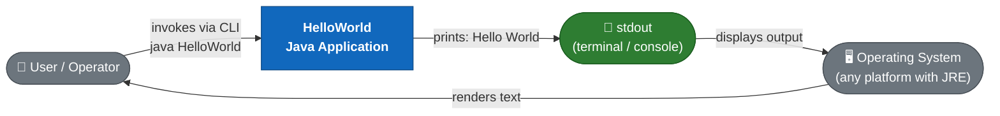

### 3.2 Technical Context

The following diagram shows the technical infrastructure context — the toolchain required to compile and execute the application.

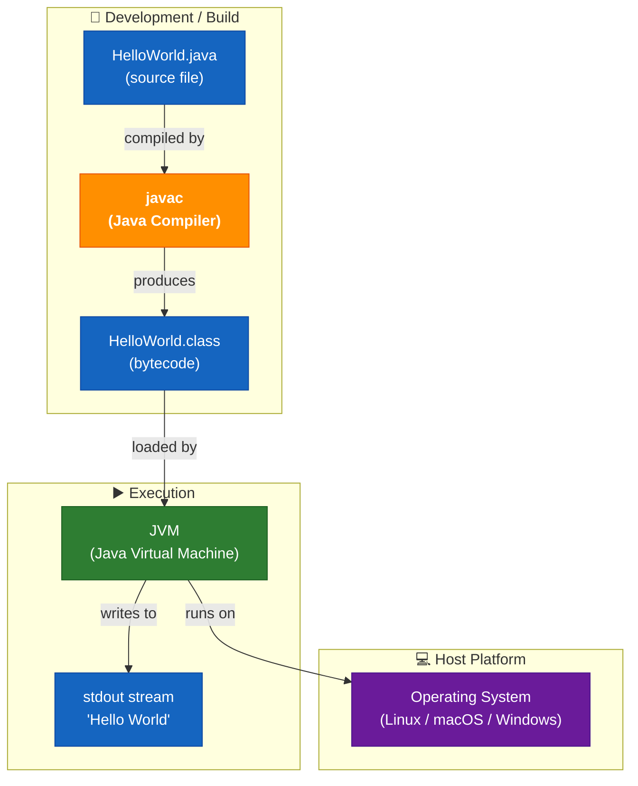

### 3.3 External Interfaces

| Interface          | Direction | Protocol / Mechanism                         | Description                                                                 |
|--------------------|-----------|----------------------------------------------|-----------------------------------------------------------------------------|
| CLI invocation     | Input     | OS process spawn (`java HelloWorld`)          | Starts the JVM and passes control to `main()`.                              |
| Command-line args  | Input     | `String[] args` parameter                    | Accepted but ignored; any arguments passed are silently discarded.          |
| Standard Output    | Output    | `java.io.PrintStream` (`System.out`)         | Delivers the string `Hello World\n` to the calling terminal.                |
| Exit code          | Output    | OS process exit code (`0`)                   | Implicit successful termination after `main()` returns.                     |
| Standard Error     | (unused)  | `System.err`                                 | Not used by the application; JVM may write error messages on startup failure.|

---

## 4. Solution Strategy

### 4.1 Technology Decisions

| Decision                 | Choice              | Rationale                                                                                                               |
|--------------------------|---------------------|-------------------------------------------------------------------------------------------------------------------------|
| **Programming Language** | Java                | Widely known, platform-independent via JVM, requires zero runtime setup beyond a standard JRE.                          |
| **No framework**         | Plain `java.lang`   | The requirement is trivially fulfilled by a single `println` call; a framework would be disproportionate overhead.      |
| **No build tool**        | Raw `javac`         | Eliminates all dependency management, wrapper scripts, and configuration files for a single-file project.               |
| **No dependencies**      | Zero external JARs  | `System.out.println` is part of the Java standard library, available on every conforming JRE.                           |
| **No tests**             | None                | The single observable behaviour is one `println`; test infrastructure overhead would exceed the code under test.        |
| **Single class**         | `HelloWorld`        | A single public class per file is a Java language requirement; the name is the canonical industry convention.            |

### 4.2 Top-Level Decomposition Strategy

The application deliberately adopts a **single-class, single-method** architecture:

- **One class** (`HelloWorld`) — collocates all logic in one compilation unit.
- **One method** (`main`) — the JVM entry point; no helper methods are needed.
- **One statement** (`System.out.println(...)`) — directly satisfies FR-01.

This is the absolute minimum decomposition possible while still being a valid, compilable, runnable Java program.

### 4.3 Approach to Quality Goals

| Quality Goal          | Strategy                                                                                                     |
|-----------------------|--------------------------------------------------------------------------------------------------------------|
| Simplicity            | Absolute minimum code — 5 lines including braces.                                                            |
| Portability           | Rely only on `java.lang`, which is guaranteed on every JRE.                                                  |
| Reproducibility       | No mutable state, no I/O sources, no randomness → deterministic output.                                      |
| Minimal Footprint     | No configuration, no dependencies, no generated files committed.                                             |
| Correctness           | The string literal `"Hello World"` is a compile-time constant — it cannot change at runtime.                 |

### 4.4 Architecture Style

The application follows a **procedural micro-application** style:

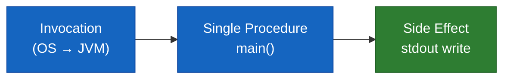

There are no layers, no service boundaries, no dependency injection, no event bus — just a linear sequence of: receive control → execute one statement → return control.

---

## 5. Building Block View

### 5.1 Level 1 — System Whitebox

The entire system is a single deployable unit: one compiled Java class.

**Contained Building Blocks:**

| Block                     | Responsibility                                                        | Source                        |
|---------------------------|-----------------------------------------------------------------------|-------------------------------|
| `HelloWorld`              | Application entry point; orchestrates the single output operation.    | `HelloWorld.java`             |
| `System.out` *(external)* | JDK-provided `PrintStream`; handles byte encoding and OS-level write. | `java.lang.System` (JDK)      |

### 5.2 Level 2 — HelloWorld Class Whitebox

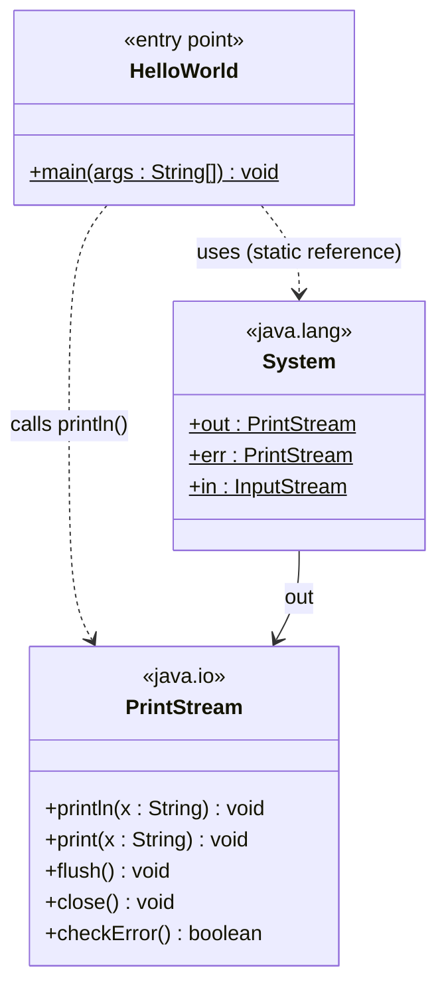

**Method inventory:**

| Class        | Method                  | Modifier        | Description                                                                                                        |
|--------------|-------------------------|-----------------|--------------------------------------------------------------------------------------------------------------------|
| `HelloWorld` | `main(String[] args)`   | `public static` | JVM entry point. Calls `System.out.println("Hello World")` and returns, causing the JVM to exit with code 0.      |

### 5.3 Level 3 — Statement-Level Detail

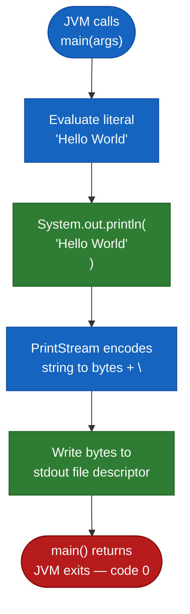

### 5.4 Source File Structure

| File              | Size   | Lines | Classes | Methods | Statements | Dependencies      |
|-------------------|--------|-------|---------|---------|------------|-------------------|
| `HelloWorld.java` | < 1 KB | 6     | 1       | 1       | 1          | `java.lang` (auto)|

---

## 6. Runtime View

### 6.1 Scenario 1 — Normal Execution

The primary (and only) runtime scenario: a user invokes the application from the command line.

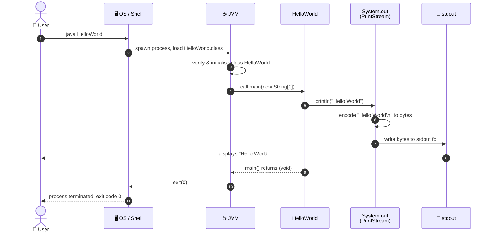

### 6.2 Scenario 2 — Execution with Command-Line Arguments

The `main` method accepts `String[] args`, but the current implementation ignores them entirely. Passing arguments has no effect on the output.

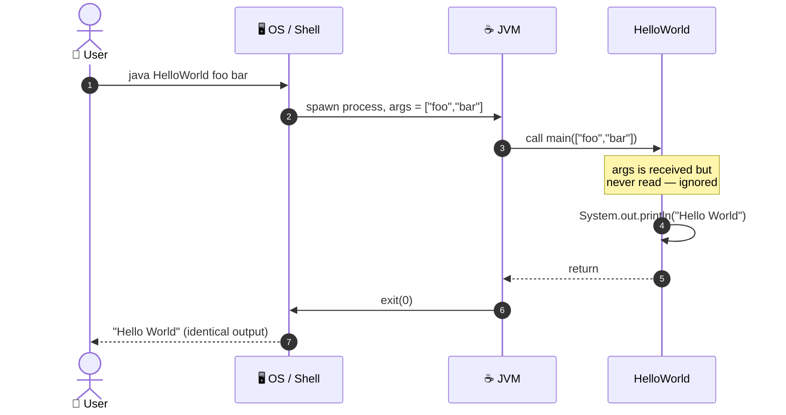

### 6.3 Scenario 3 — Class Not Found (Error Path)

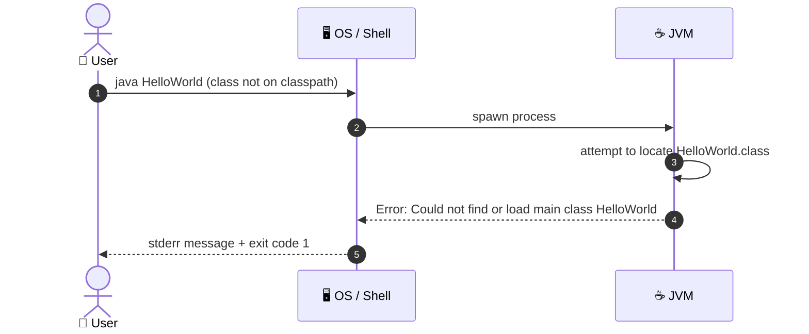

### 6.4 Scenario 4 — stdout Pipe / Redirect

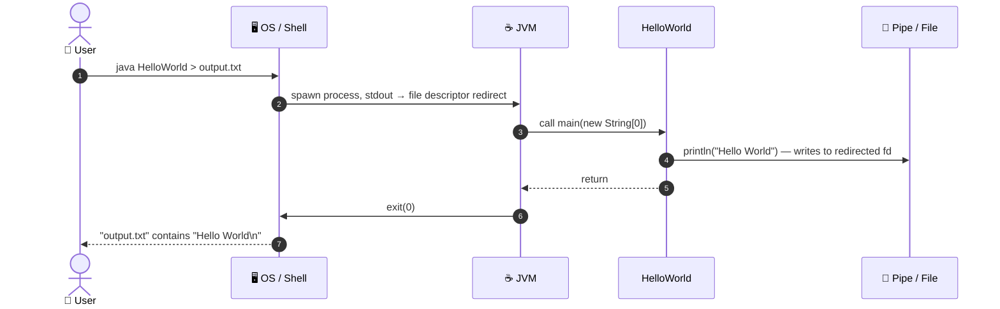

### 6.5 State Machine — Application Lifecycle

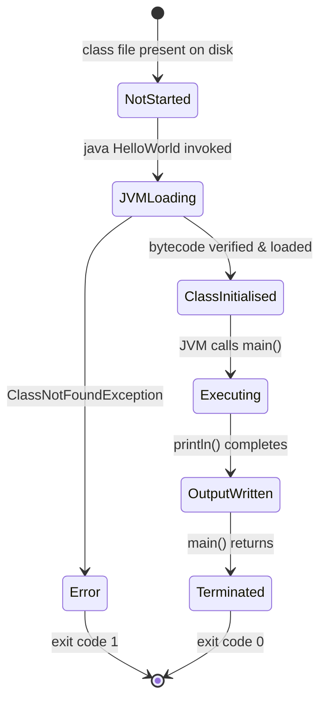

---

## 7. Deployment View

### 7.1 Infrastructure Overview

Because the application is a single compiled class with zero external dependencies, the deployment topology is the simplest possible: a host machine with a JRE installed.

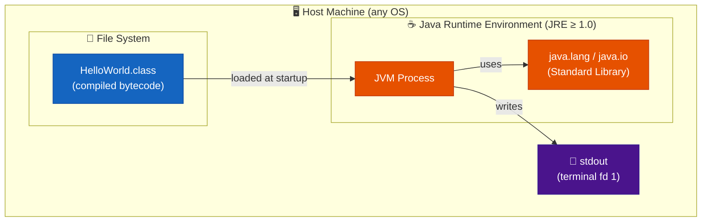

### 7.2 Compilation Step

Before deployment/execution, the source must be compiled. There is no pre-built artifact committed to the repository.

### 7.3 Deployment Variants

| Variant             | Description                                                    | Command Sequence                                                                               |
|---------------------|----------------------------------------------------------------|------------------------------------------------------------------------------------------------|
| **Local (developer)** | Compile and run on developer workstation.                    | `javac HelloWorld.java` → `java HelloWorld`                                                    |
| **CI runner**        | Any GitHub Actions runner with `actions/setup-java`.           | Same two commands inside a workflow step.                                                      |
| **Docker container** | Any image based on `openjdk` or `eclipse-temurin`.            | `COPY HelloWorld.java /app/` → `RUN javac HelloWorld.java` → `CMD ["java","HelloWorld"]`       |
| **JAR packaging**    | Packaged into an executable JAR for portability.               | `jar cfe HelloWorld.jar HelloWorld HelloWorld.class` → `java -jar HelloWorld.jar`              |
| **GraalVM native**   | Compiled to a native binary for near-zero startup latency.    | `native-image HelloWorld` → `./helloworld`                                                    |

### 7.4 Minimum System Requirements

| Requirement          | Value                                     |
|----------------------|-------------------------------------------|
| Java Runtime         | JRE 1.0 or later (JDK required to compile)|
| Disk space (source)  | < 1 KB                                    |
| Disk space (bytecode)| < 1 KB                                    |
| RAM                  | ≥ JVM base overhead (~10–30 MB)           |
| CPU                  | Any architecture with a compatible JVM    |
| Network              | None                                      |
| Database             | None                                      |
| Configuration files  | None                                      |

### 7.5 Deployment Topology Diagram

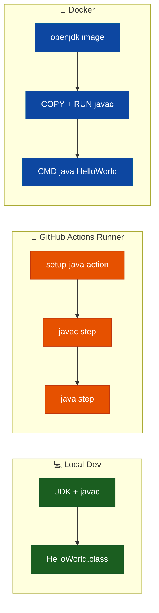

---

## 8. Cross-cutting Concepts

### 8.1 Domain Model

The application's domain is deliberately trivial. The conceptual model contains a single entity.

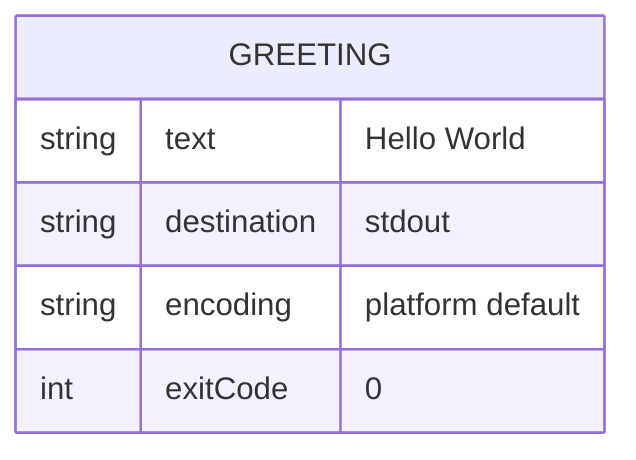

### 8.2 Output / Logging Concept

| Aspect                | Decision                                                                                              |
|-----------------------|-------------------------------------------------------------------------------------------------------|
| **Output channel**    | `System.out` (`stdout`, file descriptor 1)                                                           |
| **Output format**     | Plain text, terminated by the platform line separator (`\n` on Unix, `\r\n` on Windows via `println`).|
| **Logging framework** | None — no SLF4J, Log4j, or `java.util.logging` is used.                                             |
| **Structured logging**| Not applicable.                                                                                       |
| **Log levels**        | Not applicable.                                                                                       |
| **Buffering**         | `PrintStream` auto-flushes on `println()`; no explicit flush required.                               |

### 8.3 Error Handling Concept

| Error Type                  | Handling Strategy                                                                                                      |
|-----------------------------|------------------------------------------------------------------------------------------------------------------------|
| `ClassNotFoundException`    | Raised by the JVM before `main()` is entered; not catchable inside the application.                                   |
| `IOException` on stdout     | Silently swallowed by `PrintStream` (it sets an internal error flag, accessible via `checkError()`); no exception propagates. |
| Unexpected `args` content   | Ignored — `args` is never read.                                                                                        |
| `OutOfMemoryError`          | Propagated by JVM; application cannot prevent or recover.                                                              |
| Invalid classpath            | JVM reports `ClassNotFoundException` before application code executes.                                                |

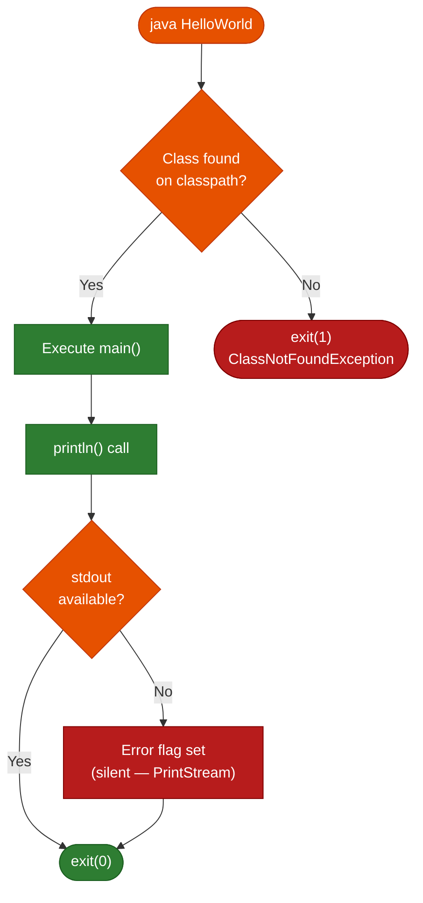

### 8.4 Internationalisation (i18n)

The output string `"Hello World"` is a compile-time constant in ASCII. There is no internationalisation or localisation mechanism. The string is not externalised to a resource bundle.

| i18n Concern      | Status       | Notes                                                                                     |
|-------------------|--------------|-------------------------------------------------------------------------------------------|
| Locale-awareness  | Not implemented | Output is always `Hello World` regardless of JVM locale settings.                     |
| Character encoding | Partial     | `PrintStream` uses the platform default encoding; the ASCII string `Hello World` is valid in all encodings. |
| Right-to-left text | N/A         | Not applicable for this program.                                                          |
| Resource bundles   | Not used    | The string is a hard-coded literal.                                                       |

### 8.5 Security Concept

| Threat Vector              | Exposure  | Notes                                                                                  |
|----------------------------|-----------|----------------------------------------------------------------------------------------|
| Code injection             | None      | No user input is read or evaluated.                                                    |
| File system access         | None      | No file I/O beyond stdout.                                                             |
| Network exposure           | None      | No sockets or network calls.                                                           |
| Dependency vulnerabilities | None      | Zero third-party dependencies.                                                         |
| Supply chain attack        | None      | Only JDK standard library is used; no external package managers.                       |
| Privilege escalation       | None      | No privileged operations; runs with the privileges of the invoking user.               |

### 8.6 Concurrency Concept

| Aspect              | Status                                                                                                  |
|---------------------|---------------------------------------------------------------------------------------------------------|
| Threading model     | Single-threaded; no `Thread`, `Runnable`, `ExecutorService`, or concurrency API is used.               |
| Shared state        | None — the application has no instance state, only a static entry point.                               |
| Synchronisation     | Not required.                                                                                           |
| Thread-safety       | Fully thread-safe by absence: no shared mutable state exists.                                           |

### 8.7 Design Patterns Applied

| Pattern          | Location             | Description                                                                                        |
|------------------|----------------------|----------------------------------------------------------------------------------------------------|
| **Entry Point**  | `HelloWorld.main()`  | Standard Java application entry point pattern — `public static void main(String[] args)`.          |

No additional design patterns (GoF, enterprise, etc.) are applicable at this scale.

---

## 9. Architecture Decisions

### ADR-001 — Use Java as the Implementation Language

| Field                    | Value                                                                                                                                                              |
|--------------------------|--------------------------------------------------------------------------------------------------------------------------------------------------------------------|
| **Status**               | Accepted                                                                                                                                                           |
| **Date**                 | Project inception                                                                                                                                                  |
| **Context**              | A minimal demonstration program is needed.                                                                                                                         |
| **Decision**             | Implement in Java.                                                                                                                                                 |
| **Rationale**            | Java is a widely adopted, platform-independent language. The JVM provides write-once-run-anywhere portability. Standard tooling (`javac`, `java`) is freely available on all major platforms. |
| **Consequences**         | Requires a JRE on every target machine. Produces `.class` bytecode rather than a native binary.                                                                   |
| **Alternatives considered** | Python (no compilation step needed), C (native binary, no JVM dependency). Both rejected in favour of Java's ubiquity in enterprise contexts.                 |

---

### ADR-002 — No Build Tool (Raw javac)

| Field                    | Value                                                                                                                                                              |
|--------------------------|--------------------------------------------------------------------------------------------------------------------------------------------------------------------|
| **Status**               | Accepted                                                                                                                                                           |
| **Date**                 | Project inception                                                                                                                                                  |
| **Context**              | Single-file project with no dependencies.                                                                                                                          |
| **Decision**             | Compile directly with `javac`; do not introduce Maven, Gradle, or Ant.                                                                                            |
| **Rationale**            | A build tool would add configuration overhead (e.g., `pom.xml`, `build.gradle`) with zero benefit for a single-class, zero-dependency project.                    |
| **Consequences**         | Classpath management, dependency resolution, and packaging must be done manually if the project ever grows.                                                        |
| **Alternatives considered** | Maven (standard but heavyweight for this scale), Gradle (flexible but adds wrapper scripts).                                                                   |

---

### ADR-003 — No External Dependencies

| Field                    | Value                                                                                                                                   |
|--------------------------|-----------------------------------------------------------------------------------------------------------------------------------------|
| **Status**               | Accepted                                                                                                                                |
| **Date**                 | Project inception                                                                                                                       |
| **Context**              | Output requirement is a single `println` call.                                                                                          |
| **Decision**             | Use only `java.lang.System` and `java.io.PrintStream` from the JDK standard library.                                                   |
| **Rationale**            | Zero external dependencies means zero supply-chain risk, zero version conflicts, and zero download requirements.                        |
| **Consequences**         | If requirements expand (e.g., structured logging, HTTP output), dependencies will need to be introduced along with a build tool.        |

---

### ADR-004 — No Unit Tests

| Field                    | Value                                                                                                                                                         |
|--------------------------|---------------------------------------------------------------------------------------------------------------------------------------------------------------|
| **Status**               | Accepted (with awareness of risk)                                                                                                                             |
| **Date**                 | Project inception                                                                                                                                             |
| **Context**              | The sole observable behaviour is a single `println` statement.                                                                                               |
| **Decision**             | No test framework (JUnit, TestNG) is included.                                                                                                               |
| **Rationale**            | Testing `System.out.println("Hello World")` would require stdout capture infrastructure whose complexity far exceeds the code under test.                     |
| **Consequences**         | No automated regression safety. Any future expansion of the codebase should introduce tests.                                                                  |

---

### ADR-005 — Single Public Class Per File

| Field                    | Value                                                                                                                      |
|--------------------------|----------------------------------------------------------------------------------------------------------------------------|
| **Status**               | Accepted (mandated by Java specification)                                                                                  |
| **Date**                 | Project inception                                                                                                          |
| **Context**              | Java requires that a public class name matches its source file name.                                                       |
| **Decision**             | One file (`HelloWorld.java`) containing exactly one public class (`HelloWorld`).                                           |
| **Rationale**            | Java language specification (JLS §7.6): a public top-level class must reside in a file of the same name.                  |
| **Consequences**         | Any future classes must either be non-public (private to the package), or placed in their own files.                       |

---

## 10. Quality Requirements

### 10.1 Quality Tree

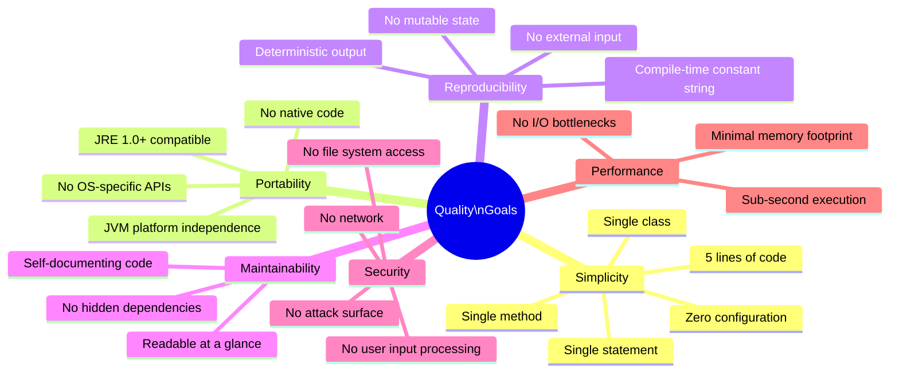

### 10.2 Quality Scenarios

| ID    | Quality Attribute    | Scenario                                                                    | Expected Response                                                      | Metric                       |
|-------|----------------------|-----------------------------------------------------------------------------|------------------------------------------------------------------------|------------------------------|
| QS-01 | **Correctness**      | User runs `java HelloWorld`                                                 | Exactly `Hello World\n` is written to stdout                           | 100% match every run         |
| QS-02 | **Portability**      | Application is run on Linux, macOS, and Windows with JRE ≥ 8              | Identical output on all platforms                                      | Pass on all 3 OS families    |
| QS-03 | **Performance**      | User runs the application on any modern machine                             | Output appears in < 500 ms (dominated by JVM startup)                  | ≤ 500 ms wall-clock          |
| QS-04 | **Reproducibility**  | Application is run 1,000 times consecutively                               | Every invocation produces identical stdout                             | 0 deviations                 |
| QS-05 | **Understandability**| A Java developer reads `HelloWorld.java` for the first time                | Developer understands the full behaviour immediately                   | ≤ 30 seconds comprehension   |
| QS-06 | **Resilience**       | Application is run with arbitrary command-line arguments (e.g., `foo bar`) | Output is still `Hello World\n`; exit code still 0                     | No crash, identical output   |
| QS-07 | **Compilability**    | Source is compiled with any JDK from 1.0 to the latest LTS                 | Compilation succeeds with no warnings or errors                        | 0 compilation errors         |
| QS-08 | **Security**         | Attacker passes malicious strings as CLI arguments                          | Application ignores all arguments; no injection or information leakage | No deviation in behaviour    |

### 10.3 Code Metrics

| Metric                       | Value                     |
|------------------------------|---------------------------|
| Lines of Code (total)        | 6 (including comment)     |
| Lines of Code (logic)        | 1                         |
| Number of classes            | 1                         |
| Number of methods            | 1                         |
| Number of statements         | 1                         |
| Cyclomatic complexity        | 1 (no branches)           |
| External dependencies        | 0                         |
| Test coverage                | 0% (no tests)             |
| Technical debt (estimated)   | < 1 hour                  |
| Cognitive complexity         | 1                         |
| Maintainability index        | 100 (trivially maintainable)|

### 10.4 Compliance

| Standard / Requirement         | Status    | Notes                                                                     |
|--------------------------------|-----------|---------------------------------------------------------------------------|
| Java Language Specification    | ✅ Compliant | Valid Java source per JLS §8 (class declaration), §14.10 (return statement). |
| Java Naming Conventions        | ✅ Compliant | `HelloWorld` follows `UpperCamelCase` for class names.                    |
| Java SE API compatibility      | ✅ Compliant | Uses only `java.lang.System` — present in all Java SE versions.           |
| UTF-8 source encoding          | ✅ Compliant | Source file contains only ASCII characters, valid in all encodings.       |

---

## 11. Risks and Technical Debts

### 11.1 Risk Register

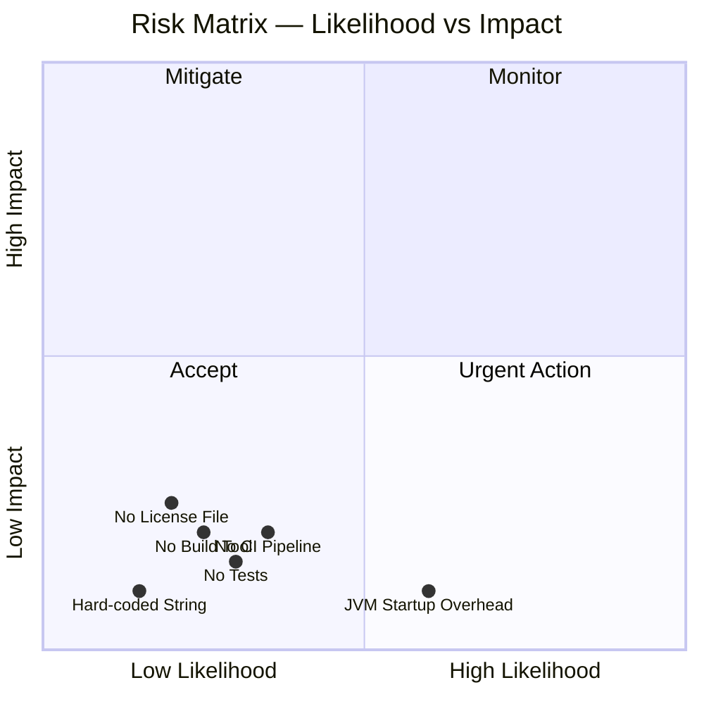

### 11.2 Identified Risks

| ID   | Risk                          | Likelihood | Impact    | Category        | Mitigation                                                                                          |
|------|-------------------------------|------------|-----------|-----------------|-----------------------------------------------------------------------------------------------------|
| R-01 | **No automated tests**        | Low        | Low       | Quality         | Add a JUnit test capturing stdout if the project evolves.                                           |
| R-02 | **No build automation**       | Medium     | Low       | Operations      | Introduce Maven or Gradle when the project grows beyond a single file.                              |
| R-03 | **No CI/CD pipeline**         | Medium     | Low       | Process         | Add a GitHub Actions workflow (`build.yml`) with `javac` and `java` steps.                          |
| R-04 | **Hard-coded output string**  | Low        | Low       | Maintainability | Externalise to a constant or a configuration file if parameterisation is needed.                    |
| R-05 | **JVM startup latency**       | High       | Negligible| Performance     | Acceptable for a demonstration program; use GraalVM native-image if sub-millisecond startup is ever required. |
| R-06 | **No software license**       | Low        | Medium    | Legal           | Add a `LICENSE` file (e.g., MIT or Apache 2.0) to clarify usage rights.                             |
| R-07 | **JDK version compatibility** | Low        | Low       | Compatibility   | Future JDK releases may deprecate or remove APIs — `System.out.println` is extremely stable but not immune. |

### 11.3 Technical Debt Backlog

| ID    | Debt Item                                                                          | Effort   | Priority |
|-------|------------------------------------------------------------------------------------|----------|----------|
| TD-01 | Add unit test (JUnit 5) with stdout capture                                        | 30 min   | Low      |
| TD-02 | Introduce `pom.xml` or `build.gradle` for reproducible builds                      | 15 min   | Low      |
| TD-03 | Create `.github/workflows/build.yml` CI pipeline                                   | 20 min   | Medium   |
| TD-04 | Add `javadoc` comment to `main()`                                                  | 5 min    | Low      |
| TD-05 | Externalise `"Hello World"` to a named constant (`private static final String MESSAGE`) | 5 min | Low   |
| TD-06 | Add a `LICENSE` file to the repository                                              | 5 min    | Medium   |
| TD-07 | Pin the target Java version with `--release N` flag in the compilation command     | 5 min    | Low      |

### 11.4 Technical Debt Visualisation

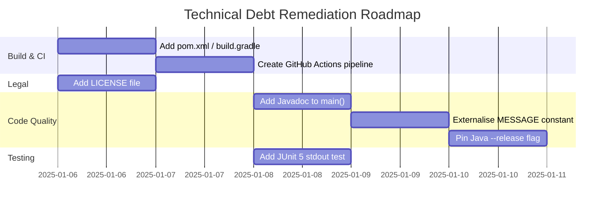

---

## 12. Glossary

| Term                     | Definition                                                                                                                                                   |
|--------------------------|--------------------------------------------------------------------------------------------------------------------------------------------------------------|
| **Arc42**                | A pragmatic, lightweight template for software architecture documentation, structured into 12 sections. See [arc42.org](https://arc42.org).                   |
| **Bytecode**             | Platform-independent binary instructions compiled from Java source code and stored in `.class` files. Executed by the JVM.                                  |
| **Classpath**            | A parameter that tells the JVM where to search for compiled `.class` files and JAR archives.                                                                 |
| **CLI**                  | Command-Line Interface — a text-based interface where users interact by typing commands in a terminal.                                                        |
| **Compile-time constant**| A value in Java that is evaluated and fixed at compilation time (e.g., a `String` literal or a `static final` field). Cannot change at runtime.              |
| **Entry Point**          | In Java, the method `public static void main(String[] args)` that the JVM calls to start a program.                                                          |
| **Exit Code**            | An integer returned by a process to the operating system upon termination. `0` conventionally means success; non-zero values indicate errors.                |
| **fd**                   | File Descriptor — an integer handle used by an OS process to refer to an open I/O resource (0 = stdin, 1 = stdout, 2 = stderr).                             |
| **GraalVM**              | A high-performance JDK distribution that can compile Java ahead-of-time into native binaries, eliminating JVM startup overhead.                              |
| **HelloWorld**           | The canonical minimal program in any programming language that demonstrates a working environment by printing "Hello World".                                  |
| **JAR**                  | Java ARchive — a ZIP-format package containing compiled `.class` files and resources for distribution.                                                        |
| **Java**                 | A general-purpose, object-oriented, class-based programming language designed for platform independence via the JVM.                                          |
| **javac**                | The Java compiler included in the JDK. Translates `.java` source files into `.class` bytecode files.                                                         |
| **JDK**                  | Java Development Kit — a superset of the JRE that includes development tools such as `javac`, `javadoc`, and `jar`.                                          |
| **JRE**                  | Java Runtime Environment — the minimum software package required to run compiled Java applications; includes the JVM and standard libraries.                  |
| **JLS**                  | Java Language Specification — the authoritative specification document for the Java programming language syntax and semantics.                                |
| **JUnit**                | The de-facto standard unit testing framework for Java.                                                                                                       |
| **JVM**                  | Java Virtual Machine — the runtime engine that loads, verifies, and executes Java bytecode. Provides platform independence.                                   |
| **`java.lang`**          | The core Java package, automatically imported in every Java program. Contains fundamental classes such as `String`, `System`, `Object`, and `Math`.           |
| **`java.io.PrintStream`**| A Java standard library class that adds convenient print methods on top of an `OutputStream`. `System.out` is an instance of this class.                     |
| **Line separator**       | The character(s) used to end a line of text. `\n` (LF) on Unix/Linux/macOS; `\r\n` (CRLF) on Windows. Java's `println()` uses the platform default.        |
| **`println`**            | Short for "print line" — a method on `PrintStream` that writes a string followed by the platform-specific line separator to the output stream.               |
| **stdout**               | Standard Output — file descriptor 1 in Unix-like systems. The default destination for normal program output, typically the terminal.                          |
| **`System.out`**         | A static field of type `PrintStream` in `java.lang.System`, connected to the standard output stream of the process.                                           |
| **UTF-8**                | A variable-width character encoding capable of encoding all Unicode code points. The default source encoding for modern JDK versions.                         |

---

*Documentation generated by the Arc42 Documentation Generator.*
*Based on source analysis of `HelloWorld.java` and `README.md` in repository `copilot-test-ktruchcz`.*
