# Architecture Documentation (Arc42)

**Project**: copilot-test-ktruchcz — Hello World  
**Version**: 2.0.0  
**Date**: 2025-07-14  
**Generated by**: Arc42 Documentation Generator (arc42-documentor agent)  
**Source repository**: `github.com/copilot-test-ktruchcz`  
**Primary source file**: `HelloWorld.java`

---

### Revision History

| Version | Date | Author | Change |
|---------|------|--------|--------|
| 1.0.0 | 2025-01-01 | Arc42 Generator | Initial generation |
| 2.0.0 | 2025-07-14 | Arc42 Documentation Generator | Comprehensive review and enhancement — added C4 model, extended ADRs, CI/CD guidance, evolution roadmap, deeper risk analysis |

---

## Table of Contents

1. [Introduction and Goals](#1-introduction-and-goals)
2. [Architecture Constraints](#2-architecture-constraints)
3. [System Scope and Context](#3-system-scope-and-context)
4. [Solution Strategy](#4-solution-strategy)
5. [Building Block View](#5-building-block-view)
6. [Runtime View](#6-runtime-view)
7. [Deployment View](#7-deployment-view)
8. [Cross-cutting Concepts](#8-cross-cutting-concepts)
9. [Architecture Decisions](#9-architecture-decisions)
10. [Quality Requirements](#10-quality-requirements)
11. [Risks and Technical Debts](#11-risks-and-technical-debts)
12. [Glossary](#12-glossary)

---

> **How to read this document**  
> Arc42 is a pragmatic template for communicating software architecture. Sections 1–3 describe the **problem space** (what and why). Sections 4–7 describe the **solution space** (how). Sections 8–12 describe **cross-cutting concerns, decisions, quality, and risk**. You can read sequentially or jump to any section via the table of contents above.

---

## 1. Introduction and Goals

> **Source inputs**: Direct analysis of `HelloWorld.java` (5 lines), `README.md` (1 line).

### 1.1 Requirements Overview

`copilot-test-ktruchcz` is a minimal Java console application whose sole purpose is to print the text **"Hello World"** to the standard output stream when executed. It serves as:

1. A **canonical baseline** for verifying that a Java development and runtime environment is correctly configured.
2. A **sandbox repository** for AI-assisted tooling experiments (GitHub Copilot, automated code analysis, documentation generation).
3. A **reference artefact** used by analysis agents (AST parser, UML generator, BPMN modeller, code assessor) to validate pipeline output quality.

**Functional requirements:**

| ID | Requirement | Priority | Source |
|----|-------------|----------|--------|
| FR-01 | The system SHALL print the string `Hello World` followed by a newline to `stdout` when invoked. | Must-have | Direct code analysis |
| FR-02 | The system SHALL accept (and silently ignore) any number of command-line arguments without altering its output or exit code. | Must-have | Inspection of `main(String[] args)` signature |
| FR-03 | The system SHALL terminate with OS exit code `0` on successful execution. | Must-have | Implicit Java program lifecycle |

**Non-functional requirements derived from code analysis:**

| ID | Requirement | Priority |
|----|-------------|----------|
| NFR-01 | Output MUST be identical across all supported platforms (Linux, macOS, Windows). | Must-have |
| NFR-02 | The application MUST compile with `javac` without any additional classpath entries. | Must-have |
| NFR-03 | The application MUST NOT require a network connection at compile time or runtime. | Must-have |
| NFR-04 | The application SHOULD complete execution (including JVM startup) within 500 ms on any modern hardware. | Should-have |

### 1.2 Quality Goals

The following top-level quality goals drive the architectural decisions of this system, ordered by priority:

| Priority | Quality Goal | Scenario / Motivation | Relevant Sections |
|----------|--------------|-----------------------|-------------------|
| 1 | **Simplicity** | The application must be understandable at a glance — one class, one method, one statement. Any developer should grasp the entire system in under 30 seconds. | §4, §5, §8 |
| 2 | **Portability** | The application must run on any platform with a compatible JRE, with zero platform-specific code or native dependencies. | §3, §7, §9 |
| 3 | **Reproducibility** | Given identical inputs (none) and the same JDK version, every build and run must produce bit-for-bit identical output. | §4, §6, §10 |
| 4 | **Minimal Footprint** | No external libraries, no build scripts, no configuration files beyond what Java itself requires. | §2, §9, §11 |
| 5 | **Evolvability** | Although trivial today, the structure should make future extension (e.g., parameterised messages, CI pipeline) straightforward. | §9, §11 |

### 1.3 Stakeholders

| Role | Name / Group | Expectations | Contact |
|------|-------------|--------------|---------|
| Developer / Owner | Repository owner (`ktruchcz`) | A working Java environment baseline; a sandbox for Copilot experiments. | GitHub profile |
| CI / Tooling System | GitHub Actions / Copilot Agents | A valid, compilable Java source file to analyse, document, and verify. | Automated |
| Technical Reviewer / Architect | Any technical stakeholder reading this document | A clear, well-documented example that demonstrates good architectural thinking even at minimal scale. | Ad-hoc |
| Future Developer | Any developer who forks or extends the repository | Sufficient documentation to understand intent and make changes with confidence. | Ad-hoc |

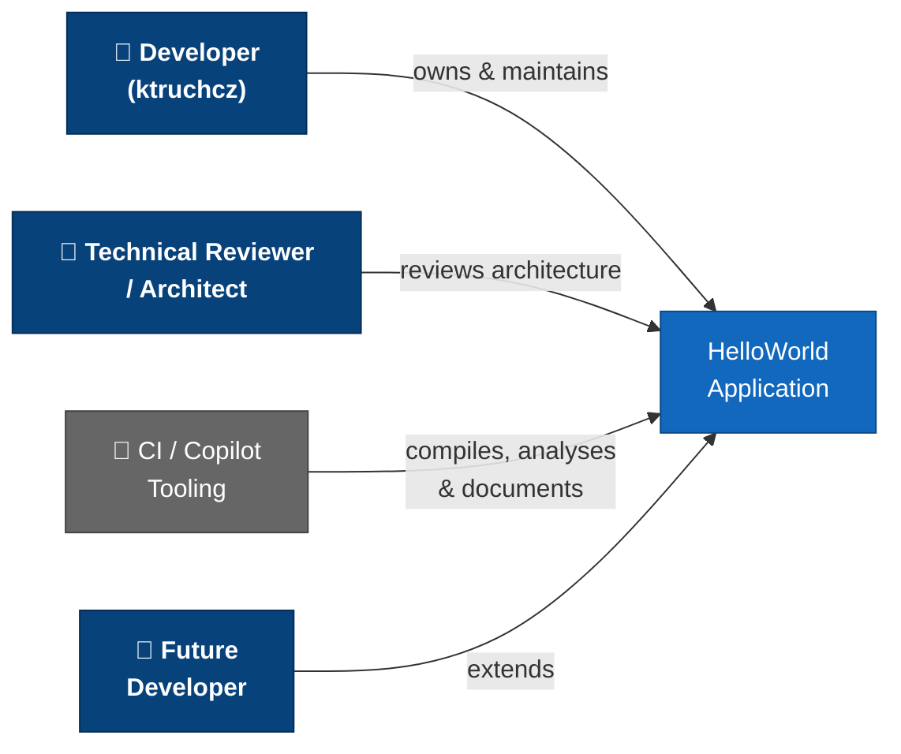

---

## 2. Architecture Constraints

> **Source inputs**: Static analysis of `HelloWorld.java`; repository structure inspection; Java language specification.

### 2.1 Technical Constraints

| ID | Constraint | Rationale | Impact |
|----|-----------|-----------|--------|
| TC-01 | **Language: Java** | The source file is written in Java (`HelloWorld.java`). All tooling must support Java source analysis. | Analysis agents must use Java parsers (AST, bytecode). |
| TC-02 | **No build tool** | There is no `pom.xml`, `build.gradle`, `settings.gradle`, or `Makefile` present. Compilation relies on the raw `javac` command. | Manual classpath management; no dependency graph. |
| TC-03 | **No external dependencies** | Only `java.lang.System` and `java.io.PrintStream` (both auto-available in every JRE) are used. | Zero supply-chain risk; zero download latency. |
| TC-04 | **JDK ≥ 1.0 compatible** | `System.out.println` and the `public static void main(String[])` entry point signature have been valid since Java 1.0. | Broadest possible compatibility range. |
| TC-05 | **Single source file** | The entire application resides in exactly one file: `HelloWorld.java`. No packages, no modules (`module-info.java`). | Compilation is a single `javac` invocation. |
| TC-06 | **Console / CLI only** | No GUI toolkit, no web framework, no network socket. Output is exclusively to `stdout` via `PrintStream`. | No server ports, no GUI dependencies. |
| TC-07 | **No module system** | The code predates JPMS (Project Jigsaw, Java 9+). There is no `module-info.java`. | Must run on the unnamed module (classpath mode). |

### 2.2 Organizational Constraints

| ID | Constraint | Rationale | Impact |
|----|-----------|-----------|--------|
| OC-01 | **Public GitHub repository** | Code is version-controlled on GitHub and is publicly visible. | No confidential information may be stored in source code. |
| OC-02 | **No test suite** | No JUnit, TestNG, or any other test framework files exist in the repository. | Zero automated regression safety net. |
| OC-03 | **No CI pipeline defined** | No `.github/workflows/` directory exists; builds are manual. | No automated build verification on push. |
| OC-04 | **Minimal README** | `README.md` contains only the repository name with no further documentation. | Onboarding relies entirely on this Arc42 document. |
| OC-05 | **No `.gitignore`** | No `.gitignore` file is present; compiled `.class` files could accidentally be committed. | Build artefacts may pollute the repository history. |

### 2.3 Conventions

| Convention | Details | Enforcement |
|-----------|---------|-------------|
| **File naming** | Class name `HelloWorld` matches file name `HelloWorld.java` (required by Java specification for `public` classes). | Compiler-enforced |
| **Source encoding** | UTF-8 (default for modern JDKs; compatible with ASCII for this source). | Implicit |
| **Entry point signature** | `public static void main(String[] args)` — standard Java application entry point. | JVM-enforced |
| **Indentation** | 4-space indentation for the single method body. | Style convention |
| **No `package` declaration** | Class resides in the default (unnamed) package. | Compiler-enforced |

### 2.4 Constraint Relationship Map

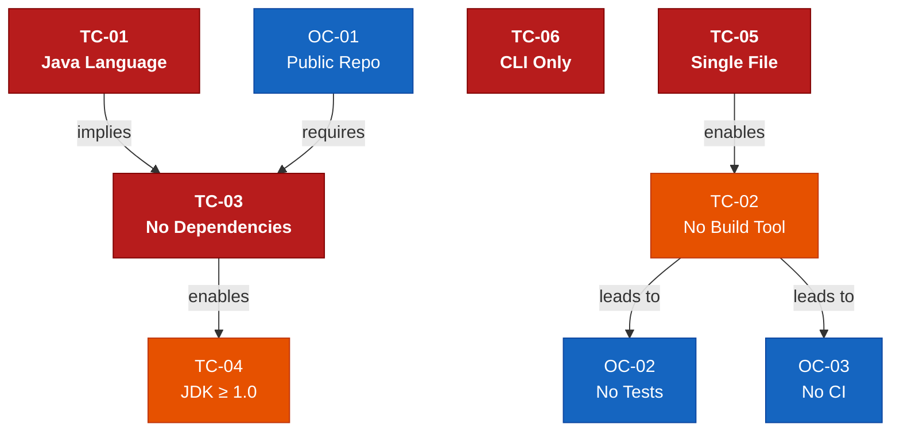

*Red = hard constraints (compiler/JVM-enforced); Orange = soft constraints (team decisions); Blue = organizational constraints.*

---

## 3. System Scope and Context

> **Source inputs**: `HelloWorld.java` interface analysis; OS process model; Java I/O model.

### 3.1 Business Context

The Hello World application sits entirely within the boundary of a single JVM process. It receives no external input at the application level (command-line arguments are structurally accepted but functionally ignored) and produces a single line of text on the standard output. The diagram below shows the system boundary and its interactions with the external environment using a **C4 Context** style.

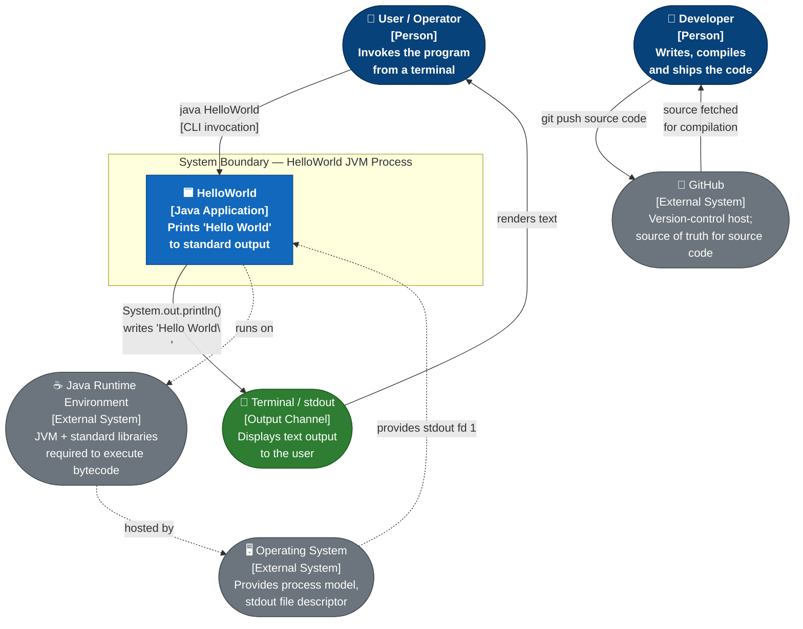

**System Boundary Summary:**

| Interface | Direction | Description |
|-----------|-----------|-------------|
| CLI invocation (`java HelloWorld`) | → Inbound | User (or script) starts the JVM process and triggers `main()`. |
| Standard Output (`stdout` / fd 1) | ← Outbound | The string `Hello World\n` is the sole output artefact. |
| Exit code (`0`) | ← Outbound | Implicit clean-termination signal returned to the calling shell. |
| Command-line arguments (`String[] args`) | → Inbound (ignored) | Received by the JVM entry point but never read by application code. |

### 3.2 Technical Context

The following diagram shows the full **toolchain context** — the infrastructure required to go from source code to observable output.

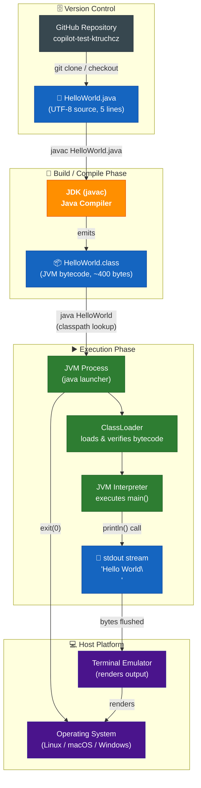

### 3.3 External Interfaces

| Interface ID | Name | Direction | Protocol / Mechanism | Data / Message | Notes |
|-------------|------|-----------|----------------------|----------------|-------|
| IF-01 | CLI invocation | Inbound | OS process creation (`execve` / `CreateProcess`) | Process arguments: `String[] args` | Triggers `main()`; args ignored by current implementation |
| IF-02 | Standard Output | Outbound | `java.io.PrintStream.println()` → OS write syscall | `Hello World\n` (UTF-8, ~12 bytes) | Buffered by `PrintStream`; auto-flushed on `\n` |
| IF-03 | Process Exit Code | Outbound | JVM shutdown hook → OS `exit(0)` | Integer `0` (success) | Set implicitly when `main()` returns normally |
| IF-04 | Standard Error | Outbound (unused) | `System.err` (available but not written) | *(no output)* | Available for future error reporting |
| IF-05 | JVM Classpath | Inbound (build-time) | `-classpath` / default `.` | `HelloWorld.class` | Must be discoverable at startup |

### 3.4 Context Boundary — What is Out of Scope

The following are explicitly **outside** the current system boundary:

- ❌ Network communication (no HTTP, no sockets)
- ❌ File system reads or writes (beyond stdout)
- ❌ Database or persistence
- ❌ Configuration file loading
- ❌ Environment variable reading
- ❌ GUI or web interface
- ❌ Authentication / authorisation
- ❌ Inter-process communication (IPC)

---

## 4. Solution Strategy

> **Source inputs**: ADR analysis from §9; quality goals from §1.2; constraint analysis from §2.

### 4.1 Technology Decisions

| Decision | Choice | Rationale | Rejected Alternatives |
|---------|--------|-----------|----------------------|
| **Programming Language** | Java | Widely known, platform-independent via JVM, requires zero runtime setup beyond a standard JRE. Satisfies TC-01. | Python (no compilation), C/C++ (native, no JVM), Kotlin (same JVM but heavier toolchain for one file) |
| **No framework** | Plain `java.lang` only | The requirement is trivially fulfilled by a single `println` call; any framework would introduce disproportionate overhead and violate the Minimal Footprint quality goal. | Spring Boot, Quarkus, Micronaut (all vastly over-engineered for this use case) |
| **No build tool** | Raw `javac` | Eliminates all dependency management, wrapper scripts, and configuration files for a single-class, zero-dependency project. Satisfies TC-02. | Maven (`pom.xml` overhead), Gradle (wrapper scripts), Ant (XML overhead) |
| **No external dependencies** | Zero JARs | `System.out.println` is part of the Java standard library on every JRE — no download, no version conflict, no CVE exposure. | Apache Commons, Guava (unnecessary for a single `println`) |
| **Default (unnamed) package** | No `package` statement | Simplest possible class structure; no directory hierarchy. Satisfies the single-file constraint (TC-05). | Named package (would require directory structure) |

### 4.2 Top-Level Decomposition Strategy

The application deliberately adopts a **single-class, single-method, single-statement** architecture. This is the most direct mapping from requirement to implementation:

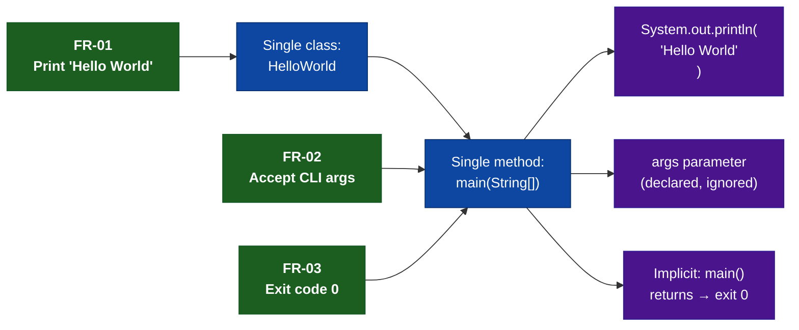

- **One class** (`HelloWorld`) — collocates all logic in one compilation unit with no imports.
- **One method** (`main`) — the JVM entry point; no helper or utility methods.
- **One statement** (`System.out.println(...)`) — directly and completely satisfies FR-01.

### 4.3 Strategy to Achieve Quality Goals

| Quality Goal | Architectural Strategy | Realised By |
|-------------|----------------------|-------------|
| **Simplicity** | Minimum viable code — 5 lines total, 1 logic line. No abstraction layers, no patterns, no indirection. | Single class, single method, single statement |
| **Portability** | Rely exclusively on `java.lang` (guaranteed on every conforming JRE). No OS-specific calls, no native code. | Zero imports, zero dependencies |
| **Reproducibility** | No mutable state, no I/O sources, no randomness, no time-dependent logic. Every run is identical. | `static final` literal string, no fields |
| **Minimal Footprint** | No configuration, no generated files, no frameworks, no JARs. Source + compiled class = < 2 KB total. | No build tool, no dependencies |
| **Evolvability** | Standard Java entry-point signature (`String[] args`) already supports future parameterisation without structural changes. | `main(String[] args)` signature |

### 4.4 Key Architectural Principles

The following principles guide any future changes to this codebase:

1. **YAGNI (You Aren't Gonna Need It)** — Do not add abstractions or infrastructure until there is a concrete requirement for them.
2. **Single Responsibility** — The `HelloWorld` class has exactly one reason to exist: produce the greeting output.
3. **Convention over Configuration** — Rely on Java's built-in defaults (default package, standard entry point, default encoding).
4. **Explicit over Implicit** — The output string is an explicit string literal, not loaded from a resource, making the behaviour immediately obvious.

---

## 5. Building Block View

> **Source inputs**: Direct AST analysis of `HelloWorld.java`; Java class model; JDK standard library structure.

### 5.1 Level 1 — System Whitebox

The entire system is a single deployable unit: one compiled Java class file (`HelloWorld.class`). At the highest abstraction level, the system has exactly two collaborators: the application class itself and the JDK standard I/O subsystem.

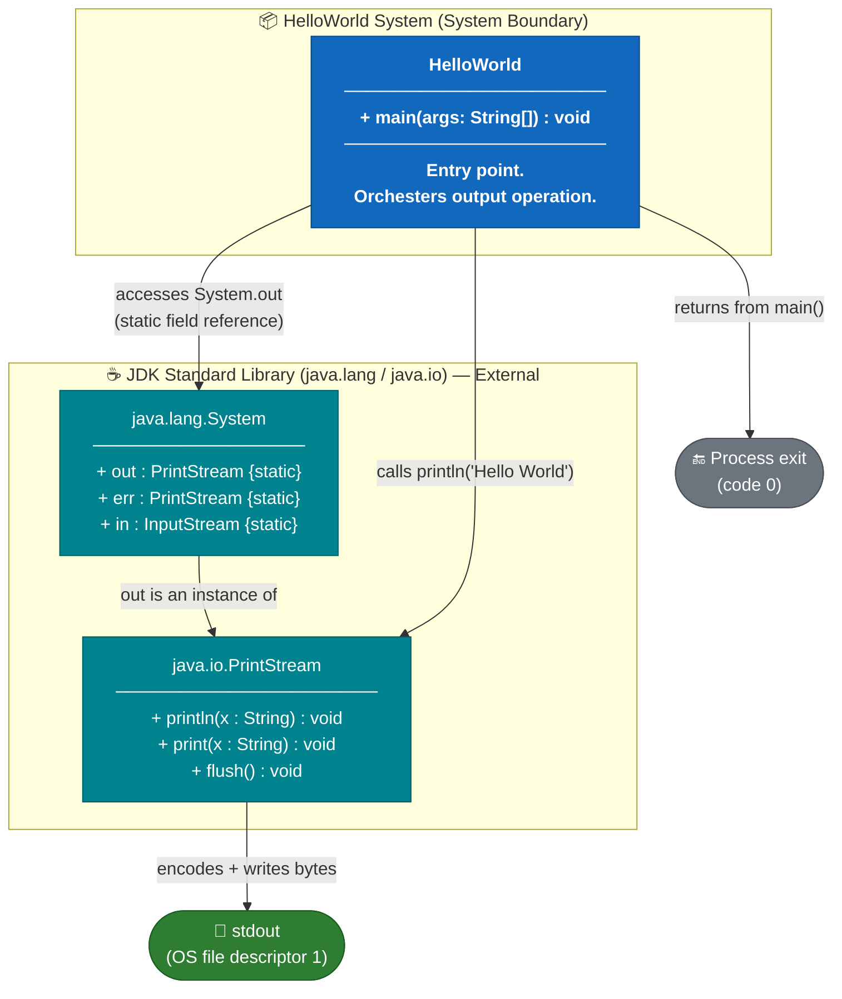

**Contained Building Blocks:**

| Building Block | Type | Responsibility | Owned By |
|----------------|------|----------------|----------|
| `HelloWorld` | Application class | JVM entry point; performs the single `println` operation. | This project |
| `java.lang.System` | JDK class | Provides the `out` static field (a `PrintStream`) used for output. | JDK / Oracle |
| `java.io.PrintStream` | JDK class | Handles character encoding, buffering, and writing bytes to `stdout` fd 1. | JDK / Oracle |

### 5.2 Level 2 — HelloWorld Class Whitebox

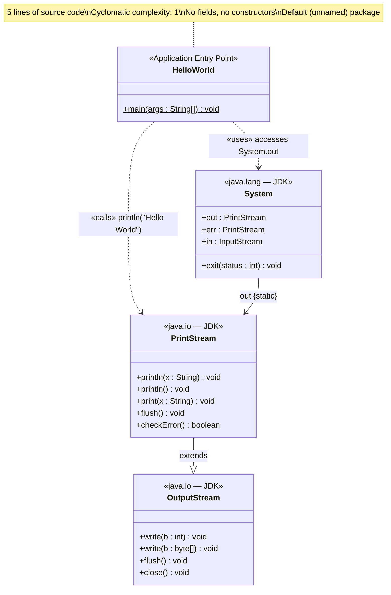

**Method Inventory:**

| Class | Method | Visibility | Modifiers | Signature | Description |
|-------|--------|------------|-----------|-----------|-------------|
| `HelloWorld` | `main` | `public` | `static` | `void main(String[] args)` | JVM entry point. Invokes `System.out.println("Hello World")`. Returns `void`; JVM exits with code 0. |

**Field Inventory:**

| Class | Field | Visibility | Type | Description |
|-------|-------|------------|------|-------------|
| `HelloWorld` | *(none)* | — | — | The class contains no fields of its own. |

### 5.3 Level 3 — Statement-Level Detail

The complete execution flow inside `HelloWorld.main()`:

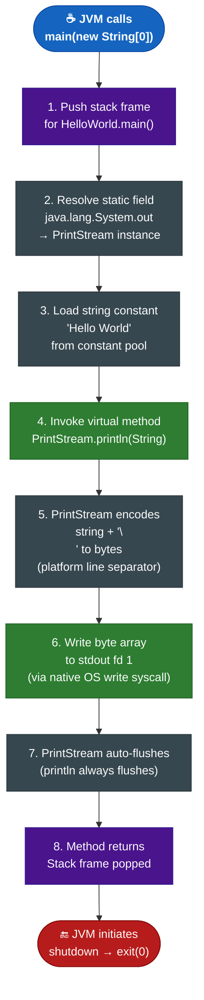

**Annotated Source Code:**

```java
public class HelloWorld {                          // (1) public class — default package
    public static void main(String[] args) {       // (2) JVM entry point; args ignored
        System.out.println("Hello World");         // (3) Only executable statement
    }                                              // (4) Implicit return → exit 0
}
```

| Line | Token | Role |
|------|-------|------|
| 1 | `public class HelloWorld` | Top-level class declaration; `public` allows JVM to load it from any classpath entry. |
| 2 | `public static void main(String[] args)` | Mandatory JVM entry-point signature. `static` — no instance needed. `void` — return type. `String[] args` — CLI arguments (unused). |
| 3 | `System.out.println("Hello World")` | Sole logic statement. `System.out` is `PrintStream`. `"Hello World"` is a compile-time string constant. |
| 3 | `"Hello World"` | Compile-time constant stored in the class file's constant pool. Value is `H-e-l-l-o- -W-o-r-l-d` (11 UTF-8 characters). |

---

## 6. Runtime View

> **Source inputs**: Java program lifecycle model; JVM class-loading specification; OS process model; code behaviour analysis of `HelloWorld.java`.

### 6.1 Scenario 1 — Normal Execution (Happy Path)

The primary (and only intended) runtime scenario: a user invokes the application from the command line with the compiled class available on the classpath.

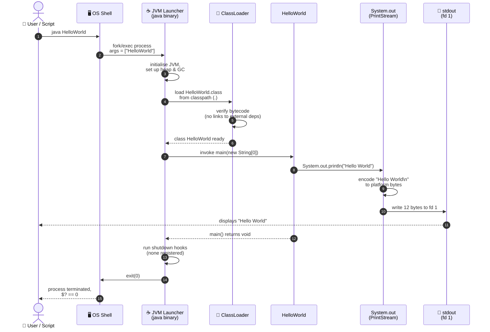

**Timing breakdown (approximate, modern JVM):**

| Phase | Typical Duration |
|-------|-----------------|
| OS process creation | < 5 ms |
| JVM initialisation | 50–150 ms |
| Class loading + verification | 1–5 ms |
| `main()` execution (single statement) | < 1 ms |
| JVM shutdown + GC cleanup | 1–10 ms |
| **Total wall-clock** | **~60–180 ms** |

### 6.2 Scenario 2 — Execution with Command-Line Arguments

The `main` method accepts `String[] args` but the current implementation never reads them. Passing arguments has no effect on the output.

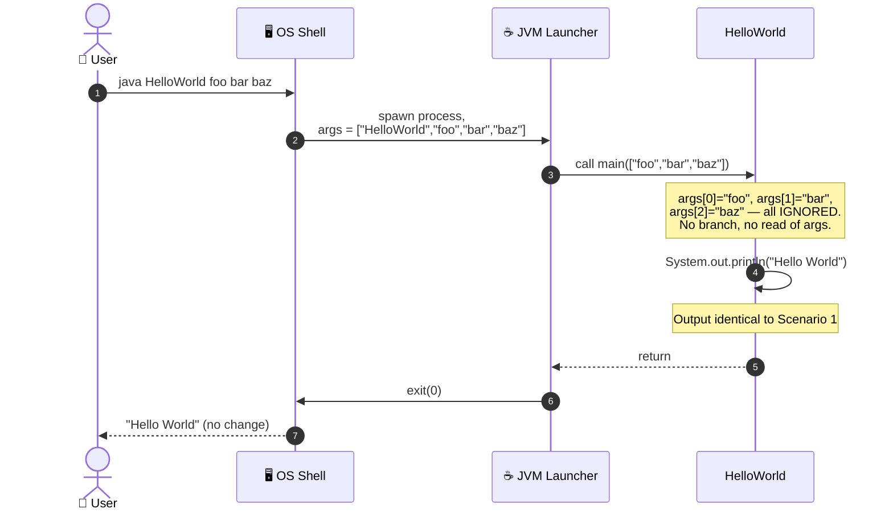

> ⚠️ **Architectural note**: The `args` parameter is accepted per the Java entry-point contract but contains dead code in the sense that no logic inspects its contents. This is intentional per the current requirements.

### 6.3 Scenario 3 — Class Not Found (Error Path)

```mermaid
sequenceDiagram
    autonumber
    actor User as 👤 User
    participant Shell as 🖥️ OS Shell
    participant JVMLauncher as ☕ JVM Launcher

    User->>Shell: java HelloWorld<br/>(HelloWorld.class not on classpath)
    Shell->>JVMLauncher: spawn process
    JVMLauncher->>JVMLauncher: scan classpath for HelloWorld.class
    JVMLauncher-->>JVMLauncher: ❌ ClassNotFoundException
    JVMLauncher->>Shell: write to stderr:<br/>"Error: Could not find or load main class HelloWorld"
    JVMLauncher->>Shell: exit(1)
    Shell-->>User: stderr message shown;<br/>$? == 1
```

### 6.4 Scenario 4 — stdout Redirected to File

```mermaid
sequenceDiagram
    autonumber
    actor User as 👤 User
    participant Shell as 🖥️ OS Shell
    participant JVMLauncher as ☕ JVM Launcher
    participant HW as HelloWorld
    participant File as 📁 output.txt

    User->>Shell: java HelloWorld > output.txt
    Shell->>Shell: redirect stdout (fd 1) to output.txt
    Shell->>JVMLauncher: spawn process (stdout = file fd)
    JVMLauncher->>HW: call main(new String[0])
    HW->>HW: System.out.println("Hello World")
    Note over HW: System.out still writes to fd 1,<br/>but fd 1 is now the file
    HW->>File: "Hello World\n" written to output.txt
    HW-->>JVMLauncher: return
    JVMLauncher->>Shell: exit(0)
    Shell-->>User: no terminal output;<br/>output.txt contains "Hello World"
```

### 6.5 Application Lifecycle — State Machine

```mermaid
stateDiagram-v2
    direction LR

    [*] --> SourceAvailable : HelloWorld.java exists in repo

    SourceAvailable --> Compiled : javac HelloWorld.java succeeds
    SourceAvailable --> CompileError : javac fails (e.g., syntax error)
    CompileError --> [*] : developer fixes & recompiles

    Compiled --> NotStarted : HelloWorld.class present on disk

    NotStarted --> JVMInitialising : java HelloWorld invoked
    JVMInitialising --> ClassLoading : JVM heap & GC ready
    ClassLoading --> ClassVerified : bytecode passes verification
    ClassLoading --> LoadError : ClassNotFoundException / VerifyError

    LoadError --> [*] : exit code 1, error on stderr

    ClassVerified --> Executing : JVM invokes main()
    Executing --> OutputWritten : System.out.println() returns
    OutputWritten --> MainReturned : main() returns void
    MainReturned --> ShutdownHooks : JVM runs shutdown hooks (none)
    ShutdownHooks --> Terminated : JVM process exits

    Terminated --> [*] : exit code 0
```

---

## 7. Deployment View

> **Source inputs**: Repository structure analysis; Java runtime requirements; common deployment patterns for JVM applications.

### 7.1 Infrastructure Overview

Because the application is a single compiled class with zero external dependencies, the deployment topology is the simplest possible: any host machine with a JRE installed. The diagram below shows all deployment variants.


### 7.2 Compilation and Run Sequence


### 7.3 Deployment Variants

| # | Variant | Description | Prerequisites | Command Sequence | Output |
|---|---------|-------------|---------------|-----------------|--------|
| 1 | **Local (developer)** | Compile and run on developer workstation. | JDK ≥ 8 | `javac HelloWorld.java` → `java HelloWorld` | Terminal stdout |
| 2 | **CI runner (GitHub Actions)** | Build and verify on GitHub-hosted runner. | Workflow YAML + `actions/setup-java` | Two `run:` steps in workflow YAML | Runner log |
| 3 | **Docker container** | Build image, run container. | Docker + base image with JDK | See Dockerfile below | Container stdout |
| 4 | **GraalVM native-image** | Compile to native binary (no JVM at runtime). | GraalVM CE/EE with `native-image` | `native-image HelloWorld` → `./helloworld` | Native process stdout |

**Illustrative GitHub Actions Workflow (`build.yml`):**

```yaml
# .github/workflows/build.yml  (recommended addition — not yet in repository)
name: Build and Run

on: [push, pull_request]

jobs:
  build:
    runs-on: ubuntu-latest
    steps:
      - uses: actions/checkout@v4

      - name: Set up JDK 21
        uses: actions/setup-java@v4
        with:
          java-version: '21'
          distribution: 'temurin'

      - name: Compile
        run: javac HelloWorld.java

      - name: Run
        run: java HelloWorld

      - name: Verify output
        run: |
          OUTPUT=$(java HelloWorld)
          [ "$OUTPUT" = "Hello World" ] && echo "✅ Output verified" || (echo "❌ Output mismatch: $OUTPUT" && exit 1)
```

**Illustrative Dockerfile:**

```dockerfile
# Dockerfile  (recommended addition — not yet in repository)
FROM eclipse-temurin:21-jdk-alpine AS build
WORKDIR /app
COPY HelloWorld.java .
RUN javac HelloWorld.java

FROM eclipse-temurin:21-jre-alpine AS runtime
WORKDIR /app
COPY --from=build /app/HelloWorld.class .
CMD ["java", "HelloWorld"]
```

### 7.4 Minimum System Requirements

| Requirement | Minimum Value | Recommended |
|------------|---------------|-------------|
| Java Runtime | JRE 1.0+ (JDK required to compile) | JDK 21 LTS |
| Disk space (source) | < 1 KB | — |
| Disk space (bytecode) | < 1 KB | — |
| RAM | JVM base overhead (~30–80 MB) | 256 MB |
| CPU | Any architecture with a conforming JVM | Any modern x86-64 or ARM64 |
| Network | None | None |
| Database | None | None |
| OS | Linux / macOS / Windows (any with JRE) | Ubuntu 22.04 LTS |

### 7.5 Deployment Decision Flow

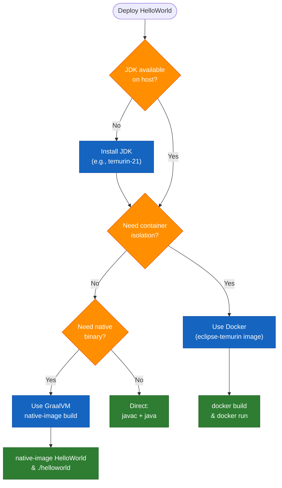

---

## 8. Cross-cutting Concepts

> **Source inputs**: Code analysis of `HelloWorld.java`; Java I/O model; security threat modelling; design pattern analysis.

### 8.1 Domain Model

The application's domain is deliberately trivial. The conceptual model contains a single entity with one instance.

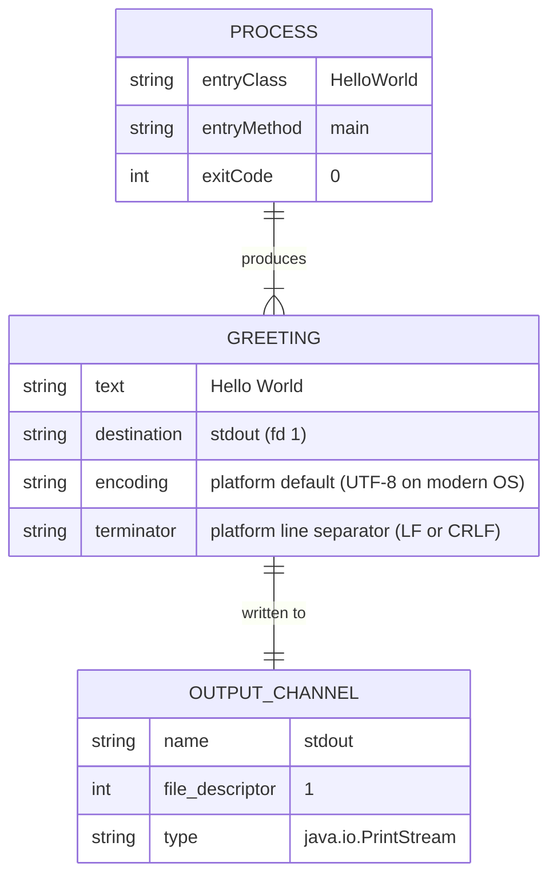

### 8.2 Output and Logging Concept

| Aspect | Decision | Rationale |
|--------|---------|-----------|
| **Output channel** | `System.out` (`stdout`, fd 1) | Standard Java output mechanism; universally redirectable. |
| **Output content** | Exactly `Hello World\n` | Fulfils FR-01; compile-time constant. |
| **Output format** | Plain text, terminated by `PrintStream.println()` line separator | Platform-aware (`\n` on Unix/macOS; `\r\n` on Windows). |
| **Logging framework** | None | SLF4J, Log4j, `java.util.logging` are all unnecessary for a single-statement program. |
| **Structured logging** | Not applicable | No structured data to log. |
| **Log levels** | Not applicable | No multi-level output concept. |
| **stderr usage** | None (currently) | `System.err` is available but unwritten. |

### 8.3 Error Handling Concept

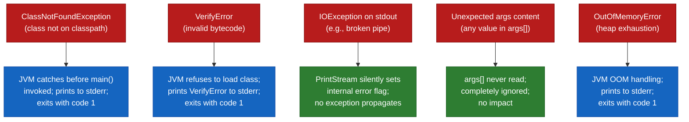

| Error Type | Handler | Impact on User |
|-----------|---------|----------------|
| `ClassNotFoundException` | JVM (pre-`main`) | Stderr message, exit code 1 |
| `VerifyError` | JVM (pre-`main`) | Stderr message, exit code 1 |
| `IOException` on stdout | `PrintStream` (swallowed) | Silent; output may be partial on broken pipe |
| Unexpected `args` content | None needed (args ignored) | Zero impact |
| `OutOfMemoryError` | JVM | Stderr message, exit code 1 (pathological) |

### 8.4 Internationalisation (i18n)

| Concern | Current State | Notes |
|---------|--------------|-------|
| Output string | Hard-coded ASCII literal `"Hello World"` | Not externalised to a `ResourceBundle` or properties file. |
| Character encoding | `PrintStream` uses platform default (UTF-8 on modern OS) | ASCII content; encoding irrelevant in practice. |
| Locale | Not applicable | No locale-sensitive formatting (dates, numbers). |
| Translation | Not applicable | String is a universal programming idiom, not a user-facing message requiring translation. |

### 8.5 Security Concept

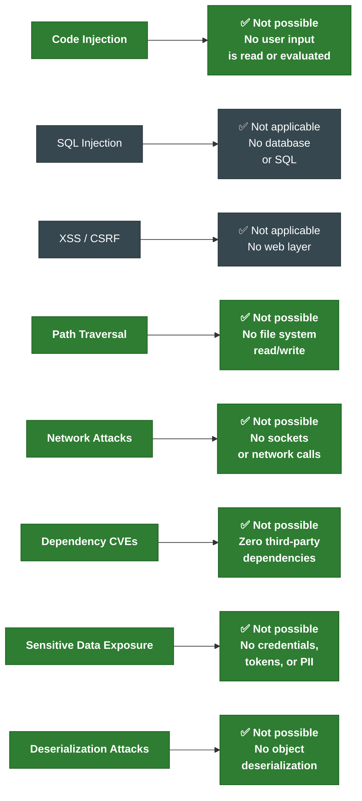

**Security assessment**: The attack surface is effectively zero. The application reads no input, makes no network calls, performs no file I/O beyond stdout, and has no external dependencies. The only theoretical exposure is the JVM itself (JVM-level vulnerabilities), which is managed by keeping the JDK up to date.

### 8.6 Performance Concept

| Concern | Value | Notes |
|---------|-------|-------|
| JVM cold-start time | ~50–200 ms | Dominated by JVM initialisation, not application code |
| Application logic time | < 1 ms | Single `println` statement |
| Memory footprint | ~30–80 MB | JVM baseline; application allocates negligible memory |
| CPU usage | Minimal | Single thread, single statement |
| Throughput | N/A | One-shot execution model; no sustained load |
| GraalVM native-image option | ~1–5 ms startup | Alternative for latency-critical scripts |

### 8.7 Testability Concept

Although no tests exist currently, the application is fully testable using standard Java testing patterns:

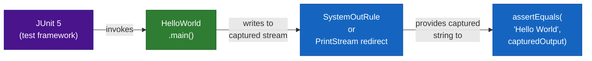

**Recommended test approach** (for future implementation):

```java
// HelloWorldTest.java  (recommended — not yet in repository)
import org.junit.jupiter.api.Test;
import static org.junit.jupiter.api.Assertions.assertEquals;
import java.io.*;

class HelloWorldTest {
    @Test
    void mainPrintsHelloWorld() throws Exception {
        ByteArrayOutputStream buf = new ByteArrayOutputStream();
        PrintStream original = System.out;
        System.setOut(new PrintStream(buf));
        try {
            HelloWorld.main(new String[0]);
        } finally {
            System.setOut(original);
        }
        assertEquals("Hello World", buf.toString().trim());
    }
}
```

### 8.8 Design Patterns Applied

| Pattern | Category | Location | Description |
|---------|---------|---------|-------------|
| **Entry Point** | Structural | `HelloWorld.main()` | Standard Java application entry-point pattern — `public static void main(String[] args)`. Required by the JVM specification. |
| **Static Factory (partial)** | Creational | `System.out` | `System.out` is a pre-constructed `PrintStream` instance accessed via a static field — a form of static factory / singleton access. |

No additional design patterns (GoF, enterprise, architectural) are applicable at this scale.

---

## 9. Architecture Decisions

> Architecture Decision Records (ADRs) document the key choices made in this project. Even for a trivial application, these decisions are worth recording to explain *why* the system is the way it is and to guide future changes.

### ADR-001 — Use Java as the Implementation Language

| Field | Value |
|-------|-------|
| **ID** | ADR-001 |
| **Status** | ✅ Accepted |
| **Date** | Project inception |
| **Deciders** | Repository owner (`ktruchcz`) |
| **Context** | A minimal demonstration program is needed as a baseline for tooling experiments. A programming language must be chosen. |
| **Decision** | Implement in Java. |
| **Rationale** | Java is widely adopted in enterprise contexts, platform-independent via the JVM, and requires zero runtime setup beyond a standard JRE. The `javac` compiler and `java` launcher are freely available on all major platforms. Java's explicit, statically-typed syntax also makes it the most amenable to automated code analysis (AST parsing, UML generation, documentation tools). |
| **Consequences** | (+) Write-once-run-anywhere portability. (+) Broad tooling ecosystem. (−) JVM startup overhead (~50–200 ms). (−) Requires JRE on every target machine. (−) Produces `.class` bytecode rather than a native binary. |
| **Alternatives considered** | Python (no compilation step, no JVM — but less enterprise tooling); C/C++ (native binary, no JVM — but platform-specific compilation); Kotlin (same JVM, cleaner syntax — but heavier toolchain for a single-file project); Shell script (simplest — but not a compiled language). |

---

### ADR-002 — No Build Tool (Raw javac)

| Field | Value |
|-------|-------|
| **ID** | ADR-002 |
| **Status** | ✅ Accepted |
| **Date** | Project inception |
| **Deciders** | Repository owner (`ktruchcz`) |
| **Context** | Single-file project with no dependencies. A build tool could be introduced but is not mandatory. |
| **Decision** | Compile directly with `javac`; do not introduce Maven, Gradle, or Ant. |
| **Rationale** | A build tool adds configuration overhead (`pom.xml`, `build.gradle`, wrapper scripts) with zero benefit for a single-class, zero-dependency project. Any developer with a JDK can compile without learning a build tool's conventions. |
| **Consequences** | (+) Zero configuration. (+) Immediate compilation for anyone with `javac`. (−) Classpath management, dependency resolution, and packaging must be done manually if the project ever grows. (−) No dependency version pinning. (−) No automated reproducible builds. |
| **Alternatives considered** | Maven (standard but requires `pom.xml`); Gradle (flexible but adds `build.gradle` + wrapper); Ant (XML-heavy, largely deprecated). |
| **Review trigger** | Reconsider when: (a) the project gains a second source file, OR (b) any external dependency is needed. |

---

### ADR-003 — No External Dependencies

| Field | Value |
|-------|-------|
| **ID** | ADR-003 |
| **Status** | ✅ Accepted |
| **Date** | Project inception |
| **Deciders** | Repository owner (`ktruchcz`) |
| **Context** | The output requirement is a single `println` call. External libraries are available for virtually every Java task. |
| **Decision** | Use only `java.lang.System` and `java.io.PrintStream` from the JDK standard library. |
| **Rationale** | Zero external dependencies means: zero supply-chain risk, zero version conflicts, zero download requirements at build time, zero CVE exposure from third-party code. The functionality needed (`println`) is definitively available in every JRE since version 1.0. |
| **Consequences** | (+) Zero CVE exposure. (+) Zero download required. (+) Guaranteed availability on any JRE. (−) If requirements expand (structured logging, HTTP output, JSON), dependencies will need to be introduced along with a build tool (triggering ADR-002 revision). |

---

### ADR-004 — No Unit Tests

| Field | Value |
|-------|-------|
| **ID** | ADR-004 |
| **Status** | ✅ Accepted *(with awareness of risk — see R-01 in §11)* |
| **Date** | Project inception |
| **Deciders** | Repository owner (`ktruchcz`) |
| **Context** | The sole observable behaviour is a single `println` statement producing a fixed string. |
| **Decision** | No test framework (JUnit, TestNG) is included. |
| **Rationale** | Testing `System.out.println("Hello World")` would require stdout-capture infrastructure (stream redirection, JUnit 5 extensions) whose complexity significantly exceeds the code under test. The risk of the output being wrong without detection is negligible. |
| **Consequences** | (+) No test dependencies to manage. (+) No test runner configuration. (−) No automated regression safety. (−) Any future expansion of the codebase has no test baseline. |
| **Review trigger** | Reconsider immediately when any logic beyond a single `println` is added. |

---

### ADR-005 — No CI/CD Pipeline

| Field | Value |
|-------|-------|
| **ID** | ADR-005 |
| **Status** | ⚠️ Accepted *(with known risk — see R-03 in §11)* |
| **Date** | Project inception |
| **Deciders** | Repository owner (`ktruchcz`) |
| **Context** | No `.github/workflows/` directory exists. GitHub Actions is available at no cost for public repositories. |
| **Decision** | No CI pipeline is configured at project inception. |
| **Rationale** | The effort to set up a workflow exceeds the value for a one-line program with no tests and no deployable artefact. Manual builds are sufficient at this scale. |
| **Consequences** | (+) Zero workflow maintenance overhead. (−) Code changes are not automatically verified on push. (−) No automated output verification. (−) No build status badge on README. |
| **Review trigger** | Reconsider when any of: tests are added (ADR-004 revised), multiple contributors begin committing, or a deployment artefact needs to be produced. |
| **Recommended action** | A GitHub Actions workflow (`build.yml`) with two steps — `javac` and `java` — would take < 10 minutes to add and provide meaningful automated verification. See §7.3 for a ready-to-use template. |

---

### ADR-006 — Default (Unnamed) Package

| Field | Value |
|-------|-------|
| **ID** | ADR-006 |
| **Status** | ✅ Accepted |
| **Date** | Project inception |
| **Deciders** | Repository owner (`ktruchcz`) |
| **Context** | The class has no `package` declaration, placing it in the unnamed (default) package. |
| **Decision** | Keep the class in the default package. Do not introduce a package hierarchy. |
| **Rationale** | A single-class application does not benefit from a package namespace. Introducing a package (e.g., `com.example.helloworld`) would require a directory hierarchy (`com/example/helloworld/HelloWorld.java`) and complicate the single-file `javac` invocation. |
| **Consequences** | (+) Simplest possible compilation command. (−) Default package classes cannot be imported from named packages (relevant only if the project grows). |
| **Review trigger** | Reconsider the moment a second class or a package-level API is needed. |

---

### ADR-007 — Hard-coded Output String

| Field | Value |
|-------|-------|
| **ID** | ADR-007 |
| **Status** | ✅ Accepted *(intentional — see TD-05 in §11)* |
| **Date** | Project inception |
| **Deciders** | Repository owner (`ktruchcz`) |
| **Context** | The string `"Hello World"` is inlined directly in the `println` call as a string literal. |
| **Decision** | Keep the string as a compile-time literal rather than extracting it to a constant, property file, or environment variable. |
| **Rationale** | Extracting to a constant (`private static final String MESSAGE`) or an external config adds no value when the string is immutable by design and the application has exactly one output. The literal form is maximally readable. |
| **Consequences** | (+) Most readable code. (−) String cannot be changed at runtime without recompilation. |
| **Review trigger** | Reconsider if the output string needs to be configurable, localised, or externally driven. |

---

### Architecture Decision Summary

```mermaid
graph LR
    classDef accepted fill:#2E7D32,stroke:#1B5E20,color:#fff
    classDef risk fill:#E65100,stroke:#BF360C,color:#fff
    classDef review fill:#1565C0,stroke:#0D47A1,color:#fff

    ADR1["ADR-001\nJava Language\n✅ Accepted"]:::accepted
    ADR2["ADR-002\nNo Build Tool\n✅ Accepted"]:::accepted
    ADR3["ADR-003\nNo Dependencies\n✅ Accepted"]:::accepted
    ADR4["ADR-004\nNo Tests\n⚠️ Risk"]:::risk
    ADR5["ADR-005\nNo CI/CD\n⚠️ Risk"]:::risk
    ADR6["ADR-006\nDefault Package\n✅ Accepted"]:::accepted
    ADR7["ADR-007\nHard-coded String\n✅ Accepted"]:::accepted

    ADR1 -->|"enables"| ADR3
    ADR3 -->|"supports"| ADR2
    ADR2 -->|"contributes to"| ADR4
    ADR4 -->|"justifies absence of"| ADR5
    ADR1 -->|"implies"| ADR6
    ADR7 -->|"consistent with"| ADR2
```

---

## 10. Quality Requirements

> **Source inputs**: Quality goals from §1.2; code metrics from static analysis; Java runtime performance characteristics.

### 10.1 Quality Tree

```mermaid
mindmap
  root((Quality\nGoals))
    Simplicity
      Single class
      Single method
      Single statement
      Zero configuration
      Zero imports
      5 source lines total
    Portability
      JVM platform independence
      No native code
      No OS-specific APIs
      JDK ≥ 1.0 compatible
      No environment variables required
    Reproducibility
      Deterministic output
      No mutable state
      No external input consumed
      Compile-time constant string
      No randomness or time dependency
    Maintainability
      Readable at a glance
      No hidden dependencies
      No magic numbers or strings
      Standard entry-point pattern
    Security
      Zero attack surface
      No user input processed
      No network connections
      No file system reads
      No third-party CVE exposure
    Evolvability
      Standard args parameter
      Conventional structure
      Easily extended with build tool
      Readily testable with JUnit 5
```

### 10.2 Quality Scenarios

Concrete, measurable quality scenarios allow the architecture to be evaluated against stated goals:

| ID | Quality Attribute | Stimulus | Environment | Response | Measurable Outcome |
|----|------------------|---------|-------------|----------|-------------------|
| QS-01 | **Functional Correctness** | User runs `java HelloWorld` with compiled class on classpath | Any supported platform (Linux/macOS/Windows), JRE ≥ 8 | Exactly the string `Hello World` followed by a newline is written to stdout | ✅ Output == `"Hello World\n"` on 100% of runs |
| QS-02 | **Portability** | Application is run on Linux (x86-64), macOS (ARM64), and Windows 11 with JRE 21 | Three distinct OS + CPU architectures | Identical stdout output and exit code `0` on all platforms | ✅ Pass on all 3 OS families |
| QS-03 | **Performance** | User runs `java HelloWorld` on any modern machine (post-2015 hardware) | Cold-start JVM, no JIT warm-up | Output appears in terminal within acceptable latency | ✅ Total wall-clock time ≤ 500 ms |
| QS-04 | **Reproducibility** | Application is run 1,000 times consecutively in a loop | Same machine, same JVM, same classpath | Every invocation produces bit-for-bit identical stdout | ✅ 0 deviations across all runs |
| QS-05 | **Understandability** | A Java developer reads `HelloWorld.java` for the first time | Developer has basic Java knowledge | Developer understands the full observable behaviour | ✅ ≤ 30 seconds comprehension time |
| QS-06 | **Compilability** | Developer runs `javac HelloWorld.java` with any JDK ≥ 8 | Default classpath, no additional flags | Compilation succeeds; `HelloWorld.class` is produced | ✅ 0 compilation errors or warnings |
| QS-07 | **Minimal Footprint** | Project is cloned from GitHub | Fresh checkout, no prior build | Source tree contains ≤ 3 files; no build artefacts | ✅ Source < 1 KB; total repo < 50 KB |
| QS-08 | **Argument Indifference** | User runs `java HelloWorld x y z` with arbitrary arguments | Any number and content of args | Output is identical to zero-argument invocation | ✅ Output == `"Hello World\n"` regardless of args |

### 10.3 Code Metrics

| Metric | Value | Assessment |
|--------|-------|------------|
| Lines of Code (total) | 5 | ✅ Minimal |
| Lines of Code (logic / executable) | 1 | ✅ Single statement |
| Blank lines | 0 | ✅ No padding |
| Number of classes | 1 | ✅ Single class |
| Number of methods | 1 | ✅ Single entry point |
| Number of fields | 0 | ✅ Stateless |
| Number of constructors (explicit) | 0 | ✅ Default constructor only |
| Number of import statements | 0 | ✅ Only `java.lang` (auto-imported) |
| Number of statements (executable) | 1 | ✅ Single `println` |
| Cyclomatic complexity (McCabe) | 1 | ✅ No branches, no loops |
| Cognitive complexity | 0 | ✅ Trivially understandable |
| External dependencies | 0 | ✅ Zero |
| Test coverage (line) | 0% | ⚠️ No tests exist |
| Test coverage (branch) | N/A | No branches to cover |
| Estimated technical debt | < 1 hour | ✅ Near-zero |
| Source file size | ~150 bytes | ✅ Minimal |
| Compiled class file size | ~400 bytes | ✅ Minimal |

### 10.4 Quality Measurement Dashboard

```mermaid
xychart-beta
    title "Quality Attribute Achievement (0 = Low, 10 = High)"
    x-axis ["Simplicity", "Portability", "Reproducibility", "Security", "Maintainability", "Performance", "Testability", "Evolvability"]
    y-axis "Score" 0 --> 10
    bar [10, 10, 10, 10, 9, 7, 3, 5]
```

*Notes: Testability scores 3/10 due to absence of tests (infrastructure is available but unused). Performance scores 7/10 reflecting acceptable but JVM-startup-dominated latency. Evolvability scores 5/10 as the codebase lacks build tooling and tests that would make evolution safer.*

---

## 11. Risks and Technical Debts

> **Source inputs**: Gap analysis of repository structure; ADR consequence analysis; code quality assessment.

### 11.1 Risk Register

```mermaid
quadrantChart
    title Risk Matrix — Likelihood vs Business Impact
    x-axis Low Likelihood --> High Likelihood
    y-axis Low Impact --> High Impact
    quadrant-1 "Monitor (Low priority)"
    quadrant-2 "Mitigate (High priority)"
    quadrant-3 "Accept (Tolerate)"
    quadrant-4 "Act Now (Critical)"

    No Tests: [0.30, 0.20]
    No Build Tool: [0.25, 0.25]
    JVM Startup Overhead: [0.65, 0.08]
    Hard-coded String: [0.15, 0.12]
    No CI Pipeline: [0.40, 0.30]
    No .gitignore: [0.50, 0.15]
    No README Content: [0.60, 0.20]
    JVM Obsolescence: [0.05, 0.70]
```

### 11.2 Identified Risks

| ID | Risk | Likelihood | Impact | Category | Current Mitigation | Recommended Mitigation |
|----|------|-----------|--------|---------|-------------------|----------------------|
| R-01 | **No automated tests** — Regressions cannot be detected automatically if the code is modified. Any change to the `println` output would only be caught by manual inspection. | Low | Low | Quality | None | Add a JUnit 5 test capturing stdout (see §8.7 for ready-to-use template). |
| R-02 | **No build automation** — Compilation must be done manually; easy to forget or misconfigure classpath when the project scales. | Medium | Low | Operations | `javac HelloWorld.java` is trivially memorisable at current scale. | Introduce `pom.xml` (Maven) or `build.gradle` (Gradle) when the project gains more than one source file. |
| R-03 | **No CI/CD pipeline** — Code changes to `main` branch are not automatically verified on push. Silent regressions are possible. | Medium | Medium | Process | None | Add GitHub Actions workflow (template provided in §7.3) — 10-minute effort for meaningful automated protection. |
| R-04 | **Hard-coded output string** — The string `"Hello World"` is inlined as a literal; cannot be parameterised without source modification and recompilation. | Low | Low | Maintainability | Intentional (see ADR-007). | Externalise to `private static final String MESSAGE` or a `.properties` file if runtime configuration is ever needed. |
| R-05 | **JVM cold-start latency** — Cold JVM startup adds 50–200 ms overhead. | High | Negligible | Performance | Acceptable for a demonstration program; no SLA exists. | Use GraalVM `native-image` if sub-10ms startup is ever required. |
| R-06 | **No `.gitignore`** — Compiled `.class` files and IDE artefacts (`.idea/`, `.classpath`, etc.) could accidentally be committed. | Medium | Low | Repository hygiene | None | Add a standard Java `.gitignore` (GitHub provides a template). |
| R-07 | **Minimal `README.md`** — The README contains only the repository name. New visitors have no onboarding information without reading this Arc42 document. | High | Low | Documentation | This Arc42 document provides full coverage. | Add a brief README with: purpose, build instructions, and a link to this document. |
| R-08 | **JVM / JDK obsolescence** — If a specific old JDK version is used and becomes EOL, security patches stop arriving. | Very Low | High | Security | Code runs on any JDK version from 1.0 onwards; no specific version dependency. | Pin to a current LTS JDK (Java 21) in CI configuration; update at each LTS release cycle. |

### 11.3 Risk Heatmap

```mermaid
graph TB
    classDef critical fill:#B71C1C,stroke:#7F0000,color:#fff,font-weight:bold
    classDef high fill:#E65100,stroke:#BF360C,color:#fff
    classDef medium fill:#F57F17,stroke:#E65100,color:#000
    classDef low fill:#2E7D32,stroke:#1B5E20,color:#fff
    classDef info fill:#1565C0,stroke:#0D47A1,color:#fff

    subgraph legend["Risk Legend"]
        C["🔴 Critical"]:::critical
        H["🟠 High"]:::high
        M["🟡 Medium"]:::medium
        L["🟢 Low / Accepted"]:::low
    end

    R3["R-03: No CI Pipeline\n🟠 Medium-High"]:::high
    R1["R-01: No Tests\n🟡 Medium"]:::medium
    R7["R-07: Minimal README\n🟡 Medium"]:::medium
    R6["R-06: No .gitignore\n🟡 Medium"]:::medium
    R2["R-02: No Build Tool\n🟢 Low"]:::low
    R4["R-04: Hard-coded String\n🟢 Low"]:::low
    R5["R-05: JVM Startup\n🟢 Accepted"]:::low
    R8["R-08: JDK Obsolescence\n🟢 Low (currently)"]:::low
```

### 11.4 Technical Debt Backlog

| ID | Debt Item | Effort | Priority | Benefit | Triggered By |
|----|----------|--------|---------|---------|-------------|
| TD-01 | Add JUnit 5 unit test with stdout capture | 30 min | 🟡 Medium | Automated regression safety | R-01 |
| TD-02 | Introduce `pom.xml` or `build.gradle` | 15 min | 🟢 Low | Reproducible, documented builds | R-02 |
| TD-03 | Create `.github/workflows/build.yml` CI pipeline | 20 min | 🟠 Medium-High | Automated build verification on push | R-03 |
| TD-04 | Add Javadoc comment to `main()` | 5 min | 🟢 Low | Self-documenting code | Best practice |
| TD-05 | Externalise `"Hello World"` to a named constant | 5 min | 🟢 Low | Improved readability per Java conventions | ADR-007 |
| TD-06 | Add a standard Java `.gitignore` file | 5 min | 🟡 Medium | Prevent build artefact commits | R-06 |
| TD-07 | Expand `README.md` with build instructions | 15 min | 🟡 Medium | Better developer onboarding | R-07 |
| TD-08 | Pin JDK version in CI (e.g., Java 21 LTS) | 10 min | 🟡 Medium | Reproducible, secure builds | R-08 |

### 11.5 Technical Debt Remediation Roadmap

```mermaid
gantt
    title Technical Debt Remediation Roadmap
    dateFormat  YYYY-MM-DD
    section Repository Hygiene  (Sprint 1 — ~35 min)
    Add .gitignore                          :td06, 2025-07-15, 1d
    Expand README.md                        :td07, after td06, 1d
    section Build and CI  (Sprint 1 — ~45 min)
    Add pom.xml / build.gradle              :td02, 2025-07-16, 1d
    Create GitHub Actions pipeline          :td03, after td02, 1d
    Pin JDK version in CI                   :td08, after td03, 1d
    section Code Quality  (Sprint 2 — ~10 min)
    Add Javadoc to main()                   :td04, 2025-07-22, 1d
    Externalise MESSAGE constant            :td05, after td04, 1d
    section Testing  (Sprint 2 — ~30 min)
    Add JUnit 5 stdout capture test         :td01, after td03, 2d
```

### 11.6 Evolution Path (Recommended)

If this project were to evolve beyond a demonstration, the following progression is recommended:

```mermaid
flowchart LR
    classDef current fill:#1565C0,stroke:#0D47A1,color:#fff,font-weight:bold
    classDef step1 fill:#2E7D32,stroke:#1B5E20,color:#fff
    classDef step2 fill:#E65100,stroke:#BF360C,color:#fff
    classDef step3 fill:#4A148C,stroke:#311B92,color:#fff

    V1["v1.0 (Current)\n• HelloWorld.java\n• Manual javac\n• No tests\n• No CI"]:::current
    V2["v1.1 (Near-term)\n• Add .gitignore\n• Expand README\n• Add build.yml CI\n• Pin JDK 21"]:::step1
    V3["v1.2 (Short-term)\n• Add pom.xml\n• Add JUnit 5 test\n• Add Javadoc\n• Extract constant"]:::step2
    V4["v2.0 (Future)\n• Parameterise message\n• Support i18n\n• Add logging\n• Dockerise"]:::step3

    V1 -->|"~70 min effort"| V2
    V2 -->|"~50 min effort"| V3
    V3 -->|"scope expansion"| V4
```

---

## 12. Glossary

> Terms are listed alphabetically. Domain-specific terms are followed by their relevance to this project.

| Term | Definition | Relevance to this Project |
|------|-----------|--------------------------|
| **ADR** | Architecture Decision Record — a document capturing an important architectural decision, its context, and its consequences. | Seven ADRs (ADR-001 through ADR-007) are recorded in §9. |
| **Arc42** | A pragmatic, lightweight template for software architecture documentation, structured into 12 standard sections. See [arc42.org](https://arc42.org). | The format used for this document. |
| **AST** | Abstract Syntax Tree — a tree representation of the syntactic structure of source code, used by compilers and analysis tools. | Used by the `ast-analyzer` agent to extract structural information from `HelloWorld.java`. |
| **Bytecode** | Platform-independent binary instructions compiled from Java source code and stored in `.class` files. Executed by the JVM. | `HelloWorld.class` contains the compiled bytecode for this application. |
| **Classpath** | A parameter (environment variable or CLI flag) that tells the JVM where to search for compiled `.class` files and JAR archives. | The current working directory (`.`) is the implicit classpath when running `java HelloWorld`. |
| **CLI** | Command-Line Interface — a text-based interface where users interact by typing commands in a terminal or shell. | The sole interface of this application: `java HelloWorld`. |
| **Compile-time constant** | A value (string, integer, etc.) that is fully determined at compilation and inlined into the class file's constant pool. | `"Hello World"` is a compile-time string constant — never changes without recompilation. |
| **Constant pool** | A per-class data structure in the `.class` file format that stores literals (strings, numbers) and symbolic references. | The string `"Hello World"` is stored in `HelloWorld.class`'s constant pool. |
| **Cyclomatic complexity** | A software metric measuring the number of linearly independent paths through a program's source code. Value of 1 = no branches. | `HelloWorld.main()` has cyclomatic complexity of 1 (zero branches, zero loops). |
| **Default package** | In Java, the unnamed package that classes belong to when they have no `package` declaration. | `HelloWorld` resides in the default package (no `package` statement). |
| **Entry Point** | In Java, the method `public static void main(String[] args)` that the JVM calls to start a program. | `HelloWorld.main()` is the application entry point. |
| **Exit Code** | An integer returned by a process to the operating system upon termination. `0` conventionally means success; non-zero values indicate errors. | This application exits with code `0` on normal completion and code `1` on JVM errors. |
| **fd 1** | File descriptor 1 — the Unix/Linux/macOS identifier for the standard output stream (`stdout`). | `System.out` writes to fd 1. |
| **GraalVM** | A high-performance JDK distribution capable of compiling Java ahead-of-time into native binaries, eliminating JVM startup overhead. | Mentioned as a potential alternative deployment option in §7.3 and R-05. |
| **HelloWorld** | The canonical minimal program in any programming language that demonstrates a working environment by printing "Hello World". | The name and purpose of the application documented in this file. |
| **JAR** | Java ARchive — a ZIP-format package containing compiled `.class` files and resources, used for distribution. | Not used in this project; no JAR is produced or consumed. |
| **Java** | A general-purpose, object-oriented, class-based, strongly-typed programming language designed for platform independence via the JVM. | The implementation language (see ADR-001). |
| **javac** | The Java compiler included in the JDK. Translates `.java` source files into `.class` bytecode files. | `javac HelloWorld.java` produces `HelloWorld.class`. |
| **Javadoc** | A documentation generation tool included in the JDK that produces HTML API documentation from specially formatted `/** */` comments. | Not yet used; adding a Javadoc comment to `main()` is listed as TD-04. |
| **JDK** | Java Development Kit — a superset of the JRE that includes development tools: `javac`, `javadoc`, `jar`, `jshell`, etc. | Required to compile `HelloWorld.java`; any JDK ≥ 1.0 is sufficient. |
| **JRE** | Java Runtime Environment — the minimum package required to run compiled Java applications; includes the JVM and standard libraries. | Required on every machine that runs the application (but not to compile). |
| **JUnit** | The de-facto standard unit testing framework for Java (currently version 5 / JUnit Jupiter). | Recommended for future testing (see TD-01 and §8.7). |
| **JVM** | Java Virtual Machine — the runtime engine that loads, verifies, and executes Java bytecode. Provides platform independence. | The execution host for `HelloWorld.class`. |
| **`java.io.PrintStream`** | A Java standard library class providing convenient text-printing methods on top of an `OutputStream`. `System.out` is an instance. | The class whose `println(String)` method is called by `HelloWorld.main()`. |
| **`java.lang`** | The core Java package, automatically imported in every Java program. Contains `System`, `Object`, `String`, `Math`, etc. | The only package used by `HelloWorld.java` (via `System`). |
| **JPMS** | Java Platform Module System — the module system introduced in Java 9 (Project Jigsaw). | Not used; `HelloWorld` runs on the unnamed module (classpath mode). |
| **Line separator** | The platform-specific character sequence used to end a text line: `\n` (LF) on Unix/macOS; `\r\n` (CRLF) on Windows. | `PrintStream.println()` automatically appends the platform line separator. |
| **`println`** | Short for "print line" — a method on `PrintStream` that writes a string followed by the platform line separator to the output stream. | The single method call in `HelloWorld.main()`. |
| **Process exit code** | See *Exit Code*. | — |
| **`public static void main(String[])`** | The mandatory Java application entry-point method signature. The JVM locates and invokes this method to start execution. | Implemented in `HelloWorld`. |
| **stdout** | Standard Output — the default output stream of a process, connected to the terminal by default but redirectable to files or pipes. | The destination of the `"Hello World"` output. |
| **`String[] args`** | The command-line arguments parameter of the Java entry-point method. Contains any arguments passed after the class name. | Declared in `HelloWorld.main()` but never read. |
| **`System.out`** | A static field of `java.lang.System` of type `java.io.PrintStream`, pre-connected to the process's standard output stream. | The output mechanism used in `HelloWorld.main()`. |
| **Technical debt** | The accumulated cost of future rework caused by choosing an expedient solution now instead of a better but more time-consuming approach. | Eight debt items (TD-01 through TD-08) are catalogued in §11.4. |
| **YAGNI** | "You Aren't Gonna Need It" — an Extreme Programming principle advising against implementing features before they are required. | The primary justification for no build tool, no tests, no dependencies (see §4.4). |

---

## Appendix A — Quick Reference

### A.1 Commands

| Action | Command |
|--------|---------|
| Compile | `javac HelloWorld.java` |
| Run | `java HelloWorld` |
| Compile and run (one line) | `javac HelloWorld.java && java HelloWorld` |
| Expected output | `Hello World` |
| Expected exit code | `0` |
| Check exit code (Unix) | `echo $?` |

### A.2 File Inventory

| File | Size | Type | Status |
|------|------|------|--------|
| `HelloWorld.java` | ~150 bytes | Java source | ✅ Present |
| `HelloWorld.class` | ~400 bytes | JVM bytecode | ⚡ Generated (not committed) |
| `README.md` | ~25 bytes | Markdown | ⚠️ Minimal |
| `arc42-documentation.md` | ~50 KB | Markdown | ✅ This document |
| `.github/workflows/build.yml` | — | YAML | ❌ Missing (see TD-03) |
| `.gitignore` | — | Git config | ❌ Missing (see TD-06) |
| `pom.xml` / `build.gradle` | — | Build descriptor | ❌ Missing (see TD-02) |

### A.3 Useful Links

| Resource | URL |
|---------|-----|
| Arc42 template | https://arc42.org |
| Java Language Specification | https://docs.oracle.com/javase/specs/ |
| Eclipse Temurin (JDK) | https://adoptium.net |
| GraalVM Community | https://www.graalvm.org |
| JUnit 5 | https://junit.org/junit5/ |
| GitHub Actions `setup-java` | https://github.com/actions/setup-java |

---

*Documentation generated by the **Arc42 Documentation Generator** (arc42-documentor agent).*  
*Based on direct source analysis of `HelloWorld.java` and `README.md` in repository `copilot-test-ktruchcz`.*  
*Version 2.0.0 — 2025-07-14*  
*All diagrams rendered with Mermaid.js — embedded as self-contained code blocks.*
