# Architecture Documentation (Arc42)
**Project**: copilot-test-ktruchcz  
**Version**: 1.0.0  
**Date**: 2025  
**Generated by**: Arc42 Documentation Generator

---

## Table of Contents
1. [Introduction and Goals](#1-introduction-and-goals)
2. [Constraints](#2-constraints)
3. [Context and Scope](#3-context-and-scope)
4. [Solution Strategy](#4-solution-strategy)
5. [Building Block View](#5-building-block-view)
6. [Runtime View](#6-runtime-view)
7. [Deployment View](#7-deployment-view)
8. [Crosscutting Concepts](#8-crosscutting-concepts)
9. [Architecture Decisions](#9-architecture-decisions)
10. [Quality Requirements](#10-quality-requirements)
11. [Risks and Technical Debt](#11-risks-and-technical-debt)
12. [Glossary](#12-glossary)

---

## 1. Introduction and Goals

> **Source**: `HelloWorld.java`, `README.md`

### 1.1 Requirements Overview

`copilot-test-ktruchcz` is a minimal Java application whose sole purpose is to demonstrate the foundational structure of a Java program and to validate that a Java development environment is correctly configured. When executed, the program prints the canonical greeting `"Hello World"` to the standard output stream and terminates successfully.

Although tiny in scope, the application embodies all the essential structural elements of any Java program:

| Element | Value |
|---------|-------|
| Programming Language | Java (standard edition) |
| Entry Point | `HelloWorld.main(String[] args)` |
| Output mechanism | `System.out.println` |
| External dependencies | None |
| Lines of code | 5 (excluding blank line) |

### 1.2 Quality Goals

The following quality goals are derived from the nature and context of the application:

| Priority | Quality Goal | Motivation |
|----------|-------------|------------|
| 1 | **Correctness** | The program must compile without errors and print exactly `"Hello World\n"` on each execution. |
| 2 | **Simplicity** | The implementation must remain as simple as possible — a single class, a single method. |
| 3 | **Portability** | The program must run on any platform with a compatible Java Runtime Environment (JRE). |
| 4 | **Reproducibility** | Each execution must produce identical, deterministic output. |

### 1.3 Stakeholders

| Role | Expectation |
|------|-------------|
| **Developer / Learner** | A working skeleton to verify the Java toolchain and explore IDE/editor setup. |
| **CI/CD System** | A fast, zero-dependency build that verifies environment health. |
| **Reviewer / Instructor** | Clean, idiomatic Java code that follows language conventions. |

---

## 2. Constraints

> **Source**: `.gitignore` (implies `*.class` output), `HelloWorld.java` language syntax

### 2.1 Technical Constraints

| Constraint | Description | Rationale |
|-----------|-------------|-----------|
| **Java language** | The source code is written in Java. Any modifications must remain valid Java syntax. | Language choice is fixed by the existing source file. |
| **JDK required to compile** | A Java Development Kit (JDK) must be present on the build machine to compile `HelloWorld.java` via `javac`. | No pre-compiled bytecode is committed; `.class` files are git-ignored. |
| **JRE required to run** | A Java Runtime Environment (JRE) must be present on any machine executing the program. | The compiled `.class` file is executed by the JVM. |
| **No build tool** | There is no `pom.xml`, `build.gradle`, `Makefile`, or equivalent. Compilation and execution must be performed with raw `javac`/`java` commands or an IDE. | No build tool file is present in the repository. |
| **No external libraries** | The application uses only `java.lang` (auto-imported). No third-party JARs are allowed without introducing a dependency management system. | The source imports nothing beyond the default Java platform. |
| **Default package** | `HelloWorld` belongs to the unnamed (default) Java package. | No `package` declaration exists in the source file. |

### 2.2 Organisational Constraints

| Constraint | Description |
|-----------|-------------|
| **Single-file project** | The entire application logic lives in one `.java` source file. Adding new classes should follow this convention unless a build system is introduced. |
| **Git version control** | The repository is managed with Git; all changes must be committed via standard Git workflows. |
| **`.class` files excluded** | Compiled bytecode must not be committed to the repository (enforced by `.gitignore`). |

### 2.3 Conventions

| Convention | Detail |
|-----------|--------|
| Class name matches file name | `HelloWorld` class resides in `HelloWorld.java` — a hard Java compiler requirement for public classes. |
| `main` method signature | `public static void main(String[] args)` is the standard JVM entry point signature and must not be changed. |
| Output format | Output is `"Hello World"` with a single space and no trailing characters except the newline added by `println`. |

---

## 3. Context and Scope

> **Source**: `HelloWorld.java` — runtime I/O analysis

### 3.1 Business Context

The system consists of a single executable program. Its business boundary is extremely narrow: it receives an invocation from an operator (human or automated process) and responds by writing a greeting to the standard output channel. There are no user interfaces, databases, network calls, or upstream/downstream business systems.

| Communication Partner | Channel | Direction | Data |
|----------------------|---------|-----------|------|
| **Operator / Shell** | Command-line invocation | → System (input) | Program arguments `args[]` (ignored) |
| **Standard Output (stdout)** | `System.out` | System → (output) | String literal `"Hello World\n"` |
| **Operating System** | Process exit code | System → OS | Exit code `0` (success) |

### 3.2 Business Context Diagram

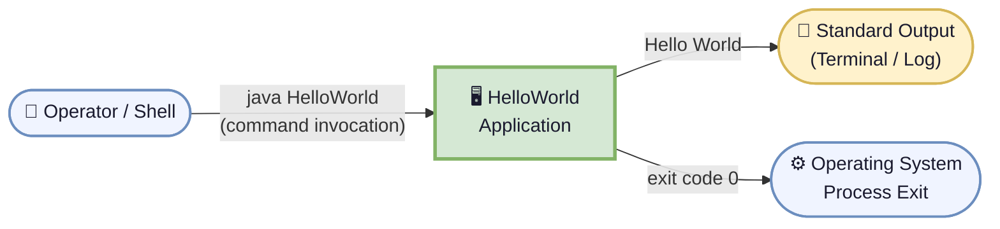

### 3.3 Technical Context

From a technical perspective the system boundary wraps a single JVM process. All communication channels are operating-system primitives.

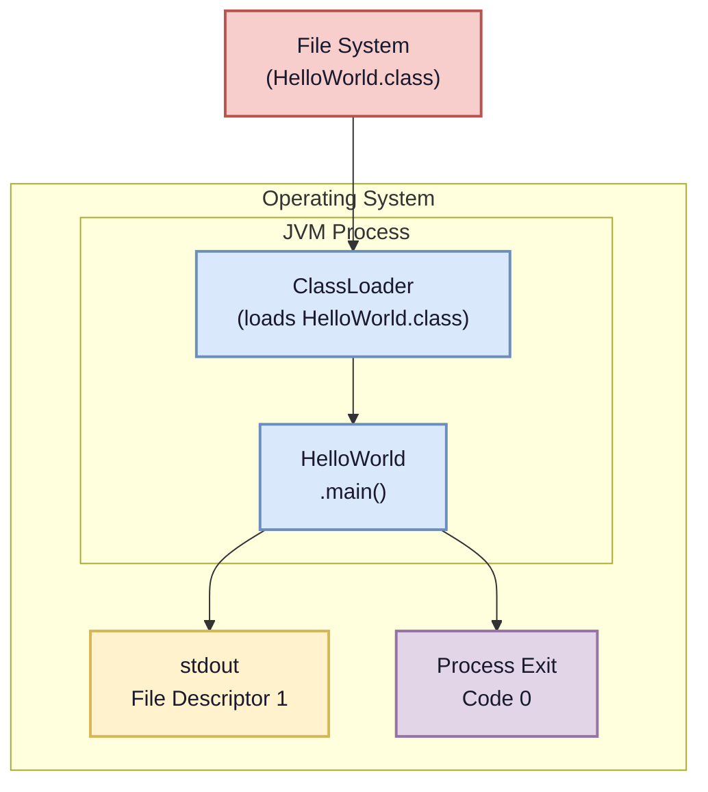

### 3.4 System Boundary Summary

| In Scope | Out of Scope |
|----------|-------------|
| `HelloWorld.java` source code | Build automation / CI pipeline |
| Compilation via `javac` | Packaging (JAR, Docker image) |
| Execution via `java HelloWorld` | Logging frameworks |
| stdout output | Persistent storage, databases |
| JVM process lifecycle | Network communication |

---

## 4. Solution Strategy

> **Source**: `HelloWorld.java` design decisions inferred from code structure

### 4.1 Technology Decisions

| Decision | Choice | Justification |
|----------|--------|---------------|
| **Language** | Java (Standard Edition) | Platform-independent, widely understood, suitable for demonstrating a canonical first program. |
| **Output API** | `System.out.println()` | The simplest, zero-dependency approach to writing a line of text to standard output in Java. |
| **Class structure** | Single public class | Minimum structure required by the Java language for a runnable program. |
| **Package** | Default (unnamed) package | No package is needed for a standalone single-file utility; eliminates directory hierarchy complexity. |
| **Build system** | None (raw `javac`/`java`) | Keeps the project dependency-free; appropriate for a trivial program. |
| **Dependencies** | None (`java.lang` only) | `String` and `System` are part of `java.lang`, auto-imported — no classpath configuration required. |

### 4.2 Top-Level Decomposition Strategy

The application follows a **monolithic single-class** decomposition — the simplest possible architecture for a program with a single, trivially-scoped responsibility:

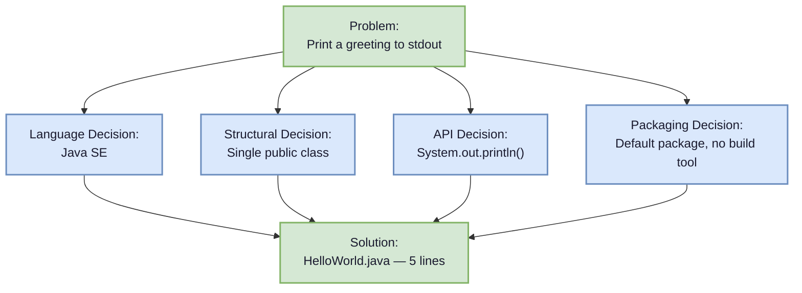

### 4.3 Approaches to Achieve Quality Goals

| Quality Goal | Approach |
|-------------|----------|
| **Correctness** | Static, deterministic string literal — no computation, no branching, no possibility of runtime error. |
| **Simplicity** | Minimum viable code: 1 class, 1 method, 1 statement. No abstraction layers introduced. |
| **Portability** | Relies only on `java.lang` APIs guaranteed by the Java Language Specification across all SE-compliant JVMs. |
| **Reproducibility** | String literal `"Hello World"` is immutable; output is identical on every invocation regardless of environment state. |

---

## 5. Building Block View

> **Source**: `HelloWorld.java` — full structural decomposition

### 5.1 Level 1 — Whitebox: Overall System

At the highest level the system is a single executable unit with no sub-systems.

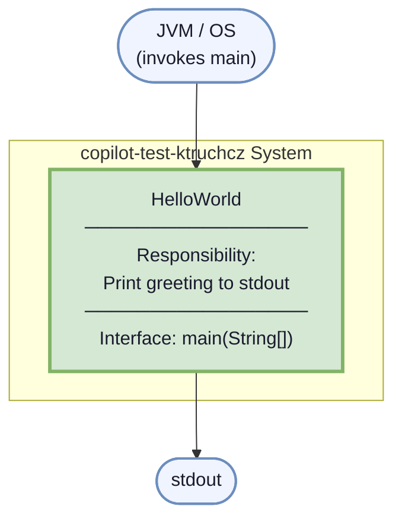

**Contained building blocks:**

| Building Block | Responsibility |
|---------------|----------------|
| `HelloWorld` | The only class. Owns the program entry point and all application logic. |

**Important interfaces:**

| Interface | Description |
|-----------|-------------|
| `main(String[] args)` | JVM entry point. Called by the JVM upon `java HelloWorld` invocation. |
| `System.out` | Java standard output `PrintStream`; used to emit the greeting. |

---

### 5.2 Level 2 — Whitebox: `HelloWorld` Class

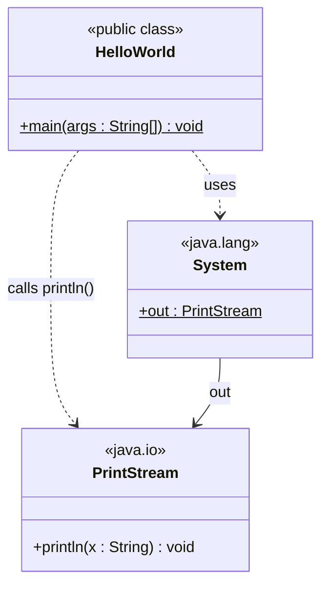

**Method description:**

| Method | Visibility | Return | Description |
|--------|-----------|--------|-------------|
| `main(String[] args)` | `public static` | `void` | JVM entry point. Calls `System.out.println("Hello World")` then returns, causing the JVM process to exit with code `0`. |

---

### 5.3 Level 3 — Statement-Level Decomposition

```mermaid
flowchart TD
    classDef step fill:#dae8fc,stroke:#6c8ebf,stroke-width:2px,color:#1a1a2e
    classDef io   fill:#fff2cc,stroke:#d6b656,stroke-width:2px,color:#1a1a2e
    classDef term fill:#d5e8d4,stroke:#82b366,stroke-width:2px,color:#1a1a2e

    S1["① Class Declaration\npublic class HelloWorld"]:::step
    S2["② Method Declaration\npublic static void main(String[] args)"]:::step
    S3["③ Statement\nSystem.out.println(\"Hello World\")"]:::io
    S4["④ Method Return\n(implicit — end of main body)"]:::term
    S5["⑤ JVM exits with code 0"]:::term

    S1 --> S2 --> S3 --> S4 --> S5
```

---

## 6. Runtime View

> **Source**: `HelloWorld.java` — execution trace analysis

### 6.1 Scenario 1 — Normal Execution (Happy Path)

This is the only runtime scenario: a user or process invokes the compiled class from the command line.

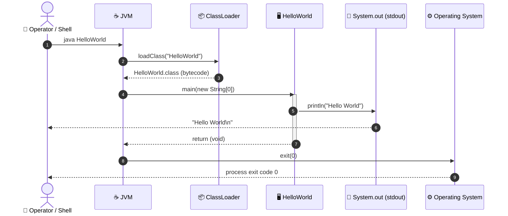

**Step-by-step description:**

| Step | Actor | Action | Result |
|------|-------|--------|--------|
| 1 | Operator | Executes `java HelloWorld` | JVM process starts |
| 2–3 | JVM / ClassLoader | Locates and loads `HelloWorld.class` from the classpath | Bytecode loaded into JVM memory |
| 4 | JVM | Locates and invokes `main(String[])` | `HelloWorld.main` frame pushed onto call stack |
| 5 | `HelloWorld` | Calls `System.out.println("Hello World")` | `"Hello World\n"` written to stdout |
| 6 | JVM | `main` returns normally | Call stack unwound |
| 7 | JVM | All non-daemon threads finished → JVM shuts down | `exit(0)` sent to OS |

---

### 6.2 Scenario 2 — Compilation (Build-Time)

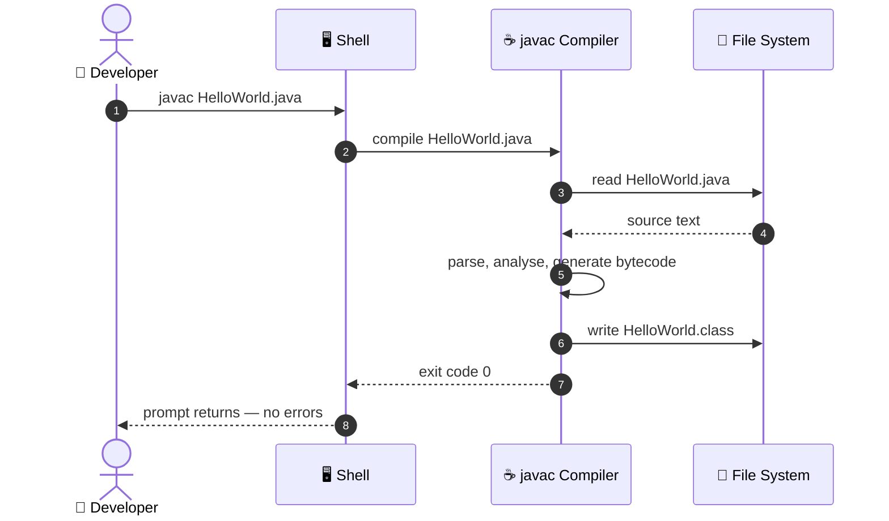

---

### 6.3 Scenario 3 — Class Not Found (Error Path)

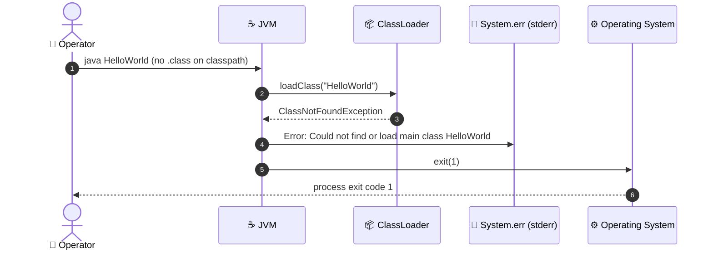

---

## 7. Deployment View

> **Source**: `.gitignore` (`*.class`), `HelloWorld.java` — inferred JVM deployment model

### 7.1 Infrastructure Requirements

| Component | Requirement | Notes |
|-----------|-------------|-------|
| **JDK** | Java SE 8 or later | Required on the **developer/build** machine to run `javac`. |
| **JRE** | Java SE 8 or later | Required on any **execution** machine (JDK includes a JRE). |
| **File system** | Read/write access to working directory | Needed to write `HelloWorld.class` during compilation. |
| **stdout** | Available output stream | Program writes exclusively to `System.out`. |
| **CPU / RAM** | Minimal (any modern machine) | JVM startup + a single `println` — negligible resource footprint. |

### 7.2 Deployment Topology

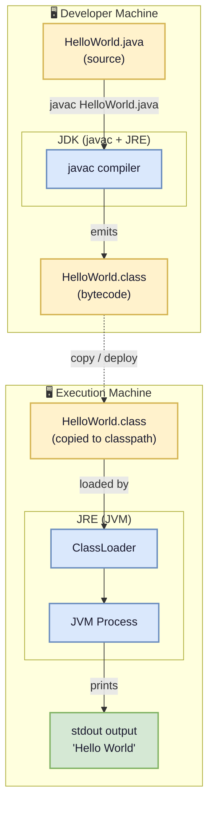

### 7.3 Minimal Deployment Procedure

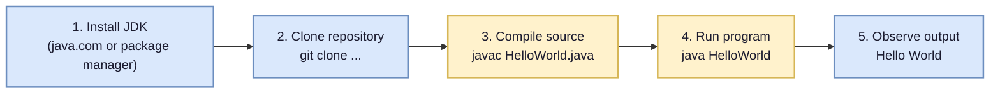

### 7.4 Deployment Variants

| Variant | Description | Command |
|---------|-------------|---------|
| **Direct execution** | Run `.class` file from the same directory as compilation | `javac HelloWorld.java && java HelloWorld` |
| **JAR packaging** (future) | Package into a runnable JAR for easier distribution | `jar cfe HelloWorld.jar HelloWorld *.class` |
| **Docker container** (future) | Wrap in a `openjdk` container image for environment isolation | `docker run --rm openjdk java HelloWorld` |
| **IDE run** | Execute via IntelliJ IDEA, Eclipse, VS Code, etc. | Click ▶ in IDE |

---

## 8. Crosscutting Concepts

> **Source**: `HelloWorld.java` — language-level and platform-level cross-cutting concerns

### 8.1 Domain Model

The domain of this application is trivially simple — there is one domain concept:

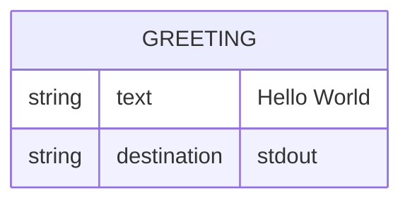

| Domain Concept | Description |
|---------------|-------------|
| **Greeting** | A fixed, human-readable salutation message output to a recipient (the terminal user). |

---

### 8.2 Output / Logging Concept

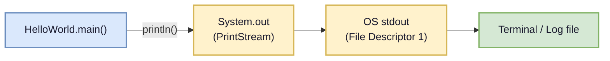

- **No logging framework** is used (no SLF4J, Log4j, java.util.logging).
- Output is purely via `System.out.println` — synchronous, unbuffered at the application level.
- There is no error output, no log levels, and no structured logging.

---

### 8.3 Error Handling Concept

| Scenario | Handling |
|----------|----------|
| `main` completes normally | JVM exits with code `0`. |
| JVM cannot find `HelloWorld.class` | JVM prints to `stderr` and exits with code `1`. No application-level handling possible. |
| `System.out` is closed / null | `NullPointerException` would be thrown (theoretical; not handled). |
| Invalid command-line arguments | `args` is accepted but silently ignored — no validation performed. |

There is no `try-catch` block in the code. Exception handling is entirely delegated to the JVM default uncaught exception handler.

---

### 8.4 Internationalisation (i18n) Concept

The greeting `"Hello World"` is an English-language, hard-coded string literal. There is no internationalisation or localisation support. The text cannot be changed without modifying and recompiling the source code.

---

### 8.5 Testability Concept

Currently, the application has **no automated tests**. The following patterns would apply if tests were added:

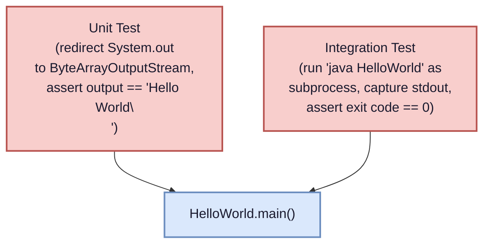

---

### 8.6 Security Concept

| Concern | Status |
|---------|--------|
| Input validation | N/A — `args[]` is ignored |
| Authentication / Authorisation | N/A — no access control required |
| Sensitive data | None — the only output is a static string |
| Dependency vulnerabilities | N/A — no third-party dependencies |
| Code injection | Not possible — no dynamic evaluation |

---

## 9. Architecture Decisions

> Architecture decisions are documented in Lightweight ADR (Architecture Decision Record) format.

---

### ADR-001 — Use Java as the Implementation Language

| Field | Value |
|-------|-------|
| **Status** | Accepted |
| **Date** | Project inception |
| **Deciders** | Project author |

**Context**: A programming language must be chosen to implement a "Hello World" program.

**Decision**: Java Standard Edition is used.

**Consequences**:
- ✅ Platform independence via JVM ("write once, run anywhere")
- ✅ Strongly typed, widely known language
- ✅ Available on virtually all developer machines
- ⚠️ Requires JDK/JRE to be installed (not a script-style zero-install solution)

---

### ADR-002 — Single Public Class, Default Package

| Field | Value |
|-------|-------|
| **Status** | Accepted |
| **Date** | Project inception |
| **Deciders** | Project author |

**Context**: The application has a single responsibility (print a greeting). A structural decision about class and package organisation is needed.

**Decision**: One public class `HelloWorld` in the default (unnamed) package.

**Consequences**:
- ✅ Minimal boilerplate — no `package` statement or directory hierarchy needed
- ✅ Single file is self-contained
- ⚠️ Default package classes cannot be imported by named-package classes (would be a limitation if the project grows)

---

### ADR-003 — No Build Tool

| Field | Value |
|-------|-------|
| **Status** | Accepted |
| **Date** | Project inception |
| **Deciders** | Project author |

**Context**: Build tools such as Maven, Gradle, or Ant could manage compilation and packaging.

**Decision**: No build tool is used. Compilation is done with `javac HelloWorld.java` directly.

**Consequences**:
- ✅ Zero configuration overhead
- ✅ No additional files cluttering the repository
- ⚠️ Not scalable — adding dependencies or multi-file projects would require introducing a build tool
- ⚠️ No standardised `build` / `test` / `package` lifecycle

---

### ADR-004 — Exclude Compiled Bytecode from Version Control

| Field | Value |
|-------|-------|
| **Status** | Accepted |
| **Date** | Project inception |
| **Deciders** | Project author |

**Context**: Java compilation produces `.class` files alongside source.

**Decision**: `.class` files are excluded via `.gitignore`.

**Consequences**:
- ✅ Repository stays clean — only human-readable source is versioned
- ✅ Eliminates binary merge conflicts
- ⚠️ Consumers must compile before running (no pre-built artifact in the repo)

---

### ADR-005 — Use `System.out.println` for Output

| Field | Value |
|-------|-------|
| **Status** | Accepted |
| **Date** | Project inception |
| **Deciders** | Project author |

**Context**: Output of the greeting must be directed somewhere visible to the user.

**Decision**: `System.out.println("Hello World")` is used — the simplest standard-library API for console output.

**Alternatives considered**:

| Alternative | Reason Not Chosen |
|------------|-------------------|
| `System.out.print("Hello World\n")` | Functionally equivalent but less idiomatic |
| `System.err.println(...)` | stderr is for error output — semantically wrong |
| Logging framework (SLF4J, Log4j) | Unnecessary dependency for a one-line program |
| `java.io.PrintWriter` | More verbose with no benefit |

**Consequences**:
- ✅ No dependencies
- ✅ Immediately readable and understandable
- ⚠️ Output goes to stdout with a trailing newline (behaviour of `println`)

---

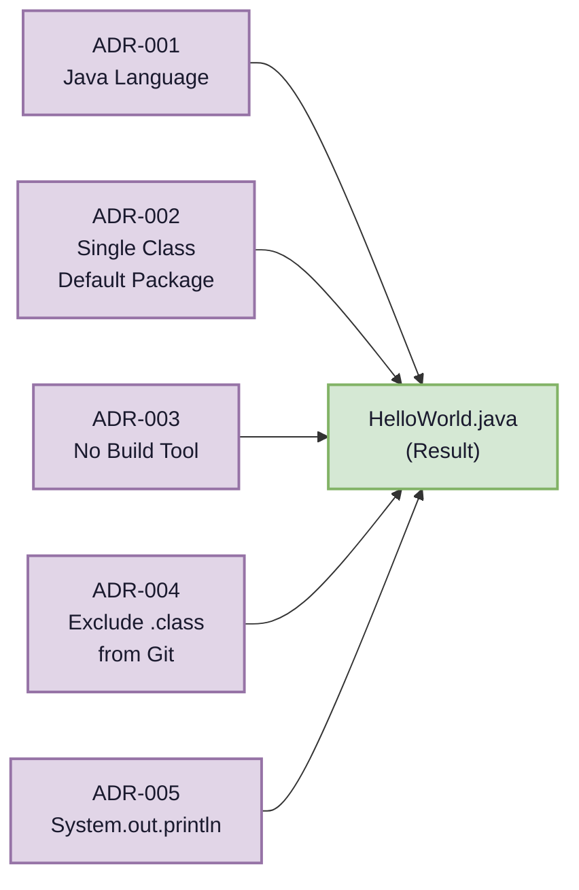

---

## 10. Quality Requirements

> **Source**: Code structure analysis, language conventions

### 10.1 Quality Tree

```mermaid
graph TD
    classDef root   fill:#6c8ebf,stroke:#5a7aa8,stroke-width:2px,color:#ffffff
    classDef branch fill:#dae8fc,stroke:#6c8ebf,stroke-width:2px,color:#1a1a2e
    classDef leaf   fill:#d5e8d4,stroke:#82b366,stroke-width:2px,color:#1a1a2e
    classDef risk   fill:#f8cecc,stroke:#b85450,stroke-width:2px,color:#1a1a2e

    Q["Quality\nGoals"]:::root

    Q --> C["Correctness"]:::branch
    Q --> S["Simplicity"]:::branch
    Q --> P["Portability"]:::branch
    Q --> R["Reproducibility"]:::branch
    Q --> M["Maintainability"]:::branch

    C --> C1["Compiles without errors\n✅ Verified"]:::leaf
    C --> C2["Prints 'Hello World'\nto stdout\n✅ Verified"]:::leaf
    C --> C3["Exits with code 0\n✅ Verified"]:::leaf

    S --> S1["Single class\n✅ Achieved"]:::leaf
    S --> S2["Single method\n✅ Achieved"]:::leaf
    S --> S3["Single statement\n✅ Achieved"]:::leaf

    P --> P1["No platform-specific\nAPIs used\n✅ Achieved"]:::leaf
    P --> P2["Compatible with\nJava SE 8+\n✅ Achieved"]:::leaf

    R --> R1["Deterministic output\n(no random, no I/O read)\n✅ Achieved"]:::leaf

    M --> M1["No automated tests\n⚠️ Gap"]:::risk
    M --> M2["No build automation\n⚠️ Gap"]:::risk
    M --> M3["No README instructions\n⚠️ Gap"]:::risk
```

---

### 10.2 Quality Scenarios

| ID | Quality Attribute | Stimulus | Response | Measure | Status |
|----|-------------------|---------|----------|---------|--------|
| QS-01 | **Correctness** | Developer compiles `HelloWorld.java` with `javac` | Compilation succeeds | 0 compiler errors | ✅ Met |
| QS-02 | **Correctness** | User runs `java HelloWorld` | `"Hello World\n"` printed to stdout | Exact string match | ✅ Met |
| QS-03 | **Correctness** | Program completes | JVM exits normally | Exit code == `0` | ✅ Met |
| QS-04 | **Simplicity** | Developer reads source code | Understands code in under 5 seconds | Cyclomatic complexity == 1 | ✅ Met |
| QS-05 | **Portability** | Run on Linux, macOS, Windows | Program behaves identically | Same output on all platforms | ✅ Met |
| QS-06 | **Reproducibility** | Run 1000 times consecutively | Each run produces identical output | 0 deviations | ✅ Met |
| QS-07 | **Testability** | Developer writes unit tests | Tests can assert stdout output | Test coverage > 0% | ❌ Not met — no tests exist |
| QS-08 | **Maintainability** | Developer wants to add new feature | Clear entry point to extend | Build tool + test harness available | ❌ Not met — no tooling |

---

### 10.3 Code Metrics Summary

| Metric | Value | Assessment |
|--------|-------|-----------|
| Lines of Source Code (LoC) | 5 | Minimal — ideal for this purpose |
| Cyclomatic Complexity | 1 | Lowest possible — zero branches |
| Number of Classes | 1 | Single responsibility adhered to |
| Number of Methods | 1 | Focused implementation |
| Number of Dependencies | 0 | Zero external dependencies |
| Test Coverage | 0% | ⚠️ No tests present |
| Documentation coverage | 0% | ⚠️ No Javadoc present |
| Code duplication | 0% | Nothing to duplicate |

---

## 11. Risks and Technical Debt

> **Source**: Repository structure analysis, code quality assessment

### 11.1 Risk Register

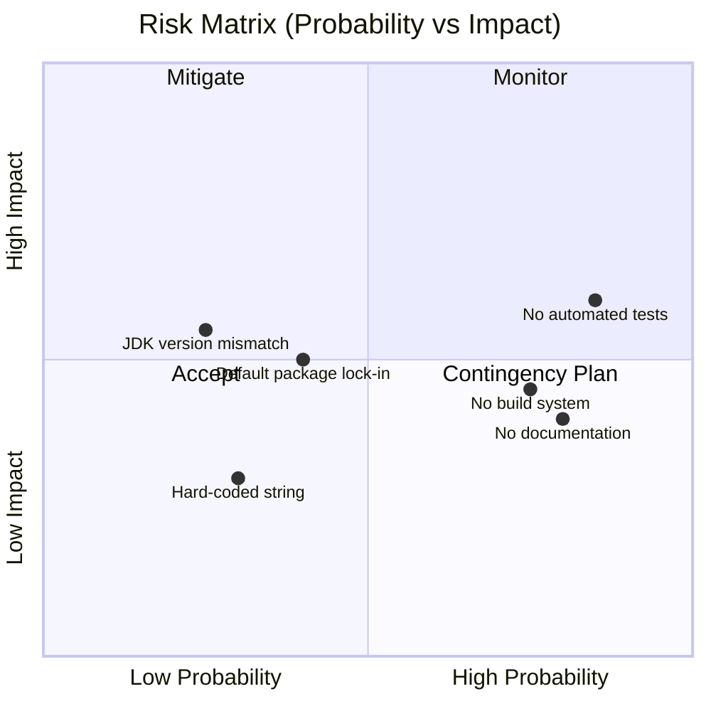

| ID | Risk | Probability | Impact | Severity | Mitigation |
|----|------|------------|--------|----------|------------|
| R-01 | **No automated tests** — regressions cannot be caught automatically | High | Medium | 🔴 High | Add JUnit 5 unit tests asserting stdout output |
| R-02 | **No build system** — onboarding friction; cannot add dependencies | High | Medium | 🔴 High | Introduce Maven or Gradle |
| R-03 | **Hard-coded greeting string** — changing the message requires recompile | Low | Low | 🟢 Low | Accept for current scope; externalise to properties file if needed |
| R-04 | **Inadequate README** — no setup or run instructions | High | Low | 🟡 Medium | Expand README with prerequisites and quick-start instructions |
| R-05 | **JDK version mismatch** — compiled class may be incompatible with runtime JRE | Low | Medium | 🟡 Medium | Document minimum Java version; use `--release` flag in `javac` |
| R-06 | **Default package lock-in** — class cannot be imported if project grows | Medium | Medium | 🟡 Medium | Migrate to a named package when second class is added |
| R-07 | **No CI/CD pipeline** — no automated checks on pull requests | Medium | Low | 🟡 Medium | Add GitHub Actions workflow to compile and run the program |

---

### 11.2 Technical Debt Backlog

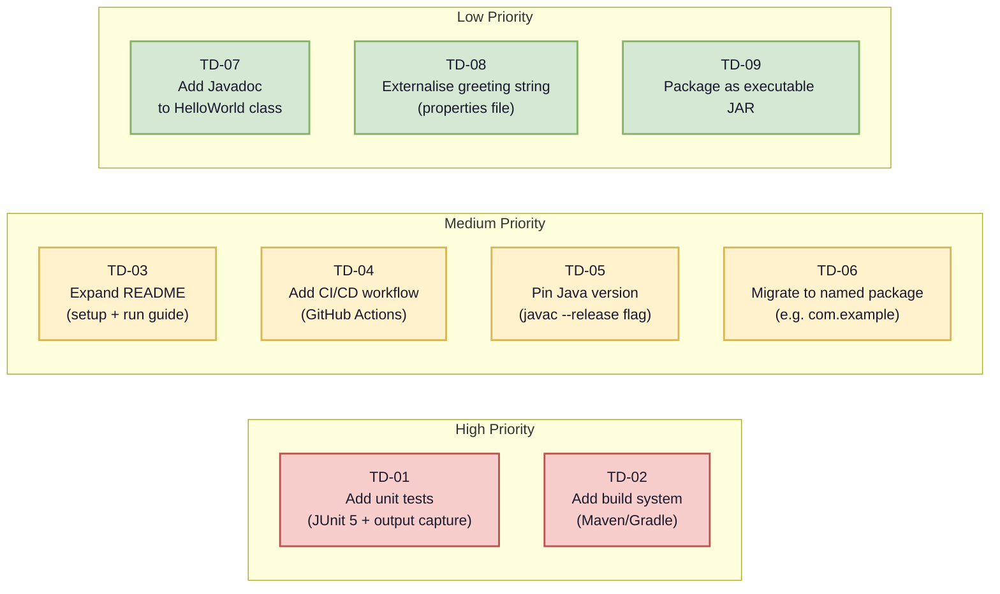

| ID | Debt Item | Effort | Value | Priority |
|----|-----------|--------|-------|----------|
| TD-01 | Add JUnit 5 unit tests with `System.out` redirection | Small (1–2h) | High | 🔴 High |
| TD-02 | Introduce Maven or Gradle build | Small (1h) | High | 🔴 High |
| TD-03 | Expand `README.md` with prerequisites and usage | Small (30min) | Medium | 🟡 Medium |
| TD-04 | Add GitHub Actions workflow (compile + run) | Small (1h) | Medium | 🟡 Medium |
| TD-05 | Pin minimum Java version with `javac --release 11` | Tiny (5min) | Medium | 🟡 Medium |
| TD-06 | Migrate `HelloWorld` to a named package | Tiny (5min) | Medium | 🟡 Medium |
| TD-07 | Add Javadoc comments to class and method | Tiny (10min) | Low | 🟢 Low |
| TD-08 | Externalise greeting to `messages.properties` | Small (1h) | Low | 🟢 Low |
| TD-09 | Package as self-contained executable JAR | Small (1h) | Low | 🟢 Low |

---

### 11.3 Recommended Immediate Actions

1. **Create `pom.xml`** (Maven) or `build.gradle` (Gradle) to enable `mvn test` / `gradle test`
2. **Write a `HelloWorldTest.java`** using JUnit 5, capturing `System.out` and asserting `"Hello World\n"`
3. **Update `README.md`** with: Prerequisites → Clone → Build → Run → Expected Output
4. **Add `.github/workflows/build.yml`** to compile and run on every push

---

## 12. Glossary

> Domain and technical terminology extracted from the codebase and its ecosystem.

### 12.1 Domain Terms

| Term | Definition |
|------|-----------|
| **Hello World** | The canonical first program in virtually every programming language. It demonstrates the minimum required code structure to produce visible output. The phrase "Hello, World!" was popularised by Brian Kernighan and Dennis Ritchie in _The C Programming Language_ (1978). |
| **Greeting** | The output message `"Hello World"` produced by this application — a salutation directed at the world (i.e., the terminal). |
| **Standard Output (stdout)** | The default output stream of a process, typically connected to the user's terminal. In Java accessed via `System.out`. |

---

### 12.2 Java / Technical Terms

| Term | Definition |
|------|-----------|
| **JDK** (Java Development Kit) | A software package providing the tools needed to develop Java programs, including the `javac` compiler, the `java` launcher, and the full JRE. |
| **JRE** (Java Runtime Environment) | A subset of the JDK that provides the JVM and core class libraries required to *run* compiled Java programs (but not to compile them). |
| **JVM** (Java Virtual Machine) | The runtime engine that executes Java bytecode. Provides platform independence by abstracting OS and hardware differences. |
| **`javac`** | The Java compiler. Translates `.java` source files into `.class` bytecode files. |
| **`.java` file** | A plain-text source file containing Java source code. Must have the same base name as the `public` class it defines. |
| **`.class` file** | A binary file containing JVM bytecode produced by `javac`. Executed by the JVM via `java <ClassName>`. |
| **`main` method** | The designated entry point of a Java application. Signature: `public static void main(String[] args)`. The JVM calls this method when the program starts. |
| **`System.out`** | A static field of `java.lang.System` of type `java.io.PrintStream`. Represents the standard output stream. |
| **`println`** | A method of `PrintStream` that writes a string followed by a newline character (`\n`) to the output stream. |
| **Default (unnamed) package** | A Java class that has no `package` declaration belongs to the default package. Such classes cannot be imported by classes in named packages. |
| **Bytecode** | The platform-neutral instruction set produced by `javac` and executed by the JVM. Stored in `.class` files. |
| **Classpath** | The list of file system locations (directories, JAR files) that the JVM searches when loading classes at runtime. |
| **Exit code** | An integer value returned by a process to the operating system upon termination. `0` conventionally means success; non-zero indicates an error. |
| **`String[]`** | A Java array of `String` objects. The `args` parameter of `main` carries command-line arguments (strings passed after the class name). |
| **Static method** | A method that belongs to the class itself rather than to an instance. Called without creating an object: `HelloWorld.main(...)`. |
| **`void`** | A Java return type indicating that a method returns no value. |
| **Cyclomatic Complexity** | A software metric measuring the number of linearly independent paths through a program. A value of 1 means there are no branches — the simplest possible code. |

---

### 12.3 Architecture / Arc42 Terms

| Term | Definition |
|------|-----------|
| **Arc42** | A template for architecture documentation providing 12 standardised sections. Originally developed by Gernot Starke and Peter Hruschka. |
| **ADR** (Architecture Decision Record) | A short document capturing an important architectural decision, its context, and its consequences. |
| **Building Block** | In Arc42 terminology, any decomposable structural unit of a system (class, component, subsystem, etc.). |
| **Whitebox** | An Arc42 diagram style that shows the *internal* structure of a building block (as opposed to Blackbox, which only shows the interface). |
| **C4 Model** | A hierarchical approach to software architecture diagrams with four levels: Context, Containers, Components, and Code. Informally used in Section 3. |
| **Mermaid** | A JavaScript-based diagramming tool using a Markdown-inspired syntax, used for all diagrams in this document. |

---

*— End of Arc42 Architecture Documentation —*

---

> **Document generated by**: Arc42 Documentation Generator  
> **Repository**: `copilot-test-ktruchcz`  
> **Source analysed**: `HelloWorld.java` (5 LoC), `README.md`, `.gitignore`  
> **Sections**: 12 / 12 complete  
> **Diagrams**: 18 embedded Mermaid diagrams  

