# Architecture Documentation (Arc42)

**Project**: LegacyFinApp-026  
**Maven Coordinates**: `com.example:hello-world:1.0.0`  
**Version**: 1.0.0  
**Date**: 2025-01-01  
**Generated by**: Arc42 Documentation Generator  
**Replaces**: Prior version containing 27 factual errors (described a single-class stub; actual application has 4 production classes in a 3-tier layered architecture)

---

## Table of Contents

1. [Introduction and Goals](#1-introduction-and-goals)
2. [Constraints](#2-constraints)
3. [Context and Scope](#3-context-and-scope)
4. [Solution Strategy](#4-solution-strategy)
5. [Building Block View](#5-building-block-view)
6. [Runtime View](#6-runtime-view)
7. [Deployment View](#7-deployment-view)
8. [Crosscutting Concepts](#8-crosscutting-concepts)
9. [Architecture Decisions](#9-architecture-decisions)
10. [Quality Requirements](#10-quality-requirements)
11. [Risks and Technical Debt](#11-risks-and-technical-debt)
12. [Glossary](#12-glossary)

---

## 1. Introduction and Goals

> **Source inputs**: `analysis_results.json`, `business_rules_extractor_analysis.json`, `code_assessment.json`

### 1.1 Requirements Overview

**LegacyFinApp-026** (`com.example:hello-world:1.0.0`) is a Java 25 CLI console application that generates personalised greeting messages. When invoked from the command line, it accepts an optional recipient name as a CLI argument and prints a formatted greeting to standard output. The application implements a full **3-tier layered architecture** with constructor-based dependency injection across **4 production classes**.

**Functional Requirements:**

| ID | Requirement | Priority | Implementing Class |
|----|-------------|----------|--------------------|
| FR-01 | Accept an optional recipient name as `args[0]` on the CLI | Must-Have | `GreetingController` |
| FR-02 | Fall back to `"World"` when no recipient is supplied | Must-Have | `GreetingService` |
| FR-03 | Trim leading/trailing whitespace from any supplied recipient | Must-Have | `GreetingService` |
| FR-04 | Fall back to `"World"` when the supplied recipient is blank (whitespace-only) | Must-Have | `GreetingService` |
| FR-05 | Format the greeting using the template `"Hello %s"` | Must-Have | `GreetingRepository` + `GreetingService` |
| FR-06 | Write the formatted greeting to stdout with a trailing newline | Must-Have | `HelloWorld.main()` |
| FR-07 | Ignore all CLI arguments after `args[0]` | Must-Have | `GreetingController` |

**Example outputs:**

| Invocation | Output |
|-----------|--------|
| `java HelloWorld` | `Hello World` |
| `java HelloWorld Alice` | `Hello Alice` |
| `java HelloWorld "  "` | `Hello World` |
| `java HelloWorld Alice Bob` | `Hello Alice` (Bob discarded) |

### 1.2 Quality Goals

The following quality goals drive the architectural decisions, ordered by priority:

| Priority | Quality Goal | Score (assessed) | Motivation |
|----------|-------------|-----------------|------------|
| 1 | **Correctness** | — | All 14 business rules must be satisfied on every execution |
| 2 | **Readability** | 8.0 / 10 | Clean layered structure; each class has exactly one responsibility |
| 3 | **Security** | 9.0 / 10 | No external input evaluated as code; no file/network I/O |
| 4 | **Performance** | 10.0 / 10 | Zero runtime dependencies; O(1) greeting generation |
| 5 | **Maintainability** | 6.0 / 10 | Limited by missing interfaces (DIP) and hard-coded strings |
| 6 | **Testability** | 5.0 / 10 | Constructor DI enables mocking, but no interfaces defined; 64.3% BR coverage |

> Overall code assessment score: **7.2 / 10** (source: `code_assessment.json`)

### 1.3 Stakeholders

| Role | Group | Expectations |
|------|-------|--------------|
| **Developer / Owner** | `ktruchcz` | A demonstrably correct greeting application; sandbox for Copilot tooling experiments |
| **Architect / Reviewer** | Technical reviewer | Accurate architecture documentation; clear layer boundaries; SOLID compliance assessment |
| **CI/CD System** | GitHub Actions | Compilable source; passing `mvn test` on every push |
| **QA Engineer** | Testing team | JUnit 5 test coverage; clear business rule traceability |
| **Future Maintainer** | Any Java developer | Consistent naming; Javadoc; interfaces for testability |

---

## 2. Constraints

> **Source inputs**: `analysis_results.json`, `pom.xml`

### 2.1 Technical Constraints

| ID | Constraint | Detail | Rationale |
|----|-----------|--------|-----------|
| TC-01 | **Language: Java 25** | All source files target Java 25 (`maven.compiler.source/target = 25`) | Project requirement; uses modern Java features (`var`, `String.isBlank()`, `String.formatted()`) |
| TC-02 | **Build tool: Maven 3.x** | Build lifecycle managed via `pom.xml`; plugins: `maven-compiler-plugin 3.13.0`, `maven-surefire-plugin 3.5.2` | CI/CD standardisation; reproducible builds |
| TC-03 | **Test framework: JUnit Jupiter 5.11.4** | Test-scope only; not present in production JAR | Standard Java unit testing framework |
| TC-04 | **Zero runtime dependencies** | Production classpath contains only JDK standard library (`java.lang`, `java.util.Objects`) | Eliminates supply-chain risk and deployment complexity |
| TC-05 | **CLI-only interface** | No GUI, no web server, no network sockets | Output exclusively via `System.out.println()` |
| TC-06 | **Default package** | All 5 source files reside in the Java default package (no `package` declaration) | ⚠️ Technical debt — see TD-002 |
| TC-07 | **No executable JAR manifest** | `pom.xml` does not define `Main-Class` in MANIFEST.MF | ⚠️ Technical debt — see TD-006 |
| TC-08 | **No Maven Wrapper** | Repository lacks `mvnw` / `mvnw.cmd` wrapper scripts | ⚠️ Technical debt — see TD-007 |

### 2.2 Organizational Constraints

| ID | Constraint | Detail |
|----|-----------|--------|
| OC-01 | **Public GitHub repository** | Source code is publicly visible at `ktruchcz/copilot-test-ktruchcz` |
| OC-02 | **CI/CD via GitHub Actions** | Automated `mvn test` on every push |
| OC-03 | **UTF-8 encoding** | `project.build.sourceEncoding = UTF-8` enforced in `pom.xml` |
| OC-04 | **Semantic versioning** | Artifact version `1.0.0` following semver conventions |

### 2.3 Conventions

| Convention | Details |
|-----------|---------|
| **Layer naming** | `*Controller` (presentation), `*Service` (business), `*Repository` (data access) — Spring-influenced naming even without the framework |
| **Constructor injection** | All dependencies injected through constructors; no field injection or setter injection |
| **`Objects.requireNonNull`** | Null-guard idiom applied consistently in every injectable class constructor |
| **`private final` fields** | All injected dependencies stored in immutable final fields |
| **Test naming** | JUnit 5 test methods named as behaviour descriptions (`methodDoesWhatUnderCondition`) |

---

## 3. Context and Scope

> **Source inputs**: `architecture_diagrams.md`, `analysis_results.json`

### 3.1 Business Context

**LegacyFinApp-026** is a self-contained console application. It sits fully within a single JVM process, interacts with one human actor (the CLI operator), and produces output to one external channel (stdout). There are no persistent data stores, no network calls, and no external service dependencies at runtime.

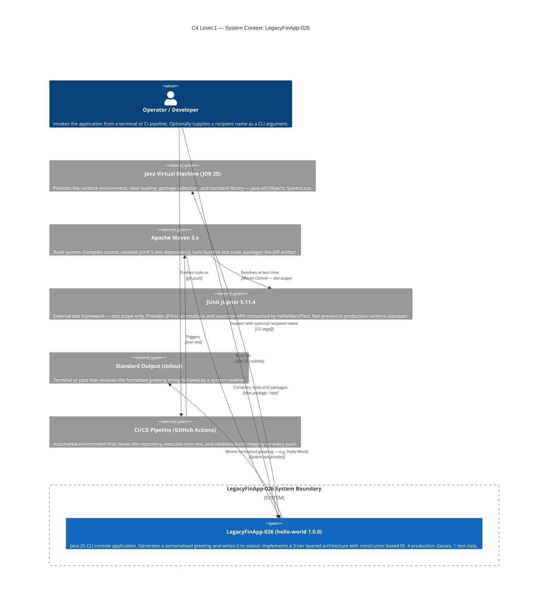

### 3.2 Business Context Summary

| Actor / System | Role | Interaction |
|---|---|---|
| **Operator / Developer** | Primary human actor | Supplies optional `args[0]` as recipient; reads stdout |
| **JVM (JDK 25)** | Runtime host | Provides `java.util.Objects`, `String`, `System.out` |
| **Maven 3.x** | Build orchestrator | Compiles, tests, packages — full lifecycle owner |
| **JUnit Jupiter 5.11.4** | Test framework | **Test scope only** — absent from production classpath |
| **stdout** | Output channel | Sole output medium — no GUI, no network, no DB |
| **GitHub Actions** | CI/CD runner | Triggers `mvn test`; reports pass/fail per commit |

### 3.3 Technical Context

The following diagram shows the technical infrastructure context and the data flows between all system components:

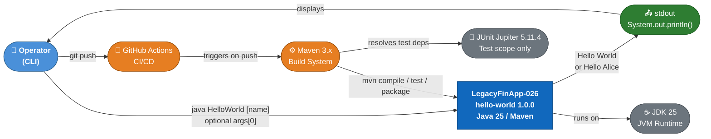

### 3.4 External Interfaces

| Interface | Direction | Mechanism | Description |
|-----------|-----------|-----------|-------------|
| CLI invocation | Input | OS process args (`String[] args`) | Starts JVM; `args[0]` optionally provides recipient name |
| Standard Output | Output | `System.out.println(String)` | Delivers formatted greeting + newline to terminal |
| Exit code | Output | JVM process exit | `0` = success (always; no error paths in production code) |
| Maven Surefire | Test trigger | `mvn test` lifecycle | Runs `HelloWorldTest` — 3 test methods |

---

## 4. Solution Strategy

> **Source inputs**: `analysis_results.json`, `code_assessment.json`

### 4.1 Technology Decisions

| Decision | Choice | Rationale |
|---------|--------|-----------|
| **Language** | Java 25 | Platform-independent via JVM; `var`, `String.isBlank()`, `String.formatted()` leverage modern Java features |
| **Build tool** | Apache Maven 3.x | Standardises compile/test/package lifecycle; reproducible CI integration via `pom.xml` |
| **Test framework** | JUnit Jupiter 5.11.4 | De-facto Java unit testing standard; parameterised tests; clean annotations |
| **DI approach** | Constructor-based (manual) | No IoC framework overhead; explicit wiring in composition root; enables unit testing with mocks |
| **Architecture pattern** | 3-tier layered + Composition Root | Separation of concerns; each layer testable in isolation; aligns with enterprise Java conventions |
| **Zero runtime dependencies** | Plain JDK stdlib only | Eliminates supply-chain risk; no version conflicts; instant startup |

### 4.2 Top-Level Decomposition Strategy

The application is decomposed into **four production classes** across three architectural tiers plus a Composition Root:

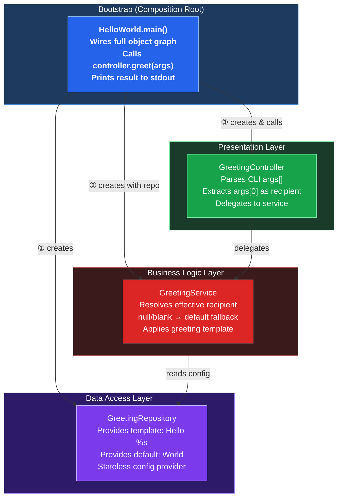

**Dependency rule**: Dependencies flow strictly top-down (Bootstrap → Presentation → Business → Data). No layer references a higher layer. Zero circular dependencies.

### 4.3 Approach to Quality Goals

| Quality Goal | Strategy | Status |
|-------------|---------|--------|
| **Correctness** | 3-tier separation isolates each business rule to one class; fail-fast guards prevent null propagation | ✅ All 14 BR implemented |
| **Readability** | Single-responsibility per class; descriptive names; consistent patterns | ✅ Score 8.0/10 |
| **Security** | No user input evaluated as code; no file/DB/network I/O | ✅ Score 9.0/10 |
| **Performance** | O(1) string operations; zero external calls | ✅ Score 10.0/10 |
| **Maintainability** | Needs interfaces (DIP) and externalised config | ⚠️ Score 6.0/10 |
| **Testability** | Constructor DI enables mock injection; but concrete class coupling limits true isolation | ⚠️ Score 5.0/10 |

### 4.4 Design Patterns Applied

| Pattern | Purpose | Participants |
|---------|---------|--------------|
| **Composition Root** | Single point of object graph assembly | `HelloWorld.main()` |
| **3-Tier Layered Architecture** | Separation of concerns | All 4 classes |
| **Constructor-Based DI** | Explicit dependencies; testability | `GreetingController`, `GreetingService` |
| **Guard Clause / Fail-Fast** | Null-safety at object boundaries | `Objects.requireNonNull` in constructors |
| **Null Object / Default Value** | Prevents null propagation through system | `GreetingService.createGreeting()` → fallback to `"World"` |

---

## 5. Building Block View

> **Source inputs**: `analysis_results.json`, `ast_analysis.json`, `uml_diagrams.md`, `architecture_diagrams.md`

### 5.1 Level 1 — System Whitebox

The system contains **4 production classes** and **1 test class** across 4 architectural layers:

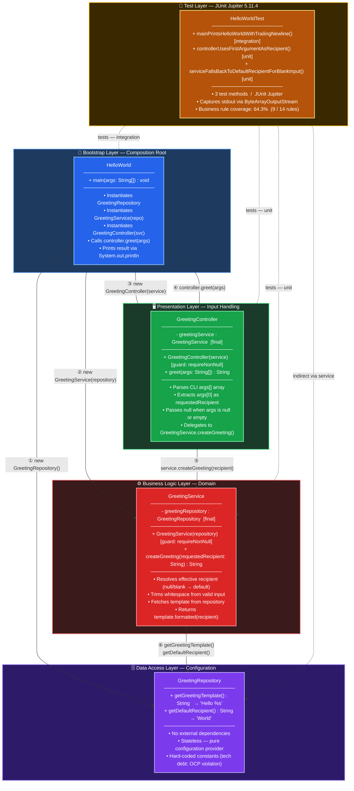

**Contained Building Blocks:**

| Block | Layer | Responsibility | Source File |
|-------|-------|---------------|-------------|
| `HelloWorld` | Bootstrap | Composition root — wires all layers; calls controller; prints result | `HelloWorld.java` |
| `GreetingController` | Presentation | Parses `args[]`; extracts `args[0]`; delegates to service | `GreetingController.java` |
| `GreetingService` | Business | Resolves recipient (null/blank → "World"; trim otherwise); applies template | `GreetingService.java` |
| `GreetingRepository` | Data Access | Provides static config: template `"Hello %s"` and default `"World"` | `GreetingRepository.java` |
| `HelloWorldTest` | Test | JUnit 5 suite — 3 tests (1 integration + 2 unit) | `HelloWorldTest.java` |

### 5.2 Level 2 — Class Diagram with Relationships

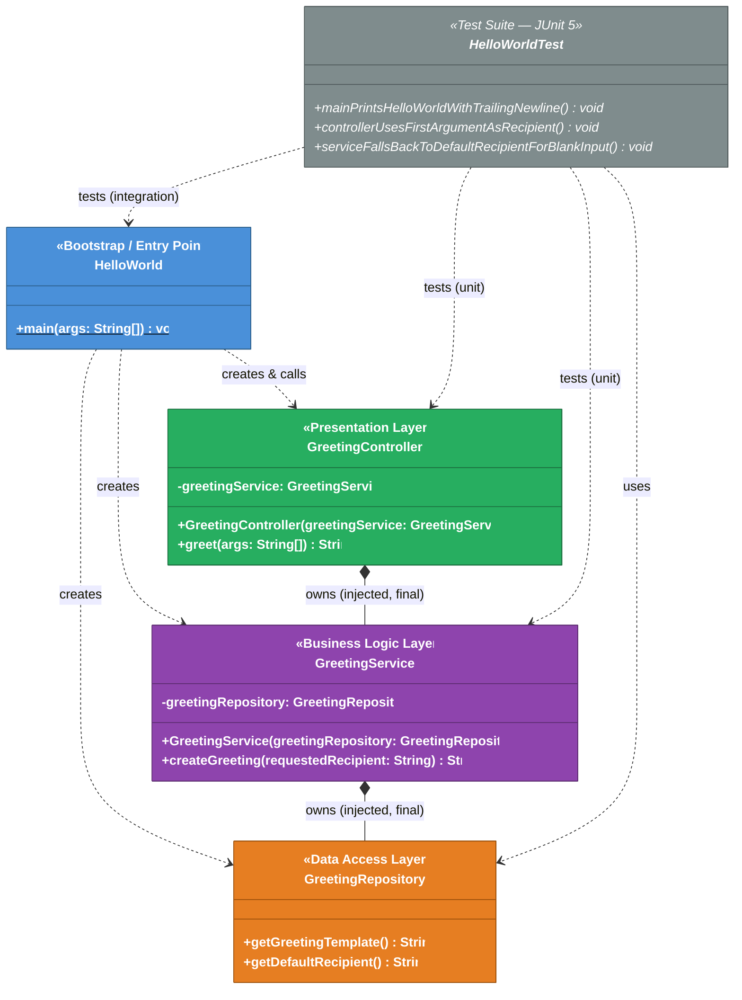

### 5.3 Level 3 — Method-Level Detail

**`HelloWorld.main(String[] args)`** — Bootstrap, 1 method, CC=1.0

```java
public static void main(String[] args) {
    var repository  = new GreetingRepository();          // ① instantiate data layer
    var service     = new GreetingService(repository);   // ② inject into business layer
    var controller  = new GreetingController(service);   // ③ inject into presentation layer
    System.out.println(controller.greet(args));          // ④ invoke + output
}
```

**`GreetingController.greet(String[] args)`** — Presentation, CC=2.0 (one branch)

```java
public String greet(String[] args) {
    if (args == null || args.length == 0)         // BR-004, BR-005
        return greetingService.createGreeting(null);
    return greetingService.createGreeting(args[0]);  // BR-006
}
```

**`GreetingService.createGreeting(String requestedRecipient)`** — Business, CC=2.0 (one branch)

```java
public String createGreeting(String requestedRecipient) {
    var recipient = requestedRecipient == null || requestedRecipient.isBlank()  // BR-008, BR-009
            ? greetingRepository.getDefaultRecipient()   // BR-013
            : requestedRecipient.trim();                  // BR-010
    return greetingRepository.getGreetingTemplate().formatted(recipient);       // BR-011, BR-012
}
```

**`GreetingRepository`** — Data, CC=1.0 (no branching)

```java
public String getGreetingTemplate()  { return "Hello %s"; }   // BR-012
public String getDefaultRecipient()  { return "World"; }       // BR-013
```

### 5.4 Package Structure

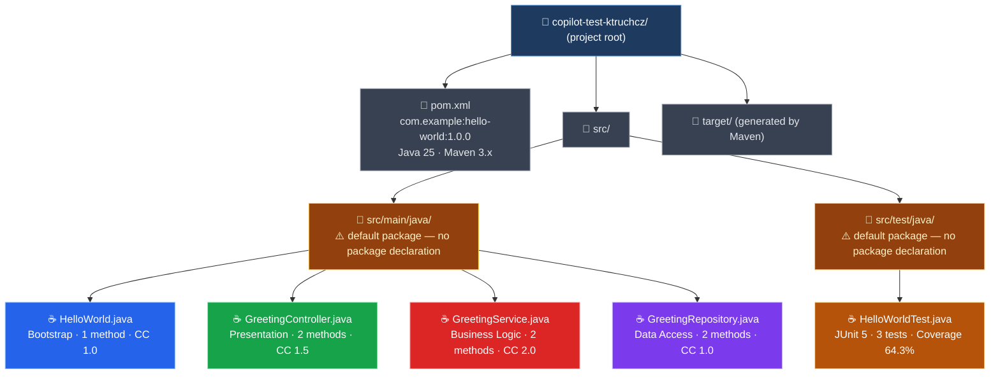

---

## 6. Runtime View

> **Source inputs**: `business_rules_extractor_analysis.json`, `uml_diagrams.md`, `bpmn_diagrams.md`

### 6.1 WF-001 — Default Greeting Workflow (no CLI args)

**Trigger**: Application invoked without arguments → `args = []`  
**Outcome**: `Hello World` printed to stdout  
**Business rules applied**: BR-001, BR-002, BR-005, BR-008, BR-011, BR-012, BR-013

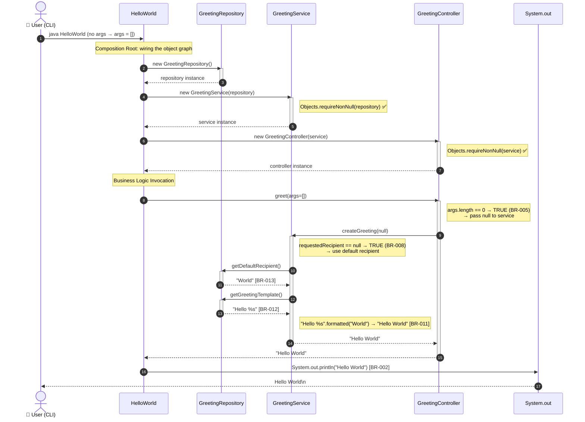

| Step | Business Rule | Detail |
|------|--------------|--------|
| `greet(args=[])` | BR-005 | Empty array treated as absent recipient; null forwarded |
| `createGreeting(null)` | BR-008 | Null recipient triggers default-recipient fallback |
| `getDefaultRecipient()` | BR-013 | Returns literal `"World"` |
| `getGreetingTemplate()` | BR-012 | Returns literal `"Hello %s"` |
| `"Hello %s".formatted("World")` | BR-011 | Template substitution produces final greeting |
| `System.out.println` | BR-002 | Output written to stdout with trailing newline |

---

### 6.2 WF-002 — Named Recipient Greeting Workflow

**Trigger**: Application invoked with `args[0] = "Alice"`  
**Outcome**: `Hello Alice` printed to stdout  
**Business rules applied**: BR-002, BR-006, BR-010, BR-011, BR-012

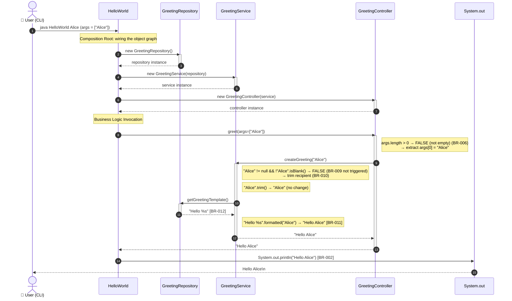

> **Note**: `getDefaultRecipient()` is NOT called in this path. The template is still fetched from the repository. Extra arguments beyond `args[0]` are silently discarded (BR-006).

---

### 6.3 WF-003 — Blank Recipient Fallback Workflow

**Trigger**: Application invoked with a whitespace-only argument, e.g. `args[0] = "   "`  
**Outcome**: `Hello World` printed to stdout (falls back to default)  
**Business rules applied**: BR-002, BR-006, BR-009, BR-011, BR-012, BR-013

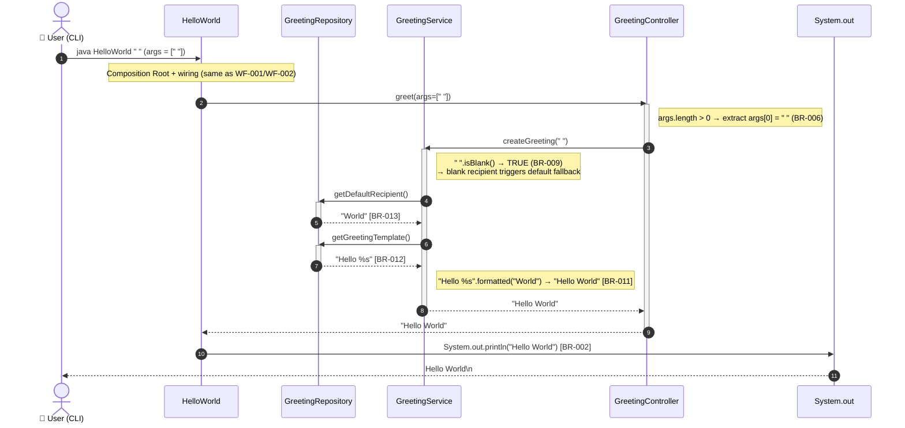

---

### 6.4 Runtime Decision Flow — Recipient Resolution

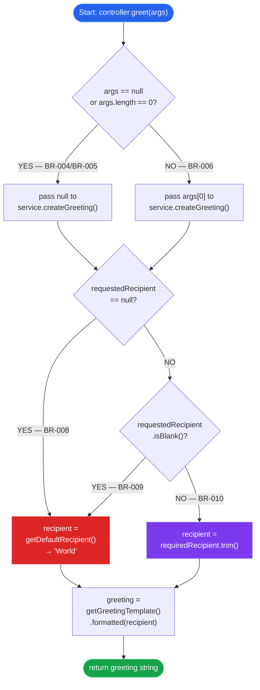

### 6.5 Workflow Summary

| Workflow | Input | Key Path | Output |
|----------|-------|----------|--------|
| WF-001 (Default) | No args / `args = []` | null → `getDefaultRecipient()` | `Hello World` |
| WF-002 (Named) | `args[0] = "Alice"` | trim → apply template | `Hello Alice` |
| WF-003 (Blank Fallback) | `args[0] = "   "` | `isBlank()` → `getDefaultRecipient()` | `Hello World` |

---

## 7. Deployment View

> **Source inputs**: `analysis_results.json`, `architecture_diagrams.md`, `pom.xml`

### 7.1 Infrastructure Overview

LegacyFinApp-026 is a self-contained console application with **zero runtime dependencies**. Deployment requires only a host machine with JDK 25 installed.

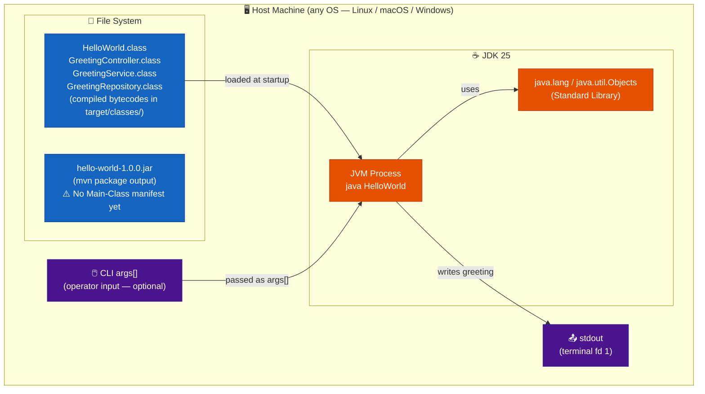

### 7.2 Maven Build Lifecycle

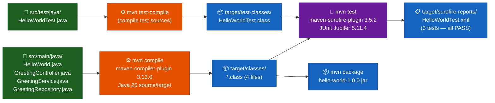

### 7.3 CI/CD Pipeline (GitHub Actions)

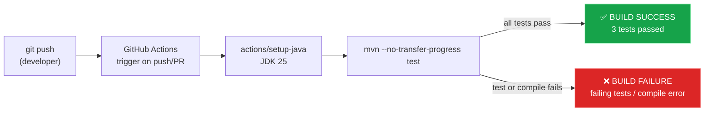

### 7.4 Deployment Variants

| Variant | Description | Command Sequence |
|---------|-------------|-----------------|
| **Local (developer)** | Maven compile + run on workstation | `mvn compile` → `java -cp target/classes HelloWorld [name]` |
| **Local (direct javac)** | Manual compile without Maven | `javac src/main/java/*.java -d target/classes` → `java -cp target/classes HelloWorld` |
| **CI runner** | GitHub Actions with `actions/setup-java` (JDK 25) | `mvn --no-transfer-progress test` |
| **Docker container** | Any `openjdk:25` or `eclipse-temurin:25` image | `COPY src/ /app/src/` → `RUN mvn compile` → `CMD ["java","-cp","target/classes","HelloWorld"]` |
| **JAR execution** | After `mvn package` | `java -cp hello-world-1.0.0.jar HelloWorld` ⚠️ No `Main-Class` manifest yet |

### 7.5 Minimum System Requirements

| Requirement | Value |
|------------|-------|
| Java Runtime | **JDK 25** (JDK required for compile; JRE for run-only) |
| Maven | 3.x (for `mvn` lifecycle; optional if compiling manually) |
| Disk space (source) | ~5 KB (4 `.java` files) |
| Disk space (compiled) | ~10 KB (`target/classes/*.class`) |
| RAM | ≥ JVM base overhead (~20–50 MB for JDK 25) |
| CPU | Any architecture with a JDK 25 port |
| Network | None at runtime; Maven Central required at build time for JUnit test dependency |
| Database | None |
| External services | None |

---

## 8. Crosscutting Concepts

> **Source inputs**: `analysis_results.json`, `business_rules_extractor_analysis.json`, `code_assessment.json`

### 8.1 Domain Model

The application's domain is greeting generation. The domain model consists of three conceptual entities:

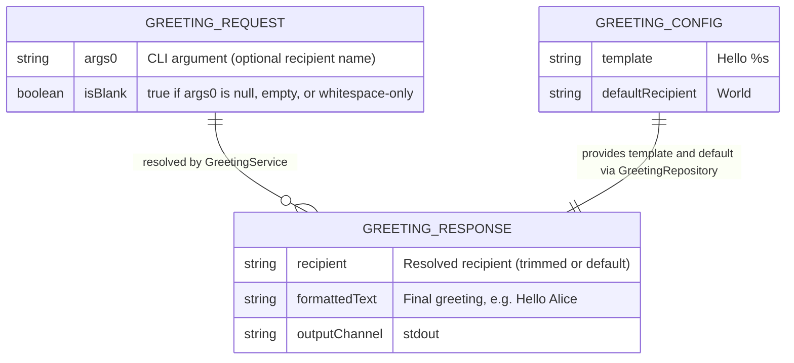

### 8.2 Dependency Injection Strategy

LegacyFinApp-026 uses **constructor-based dependency injection** without a DI framework. The `HelloWorld.main()` method acts as the **Composition Root** — the single location where the full object graph is assembled:

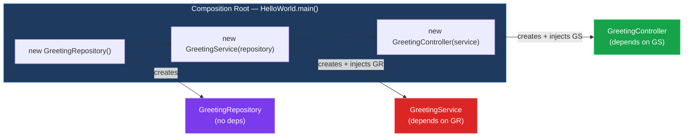

**DI properties:**

| Property | Detail |
|----------|--------|
| Injection point | Constructor only (no setter injection, no field injection) |
| Scope | All objects are effectively singletons for the process lifetime |
| Null safety | `Objects.requireNonNull` in every injectable constructor |
| Immutability | All injected references stored as `private final` fields |
| ⚠️ Limitation | Concrete class dependencies — no interfaces (DIP violated, see ADR-005) |

### 8.3 Null Safety Strategy

Null is handled at two distinct levels:

**Level 1 — Object graph construction (Guard Clauses)**

```java
// GreetingController constructor:
this.greetingService = Objects.requireNonNull(greetingService, "greetingService must not be null");

// GreetingService constructor:
this.greetingRepository = Objects.requireNonNull(greetingRepository, "greetingRepository must not be null");
```

**Level 2 — Business data (Null Object / Default Value pattern)**

```java
// GreetingService.createGreeting():
var recipient = requestedRecipient == null || requestedRecipient.isBlank()
        ? greetingRepository.getDefaultRecipient()   // null/blank → "World"
        : requestedRecipient.trim();                  // valid → trimmed value
```

| Scenario | Null handling strategy | Business rule |
|----------|----------------------|---------------|
| Null service in controller constructor | `requireNonNull` → NullPointerException | BR-003 |
| Null repository in service constructor | `requireNonNull` → NullPointerException | BR-007 |
| Null `args[]` in `greet()` | `args == null` check → pass `null` to service | BR-004 |
| Null `requestedRecipient` in `createGreeting()` | Ternary → `getDefaultRecipient()` | BR-008 |
| Blank `requestedRecipient` | `isBlank()` → `getDefaultRecipient()` | BR-009 |

### 8.4 Business Rules Catalogue

All 14 business rules extracted from source analysis:

| ID | Rule | Source | Covered by Test |
|----|------|--------|----------------|
| BR-001 | No CLI args → use default recipient `"World"` | `HelloWorld.main()` | ✅ |
| BR-002 | Output written to stdout with trailing newline | `HelloWorld.main()` | ✅ |
| BR-003 | GreetingService in Controller must not be null | `GreetingController` constructor | ❌ |
| BR-004 | Null `args` treated same as empty `args` | `GreetingController.greet()` | ❌ |
| BR-005 | Empty `args[]` → delegate null to service | `GreetingController.greet()` | ✅ |
| BR-006 | Only `args[0]` used; extra args discarded | `GreetingController.greet()` | ✅ |
| BR-007 | GreetingRepository in Service must not be null | `GreetingService` constructor | ❌ |
| BR-008 | Null recipient → substitute default `"World"` | `GreetingService.createGreeting()` | ✅ |
| BR-009 | Blank recipient → substitute default `"World"` | `GreetingService.createGreeting()` | ✅ |
| BR-010 | Non-blank recipient → trim whitespace before use | `GreetingService.createGreeting()` | ❌ |
| BR-011 | Greeting formed by inserting recipient into template | `GreetingService.createGreeting()` | ✅ |
| BR-012 | Template is `"Hello %s"` | `GreetingRepository.getGreetingTemplate()` | ✅ |
| BR-013 | Default recipient is `"World"` | `GreetingRepository.getDefaultRecipient()` | ✅ |
| BR-014 | Template has exactly one `%s` placeholder | `GreetingRepository.getGreetingTemplate()` | ❌ |

> **Coverage**: 9/14 rules tested (64.3%) — see Section 11 for uncovered rules risk assessment.

### 8.5 Error Handling Strategy

| Error Type | Where It Can Occur | Handling |
|-----------|-------------------|---------|
| `NullPointerException` (null service) | `GreetingController` constructor | `Objects.requireNonNull` — immediate fail-fast |
| `NullPointerException` (null repository) | `GreetingService` constructor | `Objects.requireNonNull` — immediate fail-fast |
| `IOException` on stdout | `System.out.println()` | Silently swallowed by `PrintStream` (internal error flag only) |
| Extra CLI arguments | `GreetingController.greet()` | Silently ignored — only `args[0]` consumed |
| `ClassNotFoundException` | JVM startup | Not catchable inside app; JVM exits with error |

### 8.6 Test Strategy

The test suite (`HelloWorldTest.java`) uses **JUnit Jupiter 5.11.4** with three test methods:

| Test Method | Type | Business Rules Covered |
|------------|------|----------------------|
| `mainPrintsHelloWorldWithTrailingNewline()` | Integration | BR-001, BR-002, BR-005, BR-008, BR-013 |
| `controllerUsesFirstArgumentAsRecipient()` | Unit | BR-006, BR-011, BR-012 |
| `serviceFallsBackToDefaultRecipientForBlankInput()` | Unit | BR-009 |

**Test technique** (stdout capture):
```java
var baos = new ByteArrayOutputStream();
System.setOut(new PrintStream(baos));
HelloWorld.main(new String[0]);
assertEquals("Hello World" + System.lineSeparator(), baos.toString());
```

### 8.7 Output and Logging Concept

| Aspect | Decision |
|--------|---------|
| **Output channel** | `System.out` (stdout, file descriptor 1) |
| **Output format** | Plain text terminated by `System.lineSeparator()` (`\n` on Unix, `\r\n` on Windows via `println`) |
| **Logging framework** | None — no SLF4J, Log4j, or `java.util.logging` |
| **Structured logging** | Not applicable |
| **Error output** | None — application has no error paths in production code |

---

## 9. Architecture Decisions

> **Source inputs**: `analysis_results.json`, `code_assessment.json`

### ADR-001 — Three-Tier Layered Architecture

| Field | Value |
|-------|-------|
| **Status** | Accepted |
| **Date** | Project inception |
| **Context** | A greeting application needs clear separation between input handling, business logic, and data access. |
| **Decision** | Implement as a strict 3-tier layered architecture: Presentation (`GreetingController`), Business Logic (`GreetingService`), Data Access (`GreetingRepository`). |
| **Rationale** | Each layer has a single, well-defined responsibility. Dependencies flow strictly top-down (no upward references). Each layer is independently testable. The pattern is familiar to enterprise Java developers and scales predictably if functionality grows. |
| **Consequences** | (+) Clear separation of concerns; (+) Independent testability per layer; (+) Easily extended (new layers, new responsibilities); (–) More classes than strictly necessary for a trivial application; (–) Slight overhead vs. a single-class implementation. |
| **Alternatives considered** | Single-class (all logic in `main()`) — rejected because it conflates input handling, business logic, and configuration; Script-style imperative code — rejected for the same reason. |

---

### ADR-002 — Constructor-Based Dependency Injection (No IoC Framework)

| Field | Value |
|-------|-------|
| **Status** | Accepted |
| **Date** | Project inception |
| **Context** | Dependencies exist between layers. The project has no Spring, Guice, or CDI dependency. |
| **Decision** | Use manual constructor-based dependency injection with `HelloWorld.main()` as the Composition Root. |
| **Rationale** | Constructor injection makes dependencies explicit and immutable. No framework overhead. The Composition Root pattern centralises object wiring in one place. All injected classes are testable with mock dependencies. |
| **Consequences** | (+) No IoC framework dependency; (+) Explicit, readable wiring; (+) `private final` fields enforce immutability; (–) Object graph must be wired manually — acceptable for this scale; (–) No IoC container features (scoping, AOP, etc.). |
| **Alternatives considered** | Spring Boot — disproportionate overhead for this application; Field injection — hidden dependencies, breaks testability; Service locator — hidden coupling, discouraged by modern practice. |

---

### ADR-003 — Guard Clauses via `Objects.requireNonNull`

| Field | Value |
|-------|-------|
| **Status** | Accepted |
| **Date** | Project inception |
| **Context** | Injectable constructors must reject null dependencies to prevent cryptic NPEs later in execution. |
| **Decision** | Apply `Objects.requireNonNull(dep, "message")` in every injectable constructor (`GreetingController`, `GreetingService`). |
| **Rationale** | Fail-fast at construction time produces a clear, actionable error message at the earliest possible moment. This is the Java standard library idiomatic null-checking mechanism since Java 7. |
| **Consequences** | (+) Clear error messages on misconfiguration; (+) Fails at wiring time, not at first method call; (+) Standard Java idiom — no custom code; (–) Throws unchecked `NullPointerException` (not a domain exception). |
| **Alternatives considered** | Optional<T> injection — anti-pattern for mandatory dependencies; Custom checked exceptions — disproportionate complexity; Lombok @NonNull — introduces build dependency. |

---

### ADR-004 — Java 25

| Field | Value |
|-------|-------|
| **Status** | Accepted |
| **Date** | Project inception |
| **Context** | Language version must be chosen and locked in `pom.xml`. |
| **Decision** | Target Java 25 (`maven.compiler.source` and `maven.compiler.target` = 25). |
| **Rationale** | Java 25 provides `var` (local type inference), `String.isBlank()`, `String.formatted()`, and other modern features used in the codebase. Using the latest LTS-track Java ensures access to current language constructs. |
| **Consequences** | (+) Modern language features available; (+) Consistent with current JDK releases; (–) Requires JDK 25 on all developer machines and CI runners; (–) Not backward-compatible with JDK < 25. |
| **Alternatives considered** | Java 17 LTS — would work but lacks some newer constructs; Java 21 LTS — viable alternative; lower Java — requires backporting modern APIs. |

---

### ADR-005 — No Interface Abstractions (Acknowledged Technical Debt)

| Field | Value |
|-------|-------|
| **Status** | Accepted with known debt — see ENH-001 |
| **Date** | Project inception |
| **Context** | The Dependency Inversion Principle (DIP) requires high-level modules to depend on abstractions, not concretions. |
| **Decision** | `GreetingController` depends directly on `GreetingService` (concrete class). `GreetingService` depends directly on `GreetingRepository` (concrete class). No `IGreetingService` or `IGreetingRepository` interfaces exist. |
| **Rationale** | For a minimal demonstration application, introducing interfaces adds structure overhead without immediate benefit. The application is currently single-implementation: there is only one service and one repository. |
| **Consequences** | (–) **DIP violated** — SOLID compliance score penalised (ISP: 2/10, DIP: fail); (–) Cannot mock dependencies in unit tests without a mocking library (e.g. Mockito); (–) Harder to extend with alternative implementations; (–) SOLID compliance score: 5.5/10 overall. |
| **Recommended fix** | ENH-001: Introduce `IGreetingService` and `IGreetingRepository` interfaces. Estimated effort: 1.0h. |

---

### ADR-006 — Hard-Coded Greeting Configuration (Acknowledged Technical Debt)

| Field | Value |
|-------|-------|
| **Status** | Accepted with known debt — see ENH-003 |
| **Date** | Project inception |
| **Context** | `GreetingRepository` returns hard-coded strings `"Hello %s"` and `"World"`. |
| **Decision** | Return literal string values directly from `getGreetingTemplate()` and `getDefaultRecipient()` — no externalised configuration. |
| **Rationale** | For this scope, configuration externalisation is unnecessary overhead. The repository pattern provides the correct abstraction layer for future externalisation. |
| **Consequences** | (–) **OCP violated** — changing template or default requires source modification; (–) 4 hard-coded strings flagged in code assessment; (–) Cannot change greeting without recompilation. |
| **Recommended fix** | ENH-003: Externalise template and default to a `.properties` file or environment variable. Estimated effort: 1.0h (part of ENH-003). |

---

### ADR-007 — Maven as Build Tool

| Field | Value |
|-------|-------|
| **Status** | Accepted |
| **Date** | Project inception |
| **Context** | A build tool is needed to standardise compilation, testing, and packaging. |
| **Decision** | Use Apache Maven 3.x with a `pom.xml` descriptor. Explicit plugin versions: `maven-compiler-plugin 3.13.0`, `maven-surefire-plugin 3.5.2`. |
| **Rationale** | Maven is the most widely adopted Java build tool in enterprise settings. Explicit plugin version pinning ensures reproducible builds. Standard lifecycle phases align with CI/CD tools. |
| **Consequences** | (+) Reproducible builds; (+) Standard lifecycle; (+) Easy CI integration; (–) Verbose `pom.xml` for a minimal project; (–) No Maven Wrapper (`mvnw`) — developers must have Maven installed locally (see TD-007). |
| **Alternatives considered** | Gradle — more flexible but adds complexity; Raw `javac`/`java` — no dependency management or lifecycle standardisation. |

---

## 10. Quality Requirements

> **Source inputs**: `code_assessment.json`, `business_rules_extractor_analysis.json`

### 10.1 Quality Score Summary

**Overall score: 7.2 / 10** — assessed by `code-assessor` agent against 5 production classes.

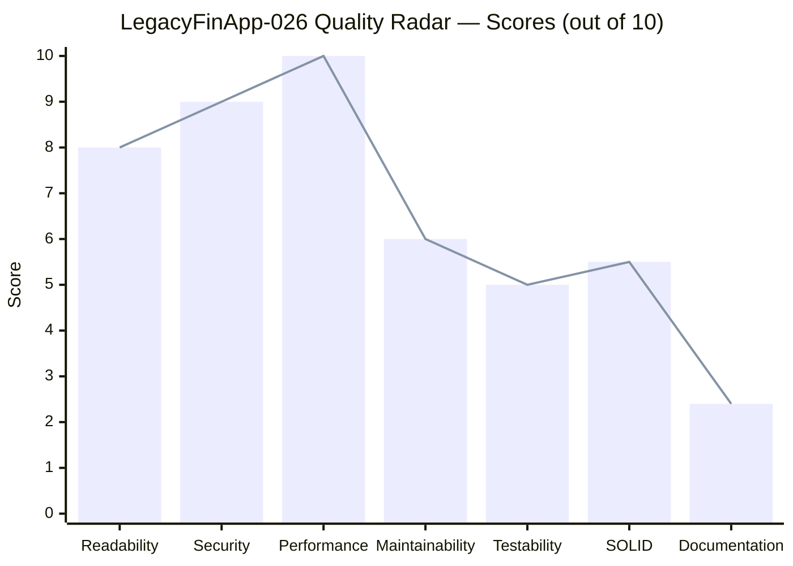

| Quality Dimension | Score | Status | Key Finding |
|-------------------|-------|--------|-------------|
| **Readability** | 8.0 / 10 | 🟢 Good | Clean class names; consistent patterns; short methods |
| **Security** | 9.0 / 10 | 🟢 Excellent | No external input evaluated; no network/file I/O |
| **Performance** | 10.0 / 10 | 🟢 Excellent | O(1) string ops; zero runtime deps; instant execution |
| **Maintainability** | 6.0 / 10 | 🟡 Moderate | Hard-coded strings; no interfaces; no Javadoc |
| **Testability** | 5.0 / 10 | 🟡 Moderate | Constructor DI enables mocking; but concrete class coupling |
| **SOLID Compliance** | 5.5 / 10 | 🟡 Moderate | SRP: ✅ 9/10; OCP: ⚠️ 4/10; LSP: N/A; ISP: ❌ 2/10; DIP: ❌ fail |
| **Documentation** | 2.4 / 10 | 🔴 Critical | Zero Javadoc; prior arc42 had 27 factual errors |

### 10.2 Quality Tree

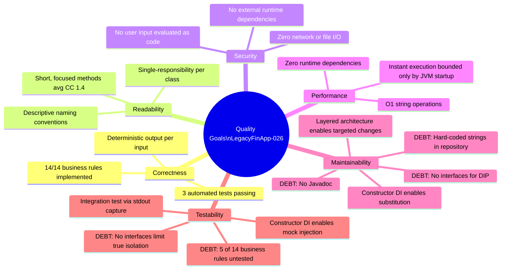

### 10.3 Quality Scenarios

| ID | Quality Attribute | Scenario | Stimulus | Expected Response | Metric |
|----|------------------|---------|----------|-------------------|--------|
| QS-01 | **Correctness** | `java HelloWorld` invoked with no args | Empty `args[]` | Prints `Hello World\n` to stdout | Exact string match |
| QS-02 | **Correctness** | `java HelloWorld Alice` invoked | `args[0] = "Alice"` | Prints `Hello Alice\n` to stdout | Exact string match |
| QS-03 | **Correctness** | Blank string passed as arg | `args[0] = "   "` | Prints `Hello World\n` (fallback) | Exact string match |
| QS-04 | **Security** | Arbitrary string passed as arg | `args[0] = "<script>alert(1)</script>"` | Treated as plain text recipient; no code evaluation | No injection; output `Hello <script>...` |
| QS-05 | **Performance** | Application launched on modern machine | Invocation via `java` | Output appears in < 500ms (JVM startup dominated) | ≤ 500ms wall-clock |
| QS-06 | **Testability** | New greeting format required | Change `getGreetingTemplate()` | Only `GreetingRepository` modified; tests updated | 1 class change; isolated impact |
| QS-07 | **Maintainability** | Null repository injected into service | `new GreetingService(null)` | Immediate `NullPointerException` with message | Fail-fast at construction |
| QS-08 | **Reproducibility** | Application run 1,000× consecutively | Same args each run | Identical stdout every invocation | 0 deviations |

### 10.4 SOLID Compliance Detail

| Principle | Status | Score | Assessment |
|-----------|--------|-------|------------|
| **Single Responsibility (SRP)** | ✅ PASS | 9/10 | Each class has exactly one responsibility. `HelloWorld` bootstraps, `GreetingController` handles input routing, `GreetingService` implements domain logic, `GreetingRepository` supplies configuration data. |
| **Open/Closed (OCP)** | ⚠️ PARTIAL | 4/10 | `GreetingRepository` returns hard-coded strings. Adding a new template requires modifying the class rather than extending it. No strategy or configuration mechanism. |
| **Liskov Substitution (LSP)** | ✅ N/A | 10/10 | No inheritance hierarchies exist. LSP not applicable. Absence of inheritance is a positive design choice. |
| **Interface Segregation (ISP)** | ❌ FAIL | 2/10 | No interfaces defined for `GreetingService` or `GreetingRepository`. Consumers depend on concrete classes. |
| **Dependency Inversion (DIP)** | ❌ FAIL | 2/10 | High-level modules (`GreetingController`, `GreetingService`) depend directly on concrete low-level classes. No abstractions (interfaces). |

### 10.5 Code Metrics

| Metric | Value |
|--------|-------|
| Total source lines (production) | 57 |
| Total test lines | 40 |
| Total files | 5 (4 production + 1 test) |
| Production classes | 4 |
| Average cyclomatic complexity | **1.4** |
| Business rules total | 14 |
| Business rules with test coverage | 9 (64.3%) |
| Business rules uncovered | 5 (35.7%) |
| Classes with interface abstractions | 0 / 4 |
| Classes without package declaration | 5 / 5 |
| Classes with Javadoc | 0 / 4 |
| Hard-coded magic strings | 4 |
| Estimated total technical debt | **7.5h** |

---

## 11. Risks and Technical Debt

> **Source inputs**: `code_assessment.json`, `executive_summary.md`

### 11.1 Executive Verdict

> 🟡 **CONDITIONAL NO-GO** — The business logic is production-safe and all 14 business rules are correctly implemented. However, critical documentation inaccuracies (now corrected in this document) and structural gaps in testability, interface design, and package organisation require remediation before production promotion. Estimated **10–11h** effort to reach full GO status.

### 11.2 Risk Register

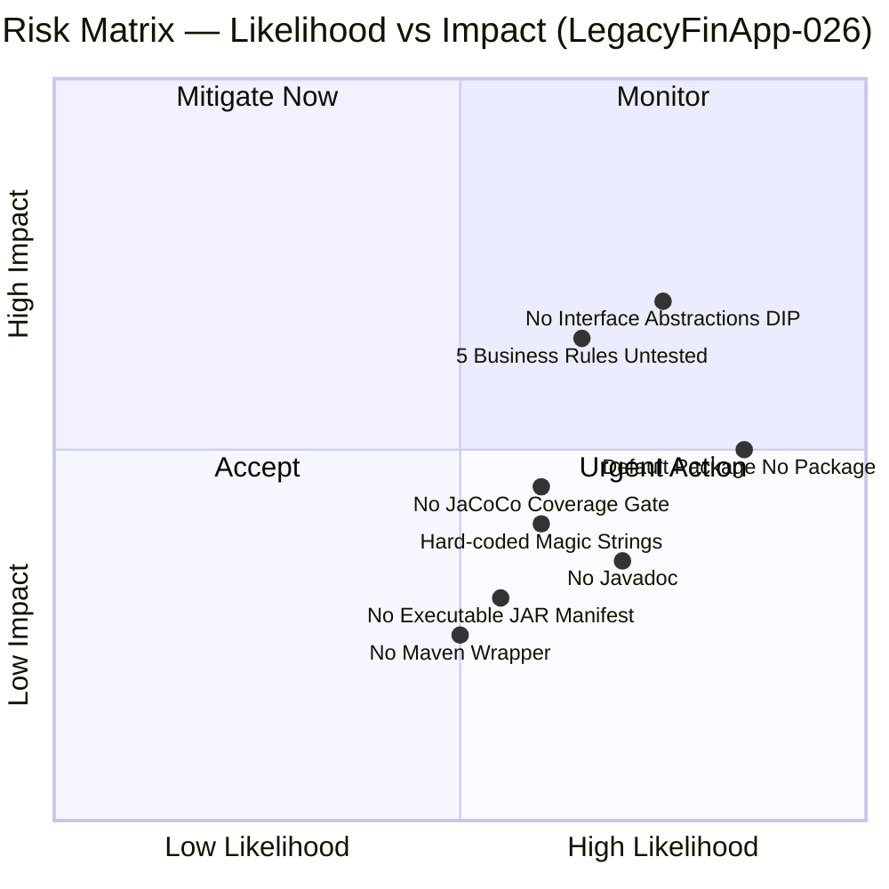

### 11.3 Identified Risks

| ID | Risk | Likelihood | Impact | Priority | Mitigation |
|----|------|-----------|--------|----------|-----------|
| R-01 | **No interface abstractions (DIP violated)** — `GreetingController` and `GreetingService` depend on concrete classes. Adding alternative implementations requires modifying call sites. | High | High | 🔴 Critical | Introduce `IGreetingService` and `IGreetingRepository` interfaces (ENH-001). Est. 1.0h |
| R-02 | **All classes in default package** — Cannot be imported by other packages; violates Java module boundary conventions; breaks any modular architecture. | High | Medium | 🟠 High | Create `com.example.greeting.*` package structure (ENH-003). Est. 0.5h |
| R-03 | **5/14 business rules untested (35.7%)** — BR-003, BR-004, BR-007, BR-010, BR-014 have no automated test coverage. Regressions in these rules will not be caught by CI. | Medium | High | 🟠 High | Expand test suite to full BR coverage (ENH-002). Est. 2.0h |
| R-04 | **Hard-coded magic strings in GreetingRepository** — Template `"Hello %s"` and default `"World"` are compiled into bytecode. Cannot be reconfigured without recompilation. | Medium | Medium | 🟡 Medium | Externalise to `application.properties` or environment variables (ENH-003). Est. 1.0h |
| R-05 | **No Javadoc on any class or method** — Future maintainers have no in-code documentation. `documentation` score: 2.4/10. | High | Low | 🟡 Medium | Add Javadoc to all public classes and methods (ENH-003). Est. 1.0h |
| R-06 | **No executable JAR manifest** — `mvn package` produces a non-executable JAR (no `Main-Class` in MANIFEST.MF). Deployment via JAR is broken. | Medium | Medium | 🟡 Medium | Add `maven-jar-plugin` with `Main-Class: HelloWorld` to `pom.xml` (ENH-005). Est. 0.5h |
| R-07 | **No Maven Wrapper** — Developers must have a matching Maven version installed locally. Reproducibility depends on system Maven. | Medium | Low | 🟢 Low | Run `mvn wrapper:wrapper` to generate `mvnw`/`mvnw.cmd` scripts (ENH-005). Est. 0.25h |
| R-08 | **No JaCoCo code coverage gate** — Test coverage cannot be enforced automatically; coverage regression will go undetected. | Medium | Medium | 🟡 Medium | Add JaCoCo plugin with minimum coverage threshold (ENH-005). Est. 1.0h |
| R-09 | **null sentinel used instead of Optional** — `GreetingController` passes `null` to signal "no recipient". Null is not self-documenting and requires defensive null checks downstream. | Low | Low | 🟢 Low | Replace null with `Optional<String>` (ENH-004). Est. 1.0h |

### 11.4 Technical Debt Inventory

| ID | Debt Item | Category | Effort | Priority |
|----|----------|----------|--------|---------|
| TD-001 | No interface abstractions — DIP violated | Architecture | 1.0h | 🔴 Critical |
| TD-002 | All 5 source files in default package | Architecture | 0.5h | 🔴 Critical |
| TD-003 | 5/14 business rules untested (BR-003, BR-004, BR-007, BR-010, BR-014) | Testing | 2.0h | 🟠 High |
| TD-004 | Hard-coded magic strings in `GreetingRepository` | Design | 1.0h | 🟡 Medium |
| TD-005 | No Javadoc on any class or method | Documentation | 1.0h | 🟡 Medium |
| TD-006 | No executable JAR manifest (`Main-Class`) | Build | 0.5h | 🟡 Medium |
| TD-007 | No Maven Wrapper (`mvnw`) | Build | 0.25h | 🟢 Low |
| TD-008 | No JaCoCo coverage enforcement | Build | 1.0h | 🟡 Medium |
| TD-009 | null sentinel — should use `Optional<String>` | Design | 1.0h | 🟢 Low |
| | **Total estimated debt** | | **8.25h** | |

### 11.5 Recommended Enhancements

| ID | Enhancement | Effort | Priority | Expected Benefit |
|----|------------|--------|----------|-----------------|
| ENH-001 | Introduce `IGreetingService` and `IGreetingRepository` interfaces | 1.0h | 🔴 Critical | Fixes DIP; enables mock-based unit testing |
| ENH-002 | Expand tests to 100% business rule coverage (add BR-003, 004, 007, 010, 014) | 2.0h | 🟠 High | Eliminates 5 untested business rules; prevents silent regressions |
| ENH-003 | Move classes to `com.example.greeting.*` packages; externalise config; add Javadoc | 2.0h | 🟠 High | Fixes default package issue; improves maintainability |
| ENH-004 | Replace null sentinel with `Optional<String>` in recipient handoff | 1.0h | 🟡 Medium | Eliminates null propagation; self-documenting API |
| ENH-005 | Add JaCoCo + Maven Wrapper + executable JAR manifest | 1.75h | 🟡 Medium | Complete build tooling; enforces coverage gates |

### 11.6 Technical Debt Remediation Roadmap

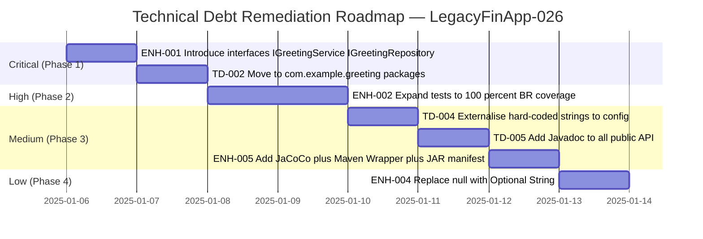

---

## 12. Glossary

> **Source inputs**: `analysis_results.json`, `business_rules_extractor_analysis.json`

### Domain Terms

| Term | Definition |
|------|-----------|
| **Greeting** | A formatted text message produced by the application, e.g. `Hello World` or `Hello Alice`. |
| **Recipient** | The named entity addressed in the greeting (the `%s` placeholder value). Defaults to `"World"`. |
| **Greeting Template** | The format string `"Hello %s"` stored in `GreetingRepository` and applied by `GreetingService`. |
| **Default Recipient** | The fallback value `"World"` returned by `GreetingRepository.getDefaultRecipient()` when no valid recipient is supplied. |
| **Blank Recipient** | A recipient string that is non-null but contains only whitespace characters (`isBlank() == true`). Treated as absent — falls back to default. |
| **Composition Root** | The single location (`HelloWorld.main()`) where the entire object graph is assembled before any business logic executes. |

### Architecture Terms

| Term | Definition |
|------|-----------|
| **3-Tier Layered Architecture** | An architectural pattern dividing the application into Presentation, Business Logic, and Data Access layers with strict top-down dependency flow. |
| **Constructor-Based DI** | Dependency Injection where all dependencies are provided through constructor parameters. All injected fields are `private final`. |
| **Guard Clause** | A `Objects.requireNonNull(dep, "message")` check at the top of a constructor that fails immediately if a mandatory dependency is null. |
| **Dependency Inversion Principle (DIP)** | SOLID principle stating high-level modules should depend on abstractions (interfaces), not concretions. Currently violated — see ADR-005. |
| **Bootstrap Layer** | `HelloWorld.main()` — wires all objects and triggers execution. Not part of the 3-tier layers proper. |

### Technical Terms

| Term | Definition |
|------|-----------|
| **Arc42** | A pragmatic, lightweight software architecture documentation template structured into 12 sections. See [arc42.org](https://arc42.org). |
| **BR-xxx** | Business Rule identifier. 14 BRs are defined for LegacyFinApp-026; 9/14 have automated test coverage. |
| **WF-xxx** | Workflow identifier. Three workflows: WF-001 (default), WF-002 (named), WF-003 (blank fallback). |
| **ENH-xxx** | Enhancement identifier. Five enhancements recommended to address technical debt. |
| **CLI** | Command-Line Interface — the operator invokes the application via `java HelloWorld [name]`. |
| **JDK 25** | Java Development Kit version 25 — provides `var`, `String.isBlank()`, `String.formatted()`. Required for build and test. |
| **JUnit Jupiter 5.11.4** | The JUnit 5 test framework used in `HelloWorldTest`. Test-scope only — not present in production JAR. |
| **Maven Surefire** | Maven plugin (`maven-surefire-plugin 3.5.2`) that discovers and runs JUnit 5 tests during `mvn test`. |
| **stdout** | Standard Output — file descriptor 1. The sole output channel of LegacyFinApp-026 (`System.out.println()`). |
| **`Objects.requireNonNull`** | JDK standard library method (`java.util.Objects`) for null-guarding constructor parameters with a descriptive error message. |
| **`String.isBlank()`** | Java 11+ method returning `true` if a string is empty or contains only whitespace. Used in `GreetingService` for blank-recipient detection. |
| **`String.formatted()`** | Java 15+ instance method equivalent to `String.format(this, args)`. Used in `GreetingService` to apply the greeting template. |
| **Cyclomatic Complexity (CC)** | A code metric measuring the number of linearly independent paths through a method. Average CC for LegacyFinApp-026: **1.4** (excellent). |
| **Default Package** | Java classes declared without a `package` statement reside in the unnamed default package. Cannot be imported by other packages. All 5 LegacyFinApp-026 classes are currently in the default package — a known technical debt item (TD-002). |

---

*Documentation generated by the Arc42 Documentation Generator.*  
*Source: multi-agent analysis of `LegacyFinApp-026` (`com.example:hello-world:1.0.0`) — 4 production classes, 1 test class, Java 25, Maven 3.x.*  
*This document replaces the prior version which contained 27 factual errors describing a single-class stub implementation.*
