# Architecture Documentation (Arc42)

**Project**: copilot-test-ktruchcz — HelloWorld Java Application  
**Version**: 1.0.0  
**Date**: 2025-07-14  
**Generated by**: Arc42 Documentation Generator  
**Source Repository**: `/home/runner/work/copilot-test-ktruchcz/copilot-test-ktruchcz`

---

## Table of Contents

1. [Introduction and Goals](#1-introduction-and-goals)
2. [Constraints](#2-constraints)
3. [Context and Scope](#3-context-and-scope)
4. [Solution Strategy](#4-solution-strategy)
5. [Building Block View](#5-building-block-view)
6. [Runtime View](#6-runtime-view)
7. [Deployment View](#7-deployment-view)
8. [Crosscutting Concepts](#8-crosscutting-concepts)
9. [Architecture Decisions](#9-architecture-decisions)
10. [Quality Requirements](#10-quality-requirements)
11. [Risks and Technical Debt](#11-risks-and-technical-debt)
12. [Glossary](#12-glossary)

---

## 1. Introduction and Goals

> **Source analysis**: `HelloWorld.java` (5 lines), `README.md` (1 line).

### 1.1 Purpose and Business Context

The **HelloWorld** application is a minimal Java program whose sole purpose is to demonstrate the most fundamental capability of the Java platform: compiling and executing a program that produces observable output on the standard output stream.

Despite its simplicity, the application serves as a canonical reference point for:

- Validating that a Java Development Kit (JDK) is correctly installed and configured.
- Providing a baseline "smoke-test" artifact that proves the build and execution toolchain is functional.
- Acting as a starter template or scaffolding seed for larger Java projects.
- Serving as an educational entry point for developers new to the Java language.

### 1.2 Goals

| ID | Goal | Priority |
|----|------|----------|
| G-01 | Print the string `"Hello World"` to standard output (stdout) | Must-have |
| G-02 | Compile and run with zero external runtime dependencies | Must-have |
| G-03 | Demonstrate a valid, minimal Java class structure | Should-have |
| G-04 | Serve as a build/CI pipeline smoke-test target | Nice-to-have |

### 1.3 Quality Goals

The top quality goals (in priority order) that shape architectural decisions:

| Priority | Quality Attribute | Scenario |
|----------|-------------------|----------|
| 1 | **Simplicity** | Any developer should understand the entire codebase in under 30 seconds |
| 2 | **Correctness** | Every execution must produce exactly `"Hello World\n"` on stdout with exit code 0 |
| 3 | **Portability** | Must execute identically on any platform with a JDK >= 8 installed |
| 4 | **Maintainability** | Adding features (e.g., accepting arguments) requires minimal structural change |

### 1.4 Stakeholders

| Role | Name / Group | Expectation |
|------|--------------|-------------|
| Developer | Any Java developer | Clear, idiomatic Java source code |
| DevOps / CI Engineer | Pipeline maintainer (`ktruchcz`) | Reliable, fast build and test target |
| Learner / Student | New Java developers | Minimal, well-structured example to learn from |
| Architect | Technical lead | Sound class structure that can be extended |

---

## 2. Constraints

> **Source analysis**: `HelloWorld.java` — language features used, dependency inventory.

### 2.1 Technical Constraints

| ID | Constraint | Rationale |
|----|-----------|-----------|
| TC-01 | **Language: Java** | The application is written exclusively in Java (`.java` source file). No other JVM languages (Kotlin, Scala, Groovy) are used. |
| TC-02 | **JDK >= 8** | Uses `public static void main(String[] args)` — the classic entry-point signature available since Java 1.0; compatible with all modern JDKs. |
| TC-03 | **No external dependencies** | No import statements are present. The only API used is `java.lang.System`, which is always available via the implicit `java.lang` package. |
| TC-04 | **No build tool declared** | No `pom.xml`, `build.gradle`, `build.gradle.kts`, `Makefile`, or `Ant` build file is present. Compilation relies on the raw `javac` compiler. |
| TC-05 | **No package declaration** | The class resides in the default (unnamed) Java package, which constrains reuse as a library but is acceptable for a standalone executable. |
| TC-06 | **Single source file** | The entire application is one `.java` file; no multi-module or multi-file structure is required or supported currently. |
| TC-07 | **Standard output only** | Output is limited to `System.out` (stdout). No file I/O, network I/O, or GUI is used. |

### 2.2 Organizational Constraints

| ID | Constraint | Rationale |
|----|-----------|-----------|
| OC-01 | **GitHub Actions CI** | The repository uses GitHub Actions (`.github/` directory present), requiring the application to be buildable within a Linux runner environment. |
| OC-02 | **Single developer / solo project** | Repository name (`copilot-test-ktruchcz`) indicates a personal or exploratory project; no formal team workflow constraints apply. |
| OC-03 | **Minimal documentation culture** | The README contains only a project title, indicating documentation is not a current priority. |

### 2.3 Conventions

| ID | Convention | Observed In |
|----|-----------|-------------|
| CV-01 | **PascalCase class names** | `HelloWorld` follows Java naming conventions for public classes. |
| CV-02 | **Standard main-method signature** | `public static void main(String[] args)` follows the JVM entry-point specification. |
| CV-03 | **4-space indentation** | Source file uses consistent 4-space indentation (Java community standard). |

---

## 3. Context and Scope

> **Source analysis**: `HelloWorld.java` — external interfaces, I/O boundaries.

### 3.1 Business Context

The HelloWorld application sits at the very boundary of the software ecosystem: it receives no business input and produces a single, fixed output. The system boundary is extremely narrow.

| Communication Partner | Interface | Data Exchanged | Direction |
|-----------------------|-----------|----------------|-----------|
| **Operating System** | `stdout` (file descriptor 1) | String `"Hello World\n"` | System -> OS |
| **JVM** | Java Virtual Machine runtime | Bytecode `.class` file | `javac` -> JVM |
| **Developer / User** | CLI terminal / shell | Printed text | System -> Human |
| **CI Runner** | GitHub Actions step | Exit code `0` (success) / `1` (failure) | System -> CI |

### 3.2 System Context Diagram (C4 Level 1)

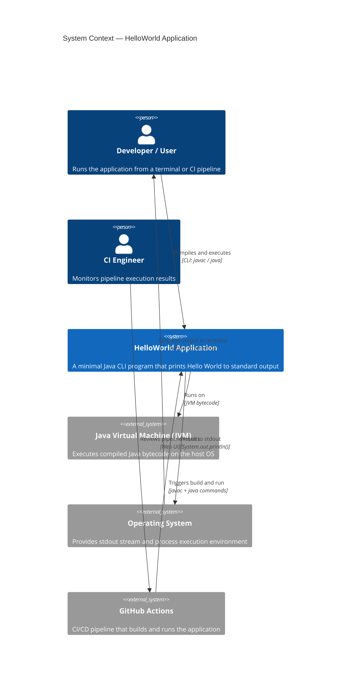

### 3.3 Technical Context

The technical interfaces of the system — build phase, run phase, and CI pipeline:

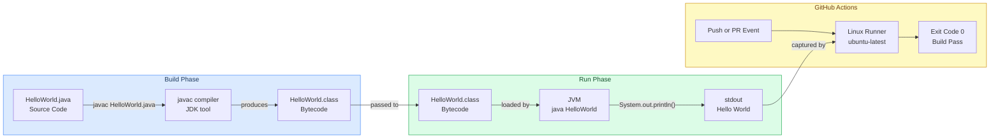

---

## 4. Solution Strategy

> **Source analysis**: `HelloWorld.java` — technology choices, structural decisions.

### 4.1 Technology Decisions

| Decision | Choice | Rationale |
|----------|--------|-----------|
| **Programming Language** | Java (standard edition) | Universally available JVM language; meets the goal of platform portability with a single source file |
| **Execution Model** | JVM-hosted CLI application | No server, no UI framework required; direct `main()` method invocation satisfies all goals |
| **Dependency Management** | None (zero dependencies) | The `java.lang` package provides `System.out`; no third-party libraries are needed |
| **Build Tooling** | Raw `javac` | Given a single-file application with no dependencies, a full build system (Maven, Gradle) would be over-engineering |
| **Output Mechanism** | `System.out.println()` | Standard Java idiom for writing a line to stdout; buffered, cross-platform |
| **Package Structure** | Default package | Acceptable for an executable with no reuse-as-library requirement |

### 4.2 Top-Level Decomposition Strategy

The solution follows the simplest possible decomposition: **a single class with a single static entry-point method**.

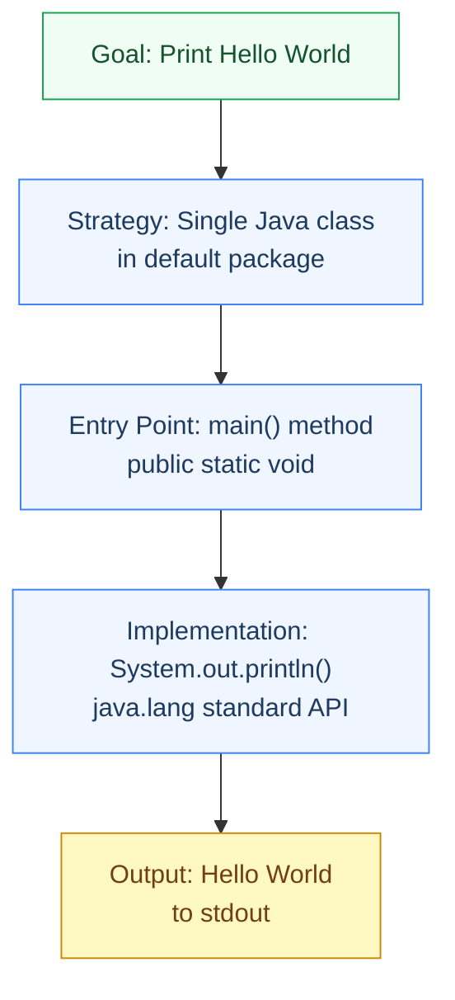

### 4.3 Approach to Quality Goals

| Quality Goal | Strategy Applied |
|--------------|-----------------|
| **Simplicity** | Minimal code: 1 class, 1 method, 1 statement. No abstractions beyond what Java mandates. |
| **Correctness** | Uses the standard `System.out.println()` which handles newline, flushing, and encoding automatically. |
| **Portability** | No OS-specific code, no file paths, no environment variables. Pure `java.lang` API guarantees cross-platform behaviour. |
| **Maintainability** | Standard class + main method scaffold allows easy extension (add parameters, extract methods, add packages). |

---

## 5. Building Block View

> **Source analysis**: `HelloWorld.java` — class structure, method inventory, AST breakdown.

### 5.1 Level 1 — High-Level System Decomposition

At the highest level, the system is a single deployable unit: the `HelloWorld` class compiled to a single `.class` bytecode file.

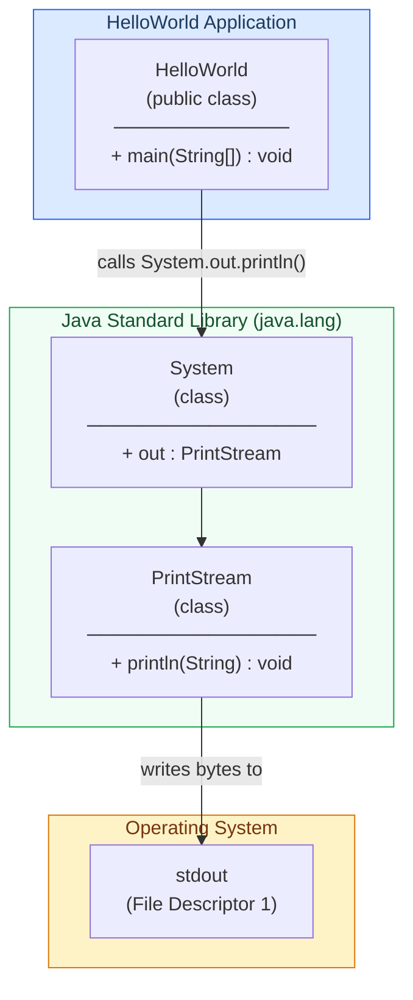

### 5.2 Level 2 — Class Structure

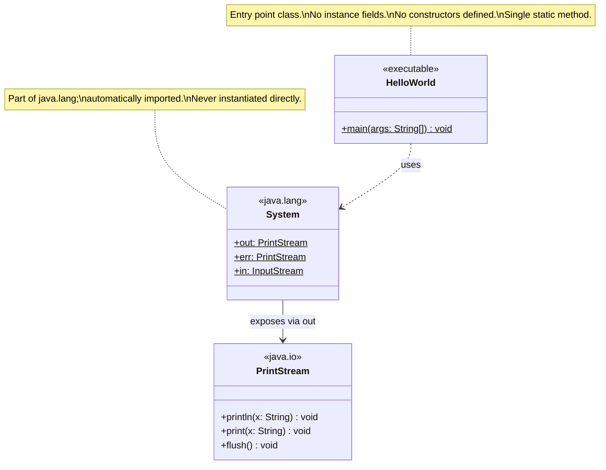

### 5.3 Level 3 — Method-Level Detail

The `main` method is the sole unit of logic in the application:

| Element | Type | Visibility | Static | Description |
|---------|------|-----------|--------|-------------|
| `HelloWorld` | Class | `public` | — | Top-level container; the JVM entry-point class |
| `main` | Method | `public` | ✅ Yes | JVM entry-point; receives command-line arguments (unused) |
| `args` | Parameter | — | — | `String[]` — CLI arguments; present but not consumed |
| `System.out` | Field access | — | ✅ Yes | Reference to the JVM's standard output `PrintStream` |
| `println("Hello World")` | Method call | — | — | Writes `"Hello World"` followed by a system newline to stdout |

### 5.4 Source Code Reference

```java
// File: HelloWorld.java
// Lines: 1–5
public class HelloWorld {
    public static void main(String[] args) {
        System.out.println("Hello World");
    }
}
```

> **Metrics**: 1 class · 1 method · 1 statement · 5 lines total · 0 imports · 0 external dependencies · Cyclomatic complexity = **1**

---

## 6. Runtime View

> **Source analysis**: `HelloWorld.java` — execution flow, method call sequence.

### 6.1 Key Runtime Scenario: Normal Execution

The primary (and only) runtime scenario is a successful invocation of the application.

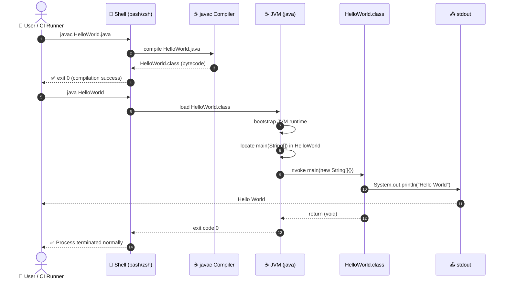

### 6.2 Execution Flowchart

```mermaid
flowchart TD
    START([▶️ Start: java HelloWorld]) --> LOAD[JVM loads HelloWorld.class]
    LOAD --> VERIFY[JVM verifies bytecode]
    VERIFY --> INIT[JVM initializes HelloWorld class]
    INIT --> MAIN["JVM calls\nmain(String[] args)"]
    MAIN --> SYSOUT["System.out.println\n('Hello World')"]
    SYSOUT --> BUFFER[Write to PrintStream buffer]
    BUFFER --> FLUSH[Flush buffer to OS stdout]
    FLUSH --> PRINT[/"Hello World" displayed\nin terminal"/]
    PRINT --> RETURN[main() returns void]
    RETURN --> EXIT([✅ JVM exits — code 0])

    style START fill:#dcfce7,stroke:#16a34a,color:#14532d
    style EXIT fill:#dcfce7,stroke:#16a34a,color:#14532d
    style SYSOUT fill:#dbeafe,stroke:#2563eb,color:#1e3a5f
    style PRINT fill:#fef9c3,stroke:#ca8a04,color:#713f12
```

### 6.3 Error Scenario: Missing JDK

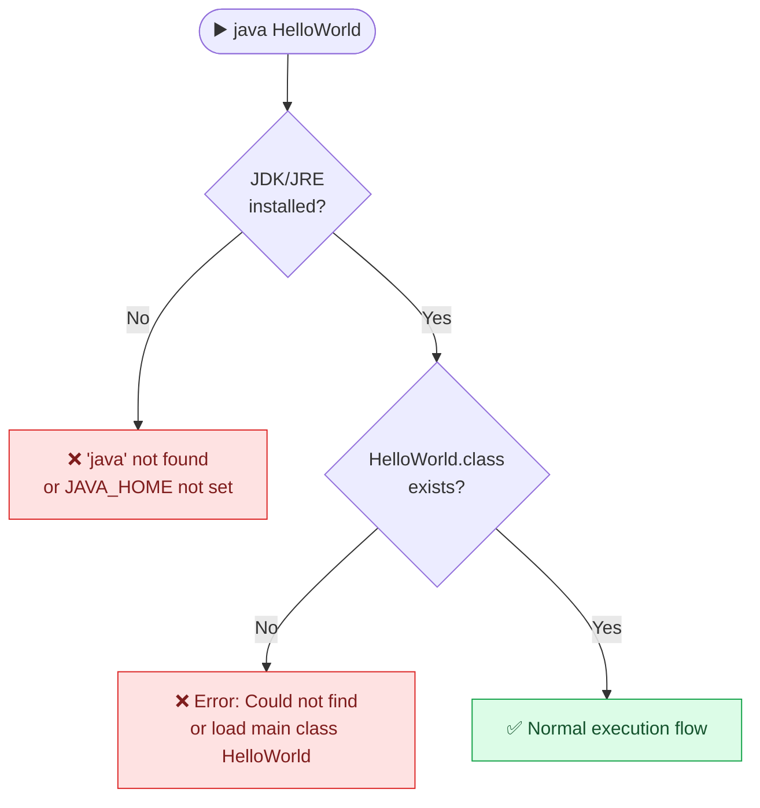

### 6.4 Runtime Characteristics

| Characteristic | Value |
|---------------|-------|
| **Startup time** | ~50–200 ms (JVM cold start) |
| **Memory footprint** | ~30–50 MB (JVM baseline heap) |
| **CPU usage** | Negligible (single `println` call) |
| **Exit code (success)** | `0` |
| **Exit code (failure)** | `1` (e.g., class not found) |
| **Thread model** | Single thread (`main` thread only) |
| **I/O operations** | 1 write to stdout |

---

## 7. Deployment View

> **Source analysis**: Single `.java` file, no build descriptor, GitHub Actions CI present.

### 7.1 Deployment Topology

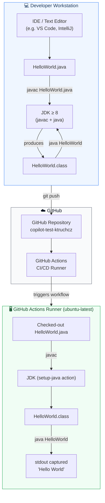

### 7.2 Infrastructure Requirements

| Component | Requirement | Notes |
|-----------|------------|-------|
| **JDK** | ≥ Java 8 (LTS: 11, 17, 21 recommended) | Required for both `javac` and `java` |
| **Operating System** | Any OS with JDK support (Linux, macOS, Windows) | No OS-specific APIs used |
| **Disk space** | < 5 KB (source + bytecode) | Negligible |
| **RAM** | ~50 MB minimum (JVM baseline) | JVM overhead dominates |
| **Network** | None required | Zero external connections |
| **Database** | None | Not applicable |
| **Containerisation** | Optional (e.g. `eclipse-temurin:21-jdk`) | No `Dockerfile` present currently |

### 7.3 CI/CD Pipeline Stages


---

## 8. Crosscutting Concepts

> **Source analysis**: Design patterns, coding conventions, and cross-system concerns identified in `HelloWorld.java`.

### 8.1 Domain Model

The domain model is trivially simple — there are no domain entities, value objects, or aggregates. The entire domain can be expressed as:

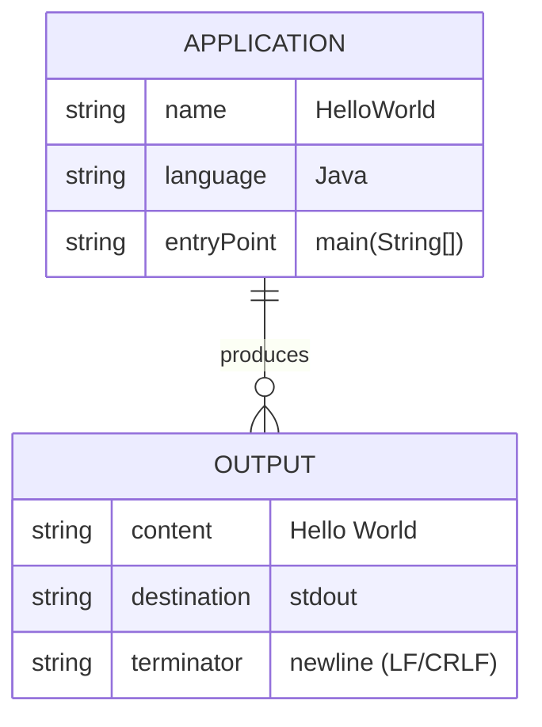

### 8.2 Design Patterns

| Pattern | Applied? | Location | Notes |
|---------|----------|----------|-------|
| **Entry-Point Pattern** | ✅ Yes | `main(String[] args)` | Standard Java application bootstrap pattern |
| **Singleton** | ➖ N/A | — | No instance state; all logic is static |
| **Factory** | ➖ N/A | — | Not applicable at this scale |
| **MVC / Layered Architecture** | ➖ N/A | — | No separation needed for a single-statement app |
| **Dependency Injection** | ➖ N/A | — | No dependencies to inject |

### 8.3 Architecture Patterns

The application uses the **Command-Line Interface (CLI) Application** pattern:

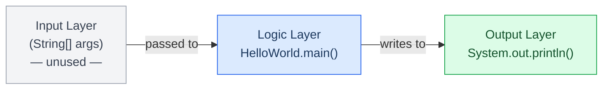

### 8.4 Error Handling

No explicit error handling is implemented. The application:
- Does **not** use `try/catch` blocks.
- Does **not** validate `args`.
- Relies on the JVM's default uncaught-exception handler for any unexpected errors.
- `System.out.println()` does **not** throw checked exceptions; failures are silent (printed to `stderr` by the JVM).

### 8.5 Logging and Observability

| Concern | Approach | Quality |
|---------|----------|---------|
| **Application logging** | None (`System.out` is the only output) | ⚠️ Minimal |
| **Structured logging** | Not implemented | ❌ Absent |
| **Metrics / telemetry** | Not implemented | ❌ Absent |
| **Health checks** | Not applicable | — |

### 8.6 Security Concepts

| Concern | Status | Notes |
|---------|--------|-------|
| **Input validation** | ✅ Not needed | `args` is never read |
| **Injection vulnerabilities** | ✅ Not applicable | No user-controlled data is processed |
| **Dependency vulnerabilities** | ✅ Zero risk | No third-party dependencies |
| **Authentication / Authorization** | ✅ Not applicable | No resources to protect |

### 8.7 Coding Conventions Observed

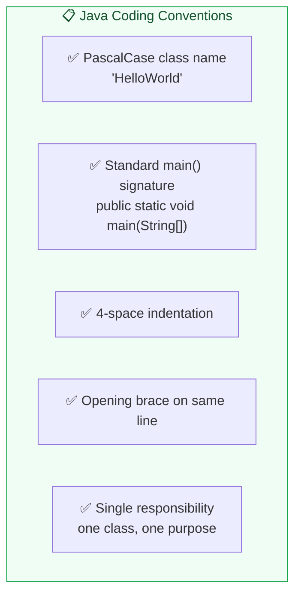

---

## 9. Architecture Decisions

> **Source analysis**: Technology stack, structural choices, and rationale extracted from `HelloWorld.java`.

### ADR-001: Use Java as the Implementation Language

| Attribute | Value |
|-----------|-------|
| **Status** | Accepted |
| **Date** | Project inception |
| **Deciders** | Project owner (`ktruchcz`) |

**Context**: A minimal demonstration program is needed.

**Decision**: Implement the application in Java.

**Consequences**:
- ✅ JVM portability across all major operating systems.
- ✅ Familiar to the vast majority of enterprise developers.
- ✅ No licensing cost (OpenJDK).
- ⚠️ JVM cold-start overhead (~100–200 ms) is disproportionate to the workload.
- ⚠️ Requires JDK installation, unlike a native binary.

---

### ADR-002: No Build Tool (Raw javac)

| Attribute | Value |
|-----------|-------|
| **Status** | Accepted (implicitly) |
| **Date** | Project inception |
| **Deciders** | Project owner |

**Context**: The application has one source file and zero dependencies.

**Decision**: Use raw `javac` / `java` commands without Maven, Gradle, or Ant.

**Alternatives Considered**:

| Alternative | Why Rejected |
|-------------|--------------|
| **Maven** | Introduces `pom.xml`, directory conventions, and network access for a zero-dependency project |
| **Gradle** | Same overhead as Maven; build DSL complexity unjustified |
| **Ant** | Requires `build.xml`; obsolete for new projects |

**Consequences**:
- ✅ Zero toolchain overhead; single command to build.
- ⚠️ Does not scale — adding dependencies later requires adopting a build tool.
- ⚠️ No standard test runner integration.

---

### ADR-003: Place Class in Default Package

| Attribute | Value |
|-----------|-------|
| **Status** | Accepted (implicitly) |
| **Date** | Project inception |

**Context**: Single-class standalone executable.

**Decision**: No `package` declaration; class resides in the default (unnamed) package.

**Consequences**:
- ✅ Simplest possible file structure; can be compiled from any directory.
- ⚠️ Classes in the default package cannot be imported by named packages — prevents library reuse.
- ⚠️ Not following Java best practices for production code.

---

### ADR-004: Use System.out.println() for Output

| Attribute | Value |
|-----------|-------|
| **Status** | Accepted |
| **Date** | Project inception |

**Context**: Output must reach the user's terminal and CI pipeline's stdout capture.

**Decision**: Use `System.out.println("Hello World")`.

**Alternatives Considered**:

| Alternative | Notes |
|-------------|-------|
| `System.out.print("Hello World\n")` | Equivalent; less idiomatic |
| `System.err.println(...)` | Wrong stream; stderr is for diagnostics |
| `java.util.logging` | Heavy overhead for a single message |
| External logging frameworks (SLF4J, Log4j) | Unjustified dependency |

**Consequences**:
- ✅ Cross-platform newline handling by the JVM.
- ✅ Automatically flushed on program exit.
- ⚠️ Not suitable for high-throughput output scenarios (buffered, not lock-free).

---

## 10. Quality Requirements

> **Source analysis**: Code metrics from `HelloWorld.java`, quality attributes from goals.

### 10.1 Quality Tree

```mermaid
graph TD
    ROOT["🏆 Quality\n(HelloWorld App)"]

    ROOT --> FUNC["⚙️ Functionality"]
    ROOT --> RELY["🛡️ Reliability"]
    ROOT --> PERF["⚡ Performance"]
    ROOT --> MAIN["🔧 Maintainability"]
    ROOT --> PORT["🌍 Portability"]

    FUNC --> F1["Correct output:\n'Hello World' to stdout"]
    FUNC --> F2["Exit code 0\non success"]

    RELY --> R1["No crashes\non standard JDKs"]
    RELY --> R2["Deterministic output\n(same result every run)"]

    PERF --> P1["Startup < 500ms\non modern hardware"]
    PERF --> P2["Memory < 100MB\n(JVM baseline)"]

    MAIN --> M1["Cyclomatic complexity = 1\n(lowest possible)"]
    MAIN --> M2["Lines of code = 5\n(minimal)"]
    MAIN --> M3["Zero dependencies\n(no upgrade burden)"]

    PORT --> PT1["Runs on Java 8–21+"]
    PORT --> PT2["Cross-platform:\nLinux / macOS / Windows"]

    style ROOT fill:#fef3c7,stroke:#d97706,color:#78350f
    style FUNC fill:#dbeafe,stroke:#2563eb,color:#1e3a5f
    style RELY fill:#dcfce7,stroke:#16a34a,color:#14532d
    style PERF fill:#fce7f3,stroke:#db2777,color:#831843
    style MAIN fill:#ede9fe,stroke:#7c3aed,color:#3b0764
    style PORT fill:#ffedd5,stroke:#ea580c,color:#7c2d12
```

### 10.2 Quality Scenarios

| ID | Quality Attribute | Stimulus | Response | Measure |
|----|------------------|----------|----------|---------|
| QS-01 | **Correctness** | User runs `java HelloWorld` | Application prints exactly `Hello World` followed by newline | Output matches `"Hello World\n"` byte-for-byte |
| QS-02 | **Reliability** | Application is run 1000 times consecutively | Produces identical output each time | 100% success rate; exit code always `0` |
| QS-03 | **Performance** | CI runner executes the application | Completes within acceptable pipeline time | Total execution < 500 ms on a modern runner |
| QS-04 | **Portability** | Compiled on JDK 17, executed on JDK 11 | Application runs without modification | No version-specific bytecode issues |
| QS-05 | **Understandability** | New developer reads the source code | Understands the entire codebase | Time to full comprehension < 30 seconds |

### 10.3 Code Metrics Summary

| Metric | Value | Assessment |
|--------|-------|------------|
| **Lines of Code (LoC)** | 5 | ✅ Excellent — minimal |
| **Number of classes** | 1 | ✅ Appropriate |
| **Number of methods** | 1 | ✅ Appropriate |
| **Number of statements** | 1 | ✅ Minimal |
| **Cyclomatic complexity** | 1 | ✅ Lowest possible |
| **Cognitive complexity** | 0 | ✅ Trivial |
| **External dependencies** | 0 | ✅ Zero risk |
| **Test coverage** | 0% | ❌ No tests present |
| **Documentation coverage** | 0% | ❌ No Javadoc |
| **Import count** | 0 | ✅ Clean namespace |

---

## 11. Risks and Technical Debt

> **Source analysis**: Structural gaps, missing artifacts, and scalability concerns identified.

### 11.1 Risk Register

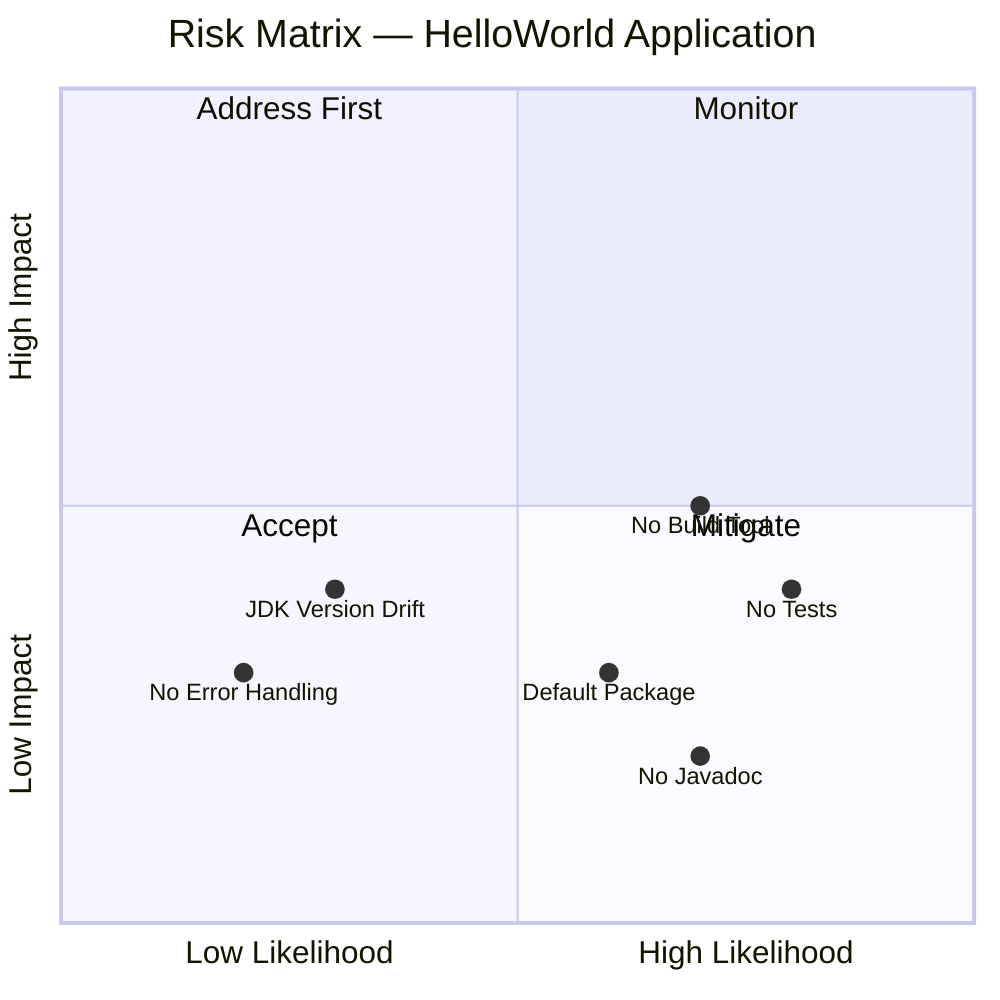

### 11.2 Identified Risks

| ID | Risk | Likelihood | Impact | Mitigation |
|----|------|-----------|--------|-----------|
| R-01 | **No automated tests** — bugs introduced by future changes go undetected | High | Medium | Add JUnit 5 unit test asserting stdout output |
| R-02 | **No build tool** — onboarding new contributors requires manual `javac` commands | High | Medium | Adopt Maven or Gradle with a minimal `pom.xml` / `build.gradle` |
| R-03 | **Default package usage** — class cannot be reused as a library | Medium | Low | Introduce a named package (e.g., `com.example.helloworld`) |
| R-04 | **No Javadoc** — no inline documentation for future maintainers | High | Low | Add class-level and method-level Javadoc comments |
| R-05 | **JDK version unspecified** — pipeline may use a different JDK version than expected | Low | Medium | Pin JDK version in GitHub Actions workflow (`java-version: '21'`) |
| R-06 | **README is empty** — contributors have no setup or run instructions | High | Low | Expand README with build/run instructions |
| R-07 | **No `.gitignore` for class files** | Medium | Low | Add `*.class` to `.gitignore` (verify existing `.gitignore` covers this) |

### 11.3 Technical Debt Items

| ID | Debt Item | Type | Effort to Resolve | Priority |
|----|-----------|------|------------------|---------|
| TD-01 | No unit tests (`HelloWorldTest.java`) | Testing debt | Low (< 1 hour) | High |
| TD-02 | No build tool configuration | Tooling debt | Low (< 2 hours) | High |
| TD-03 | Default package — violates Java best practices | Architectural debt | Low (< 30 min) | Medium |
| TD-04 | No Javadoc on class or method | Documentation debt | Low (< 15 min) | Medium |
| TD-05 | Minimal README | Documentation debt | Low (< 30 min) | Medium |
| TD-06 | `args` parameter unused but undocumented | Code smell | Low (< 5 min) | Low |
| TD-07 | No `@SuppressWarnings` or annotation hygiene | Code hygiene | Low (< 5 min) | Low |

### 11.4 Recommended Remediation Roadmap

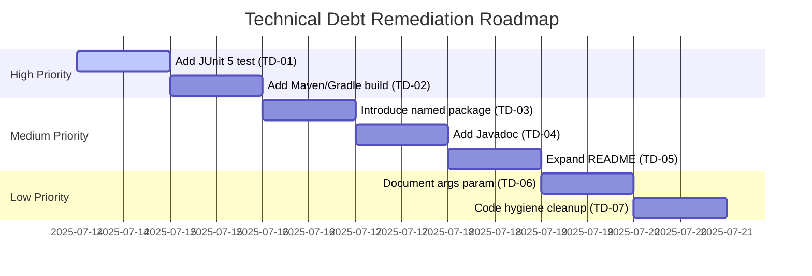

---

## 12. Glossary

> **Source analysis**: Domain terms, Java-specific terminology, and concepts referenced throughout this document.

| Term | Definition |
|------|-----------|
| **ADR** | Architecture Decision Record — a document capturing a significant architectural decision, its context, and consequences |
| **Arc42** | A template for documenting software architectures, structured in 12 sections. See [arc42.org](https://arc42.org) |
| **args** | The `String[]` parameter of the `main` method; holds command-line arguments passed to the JVM at startup |
| **Bytecode** | Platform-independent compiled representation of Java source code (`.class` files) processed by the JVM |
| **C4 Model** | A hierarchical approach to visualising software architecture at four levels: Context, Container, Component, Code |
| **CI/CD** | Continuous Integration / Continuous Delivery — automated pipeline for building, testing, and deploying code |
| **CLI** | Command-Line Interface — a text-based interface for interacting with programs via a terminal or shell |
| **Cyclomatic Complexity** | A software metric measuring the number of independent paths through a program's source code |
| **Default Package** | In Java, a class without a `package` declaration belongs to the unnamed default package |
| **Entry Point** | The method where JVM execution begins; in Java, `public static void main(String[] args)` |
| **GitHub Actions** | A CI/CD platform integrated into GitHub that runs automated workflows in response to repository events |
| **Hello World** | A traditional first program in any programming language that outputs the phrase "Hello, World!" |
| **Java** | A strongly-typed, object-oriented, platform-independent programming language running on the JVM |
| **javac** | The Java compiler tool included in the JDK; transforms `.java` source files into `.class` bytecode |
| **JDK** | Java Development Kit — includes `javac` (compiler), `java` (runtime), and standard libraries |
| **JRE** | Java Runtime Environment — subset of the JDK containing only the JVM and standard libraries (no compiler) |
| **JVM** | Java Virtual Machine — the runtime engine that executes Java bytecode on any host operating system |
| **LoC** | Lines of Code — a basic measure of program size |
| **main method** | The JVM-designated entry point method with signature `public static void main(String[] args)` |
| **PrintStream** | A `java.io` class wrapping an output stream with convenient `print` and `println` methods |
| **stdout** | Standard Output — the default output stream (file descriptor 1) where a process writes its primary output |
| **System.out** | A static field of `java.lang.System` holding a `PrintStream` connected to the process's stdout |
| **System.out.println()** | A method call that writes a string followed by a platform-specific newline character to stdout |
| **Technical Debt** | The implied cost of additional rework caused by choosing an expedient solution instead of a better approach |

---

*Documentation generated by the **Arc42 Documentation Generator** agent.*  
*Based on static analysis of `HelloWorld.java` and `README.md`.*  
*For updates, re-run the analysis pipeline against the latest repository state.*

