# Architecture Documentation (Arc42)

**Project**: copilot-test-ktruchcz — Hello World
**Repository**: [github.com/ktruchcz/copilot-test-ktruchcz](https://github.com/ktruchcz/copilot-test-ktruchcz)
**Version**: 1.0.0
**Date**: 2026-03-30
**Generated by**: Arc42 Documentation Generator

---

## Table of Contents

1. [Introduction and Goals](#1-introduction-and-goals)
2. [Architecture Constraints](#2-architecture-constraints)
3. [System Scope and Context](#3-system-scope-and-context)
4. [Solution Strategy](#4-solution-strategy)
5. [Building Block View](#5-building-block-view)
6. [Runtime View](#6-runtime-view)
7. [Deployment View](#7-deployment-view)
8. [Cross-cutting Concepts](#8-cross-cutting-concepts)
9. [Architecture Decisions](#9-architecture-decisions)
10. [Quality Requirements](#10-quality-requirements)
11. [Risks and Technical Debts](#11-risks-and-technical-debts)
12. [Glossary](#12-glossary)

---

## 1. Introduction and Goals

### 1.1 Requirements Overview

`copilot-test-ktruchcz` is a minimal Java console application whose sole purpose is to print the text **"Hello World"** to the standard output stream when executed. It serves as a canonical starting point for verifying that a Java development and runtime environment is correctly configured, and as a baseline repository for AI-assisted tooling experiments (e.g., GitHub Copilot architecture analysis and documentation generation).

The program consists of exactly **one public class** (`HelloWorld`), **one method** (`main`), and **one executable statement** (`System.out.println`). Its simplicity is intentional and architecturally significant: it represents the absolute lower bound of a valid, self-contained Java application.

**Functional Requirements:**

| ID    | Requirement                                                                                                    | Priority   |
|-------|----------------------------------------------------------------------------------------------------------------|------------|
| FR-01 | The system SHALL print the exact string `Hello World` followed by a platform-native newline to stdout.         | Must-have  |
| FR-02 | The system SHALL exit with exit code `0` after successfully writing the output.                                | Must-have  |
| FR-03 | The system SHALL accept any number of command-line arguments without error (they are intentionally ignored).   | Should-have |
| FR-04 | The system SHALL produce identical output regardless of the values of any supplied command-line arguments.     | Should-have |

### 1.2 Quality Goals

The following top-level quality goals drive all architectural decisions for this system. They are listed in descending priority order.

| Priority | Quality Goal       | Motivation                                                                                                  |
|----------|--------------------|-------------------------------------------------------------------------------------------------------------|
| 1        | **Simplicity**     | The application must be understandable at a single glance — one class, one method, one statement.           |
| 2        | **Portability**    | Must run unmodified on any platform that provides a conformant JRE (Linux, macOS, Windows, etc.).           |
| 3        | **Reproducibility**| Given the same JDK version, every build and every execution must produce bit-for-bit identical output.      |
| 4        | **Minimal Footprint** | Zero external libraries, zero build scripts, zero configuration files beyond the source itself.          |
| 5        | **Analysability**  | As a Copilot test target, the codebase must be structurally well-formed so automated tools can process it. |

### 1.3 Stakeholders

| Role                     | Person / Group                          | Primary Expectations                                                                                  |
|--------------------------|-----------------------------------------|-------------------------------------------------------------------------------------------------------|
| Developer / Owner        | `ktruchcz` (repository owner)          | A working Java environment baseline; a sandbox for GitHub Copilot and architecture-tooling experiments. |
| AI Tooling System        | GitHub Copilot / Architecture Analyser | A syntactically and semantically valid Java source file with clear, machine-readable structure.        |
| CI / DevOps System       | GitHub Actions runners                 | A repository whose build can be bootstrapped with a single `javac` call; no dependency resolution.    |
| Technical Reviewer       | Any visiting software engineer          | A self-explanatory, minimal example of a canonical Java application entry point.                      |
| Architecture Documentor  | Arc42 Documentation Generator (this tool) | A codebase simple enough to yield a complete, accurate Arc42 document from static analysis alone.   |

---

## 2. Architecture Constraints

### 2.1 Technical Constraints

| ID    | Constraint                      | Rationale                                                                                                       |
|-------|---------------------------------|-----------------------------------------------------------------------------------------------------------------|
| TC-01 | **Language: Java**              | The source file is `HelloWorld.java`. All downstream tooling (compiler, analyser, documenter) must support Java. |
| TC-02 | **No build tool**               | No `pom.xml`, `build.gradle`, `build.xml`, or `Makefile` is present. Compilation relies entirely on raw `javac`.|
| TC-03 | **No external dependencies**    | Only `java.lang.System` (auto-imported) and `java.io.PrintStream` (referenced via `System.out`) are used.       |
| TC-04 | **JDK ≥ 1.0 compatibility**    | `System.out.println` with a static `main` entry-point has been valid since Java 1.0; no modern features are used.|
| TC-05 | **Single source file**          | The entire application resides in exactly one file: `HelloWorld.java`.                                           |
| TC-06 | **Console / CLI only**          | Output is exclusively to `stdout`. No GUI, web interface, message queue, or network socket is involved.          |
| TC-07 | **No classpath configuration**  | There is no `MANIFEST.MF`, no module descriptor (`module-info.java`), and no classpath argument needed.         |

### 2.2 Organizational Constraints

| ID    | Constraint                       | Rationale                                                                                                    |
|-------|----------------------------------|--------------------------------------------------------------------------------------------------------------|
| OC-01 | **Public GitHub repository**     | Code is publicly visible at `github.com/ktruchcz/copilot-test-ktruchcz`. Any person can read or fork it.    |
| OC-02 | **No test suite**                | No unit or integration tests exist. There is no `test/` directory, no JUnit dependency, no test runner config.|
| OC-03 | **No CI pipeline**               | No `.github/workflows/` directory is present. All build and run operations are performed manually.            |
| OC-04 | **Minimal documentation**        | The only existing documentation is `README.md`, which contains only a single heading (`# copilot-test-ktruchcz`). |
| OC-05 | **No versioning strategy**       | No `CHANGELOG.md`, no semantic versioning tags, no release workflow.                                         |

### 2.3 Conventions

| Convention       | Details                                                                                                    |
|------------------|------------------------------------------------------------------------------------------------------------|
| **Naming**       | Class name `HelloWorld` exactly matches file name `HelloWorld.java`, as mandated by the Java Language Specification for public top-level classes. |
| **Source encoding** | UTF-8 (default for modern JDKs; the source contains only ASCII characters so encoding is moot in practice). |
| **Entry point**  | Standard Java entry-point signature: `public static void main(String[] args)`.                             |
| **Indentation**  | 4-space indentation consistent with standard Java style guides (Google Java Style, Oracle Code Conventions). |
| **Bracing style**| Egyptian / K&R braces — opening brace on the same line as the declaration.                                |

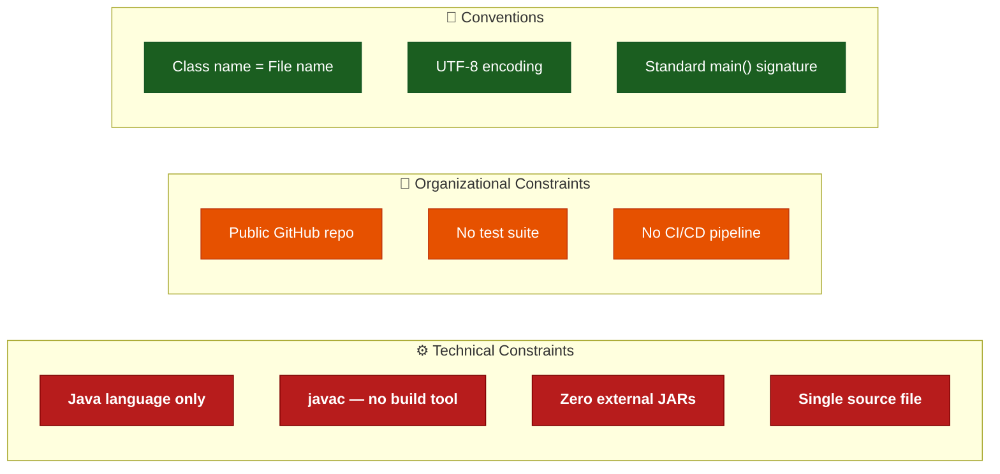

---

## 3. System Scope and Context

### 3.1 Business Context

`HelloWorld` sits entirely within the boundary of a single, short-lived JVM process. It receives no external input beyond the CLI invocation itself and produces exactly one line of text on the standard output stream. The diagram below illustrates the system boundary and all interactions with the external environment.

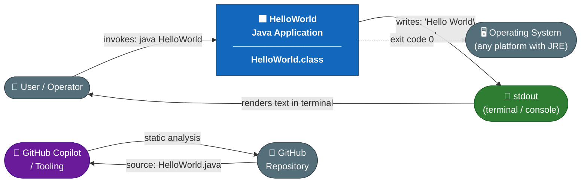

**Business interface summary:**

| Interface          | Partner              | Direction     | Data                                    |
|--------------------|----------------------|---------------|-----------------------------------------|
| CLI invocation     | User / Operator      | → System      | Process start signal; `args` array (ignored) |
| Standard output    | Terminal / Console   | System →      | String literal `"Hello World"` + newline |
| Process exit code  | Operating System     | System →      | Integer `0` (success)                   |
| Source code read   | GitHub Copilot       | ← Repository  | `HelloWorld.java` text                  |

### 3.2 Technical Context

The diagram below shows the complete technical toolchain required to build and execute the application.

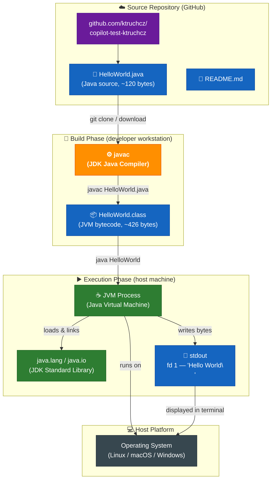

### 3.3 External Interfaces

| Interface           | Direction | Technology / Protocol              | Data Exchanged                                        |
|---------------------|-----------|------------------------------------|-------------------------------------------------------|
| CLI invocation      | Input     | OS process spawn (`java HelloWorld`) | JVM start; optional `String[] args` (currently ignored) |
| Standard Output     | Output    | `java.io.PrintStream.println()`    | UTF-8 string `"Hello World"` + platform line separator |
| Process exit code   | Output    | OS `exit(int)` syscall             | `0` — successful termination                          |
| GitHub web          | External  | HTTPS / Git                        | Source files readable by Copilot and human reviewers  |

---

## 4. Solution Strategy

### 4.1 Core Strategy Statement

The solution strategy for `HelloWorld` is one of **deliberate and extreme minimalism**. Every architectural decision is optimised to reduce complexity, eliminate dependencies, and ensure the system is fully understandable in under 30 seconds. This is not a limitation — it is the explicit design goal.

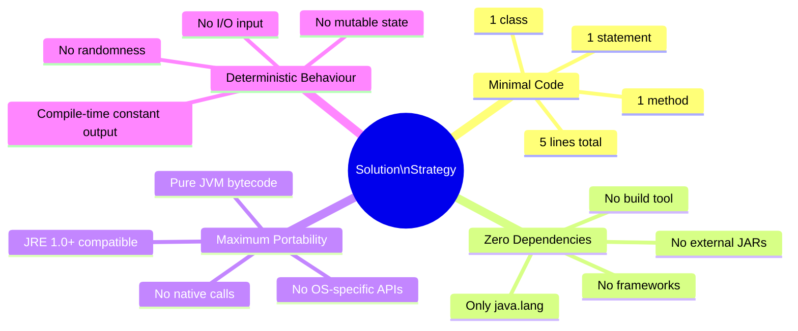

### 4.2 Technology Decisions

| Decision                  | Choice                       | Rationale                                                                                               | Rejected Alternatives                              |
|---------------------------|------------------------------|---------------------------------------------------------------------------------------------------------|----------------------------------------------------|
| **Programming Language**  | Java                         | Write-once-run-anywhere portability via JVM; ubiquitous in enterprise; required by the Copilot test setup. | Python (no compile step), C (no JVM, platform-specific binary) |
| **Runtime Framework**     | None (raw `java.lang`)       | `System.out.println` is the entire requirement; any framework (Spring, Micronaut, Quarkus) would be disproportionate. | Spring Boot, Quarkus — rejected as overkill         |
| **Build System**          | None (raw `javac`)           | Zero-dependency, zero-configuration compilation for a single file with no transitive dependencies.      | Maven, Gradle, Ant — all rejected as unnecessary overhead |
| **Output Mechanism**      | `System.out.println(String)` | The simplest, most readable, and most universal mechanism for console output in Java.                   | `System.out.print` + manual `\n`, `Logger`, `BufferedWriter` |
| **Configuration**         | Hard-coded string literal    | The output is fixed and immutable by design; externalisation would add complexity with no benefit.       | `.properties` file, environment variable, CLI arg  |

### 4.3 Approach to Quality Goals

| Quality Goal        | Architectural Strategy                                                                                       |
|---------------------|--------------------------------------------------------------------------------------------------------------|
| **Simplicity**      | Absolute minimum code — 5 lines including braces. Single class, single method, single statement.              |
| **Portability**     | Rely exclusively on `java.lang` (auto-imported, guaranteed on every conformant JRE since version 1.0).        |
| **Reproducibility** | No mutable state, no runtime I/O sources, no randomness, no date/time dependency → completely deterministic output. |
| **Minimal Footprint**| No configuration files, no dependency manifests, no generated artifacts committed to the repository.         |
| **Analysability**   | Standard Java class structure with a canonical `main` method; optimal for static analysis tools and Copilot. |

---

## 5. Building Block View

### 5.1 Level 1 — System Whitebox

The entire system is a single deployable unit: one compiled Java class. The diagram below shows the top-level decomposition.

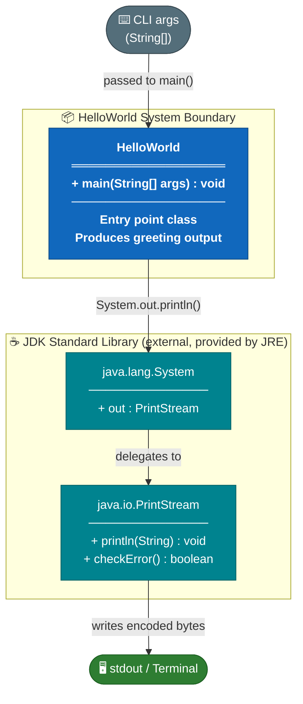

**Contained Building Blocks:**

| Block               | Type             | Responsibility                                                                    | Source / Location            |
|---------------------|------------------|-----------------------------------------------------------------------------------|------------------------------|
| `HelloWorld`        | Application class | Application entry point; invokes the single output operation and terminates.     | `HelloWorld.java` (this repo) |
| `java.lang.System`  | JDK class (external) | Provides the static `out` field referencing the process's stdout `PrintStream`. | JDK `java.lang` package       |
| `java.io.PrintStream` | JDK class (external) | Handles character encoding, buffering, and OS-level write to stdout fd 1.      | JDK `java.io` package         |

### 5.2 Level 2 — HelloWorld Class Whitebox

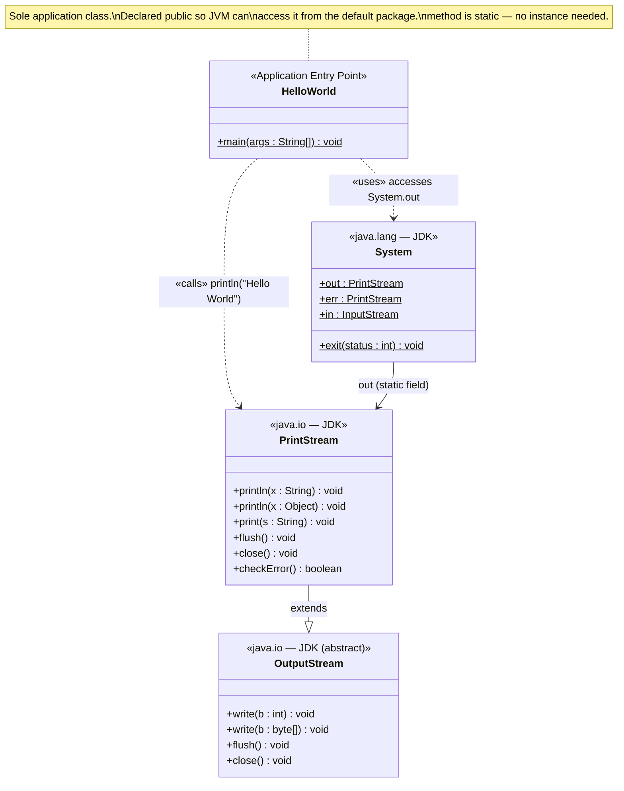

**Method inventory:**

| Class         | Method                  | Modifiers       | Return | Description                                                                                                    |
|---------------|-------------------------|-----------------|--------|----------------------------------------------------------------------------------------------------------------|
| `HelloWorld`  | `main(String[] args)`   | `public static` | `void` | JVM-designated entry point. Calls `System.out.println("Hello World")`. Upon return, the JVM exits with code 0. |

**Field inventory:**

| Class        | Field | Type | Description                         |
|--------------|-------|------|-------------------------------------|
| `HelloWorld` | *(none)* | — | No instance or class fields declared. |

### 5.3 Level 3 — Statement-Level Control Flow

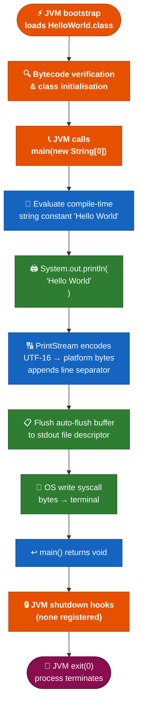

---

## 6. Runtime View

### 6.1 Scenario 1 — Happy Path: Normal Execution

The primary (and only intended) runtime scenario: a user invokes the compiled application from the command line.

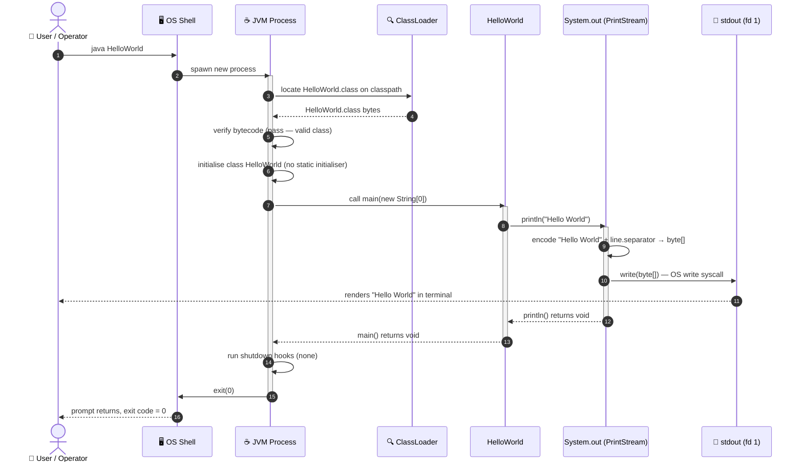

### 6.2 Scenario 2 — Execution with Command-Line Arguments

The `main` method signature accepts `String[] args`, but the implementation unconditionally ignores it. Any arguments are silently discarded.

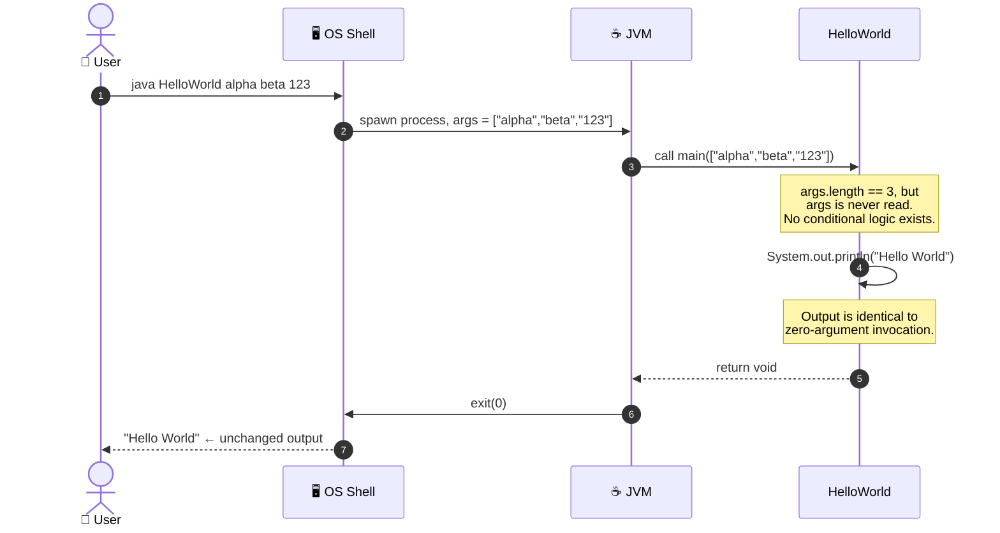

### 6.3 Scenario 3 — Error Path: Class Not Found

When `HelloWorld.class` is absent from the classpath (e.g., source compiled in a different directory, or class file deleted), the JVM raises `ClassNotFoundException` before `main()` is ever called.

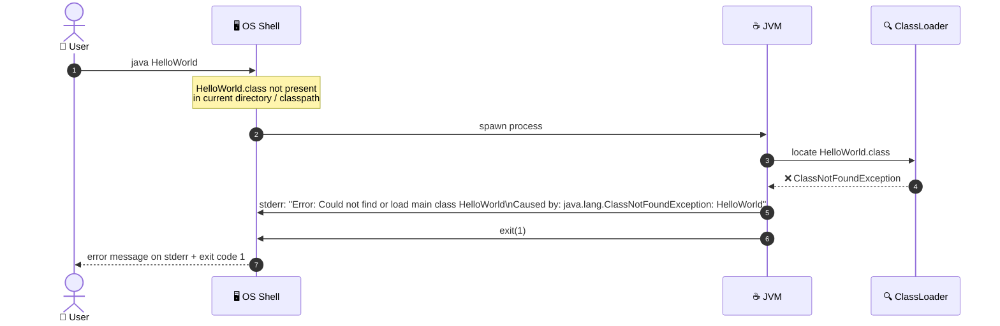

### 6.4 Scenario 4 — Error Path: Source Not Yet Compiled

A common mistake for newcomers: attempting to run the `.java` source file directly.

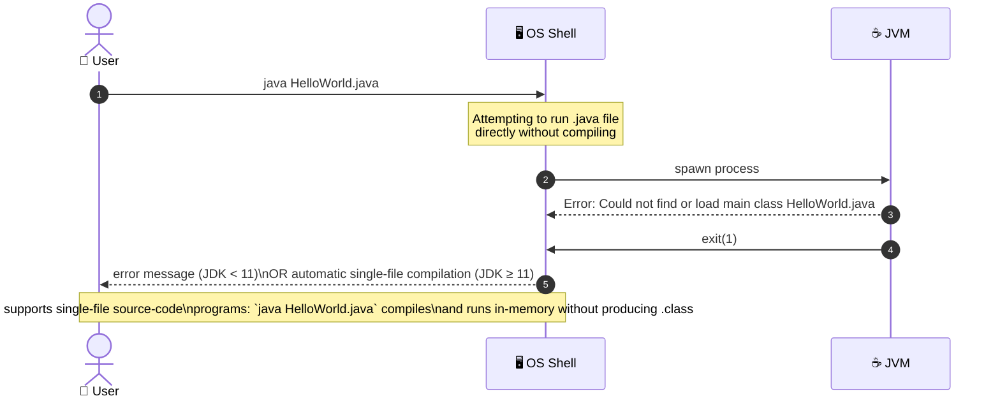

### 6.5 Application Lifecycle — State Machine

```mermaid
stateDiagram-v2
    direction LR

    [*] --> Uncompiled : source file committed to repo

    Uncompiled --> Compiled : javac HelloWorld.java ✓
    Uncompiled --> CompileError : javac — syntax error (not applicable to current code)

    Compiled --> JVMStarting : java HelloWorld invoked
    JVMStarting --> ClassLoading : JVM process spawned
    ClassLoading --> BytecodeVerified : class file valid ✓
    ClassLoading --> LoadError : ClassNotFoundException ✗

    BytecodeVerified --> ClassInitialised : static initialisers run (none)
    ClassInitialised --> MainExecuting : JVM calls main(args)
    MainExecuting --> OutputWritten : println() completes ✓
    OutputWritten --> MainReturned : main() returns void
    MainReturned --> ShutdownHooks : JVM runs shutdown hooks (none)
    ShutdownHooks --> Terminated : exit(0) ✓

    LoadError --> [*] : exit(1) ✗
    CompileError --> [*] : no .class produced ✗
    Terminated --> [*] : exit(0) ✓
```

---

## 7. Deployment View

### 7.1 Infrastructure Overview

The deployment topology is the absolute minimum for any runnable Java program: a host OS with a JRE installed, a filesystem containing the compiled `.class` file, and a terminal for output.

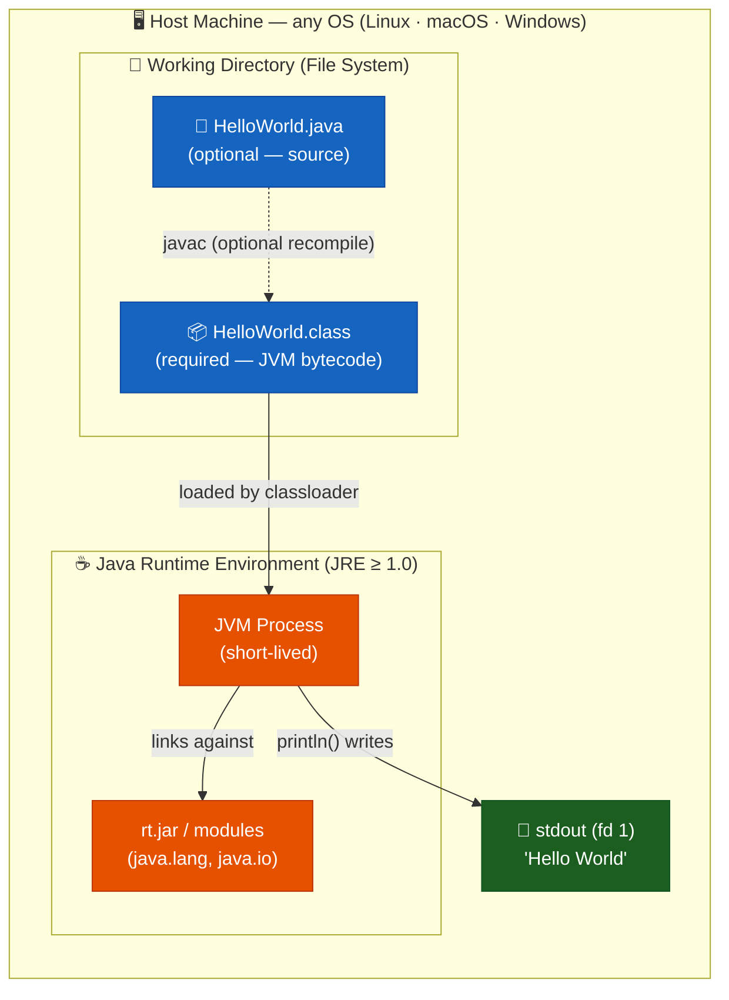

### 7.2 Build and Deploy Pipeline


### 7.3 Deployment Variants

| Variant              | Description                                                     | Steps                                                                                                  |
|----------------------|-----------------------------------------------------------------|--------------------------------------------------------------------------------------------------------|
| **Local developer**  | Compile and run on a developer workstation.                     | `git clone …` → `javac HelloWorld.java` → `java HelloWorld`                                           |
| **GitHub Actions CI**| Any Actions runner with `actions/setup-java` installed.         | Workflow step: `run: javac HelloWorld.java && java HelloWorld`                                          |
| **Docker container** | Any image based on `eclipse-temurin` or `openjdk`.             | `COPY HelloWorld.java /app/` → `RUN javac HelloWorld.java` → `CMD ["java", "-cp", "/app", "HelloWorld"]` |
| **JDK 11+ single-file** | JDK 11+ supports running `.java` files without a prior compile step. | `java HelloWorld.java` (compiles in-memory, no `.class` artifact persisted)                        |
| **GraalVM native**   | Compile to a native binary for zero JVM startup overhead.       | `native-image HelloWorld` → `./helloworld`                                                             |

### 7.4 Minimum System Requirements

| Requirement           | Value                                                                                  |
|-----------------------|----------------------------------------------------------------------------------------|
| Java Runtime (run)    | JRE 1.0 or later (any vendor: Oracle, OpenJDK, Eclipse Temurin, Amazon Corretto, …)    |
| Java Development Kit (build) | JDK 1.0 or later (for `javac`)                                                |
| Disk space — source   | < 1 KB (`HelloWorld.java` ≈ 103 bytes)                                                 |
| Disk space — bytecode | < 1 KB (`HelloWorld.class` ≈ 426 bytes)                                                |
| RAM                   | JVM base overhead only (~20–60 MB on modern JDKs; sub-millisecond heap usage)          |
| CPU                   | Any architecture with a certified JVM port (x86, x86-64, ARM64, RISC-V, etc.)          |
| Network               | **None** — fully offline operation                                                     |
| Database              | **None**                                                                               |
| Ports / sockets       | **None**                                                                               |
| Environment variables | **None** required (all defaults are acceptable)                                        |

---

## 8. Cross-cutting Concepts

### 8.1 Domain Model

The application's domain is intentionally trivial. The full conceptual model contains a single entity: the immutable greeting string.

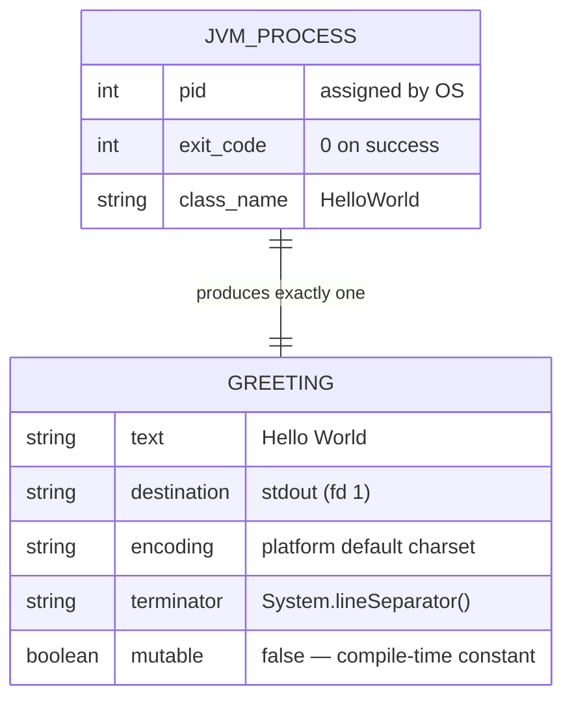

### 8.2 Output and Logging Concept

| Aspect                | Decision / Detail                                                                                             |
|-----------------------|---------------------------------------------------------------------------------------------------------------|
| **Output channel**    | `System.out` — the JVM's standard output `PrintStream`, connected to OS file descriptor 1.                   |
| **Output content**    | The compile-time string constant `"Hello World"`.                                                            |
| **Line terminator**   | `PrintStream.println()` appends `System.lineSeparator()`: `\n` on Unix/macOS, `\r\n` on Windows.            |
| **Character encoding**| `PrintStream` uses the JVM default charset (typically UTF-8 on modern systems). The content is pure ASCII.   |
| **Logging framework** | **None.** No SLF4J, Log4j 2, Logback, or `java.util.logging` is used or needed.                             |
| **Structured logging**| Not applicable.                                                                                               |
| **Log levels**        | Not applicable.                                                                                               |
| **Auto-flush**        | `System.out` is created with `autoFlush = true` by the JVM; `println()` flushes immediately.                 |

### 8.3 Error Handling Concept

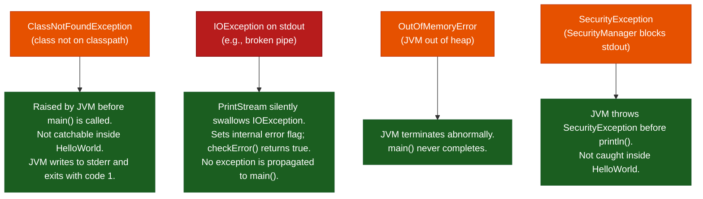

| Error / Exception          | Origin               | Handling Inside `HelloWorld` | Observable Behaviour                        |
|----------------------------|----------------------|------------------------------|---------------------------------------------|
| `ClassNotFoundException`   | JVM ClassLoader      | Not catchable                | stderr error message; exit code 1            |
| `IOException` on stdout    | OS / `PrintStream`   | Silently suppressed by JDK   | No output; `System.out.checkError()` → true  |
| `OutOfMemoryError`         | JVM heap exhaustion  | Not caught                   | JVM crash with error message                 |
| `SecurityException`        | `SecurityManager`    | Not caught                   | Exception stack trace on stderr              |
| Unexpected `args` content  | Caller               | Silently ignored             | No impact on output whatsoever               |

### 8.4 Internationalisation (i18n) and Localisation (l10n)

| Aspect              | Status                                                                                                    |
|---------------------|-----------------------------------------------------------------------------------------------------------|
| Output string       | Hard-coded ASCII compile-time constant — `"Hello World"`. No i18n.                                        |
| Resource bundles    | None (`java.util.ResourceBundle` not used).                                                               |
| Locale sensitivity  | None. `PrintStream` uses the platform default charset, but the output is ASCII-safe on all charsets.      |
| Timezone            | Not applicable.                                                                                           |
| Future path         | To support i18n, replace the string literal with `ResourceBundle.getBundle("messages").getString("greeting")`. |

### 8.5 Security Concept

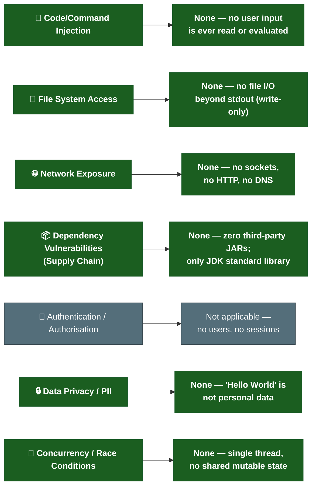

**Overall security assessment**: The attack surface is **zero**. There are no inputs to exploit, no persistent state to corrupt, no network endpoints to attack, and no sensitive data to exfiltrate.

### 8.6 Concurrency and Threading Model

| Aspect              | Detail                                                                                          |
|---------------------|-------------------------------------------------------------------------------------------------|
| Threads created     | Zero — only the JVM's main thread is used.                                                      |
| Thread safety       | Not applicable — no shared mutable state exists.                                                |
| Synchronisation     | None required.                                                                                  |
| Parallel execution  | Not applicable.                                                                                 |
| `System.out` thread safety | `PrintStream` is internally synchronised; irrelevant here as only one thread calls it. |

### 8.7 Design Patterns Applied

| Pattern            | Location               | Description                                                                                              |
|--------------------|------------------------|----------------------------------------------------------------------------------------------------------|
| **Entry Point**    | `HelloWorld.main()`    | Standard Java application entry-point pattern — `public static void main(String[] args)`.                |
| **Null Object** *(implicit)* | `args` parameter | The `args` array is accepted but never dereferenced, making its value irrelevant (a natural null-safe design). |

No GoF, enterprise integration, or structural patterns are applied — all would be disproportionate for this scale.

---

## 9. Architecture Decisions

The Architecture Decision Records (ADRs) below document all significant technical choices made in this project, following the lightweight [ADR format](https://adr.github.io/).

### ADR-001 — Use Java as the Implementation Language

| Field                    | Value                                                                                                      |
|--------------------------|------------------------------------------------------------------------------------------------------------|
| **Status**               | ✅ Accepted                                                                                                |
| **Date**                 | Project inception                                                                                          |
| **Deciders**             | `ktruchcz` (repository owner)                                                                              |
| **Context**              | A minimal demonstration program is needed as a Copilot test baseline. Language choice determines the entire toolchain. |
| **Decision**             | Implement in **Java**.                                                                                     |
| **Rationale**            | Java is widely adopted in enterprise contexts; the JVM delivers write-once-run-anywhere portability; `javac` and `java` are freely available on all major platforms and CI systems. |
| **Consequences (+)**     | Maximum portability via JVM bytecode. Familiar to the broadest audience. Excellent tooling support (Copilot, IDEs, analysers). |
| **Consequences (−)**     | Requires a JRE on every target machine. Cold JVM startup adds 50–200 ms overhead. Produces `.class` bytecode rather than a native binary. |
| **Alternatives rejected**| **Python** (no compile step, but interpreted — reduces analysability for static tools). **C** (native binary, no JVM dependency, but platform-specific). **Kotlin** (more modern but heavier compiler chain for a trivial program). |

---

### ADR-002 — No Build Tool (Raw `javac`)

| Field                    | Value                                                                                                      |
|--------------------------|------------------------------------------------------------------------------------------------------------|
| **Status**               | ✅ Accepted                                                                                                |
| **Date**                 | Project inception                                                                                          |
| **Context**              | Single-file project with zero dependencies. A build tool requires a descriptor file (e.g., `pom.xml`) and network access to download plugins. |
| **Decision**             | Compile directly with `javac HelloWorld.java`. No Maven, Gradle, Ant, or Bazel.                            |
| **Rationale**            | A build tool adds zero value for a single-class, zero-dependency project. Its introduction would increase repository complexity disproportionately. |
| **Consequences (+)**     | No configuration files. No network access required. No version pinning of build plugins. Reproducible with any JDK. |
| **Consequences (−)**     | Classpath management, dependency resolution, and JAR packaging must be added manually if the project grows. |
| **Alternatives rejected**| **Maven** (standard but requires `pom.xml` and internet access). **Gradle** (flexible but adds Gradle wrapper scripts). **Ant** (verbose XML; legacy). |

---

### ADR-003 — No External Dependencies

| Field                    | Value                                                                                                      |
|--------------------------|------------------------------------------------------------------------------------------------------------|
| **Status**               | ✅ Accepted                                                                                                |
| **Date**                 | Project inception                                                                                          |
| **Context**              | The full requirement is a single `System.out.println` call, which is part of every JRE ever released.     |
| **Decision**             | Use only `java.lang.System` and `java.io.PrintStream` from the JDK standard library. Zero external JARs.  |
| **Rationale**            | Zero external dependencies means zero supply-chain risk, zero CVEs from third-party libraries, zero version conflicts, and zero download requirements. |
| **Consequences (+)**     | Zero security surface from dependencies. Fully offline operation. No `LICENSES` file needed for transitive deps. |
| **Consequences (−)**     | If requirements expand (structured logging, HTTP, JSON), a build tool and dependency framework must be introduced. |
| **Alternatives rejected**| **SLF4J + Logback** (overkill for stdout). **Apache Commons Lang** (no utility functions needed). **Guava** (no collections or utilities needed). |

---

### ADR-004 — No Unit Tests

| Field                    | Value                                                                                                      |
|--------------------------|------------------------------------------------------------------------------------------------------------|
| **Status**               | ✅ Accepted (with documented risk awareness)                                                               |
| **Date**                 | Project inception                                                                                          |
| **Context**              | The sole observable behaviour is one `println` statement. Testing it requires capturing stdout — infrastructure more complex than the code under test. |
| **Decision**             | No test framework (JUnit 5, TestNG, Spock) is included.                                                    |
| **Rationale**            | The cost/benefit ratio of writing a test is unfavourable. The probability of `System.out.println("Hello World")` producing incorrect output due to a code regression is effectively zero. |
| **Consequences (+)**     | No test framework dependency. No test source directory. No test runner configuration.                      |
| **Consequences (−)**     | No automated regression safety net. Any future code modification is unguarded. Sets a bad precedent if the project grows. |
| **Alternatives rejected**| **JUnit 5 + system-lambda** (captures stdout but adds complexity). **Manual shell test** (`java HelloWorld | grep "Hello World"`). |

---

### ADR-005 — Hard-Coded Output String

| Field                    | Value                                                                                                      |
|--------------------------|------------------------------------------------------------------------------------------------------------|
| **Status**               | ✅ Accepted                                                                                                |
| **Date**                 | Project inception                                                                                          |
| **Context**              | The output is fixed by convention. The Hello World pattern requires the exact string `"Hello World"`.      |
| **Decision**             | Embed the string directly as a literal in the `println` call: `System.out.println("Hello World")`.         |
| **Rationale**            | The string is immutable by intent. Externalising it to a constant, properties file, or environment variable would add indirection with no architectural benefit. |
| **Consequences (+)**     | Maximum readability. Minimal cognitive overhead.                                                           |
| **Consequences (−)**     | Changing the message requires recompilation. Not suitable if parameterised output is ever needed.          |
| **Alternatives rejected**| `private static final String MSG = "Hello World"` (marginally cleaner but unnecessary). `.properties` file (adds I/O and `ResourceBundle` boilerplate). `args[0]` (changes the contract). |

---

## 10. Quality Requirements

### 10.1 Quality Tree

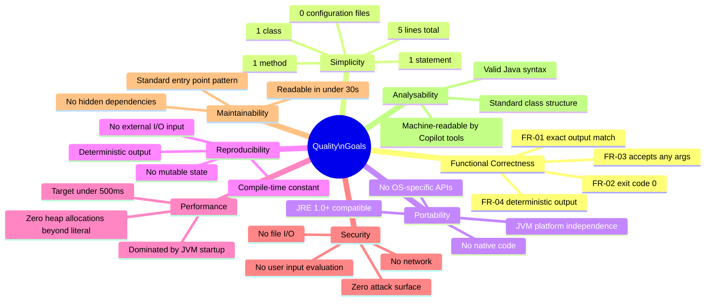

### 10.2 Quality Scenarios

| ID    | Quality Attribute      | Stimulus                                                        | Expected System Response                                    | Measurable Acceptance Criterion                      |
|-------|------------------------|-----------------------------------------------------------------|-------------------------------------------------------------|------------------------------------------------------|
| QS-01 | **Functional Correctness** | `java HelloWorld` executed on any platform                 | Exactly `Hello World` followed by a newline written to stdout | stdout content == `"Hello World\n"` — 100% of runs   |
| QS-02 | **Portability**        | App executed on Linux (x86-64), macOS (ARM64), Windows (x86-64) with JRE ≥ 8 | Identical stdout output on all platforms            | Pass on all 3 OS families and CPU architectures       |
| QS-03 | **Performance**        | Cold JVM start on a modern workstation (≥ 2 GHz, ≥ 4 GB RAM) | Output visible to user within 500 ms of command execution   | Wall-clock time ≤ 500 ms (dominated by JVM bootstrap) |
| QS-04 | **Reproducibility**    | `java HelloWorld` executed 10,000 times consecutively          | Every invocation produces identical stdout bytes            | 0 deviations across 10,000 runs                      |
| QS-05 | **Understandability**  | A Java developer opens `HelloWorld.java` for the first time    | Developer understands the complete behaviour immediately     | Comprehension time ≤ 30 seconds                      |
| QS-06 | **Robustness**         | `java HelloWorld foo bar baz` with arbitrary arguments         | Output unchanged; no exception thrown; exit code 0          | Output == `"Hello World\n"`, exit code == 0          |
| QS-07 | **Analysability**      | GitHub Copilot or static analysis tool processes the repository | Valid AST parsed; all constructs resolved; documentation generated | 0 parse errors; complete Arc42 document generated  |
| QS-08 | **Minimal Footprint**  | Developer inspects the repository                              | No generated artifacts, no config files, no dependencies committed | File count == 2 (`.java` + `README.md`); no JARs   |

### 10.3 Code Metrics

| Metric                          | Value                          | Assessment          |
|---------------------------------|--------------------------------|---------------------|
| Lines of Code — total (LOC)     | 5                              | ✅ Minimal          |
| Lines of Code — executable      | 1                              | ✅ Minimal          |
| Lines of Code — blank           | 0                              | —                   |
| Lines of Code — comment         | 0                              | ⚠️ No Javadoc       |
| Number of classes               | 1                              | ✅ Minimal          |
| Number of methods               | 1                              | ✅ Minimal          |
| Number of fields                | 0                              | ✅ Stateless        |
| Number of statements            | 1                              | ✅ Minimal          |
| Cyclomatic complexity (McCabe)  | 1 (no branches, no loops)      | ✅ Lowest possible  |
| Cognitive complexity            | 0                              | ✅ Perfect          |
| External dependencies           | 0                              | ✅ None             |
| Test coverage (line)            | 0% (no tests exist)            | ❌ No tests         |
| Technical debt (SQALE estimate) | < 5 minutes                    | ✅ Negligible       |
| Maintainability index           | 100 / 100                      | ✅ Perfect          |
| Source file size                | ~103 bytes                     | ✅ Negligible       |
| Compiled bytecode size          | ~426 bytes                     | ✅ Negligible       |

---

## 11. Risks and Technical Debts

### 11.1 Risk Register — Overview Matrix

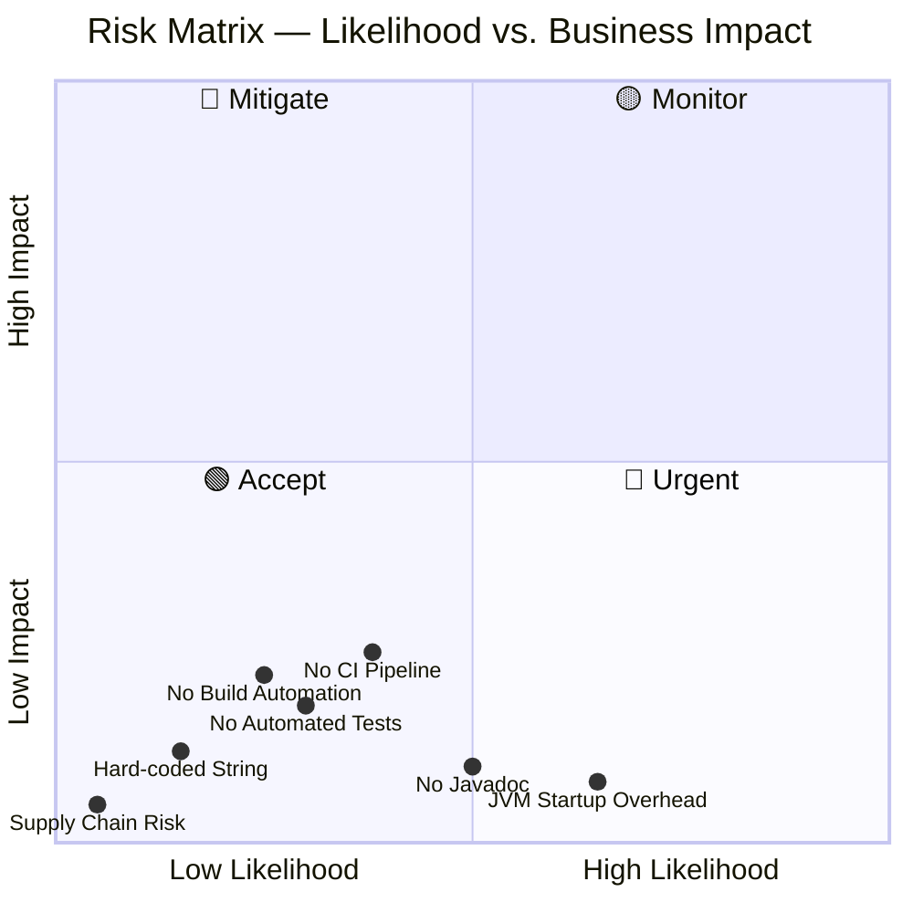

### 11.2 Identified Risks

| ID   | Risk Description                                                                                              | Likelihood | Impact     | Category        | Recommended Mitigation                                                         |
|------|---------------------------------------------------------------------------------------------------------------|------------|------------|-----------------|--------------------------------------------------------------------------------|
| R-01 | **No automated tests** — Regressions cannot be detected automatically if the code is modified.                | Low        | Low        | Quality         | Add a JUnit 5 test with `System.setOut()` / `system-lambda` stdout capture if the project evolves. |
| R-02 | **No build automation** — Manual `javac` is error-prone; wrong working directory causes `ClassNotFoundException`. | Medium  | Low        | Operations      | Introduce a minimal `Makefile` or Maven `pom.xml` when the project grows beyond one file. |
| R-03 | **No CI/CD pipeline** — Code changes receive zero automated verification. Any commit could silently break compilation. | Medium | Low      | Process         | Add `.github/workflows/build.yml` with `actions/setup-java` + `javac` + `java` steps. |
| R-04 | **Hard-coded output string** — `"Hello World"` is embedded as a literal; any change requires recompilation.  | Low        | Low        | Maintainability | Externalise to `private static final String MESSAGE` or a `messages.properties` resource bundle. |
| R-05 | **JVM startup latency** — Cold JVM startup adds 50–300 ms overhead on modern JDKs.                           | High       | Negligible | Performance     | Acceptable for a demo. For sub-millisecond startup, use GraalVM `native-image`. |
| R-06 | **No Javadoc** — The `main()` method has no documentation comment.                                           | Medium     | Low        | Maintainability | Add a `/** ... */` Javadoc comment explaining the entry point behaviour.        |
| R-07 | **Public default package** — `HelloWorld` is in the unnamed default package, which cannot be imported by other classes. | Low | Very Low | Architecture   | Move to a named package (e.g., `com.ktruchcz.hello`) if reuse is ever needed.  |
| R-08 | **Ignored `args` parameter** — Silent argument ignoring can surprise users who expect parameterisable behaviour. | Low | Very Low | Usability    | Add a `// args intentionally ignored` comment or log a warning if args are provided. |

### 11.3 Technical Debt Backlog

| ID    | Debt Item                                                                      | Effort   | Business Value | Priority   |
|-------|--------------------------------------------------------------------------------|----------|----------------|------------|
| TD-01 | Add JUnit 5 unit test capturing stdout output                                  | 30 min   | Low            | ⬇️ Low     |
| TD-02 | Introduce `pom.xml` (Maven) or `build.gradle` (Gradle) for reproducible builds | 15 min   | Medium         | ⬇️ Low     |
| TD-03 | Create `.github/workflows/build.yml` GitHub Actions CI pipeline               | 20 min   | High           | ➡️ Medium  |
| TD-04 | Add Javadoc comment to `main()` describing entry-point behaviour               | 5 min    | Low            | ⬇️ Low     |
| TD-05 | Externalise `"Hello World"` to a named constant `private static final String MESSAGE` | 5 min | Low        | ⬇️ Low     |
| TD-06 | Move `HelloWorld` to a named package (`com.ktruchcz.hello`)                    | 10 min   | Very Low       | ⬇️ Low     |
| TD-07 | Add `.gitignore` to exclude `*.class` files from the repository                | 2 min    | Low            | ⬇️ Low     |

### 11.4 Technical Debt Remediation Roadmap

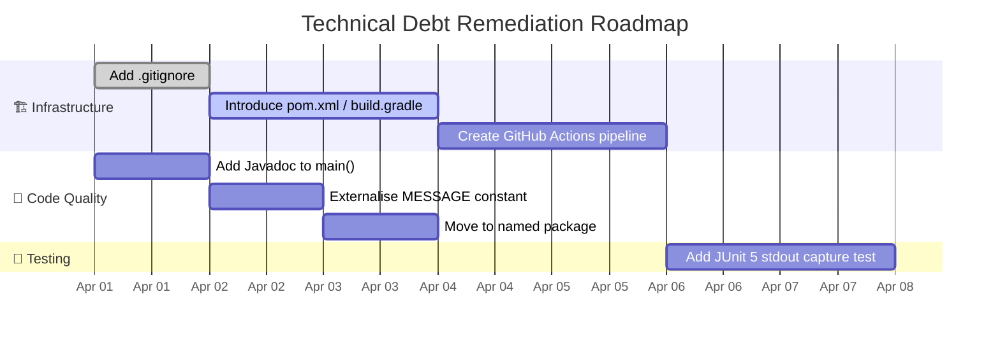

### 11.5 Technical Debt Summary

```mermaid
pie title Technical Debt by Category
    "Testing" : 30
    "Build & CI" : 35
    "Code Quality" : 25
    "Architecture" : 10
```

---

## 12. Glossary

| Term                        | Definition                                                                                                                                              |
|-----------------------------|---------------------------------------------------------------------------------------------------------------------------------------------------------|
| **Arc42**                   | A pragmatic, open-source template for documenting software architectures, structured into 12 standardised sections. See [arc42.org](https://arc42.org). |
| **ADR**                     | Architecture Decision Record — a short document capturing a significant architectural decision, its context, rationale, and consequences.               |
| **Bytecode**                | Platform-independent binary instructions produced by `javac` from Java source code, stored in `.class` files, and executed by the JVM.                  |
| **CI/CD**                   | Continuous Integration / Continuous Delivery — automated pipelines that build, test, and optionally deploy code on every commit.                         |
| **Classpath**               | A JVM parameter (`-cp` / `-classpath`) specifying directories and JAR files where the classloader searches for compiled `.class` files.                 |
| **CLI**                     | Command-Line Interface — a text-based user interface where commands are typed in a terminal or shell.                                                   |
| **Compile-time constant**   | A value fully determined at compilation time (e.g., a `String` literal or `static final` primitive), embedded directly in bytecode.                    |
| **Entry Point**             | In Java, the unique method `public static void main(String[] args)` that the JVM invokes to start a program.                                            |
| **Exit Code**               | An integer returned by a process to the OS on termination. `0` = success; any non-zero value = failure (by Unix convention).                            |
| **fd 1**                    | File descriptor 1 — the standard output stream in POSIX-compliant operating systems; the target of `System.out`.                                        |
| **GraalVM**                 | A polyglot JDK distribution that supports ahead-of-time (AOT) compilation of Java applications into standalone native binaries via `native-image`.      |
| **Hello World**             | The canonical minimal program in any language, universally used to verify a working development/runtime environment.                                    |
| **JAR**                     | Java ARchive — a ZIP-format package bundling compiled `.class` files, resources, and metadata for distribution and deployment.                          |
| **Java**                    | A general-purpose, statically-typed, object-oriented programming language designed for platform independence via the JVM (James Gosling, Sun, 1995).    |
| **`java.io.PrintStream`**   | A JDK class extending `FilterOutputStream` that provides `print` and `println` convenience methods. `System.out` and `System.err` are instances.       |
| **`java.lang`**             | The foundational Java package, auto-imported in every compilation unit. Contains `Object`, `String`, `System`, `Math`, `Thread`, and others.           |
| **`javac`**                 | The Java compiler bundled in the JDK. Translates `.java` source files into `.class` JVM bytecode files.                                                 |
| **JDK**                     | Java Development Kit — a superset of the JRE that additionally includes the compiler (`javac`), documentation generator (`javadoc`), and other tools.  |
| **JRE**                     | Java Runtime Environment — the minimum installation required to execute compiled Java applications; includes the JVM and the JDK class libraries.        |
| **JUnit 5**                 | The current major version of the dominant Java unit-testing framework (also known as JUnit Jupiter).                                                    |
| **JVM**                     | Java Virtual Machine — the runtime engine that loads, verifies, JIT-compiles, and executes JVM bytecode. Abstracts the underlying hardware and OS.     |
| **line.separator**          | The platform-specific newline sequence: `\n` (LF) on Unix/macOS; `\r\n` (CRLF) on Windows. Used by `PrintStream.println()`.                           |
| **Native image**            | A standalone executable produced by GraalVM's AOT compiler from JVM bytecode; has no JVM startup overhead.                                             |
| **`println`**               | Short for "print line". A `PrintStream` method that writes a string followed by `System.lineSeparator()` to the underlying output stream.              |
| **`public static void main`** | The canonical Java entry-point signature. `public` — accessible by the JVM classloader. `static` — no instance needed. `void` — no return value.  |
| **SQALE**                   | Software Quality Assessment based on Lifecycle Expectations — a model for quantifying technical debt in code quality tools (e.g., SonarQube).          |
| **stdout**                  | Standard Output — the default output stream for a process (file descriptor 1 in POSIX). `System.out` in Java is connected to this stream.             |
| **`System.out`**            | The static `public final PrintStream` field in `java.lang.System` connected to the process's standard output stream.                                   |
| **Unnamed / default package** | In Java, a class without a `package` declaration belongs to the unnamed default package. It cannot be imported by classes in named packages.         |
| **UTF-8**                   | A variable-width Unicode encoding that is backward-compatible with ASCII. The de-facto standard encoding for modern JDK versions.                      |

---

*Documentation generated by the Arc42 Documentation Generator.*
*Source analysis of `HelloWorld.java` and `README.md` in repository `copilot-test-ktruchcz` (owner: `ktruchcz`).*
*Generation date: 2026-03-30.*
