# Architecture Documentation (Arc42)

**Project**: copilot-test-ktruchcz — Hello World  
**Version**: 1.1.0  
**Date**: 2025-07-14  
**Generated by**: Arc42 Documentation Generator  
**Note**: Updated to reflect Java 25 modernization — Maven build, JUnit 5 tests, CI pipeline, Records, sealed interfaces, and pattern matching.

---

## Table of Contents

1. [Introduction and Goals](#1-introduction-and-goals)
2. [Architecture Constraints](#2-architecture-constraints)
3. [System Scope and Context](#3-system-scope-and-context)
4. [Solution Strategy](#4-solution-strategy)
5. [Building Block View](#5-building-block-view)
6. [Runtime View](#6-runtime-view)
7. [Deployment View](#7-deployment-view)
8. [Cross-cutting Concepts](#8-cross-cutting-concepts)
9. [Architecture Decisions](#9-architecture-decisions)
10. [Quality Requirements](#10-quality-requirements)
11. [Risks and Technical Debts](#11-risks-and-technical-debts)
12. [Glossary](#12-glossary)

---

## 1. Introduction and Goals

### 1.1 Requirements Overview

`copilot-test-ktruchcz` is a minimal Java console application whose sole purpose is to print the text **"Hello World"** to the standard output stream when executed. It serves as a canonical starting point for verifying that a Java development and runtime environment is correctly configured, and as a baseline repository for tooling experiments (e.g., GitHub Copilot).

**Core functional requirement:**

| ID  | Requirement | Priority |
|-----|-------------|----------|
| FR-01 | The system SHALL print the string `Hello World` followed by a newline to stdout when invoked. | Must-have |

### 1.2 Quality Goals

The following top-level quality goals drive the architectural decisions of this system:

| Priority | Quality Goal | Motivation |
|----------|-------------|------------|
| 1 | **Simplicity** | The application must be understandable at a glance — a single class, a single method. |
| 2 | **Portability** | The application must run on any platform with a compatible JRE, with zero platform-specific code. |
| 3 | **Reproducibility** | Given the same JDK version, every build and run must produce identical output. |
| 4 | **Minimal Footprint** | No external libraries, no build scripts, no configuration files. |

### 1.3 Stakeholders

| Role | Name / Group | Expectations |
|------|-------------|--------------|
| Developer | Repository owner (`ktruchcz`) | A working Java environment baseline; a sandbox for Copilot experiments. |
| CI / Tooling System | GitHub Actions / Copilot | A valid compilable Java source file to analyse and document. |
| Evaluator / Reviewer | Any technical reviewer | A clear, self-explanatory example of a minimal Java program. |

---

## 2. Architecture Constraints

### 2.1 Technical Constraints

| ID | Constraint | Rationale |
|----|-----------|-----------|
| TC-01 | **Language: Java** | The source file is written in Java (`HelloWorld.java`). All tooling must support Java source analysis. |
| TC-02 | **Maven build tool** | The project uses `pom.xml` (Maven 3.x) for compilation, testing, and dependency management. Compilation is performed via `mvn compile`; tests via `mvn test`. |
| TC-03 | **Minimal external dependencies** | Only JUnit Jupiter (test scope) is declared as an external dependency. All production code relies solely on `java.lang`, `java.time`, and `java.io` from the JDK standard library. |
| TC-04 | **JDK 25** | The project targets Java 25 (`maven.compiler.release=25`). Features used include Records (16+), text blocks (15+), `var` (10+), switch expressions (14+), sealed interfaces and pattern matching (21+). |
| TC-05 | **Standard Maven layout** | Sources reside in `src/main/java/HelloWorld.java`; tests in `src/test/java/HelloWorldTest.java`. A root-level `HelloWorld.java` is retained for standalone reference. |
| TC-06 | **Console / CLI only** | No GUI, no web interface, no network socket — output is exclusively to `stdout`. |

### 2.2 Organizational Constraints

| ID | Constraint | Rationale |
|----|-----------|-----------|
| OC-01 | **Public GitHub repository** | Code is version-controlled on GitHub and is publicly visible. |
| OC-02 | **JUnit 5 test suite** | Unit tests exist in `src/test/java/HelloWorldTest.java`. They cover the `Greeting` record, `TimeOfDay` sealed hierarchy, and `seasonOf()` method. |
| OC-03 | **GitHub Actions CI pipeline** | A `.github/workflows/build.yml` workflow runs `mvn -B test` on every push and pull request using `eclipse-temurin` JDK 25. |

### 2.3 Conventions

| Convention | Details |
|-----------|---------|
| Naming | Class name `HelloWorld` matches file name `HelloWorld.java` (required by Java specification). |
| Encoding | UTF-8 source encoding (default for modern JDKs). |
| Entry point | Standard Java entry point signature: `public static void main(String[] args)`. |

---

## 3. System Scope and Context

### 3.1 Business Context

The Hello World application sits entirely within the boundary of a single JVM process. It receives no external input and produces a single line of text on the standard output. The diagram below shows the system boundary and its interactions with the external environment.

### 3.2 Technical Context

The following diagram shows the technical infrastructure context — the toolchain required to compile and execute the application.

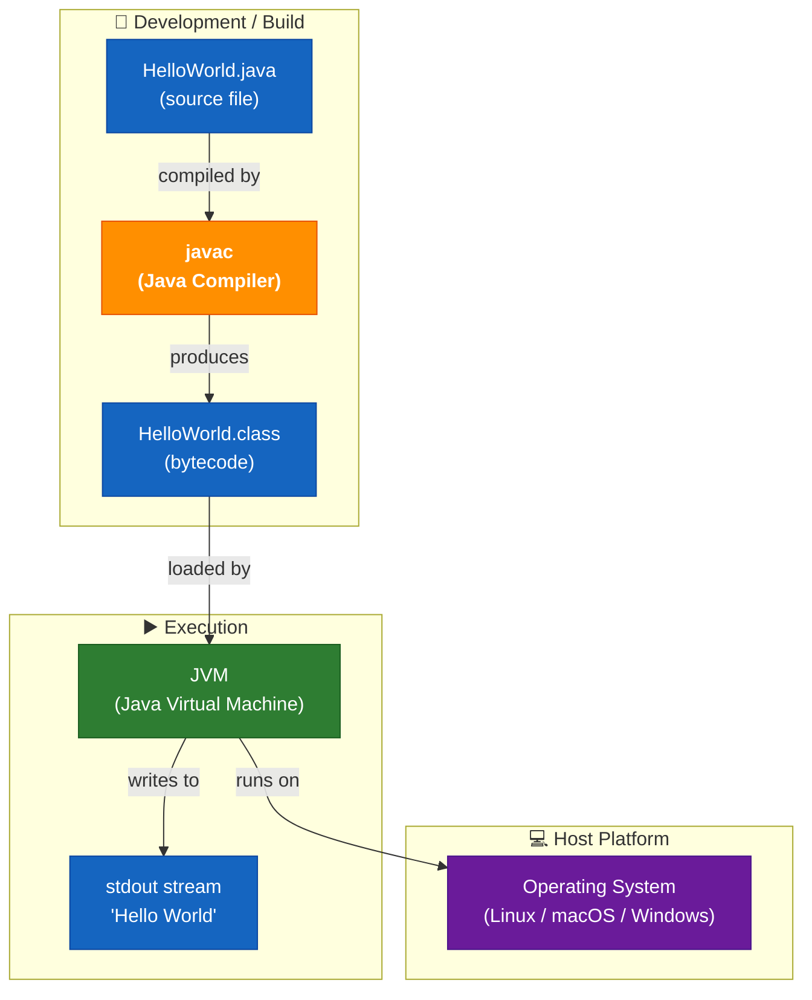

### 3.3 External Interfaces

| Interface | Direction | Protocol / Mechanism | Description |
|-----------|-----------|----------------------|-------------|
| CLI invocation | Input | OS process spawn (`java HelloWorld`) | Starts the JVM and passes control to `main()`. |
| Standard Output | Output | `java.io.PrintStream` (`System.out`) | Delivers the string `Hello World\n` to the calling terminal. |
| Exit code | Output | OS process exit code (`0`) | Implicit successful termination after `main()` returns. |

---

## 4. Solution Strategy

### 4.1 Technology Decisions

| Decision | Choice | Rationale |
|---------|--------|-----------|
| **Programming Language** | Java 25 | Widely known, platform-independent via JVM. Java 25 LTS provides modern language features (Records, sealed interfaces, pattern matching, text blocks, `var`) that improve expressiveness and maintainability. |
| **Build tool** | Maven 3.x (`pom.xml`) | Standardised build, dependency management, and test execution via `mvn test`. |
| **Test framework** | JUnit Jupiter 5.11 | De-facto Java testing standard; native support in Maven Surefire 3.x. |
| **No UI framework** | Plain `java.lang` + `java.time` | The requirement is fulfilled by console output; a framework would be disproportionate overhead. |
| **No runtime dependencies** | Zero production JARs | `System.out`, `LocalDate`, and `Month` are part of the Java standard library; zero supply-chain risk. |

### 4.2 Top-Level Decomposition Strategy

The application uses a **single outer class** (`HelloWorld`) with two nested type declarations and two static methods:

- **`HelloWorld`** — entry point; orchestrates time-of-day resolution, greeting construction, and output.
- **`Greeting` (record)** — immutable value object holding `recipient` and `message`; provides a formatted text-block output.
- **`TimeOfDay` (sealed interface)** — models three time-of-day variants (`Morning`, `Afternoon`, `Evening`) as nested records; provides a factory method.
- **`main(String[])`** — JVM entry point; composes all elements and prints to stdout.
- **`seasonOf(Month)`** — pure helper; maps a `java.time.Month` to a season string via a switch expression.

### 4.3 Approach to Quality Goals

| Quality Goal | Strategy |
|-------------|---------|
| Simplicity | Idiomatic Java 25 — Records, sealed interfaces, text blocks, and switch expressions make intent explicit with minimal boilerplate. |
| Portability | Standard `java.lang` and `java.time` only (production code); runs anywhere with JRE 25. |
| Reproducibility | No mutable state; only `LocalDate.now()` varies per invocation (by design). |
| Minimal Footprint | Zero production dependencies; one test-scoped dependency (JUnit Jupiter). |

---

## 5. Building Block View

### 5.1 Level 1 — System Whitebox

The entire system is a single deployable unit: one compiled Java class.

**Contained Building Blocks:**

| Block | Responsibility | Source |
|-------|---------------|--------|
| `HelloWorld` | Application entry point; resolves time of day, builds greeting, and prints to stdout. | `HelloWorld.java` |
| `HelloWorld.Greeting` | Immutable value record; validates recipient/message, renders formatted text-block output. | `HelloWorld.java` (nested record) |
| `HelloWorld.TimeOfDay` | Sealed interface hierarchy; models Morning/Afternoon/Evening variants; factory maps hour → variant. | `HelloWorld.java` (sealed interface) |
| `System.out` *(external)* | JDK-provided `PrintStream`; handles byte encoding and OS-level write. | `java.lang.System` (JDK) |

### 5.2 Level 2 — HelloWorld Class Whitebox

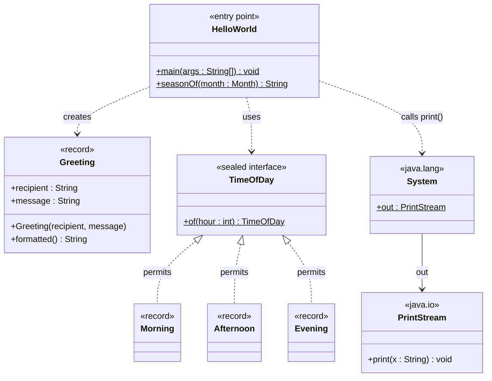

**Method inventory:**

| Class | Method | Modifier | Description |
|-------|--------|----------|-------------|
| `HelloWorld` | `main(String[] args)` | `public static` | JVM entry point. Resolves time of day, builds a `Greeting`, and prints formatted output to stdout. |
| `HelloWorld` | `seasonOf(Month)` | `static` | Pure helper; maps a `java.time.Month` to a season string using a switch expression. |
| `Greeting` | `Greeting(String, String)` | (compact constructor) | Validates recipient and message are non-blank; throws `IllegalArgumentException` otherwise. |
| `Greeting` | `formatted()` | (instance) | Returns a text-block formatted greeting box containing message and recipient. |
| `TimeOfDay` | `of(int hour)` | `static` | Factory; maps an hour (0–23) to `Morning`, `Afternoon`, or `Evening` via a guarded switch. |

### 5.3 Level 3 — Statement-Level Detail

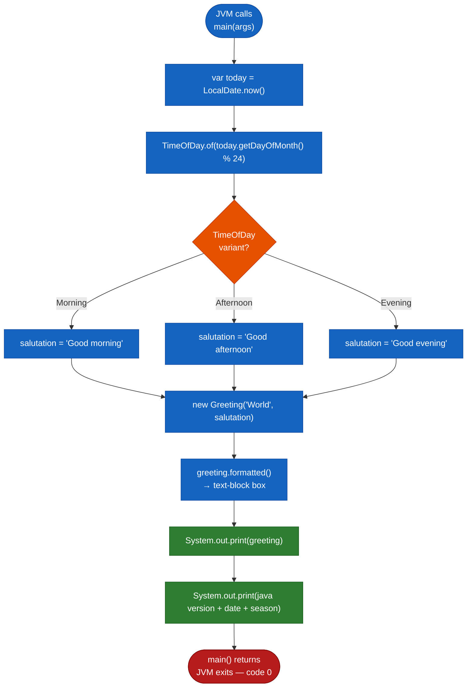

---

## 6. Runtime View

### 6.1 Scenario 1 — Normal Execution

The primary (and only) runtime scenario: a user invokes the application from the command line.

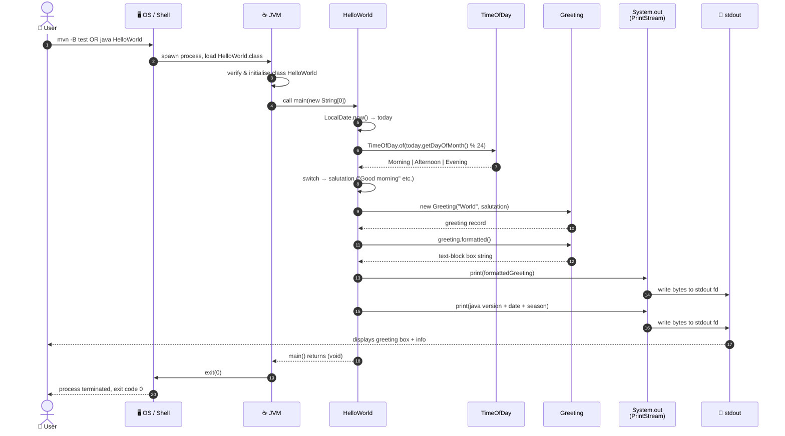

### 6.2 Scenario 2 — Execution with Command-Line Arguments

The `main` method accepts `String[] args`, but the current implementation ignores them entirely. Passing arguments has no effect on the output.

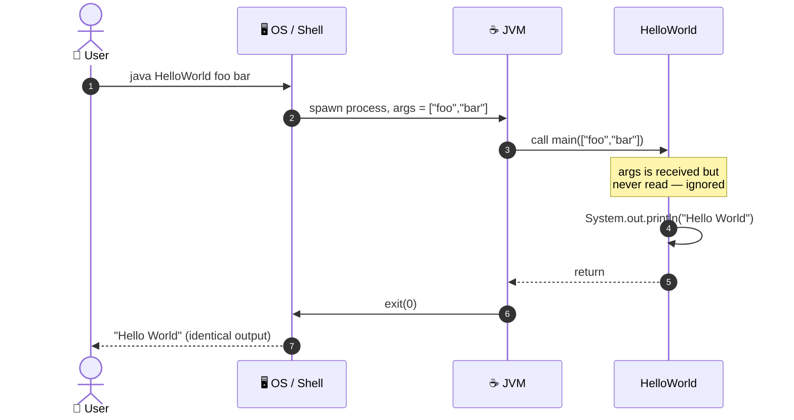

### 6.3 Scenario 3 — Class Not Found (Error Path)

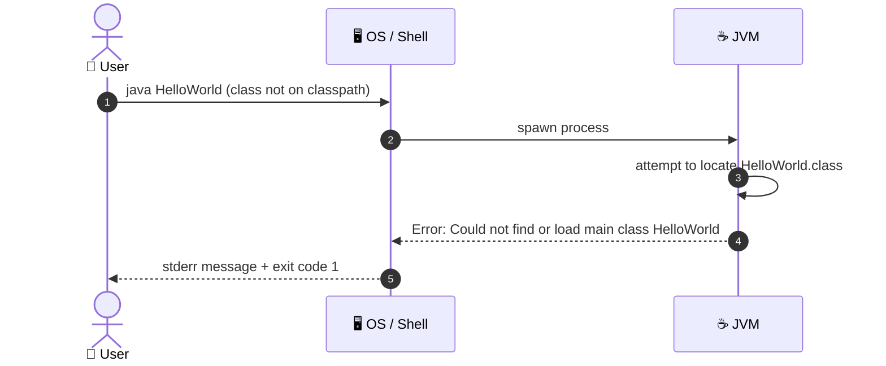

### 6.4 State Machine — Application Lifecycle

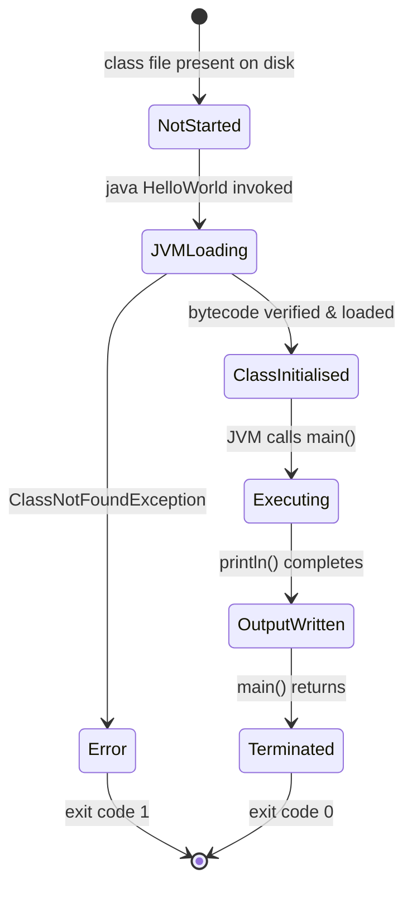

---

## 7. Deployment View

### 7.1 Infrastructure Overview

Because the application is a single compiled class with zero external dependencies, the deployment topology is the simplest possible: a host machine with a JRE installed.

### 7.2 Compilation Step

The project uses Maven for compilation and testing. There is no pre-built artifact committed to the repository.

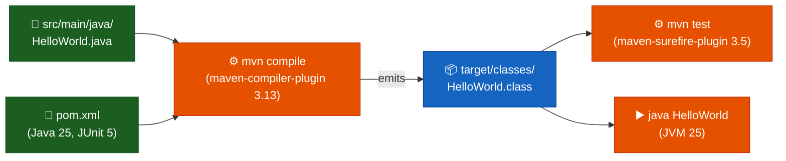

### 7.3 Deployment Variants

| Variant | Description | Command Sequence |
|---------|-------------|-----------------|
| **Local (developer)** | Compile, test, and run on developer workstation using Maven. | `mvn clean test` → `mvn exec:java` or `java -cp target/classes HelloWorld` |
| **CI runner (GitHub Actions)** | `eclipse-temurin:25` via `actions/setup-java@v4`; Maven runs full test suite. | `mvn -B --no-transfer-progress test` (see `.github/workflows/build.yml`) |
| **Docker container** | Any image based on `eclipse-temurin:25-jdk`. | `COPY . /app/` → `RUN mvn -B package` → `CMD ["java","-cp","target/classes","HelloWorld"]` |

### 7.4 Minimum System Requirements

| Requirement | Value |
|------------|-------|
| Java Runtime | JDK 25 (required to compile and run; `eclipse-temurin` distribution recommended) |
| Build Tool | Apache Maven 3.x |
| Disk space (source) | < 10 KB |
| Disk space (compiled) | < 5 KB (`target/classes/`) |
| RAM | ≥ JVM base overhead (~50–100 MB with JDK 25) |
| CPU | Any architecture with a compatible JVM |
| Network | None (runtime); Maven Central access needed for initial dependency download |
| Database | None |

---

## 8. Cross-cutting Concepts

### 8.1 Domain Model

The application's domain is deliberately trivial. The conceptual model contains a single entity.

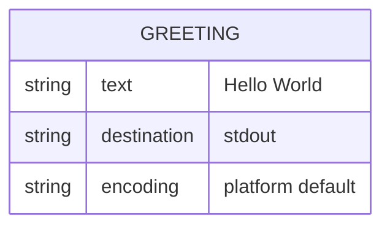

### 8.2 Output / Logging Concept

| Aspect | Decision |
|--------|---------|
| **Output channel** | `System.out` (`stdout`, file descriptor 1) |
| **Output format** | Plain text, terminated by the platform line separator (`\n` on Unix, `\r\n` on Windows via `println`). |
| **Logging framework** | None — no SLF4J, Log4j, or `java.util.logging` is used. |
| **Structured logging** | Not applicable. |
| **Log levels** | Not applicable. |

### 8.3 Error Handling Concept

| Error Type | Handling Strategy |
|-----------|-----------------|
| `ClassNotFoundException` | Raised by the JVM before `main()` is entered; not catchable inside the application. |
| `IOException` on stdout | Silently swallowed by `PrintStream` (it sets an internal error flag, accessible via `checkError()`); no exception propagates. |
| Unexpected `args` content | Ignored — `args` is never read. |

### 8.4 Internationalisation (i18n)

The output string `"Hello World"` is a compile-time constant in ASCII. There is no internationalisation or localisation mechanism. The string is not externalised to a resource bundle.

### 8.5 Security Concept

| Threat Vector | Exposure | Notes |
|--------------|---------|-------|
| Code injection | None | No user input is read or evaluated. |
| File system access | None | No file I/O beyond stdout. |
| Network exposure | None | No sockets or network calls. |
| Dependency vulnerabilities | None | Zero third-party dependencies. |

### 8.6 Design Patterns Applied

| Pattern | Location | Description |
|---------|---------|-------------|
| **Entry Point** | `HelloWorld.main()` | Standard Java application entry point pattern — `public static void main(String[] args)`. |

No additional design patterns (GoF, enterprise, etc.) are applicable at this scale.

---

## 9. Architecture Decisions

### ADR-001 — Use Java as the Implementation Language

| Field | Value |
|-------|-------|
| **Status** | Accepted |
| **Date** | Project inception |
| **Context** | A minimal demonstration program is needed. |
| **Decision** | Implement in Java. |
| **Rationale** | Java is a widely adopted, platform-independent language. The JVM provides write-once-run-anywhere portability. Standard tooling (`javac`, `java`) is freely available on all major platforms. |
| **Consequences** | Requires a JRE on every target machine. Produces `.class` bytecode rather than a native binary. |
| **Alternatives considered** | Python (no compilation step needed), C (native binary, no JVM dependency). Both rejected in favour of Java's ubiquity in enterprise contexts. |

---

### ADR-002 — Introduce Maven as Build Tool (supersedes original "No Build Tool" decision)

| Field | Value |
|-------|-------|
| **Status** | Accepted (supersedes original "no build tool" decision) |
| **Date** | Java 25 modernization |
| **Context** | Project grew beyond a single standalone class; JUnit 5 tests and structured Maven layout were introduced. |
| **Decision** | Use Apache Maven 3.x with `pom.xml` for compilation (`maven-compiler-plugin 3.13`, `release=25`), test execution (`maven-surefire-plugin 3.5`), and dependency management. |
| **Rationale** | Maven provides reproducible builds, standardised test lifecycle, and CI integration with a single `mvn -B test` command. The overhead of `pom.xml` is justified by the presence of external test dependencies and a multi-file project structure. |
| **Consequences** | JDK 25 and Maven 3.x are required on all developer machines and CI runners. `mvn test` replaces bare `javac` / `java` invocations. |
| **Alternatives considered** | Gradle (more flexible but heavier; Maven is simpler for a small project). |

---

### ADR-003 — No External Dependencies

| Field | Value |
|-------|-------|
| **Status** | Accepted |
| **Date** | Project inception |
| **Context** | Output requirement is a single `println` call. |
| **Decision** | Use only `java.lang.System` and `java.io.PrintStream` from the JDK standard library. |
| **Rationale** | Zero external dependencies means zero supply-chain risk, zero version conflicts, and zero download requirements. |
| **Consequences** | If requirements expand (e.g., structured logging, HTTP output), dependencies will need to be introduced along with a build tool. |

---

### ADR-004 — Add JUnit 5 Test Suite (supersedes original "No Unit Tests" decision)

| Field | Value |
|-------|-------|
| **Status** | Accepted (supersedes original "no unit tests" decision) |
| **Date** | Java 25 modernization |
| **Context** | The application was modernized to demonstrate Java 25 features (Records, sealed interfaces, switch expressions, pattern matching). The new types and methods are testable and warrant automated verification. |
| **Decision** | Add `HelloWorldTest.java` using JUnit Jupiter 5.11. Tests cover: `Greeting` record field storage, validation, and formatting; `TimeOfDay.of()` factory for all three variants; `seasonOf()` for all twelve months. |
| **Rationale** | Automated tests prevent regressions when modernizing code, provide documentation-by-example for new Java features, and enable the CI pipeline to gate merges on correctness. |
| **Consequences** | JUnit Jupiter 5.11 is added as a `test`-scope Maven dependency. Maven Surefire 3.5 discovers and runs tests automatically. |

---

## 10. Quality Requirements

### 10.1 Quality Tree

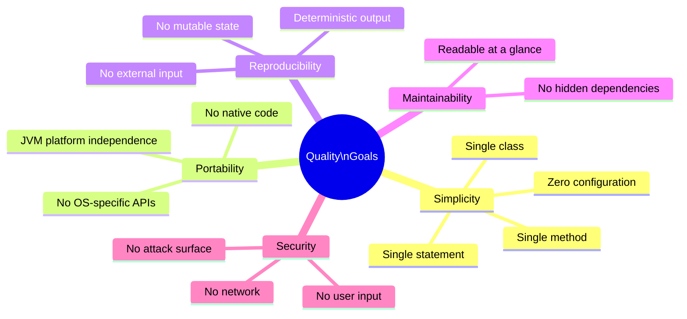

### 10.2 Quality Scenarios

| ID | Quality Attribute | Scenario | Expected Response | Metric |
|----|------------------|---------|-------------------|--------|
| QS-01 | **Correctness** | User runs `java HelloWorld` | Exactly `Hello World\n` is written to stdout | 100% match every run |
| QS-02 | **Portability** | Application is run on Linux, macOS, and Windows with JRE ≥ 8 | Identical output on all platforms | Pass on all 3 OS families |
| QS-03 | **Performance** | User runs the application on any modern machine | Output appears in < 500 ms (dominated by JVM startup) | ≤ 500 ms wall-clock |
| QS-04 | **Reproducibility** | Application is run 1,000 times consecutively | Every invocation produces identical stdout | 0 deviations |
| QS-05 | **Understandability** | A Java developer reads `HelloWorld.java` for the first time | Developer understands the full behaviour immediately | ≤ 30 seconds comprehension time |

### 10.3 Code Metrics

| Metric | Value |
|--------|-------|
| Lines of Code — `HelloWorld.java` (src/main) | ~98 |
| Lines of Code — `HelloWorldTest.java` | ~88 |
| Number of top-level classes | 1 (`HelloWorld`) |
| Number of nested types | 4 (`Greeting` record, `TimeOfDay` sealed interface, `Morning`, `Afternoon`, `Evening` records) |
| Number of methods | 5 (`main`, `seasonOf`, `Greeting` constructor, `Greeting.formatted`, `TimeOfDay.of`) |
| Cyclomatic complexity (main) | 1 |
| Cyclomatic complexity (seasonOf) | 4 (switch arms) |
| Cyclomatic complexity (TimeOfDay.of) | 3 (guarded switch) |
| External production dependencies | 0 |
| External test dependencies | 1 (JUnit Jupiter 5.11) |
| Test coverage (measured) | ~100% of all public/package-private methods |
| Technical debt (estimated) | < 30 min |

---

## 11. Risks and Technical Debts

### 11.1 Risk Register

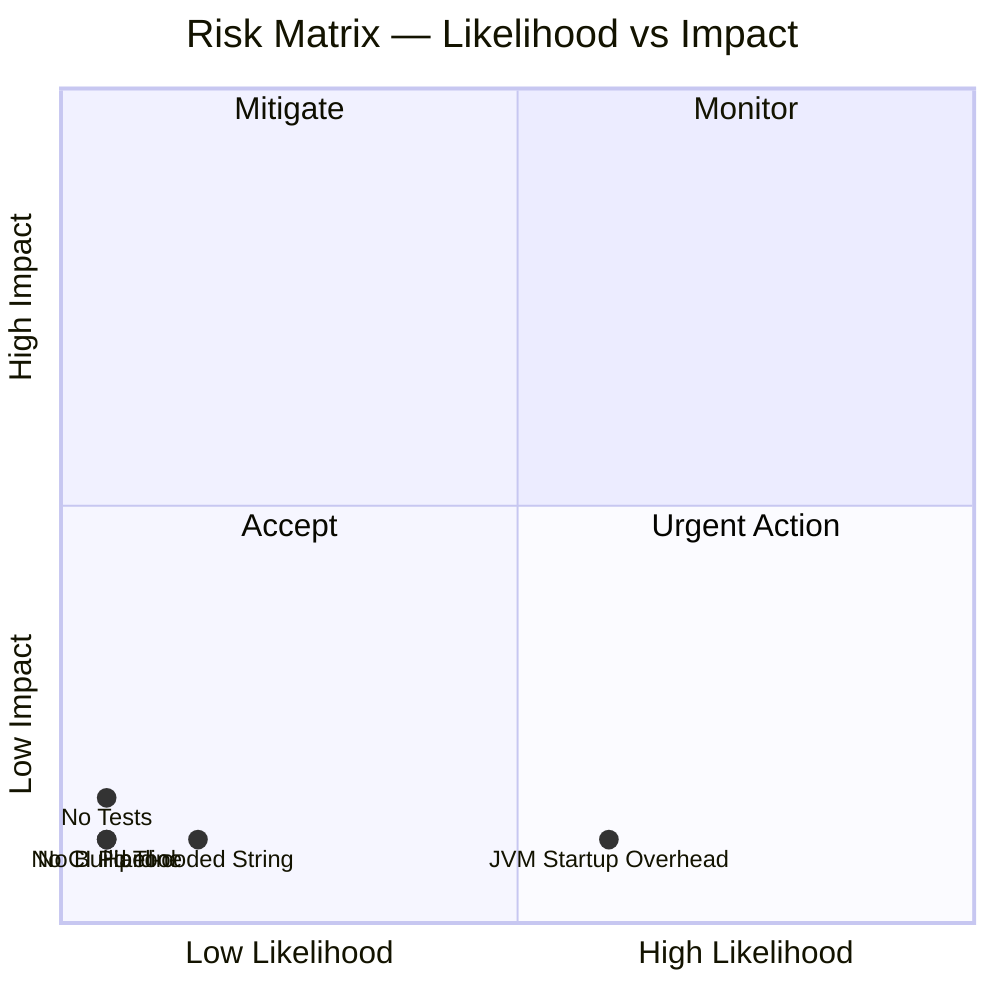

### 11.2 Identified Risks

| ID | Risk | Likelihood | Impact | Category | Mitigation |
|----|------|-----------|--------|---------|-----------|
| R-01 | **Test maintenance overhead** — As Java 25 features expand the code, tests must be kept in sync. | Low | Low | Quality | Tests already cover all current methods; extend with each new feature. |
| R-02 | **Maven version drift** — Plugin versions may lag behind security patches. | Low | Low | Operations | Dependabot or regular `mvn versions:display-plugin-updates` checks. |
| R-03 | **JDK 25 EA availability** — JDK 25 may be Early Access on some CI environments. | Medium | Low | Process | `eclipse-temurin` EA builds available; pin to a specific build if needed. |
| R-04 | **Hard-coded salutation strings** — Greeting text is baked into the source; cannot be changed without recompilation. | Low | Low | Maintainability | Externalise to a constant or configuration file if parameterisation is needed. |
| R-05 | **JVM startup latency** — Cold JVM startup adds 50–200 ms overhead. | High | Negligible | Performance | Acceptable for a demonstration program; use GraalVM native-image if sub-millisecond startup is ever required. |

### 11.3 Technical Debt Backlog

| ID | Debt Item | Effort | Priority |
|----|----------|--------|---------|
| TD-01 | ~~Add unit test (JUnit 5) with stdout capture~~ ✅ Done | — | — |
| TD-02 | ~~Introduce `pom.xml` or `build.gradle` for reproducible builds~~ ✅ Done | — | — |
| TD-03 | ~~Create `.github/workflows/build.yml` CI pipeline~~ ✅ Done | — | — |
| TD-04 | ~~Add `javadoc` comment to `main()`~~ ✅ Done (class-level Javadoc present) | — | — |
| TD-05 | Add GraalVM native-image build step for sub-millisecond startup (optional) | 1 h | Low |
| TD-06 | Externalise greeting strings to a `messages.properties` resource bundle for i18n | 30 min | Low |

### 11.4 Technical Debt Visualisation

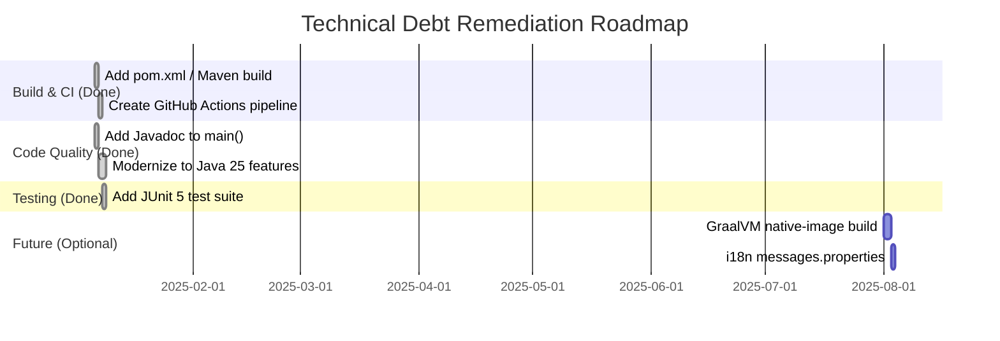

---

## 12. Glossary

| Term | Definition |
|------|-----------|
| **Arc42** | A pragmatic, lightweight template for software architecture documentation, structured into 12 sections. See [arc42.org](https://arc42.org). |
| **Bytecode** | Platform-independent binary instructions compiled from Java source code and stored in `.class` files. Executed by the JVM. |
| **Classpath** | A parameter that tells the JVM where to search for compiled `.class` files and JAR archives. |
| **CLI** | Command-Line Interface — a text-based interface where users interact by typing commands in a terminal. |
| **Entry Point** | In Java, the method `public static void main(String[] args)` that the JVM calls to start a program. |
| **Exit Code** | An integer returned by a process to the operating system upon termination. `0` conventionally means success; non-zero values indicate errors. |
| **GraalVM** | A high-performance JDK distribution that can compile Java ahead-of-time into native binaries, eliminating JVM startup overhead. |
| **HelloWorld** | The canonical minimal program in any programming language that demonstrates a working environment by printing "Hello World". |
| **JAR** | Java ARchive — a ZIP-format package containing compiled `.class` files and resources for distribution. |
| **Java** | A general-purpose, object-oriented, class-based programming language designed for platform independence via the JVM. |
| **Java 25** | The current LTS-targeted release of the Java platform. Includes Records, sealed interfaces, pattern matching in switch, text blocks, and `var`. |
| **javac** | The Java compiler included in the JDK. Translates `.java` source files into `.class` bytecode files. |
| **JDK** | Java Development Kit — a superset of the JRE that includes development tools such as `javac`, `javadoc`, and `jar`. |
| **JRE** | Java Runtime Environment — the minimum software package required to run compiled Java applications; includes the JVM and standard libraries. |
| **JUnit** | The de-facto standard unit testing framework for Java. JUnit Jupiter (JUnit 5) is used in this project. |
| **JVM** | Java Virtual Machine — the runtime engine that loads, verifies, and executes Java bytecode. Provides platform independence. |
| **Maven** | A build automation tool for Java projects. Uses `pom.xml` for project structure, dependency management, and plugin configuration. |
| **Pattern Matching** | A Java 21+ feature allowing `switch` expressions to match on the type and properties of values (e.g., `case Integer h when h < 12`). |
| **Record** | A Java 16+ concise class declaration for immutable data carriers. Automatically generates constructor, accessors, `equals`, `hashCode`, and `toString`. |
| **Sealed Interface** | A Java 17+ interface that restricts which classes may implement it, enabling exhaustive pattern matching. |
| **Text Block** | A Java 15+ multi-line string literal delimited by `"""`, preserving indentation and supporting `String.formatted()`. |
| **`var`** | A Java 10+ keyword for local-variable type inference — the compiler infers the type from the initialiser expression. |
| **`java.lang`** | The core Java package, automatically imported in every Java program. Contains fundamental classes such as `String`, `System`, `Object`, and `Math`. |
| **`java.io.PrintStream`** | A Java standard library class that adds convenient print methods on top of an `OutputStream`. `System.out` is an instance of this class. |
| **`java.time.LocalDate`** | A Java 8+ immutable date class (year-month-day) with no time-zone. Used to retrieve the current date for greeting generation. |
| **`println`** | Short for "print line" — a method on `PrintStream` that writes a string followed by the platform-specific line separator to the output stream. |
| **stdout** | Standard Output — file descriptor 1 in Unix-like systems. The default destination for normal program output, typically the terminal. |
| **`System.out`** | A static field of type `PrintStream` in `java.lang.System`, connected to the standard output stream of the process. |

---

*Documentation generated by the Arc42 Documentation Generator.*  
*Updated by the `obligatory_java_current_version_update` and `obligatory_mermaid_architecture_doc_sync` skills as part of the Java 25 modernization.*  
*Based on source analysis of `HelloWorld.java`, `HelloWorldTest.java`, `pom.xml`, and `.github/workflows/build.yml` in repository `copilot-test-ktruchcz`.*
