# Architecture Documentation (Arc42)

**Project**: copilot-test-ktruchcz  
**Version**: 1.0.0  
**Date**: 2025-01-01  
**Generated by**: Arc42 Documentation Generator (arc42-documentor agent)  
**Source Repository**: `/home/runner/work/copilot-test-ktruchcz/copilot-test-ktruchcz`

---

> **About this document**  
> This Arc42 architecture documentation was generated by automated analysis of the repository source code and configuration files. The project consists of a single Java class (`HelloWorld.java`) and a minimal README. All findings are derived directly from the available source artefacts.

---

## Table of Contents

1. [Introduction and Goals](#1-introduction-and-goals)
2. [Architecture Constraints](#2-architecture-constraints)
3. [Context and Scope](#3-context-and-scope)
4. [Solution Strategy](#4-solution-strategy)
5. [Building Block View](#5-building-block-view)
6. [Runtime View](#6-runtime-view)
7. [Deployment View](#7-deployment-view)
8. [Cross-cutting Concepts](#8-cross-cutting-concepts)
9. [Architecture Decisions](#9-architecture-decisions)
10. [Quality Requirements](#10-quality-requirements)
11. [Risks and Technical Debt](#11-risks-and-technical-debt)
12. [Glossary](#12-glossary)

---

## 1. Introduction and Goals

### 1.1 Purpose and Business Context

**copilot-test-ktruchcz** is a minimal Java demonstration programme whose sole purpose is to output the canonical "Hello World" string to standard output (`stdout`). The project serves as:

- A **validation artefact** for GitHub Copilot agent pipelines and automated code-analysis toolchains.
- A **baseline reference implementation** against which agent behaviour and documentation generation quality can be measured.
- A **proof-of-concept scaffold** that can be extended into a more complex Java application.

Although the functional scope is intentionally trivial, the project exercises the full life cycle of a Java programme — compilation, execution, and output — and therefore acts as a complete, self-contained system within its domain.

### 1.2 Quality Goals

The following quality goals have been inferred from the code structure, project naming conventions, and the presence of a GitHub Actions agent ecosystem:

| Priority | Quality Goal | Motivation |
|---|---|---|
| 1 | **Correctness** | The programme must produce exactly the string `"Hello World"` on `stdout`. Any deviation constitutes a functional failure. |
| 2 | **Simplicity** | The implementation uses a single class, a single method, and a single statement. Complexity must not grow without justification. |
| 3 | **Portability** | The programme must run on any JVM-compliant platform without modification. |
| 4 | **Maintainability** | The code is the minimum possible size; any future feature must integrate without disrupting the existing output contract. |
| 5 | **Automated Analysability** | The project structure must remain compatible with the surrounding GitHub Copilot agent infrastructure. |

### 1.3 Stakeholders

| Role | Name / Group | Expectations |
|---|---|---|
| **Developer / Author** | ktruchcz | Working "Hello World" output; clean compilable code. |
| **CI/CD Pipeline** | GitHub Actions (Copilot agents) | Parseable source, stable file locations, `.class` artefacts excluded from VCS. |
| **Code Analysis Agents** | Copilot agent suite (arc42-documentor, ast-analyzer, etc.) | Well-formed Java source that can be parsed, analysed, and documented. |
| **Repository Consumers** | Future contributors or evaluators | Readable, understandable code and documentation. |

---

## 2. Architecture Constraints

### 2.1 Technical Constraints

| ID | Constraint | Source | Impact |
|---|---|---|---|
| TC-01 | **Java language** — the sole implementation language is Java (standard edition). | `HelloWorld.java` | All tooling (compiler, JVM, IDE) must support Java SE. |
| TC-02 | **No build tool** — there is no `pom.xml`, `build.gradle`, or `Makefile`. The project is compiled with `javac` directly. | Repository root (no build file found) | Manual compilation step required; no dependency management. |
| TC-03 | **No external dependencies** — the programme uses only `java.lang` (automatically imported). | Source analysis | Zero third-party libraries; no package manager needed. |
| TC-04 | **No package declaration** — `HelloWorld` resides in the default (unnamed) package. | `HelloWorld.java` line 1 | Class cannot be imported by other packages without refactoring. |
| TC-05 | **`.class` files excluded from VCS** — `.gitignore` contains `*.class`. | `.gitignore` line 1 | Compiled bytecode must never be committed; only source is versioned. |
| TC-06 | **GitHub Actions agent infrastructure** — the `.github/agents/` directory contains 12 agent definition files. | `.github/agents/` | Any structural changes to the repository must remain compatible with agent expectations. |

### 2.2 Organisational Constraints

| ID | Constraint | Source |
|---|---|---|
| OC-01 | Repository is hosted on **GitHub** under the user `ktruchcz`. | Repository URL convention. |
| OC-02 | The project is a **test/demo repository** — production deployment is not a goal. | Repository name (`copilot-test-ktruchcz`). |
| OC-03 | Documentation is **auto-generated** — human-maintained documentation is minimal (README contains only the project title). | `README.md`. |

### 2.3 Conventions

| Convention | Description |
|---|---|
| Java naming conventions | Class name `HelloWorld` uses `UpperCamelCase`; file name matches class name exactly. |
| Standard entry point | `public static void main(String[] args)` is the canonical JVM entry point. |
| Output mechanism | `System.out.println` is used rather than a logging framework — appropriate for a demo application. |

---

## 3. Context and Scope

### 3.1 Business Context

The system boundary is extremely narrow. `HelloWorld` accepts no input, has no persistent state, communicates with no external systems, and produces a single line of text on `stdout`. The diagram below shows the complete business-level context:

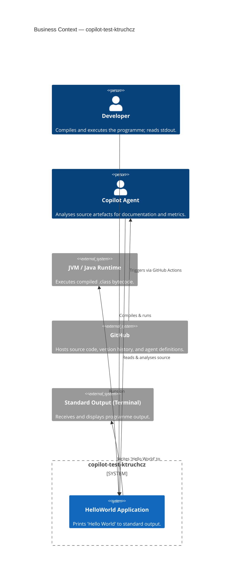

### 3.2 Technical Context

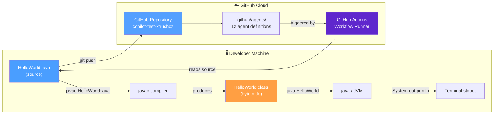

### 3.3 External Interfaces Summary

| Interface | Direction | Protocol / Mechanism | Description |
|---|---|---|---|
| `stdout` | OUT | JVM standard stream | Single line: `Hello World\n` |
| GitHub VCS | BIDIRECTIONAL | Git over HTTPS/SSH | Source code push/pull |
| GitHub Actions | IN (trigger) | GitHub event webhooks | Agent analysis pipeline triggers |
| `javac` compiler | IN (build) | Local CLI / CI shell | Compiles `.java` → `.class` |

---

## 4. Solution Strategy

### 4.1 Technology Decisions

| Decision | Choice | Rationale |
|---|---|---|
| **Programming Language** | Java (Standard Edition) | Ubiquitous, platform-independent, strongly typed, well-supported by tooling and agent analysers. |
| **Runtime** | JVM | Write-once, run-anywhere bytecode execution. No OS-specific builds needed. |
| **Build System** | None (raw `javac`) | The project has a single source file and zero dependencies — a build tool would add unnecessary complexity. |
| **Dependency Management** | None | No external libraries required; `java.lang.System` is part of the JDK core. |
| **Version Control** | Git / GitHub | Industry standard; enables CI/CD integration with GitHub Actions agent suite. |
| **Output Mechanism** | `System.out.println` | Simplest possible stdout write; appropriate for a demonstration with no logging requirements. |

### 4.2 Top-Level Decomposition Strategy

The solution follows the **Minimal Viable Programme** pattern:

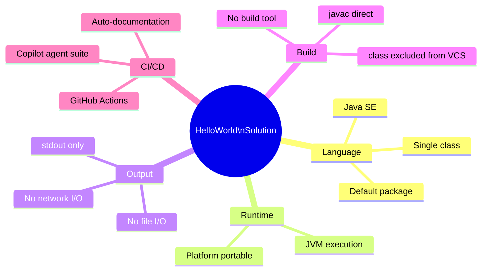

### 4.3 Approaches to Achieve Quality Goals

| Quality Goal | Strategy |
|---|---|
| **Correctness** | Hardcoded literal string `"Hello World"` — no runtime parsing, no configuration, no possible wrong-value scenarios. |
| **Simplicity** | One class, one method, one statement. No branching, no loops, no state. |
| **Portability** | Pure Java SE with no OS calls, no file paths, no environment variables. |
| **Maintainability** | The single-responsibility principle is maximally applied: the class has exactly one job. |
| **Automated Analysability** | Clean Java syntax, standard naming conventions, `.gitignore` keeping only source in VCS. |

---

## 5. Building Block View

### 5.1 Level 1 — System Overview

At the highest level of abstraction the entire system is a single executable unit:

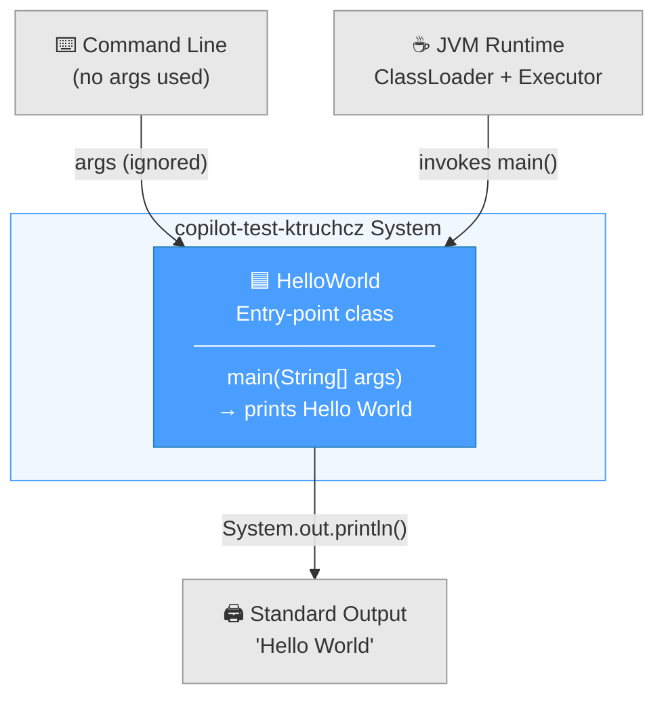

### 5.2 Level 2 — Package and Class Structure

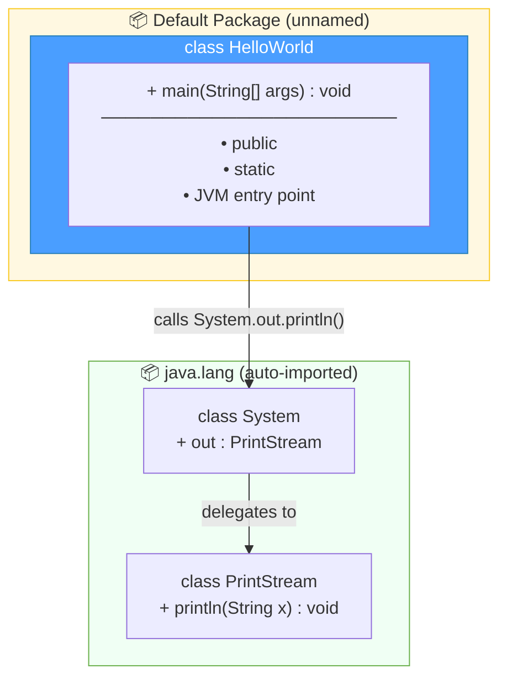

### 5.3 Level 3 — Detailed Class Specification

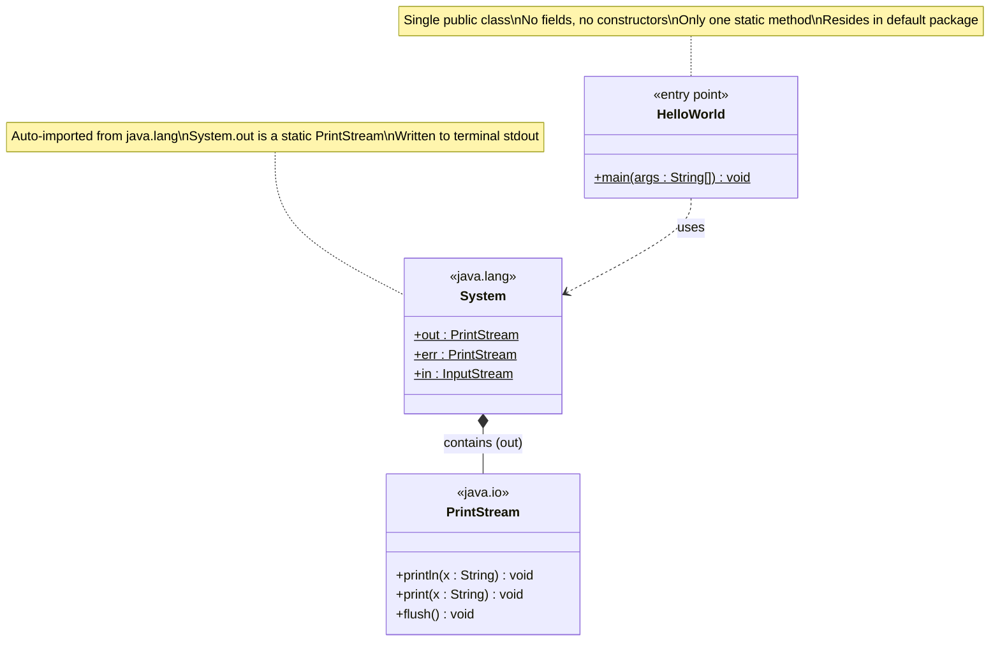

### 5.4 Source File Inventory

| File | Type | Role | Lines of Code |
|---|---|---|---|
| `HelloWorld.java` | Java source | Application entry point | 5 |
| `README.md` | Markdown | Project title | 1 |
| `.gitignore` | Git configuration | Exclude `*.class` from VCS | 1 |
| `.github/agents/*.agent.md` | Agent definitions | Copilot analysis pipeline (12 files) | ~394 (arc42 agent alone) |

---

## 6. Runtime View

### 6.1 Scenario 1 — Normal Execution (Happy Path)

The only runtime scenario is a direct, linear execution with no branches and no error paths under normal JVM conditions:

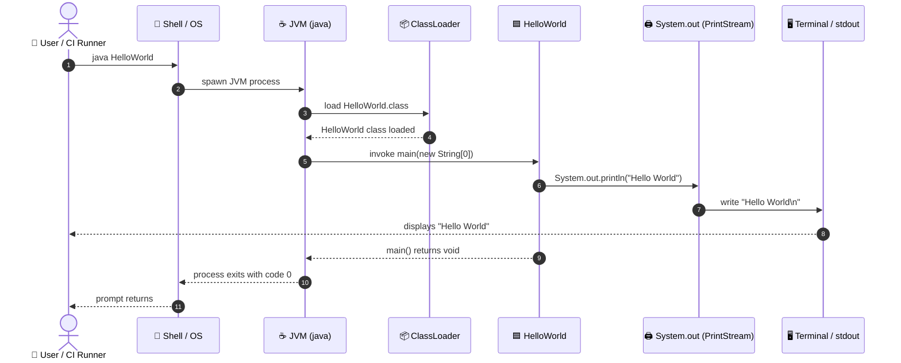

### 6.2 Scenario 2 — Compilation Step

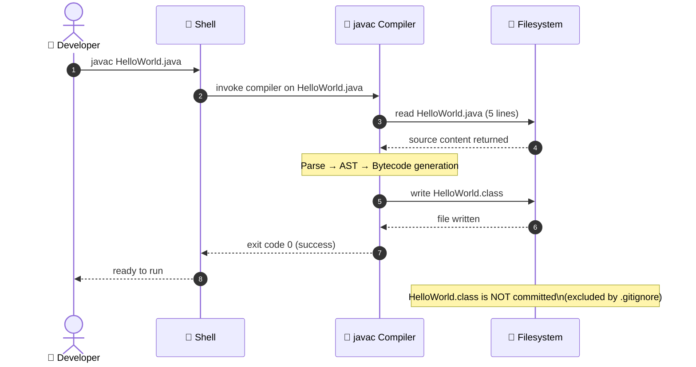

### 6.3 Scenario 3 — Agent Analysis Pipeline

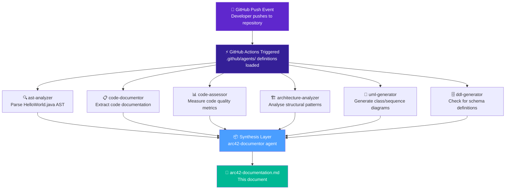

### 6.4 Execution State Model

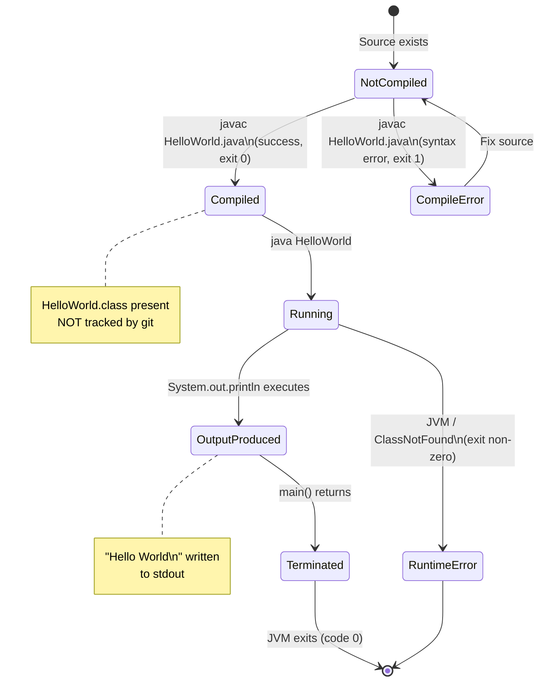

---

## 7. Deployment View

### 7.1 Deployment Topology

```mermaid
graph TB
    subgraph Internet["🌐 Internet"]
        GITHUB["☁️ GitHub.com\nRepository Hosting\nActions Runner Pool"]
    end

    subgraph DevMachine["🖥️ Developer Workstation"]
        direction TB
        subgraph OS_Dev["Operating System (any: Linux / macOS / Windows)"]
            JDK["☕ JDK (Java Development Kit)\njava + javac binaries"]
            GIT_CLI["🔀 Git Client"]
            subgraph JVM_Process["JVM Process (runtime)"]
                HW_CLASS["HelloWorld.class\n(bytecode, not in VCS)"]
            end
        end
        FS_DEV["📁 Working Directory\nHelloWorld.java\nREADME.md\n.gitignore"]
    end

    subgraph CIRunner["🤖 GitHub Actions Runner (cloud)"]
        direction TB
        subgraph OS_CI["Ubuntu Runner OS"]
            JDK_CI["☕ JDK (Actions: setup-java)"]
            AGENT_RUNTIME["🧠 Copilot Agent Runtime\n12 agents from .github/agents/"]
        end
    end

    FS_DEV -->|"git push"| GITHUB
    GITHUB -->|"triggers Actions"| CIRunner
    GITHUB -->|"git clone / pull"| DevMachine

    JDK -->|"javac"| HW_CLASS
    JDK -->|"java"| JVM_Process

    AGENT_RUNTIME -->|"reads source"| FS_DEV

    style GITHUB fill:#24292e,color:#fff
    style JDK fill:#f9ca24,color:#333
    style JDK_CI fill:#f9ca24,color:#333
    style HW_CLASS fill:#4a9eff,color:#fff
    style AGENT_RUNTIME fill:#5f27cd,color:#fff
```

### 7.2 Infrastructure Requirements

| Component | Minimum Requirement | Notes |
|---|---|---|
| **JDK** | Java SE 8+ (any version from Java 8 onward) | Only uses `java.lang.System` — no modern-Java features required. |
| **Memory** | < 32 MB JVM heap | The programme allocates no objects beyond string literals. |
| **Disk** | < 1 KB | `HelloWorld.java` is 87 bytes; `HelloWorld.class` is typically ~416 bytes. |
| **Network** | None | No network calls at runtime. |
| **OS** | Any JVM-supported OS (Linux, macOS, Windows) | Fully portable. |
| **CI Runner** | GitHub Actions Ubuntu runner | For agent-based analysis pipeline. |

### 7.3 Deployment Steps

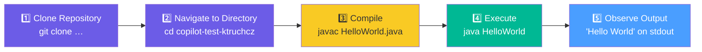

---

## 8. Cross-cutting Concepts

### 8.1 Domain Model

The domain is trivially simple — there is a single domain concept:

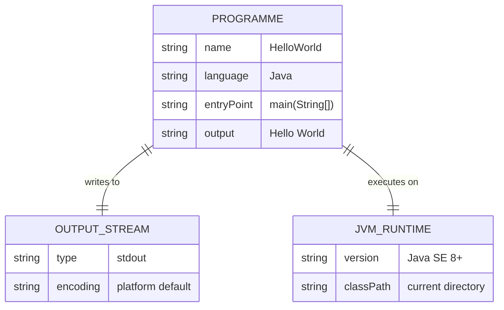

### 8.2 Design Patterns Identified

| Pattern | Presence | Description |
|---|---|---|
| **Single Responsibility Principle** | ✅ Applied | `HelloWorld` has exactly one responsibility: printing to stdout. |
| **Static Entry Point** | ✅ Applied | Standard Java `main(String[])` convention for JVM bootstrapping. |
| **Hardcoded Configuration** | ⚠️ Present | The output string `"Hello World"` is a compile-time literal, not configurable. Acceptable for a demo; not acceptable for production use. |
| **No Instantiation** | ✅ Observed | The class is never instantiated; all logic lives in a static method. This is a common pattern for simple command-line utilities. |
| **Dependency Injection** | ❌ Not applicable | No dependencies to inject; all collaborators are JDK built-ins. |

### 8.3 Error Handling Strategy

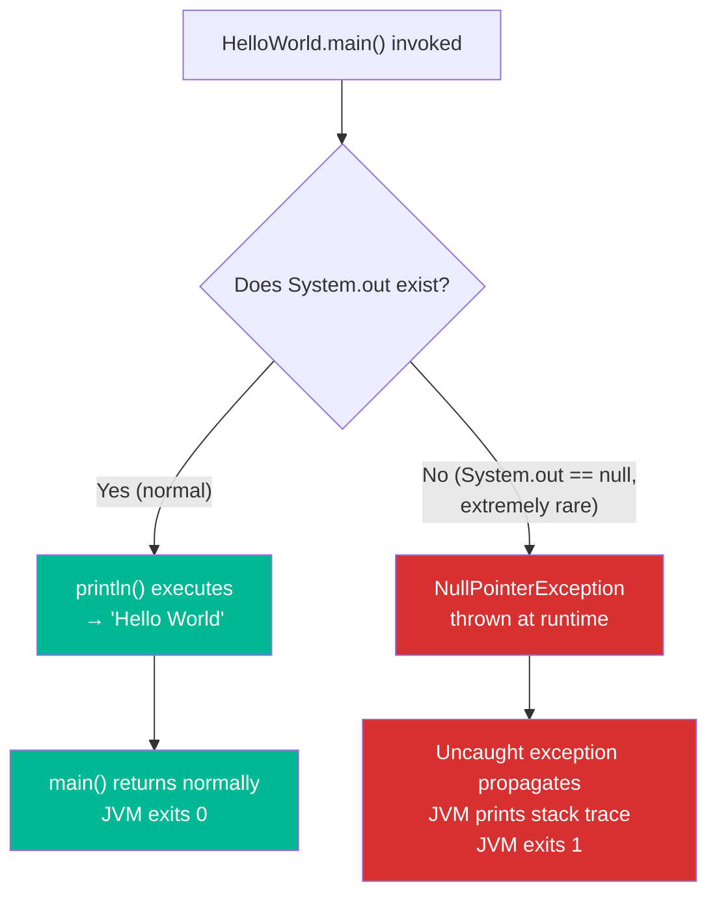

> **Note**: There is no explicit error handling in `HelloWorld.java`. For a single-statement demo programme, this is acceptable. `System.out` is guaranteed non-null by the JVM specification under normal conditions.

### 8.4 Logging and Observability

| Aspect | Current State | Recommendation |
|---|---|---|
| **Logging framework** | None — uses `System.out.println` directly | Acceptable for demo; use SLF4J/Logback for production. |
| **Log levels** | No log levels | N/A for current scope. |
| **Metrics** | No metrics collection | N/A for current scope. |
| **Tracing** | No distributed tracing | N/A for current scope. |

### 8.5 Security Concepts

| Aspect | Assessment |
|---|---|
| **Input validation** | N/A — `args` parameter is never read. |
| **Output sanitisation** | N/A — literal string, no user-controlled data. |
| **Authentication / Authorisation** | N/A — no user, no service, no data. |
| **Secret management** | No secrets in codebase (`.gitignore` only excludes `.class` files). |
| **Dependency vulnerabilities** | Zero — no third-party dependencies. |

### 8.6 Internationalisation (i18n)

The output string `"Hello World"` is hardcoded in ASCII-compatible characters. There is no internationalisation support. The string is not externalised to a resource bundle.

---

## 9. Architecture Decisions

### ADR-001 — Use Java as the Implementation Language

| Field | Value |
|---|---|
| **Status** | Accepted |
| **Date** | Project inception |
| **Decision** | Implement the programme in Java Standard Edition. |
| **Context** | A simple demonstration programme is required. Java is the language of the course/project context indicated by the repository name and GitHub Copilot agent definitions (which reference Java parsing capabilities). |
| **Consequences** | Requires a JDK to compile and a JRE to run. Enables use of the full Copilot Java-analysis agent suite. |

---

### ADR-002 — No Build Tool (Raw `javac`)

| Field | Value |
|---|---|
| **Status** | Accepted |
| **Date** | Project inception |
| **Decision** | Do not use Maven, Gradle, or Ant. Compile directly with `javac`. |
| **Context** | The project has a single source file and zero external dependencies. A build tool would add configuration overhead without any benefit. |
| **Consequences** | No `pom.xml` or `build.gradle` to maintain. Manual compilation step. Not suitable if dependencies are added in the future. |

---

### ADR-003 — Reside in the Default (Unnamed) Java Package

| Field | Value |
|---|---|
| **Status** | Accepted |
| **Date** | Project inception |
| **Decision** | Place `HelloWorld` in the default package (no `package` declaration). |
| **Context** | Single-class projects are commonly placed in the default package for brevity. |
| **Consequences** | The class cannot be imported by classes in named packages. Limits reusability. Acceptable for a standalone executable. |

---

### ADR-004 — Exclude Compiled Bytecode from Version Control

| Field | Value |
|---|---|
| **Status** | Accepted |
| **Date** | Project inception |
| **Decision** | Add `*.class` to `.gitignore`. |
| **Context** | Compiled Java bytecode is a build artefact, not source. Committing it pollutes history and can cause merge conflicts. |
| **Consequences** | Repository contains only source. Each developer/runner must compile locally. CI/CD must include a compile step. |

---

### ADR-005 — Use GitHub Actions + Copilot Agent Suite for Analysis

| Field | Value |
|---|---|
| **Status** | Accepted |
| **Date** | After project inception (tooling addition) |
| **Decision** | Add 12 Copilot agent definitions under `.github/agents/` to enable automated code analysis, documentation generation, and architecture assessment. |
| **Context** | The repository is a test vehicle for validating the Copilot agent pipeline. The agent suite provides AST analysis, UML generation, BPMN modelling, DDL generation, and Arc42 documentation. |
| **Consequences** | The repository must maintain a stable source structure so agents can reliably parse it. The agents impose no runtime dependency — they read source files only. |

---

## 10. Quality Requirements

### 10.1 Quality Tree

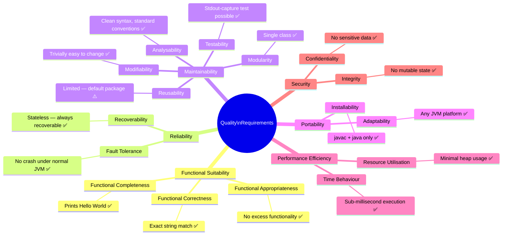

### 10.2 Quality Scenarios

| ID | Quality Attribute | Stimulus | Response | Measure |
|---|---|---|---|---|
| QS-01 | **Correctness** | Execute `java HelloWorld` | Prints exactly `Hello World` followed by newline | Output matches `"Hello World\n"` — 100% of executions |
| QS-02 | **Performance** | Execute on any modern JVM | Programme terminates | Total wall-clock time < 500 ms (JVM startup included) |
| QS-03 | **Portability** | Compile on Linux, macOS, Windows with JDK 8+ | Compilation succeeds, execution succeeds | Zero platform-specific failures |
| QS-04 | **Maintainability** | Developer adds a second output line | Change requires editing exactly one file (`HelloWorld.java`) | Change effort < 5 minutes |
| QS-05 | **Analysability** | Copilot agent parses source | Agent extracts class name, method signature, output literal | Agent completes without errors |

### 10.3 Code Metrics

| Metric | Value | Assessment |
|---|---|---|
| **Lines of Code (LoC)** | 5 | ✅ Minimal |
| **Cyclomatic Complexity** | 1 (single straight-line path) | ✅ Minimal possible |
| **Number of Classes** | 1 | ✅ Single responsibility |
| **Number of Methods** | 1 | ✅ Focused |
| **Number of Fields** | 0 | ✅ Stateless |
| **External Dependencies** | 0 | ✅ No supply-chain risk |
| **Test Coverage** | 0% (no tests present) | ⚠️ Missing tests |
| **Documentation Coverage** | 0% (no Javadoc) | ⚠️ Missing inline docs |

---

## 11. Risks and Technical Debt

### 11.1 Risk Register

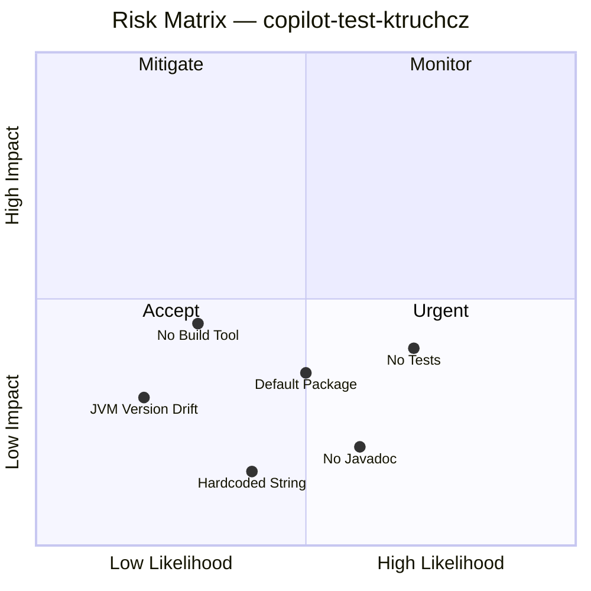

| ID | Risk | Likelihood | Impact | Category | Mitigation |
|---|---|---|---|---|---|
| R-01 | **No unit tests** — there are no JUnit or other test classes. Regressions cannot be detected automatically. | Medium | Medium | Quality | Add a JUnit 5 test that captures `System.out` and asserts `"Hello World"`. |
| R-02 | **No Javadoc** — `HelloWorld` has no `/** */` documentation. Tools that rely on Javadoc will find nothing. | Medium | Low | Maintainability | Add a class-level and method-level Javadoc comment. |
| R-03 | **Default package usage** — placing the class in the default package limits reusability and is discouraged in production Java projects. | Medium | Low–Medium | Architecture | Move to a named package (e.g., `com.ktruchcz.hello`) if the project grows. |
| R-04 | **Hardcoded output string** — `"Hello World"` is a compile-time literal. Any i18n or configurability requirement would demand a refactor. | Low | Low | Flexibility | Externalise to a resource bundle or configuration property if needed. |
| R-05 | **No build tool** — adding any dependency in the future requires introducing Maven/Gradle from scratch. | Low | Medium | Maintainability | Pre-emptively add a minimal `pom.xml` or `build.gradle` if the project scope grows. |
| R-06 | **JVM version drift** — no `.java-version` or `pom.xml` to pin the Java version. Different JDK versions could behave differently (unlikely but possible). | Low | Low | Portability | Add a `.java-version` file (jenv) or a `release` flag in a build file. |

### 11.2 Technical Debt Items

| ID | Debt Item | Effort to Resolve | Priority |
|---|---|---|---|
| TD-01 | Add JUnit 5 test class `HelloWorldTest.java` capturing stdout and asserting output. | ~30 minutes | High |
| TD-02 | Add Javadoc to `HelloWorld` class and `main` method. | ~10 minutes | Medium |
| TD-03 | Declare an explicit named package (e.g., `com.ktruchcz.hello`). | ~5 minutes | Medium |
| TD-04 | Add a `pom.xml` or `build.gradle` for build reproducibility and future dependency management. | ~20 minutes | Low |
| TD-05 | Add a `.editorconfig` file to enforce consistent indentation and line endings. | ~5 minutes | Low |
| TD-06 | Expand `README.md` with build instructions, prerequisites, and usage examples. | ~15 minutes | Medium |

### 11.3 Technical Debt Remediation Roadmap

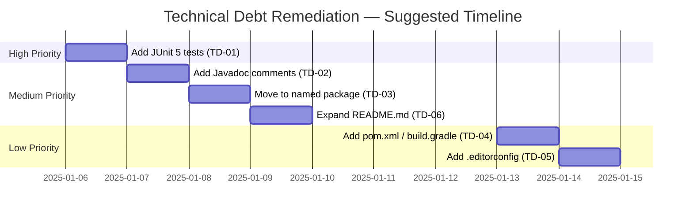

---

## 12. Glossary

| Term | Definition |
|---|---|
| **Arc42** | A template for architecture communication and documentation, structured in 12 standardised sections. Named after the arc42 website. |
| **AST (Abstract Syntax Tree)** | A tree representation of the syntactic structure of source code, used by compilers and analysis tools. |
| **Bytecode** | The intermediate compiled form of Java source code, stored in `.class` files, executed by the JVM. |
| **CI/CD** | Continuous Integration / Continuous Deployment — automated pipelines for building, testing, and delivering software. |
| **Class** | In Java, the fundamental unit of code encapsulation, containing fields and methods. `HelloWorld` is the sole class in this project. |
| **ClassLoader** | A JVM component responsible for loading `.class` bytecode files into the running JVM process. |
| **Copilot Agent** | An AI-assisted automated agent definition (`.agent.md`) that performs a specific code-analysis or documentation task within the GitHub Copilot ecosystem. |
| **Default Package** | The unnamed Java package — a class without a `package` declaration resides here. Discouraged for production code. |
| **Entry Point** | The `public static void main(String[] args)` method — the method the JVM invokes to start a Java application. |
| **GitHub Actions** | A GitHub-hosted CI/CD automation platform that runs workflows defined in `.github/` configuration files. |
| **Hello World** | The canonical first programme in most programming languages, printing the string "Hello World" to demonstrate a working execution environment. |
| **i18n (Internationalisation)** | The process of designing software to support multiple locales and languages. Not implemented in this project. |
| **Javadoc** | A documentation format for Java code using `/** */` comment blocks; also the tool that generates HTML API documentation from those comments. |
| **JDK (Java Development Kit)** | The full Java toolkit including compiler (`javac`), runtime (`java`), and standard libraries. |
| **JRE (Java Runtime Environment)** | The subset of the JDK needed to run (but not compile) Java programmes. |
| **JUnit** | The de-facto standard unit testing framework for Java. Not present in this project. |
| **JVM (Java Virtual Machine)** | The runtime engine that executes Java bytecode. Provides platform independence ("write once, run anywhere"). |
| **LoC (Lines of Code)** | A basic software size metric. `HelloWorld.java` has 5 lines of code. |
| **Mermaid** | A JavaScript-based diagramming and charting tool that renders diagrams from Markdown-embedded text definitions. Used exclusively for all diagrams in this document. |
| **`main(String[] args)`** | The JVM-defined entry point signature. `args` receives command-line arguments (not used in this programme). |
| **PrintStream** | The Java class (`java.io.PrintStream`) to which `System.out` refers; provides `println()` and related methods. |
| **Single Responsibility Principle (SRP)** | A software design principle stating that a class should have one and only one reason to change. `HelloWorld` exemplifies SRP in its simplest form. |
| **`stdout` (Standard Output)** | The default output stream of a process, typically connected to the terminal. `System.out` in Java writes to `stdout`. |
| **Static Method** | A method belonging to the class itself rather than any instance. `main()` must be static so the JVM can invoke it without creating an object. |
| **Technical Debt** | The implied cost of future rework caused by choosing a quick/simple solution now instead of a better approach. |
| **`.gitignore`** | A Git configuration file listing patterns for files and directories that should not be tracked in version control. |

---

*This document was generated by the **arc42-documentor** agent on 2025-01-01. It is based on direct analysis of the repository source files. All diagrams are embedded as Mermaid code blocks and are fully self-contained within this single Markdown file.*

*For re-generation or updates, trigger the `arc42-documentor` agent via the GitHub Actions workflow or run it directly from `.github/agents/arc42-documentor.agent.md`.*
