# Architecture Documentation (Arc42)

**Project**: copilot-test-ktruchcz  
**Version**: 1.0.0  
**Date**: 2025-01-01  
**Generated by**: Arc42 Documentation Generator  
**Source Language**: Java (SE)  
**Primary Source File**: `HelloWorld.java`

---

## Table of Contents

1. [Introduction and Goals](#1-introduction-and-goals)
2. [Constraints](#2-constraints)
3. [Context and Scope](#3-context-and-scope)
4. [Solution Strategy](#4-solution-strategy)
5. [Building Block View](#5-building-block-view)
6. [Runtime View](#6-runtime-view)
7. [Deployment View](#7-deployment-view)
8. [Crosscutting Concepts](#8-crosscutting-concepts)
9. [Architecture Decisions](#9-architecture-decisions)
10. [Quality Requirements](#10-quality-requirements)
11. [Risks and Technical Debt](#11-risks-and-technical-debt)
12. [Glossary](#12-glossary)

---

## 1. Introduction and Goals

### 1.1 Purpose and Business Context

**copilot-test-ktruchcz** is a minimal Java command-line application whose sole purpose is to output the string `"Hello World"` to the standard output stream (`stdout`). It serves as a canonical "Hello World" program — the simplest runnable Java application and a common starting point for verifying that a Java development environment is correctly configured.

While trivially small in scope, the application demonstrates the fundamental structural requirements imposed by the Java language and JVM runtime:

- A named public class matching its source file.
- A standard `main` entry point that the JVM can invoke.
- Use of the `System.out` I/O stream for terminal output.

### 1.2 Functional Requirements

| ID   | Requirement                                         | Priority |
|------|-----------------------------------------------------|----------|
| FR-1 | The system shall print `"Hello World"` to stdout.   | MUST     |
| FR-2 | The system shall exit cleanly after printing.       | MUST     |
| FR-3 | The system shall accept (and ignore) CLI arguments. | SHOULD   |

### 1.3 Quality Goals

The top quality goals for this system, in priority order:

| Priority | Quality Attribute | Motivation |
|----------|-------------------|------------|
| 1 | **Simplicity** | The entire application fits in 5 lines. Zero unnecessary complexity. |
| 2 | **Portability** | Runs on any JVM-compliant platform (Windows, macOS, Linux). |
| 3 | **Correctness** | The single business function (printing "Hello World") must always succeed. |
| 4 | **Maintainability** | The code must be trivially understandable by any Java developer. |

### 1.4 Stakeholders

| Role | Expectation |
|------|-------------|
| **Developer / Learner** | Verify that the Java toolchain is installed and functional. |
| **CI/CD Pipeline** | Confirm the repository compiles and executes successfully. |
| **Repository Owner (`ktruchcz`)** | Maintain a baseline test repository for GitHub Copilot evaluation. |

---

## 2. Constraints

### 2.1 Technical Constraints

| ID   | Constraint | Rationale |
|------|-----------|-----------|
| TC-1 | **Java SE runtime required** | The application is written in Java; the JVM must be present on the host. |
| TC-2 | **No external dependencies** | No Maven, Gradle, or third-party libraries are referenced. The application uses only `java.lang.*` (auto-imported). |
| TC-3 | **Single source file** | The entire application is contained in `HelloWorld.java`; no multi-file compilation units. |
| TC-4 | **No build tool** | There is no `pom.xml`, `build.gradle`, `Makefile`, or equivalent. Compilation must be performed manually via `javac`. |
| TC-5 | **No test framework** | There are no unit tests, integration tests, or test configuration files. |
| TC-6 | **Flat package structure** | The class resides in the default (unnamed) Java package. |

### 2.2 Organizational Constraints

| ID   | Constraint | Rationale |
|------|-----------|-----------|
| OC-1 | **GitHub-hosted repository** | Source code is managed in a GitHub repository under the `copilot-test-ktruchcz` name. |
| OC-2 | **GitHub Actions CI** | A `.github/` directory is present, indicating CI workflows may be configured. |
| OC-3 | **Minimal documentation** | The README contains only the repository name; no additional documentation is maintained. |

### 2.3 Conventions

| Convention | Description |
|-----------|-------------|
| Java naming conventions | Class name `HelloWorld` matches file name `HelloWorld.java`. |
| `main` signature | Standard `public static void main(String[] args)` entry point. |
| stdout output | Uses `System.out.println` for output — the idiomatic Java console output method. |

---

## 3. Context and Scope

### 3.1 Business Context

The system is a self-contained CLI utility. It interacts with one external actor (the **User / Operator**) and one external system (the **Operating System / Terminal**).

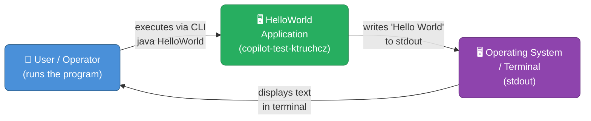

**External Interfaces:**

| Interface | Direction | Protocol / Medium | Data |
|-----------|-----------|-------------------|------|
| CLI invocation | User → System | OS process execution | `String[] args` (ignored) |
| Standard output | System → Terminal | `System.out` / stdout stream | `"Hello World\n"` |

### 3.2 Technical Context

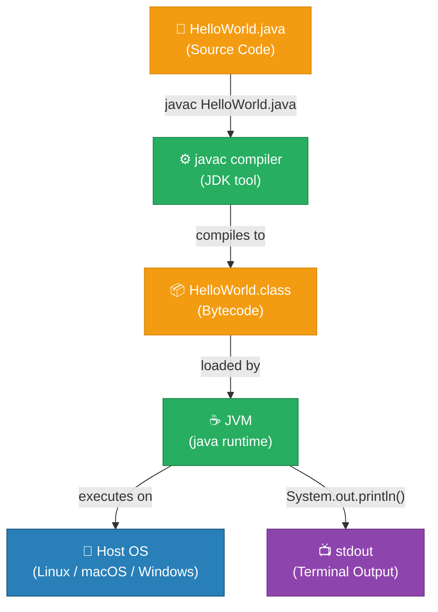

---

## 4. Solution Strategy

### 4.1 Overview

The solution strategy for this application is **radical minimalism**. Every architectural and technology decision is made to achieve the functional goal with the absolute minimum of complexity, infrastructure, and dependencies.

| Strategic Decision | Choice Made | Alternatives Considered |
|-------------------|-------------|------------------------|
| Language | Java SE | Python, C, JavaScript, Kotlin |
| Build system | None (manual `javac`) | Maven, Gradle, Ant |
| Output mechanism | `System.out.println` | Logging frameworks (Log4j, SLF4J) |
| Package structure | Default (unnamed) package | Named package hierarchy |
| Dependency management | None | Maven Central, Gradle deps |
| Testing strategy | None | JUnit 5, TestNG |
| Deployment | Manual class execution | JAR packaging, Docker |

### 4.2 Rationale

1. **Plain Java with no framework**: A Hello World program has no domain complexity, no data persistence, no network I/O, and no concurrent workload. Any framework would be pure overhead.

2. **Direct `System.out.println`**: The only output requirement is writing a string to stdout. Using a logging framework would introduce configuration complexity and transitive dependencies.

3. **Default package**: With a single class, package namespacing provides zero organizational value and would only add a directory layer.

4. **No build tool**: With a single source file and zero dependencies, a build tool would add more complexity than it solves. The project compiles with a single `javac` command.

### 4.3 Achieving Quality Goals

| Quality Goal | Strategy |
|-------------|----------|
| Simplicity | Single class, single method, single statement |
| Portability | Compiled to JVM bytecode; runs on any Java-capable OS |
| Correctness | `System.out.println` is a deterministic, well-tested JDK method |
| Maintainability | Any Java developer can understand the code in under 5 seconds |

---

## 5. Building Block View

### 5.1 Level 1 — System Whitebox

At the highest level, the entire system is a single executable unit with one input (JVM invocation) and one output (stdout text).

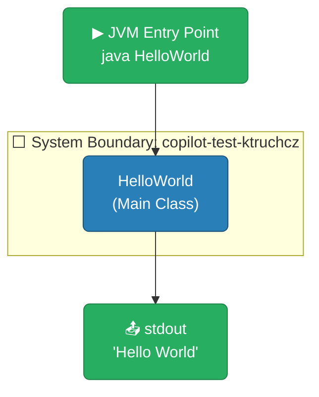

**Contained Building Blocks:**

| Block | Responsibility |
|-------|---------------|
| `HelloWorld` | Contains the `main` entry point; orchestrates the single output operation. |

### 5.2 Level 2 — HelloWorld Class Whitebox

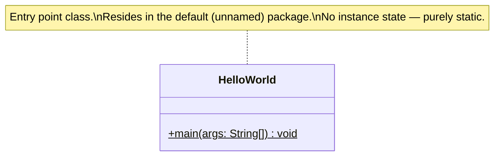

**Method Inventory:**

| Method | Visibility | Return Type | Parameters | Responsibility |
|--------|-----------|-------------|------------|---------------|
| `main` | `public` | `void` | `String[] args` | JVM entry point; prints "Hello World" to stdout |

### 5.3 Level 3 — Statement-Level Detail

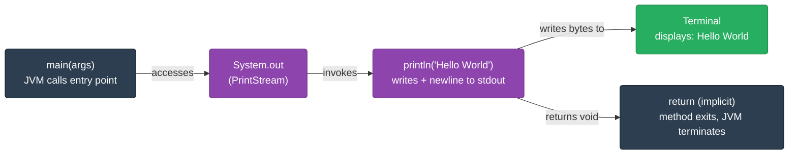

---

## 6. Runtime View

### 6.1 Scenario: Normal Execution

The following sequence diagram shows the complete lifecycle of the application from JVM startup to process exit.

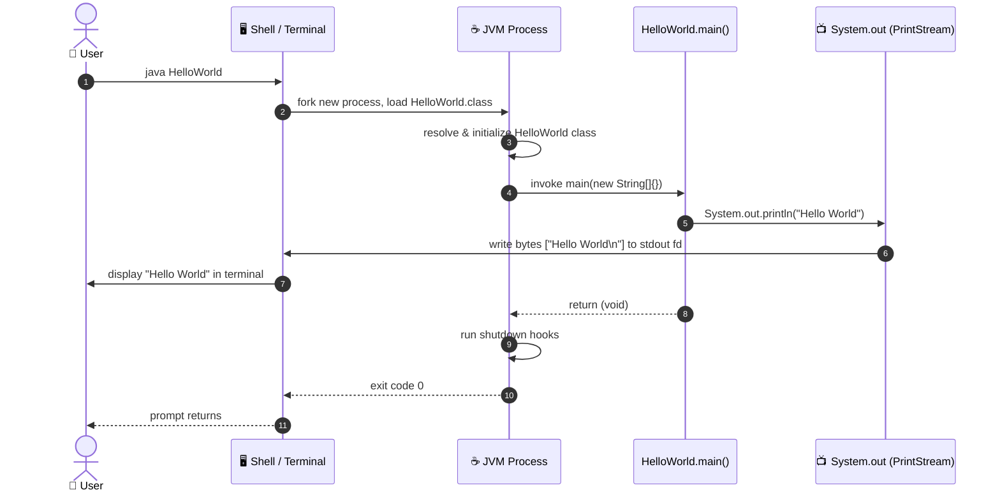

### 6.2 Execution Flow (Flowchart)

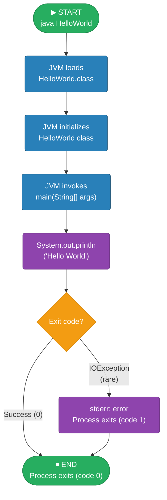

### 6.3 Runtime Characteristics

| Attribute | Value |
|-----------|-------|
| Startup time | ~50–200 ms (JVM cold start) |
| Peak memory usage | ~30–50 MB (JVM baseline heap) |
| CPU usage | Negligible (single println statement) |
| I/O operations | 1 write to stdout |
| Exit code | `0` (success) under all normal conditions |
| Threads | 1 (main thread) + JVM internal threads |

---

## 7. Deployment View

### 7.1 Infrastructure Requirements

| Requirement | Minimum | Recommended |
|-------------|---------|-------------|
| JRE / JDK version | Java 8+ | Java 17+ LTS |
| OS | Any JVM-supported OS | Linux, macOS, Windows |
| RAM | 32 MB | 256 MB |
| Disk | ~5 KB (`HelloWorld.class`) | Any |
| Network | Not required | Not required |

### 7.2 Deployment Topology

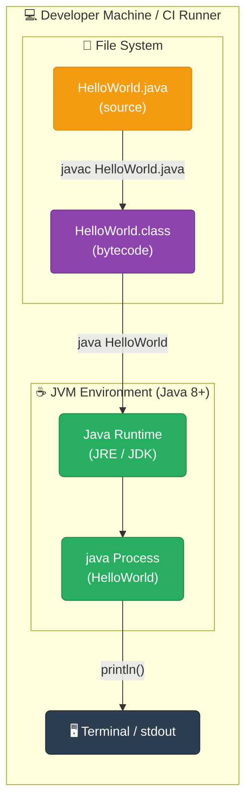

### 7.3 Build and Run Instructions


**Step-by-step deployment:**

```bash
# Step 1: Compile
javac HelloWorld.java

# Step 2: Run
java HelloWorld

# Expected output:
Hello World
```

### 7.4 CI/CD Considerations

The repository contains a `.github/` directory, suggesting GitHub Actions is (or can be) used. A typical workflow would:

1. **Checkout** repository code.
2. **Setup Java** (e.g., `actions/setup-java@v3` with Java 17).
3. **Compile**: `javac HelloWorld.java`
4. **Run**: `java HelloWorld` and assert output equals `"Hello World"`.

---

## 8. Crosscutting Concepts

### 8.1 Domain Model

Although the domain is trivially simple, the implicit domain entities are:

```mermaid
erDiagram
    APPLICATION {
        string name "HelloWorld"
        string language "Java"
        string entryPoint "main(String[])"
    }
    OUTPUT_STREAM {
        string type "stdout"
        string implementation "System.out (PrintStream)"
    }
    MESSAGE {
        string content "Hello World"
        string encoding "UTF-8 (platform default)"
        bool newline true
    }

    APPLICATION ||--|| OUTPUT_STREAM : "writes to"
    OUTPUT_STREAM ||--|| MESSAGE : "carries"
```

### 8.2 Design Patterns

| Pattern | Applied? | Notes |
|---------|----------|-------|
| Singleton | Implicit | `System.out` is a JVM-managed singleton |
| Template Method | No | N/A at this scale |
| Strategy | No | N/A at this scale |
| Factory | No | N/A at this scale |
| MVC | No | No UI separation needed |

### 8.3 Output / Logging Concept

The application uses **direct stdout writing** via `System.out.println`. There is no logging framework. This is appropriate for the scale of the application.


### 8.4 Error Handling

| Error Scenario | Current Handling | Recommendation |
|---------------|------------------|----------------|
| `System.out` closed/null | JVM would throw `NullPointerException` | Not applicable in standard execution |
| Invalid CLI arguments | Arguments are accepted but ignored | No change needed |
| OutOfMemoryError | JVM-level, not application-level | Not applicable at this scale |

### 8.5 Internationalization (i18n)

The output string `"Hello World"` is **hardcoded** in ASCII-compatible characters. There is no internationalization support. For a production system, the string would be externalized to a resource bundle.

---

## 9. Architecture Decisions

### ADR-001: Use Plain Java with No Framework

| Field | Value |
|-------|-------|
| **Status** | Accepted |
| **Date** | Project inception |
| **Deciders** | Repository owner (ktruchcz) |

**Context**: A Hello World program is needed to verify the Java toolchain.

**Decision**: Use plain Java SE with no external libraries, build tools, or frameworks.

**Consequences**:
- ✅ Zero configuration — runs immediately on any JVM.
- ✅ Zero dependency management overhead.
- ✅ Maximum simplicity and readability.
- ❌ Cannot be extended without introducing build tooling.
- ❌ No automated testing infrastructure.

---

### ADR-002: Use Default (Unnamed) Package

| Field | Value |
|-------|-------|
| **Status** | Accepted |
| **Date** | Project inception |

**Context**: With a single class, package declarations add boilerplate.

**Decision**: Place `HelloWorld` in the default package.

**Consequences**:
- ✅ No package declaration needed.
- ✅ Simplest possible file structure.
- ❌ Cannot be imported by other classes in named packages.
- ❌ Not suitable for library use.

---

### ADR-003: Use `System.out.println` for Output

| Field | Value |
|-------|-------|
| **Status** | Accepted |
| **Date** | Project inception |

**Context**: The application must print one string to the console.

**Decision**: Use `System.out.println("Hello World")` directly.

**Consequences**:
- ✅ No configuration required.
- ✅ Available in all Java SE versions (1.0+).
- ✅ Output is buffered and flushed automatically on program exit.
- ❌ No log levels, no structured output, no log rotation.
- ❌ Not suitable for production applications that need observability.

---

### ADR-004: No Build Tool

| Field | Value |
|-------|-------|
| **Status** | Accepted |
| **Date** | Project inception |

**Context**: Single source file with zero external dependencies.

**Decision**: Compile with `javac` directly; no Maven/Gradle.

**Consequences**:
- ✅ Zero build tool configuration.
- ✅ No `pom.xml` or `build.gradle` maintenance.
- ❌ Adding any dependency would require migrating to a build tool.
- ❌ No automated test runner.

---

## 10. Quality Requirements

### 10.1 Quality Tree

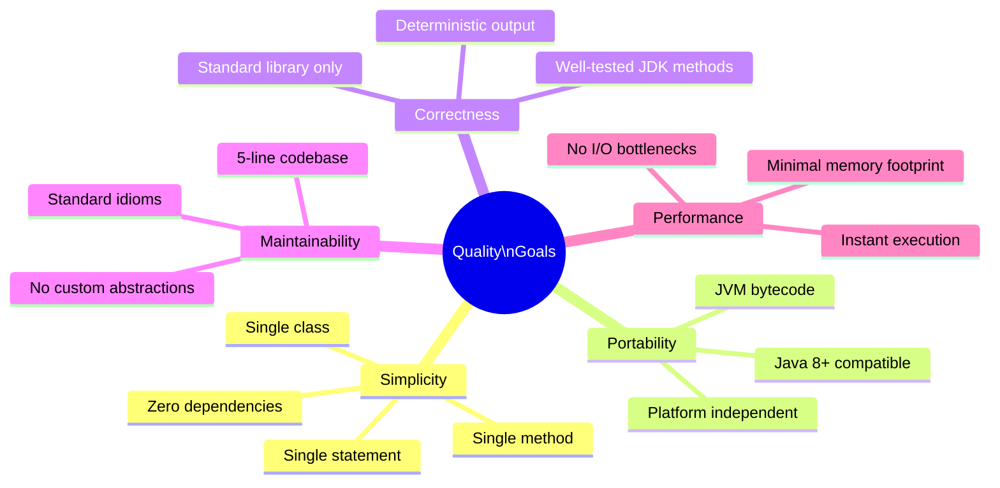

### 10.2 Quality Scenarios

| ID | Quality Attribute | Scenario | Response Measure |
|----|------------------|----------|-----------------|
| QS-1 | **Correctness** | User runs `java HelloWorld` on any Java 8+ JVM | Output is exactly `"Hello World\n"`, exit code `0` |
| QS-2 | **Portability** | Developer runs the program on Linux, macOS, and Windows | Identical behavior on all platforms |
| QS-3 | **Simplicity** | New Java developer reads the source code | Fully understood in < 5 seconds |
| QS-4 | **Performance** | User executes the program | JVM starts and output appears within 500 ms on modern hardware |
| QS-5 | **Maintainability** | Developer needs to change the output string | Single character change in one source file, one recompile |

### 10.3 Code Metrics

| Metric | Value | Assessment |
|--------|-------|------------|
| Lines of Code (LoC) | 5 | ✅ Minimal |
| Cyclomatic Complexity | 1 | ✅ No branching |
| Number of Classes | 1 | ✅ Single responsibility |
| Number of Methods | 1 | ✅ Single entry point |
| External Dependencies | 0 | ✅ Zero dependency risk |
| Test Coverage | 0% | ⚠️ No tests exist |
| Javadoc Coverage | 0% | ⚠️ No documentation comments |

---

## 11. Risks and Technical Debt

### 11.1 Risk Register

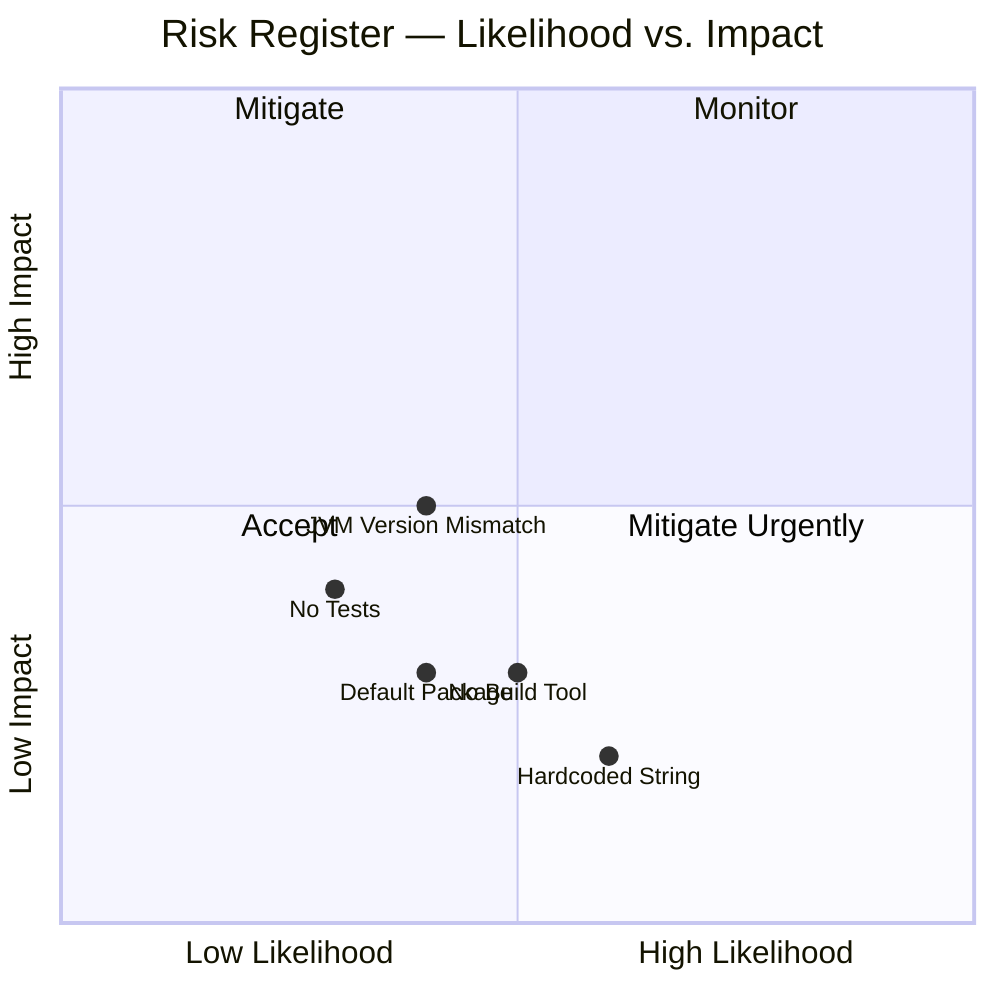

| ID | Risk | Likelihood | Impact | Mitigation |
|----|------|-----------|--------|-----------|
| R-1 | **No automated tests** — regressions cannot be detected automatically | Medium | Low | Add JUnit 5 test asserting stdout output |
| R-2 | **No build tool** — adding any dependency requires full build migration | Medium | Medium | Introduce Maven or Gradle if the project evolves |
| R-3 | **JVM version mismatch** — class compiled with a newer JDK may not run on older JRE | Medium | Medium | Pin Java version in CI; use `--release` flag with `javac` |
| R-4 | **Hardcoded output string** — changing the message requires recompilation | High | Low | Acceptable for current scope; externalize if needed |
| R-5 | **Default package** — prevents the class from being imported or reused as a library | Medium | Low | Move to named package if project grows |
| R-6 | **No CI pipeline defined** — `.github/` exists but workflow may not be configured | Low | Medium | Add a `build.yml` GitHub Actions workflow |

### 11.2 Technical Debt

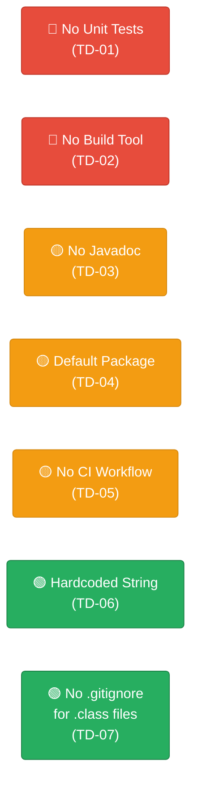

| ID | Technical Debt Item | Severity | Effort to Fix | Notes |
|----|-------------------|----------|--------------|-------|
| TD-01 | No unit tests | 🔴 High | Low | Add `HelloWorldTest.java` with JUnit 5 |
| TD-02 | No build automation | 🔴 High | Medium | Add `pom.xml` (Maven) or `build.gradle` (Gradle) |
| TD-03 | No Javadoc comments | 🟡 Medium | Low | Add class/method Javadoc |
| TD-04 | Default (unnamed) package | 🟡 Medium | Low | Move to `com.example.helloworld` package |
| TD-05 | No CI/CD pipeline | 🟡 Medium | Low | Add `.github/workflows/build.yml` |
| TD-06 | Hardcoded output string | 🟢 Low | Low | Externalize to constant or config |
| TD-07 | No `.gitignore` for `.class` files | 🟢 Low | Trivial | Add `*.class` to `.gitignore` |

### 11.3 Recommended Improvement Roadmap

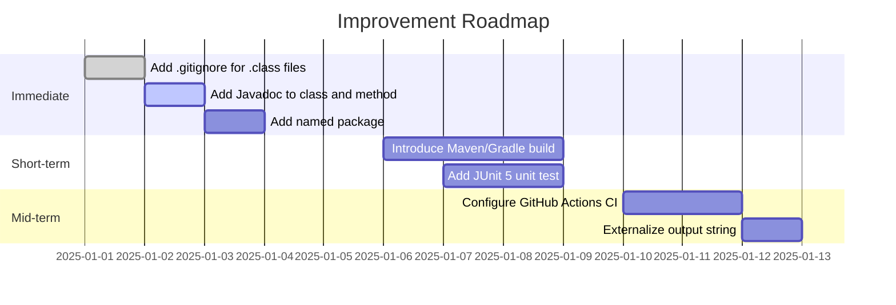

---

## 12. Glossary

| Term | Definition |
|------|-----------|
| **Arc42** | A template for software architecture documentation, structured in 12 sections. |
| **Bytecode** | The intermediate, platform-independent compiled output of the Java compiler (`javac`), stored in `.class` files. |
| **CI/CD** | Continuous Integration / Continuous Delivery — automated pipelines for building, testing, and deploying software. |
| **classpath** | The list of locations (directories, JARs) the JVM searches when loading class files. |
| **Default package** | The unnamed package in Java used when no `package` declaration is present. Classes in the default package cannot be imported by named packages. |
| **Entry point** | The method the JVM invokes to start program execution: `public static void main(String[] args)`. |
| **fd (file descriptor)** | A low-level OS handle for an I/O stream. `stdout` is file descriptor `1`. |
| **GitHub Actions** | A CI/CD platform integrated into GitHub, configured via YAML workflow files in `.github/workflows/`. |
| **Hello World** | A traditional first program that demonstrates the minimal syntax and runtime requirements of a programming language. |
| **HelloWorld** | The single Java class in this repository, containing the `main` method. |
| **JDK** | Java Development Kit — includes the Java compiler (`javac`), the JRE, and developer tools. |
| **JRE** | Java Runtime Environment — includes the JVM and standard libraries needed to run compiled Java programs. |
| **JVM** | Java Virtual Machine — the runtime engine that executes Java bytecode. Provides platform independence. |
| **`javac`** | The Java compiler, included in the JDK. Compiles `.java` source files to `.class` bytecode files. |
| **`main` method** | See "Entry point". |
| **PrintStream** | A Java class (`java.io.PrintStream`) providing `print` and `println` methods. `System.out` is an instance of `PrintStream`. |
| **stdout** | Standard output — the default output stream for a process (file descriptor 1). Used by `System.out` in Java. |
| **`System.out`** | A static field of `java.lang.System` of type `PrintStream`, connected to the process's standard output stream. |
| **`System.out.println`** | Writes the given string followed by a newline character to stdout, then flushes the buffer. |
| **Technical Debt** | The implied cost of future rework caused by choosing an expedient but non-optimal solution now. |

---

*Documentation generated by the Arc42 Documentation Generator.*  
*Based on source analysis of `HelloWorld.java` and `README.md` in repository `copilot-test-ktruchcz`.*
