# Architecture Documentation (Arc42)

**Project**: copilot-test-ktruchcz — Hello World  
**Version**: 1.1.0  
**Date**: 2025-07-14  
**Generated by**: Arc42 Documentation Generator  
**Repository**: [github.com/ktruchcz/copilot-test-ktruchcz](https://github.com/ktruchcz/copilot-test-ktruchcz)

---

## Table of Contents

1. [Introduction and Goals](#1-introduction-and-goals)
2. [Architecture Constraints](#2-architecture-constraints)
3. [System Scope and Context](#3-system-scope-and-context)
4. [Solution Strategy](#4-solution-strategy)
5. [Building Block View](#5-building-block-view)
6. [Runtime View](#6-runtime-view)
7. [Deployment View](#7-deployment-view)
8. [Cross-cutting Concepts](#8-cross-cutting-concepts)
9. [Architecture Decisions](#9-architecture-decisions)
10. [Quality Requirements](#10-quality-requirements)
11. [Risks and Technical Debts](#11-risks-and-technical-debts)
12. [Glossary](#12-glossary)

---

## 1. Introduction and Goals

### 1.1 Requirements Overview

`copilot-test-ktruchcz` is a minimal Java console application whose sole purpose is to print the text **"Hello World"** to the standard output stream when executed. It serves two distinct purposes:

1. **Environment verification** — A canonical starting point for confirming that a Java development and runtime environment is correctly configured.
2. **Copilot/AI tooling sandbox** — A deliberately minimal, well-understood baseline repository used to experiment with and evaluate GitHub Copilot agent capabilities, including automated code analysis, documentation generation, UML synthesis, and architecture review. The presence of agent definition files under `.github/agents/` confirms this second purpose.

**Functional requirements:**

| ID    | Requirement | Priority |
|-------|-------------|----------|
| FR-01 | The system SHALL print the string `Hello World` followed by a newline to stdout when invoked. | Must-have |
| FR-02 | The system SHALL exit with code `0` after successful output. | Must-have |
| FR-03 | The system SHALL accept (and silently ignore) any command-line arguments passed to it. | Should-have |

### 1.2 Quality Goals

The following top-level quality goals drive the architectural decisions of this system:

| Priority | Quality Goal | Motivation |
|----------|-------------|------------|
| 1 | **Simplicity** | The application must be understandable at a glance — a single class, a single method, a single statement. |
| 2 | **Portability** | The application must run on any platform with a compatible JRE, with zero platform-specific code. |
| 3 | **Reproducibility** | Given the same JDK version, every build and run must produce identical, deterministic output. |
| 4 | **Minimal Footprint** | No external libraries, no build scripts, no configuration files beyond what the tooling sandbox requires. |
| 5 | **Analysability** | The codebase must be straightforward enough for AI/Copilot agents to analyse, document, and reason about accurately. |

### 1.3 Stakeholders

| Role | Name / Group | Expectations |
|------|-------------|--------------|
| Developer / Owner | `ktruchcz` | A working Java environment baseline; a controlled sandbox for evaluating GitHub Copilot agent workflows. |
| AI / Copilot Agents | GitHub Copilot (`arc42-documentor`, `uml-generator`, `code-assessor`, etc.) | A valid, compilable Java source file to analyse, document, and generate artefacts from. |
| CI / Automation | GitHub Actions runners | A compilable Java source and valid repository structure for automated checks. |
| Technical Reviewer | Any architect or developer | A clear, self-explanatory example of a minimal Java program with complete Arc42 documentation. |

---

## 2. Architecture Constraints

### 2.1 Technical Constraints

| ID    | Constraint | Rationale |
|-------|-----------|-----------|
| TC-01 | **Language: Java** | The source file is written in Java (`HelloWorld.java`). All tooling must support Java source analysis. |
| TC-02 | **No build tool** | There is no `pom.xml`, `build.gradle`, or `Makefile`. Compilation relies on the `javac` command directly. |
| TC-03 | **No external dependencies** | Only classes from `java.lang` (auto-imported) are used. No third-party JARs are required. |
| TC-04 | **JDK ≥ 1.0** | `System.out.println` and a static `main` entry point have been valid since Java 1.0. The application places no lower bound above that. |
| TC-05 | **Single source file** | The entire application resides in one file: `HelloWorld.java`. |
| TC-06 | **Console / CLI only** | No GUI, no web interface, no network socket — output is exclusively to `stdout`. |
| TC-07 | **Bytecode excluded from VCS** | The `.gitignore` file explicitly excludes `*.class` bytecode files from version control. |

### 2.2 Organizational Constraints

| ID    | Constraint | Rationale |
|-------|-----------|-----------|
| OC-01 | **Public GitHub repository** | Code is version-controlled on GitHub and is publicly visible. |
| OC-02 | **No test suite** | No unit or integration tests exist in the repository. |
| OC-03 | **No CI/CD workflow defined** | No `.github/workflows/` directory is present; no automated build or test pipeline runs on push. Builds and test executions are currently manual. |
| OC-04 | **GitHub Copilot agent infrastructure present** | The `.github/agents/` directory contains 11 agent definition files (e.g., `arc42-documentor.agent.md`, `uml-generator.agent.md`). This infrastructure is reserved for AI-driven analysis and is not part of the application's runtime. |

### 2.3 Conventions

| Convention | Details |
|-----------|---------|
| **Naming** | Class name `HelloWorld` matches file name `HelloWorld.java` (required by Java specification). |
| **Encoding** | UTF-8 source encoding (default for modern JDKs). |
| **Entry point** | Standard Java entry point signature: `public static void main(String[] args)`. |
| **Line separator** | `System.out.println` uses the platform-specific line separator (OS-aware). |

---

## 3. System Scope and Context

### 3.1 Business Context

The Hello World application sits entirely within the boundary of a single JVM process. It receives no external input and produces a single line of text on the standard output. The diagram below shows both the application system boundary and the surrounding GitHub / Copilot tooling context.

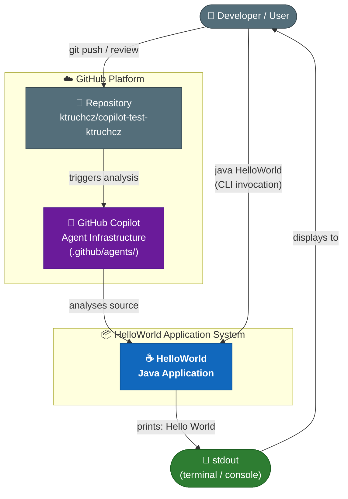
```mermaid
graph TB
    classDef system fill:#1168BD,stroke:#0B4884,color:#fff,font-weight:bold
    classDef external fill:#546E7A,stroke:#37474F,color:#fff
    classDef io fill:#2E7D32,stroke:#1B5E20,color:#fff
    classDef copilot fill:#6A1B9A,stroke:#4A148C,color:#fff

    User(["👤 Developer / User"]):::external

    subgraph GitHubPlatform["☁️ GitHub Platform"]
        Repo["📁 Repository\nktruchcz/copilot-test-ktruchcz"]:::external
        Copilot["🤖 GitHub Copilot\nAgent Infrastructure\n(.github/agents/)"]:::copilot
    end

    subgraph AppSystem["📦 HelloWorld Application System"]
        App["☕ HelloWorld\nJava Application"]:::system
    end

    Stdout(["📄 stdout\n(terminal / console)"]):::io

    User -->|"git push / review"| Repo
    Repo -->|"triggers analysis"| Copilot
    Copilot -->|"analyses source"| App
    User -->|"java HelloWorld\n(CLI invocation)"| App
    App -->|"prints: Hello World"| Stdout
    Stdout -->|"displays to"| User
```

### 3.2 C4 System Context Diagram

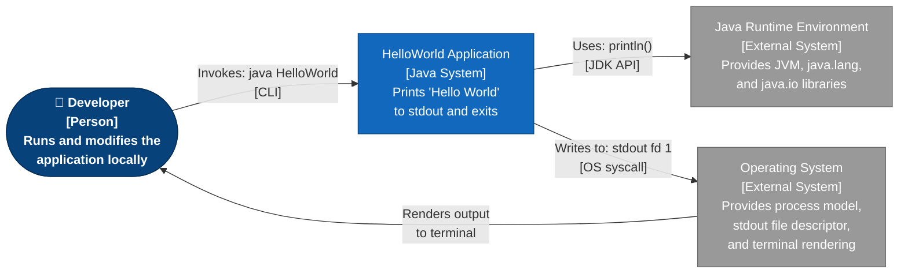
```mermaid
graph LR
    classDef person fill:#08427B,stroke:#052E56,color:#fff,font-weight:bold
    classDef system fill:#1168BD,stroke:#0B4884,color:#fff
    classDef external fill:#999999,stroke:#6B6B6B,color:#fff

    Dev(["👤 Developer\n[Person]\nRuns and modifies the\napplication locally"]):::person

    App["HelloWorld Application\n[Java System]\nPrints 'Hello World'\nto stdout and exits"]:::system

    JRE["Java Runtime Environment\n[External System]\nProvides JVM, java.lang,\nand java.io libraries"]:::external
    OS["Operating System\n[External System]\nProvides process model,\nstdout file descriptor,\nand terminal rendering"]:::external

    Dev -->|"Invokes: java HelloWorld\n[CLI]"| App
    App -->|"Uses: println()\n[JDK API]"| JRE
    App -->|"Writes to: stdout fd 1\n[OS syscall]"| OS
    OS -->|"Renders output\nto terminal"| Dev
```

### 3.3 Technical Context

The following diagram shows the technical infrastructure context — the toolchain required to compile and execute the application.

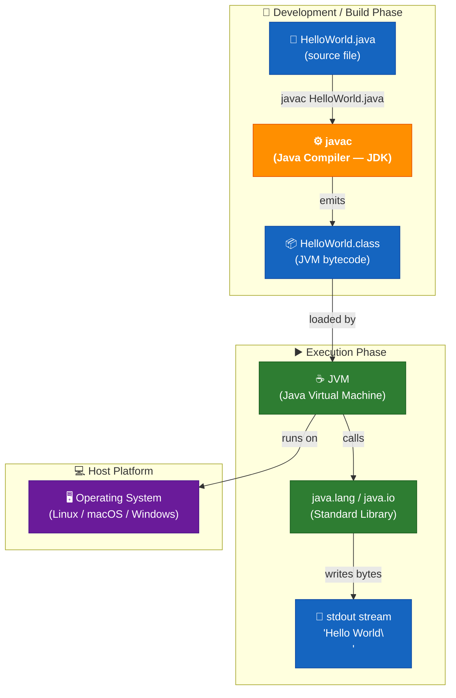
```mermaid
graph TB
    classDef tool fill:#FF8F00,stroke:#E65100,color:#fff,font-weight:bold
    classDef artifact fill:#1565C0,stroke:#0D47A1,color:#fff
    classDef runtime fill:#2E7D32,stroke:#1B5E20,color:#fff
    classDef os fill:#6A1B9A,stroke:#4A148C,color:#fff

    subgraph dev["🔧 Development / Build Phase"]
        src["📄 HelloWorld.java\n(source file)"]:::artifact
        javac["⚙️ javac\n(Java Compiler — JDK)"]:::tool
        class_file["📦 HelloWorld.class\n(JVM bytecode)"]:::artifact
    end

    subgraph exec["▶️ Execution Phase"]
        jvm["☕ JVM\n(Java Virtual Machine)"]:::runtime
        stdlib["java.lang / java.io\n(Standard Library)"]:::runtime
        stdout["📄 stdout stream\n'Hello World\\n'"]:::artifact
    end

    subgraph platform["💻 Host Platform"]
        os["🖥️ Operating System\n(Linux / macOS / Windows)"]:::os
    end

    src -->|"javac HelloWorld.java"| javac
    javac -->|"emits"| class_file
    class_file -->|"loaded by"| jvm
    jvm -->|"calls"| stdlib
    stdlib -->|"writes bytes"| stdout
    jvm -->|"runs on"| os
```

### 3.4 External Interfaces

| Interface | Direction | Protocol / Mechanism | Description |
|-----------|-----------|----------------------|-------------|
| CLI invocation | Input | OS process spawn (`java HelloWorld`) | Starts the JVM and passes control to `main()`. |
| Standard Output | Output | `java.io.PrintStream` (`System.out`) | Delivers the string `Hello World\n` to the calling terminal. |
| Exit code | Output | OS process exit code (`0`) | Implicit successful termination after `main()` returns. |
| Command-line arguments | Input (unused) | JVM `args[]` parameter | Accepted by the `main` signature but not read or processed. |

---

## 4. Solution Strategy

### 4.1 Technology Decisions

| Decision | Choice | Rationale |
|---------|--------|-----------|
| **Programming Language** | Java | Widely known, platform-independent via JVM, requires zero runtime setup beyond a standard JRE. |
| **No framework** | Plain `java.lang` only | The requirement is trivially fulfilled by a single `println` call; a framework would be disproportionate overhead. |
| **No build tool** | Raw `javac` | Eliminates all dependency management, wrapper scripts, and configuration files for a single-file project. |
| **No dependencies** | Zero external JARs | `System.out.println` is part of the Java standard library, available on every conforming JRE. |
| **No test infrastructure** | None | The risk-to-benefit ratio of testing a single deterministic `println` call does not justify a test framework. |

### 4.2 Top-Level Decomposition Strategy

The application deliberately adopts a **single-class, single-method** architecture:

- **One class** (`HelloWorld`) — collocates all logic in one compilation unit.
- **One method** (`main`) — the JVM entry point; no helper methods are needed.
- **One statement** (`System.out.println(...)`) — directly satisfies FR-01.

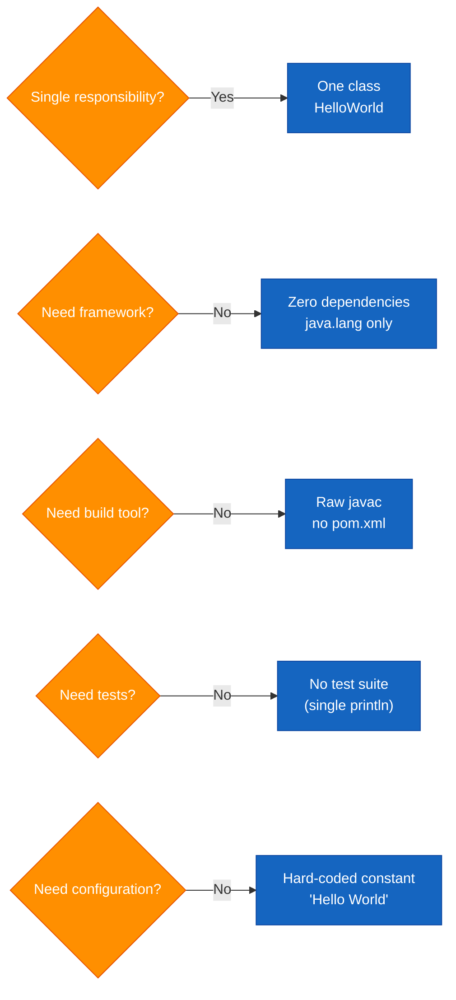
```mermaid
flowchart LR
    classDef decision fill:#FF8F00,stroke:#E65100,color:#fff
    classDef result fill:#1565C0,stroke:#0D47A1,color:#fff

    Q1{"Single responsibility?"}:::decision -->|Yes| R1["One class\nHelloWorld"]:::result
    Q2{"Need framework?"}:::decision -->|No| R2["Zero dependencies\njava.lang only"]:::result
    Q3{"Need build tool?"}:::decision -->|No| R3["Raw javac\nno pom.xml"]:::result
    Q4{"Need tests?"}:::decision -->|No| R4["No test suite\n(single println)"]:::result
    Q5{"Need configuration?"}:::decision -->|No| R5["Hard-coded constant\n'Hello World'"]:::result
```

### 4.3 Approach to Quality Goals

| Quality Goal | Strategy |
|-------------|---------|
| **Simplicity** | Absolute minimum code — 5 lines including braces. No abstractions, no layers. |
| **Portability** | Rely only on `java.lang`, which is guaranteed on every JRE across all supported platforms. |
| **Reproducibility** | No mutable state, no I/O sources, no randomness → fully deterministic output on every invocation. |
| **Minimal Footprint** | No configuration files, no dependencies, no generated files committed to the repository. |
| **Analysability** | Clear naming, standard idioms, and zero hidden logic make the code trivially understandable by both humans and AI agents. |

---

## 5. Building Block View

### 5.1 Level 1 — System Whitebox

The entire system is a single deployable unit: one compiled Java class.

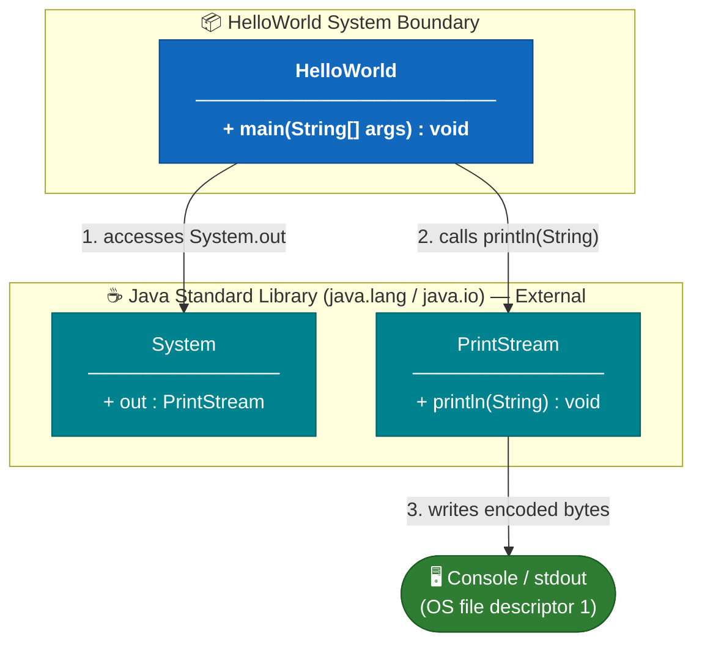
```mermaid
graph TB
    classDef system fill:#1168BD,stroke:#0B4884,color:#fff,font-weight:bold
    classDef stdlib fill:#00838F,stroke:#006064,color:#fff
    classDef io fill:#2E7D32,stroke:#1B5E20,color:#fff

    subgraph HelloWorldSystem["📦 HelloWorld System Boundary"]
        HW["HelloWorld\n──────────────────────\n+ main(String[] args) : void"]:::system
    end

    subgraph JDK["☕ Java Standard Library  (java.lang / java.io)  — External"]
        SysOut["System\n──────────────\n+ out : PrintStream"]:::stdlib
        PS["PrintStream\n──────────────\n+ println(String) : void"]:::stdlib
    end

    Console(["🖥️ Console / stdout\n(OS file descriptor 1)"]):::io

    HW -->|"1. accesses System.out"| SysOut
    HW -->|"2. calls println(String)"| PS
    PS -->|"3. writes encoded bytes"| Console
```

**Contained Building Blocks:**

| Block | Responsibility | Source |
|-------|---------------|--------|
| `HelloWorld` | Application entry point; orchestrates the single output operation. | `HelloWorld.java` (in-scope) |
| `java.lang.System` *(external)* | Exposes the static `out` field pointing to the process stdout stream. | JDK standard library (out-of-scope) |
| `java.io.PrintStream` *(external)* | Handles text encoding, buffering, and OS-level byte writes to stdout. | JDK standard library (out-of-scope) |

### 5.2 Level 2 — HelloWorld Class Whitebox

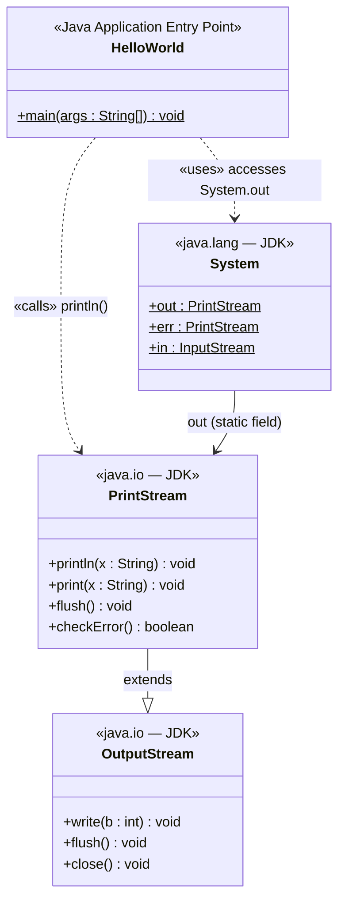
```mermaid
classDiagram
    direction TB

    class HelloWorld {
        <<Java Application Entry Point>>
        +main(args : String[]) void$
    }

    class System {
        <<java.lang — JDK>>
        +out : PrintStream$
        +err : PrintStream$
        +in : InputStream$
    }

    class PrintStream {
        <<java.io — JDK>>
        +println(x : String) void
        +print(x : String) void
        +flush() void
        +checkError() boolean
    }

    class OutputStream {
        <<java.io — JDK>>
        +write(b : int) void
        +flush() void
        +close() void
    }

    HelloWorld ..> System : «uses» accesses System.out
    HelloWorld ..> PrintStream : «calls» println()
    System --> PrintStream : out (static field)
    PrintStream --|> OutputStream : extends
```

**Method inventory:**

| Class | Method | Modifier | Return | Description |
|-------|--------|----------|--------|-------------|
| `HelloWorld` | `main(String[] args)` | `public static` | `void` | JVM entry point. Calls `System.out.println("Hello World")` then returns, causing JVM to exit with code 0. |

### 5.3 Level 3 — Statement-Level Execution Flow

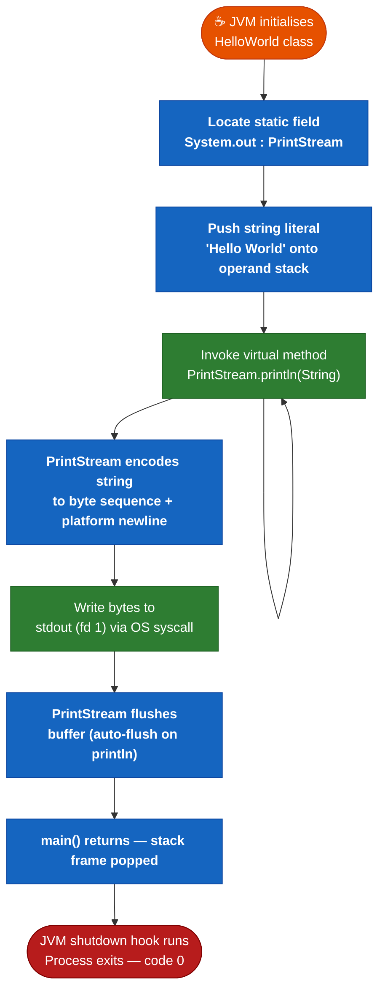
```mermaid
flowchart TD
    classDef step fill:#1565C0,stroke:#0D47A1,color:#fff,font-weight:bold
    classDef io fill:#2E7D32,stroke:#1B5E20,color:#fff
    classDef term fill:#B71C1C,stroke:#7F0000,color:#fff
    classDef jvm fill:#E65100,stroke:#BF360C,color:#fff

    A(["☕ JVM initialises\nHelloWorld class"]):::jvm
    B["Locate static field\nSystem.out : PrintStream"]:::step
    C["Push string literal\n'Hello World' onto operand stack"]:::step
    D["Invoke virtual method\nPrintStream.println(String)"]:::io
    E["PrintStream encodes string\nto byte sequence + platform newline"]:::step
    F["Write bytes to\nstdout (fd 1) via OS syscall"]:::io
    G["PrintStream flushes\nbuffer (auto-flush on println)"]:::step
    H["main() returns — stack frame popped"]:::step
    I(["JVM shutdown hook runs\nProcess exits — code 0"]):::term

    A --> B --> C --> D --> D --> E --> F --> G --> H --> I
```

### 5.4 Repository Structure

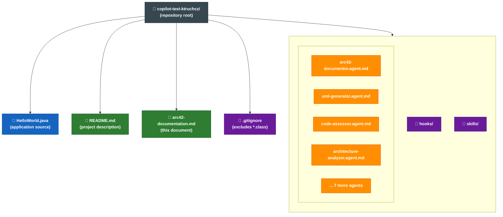
```mermaid
graph TD
    classDef root fill:#37474F,stroke:#263238,color:#fff,font-weight:bold
    classDef src fill:#1565C0,stroke:#0D47A1,color:#fff
    classDef config fill:#6A1B9A,stroke:#4A148C,color:#fff
    classDef doc fill:#2E7D32,stroke:#1B5E20,color:#fff
    classDef agent fill:#FF8F00,stroke:#E65100,color:#fff

    Root["📁 copilot-test-ktruchcz/\n(repository root)"]:::root

    HW["📄 HelloWorld.java\n(application source)"]:::src
    README["📄 README.md\n(project description)"]:::doc
    ARC42["📄 arc42-documentation.md\n(this document)"]:::doc
    GITIGNORE["📄 .gitignore\n(excludes *.class)"]:::config

    subgraph GH["📁 .github/"]
        direction TB
        subgraph Agents["📁 agents/  (11 agent definitions)"]
            A1["arc42-documentor.agent.md"]:::agent
            A2["uml-generator.agent.md"]:::agent
            A3["code-assessor.agent.md"]:::agent
            A4["architecture-analyzer.agent.md"]:::agent
            A5["... 7 more agents"]:::agent
        end
        Hooks["📁 hooks/"]:::config
        Skills["📁 skills/"]:::config
    end

    Root --> HW
    Root --> README
    Root --> ARC42
    Root --> GITIGNORE
    Root --> GH
```

---

## 6. Runtime View

### 6.1 Scenario 1 — Normal Execution (Happy Path)

The primary (and only) runtime scenario: a user invokes the application from the command line.

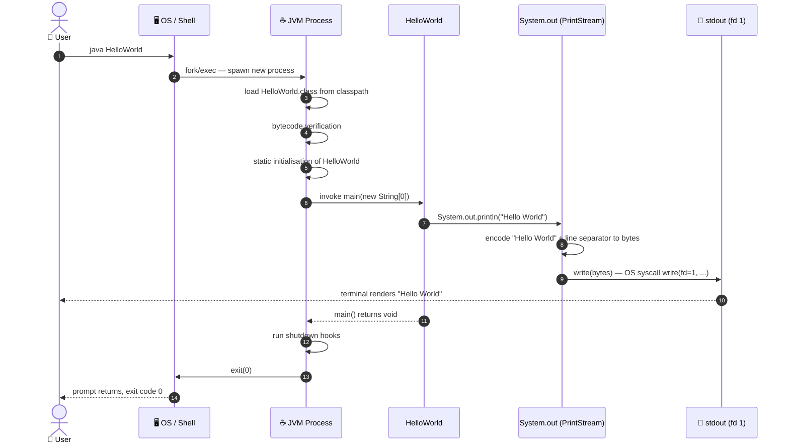
```mermaid
sequenceDiagram
    autonumber
    actor User as 👤 User
    participant OS as 🖥️ OS / Shell
    participant JVM as ☕ JVM Process
    participant HW as HelloWorld
    participant Sysout as System.out (PrintStream)
    participant Console as 📄 stdout (fd 1)

    User->>OS: java HelloWorld
    OS->>JVM: fork/exec — spawn new process
    JVM->>JVM: load HelloWorld.class from classpath
    JVM->>JVM: bytecode verification
    JVM->>JVM: static initialisation of HelloWorld
    JVM->>HW: invoke main(new String[0])
    HW->>Sysout: System.out.println("Hello World")
    Sysout->>Sysout: encode "Hello World" + line separator to bytes
    Sysout->>Console: write(bytes) — OS syscall write(fd=1, ...)
    Console-->>User: terminal renders "Hello World"
    HW-->>JVM: main() returns void
    JVM->>JVM: run shutdown hooks
    JVM->>OS: exit(0)
    OS-->>User: prompt returns, exit code 0
```

### 6.2 Scenario 2 — Execution with Command-Line Arguments

The `main` method accepts `String[] args`, but the current implementation ignores them entirely. Passing arguments has no effect on the output.

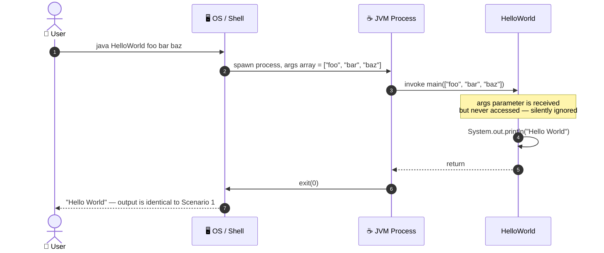
```mermaid
sequenceDiagram
    autonumber
    actor User as 👤 User
    participant OS as 🖥️ OS / Shell
    participant JVM as ☕ JVM Process
    participant HW as HelloWorld

    User->>OS: java HelloWorld foo bar baz
    OS->>JVM: spawn process, args array = ["foo", "bar", "baz"]
    JVM->>HW: invoke main(["foo", "bar", "baz"])
    Note over HW: args parameter is received<br/>but never accessed — silently ignored
    HW->>HW: System.out.println("Hello World")
    HW-->>JVM: return
    JVM->>OS: exit(0)
    OS-->>User: "Hello World" — output is identical to Scenario 1
```

### 6.3 Scenario 3 — Missing Class File (Error Path)

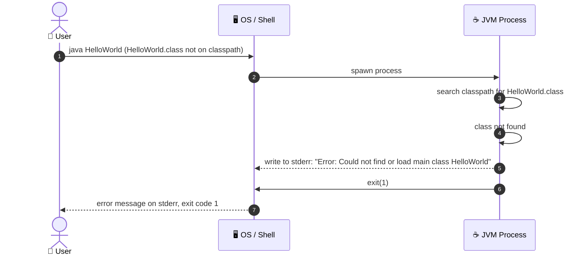
```mermaid
sequenceDiagram
    autonumber
    actor User as 👤 User
    participant OS as 🖥️ OS / Shell
    participant JVM as ☕ JVM Process

    User->>OS: java HelloWorld (HelloWorld.class not on classpath)
    OS->>JVM: spawn process
    JVM->>JVM: search classpath for HelloWorld.class
    JVM->>JVM: class not found
    JVM-->>OS: write to stderr: "Error: Could not find or load main class HelloWorld"
    JVM->>OS: exit(1)
    OS-->>User: error message on stderr, exit code 1
```

### 6.4 Scenario 4 — Copilot Agent Analysis (Non-Runtime)

This scenario describes how the GitHub Copilot agents interact with the repository — not a runtime flow, but a key operational scenario given the repository's second purpose.

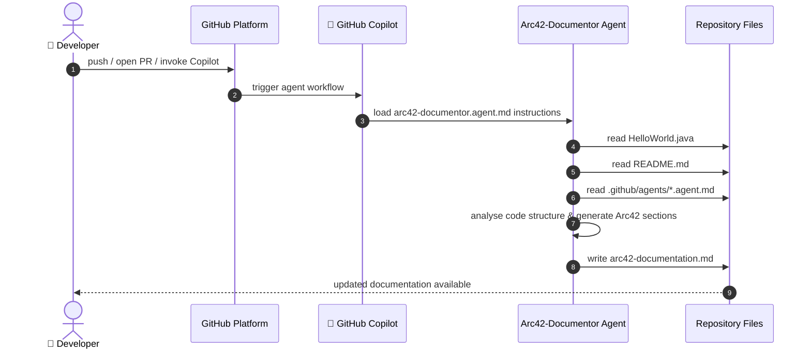
```mermaid
sequenceDiagram
    autonumber
    actor Dev as 👤 Developer
    participant GH as GitHub Platform
    participant Copilot as 🤖 GitHub Copilot
    participant Agent as Arc42-Documentor Agent
    participant Repo as Repository Files

    Dev->>GH: push / open PR / invoke Copilot
    GH->>Copilot: trigger agent workflow
    Copilot->>Agent: load arc42-documentor.agent.md instructions
    Agent->>Repo: read HelloWorld.java
    Agent->>Repo: read README.md
    Agent->>Repo: read .github/agents/*.agent.md
    Agent->>Agent: analyse code structure & generate Arc42 sections
    Agent->>Repo: write arc42-documentation.md
    Repo-->>Dev: updated documentation available
```

### 6.5 Application Lifecycle State Machine

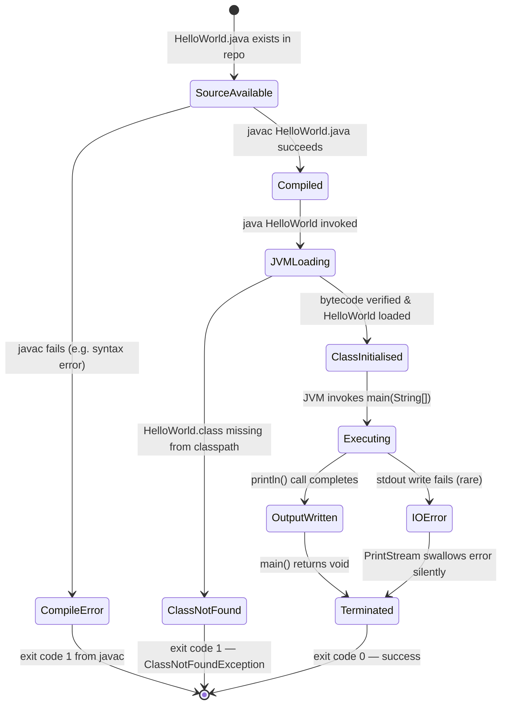
```mermaid
stateDiagram-v2
    [*] --> SourceAvailable : HelloWorld.java exists in repo

    SourceAvailable --> Compiled : javac HelloWorld.java succeeds
    SourceAvailable --> CompileError : javac fails (e.g. syntax error)
    CompileError --> [*] : exit code 1 from javac

    Compiled --> JVMLoading : java HelloWorld invoked
    JVMLoading --> ClassInitialised : bytecode verified & HelloWorld loaded
    JVMLoading --> ClassNotFound : HelloWorld.class missing from classpath
    ClassNotFound --> [*] : exit code 1 — ClassNotFoundException

    ClassInitialised --> Executing : JVM invokes main(String[])
    Executing --> OutputWritten : println() call completes
    OutputWritten --> Terminated : main() returns void

    Executing --> IOError : stdout write fails (rare)
    IOError --> Terminated : PrintStream swallows error silently

    Terminated --> [*] : exit code 0 — success
```

---

## 7. Deployment View

### 7.1 Infrastructure Overview

Because the application is a single compiled class with zero external dependencies, the deployment topology is the simplest possible: any host machine with a JRE installed.

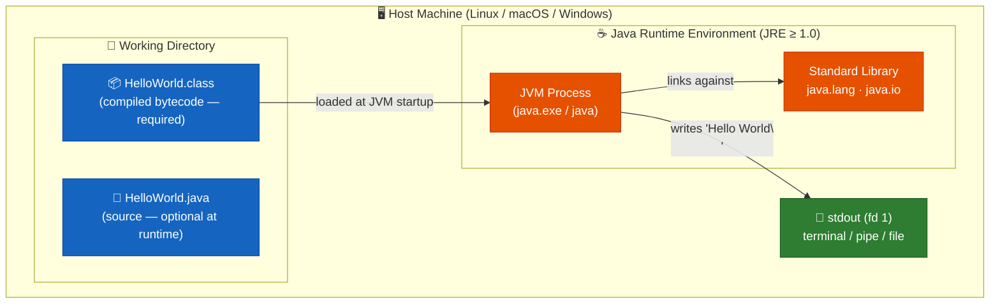
```mermaid
graph TB
    classDef machine fill:#37474F,stroke:#263238,color:#fff,font-weight:bold
    classDef jre fill:#E65100,stroke:#BF360C,color:#fff
    classDef artifact fill:#1565C0,stroke:#0D47A1,color:#fff
    classDef fs fill:#4A148C,stroke:#311B92,color:#fff
    classDef io fill:#2E7D32,stroke:#1B5E20,color:#fff

    subgraph HostMachine["🖥️ Host Machine (Linux / macOS / Windows)"]
        subgraph FileSystem["📁 Working Directory"]
            sourceFile["📄 HelloWorld.java\n(source — optional at runtime)"]:::artifact
            classFile["📦 HelloWorld.class\n(compiled bytecode — required)"]:::artifact
        end

        subgraph JRE["☕ Java Runtime Environment (JRE ≥ 1.0)"]
            JVM["JVM Process\n(java.exe / java)"]:::jre
            StdLib["Standard Library\njava.lang · java.io"]:::jre
        end

        Terminal["📄 stdout (fd 1)\nterminal / pipe / file"]:::io
    end

    classFile -->|"loaded at JVM startup"| JVM
    JVM -->|"links against"| StdLib
    JVM -->|"writes 'Hello World\\n'"| Terminal
```

### 7.2 Build and Deployment Pipeline


```mermaid
flowchart LR
    classDef src fill:#1B5E20,stroke:#155724,color:#fff,font-weight:bold
    classDef tool fill:#E65100,stroke:#BF360C,color:#fff,font-weight:bold
    classDef out fill:#1565C0,stroke:#0D47A1,color:#fff
    classDef run fill:#FF8F00,stroke:#E65100,color:#fff

    src["📄 HelloWorld.java\n(source)"]:::src
    javac["⚙️ javac\n(JDK compiler)"]:::tool
    bytecode["📦 HelloWorld.class\n(bytecode artifact)"]:::out
    jvm["▶️ java HelloWorld\n(JVM execution)"]:::run
    output(["📺 'Hello World'\n(stdout)"])

    src -->|"Step 1:\njavac HelloWorld.java"| javac
    javac -->|"Step 2:\nproduces .class"| bytecode
    bytecode -->|"Step 3:\njava HelloWorld"| jvm
    jvm -->|"Step 4:\nSystem.out.println"| output
```

### 7.3 Deployment Variants

| Variant | Description | Command Sequence |
|---------|-------------|-----------------|
| **Local (developer)** | Compile and run on developer workstation with JDK installed. | `javac HelloWorld.java` → `java HelloWorld` |
| **GitHub Actions CI** | Any Ubuntu/macOS/Windows runner using `actions/setup-java`. | `uses: actions/setup-java` → `run: javac HelloWorld.java` → `run: java HelloWorld` |
| **Docker container** | Any image based on `openjdk` or `eclipse-temurin`. | `COPY HelloWorld.java /app/` → `RUN javac HelloWorld.java` → `CMD ["java","-cp","/app","HelloWorld"]` |
| **GraalVM native-image** | Compile to a native binary; eliminates JVM startup overhead. | `native-image HelloWorld` → `./helloworld` |

### 7.4 Example GitHub Actions Workflow (Recommended)

```yaml
# .github/workflows/build.yml  (not yet present — see TD-03)
name: Build and Run HelloWorld

on: [push, pull_request]

jobs:
  build:
    runs-on: ubuntu-latest
    steps:
      - uses: actions/checkout@v4
      - uses: actions/setup-java@v4
        with:
          java-version: '21'
          distribution: 'temurin'
      - name: Compile
        run: javac HelloWorld.java
      - name: Run
        run: java HelloWorld
      - name: Verify output
        run: java HelloWorld | grep -q "Hello World"
```

### 7.5 Minimum System Requirements

| Requirement | Minimum Value | Notes |
|------------|---------------|-------|
| Java Runtime | JRE 1.0+ | JDK required if compiling from source |
| Disk space (source) | < 1 KB | `HelloWorld.java` |
| Disk space (bytecode) | < 1 KB | `HelloWorld.class` |
| RAM | ~10–30 MB | Dominated by JVM base overhead |
| CPU | Any JVM-supported architecture | x86-64, ARM64, etc. |
| Network | None | Zero network I/O |
| Database | None | No persistence layer |
| OS | Linux, macOS, Windows | Any OS with a JVM port |

---

## 8. Cross-cutting Concepts

### 8.1 Domain Model

The application's domain is deliberately trivial. The entire domain consists of a single immutable greeting.

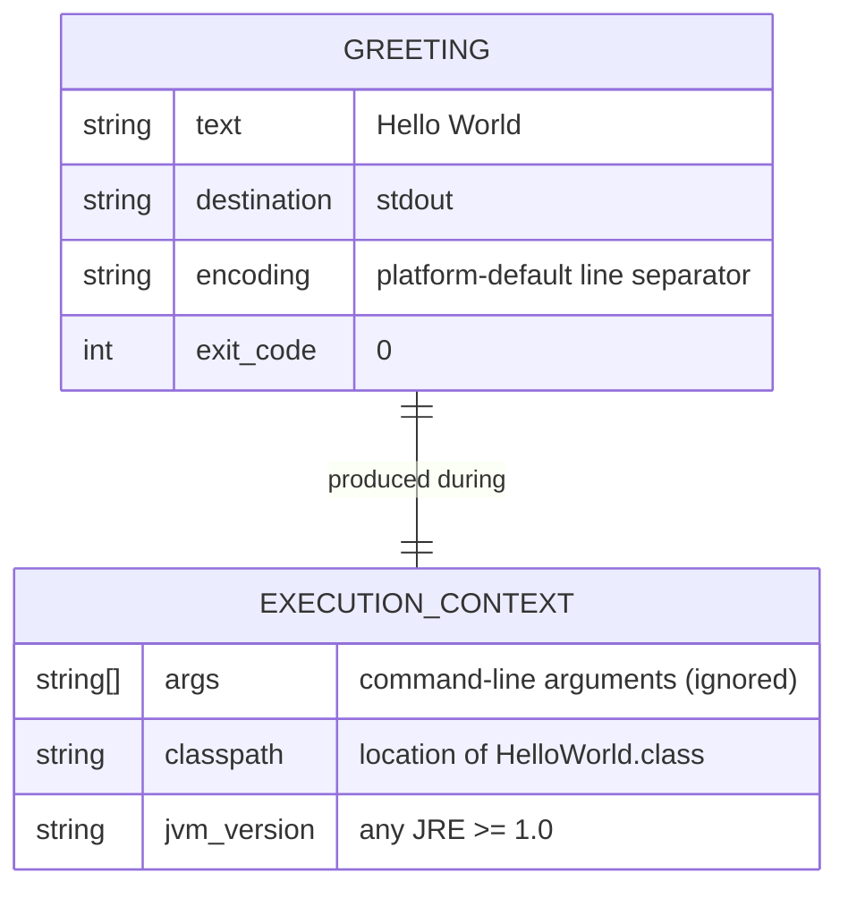
```mermaid
erDiagram
    GREETING {
        string text "Hello World"
        string destination "stdout"
        string encoding "platform-default line separator"
        int exit_code "0"
    }

    EXECUTION_CONTEXT {
        string[] args "command-line arguments (ignored)"
        string classpath "location of HelloWorld.class"
        string jvm_version "any JRE >= 1.0"
    }

    GREETING ||--|| EXECUTION_CONTEXT : "produced during"
```

### 8.2 Output and Logging Concept

| Aspect | Decision | Detail |
|--------|---------|--------|
| **Output channel** | `System.out` | File descriptor 1 (`stdout`). |
| **Output format** | Plain text | `Hello World` followed by the platform line separator (`\n` on Unix/macOS, `\r\n` on Windows). |
| **Output encoding** | Platform default | Determined by the JVM's default charset at startup; ASCII-safe since the string is pure ASCII. |
| **Logging framework** | None | No SLF4J, Log4j2, Logback, or `java.util.logging` is used. |
| **Structured logging** | Not applicable | Single-line, unstructured output. |
| **Log levels** | Not applicable | No severity classification needed. |
| **Stderr usage** | None (by design) | The application writes nothing to `System.err` under normal operation. |

### 8.3 Error Handling Concept

| Error / Exception | Origin | Handling Strategy |
|-------------------|--------|-----------------|
| `ClassNotFoundException` | JVM | Raised before `main()` is entered; not catchable inside the application. JVM writes to stderr and exits with code 1. |
| `IOException` on stdout | `PrintStream` | Silently swallowed — `PrintStream` sets an internal error flag (checkable via `checkError()`); no exception propagates to `main()`. |
| Unexpected `args` content | JVM | The `args` array is accepted but never read; any content is silently ignored. |
| `OutOfMemoryError` | JVM | Extremely unlikely for a single `println`; would result in JVM crash with exit code 1. |

### 8.4 Internationalisation (i18n) and Localisation (l10n)

The output string `"Hello World"` is a compile-time string literal in pure ASCII. There is intentionally no internationalisation or localisation mechanism:

- The string is **not** externalised to a `ResourceBundle` or `.properties` file.
- The string is **not** parameterised by locale.
- The line ending is platform-aware (via `println`) but the message content is fixed.

**Implication**: Any requirement to display the greeting in a different language would necessitate either modifying the source or introducing a resource bundle mechanism.

### 8.5 Security Concept

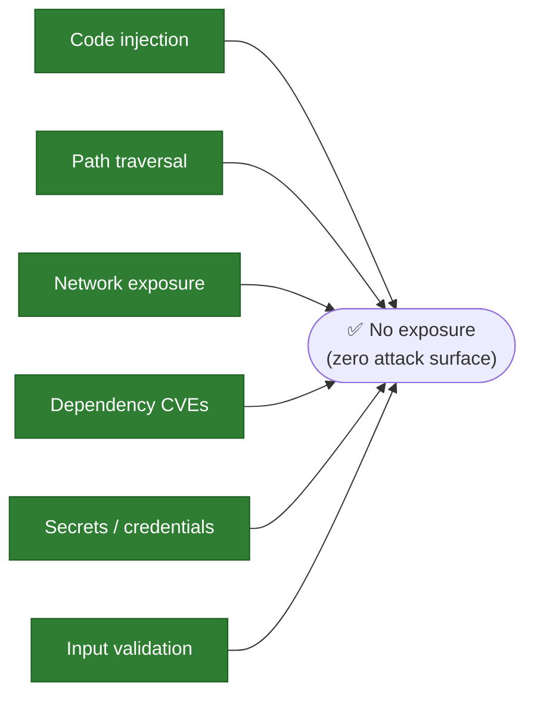
```mermaid
graph LR
    classDef safe fill:#2E7D32,stroke:#1B5E20,color:#fff
    classDef na fill:#546E7A,stroke:#37474F,color:#fff

    I1["Code injection"]:::safe
    I2["Path traversal"]:::safe
    I3["Network exposure"]:::safe
    I4["Dependency CVEs"]:::safe
    I5["Secrets / credentials"]:::safe
    I6["Input validation"]:::safe

    Safe(["✅ No exposure\n(zero attack surface)"])

    I1 --> Safe
    I2 --> Safe
    I3 --> Safe
    I4 --> Safe
    I5 --> Safe
    I6 --> Safe
```

| Threat Vector | Exposure | Justification |
|--------------|---------|---------------|
| Code injection | **None** | No user input is read, parsed, or evaluated. |
| File system access | **None** | No file I/O beyond writing to stdout (fd 1). |
| Network exposure | **None** | No sockets, HTTP, RMI, or JNDI calls. |
| Dependency vulnerabilities | **None** | Zero third-party dependencies; only JDK stdlib. |
| Secrets / credentials | **None** | No authentication, no credentials, no tokens. |
| Reflective access | **None** | No reflection APIs used. |

### 8.6 Design Patterns Applied

| Pattern | Category | Location | Description |
|---------|---------|---------|-------------|
| **Entry Point** | Architectural | `HelloWorld.main()` | Standard Java application entry point — `public static void main(String[] args)`. Mandated by the JVM specification. |
| **Façade** (implicit) | Structural | `System.out` | `System.out` acts as a simplified façade over the underlying `OutputStream` and OS file descriptor. The application does not interact directly with raw streams. |

No additional GoF, enterprise, or architectural patterns are applicable at this scale.

---

## 9. Architecture Decisions

### ADR-001 — Use Java as the Implementation Language

| Field | Value |
|-------|-------|
| **Status** | Accepted |
| **Date** | Project inception |
| **Context** | A minimal demonstration and Copilot sandbox program is needed. The repository owner (`ktruchcz`) requires a compilable Java source file for AI tooling experiments. |
| **Decision** | Implement the Hello World program in Java. |
| **Rationale** | Java is widely adopted, platform-independent via JVM, and universally supported by code analysis and documentation generation tools (including GitHub Copilot). Standard tooling (`javac`, `java`) is freely available on all major platforms without additional installation. |
| **Consequences** | ✅ Platform independence via JVM bytecode. ✅ First-class Copilot/IDE support. ⚠️ Requires a JRE on every target machine. ⚠️ Produces `.class` bytecode, not a native binary — adds JVM startup overhead. |
| **Alternatives considered** | Python (no compilation step, but less relevant to Java Copilot testing), C (native binary, no JVM, but different tooling ecosystem). Both rejected in favour of Java's relevance to enterprise and Copilot contexts. |

---

### ADR-002 — No Build Tool (Raw javac)

| Field | Value |
|-------|-------|
| **Status** | Accepted |
| **Date** | Project inception |
| **Context** | Single-file project with zero external dependencies. |
| **Decision** | Compile directly with `javac`; do not introduce Maven, Gradle, or Ant. |
| **Rationale** | A build tool would add configuration overhead (`pom.xml`, `build.gradle`, wrapper scripts) with zero benefit for a single-class, zero-dependency project. The raw `javac` command is sufficient and keeps the repository structure minimal. |
| **Consequences** | ✅ Zero configuration files. ✅ Simplest possible build process. ⚠️ Classpath management and dependency resolution must be done manually if the project grows. ⚠️ No reproducible build versioning without a build tool. |
| **Alternatives considered** | Maven (standard in enterprise but heavyweight for this scale), Gradle (flexible but adds wrapper scripts and configuration). |

---

### ADR-003 — No External Dependencies

| Field | Value |
|-------|-------|
| **Status** | Accepted |
| **Date** | Project inception |
| **Context** | The output requirement is satisfied by a single `println` call available in every JRE since version 1.0. |
| **Decision** | Use only `java.lang.System` and `java.io.PrintStream` from the JDK standard library. Introduce no third-party JARs. |
| **Rationale** | Zero external dependencies means zero supply-chain risk, zero CVE exposure from third-party libraries, zero version conflicts, and zero download requirements at build time. |
| **Consequences** | ✅ Maximum security posture. ✅ Instant build with no download step. ⚠️ If requirements expand (structured logging, HTTP output, etc.), dependencies and a build tool will need to be introduced together. |

---

### ADR-004 — No Unit Tests

| Field | Value |
|-------|-------|
| **Status** | Accepted (with awareness of risk) |
| **Date** | Project inception |
| **Context** | The sole observable behaviour is a single deterministic `println` statement. |
| **Decision** | Do not include any test framework (JUnit, TestNG, etc.). |
| **Rationale** | Testing `System.out.println("Hello World")` would require stdout capture infrastructure (e.g., `System.setOut(...)`) whose complexity far exceeds the trivial code under test. The risk of an incorrect output is negligible. The primary purpose of the repo (Copilot sandbox) does not require a test suite. |
| **Consequences** | ⚠️ No automated regression safety. ⚠️ Test coverage is 0%. ✅ Zero test infrastructure overhead. Any future codebase expansion should introduce JUnit 5 tests. |

---

### ADR-005 — Maintain Arc42 Documentation

| Field | Value |
|-------|-------|
| **Status** | Accepted |
| **Date** | 2025-07-14 |
| **Context** | The repository is used as a Copilot agent sandbox. The `arc42-documentor` agent definition is present in `.github/agents/`. |
| **Decision** | Maintain a complete `arc42-documentation.md` in the repository root, generated and updated by the `arc42-documentor` Copilot agent. |
| **Rationale** | Arc42 provides a well-known, structured template suitable for architecture documentation at any scale. Having a complete Arc42 document in the repository demonstrates the full capabilities of the documentation agent and provides a referenceable baseline. |
| **Consequences** | ✅ Architecture is documented comprehensively. ✅ Demonstrates Copilot agent documentation capability. ⚠️ The documentation must be kept in sync with any code changes (mitigated by agent automation). |

---

## 10. Quality Requirements

### 10.1 Quality Tree

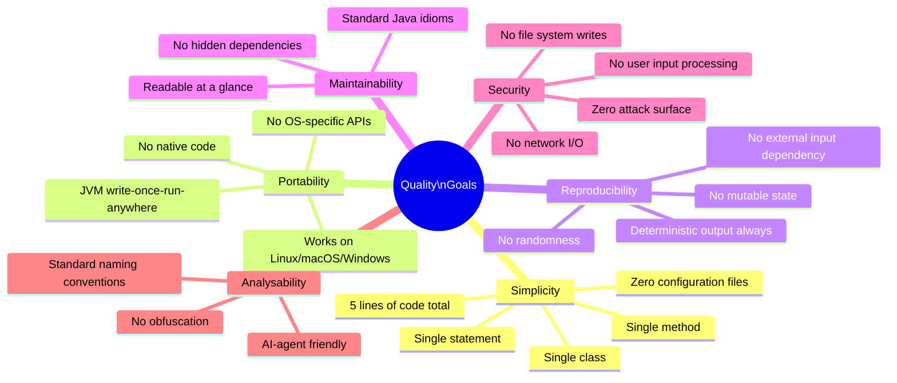
```mermaid
mindmap
  root((Quality\nGoals))
    Simplicity
      Single class
      Single method
      Single statement
      Zero configuration files
      5 lines of code total
    Portability
      JVM write-once-run-anywhere
      No native code
      No OS-specific APIs
      Works on Linux/macOS/Windows
    Reproducibility
      Deterministic output always
      No mutable state
      No external input dependency
      No randomness
    Maintainability
      Readable at a glance
      No hidden dependencies
      Standard Java idioms
    Security
      Zero attack surface
      No user input processing
      No network I/O
      No file system writes
    Analysability
      AI-agent friendly
      Standard naming conventions
      No obfuscation
```

### 10.2 Quality Scenarios

| ID    | Quality Attribute | Scenario | Expected Response | Success Metric |
|-------|------------------|---------|-------------------|----------------|
| QS-01 | **Correctness** | User runs `java HelloWorld` on a machine with JRE ≥ 1.0 | Exactly `Hello World\n` is written to stdout | 100% exact match on every invocation |
| QS-02 | **Portability** | Application is compiled and run on Linux, macOS, and Windows with JRE ≥ 8 | Identical output on all three platforms | Pass on all OS families |
| QS-03 | **Performance** | User runs the application on any modern machine | Output appears within 500 ms (JVM startup dominated) | ≤ 500 ms wall-clock time |
| QS-04 | **Reproducibility** | Application is run 1,000 times consecutively | Every invocation produces byte-identical stdout output | 0 deviations across 1,000 runs |
| QS-05 | **Understandability** | A Java developer reads `HelloWorld.java` for the first time | Developer fully understands all behaviour | ≤ 30 seconds comprehension time |
| QS-06 | **Analysability** | A Copilot agent analyses the repository | Agent correctly identifies all classes, methods, dependencies, and architectural properties | 100% accuracy in agent-generated reports |

### 10.3 Code Metrics

| Metric | Value | Assessment |
|--------|-------|------------|
| Lines of Code (total) | 5 | ✅ Minimal |
| Lines of Code (logic) | 1 | ✅ Single statement |
| Number of source files | 1 | ✅ |
| Number of classes | 1 | ✅ |
| Number of methods | 1 | ✅ |
| Number of statements | 1 | ✅ |
| Cyclomatic complexity | 1 | ✅ No branches |
| External dependencies | 0 | ✅ Zero |
| Test coverage | 0% | ⚠️ No tests |
| Technical debt (estimated) | < 1 hour | ✅ Negligible |
| Security vulnerabilities | 0 | ✅ |
| Maintainability index | Maximum | ✅ |

---

## 11. Risks and Technical Debts

### 11.1 Risk Register

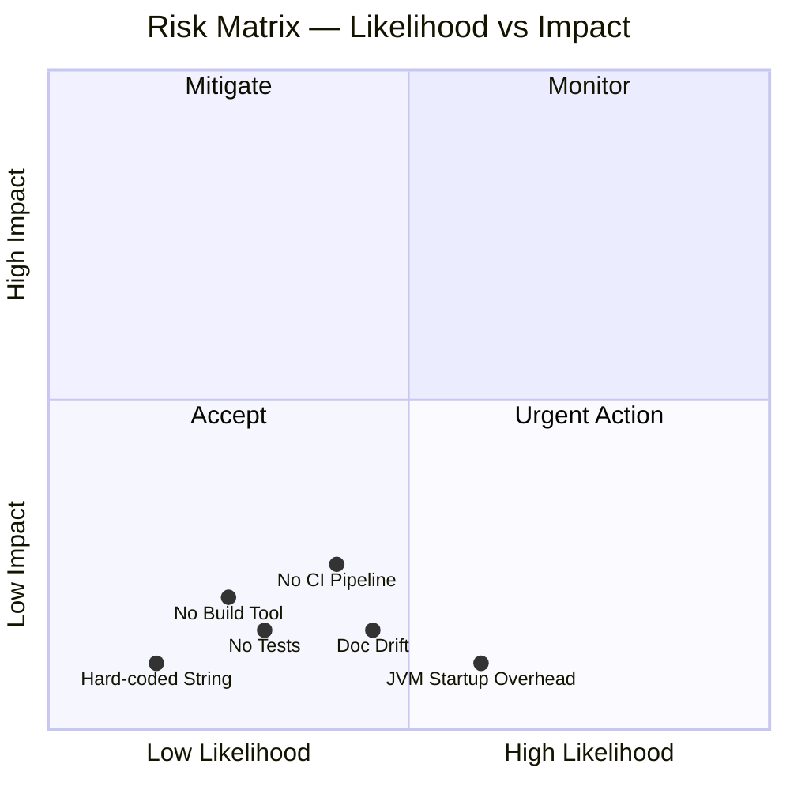
```mermaid
quadrantChart
    title Risk Matrix — Likelihood vs Impact
    x-axis Low Likelihood --> High Likelihood
    y-axis Low Impact --> High Impact
    quadrant-1 Monitor
    quadrant-2 Mitigate
    quadrant-3 Accept
    quadrant-4 Urgent Action

    No Tests: [0.30, 0.15]
    No Build Tool: [0.25, 0.20]
    JVM Startup Overhead: [0.60, 0.10]
    Hard-coded String: [0.15, 0.10]
    No CI Pipeline: [0.40, 0.25]
    Doc Drift: [0.45, 0.15]
```

### 11.2 Identified Risks

| ID   | Risk | Likelihood | Impact | Category | Mitigation |
|------|------|-----------|--------|---------|-----------|
| R-01 | **No automated tests** — Regressions cannot be detected automatically if the code is modified. | Low | Low | Quality | Add a JUnit 5 test capturing stdout if the project evolves beyond a single `println`. |
| R-02 | **No build automation** — Compilation must be performed manually; easy to forget or misconfigure on new machines. | Medium | Low | Operations | Introduce Maven or Gradle when the project grows beyond a single file. |
| R-03 | **No CI/CD pipeline** — No `.github/workflows/` exists; code changes are not automatically verified. | Medium | Low | Process | Add a GitHub Actions workflow (`build.yml`) with `javac`, `java`, and output-verification steps. |
| R-04 | **Hard-coded output string** — The string `"Hello World"` is a compile-time constant; cannot be changed at runtime without recompilation. | Low | Low | Maintainability | Externalise to a `private static final String MESSAGE` constant or a properties file if parameterisation is ever needed. |
| R-05 | **JVM startup latency** — Cold JVM startup adds 50–200 ms overhead relative to a native binary. | High | Negligible | Performance | Acceptable for a demonstration program. Use GraalVM `native-image` if sub-millisecond startup is required. |
| R-06 | **Documentation drift** — `arc42-documentation.md` may fall out of sync with code changes if the agent is not re-run after modifications. | Medium | Low | Documentation | Re-invoke the `arc42-documentor` Copilot agent after any code changes. |

### 11.3 Technical Debt Backlog

| ID    | Debt Item | Estimated Effort | Priority | Category |
|-------|----------|-----------------|---------|---------|
| TD-01 | Add JUnit 5 unit test with `System.setOut` stdout capture | 30 min | Low | Testing |
| TD-02 | Introduce `pom.xml` or `build.gradle` for reproducible, tool-assisted builds | 15 min | Low | Build |
| TD-03 | Create `.github/workflows/build.yml` CI pipeline (compile + run + verify) | 20 min | Medium | CI/CD |
| TD-04 | Add `/** Javadoc */` comment to `main()` describing behaviour, parameters, and exit codes | 5 min | Low | Documentation |
| TD-05 | Externalise `"Hello World"` to a named constant `private static final String MESSAGE` | 5 min | Low | Code Quality |
| TD-06 | Add a `package` declaration (e.g., `package com.ktruchcz.hello;`) for proper Java project structure | 10 min | Low | Code Quality |

### 11.4 Technical Debt Remediation Roadmap

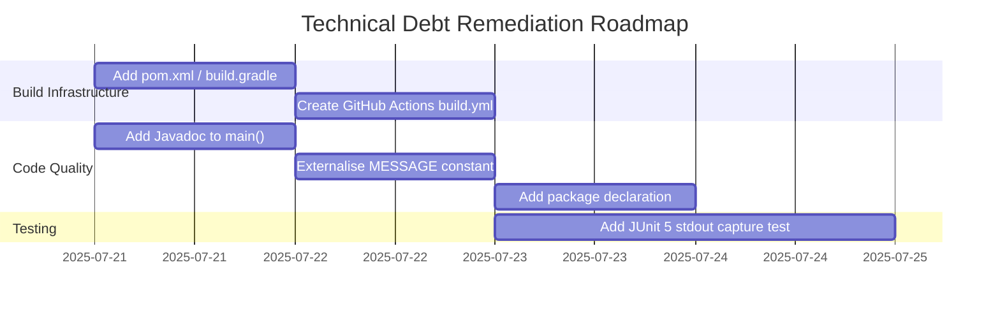
```mermaid
gantt
    title Technical Debt Remediation Roadmap
    dateFormat  YYYY-MM-DD
    section Build Infrastructure
    Add pom.xml / build.gradle            :td02, 2025-07-21, 1d
    Create GitHub Actions build.yml       :td03, after td02, 1d
    section Code Quality
    Add Javadoc to main()                 :td04, 2025-07-21, 1d
    Externalise MESSAGE constant          :td05, after td04, 1d
    Add package declaration               :td06, after td05, 1d
    section Testing
    Add JUnit 5 stdout capture test       :td01, after td03, 2d
```

---

## 12. Glossary

| Term | Definition |
|------|-----------|
| **Arc42** | A pragmatic, lightweight template for software architecture documentation, structured into 12 sections. Originally developed by Dr. Peter Hruschka and Dr. Gernot Starke. See [arc42.org](https://arc42.org). |
| **Bytecode** | Platform-independent binary instructions compiled from Java source code and stored in `.class` files. Interpreted and executed by the JVM. |
| **Classpath** | A parameter (`-cp` / `-classpath`) that tells the JVM where to search for compiled `.class` files and JAR archives at runtime. |
| **CLI** | Command-Line Interface — a text-based user interface where commands are entered by typing in a terminal or shell. |
| **Copilot Agent** | A GitHub Copilot extension defined by an `.agent.md` file in `.github/agents/`. Encapsulates specific AI-driven analysis or generation capabilities (e.g., Arc42 documentation, UML generation). |
| **Entry Point** | In Java, the method `public static void main(String[] args)` that the JVM locates and calls to start a program. Mandated by the Java Language Specification. |
| **Exit Code** | An integer returned by a process to the operating system upon termination. `0` conventionally signals success; non-zero values indicate errors. |
| **GraalVM** | A high-performance JDK distribution by Oracle that supports ahead-of-time (AOT) compilation of Java to native machine binaries, removing JVM startup overhead. |
| **HelloWorld** | The canonical minimal program in any programming language that demonstrates a working development environment by printing "Hello World" to standard output. |
| **JAR** | Java ARchive — a ZIP-format container packaging compiled `.class` files, resources, and a manifest for distribution and deployment. |
| **Java** | A general-purpose, object-oriented, class-based, statically typed programming language designed for platform independence via the JVM. Originally developed by Sun Microsystems (now Oracle). |
| **javac** | The Java compiler bundled in the JDK. Translates `.java` source files into `.class` bytecode files. |
| **JDK** | Java Development Kit — a superset of the JRE that includes development tools: `javac` (compiler), `javadoc` (documentation generator), `jar` (archiver), `jdb` (debugger), etc. |
| **JRE** | Java Runtime Environment — the minimum installation required to *run* compiled Java programs. Includes the JVM and the Java standard library. |
| **JUnit** | The de-facto standard unit testing framework for Java. JUnit 5 (Jupiter) is the current major version. |
| **JVM** | Java Virtual Machine — the runtime engine that loads, verifies, and executes Java bytecode. Provides platform independence by abstracting over the underlying OS and CPU. |
| **`java.io.PrintStream`** | A JDK class that wraps an `OutputStream` and adds convenient `print` and `println` methods. `System.out` is a pre-wired instance connected to stdout. |
| **`java.lang`** | The core Java package, implicitly imported in every Java class. Contains foundational types: `Object`, `String`, `System`, `Math`, `Thread`, `Integer`, etc. |
| **`println`** | "Print line" — a method on `PrintStream` that writes a value as text followed by the platform-specific line separator (`\n` on Unix/macOS, `\r\n` on Windows). |
| **stdout** | Standard Output — POSIX file descriptor 1. The conventional output stream for normal program messages, typically connected to the terminal unless redirected. |
| **`System.out`** | A `public static final PrintStream` field in `java.lang.System`. Pre-initialised by the JVM to be connected to the process's standard output stream (fd 1). |

---

*Documentation generated and maintained by the **Arc42 Documentation Generator** Copilot agent.*  
*Source analysis based on: `HelloWorld.java`, `README.md`, `.gitignore`, `.github/agents/` in repository `ktruchcz/copilot-test-ktruchcz`.*  
*Arc42 template: [arc42.org](https://arc42.org) — licensed under [CC BY-SA 4.0](https://creativecommons.org/licenses/by-sa/4.0/).*
