# Architecture Documentation (Arc42)

**Project**: copilot-test-ktruchcz — HelloWorld Java Application  
**Version**: 1.0.0  
**Date**: 2025-01-01  
**Generated by**: Arc42 Documentation Generator  
**Source files analysed**: `HelloWorld.java`, `README.md`

---

## Table of Contents

1. [Introduction and Goals](#1-introduction-and-goals)
2. [Architecture Constraints](#2-architecture-constraints)
3. [System Scope and Context](#3-system-scope-and-context)
4. [Solution Strategy](#4-solution-strategy)
5. [Building Block View](#5-building-block-view)
6. [Runtime View](#6-runtime-view)
7. [Deployment View](#7-deployment-view)
8. [Cross-cutting Concepts](#8-cross-cutting-concepts)
9. [Architecture Decisions](#9-architecture-decisions)
10. [Quality Requirements](#10-quality-requirements)
11. [Risks and Technical Debt](#11-risks-and-technical-debt)
12. [Glossary](#12-glossary)

---

## 1. Introduction and Goals

### 1.1 Requirements Overview

`copilot-test-ktruchcz` is a minimal Java console application whose sole purpose is to print the text **"Hello World"** to standard output and exit. It serves as a canonical introductory program and a baseline reference implementation for validating that a Java development environment is correctly set up.

| ID  | Requirement | Priority |
|-----|-------------|----------|
| R-01 | The application shall print the string `Hello World` to standard output | Must |
| R-02 | The application shall terminate cleanly with exit code `0` after printing | Must |
| R-03 | The application shall require no runtime configuration or external input | Must |
| R-04 | The application shall be executable from the command line | Should |

### 1.2 Quality Goals

The top quality goals for this system, in descending priority:

| Priority | Quality Goal | Motivation |
|----------|-------------|------------|
| 1 | **Correctness** | The application must produce the exact expected output (`Hello World`) reliably on every execution |
| 2 | **Simplicity** | The implementation must be as small and readable as possible; it is a teaching and validation artifact |
| 3 | **Portability** | The application must run on any platform that supports a standard JVM (Java 8+) without modification |
| 4 | **Reproducibility** | Every run must produce identical output regardless of environment state |

### 1.3 Stakeholders

| Stakeholder | Role | Expectations |
|-------------|------|--------------|
| Developer / Learner | Author and primary user | A working, runnable Java program that demonstrates basic Java syntax and JVM execution |
| CI/CD Pipeline | Automated validation | A program that compiles cleanly, runs without errors, and exits with code `0` |
| Code Reviewer | Quality gatekeeper | Source code that follows Java naming conventions and is free of unnecessary complexity |
| Platform / Infrastructure Team | Environment validation | A lightweight artefact for smoke-testing that a JDK is correctly installed and configured |

---

## 2. Architecture Constraints

### 2.1 Technical Constraints

| ID | Constraint | Background / Rationale |
|----|------------|------------------------|
| TC-01 | **Java language** — implementation language is Java | The file `HelloWorld.java` is a `.java` source file; the JVM is the only runtime target |
| TC-02 | **No external libraries** — zero third-party dependencies | The source file uses only `java.lang` (implicitly imported); `System.out.println` is part of the Java SE standard library |
| TC-03 | **No build tool** — no `pom.xml`, `build.gradle`, or `Makefile` present in the repository | The application must be compiled with a bare `javac` invocation |
| TC-04 | **No package declaration** — the class lives in the default (unnamed) Java package | Limits re-usability as a library; acceptable for a standalone demo |
| TC-05 | **Single source file** — the entire application is contained in one `.java` file | Constraints portability to environments with a JDK; cannot be shipped as a JAR without manual packaging |
| TC-06 | **Java SE 8+ compatibility** — `System.out.println` and `static main` entry point are available since Java 1.0; the code is backwards-compatible to any modern JDK | |

### 2.2 Organizational Constraints

| ID | Constraint | Background |
|----|------------|------------|
| OC-01 | **Repository hosted on GitHub** — `.github/` directory is present, suggesting GitHub Actions CI integration | Deployments and build verification happen through GitHub workflows |
| OC-02 | **No licence file present** — intellectual property terms are undefined | Usage outside the owning organization may require clarification |
| OC-03 | **No contribution guidelines** — `CONTRIBUTING.md` absent | Contributions are informal; no process constraints imposed |

### 2.3 Conventions

| Convention | Description |
|------------|-------------|
| Java naming conventions | Class name `HelloWorld` uses UpperCamelCase as required by Java style guides |
| Entry-point convention | `public static void main(String[] args)` is the standard Java application entry point |
| Source file naming | File name `HelloWorld.java` matches the public class name exactly, as required by the Java compiler |

---

## 3. System Scope and Context

### 3.1 Business Context

The HelloWorld application is a **self-contained, single-process system** with no inbound or outbound integrations. Its only interaction with the outside world is writing a single line of text to the operating system's standard output stream.

```mermaid
C4Context
    title System Context — HelloWorld Application

    Person(user, "User / Developer", "Invokes the application from a command-line terminal or CI runner")
    Person(ciRunner, "CI Runner", "GitHub Actions workflow that compiles and executes the application automatically")

    System_Boundary(jvmBoundary, "JVM Process") {
        System(helloWorld, "HelloWorld", "Prints 'Hello World' to stdout and exits")
    }

    SystemExt(stdout, "Standard Output (stdout)", "Terminal / console display or CI log sink")
    SystemExt(jdk, "JDK / javac", "Compiles HelloWorld.java into HelloWorld.class")
    SystemExt(os, "Operating System", "Provides process lifecycle and I/O streams")

    Rel(user, jdk, "javac HelloWorld.java", "CLI")
    Rel(user, helloWorld, "java HelloWorld", "CLI")
    Rel(ciRunner, jdk, "Compile step", "GitHub Actions")
    Rel(ciRunner, helloWorld, "Run step", "GitHub Actions")
    Rel(helloWorld, stdout, "Writes 'Hello World\\n'", "System.out.println")
    Rel(helloWorld, os, "Requests process exit (code 0)", "JVM shutdown")
```

### 3.2 Technical Context

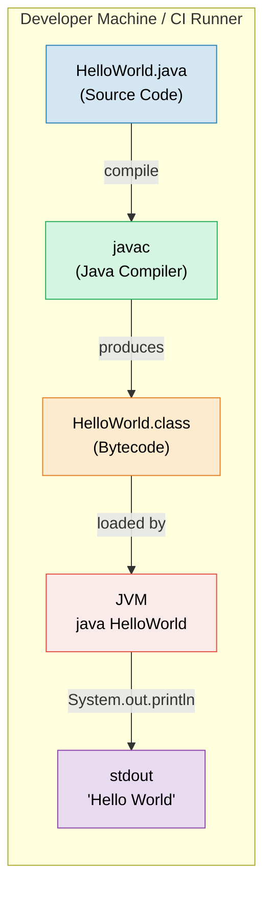

| Interface | Direction | Technology | Data |
|-----------|-----------|------------|------|
| `javac HelloWorld.java` | Developer → Compiler | CLI / JDK toolchain | Java source text |
| `HelloWorld.class` | Compiler → JVM | JVM bytecode (`.class` file) | Compiled bytecode |
| `java HelloWorld` | Developer → JVM | CLI | Process invocation signal |
| `System.out.println(...)` | JVM → OS stdout | Java standard I/O | UTF-8 text: `Hello World\n` |
| Process exit | JVM → OS | OS process API | Exit code `0` |

---

## 4. Solution Strategy

### 4.1 Technology Decisions

| Decision | Choice | Rationale |
|----------|--------|-----------|
| **Language** | Java (SE) | Universally understood, platform-independent via JVM; ideal for a canonical introductory example |
| **Entry point** | `public static void main(String[] args)` | The standard, universally recognised Java application entry point; requires no framework or container |
| **Output mechanism** | `System.out.println` | Simplest possible way to write a line of text to standard output in Java; zero configuration |
| **Build approach** | Raw `javac` + `java` | No build tool overhead for a single-class application; keeps the example self-explanatory |
| **Package** | Default (unnamed) package | Removes the need for directory structure; appropriate for a single-file demo |
| **Dependencies** | None | `java.lang` is always available; adding libraries would obscure the minimal nature of the example |

### 4.2 Top-Level Decomposition Strategy

The system is decomposed into a **single building block**: the `HelloWorld` class. This deliberate choice reflects the goal of maximum simplicity. No further decomposition is warranted.

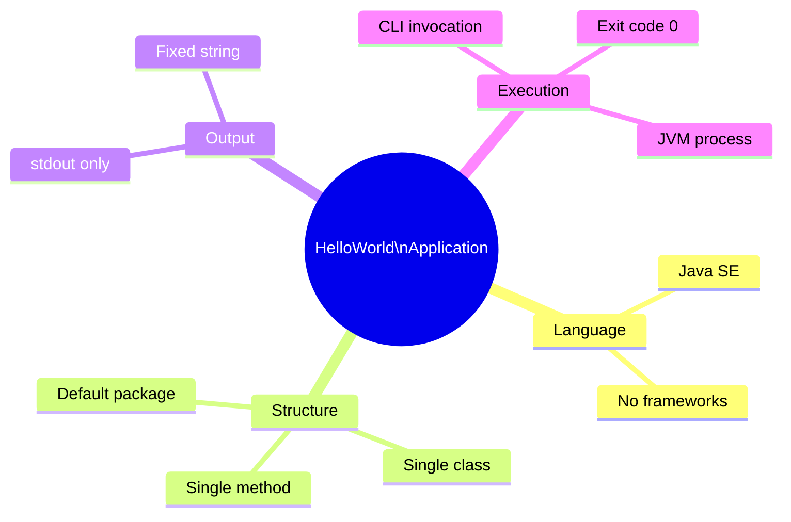

### 4.3 Approaches to Quality Goals

| Quality Goal | Approach |
|-------------|----------|
| **Correctness** | Hard-coded string literal eliminates any risk of dynamic computation errors |
| **Simplicity** | Minimum possible code: 1 class, 1 method, 1 statement |
| **Portability** | Pure Java SE; no OS-specific APIs; compiles and runs on Windows, macOS, Linux |
| **Reproducibility** | No external state, no I/O input, no randomness; output is deterministic by construction |

---

## 5. Building Block View

### 5.1 Level 1 — System Whitebox

The system contains a single top-level building block: the `HelloWorld` application.

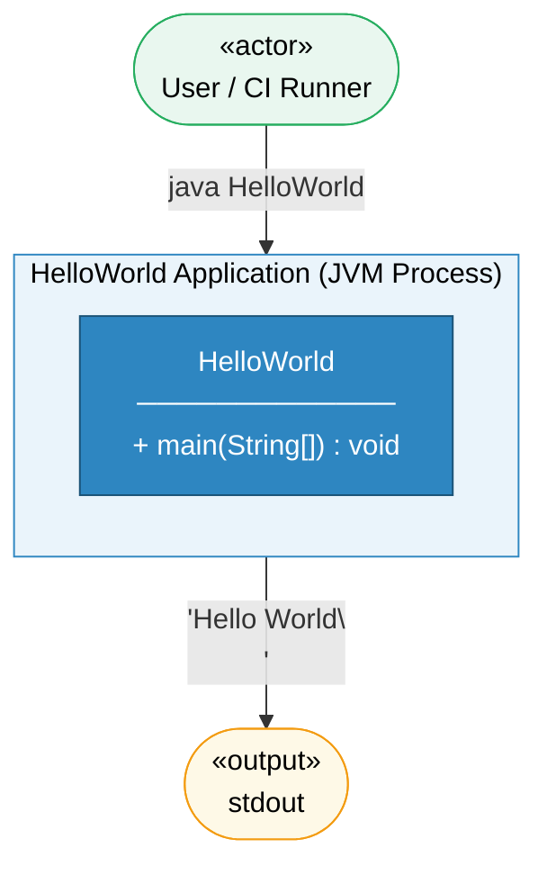

**Contained Building Blocks**

| Name | Responsibility |
|------|----------------|
| `HelloWorld` | Single public class; owns the application entry point; writes to stdout; triggers JVM shutdown |

**Important Interfaces**

| Interface | Description |
|-----------|-------------|
| `main(String[] args)` | JVM entry point; receives command-line arguments (none used); initiates execution |
| `System.out` | Java standard output `PrintStream`; bridge between application and OS stdout |

### 5.2 Level 2 — HelloWorld Whitebox

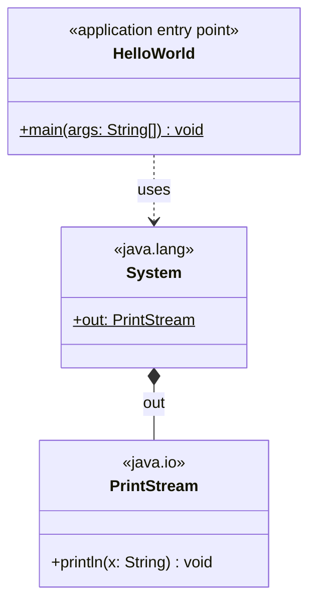

**Method Breakdown**

| Method | Visibility | Signature | Description |
|--------|------------|-----------|-------------|
| `main` | `public` | `static void main(String[] args)` | JVM entry point. Calls `System.out.println("Hello World")` then returns, causing the JVM to exit with code `0` |

### 5.3 Level 3 — Source File Structure

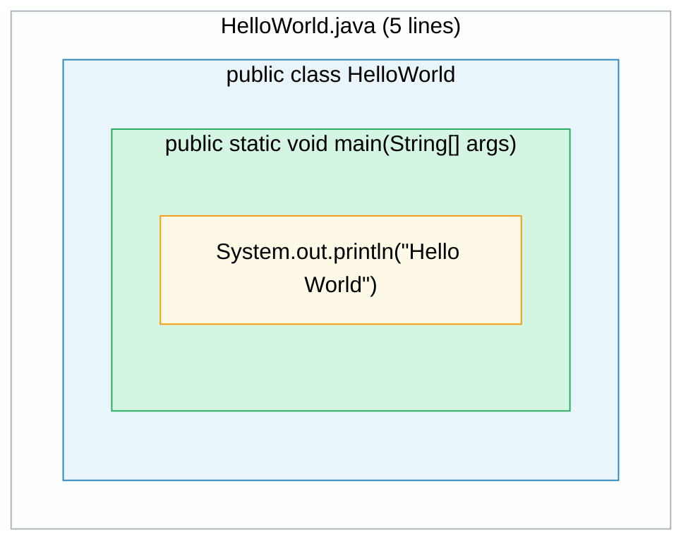

---

## 6. Runtime View

### 6.1 Scenario 1 — Normal Execution (Happy Path)

This is the only execution scenario for this application.

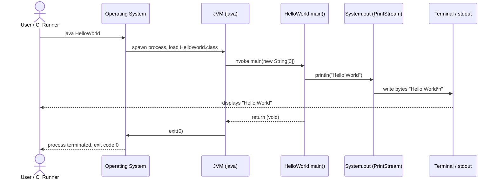

### 6.2 Scenario 2 — Compilation Step

Before execution, the source must be compiled. This scenario captures the full lifecycle from source to running process.

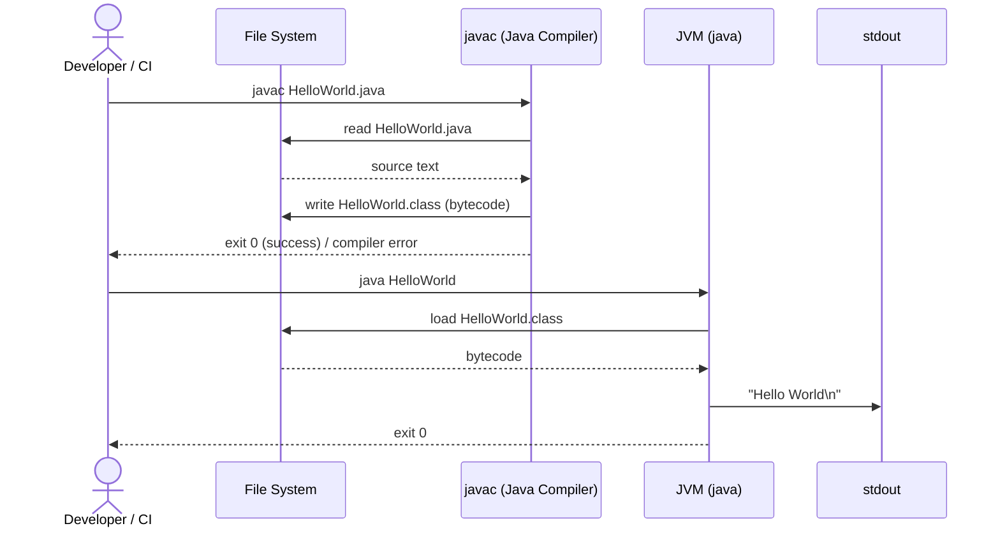

### 6.3 Scenario 3 — CI Pipeline Execution

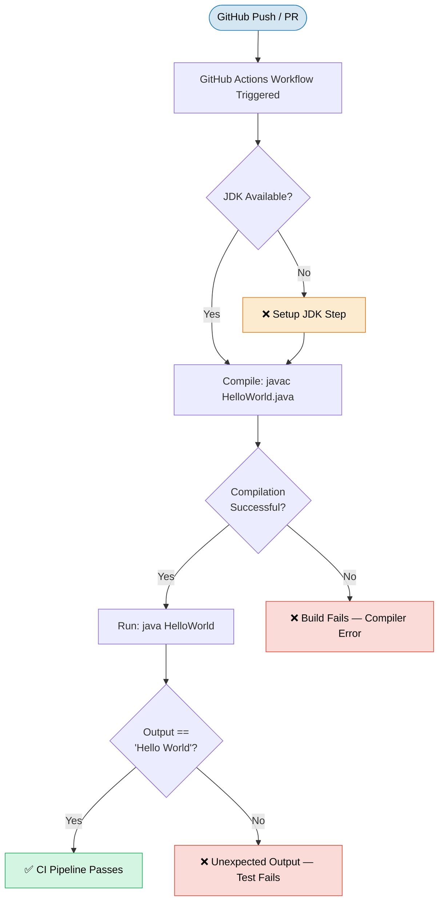

---

## 7. Deployment View

### 7.1 Infrastructure Overview

The HelloWorld application has no dedicated server infrastructure. It is deployed by copying a single `.java` (or compiled `.class`) file to any machine with a JDK/JRE installed.

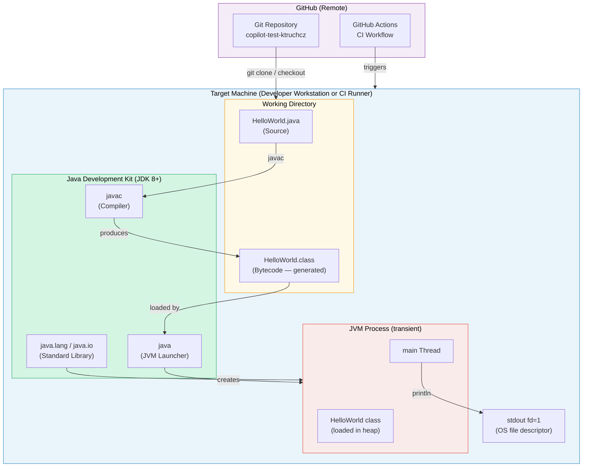

### 7.2 Deployment Steps

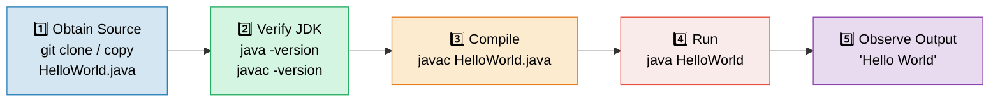

### 7.3 Deployment Requirements

| Requirement | Minimum Version | Notes |
|-------------|----------------|-------|
| **JDK** (for compilation) | Java SE 8 | Required for `javac`; JRE alone is insufficient for compilation |
| **JRE** (for execution only) | Java SE 8 | Sufficient if a pre-compiled `.class` is available |
| **Operating System** | Any (Windows / macOS / Linux) | No OS-specific APIs used |
| **Disk space** | less than 5 KB | `HelloWorld.java` ~100 bytes; `HelloWorld.class` ~400 bytes |
| **RAM** | JVM default (≥ 64 MB) | The application itself consumes negligible heap space |
| **Network** | None | Fully offline-capable |

---

## 8. Cross-cutting Concepts

### 8.1 Output / Logging Concept

The application uses `System.out` (standard output) as its sole output mechanism. There is no logging framework (e.g., SLF4J, Log4j, java.util.logging) in use. This is intentional given the application's trivial scope.

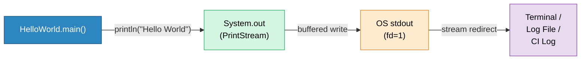

| Aspect | Detail |
|--------|--------|
| Output channel | `System.out` (`java.io.PrintStream`) |
| Format | Plain text, no timestamp, no level, no structured format |
| Flushing | `println` auto-flushes on `PrintStream` when connected to a terminal |
| Redirectability | Can be redirected with `java HelloWorld > output.txt` |
| Internationalisation | Hard-coded ASCII string; no i18n support |

### 8.2 Error Handling Concept

The application has no explicit error handling. No exceptions can be thrown during normal execution of `System.out.println("Hello World")` under standard conditions.

| Error Scenario | Handling | Likelihood |
|----------------|----------|------------|
| `System.out` is `null` | `NullPointerException` (unhandled) | Extremely unlikely; requires explicit `System.setOut(null)` |
| Disk full (if stdout redirected to file) | `IOException` propagated by JVM, non-zero exit | Very rare |
| ClassNotFoundException | JVM error before `main` is called | Only if `.class` file is missing/corrupted |
| `OutOfMemoryError` | JVM fatal error | Impossible for this workload |

### 8.3 Configuration Concept

There is **no configuration**. The application does not read:
- Command-line arguments (`args` parameter is declared but ignored)
- Environment variables
- System properties
- Configuration files
- Databases

### 8.4 Security Concept

| Aspect | Status |
|--------|--------|
| Input validation | N/A — no input accepted |
| Authentication / Authorisation | N/A — no network or multi-user interaction |
| Secrets / credentials | None present in source |
| Dependency vulnerabilities | None — zero third-party dependencies |
| Supply chain risk | Minimal — relies only on official JDK standard library |

### 8.5 Testability Concept

The application is currently **not covered by automated tests**. A recommended minimal test strategy would be:

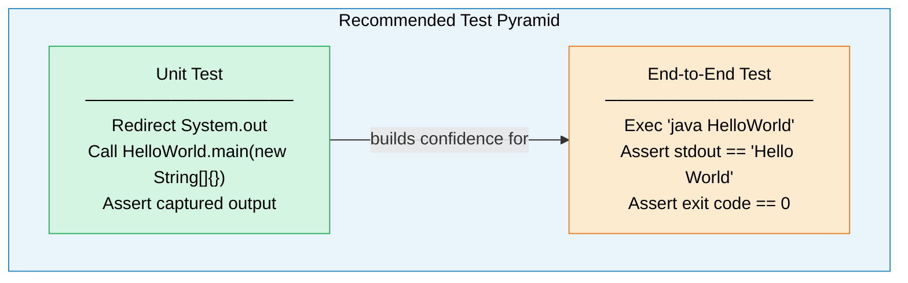

---

## 9. Architecture Decisions

### ADR-001 — Use Plain Java SE with No Build Tool

| Field | Value |
|-------|-------|
| **ID** | ADR-001 |
| **Status** | Accepted |
| **Date** | Project inception |

**Context**  
A simple demonstration application is needed to validate the Java development environment and illustrate basic Java syntax.

**Decision**  
Implement the application as a single `.java` file using only Java SE standard library classes, compiled and executed with bare `javac` and `java` commands.

**Consequences**
- ✅ Zero setup overhead beyond a JDK installation
- ✅ No dependency management complexity
- ✅ Maximum clarity for learning and demonstration purposes
- ⚠️ Cannot be easily packaged as a JAR without a manual manifest or build script
- ⚠️ Scaling to multi-class applications would require introducing a build tool (Maven/Gradle)

---

### ADR-002 — Write Output Directly to `System.out`

| Field | Value |
|-------|-------|
| **ID** | ADR-002 |
| **Status** | Accepted |
| **Date** | Project inception |

**Context**  
The application's sole purpose is to produce visible output. Several output mechanisms exist: logging frameworks, file I/O, GUI, network socket.

**Decision**  
Use `System.out.println` to write directly to standard output.

**Alternatives Considered**

| Alternative | Reason Rejected |
|-------------|----------------|
| SLF4J + Logback | Requires dependencies; overkill for a single print statement |
| `java.util.logging` | More verbose configuration; unnecessary for this scope |
| Writing to a file | Less visible for demo purposes; requires file path configuration |
| Swing/JavaFX GUI | Massive complexity for no pedagogical benefit |

**Consequences**
- ✅ No external dependencies
- ✅ Immediately visible to the user without configuration
- ✅ Redirectable with standard Unix/Windows shell operators
- ⚠️ Not structured/searchable (no log levels, no timestamps)
- ⚠️ Would need to be refactored if logging is required in a real application

---

### ADR-003 — Use Default (Unnamed) Java Package

| Field | Value |
|-------|-------|
| **ID** | ADR-003 |
| **Status** | Accepted |
| **Date** | Project inception |

**Context**  
Java classes must belong to a package. Using a named package requires a matching directory structure.

**Decision**  
Keep the class in the default package (no `package` declaration).

**Consequences**
- ✅ File can be placed in any directory without subdirectory requirements
- ✅ Compilation and execution commands remain minimal
- ⚠️ Classes in the default package cannot be imported by classes in named packages
- ⚠️ Not suitable as a starting point for a real multi-module application

---

## 10. Quality Requirements

### 10.1 Quality Tree

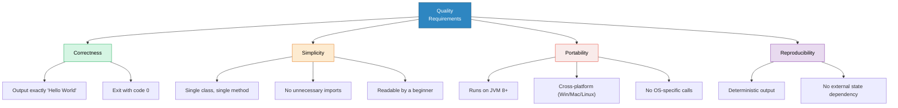

### 10.2 Quality Scenarios

| ID | Quality Goal | Stimulus | Response | Measurable Criterion |
|----|-------------|----------|----------|----------------------|
| QS-01 | Correctness | User executes `java HelloWorld` | Application prints `Hello World` then exits | Output stream contains exactly `Hello World\n`; exit code is `0` |
| QS-02 | Portability | Deploy to a new OS / JVM version | Application compiles and runs without changes | Zero code modifications required for JDK 8, 11, 17, 21 on Windows/macOS/Linux |
| QS-03 | Simplicity | New Java learner reads the source | Learner understands the code within 30 seconds | Code is ≤ 5 lines, uses only standard syntax, no frameworks |
| QS-04 | Reproducibility | Application is run 1,000 times in succession | Every run produces identical output | 0 deviations from expected output across all runs |
| QS-05 | Build speed | CI pipeline is triggered | Compilation completes quickly | `javac HelloWorld.java` completes in < 2 seconds |

### 10.3 Code Metrics

| Metric | Value | Assessment |
|--------|-------|------------|
| Lines of code (LoC) | 5 (source) | ✅ Minimal |
| Cyclomatic complexity | 1 | ✅ Lowest possible value |
| Number of classes | 1 | ✅ Single responsibility |
| Number of methods | 1 | ✅ Atomic |
| External dependencies | 0 | ✅ None |
| Test coverage | 0% | ⚠️ No tests exist |
| Javadoc coverage | 0% | ⚠️ No documentation comments |

---

## 11. Risks and Technical Debt

### 11.1 Identified Risks

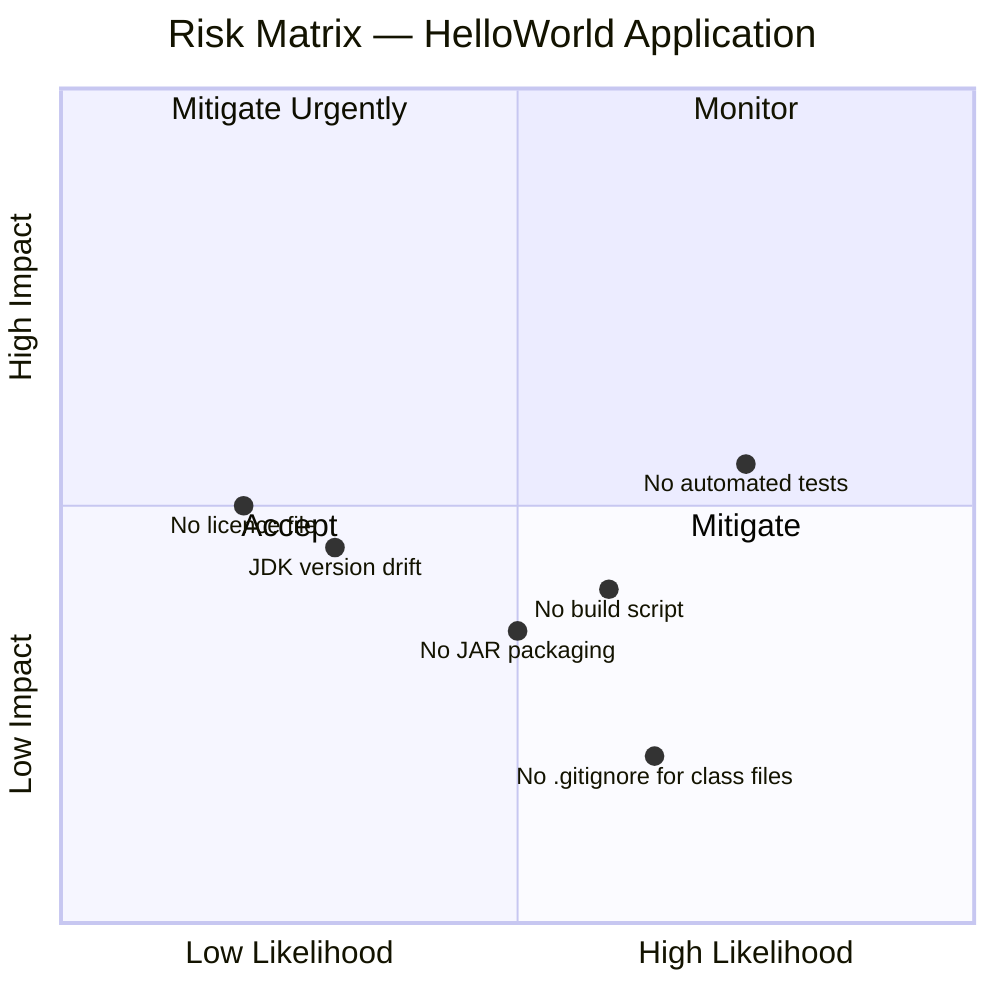

| ID | Risk | Likelihood | Impact | Mitigation |
|----|------|------------|--------|------------|
| R-01 | **No automated tests** — regressions (e.g., typo in output string) would not be caught automatically | Medium | Medium | Add a JUnit test or shell-based output assertion to the CI workflow |
| R-02 | **No build script** — manual compilation steps are error-prone; CI configuration may diverge | Medium | Low–Medium | Introduce a minimal `Makefile`, Maven `pom.xml`, or Gradle `build.gradle` |
| R-03 | **No JAR packaging** — the application cannot be distributed as a self-contained executable | Medium | Low | Add a manifest and packaging step to the build |
| R-04 | **JDK version drift** — the required JDK version is not specified; future contributors may use incompatible versions | Low | Medium | Add a `.java-version` file or specify `sourceCompatibility` in a build script |
| R-05 | **`.class` files committed to repository** — compiled artefacts may accidentally be committed since `.gitignore` may not exclude them | Medium | Low | Verify `.gitignore` includes `*.class` |
| R-06 | **No licence** — unclear IP ownership could block reuse | Low | Medium | Add a `LICENSE` file (e.g., MIT) |

### 11.2 Technical Debt Register

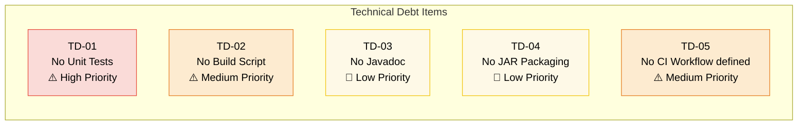

| ID | Debt Item | Effort to Fix | Priority | Recommended Action |
|----|-----------|--------------|----------|--------------------|
| TD-01 | No unit or integration tests | Small (1–2 hrs) | High | Add `HelloWorldTest.java` with JUnit 5; redirect `System.out` and assert output |
| TD-02 | No build script | Small (30 min) | Medium | Add `pom.xml` (Maven) or `build.gradle` (Gradle) with compile + test lifecycle |
| TD-03 | No Javadoc comments | Trivial (15 min) | Low | Add `/** */` Javadoc to the class and `main` method |
| TD-04 | No JAR packaging | Small (30 min) | Low | Add `MANIFEST.MF` or build-tool packaging configuration |
| TD-05 | No explicit CI workflow | Small (1 hr) | Medium | Create `.github/workflows/build.yml` to compile and run on push |
| TD-06 | No `.java-version` pinning | Trivial (5 min) | Low | Add `.java-version` or `system.properties` to pin JDK version |

### 11.3 Recommended Improvement Roadmap

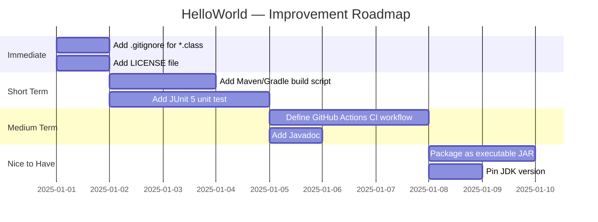

---

## 12. Glossary

| Term | Definition |
|------|------------|
| **Arc42** | A template for documenting software architectures, providing 12 standardised sections covering goals, constraints, building blocks, runtime behaviour, and more |
| **Bytecode** | Platform-independent intermediate code produced by the Java compiler (`javac`) and stored in `.class` files; executed by the JVM |
| **CI/CD** | Continuous Integration / Continuous Deployment — automated pipeline for building, testing, and deploying code changes |
| **Class file** | A `.class` file containing Java bytecode; the output of compiling a `.java` source file |
| **Classpath** | A JVM parameter specifying the locations where the JVM searches for `.class` files and JAR archives |
| **Default package** | The unnamed Java package; a class without a `package` declaration belongs to it |
| **Entry point** | The method invoked by the JVM to start a Java application: `public static void main(String[] args)` |
| **Exit code** | An integer returned by a process to the OS upon termination; `0` conventionally indicates success |
| **GitHub Actions** | A CI/CD platform integrated into GitHub that runs automated workflows (build, test, deploy) in response to repository events |
| **`Hello World`** | A traditional minimal program used to demonstrate the basic syntax of a programming language and verify that the development environment is correctly configured |
| **JAR** | Java ARchive — a ZIP-format archive containing compiled `.class` files, resources, and a manifest; the standard Java distribution format |
| **javac** | The Java compiler; transforms `.java` source files into `.class` bytecode files |
| **JDK** | Java Development Kit — a full development environment including the compiler (`javac`), JVM (`java`), standard library, and development tools |
| **JRE** | Java Runtime Environment — a subset of the JDK containing only the JVM and standard library; sufficient for running (not compiling) Java applications |
| **JUnit** | The de-facto standard unit testing framework for Java; used to write and execute automated tests |
| **JVM** | Java Virtual Machine — the runtime engine that interprets/JIT-compiles Java bytecode and manages memory, threading, and I/O |
| **Mermaid** | An open-source diagramming language that renders diagrams (flowcharts, sequence diagrams, etc.) from text markup; used in this document for all architectural visualisations |
| **`PrintStream`** | The Java class (`java.io.PrintStream`) that wraps an output stream and provides `print`/`println` convenience methods; `System.out` is an instance of it |
| **`static`** | A Java keyword indicating that a method or field belongs to the class itself rather than to any instance; `main` must be `static` so the JVM can call it without instantiating the class |
| **`stdout`** | Standard Output — the default output stream of a process, typically connected to the terminal; file descriptor 1 on POSIX systems |
| **`System.out`** | A `static` field of `java.lang.System`; a `PrintStream` connected to standard output; used by `HelloWorld` to emit its message |
| **Technical debt** | The implied cost of rework caused by choosing a quick/simple approach now instead of a better, more complete approach that would take longer |

---

*This document was generated by the **Arc42 Documentation Generator** agent based on static analysis of the `HelloWorld.java` source file and `README.md` in the `copilot-test-ktruchcz` repository.*  
*All diagrams are rendered using [Mermaid](https://mermaid.js.org/).*
