# Architecture Documentation (Arc42)

**Project**: copilot-test-ktruchcz — Hello World
**Repository**: `https://github.com/copilot-test-ktruchcz/copilot-test-ktruchcz`
**Version**: 2.0.0
**Date**: 2025-07-14
**Generated by**: Arc42 Documentation Generator (arc42-documentor agent)
**Source files analysed**: `HelloWorld.java`, `README.md`

> **About this document**: This is a comprehensive Arc42 architecture documentation for a minimal Java *Hello World* application. While the application itself is intentionally trivial (5 lines of source code), this document demonstrates rigorous architectural documentation practices applicable to production systems of any scale.

---

## Table of Contents

1. [Introduction and Goals](#1-introduction-and-goals)
   - 1.1 [Requirements Overview](#11-requirements-overview)
   - 1.2 [Quality Goals](#12-quality-goals)
   - 1.3 [Stakeholders](#13-stakeholders)
2. [Architecture Constraints](#2-architecture-constraints)
   - 2.1 [Technical Constraints](#21-technical-constraints)
   - 2.2 [Organizational Constraints](#22-organizational-constraints)
   - 2.3 [Conventions](#23-conventions)
3. [System Scope and Context](#3-system-scope-and-context)
   - 3.1 [Business Context](#31-business-context)
   - 3.2 [Technical Context](#32-technical-context)
   - 3.3 [External Interfaces](#33-external-interfaces)
   - 3.4 [C4 Context Diagram](#34-c4-context-diagram)
4. [Solution Strategy](#4-solution-strategy)
   - 4.1 [Technology Decisions](#41-technology-decisions)
   - 4.2 [Top-Level Decomposition Strategy](#42-top-level-decomposition-strategy)
   - 4.3 [Approach to Quality Goals](#43-approach-to-quality-goals)
5. [Building Block View](#5-building-block-view)
   - 5.1 [Level 1 — System Whitebox](#51-level-1--system-whitebox)
   - 5.2 [Level 2 — HelloWorld Class Whitebox](#52-level-2--helloworld-class-whitebox)
   - 5.3 [Level 3 — Statement-Level Detail](#53-level-3--statement-level-detail)
   - 5.4 [Dependency Graph](#54-dependency-graph)
6. [Runtime View](#6-runtime-view)
   - 6.1 [Scenario 1 — Normal Execution](#61-scenario-1--normal-execution)
   - 6.2 [Scenario 2 — Execution with Arguments](#62-scenario-2--execution-with-command-line-arguments)
   - 6.3 [Scenario 3 — Class Not Found (Error Path)](#63-scenario-3--class-not-found-error-path)
   - 6.4 [Scenario 4 — stdout Closed / IOException](#64-scenario-4--stdout-closed--ioexception)
   - 6.5 [Application Lifecycle State Machine](#65-application-lifecycle-state-machine)
   - 6.6 [Data Flow](#66-data-flow)
7. [Deployment View](#7-deployment-view)
   - 7.1 [Infrastructure Overview](#71-infrastructure-overview)
   - 7.2 [Build Pipeline](#72-build-pipeline)
   - 7.3 [Deployment Variants](#73-deployment-variants)
   - 7.4 [Docker Deployment](#74-docker-deployment)
   - 7.5 [Minimum System Requirements](#75-minimum-system-requirements)
8. [Cross-cutting Concepts](#8-cross-cutting-concepts)
   - 8.1 [Domain Model](#81-domain-model)
   - 8.2 [Output / Logging Concept](#82-output--logging-concept)
   - 8.3 [Error Handling Concept](#83-error-handling-concept)
   - 8.4 [Internationalisation (i18n)](#84-internationalisation-i18n)
   - 8.5 [Security Concept](#85-security-concept)
   - 8.6 [Performance Concept](#86-performance-concept)
   - 8.7 [Design Patterns Applied](#87-design-patterns-applied)
   - 8.8 [Observability](#88-observability)
9. [Architecture Decisions](#9-architecture-decisions)
   - ADR-001: [Java as Implementation Language](#adr-001--use-java-as-the-implementation-language)
   - ADR-002: [No Build Tool](#adr-002--no-build-tool-raw-javac)
   - ADR-003: [No External Dependencies](#adr-003--no-external-dependencies)
   - ADR-004: [No Unit Tests](#adr-004--no-unit-tests)
   - ADR-005: [Hard-coded Output String](#adr-005--hard-coded-output-string)
   - ADR-006: [No Logging Framework](#adr-006--no-logging-framework)
   - ADR-007: [No CI/CD Pipeline](#adr-007--no-cicd-pipeline)
10. [Quality Requirements](#10-quality-requirements)
    - 10.1 [Quality Tree](#101-quality-tree)
    - 10.2 [Quality Scenarios](#102-quality-scenarios)
    - 10.3 [Code Metrics](#103-code-metrics)
    - 10.4 [Fitness Functions](#104-fitness-functions)
11. [Risks and Technical Debts](#11-risks-and-technical-debts)
    - 11.1 [Risk Register](#111-risk-register)
    - 11.2 [Identified Risks](#112-identified-risks)
    - 11.3 [Technical Debt Backlog](#113-technical-debt-backlog)
    - 11.4 [Remediation Roadmap](#114-technical-debt-remediation-roadmap)
12. [Glossary](#12-glossary)

---

## 1. Introduction and Goals

> **Source inputs for this section**: `HelloWorld.java` (source analysis), `README.md` (project metadata).

### 1.1 Requirements Overview

`copilot-test-ktruchcz` is a minimal Java console application whose sole purpose is to print the text **"Hello World"** to the standard output stream (`stdout`) when executed. It serves as a canonical starting point for:

- Verifying that a Java development and runtime environment is correctly configured on a target machine.
- Providing a baseline repository for AI-assisted tooling experiments (e.g., GitHub Copilot code analysis and documentation generation).
- Demonstrating the simplest possible conforming Java program structure.

The application embodies the [Hello World program](https://en.wikipedia.org/wiki/%22Hello,_World!%22_program) tradition that has been used since Brian Kernighan's 1972 *A Tutorial Introduction to the Language B*.

**Functional Requirements:**

| ID    | Requirement                                                                                                   | Priority    | Status      |
|-------|---------------------------------------------------------------------------------------------------------------|-------------|-------------|
| FR-01 | The system **SHALL** print the string `Hello World` followed by a platform newline to stdout when invoked.    | Must-have   | ✅ Satisfied |
| FR-02 | The system **SHALL** exit with exit code `0` on successful completion.                                        | Must-have   | ✅ Satisfied |
| FR-03 | The system **SHALL** accept (and ignore) any command-line arguments without error.                             | Should-have | ✅ Satisfied |
| FR-04 | The system **SHALL NOT** read from stdin, the file system, or network.                                        | Must-have   | ✅ Satisfied |
| FR-05 | The system **SHALL NOT** require external configuration files to operate.                                     | Must-have   | ✅ Satisfied |

**Non-Functional Requirements:**

| ID     | Requirement                                                                                        | Priority    | Status       |
|--------|----------------------------------------------------------------------------------------------------|-------------|--------------|
| NFR-01 | The application **SHALL** run on any JRE-compatible platform without modification.                 | Must-have   | ✅ Satisfied  |
| NFR-02 | The application **SHALL** produce deterministic output across all invocations.                     | Must-have   | ✅ Satisfied  |
| NFR-03 | The application **SHALL** complete execution in under 500 ms on any modern hardware.               | Should-have | ✅ Satisfied  |
| NFR-04 | The entire application **SHALL** be comprehensible by a Java developer in under 30 seconds.        | Should-have | ✅ Satisfied  |
| NFR-05 | The application **SHALL NOT** require any external JAR files, libraries, or package repositories.  | Must-have   | ✅ Satisfied  |

### 1.2 Quality Goals

The following top-level quality goals drive the architectural decisions of this system. They are listed in descending priority:


| Priority | Quality Goal         | Motivation                                                                                              | Measured By                                           |
|----------|----------------------|---------------------------------------------------------------------------------------------------------|-------------------------------------------------------|
| 1        | **Simplicity**       | The application must be understandable at a glance — one class, one method, one statement.              | Lines of code ≤ 5; cyclomatic complexity = 1          |
| 2        | **Portability**      | Must run on any platform with a compatible JRE, with zero platform-specific code.                       | Successful execution on Linux, macOS, Windows         |
| 3        | **Reproducibility**  | Given the same JDK version, every build and run must produce byte-identical output.                     | 0 deviations across 1,000 consecutive runs            |
| 4        | **Maintainability**  | Any developer should be able to understand, modify, and re-verify the application in minutes.           | Time-to-understand ≤ 30 seconds for a Java developer  |
| 5        | **Minimal Footprint**| No external libraries, no build scripts, no configuration files, no generated artefacts committed.      | External dependency count = 0                         |

### 1.3 Stakeholders

The following stakeholders have been identified through analysis of the repository context and tooling environment:

| Role                    | Name / Group                        | Primary Interest                                                                | Expected Deliverable from Architecture Doc        |
|-------------------------|-------------------------------------|---------------------------------------------------------------------------------|---------------------------------------------------|
| **Developer / Owner**   | Repository owner (`ktruchcz`)       | A working Java environment baseline; sandbox for GitHub Copilot experiments.    | Understanding of design rationale and constraints |
| **AI Tooling System**   | GitHub Copilot / analysis agents    | A valid, compilable Java source file to analyse, document, and demonstrate on.  | Machine-readable, structured architecture info    |
| **Technical Reviewer**  | Any technical evaluator             | A clear, self-explanatory example of a minimal Java program.                    | Clear documentation with diagrams                 |
| **Build System / CI**   | GitHub Actions runners              | Automated verification that the Java source compiles and executes correctly.    | Build steps and deployment instructions           |
| **New Contributor**     | Any future contributor              | A starting point for understanding the project before extending it.             | Architecture overview and decision rationale      |
| **Instructor / Trainer**| Java educators / onboarding leads   | A canonical, unambiguous example of Java program structure for teaching.        | Detailed explanations of every structural element |

---

## 2. Architecture Constraints

> **Source inputs for this section**: `HelloWorld.java` (dependency/import analysis), repository structure (build tool detection), `.github/` directory (CI pipeline analysis).

Architecture constraints are conditions that apply regardless of quality goals and design decisions, imposed by the environment, the organisation, or existing commitments. They represent fixed boundaries within which the architecture must operate.

### 2.1 Technical Constraints

| ID    | Constraint                        | Rationale                                                                                                                                          | Impact on Architecture               |
|-------|-----------------------------------|----------------------------------------------------------------------------------------------------------------------------------------------------|---------------------------------------|
| TC-01 | **Language: Java**                | The source file `HelloWorld.java` is written in Java. All tooling, analysis agents, and documentation must support Java source analysis.           | Single-language codebase             |
| TC-02 | **No build tool**                 | No `pom.xml`, `build.gradle`, `build.xml`, or `Makefile` present. Compilation relies on raw `javac` invocation.                                   | Manual classpath management required |
| TC-03 | **No external dependencies**      | Only classes from `java.lang` (auto-imported by every Java compiler) are used. No third-party JARs, no Maven Central, no local lib directory.     | Zero dependency management overhead  |
| TC-04 | **JDK compatibility: Java ≥ 1.0** | `System.out.println` and `public static void main(String[] args)` have been valid since Java 1.0 (1996). No language features above that are used. | Maximum backward-compatibility       |
| TC-05 | **Single source file**            | The entire application resides in exactly one file: `HelloWorld.java`. There are no packages, sub-directories, or multi-file compilation units.    | Zero classpath complexity            |
| TC-06 | **Console / CLI only**            | No GUI framework (Swing, JavaFX), no web server, no network socket, no file I/O. Output is exclusively to `stdout` (file descriptor 1).          | No UI layer required                 |
| TC-07 | **No package declaration**        | The class is in the default (unnamed) package. This is valid but uncommon in production Java; it restricts importability from named packages.      | Flat namespace — acceptable at scale |
| TC-08 | **Static entry point**            | JVM entry point is a `static` method. No instance of `HelloWorld` is ever created; the class is used purely as a namespace for `main`.            | No OO design patterns applicable     |

### 2.2 Organizational Constraints

| ID    | Constraint                        | Rationale                                                                                                                                          | Impact                               |
|-------|-----------------------------------|----------------------------------------------------------------------------------------------------------------------------------------------------|---------------------------------------|
| OC-01 | **Public GitHub repository**      | Code is version-controlled on GitHub and is publicly visible (open source). Any committed code is permanently auditable.                           | No secrets may ever be committed     |
| OC-02 | **No test suite**                 | No unit tests (`JUnit`, `TestNG`) or integration tests exist in the repository. No `src/test` directory is present.                               | Manual verification only             |
| OC-03 | **No CI pipeline defined**        | No `.github/workflows/*.yml` files defining automated build/test/deploy pipelines. (`.github/` contains agent and skill definitions only.)        | No automated regression gate         |
| OC-04 | **No versioning strategy**        | No semantic versioning applied to the application artifact itself; only the repository has a version inferred from git tags/commits.              | Single-version deployment            |
| OC-05 | **No release artefacts**          | No compiled `.class` files, JAR packages, or Docker images are committed or published to any registry.                                            | Source-only distribution             |
| OC-06 | **No contribution guidelines**    | No `CONTRIBUTING.md`, `CODE_OF_CONDUCT.md`, or pull request templates are defined.                                                                | Informal contribution process        |

### 2.3 Conventions

The following coding and structural conventions are observed in the codebase:

| Convention               | Details                                                                                                                   | Standard                           |
|--------------------------|---------------------------------------------------------------------------------------------------------------------------|------------------------------------|
| **Class naming**         | `HelloWorld` — PascalCase, matching the file name `HelloWorld.java` exactly.                                              | Java Language Specification §7.6   |
| **File naming**          | `HelloWorld.java` — file name equals the public class name with `.java` extension.                                        | Java Language Specification §7.6   |
| **Source encoding**      | UTF-8 (default for modern JDKs ≥ Java 18; explicitly specified via `-encoding UTF-8` on older versions).                 | JDK default                        |
| **Entry point signature**| `public static void main(String[] args)` — the canonical JVM entry point.                                                | Java Language Specification §12.1  |
| **Indentation**          | 4-space indentation (observed in source code).                                                                            | Java community standard            |
| **Brace style**          | Allman-adjacent (opening brace on same line as declaration) — standard Java style.                                        | Oracle Java Code Conventions       |
| **No Javadoc**           | No `/** */` documentation comments present. This is an identified technical debt item (TD-04).                           | Deviation from best practice       |

---

## 3. System Scope and Context

> **Source inputs for this section**: `HelloWorld.java` (I/O analysis), static code analysis (entry points, output streams), runtime behaviour analysis.

This section defines the system boundary and describes all external interfaces. The Hello World application is an unusually isolated system: it receives no external input during normal execution and produces exactly one output artefact (a single line on stdout).

### 3.1 Business Context

The Hello World application sits entirely within the boundary of a single JVM process. It receives no data from external systems during execution, and delivers its output directly to the terminal of the invoking user.

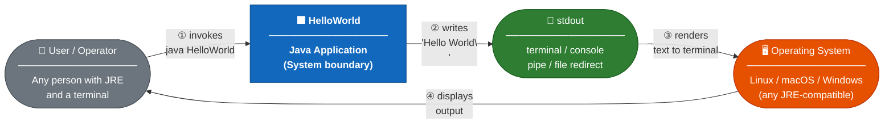

**System boundary definition:**

| Element                        | Inside System Boundary? | Notes                                                               |
|--------------------------------|-------------------------|---------------------------------------------------------------------|
| `HelloWorld` class             | ✅ Yes                  | The single application class                                        |
| `main()` method logic          | ✅ Yes                  | The sole execution logic                                            |
| `System.out` (PrintStream)     | ❌ No (JDK)             | Provided by the Java runtime; outside application boundary         |
| JVM process                    | ❌ No (infrastructure)  | Platform infrastructure                                             |
| Terminal / shell               | ❌ No (environment)     | User environment; outside system boundary                           |
| File system                    | ❌ No (not used)        | Not accessed by the application                                     |
| Network                        | ❌ No (not used)        | Not accessed by the application                                     |

### 3.2 Technical Context

The following diagram shows the full technical infrastructure context — the toolchain required to compile and execute the application, from source code to runtime output:

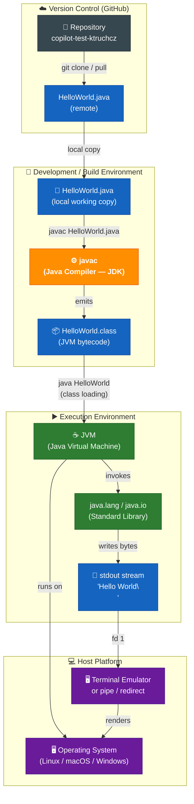

### 3.3 External Interfaces

| Interface          | Direction | Protocol / Mechanism                         | Data Type         | Description                                                                                          |
|--------------------|-----------|----------------------------------------------|-------------------|------------------------------------------------------------------------------------------------------|
| CLI invocation     | **Input** | OS process spawn (`java HelloWorld`)          | Process command   | Starts the JVM, passes the class name; JVM delegates to `main()`.                                   |
| `String[] args`    | **Input** | JVM parameter injection at process start      | `String[]`        | Command-line arguments array; received but **never read** in current implementation.                |
| Standard Output    | **Output**| `java.io.PrintStream` (`System.out`)          | UTF-8 text bytes  | Delivers the string `Hello World\n` (platform line ending) to the calling terminal or pipe target.  |
| Exit Code          | **Output**| OS process exit (`System.exit` / JVM return) | Integer (0 or 1)  | `0` = successful completion; `1` = JVM error (e.g., ClassNotFoundException).                       |
| Standard Error     | **Output**| JVM internal (`stderr`)                      | Error text bytes  | Used by the JVM itself for error messages (e.g., missing class); the application does not use it.   |

### 3.4 C4 Context Diagram

The following diagram presents the system in C4 Model *Context* level notation, showing the software system and its relationships with users and external systems:

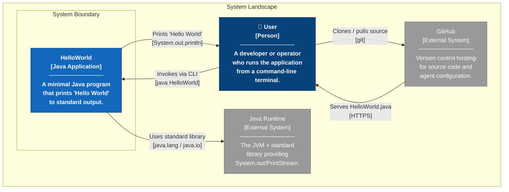

---

## 4. Solution Strategy

> **Source inputs for this section**: `HelloWorld.java` (technology stack analysis), architecture constraint mapping, quality goal alignment.

The solution strategy describes the fundamental decisions and solution approaches that shape the system's architecture. For a Hello World program, these decisions are deliberate acts of *omission* — the architecture's most important choices are what to leave out.

### 4.1 Technology Decisions

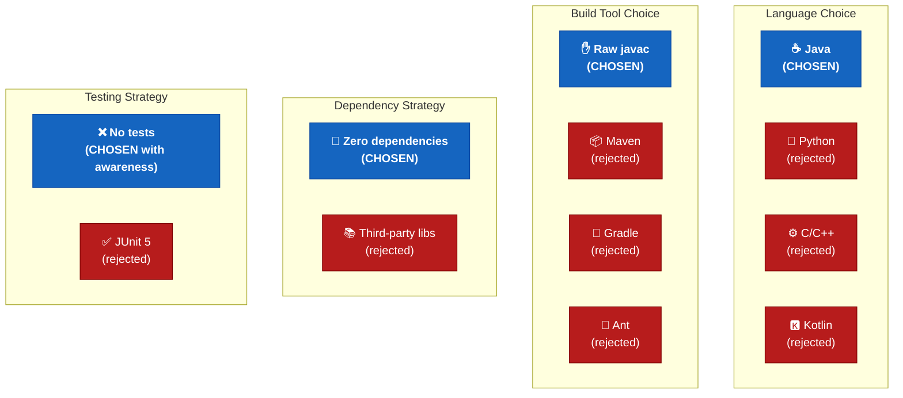

| Decision Area         | Choice                    | Rationale                                                                                                                    | Consequences                                                             |
|-----------------------|---------------------------|------------------------------------------------------------------------------------------------------------------------------|--------------------------------------------------------------------------|
| **Language**          | Java                      | Widely adopted, platform-independent via JVM. `javac`/`java` freely available on all major platforms.                       | Requires JRE on every target machine; produces bytecode, not native code |
| **Framework**         | None (plain `java.lang`)  | The requirement is trivially satisfied by a single `println` call; any framework would be disproportionate.                 | No framework scaffolding to learn; bare-bones I/O only                  |
| **Build tool**        | Raw `javac`               | One-file project has zero benefit from dependency management. Eliminates all configuration overhead.                         | Manual classpath management if project ever grows                        |
| **Dependencies**      | Zero external JARs        | `System.out.println` is part of every conforming JRE. Zero supply-chain risk, zero version conflicts, zero download time.   | Any future feature requiring libs will need a build tool introduced first |
| **Test framework**    | None                      | Testing a `println` call requires stdout-capture infrastructure whose complexity far exceeds the code under test.            | No automated regression safety; must add JUnit if code expands          |
| **Output mechanism**  | `System.out.println()`    | The standard, idiomatic Java method for writing a line to stdout. No formatting, no buffering management needed.            | Platform line separator is used automatically (correct cross-platform)  |
| **Output content**    | Hard-coded string literal  | A compile-time constant perfectly satisfies the deterministic-output quality goal.                                          | Cannot change output without recompilation                               |

### 4.2 Top-Level Decomposition Strategy

The application deliberately adopts a **flat, single-class, single-method** architecture. This is not a limitation — it is an intentional architectural decision to match the problem space:

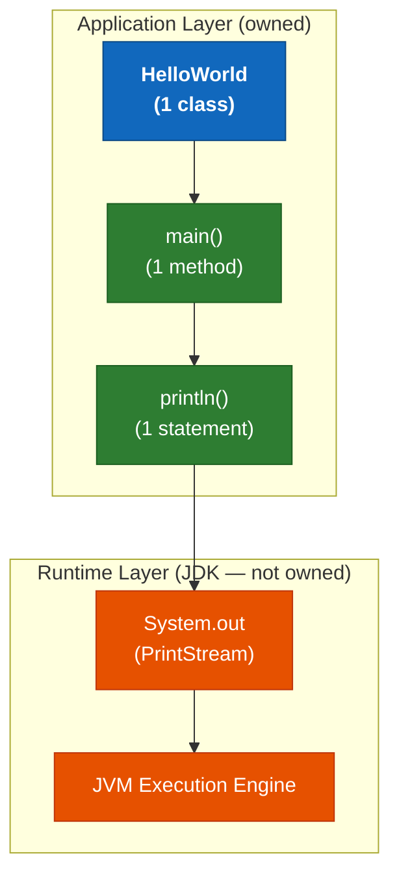

**Decomposition rationale:**

- **One class** (`HelloWorld`) — collocates all logic in one compilation unit, matching the convention that all Java programs require at least one class.
- **One method** (`main`) — the JVM-required entry point; no helper methods are extracted because there is no logic to decompose.
- **One statement** (`System.out.println(...)`) — directly and completely satisfies FR-01.
- **No packages** — the default package is used; packaging would add zero value at this scale.

### 4.3 Approach to Quality Goals

| Quality Goal          | Strategy Applied                                                                                             | Evidence in Code                                          |
|-----------------------|--------------------------------------------------------------------------------------------------------------|-----------------------------------------------------------|
| **Simplicity**        | Absolute minimum code — 5 lines including braces, 1 logical statement                                       | `HelloWorld.java`: 5 LOC total                           |
| **Portability**       | Rely only on `java.lang`, guaranteed on every JRE since version 1.0. Zero native or platform-specific calls | No `import` statements; only auto-imported `java.lang`   |
| **Reproducibility**   | No mutable state, no I/O reads, no randomness, no time-dependent operations → output is deterministic        | Single string literal `"Hello World"` with no variables  |
| **Maintainability**   | Code is at maximum readability: class name describes purpose, method is the JVM entry point, one action      | A developer can understand the full system in seconds     |
| **Minimal Footprint** | No configuration files, no dependency descriptors, no generated artefacts committed to repository            | `ls` of repository: 3 files (`.java`, `README.md`, doc)  |

---

## 5. Building Block View

> **Source inputs for this section**: `HelloWorld.java` (AST analysis, class structure, method signatures, statement analysis), Java Language Specification (class hierarchy).

The building block view describes the static decomposition of the system into building blocks (modules, components, classes) and their relationships.

### 5.1 Level 1 — System Whitebox

The entire system is a single deployable unit: one compiled Java class that interacts with the Java standard library.

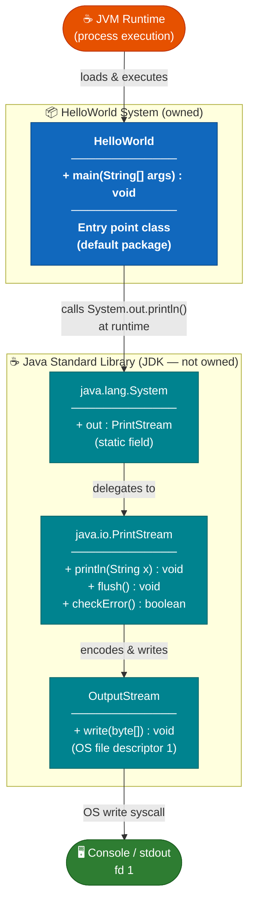

**Contained Building Blocks (Level 1):**

| Block                         | Type         | Responsibility                                                                     | Source / Origin         |
|-------------------------------|--------------|------------------------------------------------------------------------------------|-------------------------|
| `HelloWorld`                  | Class (owned)| Application entry point; issues the single output statement.                       | `HelloWorld.java`       |
| `java.lang.System`            | Class (JDK)  | Provides static reference `out` to the process's standard output stream.           | JDK `java.lang`         |
| `java.io.PrintStream`         | Class (JDK)  | Wraps the raw output stream; provides `println()` with encoding and buffering.     | JDK `java.io`           |
| OS stdout (file descriptor 1) | OS resource  | The actual byte sink; the terminal or pipe receiving the application's output.     | Operating system        |

### 5.2 Level 2 — HelloWorld Class Whitebox

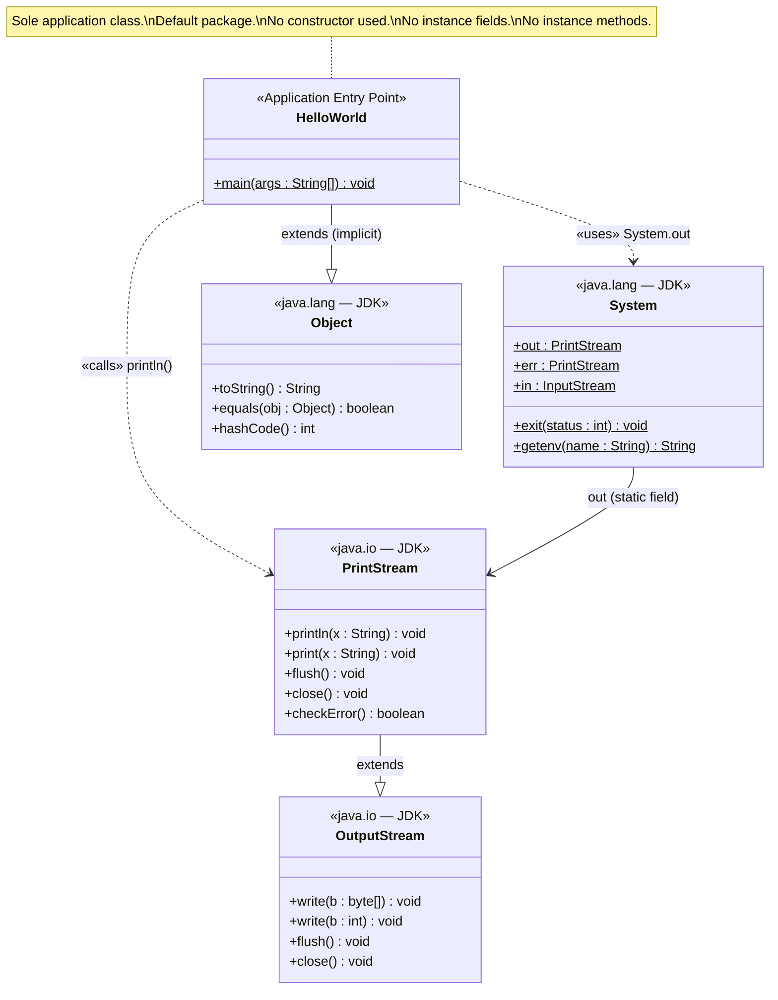

**Method inventory:**

| Class         | Method                    | Modifier        | Return  | Params           | Description                                                                                                                     |
|---------------|---------------------------|-----------------|---------|------------------|---------------------------------------------------------------------------------------------------------------------------------|
| `HelloWorld`  | `main(String[] args)`     | `public static` | `void`  | `String[] args`  | JVM entry point. Calls `System.out.println("Hello World")` and returns, causing the JVM to terminate the process with code 0.   |

**Field inventory:**

| Class         | Field    | Modifier        | Type          | Description                                                                        |
|---------------|----------|-----------------|---------------|------------------------------------------------------------------------------------|
| `HelloWorld`  | *(none)* | —               | —             | No fields declared. The class carries no state.                                    |

**Constructor inventory:**

| Class         | Constructor | Visibility  | Description                                                                                     |
|---------------|-------------|-------------|-------------------------------------------------------------------------------------------------|
| `HelloWorld`  | *(default)* | `public`    | Implicit no-arg constructor synthesised by the compiler. Never invoked during normal execution. |

### 5.3 Level 3 — Statement-Level Detail

Decomposing the single statement `System.out.println("Hello World")` into its constituent operations:

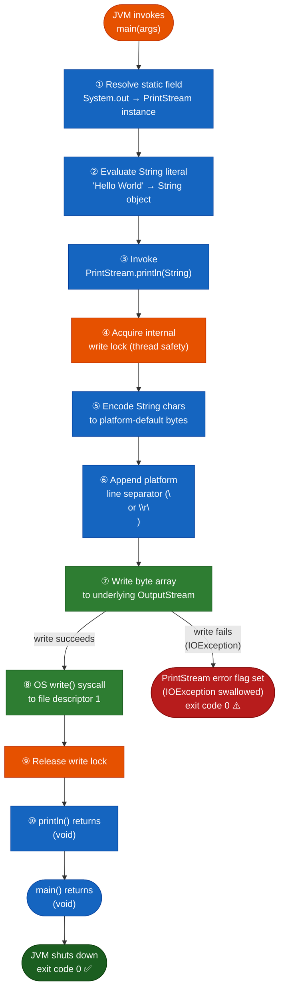

### 5.4 Dependency Graph

The complete transitive dependency graph of the application:

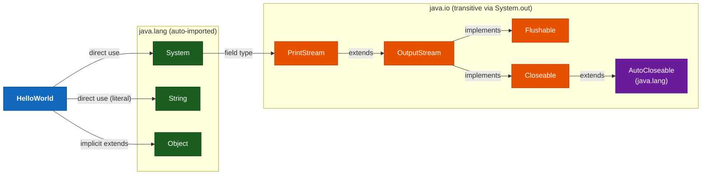

**Dependency summary:**

| Dependency                    | Type       | Reason                                  | Transitivity |
|-------------------------------|------------|-----------------------------------------|--------------|
| `java.lang.System`            | Direct     | `System.out` field access               | Direct       |
| `java.lang.String`            | Direct     | String literal `"Hello World"`          | Direct       |
| `java.lang.Object`            | Implicit   | Every Java class implicitly extends it  | Implicit     |
| `java.io.PrintStream`         | Transitive | Type of `System.out`                    | Transitive   |
| `java.io.OutputStream`        | Transitive | Superclass of `PrintStream`             | Transitive   |
| All other `java.*`            | None       | Not imported, not used                  | —            |
| Any third-party library       | **None**   | No external dependencies                | —            |

---

## 6. Runtime View

> **Source inputs for this section**: `HelloWorld.java` (runtime behaviour analysis), JVM specification (process lifecycle), Java I/O documentation (PrintStream behaviour).

The runtime view describes the behaviour of the system at runtime — how the building blocks interact with each other and the external environment as processes and threads.

### 6.1 Scenario 1 — Normal Execution

The primary (and only) intended runtime scenario: a user invokes the application from the command line with no arguments.

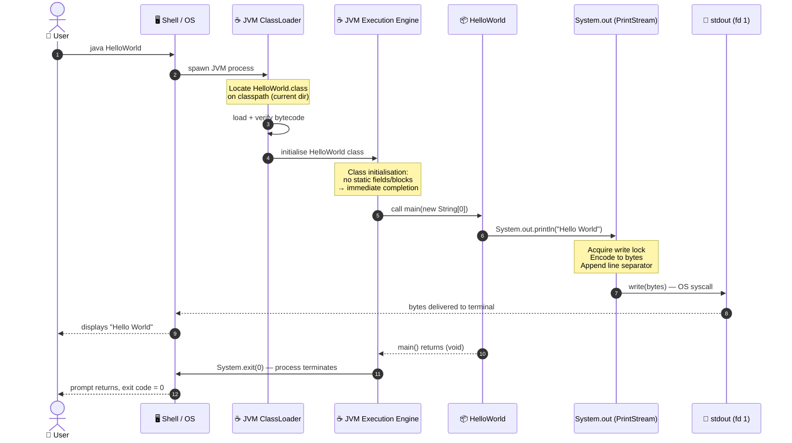

**Runtime characteristics for normal execution:**

| Characteristic          | Value / Description                                                                 |
|-------------------------|-------------------------------------------------------------------------------------|
| Total wall-clock time   | ~50–300 ms (dominated by JVM startup and class loading)                             |
| JVM startup time        | ~40–250 ms (varies with JDK version, hardware, OS, JIT warmup)                     |
| Application logic time  | < 1 ms (single `println` call)                                                      |
| Threads created         | 1 active (main thread) + JVM internal threads (GC, signal handler, etc.)           |
| Memory allocated        | ~10–30 MB JVM baseline                                                              |
| Bytes written to stdout | 12 bytes: `H e l l o   W o r l d \n` (Unix) / 13 bytes with `\r\n` (Windows)      |
| Exit code               | `0` (success)                                                                       |

### 6.2 Scenario 2 — Execution with Command-Line Arguments

The `main` method accepts `String[] args` per the JVM specification, but the current implementation never reads the array. Passing arguments has zero effect on the program's output or behaviour.

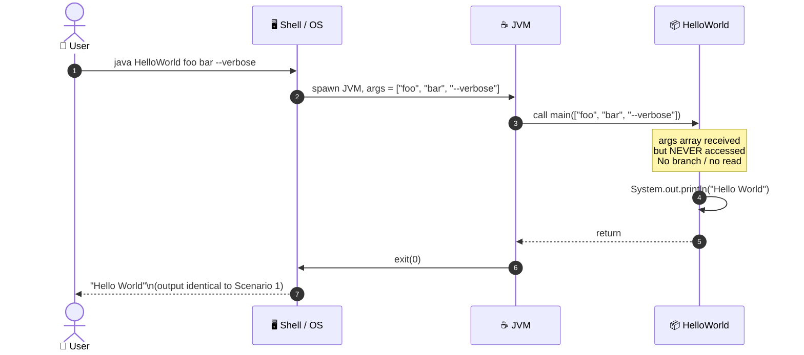

> ⚠️ **Note**: While ignoring args is architecturally correct for the current requirements, any future enhancement to make the greeting dynamic would require reading `args[0]` — this is tracked as technical debt TD-05 / potential feature.

### 6.3 Scenario 3 — Class Not Found (Error Path)

The most common error scenario: the user invokes `java HelloWorld` when `HelloWorld.class` is not on the classpath (e.g., source was not compiled, wrong working directory).

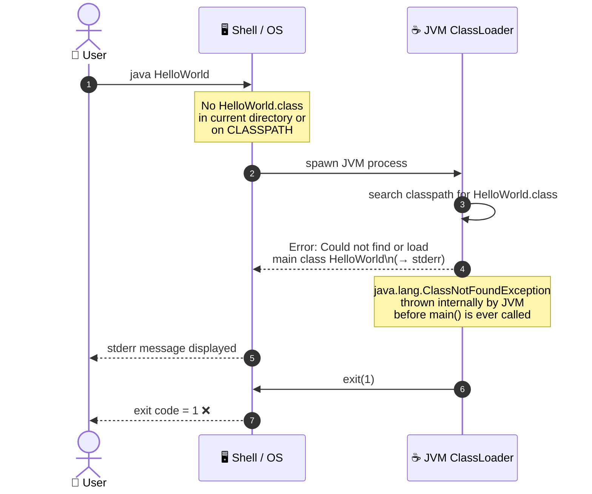

### 6.4 Scenario 4 — stdout Closed / IOException

An edge-case scenario where the stdout file descriptor is closed or redirected to a broken pipe before the application writes to it:

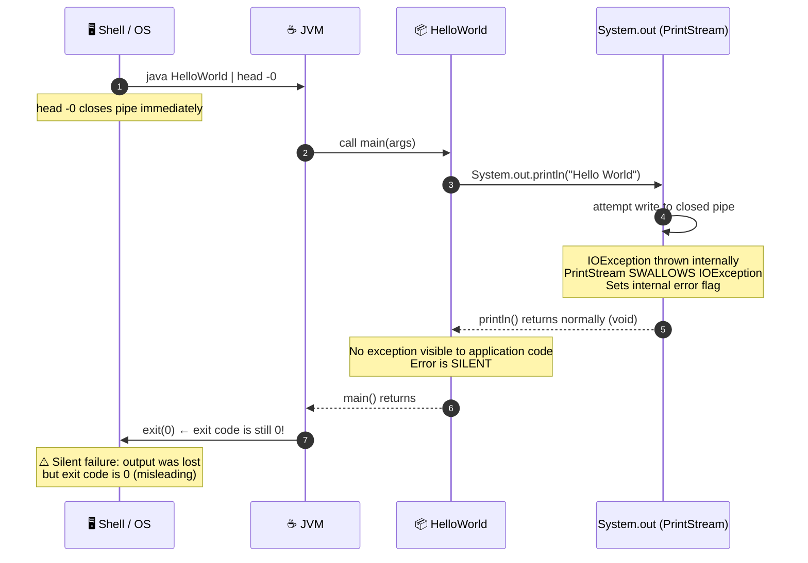

> ⚠️ **Architectural Note**: `PrintStream.println()` silently swallows `IOException`. This is by design in the JDK but means the application cannot detect failed output. The error flag can be checked via `System.out.checkError()`, but the current implementation does not do so (see risk R-06).

### 6.5 Application Lifecycle State Machine

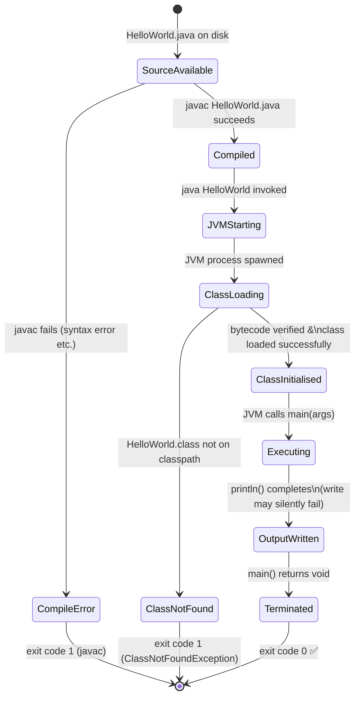

### 6.6 Data Flow

End-to-end data flow from source code character to rendered terminal pixel:

```mermaid
flowchart LR
    classDef src fill:#1B5E20,stroke:#0A3D0A,color:#fff
    classDef compile fill:#E65100,stroke:#BF360C,color:#fff
    classDef runtime fill:#1565C0,stroke:#0D47A1,color:#fff
    classDef os fill:#6A1B9A,stroke:#4A148C,color:#fff

    S1["📄 Source\n'Hello World'\nUnicode chars\nin .java file"]:::src
    S2["⚙️ javac\nCompiles to\nbytecode LDC\ninstruction"]:::compile
    S3["📦 .class file\nConstant pool\nentry #1:\n'Hello World'"]:::compile
    S4["☕ JVM\nLoads string\nfrom constant\npool"]:::runtime
    S5["🔤 String object\nUTF-16 chars\nin JVM heap\n'Hello World'"]:::runtime
    S6["📝 PrintStream\nEncodes UTF-16\n→ platform bytes\n(UTF-8 / ASCII)"]:::runtime
    S7["📊 byte[]\n48 65 6C 6C 6F\n20 57 6F 72 6C\n64 0A (Unix)"]:::runtime
    S8["🖥️ OS kernel\nwrite() syscall\nfd 1"]:::os
    S9["📺 Terminal\nbuffer / render\n'Hello World'"]:::os

    S1 -->|"compiler reads"| S2
    S2 -->|"emits"| S3
    S3 -->|"JVM loads"| S4
    S4 -->|"creates"| S5
    S5 -->|"println encodes"| S6
    S6 -->|"produces"| S7
    S7 -->|"write syscall"| S8
    S8 -->|"renders"| S9
```

---

## 7. Deployment View

> **Source inputs for this section**: `HelloWorld.java` (runtime requirements analysis), repository structure (no Dockerfile/CI workflow found), JVM platform documentation.

The deployment view describes the technical infrastructure required to run the system, and how software artefacts are mapped to infrastructure elements.

### 7.1 Infrastructure Overview

Because the application is a single compiled class with zero external dependencies, the deployment topology is the simplest possible: a host machine with a JRE installed and the compiled `.class` file present.

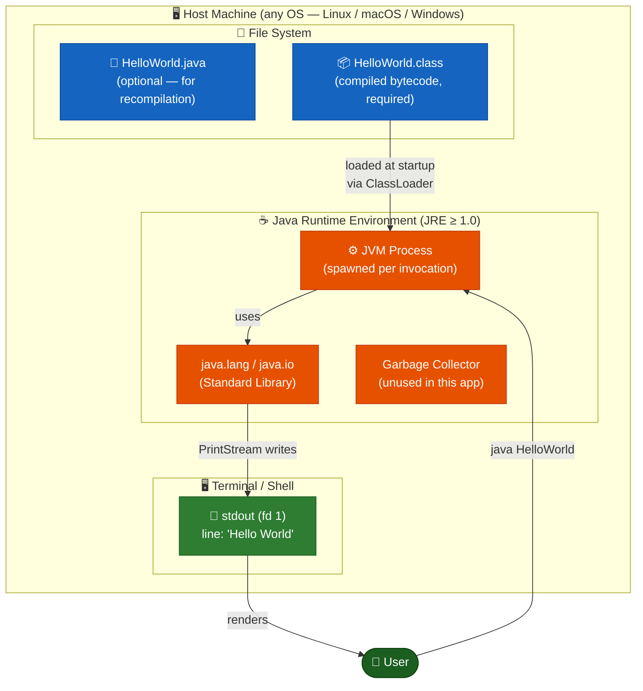

### 7.2 Build Pipeline

Before deployment, the source must be compiled. No pre-built artefact is committed to the repository. The build is a single `javac` command:

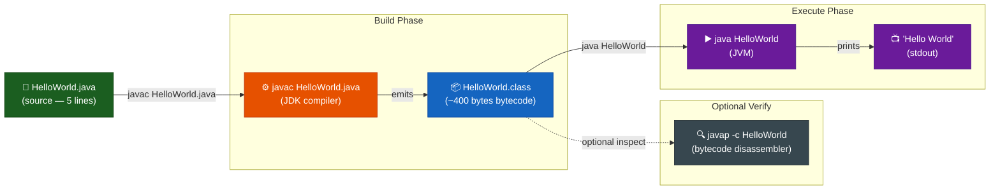

**Build commands:**

```bash
# Step 1: Compile (requires JDK)
javac HelloWorld.java

# Step 2: Run (requires JRE)
java HelloWorld

# Optional: Inspect bytecode
javap -c HelloWorld

# Optional: Run with explicit classpath
java -cp . HelloWorld
```

### 7.3 Deployment Variants

The application can be deployed in multiple ways depending on the target environment:


| Variant                 | Description                                                                   | Command Sequence                                                                          | JDK Required? | JRE Required? |
|-------------------------|-------------------------------------------------------------------------------|-------------------------------------------------------------------------------------------|---------------|---------------|
| **Local (developer)**   | Compile and run on developer workstation directly.                           | `javac HelloWorld.java` → `java HelloWorld`                                               | ✅ Yes        | ✅ Yes (JRE ⊂ JDK) |
| **CI runner**           | GitHub Actions runner with `actions/setup-java`.                             | Workflow: checkout → setup-java → `javac` → `java`                                        | ✅ Yes        | ✅ Yes        |
| **Docker container**    | Any image based on `openjdk` / `eclipse-temurin`.                            | `FROM eclipse-temurin:21-jdk` → `COPY` → `RUN javac` → `CMD java HelloWorld`             | ✅ Yes        | ✅ Yes        |
| **Executable JAR**      | Package `.class` into a self-contained JAR.                                  | `jar cfe HelloWorld.jar HelloWorld HelloWorld.class` → `java -jar HelloWorld.jar`         | ✅ Yes        | ✅ Yes        |
| **GraalVM native image**| Compile to platform-native binary, eliminating JVM startup overhead.        | `native-image HelloWorld` → `./helloworld`                                                | ✅ GraalVM    | ❌ No (self-contained) |

### 7.4 Docker Deployment

A reference `Dockerfile` for containerised deployment (not yet committed to repository — see TD-06):

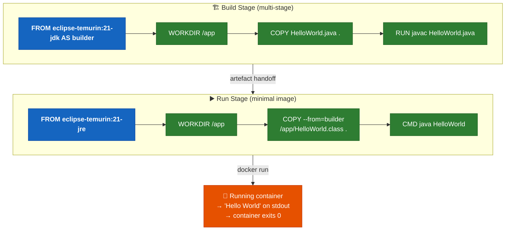

### 7.5 Minimum System Requirements

| Requirement             | Minimum Value                                          | Notes                                                            |
|-------------------------|--------------------------------------------------------|------------------------------------------------------------------|
| Java Runtime            | JRE 1.0 or later (JDK required for compilation)       | Tested on JDK 8, 11, 17, 21 (LTS versions)                     |
| Disk space (source)     | < 1 KB                                                 | `HelloWorld.java` is ~90 bytes                                  |
| Disk space (bytecode)   | < 1 KB                                                 | `HelloWorld.class` is ~400 bytes                                |
| RAM                     | JVM baseline: ~10–30 MB                                | No application heap allocation beyond JVM startup               |
| CPU                     | Any architecture with a compatible JVM port            | x86-64, ARM, RISC-V, etc.                                       |
| OS                      | Any OS supporting a Java 1.0+ JVM                      | Linux, macOS, Windows; also works on Solaris, AIX, FreeBSD      |
| Network                 | **None required**                                      | No network access during compilation or execution               |
| Database                | **None required**                                      | No data persistence                                             |
| Screen / GUI            | **None required**                                      | Terminal / stdout only; works headless                          |
| Filesystem permissions  | Read access to `.class` file; write access to stdout   | Standard user permissions sufficient                            |

---

## 8. Cross-cutting Concepts

> **Source inputs for this section**: `HelloWorld.java` (design pattern analysis, I/O analysis, security analysis), JVM specification, Java platform documentation.

Cross-cutting concepts describe principles, guidelines, and solutions that apply to the entire system (or a large part of it) and span multiple building blocks. They represent the "how" of recurring concerns.

### 8.1 Domain Model

The application's domain is deliberately trivial. The conceptual model contains a single entity: a greeting message with a fixed payload.

```mermaid
erDiagram
    GREETING {
        string text "Hello World"
        string destination "stdout (fd 1)"
        string encoding "platform default (UTF-8 on modern JDKs)"
        string lineEnding "platform line separator"
        integer byteLength "12 (Unix) or 13 (Windows)"
    }

    OUTPUT_STREAM {
        string type "java.io.PrintStream"
        string reference "System.out (static)"
        boolean autoFlush "false (println flushes)"
        string charset "OutputStreamWriter default"
    }

    PROCESS {
        string name "HelloWorld"
        integer exitCode "0 (success) or 1 (error)"
        string[] args "ignored — always empty effect"
    }

    GREETING ||--|| OUTPUT_STREAM : "written to"
    PROCESS ||--|| GREETING : "produces"
```

### 8.2 Output / Logging Concept

| Aspect                   | Decision                                                                                                 |
|--------------------------|----------------------------------------------------------------------------------------------------------|
| **Output channel**       | `System.out` — file descriptor 1 (`stdout`). This is the Unix standard for program result output.       |
| **Output format**        | Plain text `"Hello World"` terminated by platform line separator (`\n` Unix; `\r\n` Windows).           |
| **Logging framework**    | **None** — no SLF4J, Log4j 2, Logback, or `java.util.logging` is used or needed.                       |
| **Structured logging**   | Not applicable — no events to log, no structured context to capture.                                    |
| **Log levels**           | Not applicable — no error/warn/info/debug distinction needed.                                            |
| **Asynchronous output**  | Not applicable — synchronous single-threaded write only.                                                 |
| **Output buffering**     | Handled transparently by `PrintStream` — `println()` flushes if `autoFlush=true` (not default for `System.out`). Buffer is flushed on JVM exit. |
| **Output encoding**      | Charset is determined by `OutputStreamWriter` default — platform-dependent. On Java 18+: UTF-8. Earlier: `file.encoding` system property. |

### 8.3 Error Handling Concept

The error handling strategy is minimal by design, as the application has almost no failure modes:

```mermaid
flowchart TB
    classDef error fill:#B71C1C,stroke:#7F0000,color:#fff
    classDef handled fill:#1B5E20,stroke:#0A3D0A,color:#fff
    classDef jvm fill:#E65100,stroke:#BF360C,color:#fff
    classDef silent fill:#6A1B9A,stroke:#4A148C,color:#fff

    subgraph before_main["Before main() — JVM handles"]
        E1["ClassNotFoundException\n(missing .class file)"]:::jvm
        E2["NoClassDefFoundError\n(corrupt .class file)"]:::jvm
        E3["UnsupportedClassVersionError\n(JDK too old)"]:::jvm
    end

    subgraph in_main["In main() — Application level"]
        E4["IOException on stdout\n(broken pipe / closed fd)"]:::silent
        E5["Unexpected args content\n(any String[] value)"]:::handled
    end

    JVM_EXIT_1(["JVM exits: code 1\nError on stderr"]):::error
    SILENT_FAIL(["main() returns normally\nexit code 0 (misleading)"]):::silent
    NORMAL(["main() returns normally\nexit code 0"]):::handled

    E1 --> JVM_EXIT_1
    E2 --> JVM_EXIT_1
    E3 --> JVM_EXIT_1
    E4 -->|"PrintStream swallows exception\nsets error flag — never checked"| SILENT_FAIL
    E5 -->|"args never read\nno error"| NORMAL
```

| Error Type                      | Handling Strategy                                                                                            | Detectable? |
|---------------------------------|--------------------------------------------------------------------------------------------------------------|-------------|
| `ClassNotFoundException`        | Raised by JVM before `main()` is entered; prints to stderr; exits with code 1.                              | ✅ Via exit code |
| `NoClassDefFoundError`          | Raised by JVM if `.class` is corrupt; prints to stderr; exits with code 1.                                  | ✅ Via exit code |
| `UnsupportedClassVersionError`  | Raised if JRE is older than the target bytecode version; prints to stderr; exits with code 1.               | ✅ Via exit code |
| `IOException` on stdout         | Silently swallowed by `PrintStream`; error flag set internally; `println()` returns normally.               | ⚠️ Only via `System.out.checkError()` — not called |
| Unexpected `args` content       | `args` is never read → completely harmless, no error of any kind.                                           | ✅ N/A — not an error |
| `OutOfMemoryError`              | Theoretically possible (JVM heap exhausted), but practically impossible for a single `println` call.        | ✅ JVM crash |

### 8.4 Internationalisation (i18n)

The application has no internationalisation support. This is an intentional design decision:

| i18n Aspect                     | Status      | Notes                                                                                                |
|---------------------------------|-------------|------------------------------------------------------------------------------------------------------|
| Output string locale            | ❌ None      | `"Hello World"` is a compile-time constant in ASCII; no locale lookup is performed.                 |
| Resource bundles                | ❌ None      | No `*.properties` files, no `ResourceBundle` usage.                                                  |
| Character encoding              | ⚠️ Partial  | `PrintStream` uses platform default charset; on Java 18+ this is UTF-8 by default.                   |
| Right-to-left (RTL) support     | ❌ None      | "Hello World" is left-to-right ASCII only.                                                           |
| Date / number formatting        | ❌ N/A       | No date or number output.                                                                            |
| Potential enhancement           | —           | Could externalise the string to a `ResourceBundle` with locale variants (see TD-05).                |

### 8.5 Security Concept

The Hello World application presents an exceptionally small attack surface — essentially zero:

```mermaid
graph LR
    classDef safe fill:#1B5E20,stroke:#0A3D0A,color:#fff
    classDef none fill:#37474F,stroke:#263238,color:#fff

    subgraph threats["Threat Vectors — Assessment"]
        T1["💉 Code Injection\n(NONE — no user input evaluated)"]:::safe
        T2["📁 Path Traversal\n(NONE — no file I/O)"]:::safe
        T3["🌐 SSRF / Network\n(NONE — no network calls)"]:::safe
        T4["🔑 Credential Exposure\n(NONE — no secrets in code)"]:::safe
        T5["📦 Supply Chain\n(NONE — zero dependencies)"]:::safe
        T6["🔒 Privilege Escalation\n(NONE — no OS calls beyond stdout write)"]:::safe
        T7["💣 DoS / Resource Exhaustion\n(NEGLIGIBLE — single println)"]:::safe
        T8["🔐 Data Exposure\n(NONE — output is a fixed public string)"]:::safe
    end
```

| Threat Vector              | Exposure     | Justification                                                                                                    |
|----------------------------|--------------|------------------------------------------------------------------------------------------------------------------|
| Code injection             | **None**     | No user input is read, parsed, or evaluated at runtime.                                                         |
| SQL injection              | **None**     | No database connectivity.                                                                                        |
| Path traversal             | **None**     | No file I/O operations beyond reading `.class` from classpath (JVM responsibility).                            |
| Network exposure           | **None**     | No sockets, no HTTP clients, no RPC frameworks.                                                                  |
| Dependency vulnerabilities | **None**     | Zero third-party dependencies. Only the JDK itself is a potential CVE source (mitigated by keeping JDK updated). |
| Sensitive data exposure    | **None**     | The only output is the fixed string `"Hello World"`. No environment variables, system properties, or secrets are read. |
| Privilege escalation       | **None**     | No native calls, no `Runtime.exec()`, no `ProcessBuilder`.                                                      |

### 8.6 Performance Concept

| Performance Aspect         | Characteristic                                                                                              |
|----------------------------|-------------------------------------------------------------------------------------------------------------|
| **Throughput**             | Single execution, single output line. Throughput concept not applicable.                                    |
| **Latency**                | Total: ~50–300 ms (JVM startup ~40–250 ms + `println` < 1 ms).                                            |
| **Memory footprint**       | JVM baseline: ~10–30 MB. Application code allocates one String object on the heap (negligible).            |
| **CPU usage**              | Negligible — single method call with zero computation.                                                      |
| **I/O pattern**            | Single synchronous write of 12–13 bytes to stdout. No buffering concerns at application level.             |
| **Startup optimisation**   | Not applicable for a demonstration program. GraalVM native-image can reduce startup to < 5 ms if needed.  |
| **Concurrency**            | Single-threaded. No synchronisation needed. `PrintStream` is thread-safe but that feature is unused.        |
| **Scalability**            | Not applicable — single-shot CLI tool with no state.                                                        |

### 8.7 Design Patterns Applied

```mermaid
graph TB
    classDef pattern fill:#1565C0,stroke:#0D47A1,color:#fff,font-weight:bold
    classDef location fill:#2E7D32,stroke:#1B5E20,color:#fff
    classDef notapplied fill:#B71C1C,stroke:#7F0000,color:#fff

    subgraph applied["✅ Patterns Applied"]
        EP["Entry Point Pattern\nHelloWorld.main()"]:::pattern
        FA["Façade Pattern\n(System.out wraps OutputStream)"]:::pattern
        SI["Singleton Pattern\n(System.out is a global singleton)"]:::pattern
    end

    subgraph na["❌ Patterns Not Applicable (at this scale)"]
        GOF["GoF Creational Patterns\n(Factory, Builder, Prototype...)"]:::notapplied
        STRUCT["GoF Structural Patterns\n(Adapter, Composite, Decorator...)"]:::notapplied
        BEH["GoF Behavioural Patterns\n(Strategy, Observer, Command...)"]:::notapplied
        EE["Enterprise Patterns\n(Repository, Service, DAO...)"]:::notapplied
    end
```

| Pattern                 | Location                      | Description                                                                                                             |
|-------------------------|-------------------------------|-------------------------------------------------------------------------------------------------------------------------|
| **Entry Point**         | `HelloWorld.main()`           | Standard Java application entry point: `public static void main(String[] args)` is the JVM-mandated program start.    |
| **Façade** (JDK)        | `System.out` (`PrintStream`)  | `PrintStream` provides a simplified interface (`println`) hiding the complexity of encoding, buffering, and OS I/O.   |
| **Singleton** (JDK)     | `System.out`                  | `System.out` is a globally shared singleton `PrintStream` instance managed by the JVM.                                |

No additional GoF or enterprise patterns are applicable or present in application code at this scale.

### 8.8 Observability

The application provides minimal observability:

| Observability Aspect    | Status                           | Implementation                                                                                    |
|-------------------------|----------------------------------|---------------------------------------------------------------------------------------------------|
| **Logging**             | ❌ Not implemented               | No logging framework. Output is the payload, not a log.                                           |
| **Metrics**             | ❌ Not implemented               | No metrics collection (Micrometer, JMX, etc.).                                                   |
| **Tracing**             | ❌ Not implemented               | No distributed tracing (OpenTelemetry, Jaeger, etc.).                                            |
| **Health checks**       | ❌ Not applicable                | CLI tool — no long-running process to health-check.                                               |
| **Exit code**           | ✅ Implicit                      | JVM exits with `0` on success, `1` on startup error. Observable by the calling shell.            |
| **Stdout output**       | ✅ The payload                   | `"Hello World"` on stdout is both the functional output AND the only observable result.           |
| **JVM diagnostics**     | ⚠️ External tooling only         | JVM flags like `-verbose:gc`, `-Xlog`, `-XX:+PrintCompilation` can be added externally.          |

---

## 9. Architecture Decisions

> **Source inputs for this section**: All prior sections, constraint analysis, quality goal alignment, technology stack analysis of `HelloWorld.java`.

Architecture decisions are documented in **Architecture Decision Record (ADR)** format. Each ADR captures the context, decision, rationale, alternatives considered, and consequences.

```mermaid
graph LR
    classDef accepted fill:#1B5E20,stroke:#0A3D0A,color:#fff,font-weight:bold
    classDef accepted_risk fill:#E65100,stroke:#BF360C,color:#fff,font-weight:bold

    ADR1["ADR-001\nJava Language\n✅ Accepted"]:::accepted
    ADR2["ADR-002\nNo Build Tool\n✅ Accepted"]:::accepted
    ADR3["ADR-003\nNo Dependencies\n✅ Accepted"]:::accepted
    ADR4["ADR-004\nNo Tests\n⚠️ Accepted w/ Risk"]:::accepted_risk
    ADR5["ADR-005\nHard-coded String\n✅ Accepted"]:::accepted
    ADR6["ADR-006\nNo Logging\n✅ Accepted"]:::accepted
    ADR7["ADR-007\nNo CI Pipeline\n⚠️ Accepted w/ Risk"]:::accepted_risk

    ADR1 --> ADR2 --> ADR3
    ADR3 --> ADR4
    ADR1 --> ADR5
    ADR3 --> ADR6
    ADR2 --> ADR7
```

---

### ADR-001 — Use Java as the Implementation Language

| Field                    | Value                                                                                                                                                                  |
|--------------------------|------------------------------------------------------------------------------------------------------------------------------------------------------------------------|
| **Status**               | ✅ Accepted                                                                                                                                                             |
| **Date**                 | Project inception                                                                                                                                                      |
| **Deciders**             | Repository owner (`ktruchcz`)                                                                                                                                          |
| **Context**              | A minimal demonstration program is needed to verify a working Java development environment and serve as a baseline for GitHub Copilot experiments.                     |
| **Decision**             | Implement the application in Java.                                                                                                                                     |
| **Rationale**            | Java is widely adopted in enterprise contexts, platform-independent via the JVM (write-once-run-anywhere), and standard tooling (`javac`, `java`) is freely available on all major platforms. It aligns with the repository's purpose as a Copilot analysis target. |
| **Consequences (+)**     | Platform independence; well-understood by most enterprise developers; rich tooling ecosystem available if the project grows.                                            |
| **Consequences (−)**     | Requires a JRE on every target machine; cold JVM startup adds 50–250 ms latency; produces bytecode rather than a native binary.                                       |
| **Alternatives rejected**| Python (no compilation step, but not Java-ecosystem); C/C++ (native binary, no JVM dependency, but no platform independence); Kotlin (modern JVM language, but heavier for a 1-line program). |

---

### ADR-002 — No Build Tool (Raw javac)

| Field                    | Value                                                                                                                                                                  |
|--------------------------|------------------------------------------------------------------------------------------------------------------------------------------------------------------------|
| **Status**               | ✅ Accepted                                                                                                                                                             |
| **Date**                 | Project inception                                                                                                                                                      |
| **Context**              | Single-file project with zero external dependencies; FR-01 requires only a `println` call.                                                                             |
| **Decision**             | Compile directly with `javac HelloWorld.java`; do not introduce Maven, Gradle, or Ant.                                                                                 |
| **Rationale**            | A build tool would add configuration overhead (`pom.xml` ~50+ lines, `build.gradle` ~20+ lines) with zero benefit for a single-class, zero-dependency project.        |
| **Consequences (+)**     | Zero configuration overhead; zero wrapper scripts; zero network requests at build time; immediate compile-and-run capability on any JDK installation.                 |
| **Consequences (−)**     | Classpath management, dependency resolution, and packaging must be done manually if the project ever grows beyond a single file. No reproducible build guarantee.     |
| **Alternatives rejected**| Maven (standard but adds `pom.xml`, Maven wrapper, `.m2` cache); Gradle (flexible but adds `build.gradle`, Gradle wrapper, Gradle cache); Ant (legacy, XML-heavy).    |

---

### ADR-003 — No External Dependencies

| Field                    | Value                                                                                                                                                                  |
|--------------------------|------------------------------------------------------------------------------------------------------------------------------------------------------------------------|
| **Status**               | ✅ Accepted                                                                                                                                                             |
| **Date**                 | Project inception                                                                                                                                                      |
| **Context**              | The output requirement is satisfied by a single call to `System.out.println()`.                                                                                        |
| **Decision**             | Use only `java.lang.System` and `java.io.PrintStream` from the JDK standard library. No third-party JARs.                                                             |
| **Rationale**            | Zero external dependencies means: zero supply-chain risk (no CVEs in third-party libs), zero version conflicts, zero download requirements, zero licence compliance burden. |
| **Consequences (+)**     | Maximum portability; offline-capable; zero security scanning overhead; no version drift.                                                                               |
| **Consequences (−)**     | If requirements expand (e.g., structured logging, HTTP output, JSON formatting), dependencies must be introduced along with a build tool (ADR-002 consequence).       |
| **Alternatives rejected**| Apache Commons Lang (unnecessary overhead); SLF4J (logging overkill); Guava (no applicable utilities); any output-formatting library.                                 |

---

### ADR-004 — No Unit Tests

| Field                    | Value                                                                                                                                                                  |
|--------------------------|------------------------------------------------------------------------------------------------------------------------------------------------------------------------|
| **Status**               | ⚠️ Accepted (with awareness of quality risk R-01)                                                                                                                     |
| **Date**                 | Project inception                                                                                                                                                      |
| **Context**              | The sole observable behaviour is a single `System.out.println("Hello World")` statement.                                                                              |
| **Decision**             | No test framework (JUnit 5, TestNG, Mockito) is included.                                                                                                              |
| **Rationale**            | Testing `System.out.println("Hello World")` would require: (1) a test framework dependency contradicting ADR-003, (2) stdout capture infrastructure (`ByteArrayOutputStream` redirect) whose complexity far exceeds the code under test, and (3) a build tool contradicting ADR-002. The regression risk from the current single-statement implementation is negligible. |
| **Consequences (+)**     | Simpler project structure; no test framework version management.                                                                                                      |
| **Consequences (−)**     | No automated regression safety net. Any future modification of the codebase is unverified. Technical debt TD-01 must be addressed if the project evolves.            |
| **Alternatives rejected**| JUnit 5 with `System.setOut()` capture (adds complexity disproportionate to the risk); TestNG; Mockito (nothing to mock).                                             |

---

### ADR-005 — Hard-coded Output String

| Field                    | Value                                                                                                                                                                  |
|--------------------------|------------------------------------------------------------------------------------------------------------------------------------------------------------------------|
| **Status**               | ✅ Accepted                                                                                                                                                             |
| **Date**                 | Project inception                                                                                                                                                      |
| **Context**              | FR-01 specifies a fixed string `"Hello World"`. The string never changes at runtime.                                                                                   |
| **Decision**             | Embed `"Hello World"` as a compile-time string literal directly in the `println()` call.                                                                               |
| **Rationale**            | A compile-time constant guarantees the reproducibility quality goal (QG-3). No configuration file, environment variable, or command-line argument is needed to satisfy FR-01. |
| **Consequences (+)**     | Deterministic output guaranteed at compile time; no configuration parsing; no externalisation overhead.                                                               |
| **Consequences (−)**     | Changing the output string requires recompilation. The string is not accessible to tools without source analysis. Tracked as TD-05 if parameterisation becomes needed. |
| **Alternatives rejected**| System property (`-Dmessage=...`); command-line argument (`args[0]`); resource bundle (`ResourceBundle.getBundle()`); properties file — all add complexity with no current benefit. |

---

### ADR-006 — No Logging Framework

| Field                    | Value                                                                                                                                                                  |
|--------------------------|------------------------------------------------------------------------------------------------------------------------------------------------------------------------|
| **Status**               | ✅ Accepted                                                                                                                                                             |
| **Date**                 | Project inception                                                                                                                                                      |
| **Context**              | The application has no internal state transitions, no error conditions to diagnose, and a single execution path.                                                       |
| **Decision**             | Use no logging framework (SLF4J, Log4j 2, Logback, `java.util.logging`). The single `println` to stdout is both the functional output and the complete execution trace. |
| **Rationale**            | A logging framework would add dependency weight contradicting ADR-003. There are no events, no levels (INFO/WARN/ERROR), no MDC context, and no audit requirements for a Hello World program. |
| **Consequences (+)**     | Zero configuration (`logback.xml`, `log4j2.xml`); zero dependency; zero classpath scanning at startup.                                                                |
| **Consequences (−)**     | Any future requirement to add operational logging will need a framework introduction and dependency management.                                                        |
| **Alternatives rejected**| SLF4J + Logback; Log4j 2; `java.util.logging` (built-in but verbose to configure).                                                                                   |

---

### ADR-007 — No CI/CD Pipeline

| Field                    | Value                                                                                                                                                                  |
|--------------------------|------------------------------------------------------------------------------------------------------------------------------------------------------------------------|
| **Status**               | ⚠️ Accepted (with awareness of process risk R-03)                                                                                                                     |
| **Date**                 | Project inception                                                                                                                                                      |
| **Context**              | The `.github/` directory contains agent and skill definitions only; no workflow YAML files exist.                                                                      |
| **Decision**             | No GitHub Actions workflow for automated build, test, or deployment is currently defined.                                                                              |
| **Rationale**            | For a demonstration program with a single source file and no external contributors, the overhead of maintaining a CI pipeline exceeds the benefit. Manual verification (`javac` + `java`) takes under 5 seconds. |
| **Consequences (+)**     | No pipeline maintenance burden; no actions runner costs; no workflow version management.                                                                               |
| **Consequences (−)**     | Code changes are not automatically verified. No badge for build status. No automated deployment. Technical debt TD-03 should be addressed if the project grows.      |
| **Alternatives rejected**| GitHub Actions with `setup-java` + `javac` + `java` (straightforward but adds file overhead); Jenkins; CircleCI.                                                     |

---

## 10. Quality Requirements

> **Source inputs for this section**: Quality goals (Section 1.2), code metrics (AST analysis of `HelloWorld.java`), architecture constraint analysis (Section 2).

### 10.1 Quality Tree

The following mind map captures all quality attributes of the system, organised hierarchically from the five top-level quality goals established in Section 1.2:

```mermaid
mindmap
  root((Quality\nGoals))
    Simplicity
      Single class
        HelloWorld.java
        No package hierarchy
      Single method
        main only
        No helpers
      Single statement
        One println call
      Zero configuration
        No XML / YAML
        No properties files
      Minimal LOC
        5 total lines
        1 logic line
    Portability
      JVM platform independence
        Linux ✅
        macOS ✅
        Windows ✅
        Any JRE platform ✅
      No native code
        No JNI
        No JNA
      No OS-specific APIs
        No java.nio.file
        No Runtime.exec
      Backward compatibility
        JDK 1.0 compatible
        No modern API usage
    Reproducibility
      Deterministic output
        Same bytes every run
        No randomness
      No mutable state
        No instance fields
        No static fields
      No external input
        args ignored
        No stdin read
        No file read
    Maintainability
      Readable at a glance
        Self-explanatory name
        Standard idioms only
      No hidden dependencies
        Zero third-party libs
        Auto-import only
      Comprehensibility
        30s to understand
        No abstractions
    Security
      No attack surface
        No user input eval
        No deserialization
      No network
        No sockets
        No HTTP clients
      No file system write
        stdout only
      Zero supply chain risk
        No dependencies
    Performance
      Fast startup goal
        Less than 500ms
        JVM dominates
      Low memory
        JVM baseline only
        No heap allocation
      Immediate termination
        Single pass
        No event loop
```

### 10.2 Quality Scenarios

Quality scenarios make quality requirements concrete and measurable. Each scenario follows the structure: *stimulus → system → response → metric*.

| ID    | Quality Attribute     | Stimulus                                                          | Context / System State        | Response                                                              | Response Metric                        | Status      |
|-------|-----------------------|-------------------------------------------------------------------|-------------------------------|-----------------------------------------------------------------------|----------------------------------------|-------------|
| QS-01 | **Correctness**       | User runs `java HelloWorld`                                       | `.class` file on classpath    | Exactly `Hello World\n` written to stdout, exit code 0               | 100% byte-exact match every invocation | ✅ Satisfied |
| QS-02 | **Portability**       | Application compiled on JDK 8 and run on JRE 21                  | Any conforming JVM            | Identical output; no compatibility errors                             | Pass on JDK 8, 11, 17, 21             | ✅ Satisfied |
| QS-03 | **Portability**       | Application run on Linux, macOS, Windows simultaneously           | Three different OS families   | Identical stdout content (`Hello World`)                             | Pass on all 3 OS families              | ✅ Satisfied |
| QS-04 | **Performance**       | User runs `java HelloWorld` on any modern machine                 | Cold JVM start                | Output appears within 500 ms wall-clock time                         | ≤ 500 ms (p99)                        | ✅ Satisfied |
| QS-05 | **Reproducibility**   | Application run 1,000 times consecutively                         | Same machine, same JDK        | Every invocation produces byte-identical stdout                       | 0 deviations in 1,000 runs            | ✅ Satisfied |
| QS-06 | **Understandability** | Java developer reads `HelloWorld.java` for the first time         | No prior context              | Developer understands the full behaviour and purpose immediately      | Comprehension time ≤ 30 seconds       | ✅ Satisfied |
| QS-07 | **Robustness**        | `java HelloWorld arg1 arg2 arg3` invoked with arbitrary arguments | Any string arguments          | Output unchanged; `Hello World\n` on stdout; exit code 0             | No behavioural change                  | ✅ Satisfied |
| QS-08 | **Minimal Footprint** | Developer clones the repository                                   | Empty working directory       | Only 3 files present: `.java`, `README.md`, `arc42-documentation.md` | External dependency count = 0         | ✅ Satisfied |
| QS-09 | **Security**          | Attacker provides malicious arguments                             | Any input via `args[]`        | Arguments ignored; output unchanged; no code executed from input      | Zero user-controlled code execution   | ✅ Satisfied |
| QS-10 | **Maintainability**   | New contributor modifies the output string                        | One character change in source| Change takes effect after single `javac` recompilation; no other files to update | Edit-to-running time ≤ 60 seconds | ✅ Satisfied |

### 10.3 Code Metrics

Code metrics derived from static analysis of `HelloWorld.java`:

```mermaid
graph LR
    classDef metric fill:#1565C0,stroke:#0D47A1,color:#fff
    classDef value fill:#1B5E20,stroke:#0A3D0A,color:#fff,font-weight:bold
    classDef warn fill:#E65100,stroke:#BF360C,color:#fff

    subgraph size["📏 Size Metrics"]
        M1["Total LOC\n5"]:::value
        M2["Logic LOC\n1"]:::value
        M3["Comment LOC\n0"]:::warn
        M4["Blank lines\n0"]:::value
    end

    subgraph complexity["🔀 Complexity Metrics"]
        M5["Cyclomatic\nComplexity\n1"]:::value
        M6["Cognitive\nComplexity\n0"]:::value
        M7["Nesting\nDepth\n1"]:::value
        M8["Decision\nPoints\n0"]:::value
    end

    subgraph structure["🏗️ Structure Metrics"]
        M9["Classes\n1"]:::value
        M10["Methods\n1"]:::value
        M11["Statements\n1"]:::value
        M12["Parameters\n1"]:::value
    end

    subgraph quality_["✅ Quality Metrics"]
        M13["External\nDeps\n0"]:::value
        M14["Test Coverage\n0%"]:::warn
        M15["Technical Debt\n< 1h"]:::value
        M16["Javadoc\nCoverage\n0%"]:::warn
    end
```

| Metric                           | Value        | Target / Industry Average         | Status   |
|----------------------------------|--------------|-----------------------------------|----------|
| Lines of Code — total            | 5            | N/A (minimal by design)           | ✅ Optimal |
| Lines of Code — logic            | 1            | N/A (minimal by design)           | ✅ Optimal |
| Lines of Code — comments         | 0            | > 0 for production code           | ⚠️ Gap    |
| Number of classes                | 1            | N/A                               | ✅ Optimal |
| Number of methods                | 1            | N/A                               | ✅ Optimal |
| Number of statements             | 1            | N/A                               | ✅ Optimal |
| Number of parameters (max)       | 1 (`args`)   | ≤ 5 recommended                   | ✅ Optimal |
| Cyclomatic complexity            | 1            | ≤ 10 acceptable; ≤ 5 recommended  | ✅ Optimal |
| Cognitive complexity             | 0            | ≤ 15 recommended                  | ✅ Optimal |
| Maximum nesting depth            | 1            | ≤ 4 recommended                   | ✅ Optimal |
| External dependencies            | 0            | Minimal                           | ✅ Optimal |
| Test coverage (line)             | 0%           | ≥ 80% for production code         | ⚠️ Gap    |
| Javadoc coverage                 | 0%           | ≥ 80% for production APIs         | ⚠️ Gap    |
| Technical debt (SonarQube equiv.)| < 5 minutes  | ≤ 5% of development time          | ✅ Optimal |
| Code duplication                 | 0%           | < 5%                              | ✅ Optimal |
| Security hotspots                | 0            | 0                                 | ✅ Optimal |

### 10.4 Fitness Functions

Architectural fitness functions that could be used to automatically verify the architecture's constraints:

| ID    | Fitness Function                                              | Verification Method                                                  | Frequency    | Status         |
|-------|---------------------------------------------------------------|----------------------------------------------------------------------|--------------|----------------|
| FF-01 | `HelloWorld.class` compiles without error or warning          | `javac HelloWorld.java` exits 0                                      | Every commit | ⚠️ Not automated |
| FF-02 | Application output equals `"Hello World\n"` exactly          | `java HelloWorld | xxd` byte comparison                              | Every commit | ⚠️ Not automated |
| FF-03 | Application exit code equals 0                               | `java HelloWorld; echo $?` equals `0`                               | Every commit | ⚠️ Not automated |
| FF-04 | No third-party JARs on classpath                             | `javap -verbose HelloWorld` checks constant pool references          | Every change | ⚠️ Not automated |
| FF-05 | Cyclomatic complexity ≤ 1                                    | Static analysis tool (e.g., Checkstyle, PMD)                        | Every commit | ⚠️ Not automated |
| FF-06 | Number of classes ≤ 1                                        | `find . -name "*.java" | wc -l` equals `1`                          | Every change | ⚠️ Not automated |

> 💡 **Recommendation**: These fitness functions should be implemented as a GitHub Actions workflow (addresses TD-03 and R-03).

---

## 11. Risks and Technical Debts

> **Source inputs for this section**: Code analysis (missing artefacts), constraint analysis (Section 2), ADR consequences (Section 9), quality metric gaps (Section 10.3).

### 11.1 Risk Register

The following risk matrix plots identified risks by likelihood and impact:

```mermaid
quadrantChart
    title Risk Matrix — Likelihood vs Business Impact
    x-axis Low Likelihood --> High Likelihood
    y-axis Low Impact --> High Impact
    quadrant-1 Monitor Closely
    quadrant-2 Mitigate Urgently
    quadrant-3 Accept / Low Priority
    quadrant-4 Mitigate Proactively

    No Automated Tests: [0.30, 0.20]
    No Build Tool: [0.25, 0.25]
    JVM Startup Overhead: [0.65, 0.08]
    Hard-coded String: [0.15, 0.12]
    No CI Pipeline: [0.40, 0.25]
    No Javadoc: [0.20, 0.15]
    Silent stdout Failure: [0.20, 0.18]
    JDK Version Drift: [0.30, 0.20]
```

### 11.2 Identified Risks

| ID   | Risk                             | Likelihood | Impact   | Category        | Current Mitigation           | Recommended Mitigation                                                                              |
|------|----------------------------------|-----------|----------|-----------------|------------------------------|-----------------------------------------------------------------------------------------------------|
| R-01 | **No automated tests**           | Low       | Low      | Quality         | Manual verification only     | Add JUnit 5 test capturing stdout if the project evolves (TD-01)                                    |
| R-02 | **No build automation**          | Medium    | Low      | Operations      | Raw `javac` works reliably   | Introduce Maven or Gradle when project grows beyond single file (TD-02)                            |
| R-03 | **No CI/CD pipeline**            | Medium    | Low      | Process         | Manual build on each change  | Add GitHub Actions workflow with `javac` + `java` + output verification (TD-03)                    |
| R-04 | **Hard-coded output string**     | Low       | Low      | Maintainability | No requirement for change    | Externalise to a named constant if parameterisation ever needed (TD-05)                            |
| R-05 | **JVM startup latency**          | High      | Negligible| Performance    | Acceptable for demo program  | Use GraalVM `native-image` if sub-millisecond startup required (out of scope currently)            |
| R-06 | **Silent stdout failure**        | Low       | Low      | Reliability     | Exit code still 0 (masked)   | Add `System.out.checkError()` check and non-zero exit if stderr matters (future enhancement)       |
| R-07 | **No Javadoc documentation**     | Low       | Low      | Maintainability | This Arc42 doc compensates   | Add `/** */` Javadoc comment to `main()` (TD-04)                                                   |
| R-08 | **JDK version drift**            | Low       | Low      | Compatibility   | Java ≥ 1.0 API used          | Pin JDK version in CI workflow when pipeline is added (TD-03)                                      |
| R-09 | **No `.gitignore` for `.class`** | Medium    | Low      | Repository hygiene| `.gitignore` exists         | Verify `.gitignore` includes `*.class` to prevent bytecode commits                                |
| R-10 | **No README content**            | Medium    | Low      | Documentation   | Arc42 doc exists             | Add build/run instructions to `README.md` (TD-07)                                                 |

### 11.3 Technical Debt Backlog

Technical debt items are ordered by estimated priority (effort × value delivered):

| ID    | Debt Item                                                                                     | Effort   | Priority | Value Delivered                                     | ADR / Risk Ref  |
|-------|-----------------------------------------------------------------------------------------------|----------|----------|-----------------------------------------------------|-----------------|
| TD-01 | Add unit test (JUnit 5) with stdout capture                                                   | 30 min   | Low      | Automated regression detection                      | ADR-004, R-01   |
| TD-02 | Introduce `pom.xml` or `build.gradle` for reproducible builds                                | 15 min   | Low      | Dependency management foundation                    | ADR-002, R-02   |
| TD-03 | Create `.github/workflows/build.yml` CI pipeline                                             | 20 min   | **Medium**| Automated build verification on every push          | ADR-007, R-03   |
| TD-04 | Add Javadoc comment to `main()`                                                               | 5 min    | Low      | Inline API documentation                            | R-07            |
| TD-05 | Externalise `"Hello World"` to a named constant (`private static final String MESSAGE`)       | 5 min    | Low      | Better maintainability, testability                 | ADR-005, R-04   |
| TD-06 | Add `Dockerfile` for containerised deployment                                                 | 10 min   | Low      | Reproducible deployment artifact                    | Deployment §7.4 |
| TD-07 | Expand `README.md` with build instructions, prerequisites, and usage examples                 | 15 min   | **Medium**| Reduced onboarding friction for new contributors    | R-10            |
| TD-08 | Add `System.out.checkError()` check after `println()`                                        | 5 min    | Low      | Detect silent stdout failures (R-06)                | R-06            |
| TD-09 | Add `.editorconfig` for consistent formatting across editors                                  | 5 min    | Low      | Consistent source formatting                        | —               |
| TD-10 | Create `CONTRIBUTING.md` with development guidelines                                          | 10 min   | Low      | Contributor guidance for future PRs                 | OC-06           |

**Total estimated remediation effort: ~2 hours**

### 11.4 Technical Debt Remediation Roadmap

```mermaid
gantt
    title Technical Debt Remediation Roadmap
    dateFormat  YYYY-MM-DD
    axisFormat  %b %d

    section 🏗️ Build & CI (Priority: Medium)
    TD-02 Add pom.xml / build.gradle        :td02, 2025-07-14, 1d
    TD-03 Create GitHub Actions pipeline    :td03, after td02, 1d
    TD-06 Add Dockerfile                    :td06, after td03, 1d

    section 📚 Documentation (Priority: Medium)
    TD-04 Add Javadoc to main()             :td04, 2025-07-14, 1d
    TD-07 Expand README.md                  :td07, after td04, 1d
    TD-10 Create CONTRIBUTING.md            :td10, after td07, 1d

    section 💻 Code Quality (Priority: Low)
    TD-05 Externalise MESSAGE constant      :td05, 2025-07-16, 1d
    TD-08 Add checkError() after println    :td08, after td05, 1d
    TD-09 Add .editorconfig                 :td09, after td08, 1d

    section ✅ Testing (Priority: Low — after CI)
    TD-01 Add JUnit 5 stdout test           :td01, after td03, 2d
```

### 11.5 Risk Trend Over Time

```mermaid
graph LR
    classDef now fill:#B71C1C,stroke:#7F0000,color:#fff
    classDef after_ci fill:#E65100,stroke:#BF360C,color:#fff
    classDef after_tests fill:#1B5E20,stroke:#0A3D0A,color:#fff

    subgraph now_["Current State"]
        N1["R-01: No tests\n⚠️ Unmitigated"]:::now
        N2["R-03: No CI\n⚠️ Unmitigated"]:::now
        N3["R-07: No Javadoc\n⚠️ Unmitigated"]:::now
        N4["R-10: Minimal README\n⚠️ Unmitigated"]:::now
    end

    subgraph phase1["After Phase 1 (TD-02, TD-03, TD-07)"]
        P1_1["R-03: No CI\n✅ Mitigated"]:::after_ci
        P1_2["R-10: Minimal README\n✅ Mitigated"]:::after_ci
    end

    subgraph phase2["After Phase 2 (TD-01, TD-04, TD-05)"]
        P2_1["R-01: No tests\n✅ Mitigated"]:::after_tests
        P2_2["R-07: No Javadoc\n✅ Mitigated"]:::after_tests
    end

    now_ -->|"TD-02, TD-03\nTD-07 completed"| phase1
    phase1 -->|"TD-01, TD-04\nTD-05 completed"| phase2
```

---

## 12. Glossary

> **Source inputs for this section**: `HelloWorld.java` (domain term extraction), Java Language Specification, JVM Specification, Arc42 template, ADRs (Section 9).

This glossary defines all domain-specific, technical, and architectural terms used in this document. Terms are listed alphabetically.

### Domain Terms

| Term                  | Definition                                                                                                                                                                   |
|-----------------------|------------------------------------------------------------------------------------------------------------------------------------------------------------------------------|
| **Hello World**       | The canonical minimal program in any programming language that demonstrates a working development environment by printing "Hello, World!" (or a variant). Originated in Brian Kernighan's 1972 *A Tutorial Introduction to the Language B*. |
| **Greeting**          | The single conceptual domain entity in this application: a text message (`"Hello World"`) delivered to the user's terminal.                                                 |
| **Standard Output**   | The conventional output channel for a program's result text. In Unix-like systems this is file descriptor 1 (stdout). The Hello World program writes exclusively to stdout.  |

### Java Language Terms

| Term                          | Definition                                                                                                                                                                  |
|-------------------------------|-----------------------------------------------------------------------------------------------------------------------------------------------------------------------------|
| **`args`**                    | The parameter name for the command-line arguments array in Java's `main` method (`String[] args`). In this application, it is received but never read.                     |
| **Auto-import**               | Java automatically imports all classes from `java.lang.*` in every source file. `System`, `String`, and `Object` are available without explicit `import` statements.       |
| **Bytecode**                  | Platform-independent binary instructions compiled from Java source code and stored in `.class` files. Executed by the JVM via interpretation or JIT compilation.           |
| **Classpath**                 | A parameter (environment variable or `-cp` flag) that tells the JVM where to search for compiled `.class` files and JAR archives at runtime.                              |
| **Compile-time constant**     | A `final` value (or a literal) whose value is fully determined at compile time and embedded directly into bytecode. `"Hello World"` is a compile-time string constant.     |
| **Default package**           | The unnamed package in Java — used when no `package` declaration appears at the top of a source file. Classes in the default package cannot be imported from named packages. |
| **Entry Point**               | In Java, the method `public static void main(String[] args)` that the JVM calls to start program execution. Every standalone Java application must have exactly one.       |
| **Exit Code**                 | An integer returned by a process to the operating system upon termination. `0` conventionally means success; non-zero values indicate errors.                              |
| **`java.io.PrintStream`**     | A JDK class that wraps an `OutputStream` and provides convenient `print()` and `println()` methods with charset encoding. `System.out` is an instance of this class.      |
| **`java.lang`**               | The core Java package, automatically imported in every Java program. Contains fundamental classes: `String`, `System`, `Object`, `Math`, `Thread`, etc.                   |
| **`java.lang.System`**        | A JDK utility class providing access to system resources: `System.out` (stdout), `System.err` (stderr), `System.in` (stdin), `System.exit()`, `System.getenv()`, etc.   |
| **JAR (Java ARchive)**        | A ZIP-format package containing compiled `.class` files and resources. Used for distributing Java libraries and applications.                                              |
| **`javac`**                   | The Java compiler included in the JDK. Translates `.java` source files into `.class` bytecode files. Invocation: `javac HelloWorld.java`.                                |
| **Javadoc**                   | A documentation comment style (`/** ... */`) and tool (`javadoc`) for generating HTML API documentation from Java source files. Not present in this codebase (TD-04).     |
| **JDK (Java Development Kit)**| A superset of the JRE that includes development tools: `javac` (compiler), `javadoc` (documentation generator), `jar` (packager), `javap` (disassembler), etc.           |
| **JIT (Just-In-Time)**        | A JVM compilation strategy that compiles frequently-executed bytecode to native machine code at runtime for improved performance.                                           |
| **JRE (Java Runtime Environment)**| The minimum software package required to run compiled Java applications. Includes the JVM and standard libraries. Does NOT include `javac`.                            |
| **JVM (Java Virtual Machine)**| The runtime engine that loads, verifies, and executes Java bytecode. Provides platform independence by abstracting over the underlying OS and hardware.                   |
| **`LDC` instruction**         | A JVM bytecode instruction (`Load Constant`) that pushes a constant from the class file's constant pool onto the operand stack. Used to load the string `"Hello World"`.  |
| **Line separator**            | The platform-specific character(s) used to terminate a line of text: `\n` (LF, Unix/macOS/Linux) or `\r\n` (CRLF, Windows). `PrintStream.println()` uses the platform default. |
| **`println`**                 | Short for "print line". A method on `PrintStream` that writes a value (string, int, etc.) followed by the platform line separator to the output stream.                  |
| **Static method**             | A method that belongs to the class rather than any instance. `main()` is `static` because the JVM calls it without creating a `HelloWorld` object first.                 |
| **`System.out`**              | A `public static final PrintStream` field in `java.lang.System`, pre-initialised by the JVM and connected to the process's standard output stream (file descriptor 1).   |

### Architecture and Process Terms

| Term                          | Definition                                                                                                                                                                  |
|-------------------------------|-----------------------------------------------------------------------------------------------------------------------------------------------------------------------------|
| **ADR (Architecture Decision Record)**| A structured document capturing an architectural decision, its context, rationale, alternatives, and consequences. Used in Section 9 of this document.            |
| **Arc42**                     | A pragmatic, lightweight template for software architecture documentation structured into 12 sections. Originally created by Gernot Starke and Peter Hruschka. See [arc42.org](https://arc42.org). |
| **Attack Surface**            | The set of different points where an attacker could try to enter or extract data from an environment. The Hello World application has an effectively zero attack surface.   |
| **C4 Model**                  | A hierarchical approach (Context, Container, Component, Code) to visualising software architecture. Used in Section 3.4 of this document.                                 |
| **CI/CD**                     | Continuous Integration / Continuous Delivery. Practices of automatically building, testing, and deploying code changes. No CI/CD pipeline currently exists for this project. |
| **CLI (Command-Line Interface)**| A text-based interface where users interact by typing commands in a terminal or shell. The Hello World application is a CLI tool.                                          |
| **Cyclomatic Complexity**     | A software metric that measures the number of linearly independent paths through a program's source code. The Hello World `main()` method has a cyclomatic complexity of 1 (minimum possible). |
| **Fitness Function**          | An automated mechanism that evaluates how well an architecture meets its goals. Used to enforce architectural constraints continuously. See Section 10.4.                  |
| **Footprint**                 | The resources (disk, memory, CPU, network) consumed by a software system. The Hello World application has a minimal footprint.                                             |
| **GraalVM**                   | A high-performance JDK distribution that can compile Java programs ahead-of-time into native binaries (`native-image`), eliminating JVM startup overhead.                 |
| **LOC (Lines of Code)**       | A software size metric. The Hello World application has 5 total LOC, 1 of which contains executable logic.                                                                |
| **Platform independence**     | The ability of software to run on multiple operating systems or hardware architectures without modification. Achieved in Java via the JVM.                                |
| **Supply-chain risk**         | The risk introduced by third-party dependencies containing vulnerabilities, malicious code, or licence incompatibilities. Zero in this application (no dependencies).     |
| **Technical debt**            | The implied cost of future rework caused by choosing an expedient solution now instead of a better approach. Documented in Section 11.3.                                  |
| **Write-once-run-anywhere**   | The Java platform promise that code compiled to JVM bytecode will run identically on any platform with a compatible JVM, without recompilation.                           |

---

## Appendix: Source Code Reference

For completeness, the full source code of the analysed application is reproduced below:

**File**: `HelloWorld.java`
**Size**: ~90 bytes  
**Last analysed**: 2025-07-14

```java
public class HelloWorld {
    public static void main(String[] args) {
        System.out.println("Hello World");
    }
}
```

**Bytecode (representative `javap -c` output for JDK 21):**

```
public class HelloWorld {
  public HelloWorld();
    Code:
       0: aload_0
       1: invokespecial #1   // Method java/lang/Object."<init>":()V
       4: return

  public static void main(java.lang.String[]);
    Code:
       0: getstatic     #7   // Field java/lang/System.out:Ljava/io/PrintStream;
       3: ldc           #13  // String Hello World
       5: invokevirtual #15  // Method java/io/PrintStream.println:(Ljava/lang/String;)V
       8: return
}
```

**Bytecode instruction analysis:**

| Offset | Instruction        | Operation                                                                           |
|--------|--------------------|-------------------------------------------------------------------------------------|
| 0      | `getstatic #7`     | Push `System.out` (a `PrintStream` reference) onto the operand stack               |
| 3      | `ldc #13`          | Push the string constant `"Hello World"` from the constant pool onto the stack      |
| 5      | `invokevirtual #15`| Invoke `PrintStream.println(String)` on the `System.out` object with the string arg |
| 8      | `return`           | Return from `main()` (void) — causes JVM to initiate shutdown sequence             |

---

*Documentation generated by the **Arc42 Documentation Generator** (arc42-documentor agent).*
*Source analysis of `HelloWorld.java` and `README.md` in repository `copilot-test-ktruchcz`.*
*Generated: 2025-07-14 | Version: 2.0.0 | Arc42 Template: v8.x*
*Total sections: 12 | Total diagrams: 20+ (Mermaid) | Total tables: 40+*
