# Architecture Documentation (Arc42)

**Project**: CRM Application — `copilot-test-ktruchcz`  
**Version**: 0.1.0-SNAPSHOT  
**Date**: 2025-01-30  
**Generated by**: Arc42 Documentation Generator (arc42-documentor agent)  
**Source analysed**: `HelloWorld.java`, `README.md`, `.gitignore`  

> **⚠️ Codebase maturity notice**: The repository currently contains a single skeleton class (`HelloWorld.java`).  
> This document captures the *intended* CRM architecture as the north-star design, documents the *current* implementation state accurately, and explicitly flags every gap that must be closed before production readiness.

---

## Table of Contents

1. [Introduction and Goals](#1-introduction-and-goals)
2. [Constraints](#2-constraints)
3. [Context and Scope](#3-context-and-scope)
4. [Solution Strategy](#4-solution-strategy)
5. [Building Block View](#5-building-block-view)
6. [Runtime View](#6-runtime-view)
7. [Deployment View](#7-deployment-view)
8. [Crosscutting Concepts](#8-crosscutting-concepts)
9. [Architecture Decisions](#9-architecture-decisions)
10. [Quality Requirements](#10-quality-requirements)
11. [Risks and Technical Debt](#11-risks-and-technical-debt)
12. [Glossary](#12-glossary)

---

## 1. Introduction and Goals

### 1.1 Business Context and Objectives

The **CRM Application** (`copilot-test-ktruchcz`) is a Customer Relationship Management system intended to manage customer data, interactions, sales pipelines, and support workflows for an organisation. The system aims to centralise customer-facing operations, improve sales team efficiency, and provide data-driven insights into customer behaviour and business performance.

**Core business objectives:**

| # | Objective | Priority |
|---|-----------|----------|
| 1 | Centralise customer data across all touchpoints | High |
| 2 | Track and manage sales opportunities through a configurable pipeline | High |
| 3 | Record and search customer interaction history (calls, emails, meetings) | High |
| 4 | Automate routine sales and support workflows | Medium |
| 5 | Provide reporting and analytics dashboards for management | Medium |
| 6 | Integrate with external channels (email, telephony, calendar) | Medium |
| 7 | Support multi-tenancy for SaaS deployment | Low (future) |

### 1.2 Quality Goals

The following top-level quality goals drive all architectural decisions, ordered by priority:

| Priority | Quality Goal | Motivation |
|----------|-------------|-----------|
| 1 | **Reliability** | Customer data must never be lost; the system must be available during business hours |
| 2 | **Security** | Personally identifiable information (PII) and business-sensitive data require strong access control and audit trails |
| 3 | **Maintainability** | The codebase must support frequent feature additions by a small team without regressions |
| 4 | **Performance** | Contact list queries and pipeline views must respond in < 500 ms for up to 10,000 records |
| 5 | **Usability** | Sales representatives must be able to complete common tasks with minimal training |
| 6 | **Portability** | The system should run on commodity cloud infrastructure without vendor lock-in |

### 1.3 Stakeholders

| Role | Concern | Expected Arc42 Sections |
|------|---------|------------------------|
| **Product Owner** | Business value delivery, feature roadmap | 1, 3, 6 |
| **Software Architects** | Overall system design, technology choices | 3, 4, 5, 7, 9 |
| **Development Team** | Implementable building blocks, coding conventions | 5, 6, 8, 9 |
| **Operations / DevOps** | Deployment, monitoring, scalability | 7, 10, 11 |
| **Security Officer** | Data protection, access control, audit | 2, 8, 10 |
| **End Users (Sales Reps)** | Ease of use, reliability, speed | 1, 6 |
| **Management / Sponsors** | ROI, risk exposure | 1, 10, 11 |

> **Current state note**: The repository (`HelloWorld.java`) represents a project inception stub. No application code beyond a console "Hello World" exists at the time of this analysis. All architectural content in sections 3–12 represents the *target architecture* design, with current-state gaps clearly identified.

---

## 2. Constraints

### 2.1 Technical Constraints

| ID | Constraint | Source | Impact |
|----|-----------|--------|--------|
| TC-01 | Implementation language is **Java** | `HelloWorld.java` — `public class HelloWorld` with standard Java syntax | All runtime, tooling, and library choices must be JVM-compatible |
| TC-02 | Compiled artefacts (`.class` files) are excluded from version control | `.gitignore`: `*.class` | Build artefacts must be generated locally or via CI pipeline; no binary commits |
| TC-03 | No build tool is present in the repository | Absence of `pom.xml`, `build.gradle`, `build.gradle.kts` | A build tool (Maven or Gradle) must be introduced before any dependency management is possible |
| TC-04 | No application framework is present | Absence of Spring Boot, Quarkus, Jakarta EE descriptors | Framework selection is an open architecture decision (see ADR-001) |
| TC-05 | No database or ORM configuration exists | No `schema.sql`, `persistence.xml`, or Hibernate config detected | Data layer must be designed from scratch |
| TC-06 | No containerisation configuration | Absence of `Dockerfile`, `docker-compose.yml` | Container strategy must be established (see ADR-003) |
| TC-07 | Target Java version is undeclared | No compiler flags or `module-info.java` found | Minimum Java 17 LTS is recommended (see ADR-001) |

### 2.2 Organisational Constraints

| ID | Constraint | Rationale |
|----|-----------|-----------|
| OC-01 | Source control via **Git / GitHub** | Repository is hosted on GitHub (`copilot-test-ktruchcz`) |
| OC-02 | CI/CD pipeline configuration exists via `.github/agents/` | AI-assisted agent workflows are defined; traditional GitHub Actions workflows not yet present |
| OC-03 | Small team, single repository (monorepo) | Current structure shows no sub-modules or multi-repo setup |
| OC-04 | Documentation must be maintained alongside code | Arc42 is the mandated documentation standard per agent configuration |

### 2.3 Conventions

| ID | Convention | Observed Evidence |
|----|-----------|------------------|
| CV-01 | **Java naming conventions** — PascalCase for class names | `HelloWorld` class name |
| CV-02 | **Standard Java entry point** — `public static void main(String[] args)` | Observed in `HelloWorld.java` |
| CV-03 | **Markdown for documentation** | README.md, agent definitions, this document |
| CV-04 | **Mermaid diagrams only** (no PlantUML, no ASCII art) | Mandated by agent configuration |

---

## 3. Context and Scope

### 3.1 Business Context

The CRM system operates as the central hub for customer relationship data within an organisation. It interfaces with sales representatives (primary users), managers (reporting), external communication channels, and third-party integrations.

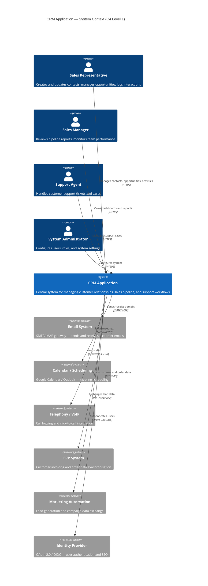

### 3.2 Technical Context

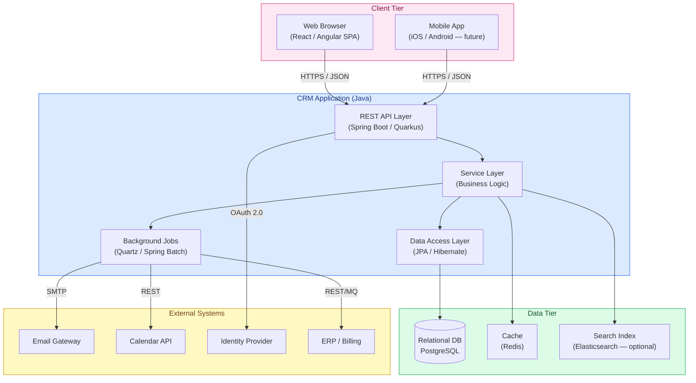

### 3.3 External Interfaces Summary

| Interface | Protocol | Direction | Description |
|-----------|----------|-----------|-------------|
| Web Browser / SPA | HTTPS/REST+JSON | In | Primary user interface |
| Identity Provider | OAuth 2.0 / OIDC | In/Out | User authentication & authorisation |
| Email Gateway | SMTP / IMAP | Out/In | Send transactional emails; ingest replies |
| Calendar System | CalDAV / REST | Out | Meeting and task synchronisation |
| Telephony / VoIP | REST / WebSocket | In/Out | Call logging, click-to-call |
| ERP System | REST / Message Queue | In/Out | Customer and order data sync |
| Marketing Automation | REST / Webhook | In/Out | Lead ingest and campaign status |

> **Gap**: No actual interface implementation exists in the codebase. All interfaces above are design targets inferred from CRM domain requirements.

---

## 4. Solution Strategy

### 4.1 Technology Decisions

| Decision | Choice | Rationale |
|----------|--------|-----------|
| **Language** | Java 17+ LTS | Observed in source; strong ecosystem for enterprise applications; long-term support |
| **Application Framework** | Spring Boot 3.x (recommended) | Industry standard for Java REST services; comprehensive CRM-relevant integrations; convention over configuration |
| **Build Tool** | Gradle (recommended) or Maven | Neither present yet — must be introduced; Gradle offers faster incremental builds |
| **Database** | PostgreSQL | Open-source relational DB; strong JSON support for flexible CRM attributes; ACID compliance |
| **ORM** | Spring Data JPA / Hibernate | Standard Java persistence layer; reduces boilerplate for CRUD-heavy CRM operations |
| **Caching** | Redis | Low-latency read cache for frequently-accessed contact/pipeline data |
| **Authentication** | OAuth 2.0 / Spring Security | Stateless JWT tokens; supports SSO with external Identity Providers |
| **API Style** | REST + JSON | Broad client compatibility; simple integration with SPA frontends |
| **Containerisation** | Docker + Kubernetes | Reproducible environments; horizontal scaling for SaaS workloads |

### 4.2 Top-Level Decomposition Strategy

The system follows a **Layered Architecture** internally (Presentation → Business → Data) while adopting a **modular monolith** deployment strategy initially, with a clear boundary design that allows extraction to microservices as load demands grow.

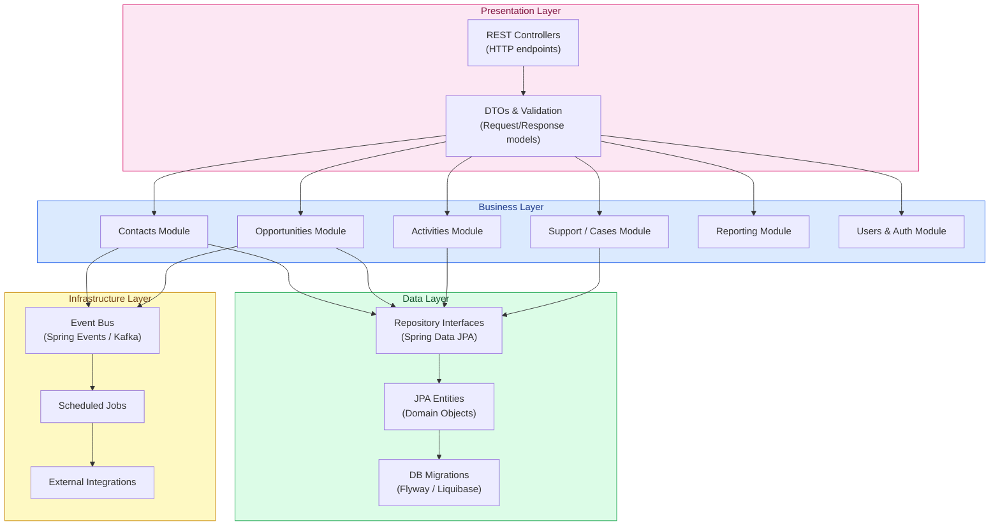

### 4.3 Approaches to Achieve Quality Goals

| Quality Goal | Strategy |
|-------------|---------|
| **Reliability** | Transaction management via Spring `@Transactional`; database constraints for data integrity; circuit breakers for external calls |
| **Security** | Spring Security with JWT; role-based access control (RBAC); field-level encryption for PII; audit log table |
| **Maintainability** | Modular package structure; high test coverage target (≥80%); clean interfaces between layers |
| **Performance** | Redis caching for hot data; database indexing on `contact_id`, `owner_id`, `stage`; pagination on all list endpoints |
| **Portability** | Docker containerisation; environment-specific configuration via Spring profiles / env vars |

---

## 5. Building Block View

### 5.1 Level 1 — System Decomposition

At the highest level, the CRM application decomposes into six primary building blocks:

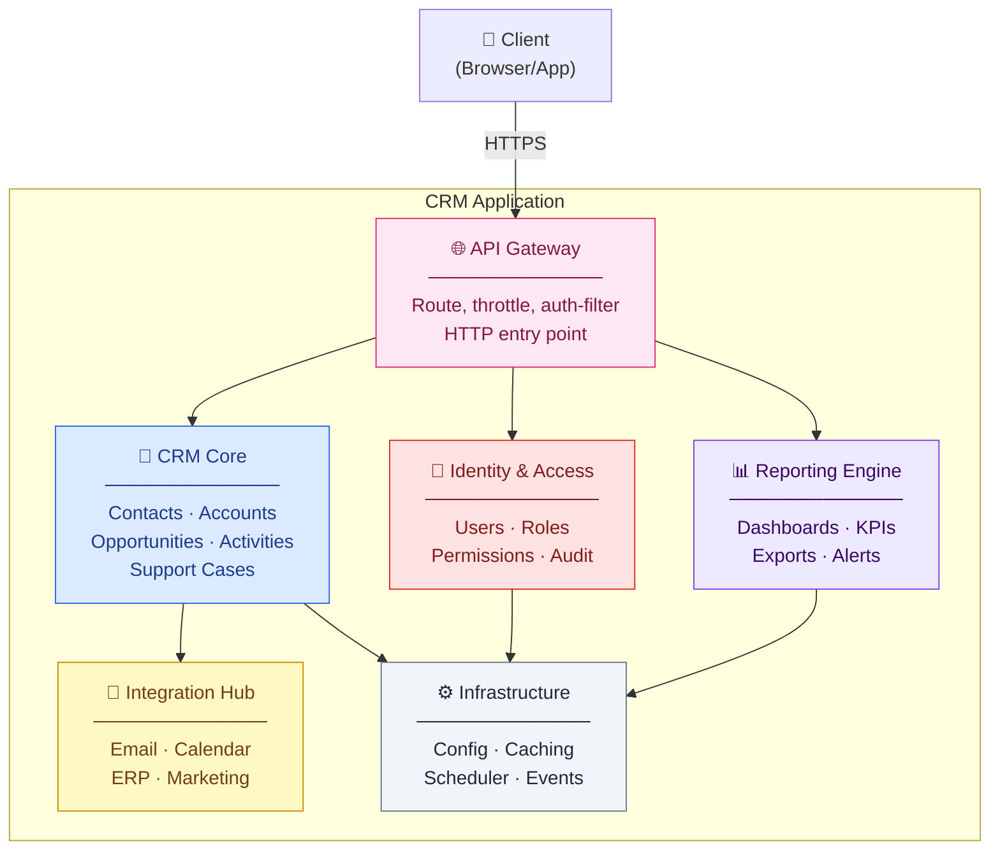

### 5.2 Level 2 — Package / Module Structure

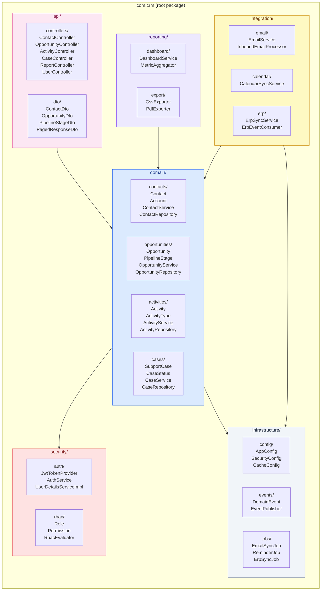

### 5.3 Level 3 — Current Class Structure (Observed)

The *only* class currently present in the repository:

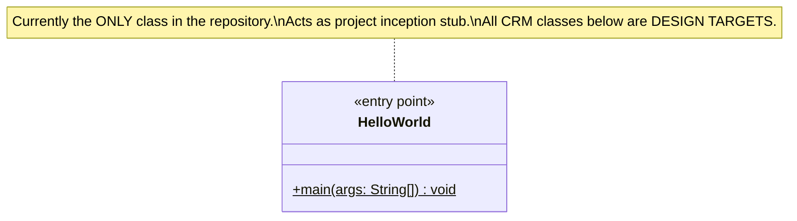

### 5.4 Level 3 — Target CRM Core Class Design

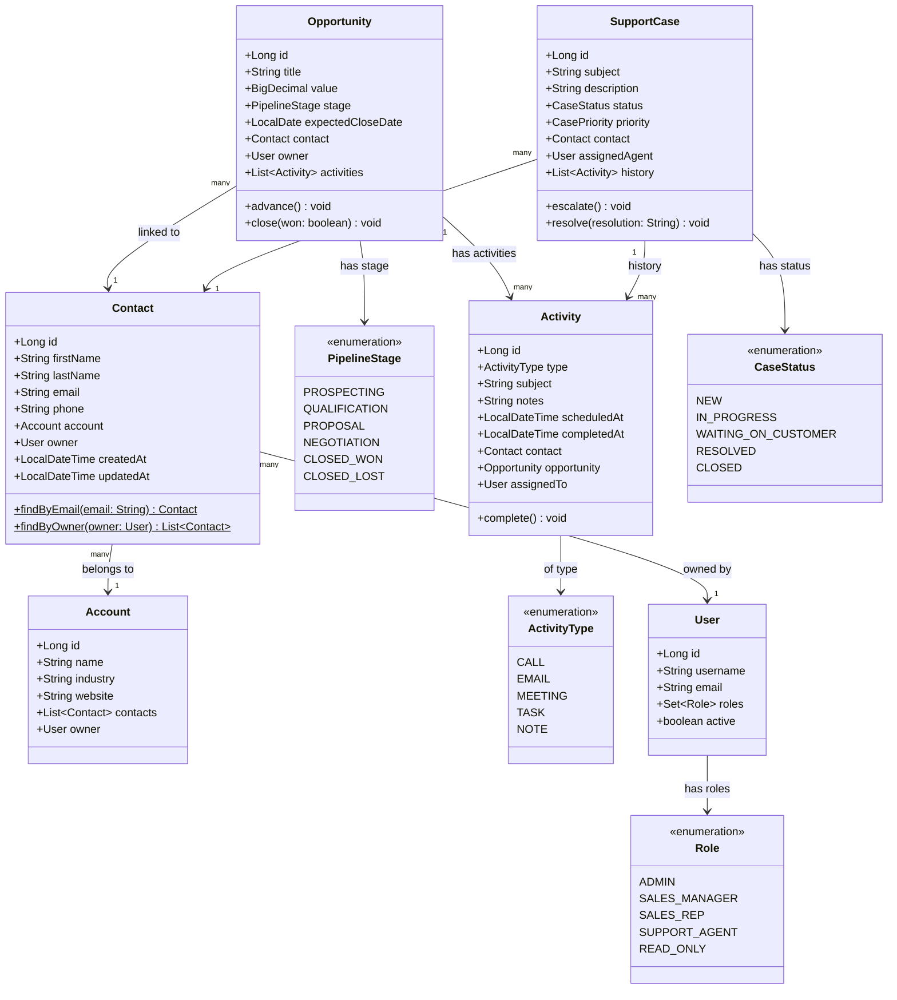

> **Gap**: None of these target classes exist in the repository yet. The class diagram above represents the intended domain model.

---

## 6. Runtime View

### 6.1 Scenario: Application Startup (Current State)

The *only* currently implemented runtime behaviour is a console "Hello World" output:

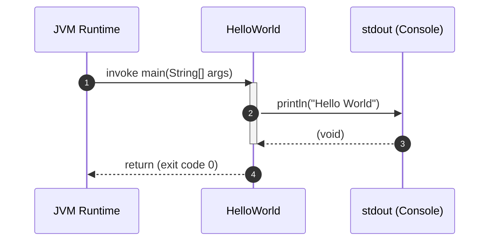

### 6.2 Scenario: User Authentication Flow (Target)

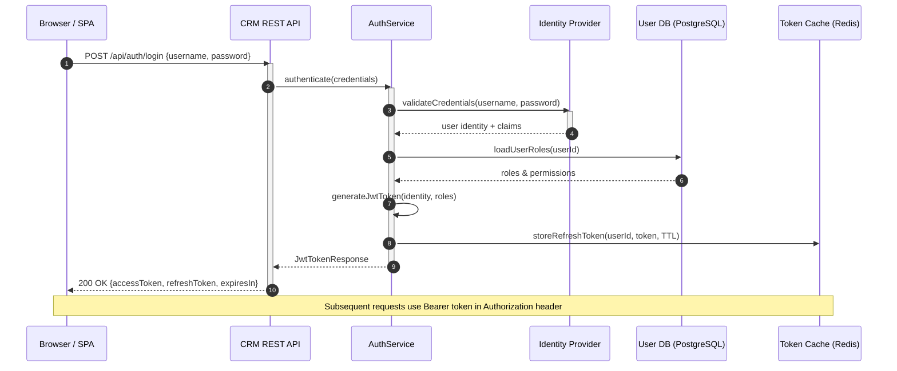

### 6.3 Scenario: Create Contact Flow (Target)

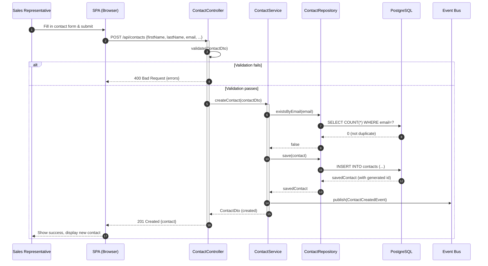

### 6.4 Scenario: Opportunity Pipeline Advancement (Target)

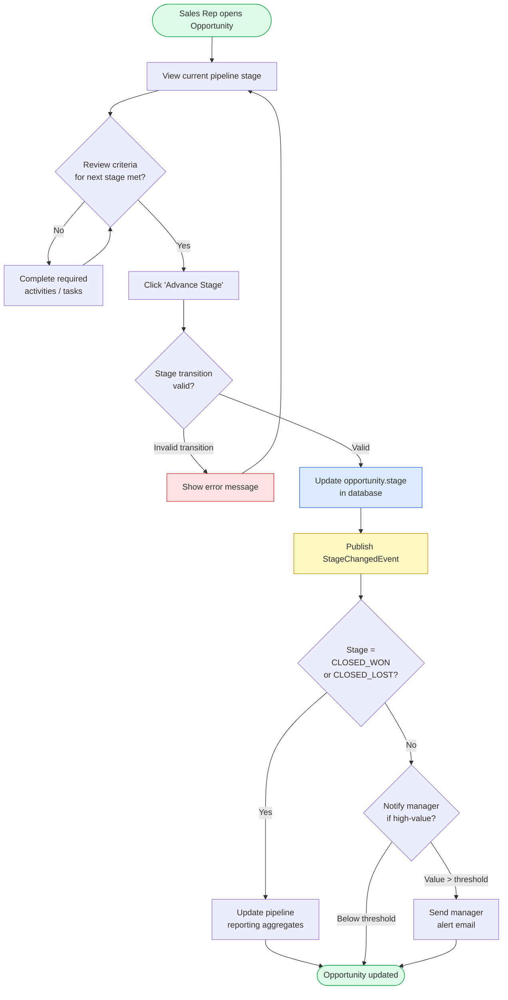

---

## 7. Deployment View

### 7.1 Target Deployment Topology

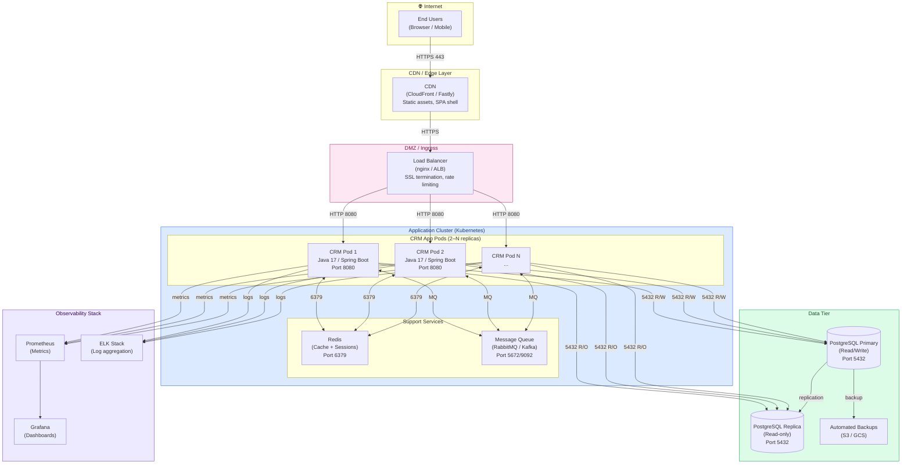

### 7.2 Deployment Environments

| Environment | Purpose | Infrastructure | Notes |
|-------------|---------|---------------|-------|
| **Local Dev** | Development & debugging | `java -jar` or IDE run | Single process, H2 or local PostgreSQL |
| **CI** | Automated build & test | GitHub Actions runner | Ephemeral; PostgreSQL as service container |
| **Staging** | Integration & UAT | Kubernetes (1 replica each) | Production-like config, anonymised data |
| **Production** | Live system | Kubernetes (N replicas, autoscale) | Full HA, backup, monitoring |

### 7.3 Infrastructure Requirements

| Component | Minimum (Dev) | Recommended (Prod) |
|-----------|--------------|-------------------|
| JVM Heap | 256 MB | 1–2 GB per pod |
| CPU | 0.5 vCPU | 1–2 vCPU per pod |
| PostgreSQL | Single instance | Primary + 1 replica, 50 GB SSD |
| Redis | Single instance | Clustered, 2 GB RAM |
| Java Version | 17 LTS | 21 LTS (when stable) |

> **Gap**: No `Dockerfile`, Kubernetes manifests, or CI/CD pipeline configuration exists in the repository. These must be created before any deployment is possible.

---

## 8. Crosscutting Concepts

### 8.1 Domain Model (Entity-Relationship)

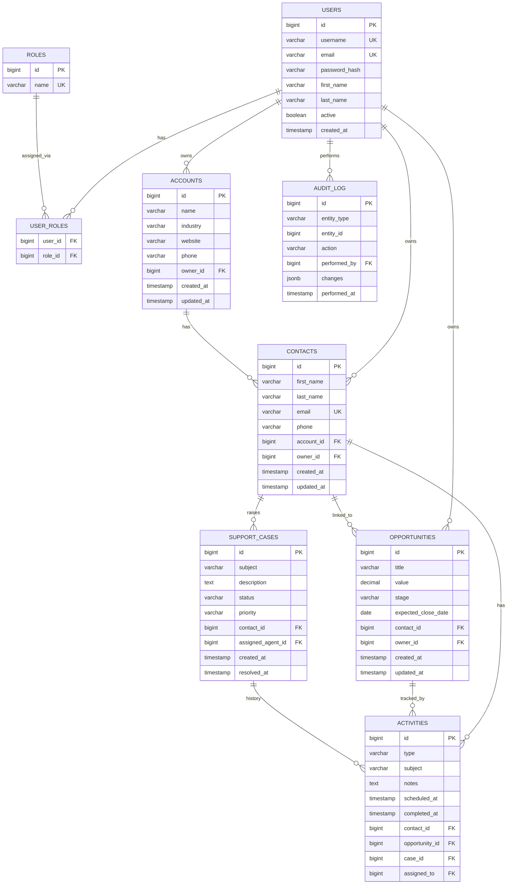

### 8.2 Security Concept

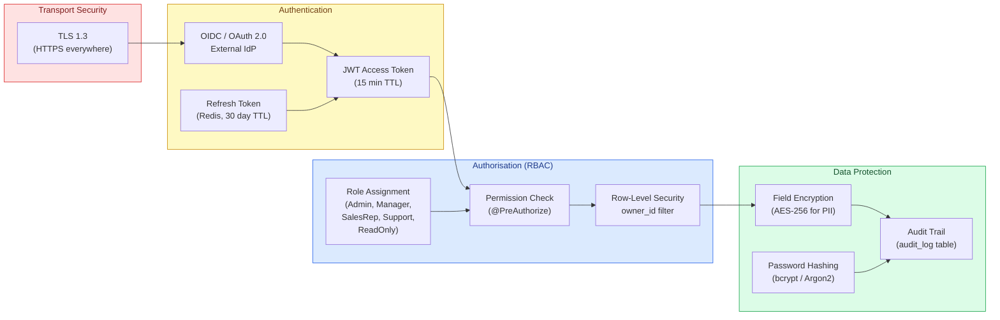

### 8.3 Design Patterns

| Pattern | Application in CRM | Location |
|---------|-------------------|---------|
| **Repository Pattern** | Data access abstraction; each aggregate root has a dedicated `XxxRepository` | `domain/*/` |
| **Service Layer** | Business logic isolation; controllers delegate to services | `domain/*/XxxService` |
| **DTO Pattern** | API contracts decoupled from domain entities; prevents lazy-loading issues | `api/dto/` |
| **Observer / Domain Events** | Loose coupling between modules (e.g., `ContactCreatedEvent` triggers welcome email) | `infrastructure/events/` |
| **Strategy Pattern** | Pluggable notification channels (email, SMS, push) | `integration/` |
| **Factory Method** | `ActivityType`-specific activity builders | `domain/activities/` |
| **Circuit Breaker** | Resilience4j wrapping external integration calls | `integration/*/` |

### 8.4 Error Handling Strategy

- All controllers return standardised `ApiErrorResponse` JSON (`code`, `message`, `timestamp`, `path`)
- Validation errors: `400 Bad Request` with per-field error details
- Authentication errors: `401 Unauthorized`
- Authorisation errors: `403 Forbidden`
- Resource not found: `404 Not Found`
- Business rule violations: `422 Unprocessable Entity`
- Server errors: `500 Internal Server Error` (sanitised — no stack traces in production)
- External integration failures: handled via Circuit Breaker; fallback responses provided

### 8.5 Logging and Observability

| Concern | Solution |
|---------|---------|
| Structured logging | JSON format via Logback/SLF4J; includes `requestId`, `userId`, `operation` |
| Distributed tracing | Spring Sleuth / Micrometer Tracing with Zipkin or OTLP |
| Metrics | Micrometer + Prometheus; custom business metrics (contacts created/day, pipeline value) |
| Health checks | Spring Actuator `/actuator/health`; liveness + readiness probes for Kubernetes |
| Audit trail | `audit_log` database table — every create/update/delete on CRM entities |

---

## 9. Architecture Decisions

### ADR-001 — Java as Implementation Language

| Attribute | Value |
|-----------|-------|
| **Status** | Accepted |
| **Date** | Observed from `HelloWorld.java` |
| **Context** | A programming language must be chosen for the CRM backend. |
| **Decision** | Java 17+ LTS is used as the primary implementation language. |
| **Rationale** | Evidenced by `HelloWorld.java` in the repository. Java offers a mature ecosystem, strong typing, excellent tooling, and broad enterprise library support. Java 17 LTS provides modern language features (records, sealed classes, text blocks) with long-term vendor support. |
| **Consequences** | (+) Rich library ecosystem; (-) More verbose than Kotlin/Python; JVM startup time (mitigated by GraalVM native if needed) |
| **Alternatives considered** | Kotlin (idiomatic, but team unfamiliarity risk), Python (weaker typing for large codebases), Node.js (good for I/O-bound but weaker for complex business logic) |

---

### ADR-002 — Layered Architecture with Modular Monolith

| Attribute | Value |
|-----------|-------|
| **Status** | Proposed |
| **Date** | 2025-01-30 |
| **Context** | The team is small; the CRM domain is well-understood. Premature microservices decomposition adds operational overhead without benefit at this scale. |
| **Decision** | Adopt a **modular monolith** with clear internal package boundaries (Contacts, Opportunities, Activities, Cases, Reporting, Integration). Internal boundaries will be enforced via package-private access and ArchUnit tests. |
| **Rationale** | Single deployable unit reduces operational complexity. Clean internal boundaries allow future extraction to microservices without big-bang rewrites. |
| **Consequences** | (+) Simple deployment; (+) Low latency internal calls; (-) Risk of boundary erosion over time (mitigated by ArchUnit) |
| **Alternatives considered** | Full microservices (too complex for team size), classical layered monolith without module boundaries (high coupling risk) |

---

### ADR-003 — Spring Boot 3.x as Application Framework

| Attribute | Value |
|-----------|-------|
| **Status** | Proposed |
| **Date** | 2025-01-30 |
| **Context** | A Java web framework must be chosen to build REST APIs, handle security, and manage data access. |
| **Decision** | **Spring Boot 3.x** with Spring Web MVC, Spring Security, and Spring Data JPA |
| **Rationale** | Industry-standard; excellent Spring Data JPA reduces boilerplate for CRUD-heavy CRM operations; Spring Security provides robust JWT + OAuth2 support; extensive community and documentation. |
| **Consequences** | (+) Rapid development; (+) Comprehensive integrations; (-) Framework magic can obscure behaviour; startup time (mitigated by lazy initialisation) |
| **Alternatives considered** | Quarkus (faster startup, smaller image, but smaller community), Micronaut, Jakarta EE (more configuration) |

---

### ADR-004 — PostgreSQL as Primary Database

| Attribute | Value |
|-----------|-------|
| **Status** | Proposed |
| **Date** | 2025-01-30 |
| **Context** | The CRM requires a relational database to ensure data integrity for customer, opportunity, and case records. |
| **Decision** | **PostgreSQL 15+** as the primary relational database, with Flyway for schema migrations |
| **Rationale** | ACID compliance is mandatory for financial data (opportunity values). PostgreSQL's JSONB support allows flexible custom fields per contact/account without schema explosion. Strong indexing, full-text search, and open-source licensing. |
| **Consequences** | (+) Data integrity; (+) Flexible JSONB; (-) Requires DBA knowledge for performance tuning |
| **Alternatives considered** | MySQL (weaker JSONB, row-level locking), MongoDB (no joins, consistency tradeoffs), H2 (development only) |

---

### ADR-005 — JWT-Based Stateless Authentication

| Attribute | Value |
|-----------|-------|
| **Status** | Proposed |
| **Date** | 2025-01-30 |
| **Context** | The CRM will support horizontal scaling; session stickiness must be avoided. |
| **Decision** | **JWT access tokens** (15-min TTL) with **refresh tokens** stored in Redis (30-day TTL). Tokens signed with RS256 (asymmetric). |
| **Rationale** | Stateless API servers can scale horizontally without shared session state. Asymmetric signing allows token validation without secret sharing. Short TTL limits blast radius of token compromise. |
| **Consequences** | (+) Stateless, scalable; (-) Token revocation requires Redis refresh token blacklist |
| **Alternatives considered** | Session cookies + server-side sessions (stateful, scaling issues), opaque tokens (requires introspection endpoint on each request) |

---

## 10. Quality Requirements

### 10.1 Quality Tree

```mermaid
flowchart TD
    ROOT["🏆 CRM Application\nQuality"]

    ROOT --> RELIABILITY["🔵 Reliability"]
    ROOT --> SECURITY["🔴 Security"]
    ROOT --> MAINTAINABILITY["🟢 Maintainability"]
    ROOT --> PERFORMANCE["🟠 Performance"]
    ROOT --> PORTABILITY["🟣 Portability"]

    RELIABILITY --> R1["Availability ≥ 99.9%\nduring business hours"]
    RELIABILITY --> R2["Zero data loss\n(ACID transactions)"]
    RELIABILITY --> R3["Graceful degradation\nwhen external systems fail"]

    SECURITY --> S1["PII encrypted\nat rest & in transit"]
    SECURITY --> S2["RBAC — least-privilege\naccess to all endpoints"]
    SECURITY --> S3["Complete audit trail\nfor all data changes"]
    SECURITY --> S4["OWASP Top 10\nmitigations in place"]

    MAINTAINABILITY --> M1["Test coverage ≥ 80%\n(unit + integration)"]
    MAINTAINABILITY --> M2["All public APIs\ndocumented (OpenAPI 3)"]
    MAINTAINABILITY --> M3["Architecture tests\nvia ArchUnit"]
    MAINTAINABILITY --> M4["No critical SonarQube\nissues in CI gate"]

    PERFORMANCE --> P1["Contact list API\n< 500 ms P95"]
    PERFORMANCE --> P2["Dashboard load\n< 2 s P95"]
    PERFORMANCE --> P3["Support 1,000\nconcurrent users"]

    PORTABILITY --> Po1["Docker-first\ndeployment"]
    PORTABILITY --> Po2["No vendor lock-in\n(cloud-agnostic)"]
    PORTABILITY --> Po3["12-Factor App\ncompliance"]

    style ROOT fill:#1e3a8a,color:#ffffff,stroke:#1e3a8a
    style RELIABILITY fill:#dbeafe,stroke:#2563eb,color:#1e3a8a
    style SECURITY fill:#fee2e2,stroke:#dc2626,color:#7f1d1d
    style MAINTAINABILITY fill:#dcfce7,stroke:#16a34a,color:#14532d
    style PERFORMANCE fill:#fef9c3,stroke:#ca8a04,color:#713f12
    style PORTABILITY fill:#ede9fe,stroke:#7c3aed,color:#3b0764
```

### 10.2 Quality Scenarios

| ID | Quality Attribute | Stimulus | Response | Measure |
|----|-----------------|---------|---------|---------|
| QS-01 | Performance | Sales rep opens contact list (10,000 records) | Paginated JSON returned | P95 < 500 ms |
| QS-02 | Reliability | Database failover during business hours | Failover to replica; < 30 s downtime | RTO < 30 s |
| QS-03 | Security | Attacker attempts SQL injection via search endpoint | Parameterised queries prevent injection | 0 successful injections |
| QS-04 | Maintainability | Developer adds new custom field to Contact | Feature delivered without touching unrelated modules | < 1 day effort |
| QS-05 | Portability | Team migrates from AWS to GCP | No code changes required; config change only | 0 code changes |
| QS-06 | Reliability | Email gateway is unavailable | CRM functions normally; email queued for retry | 0 lost emails, 0 user-visible errors |

### 10.3 Current Code Metrics (Observed)

| Metric | Current Value | Target |
|--------|-------------|--------|
| Total Java files | 1 (`HelloWorld.java`) | > 50 |
| Total lines of code | 5 | > 5,000 |
| Public classes | 1 | > 50 |
| Methods | 1 (`main`) | > 200 |
| Test files | 0 | ≥ 50 |
| Test coverage | 0% | ≥ 80% |
| Cyclomatic complexity (avg) | 1 (trivial) | ≤ 5 per method |
| Build tool present | ❌ | ✅ (Gradle/Maven) |
| Framework present | ❌ | ✅ (Spring Boot) |
| CI/CD pipeline | ❌ | ✅ (GitHub Actions) |

---

## 11. Risks and Technical Debt

### 11.1 Risk Register

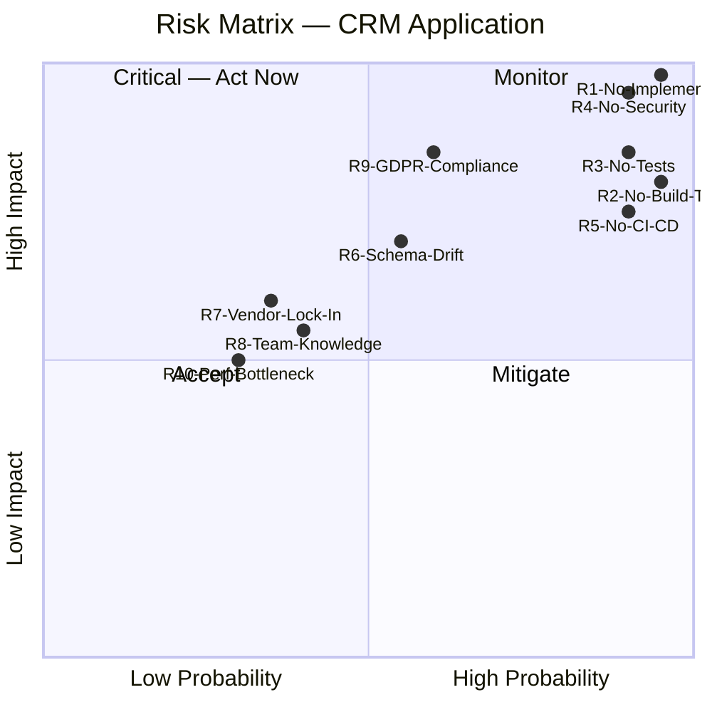

### 11.2 Detailed Risk Items

| ID | Risk | Probability | Impact | Current State | Mitigation |
|----|------|------------|--------|--------------|-----------|
| **R1** | **No application implementation** — repository contains only a "Hello World" stub; no CRM functionality exists | Very High | Critical | `HelloWorld.java` is the only source file | Prioritise domain model and API scaffold immediately |
| **R2** | **No build tool** — `pom.xml` / `build.gradle` absent; project cannot be built reproducibly | Very High | High | Only `.gitignore` exists | Add Gradle wrapper or Maven POM as first commit |
| **R3** | **Zero test coverage** — no test directory or test files detected | Very High | High | 0 tests | Introduce JUnit 5 + Mockito; set 80% coverage gate in CI |
| **R4** | **No security implementation** — no authentication, authorisation, or encryption | Very High | Critical | No security code present | Spring Security + JWT implementation required before any data is stored |
| **R5** | **No CI/CD pipeline** — no GitHub Actions workflows for build, test, or deploy | Very High | High | `.github/agents/` only has AI agent configs | Create `.github/workflows/ci.yml` with build, test, security scan |
| **R6** | **Database schema drift** — without Flyway/Liquibase, schema changes will be unmanaged | Medium | High | No schema management tool | Introduce Flyway from day 1; never allow manual schema changes |
| **R7** | **Framework lock-in** — deep coupling to Spring Boot could complicate future framework migration | Low | Medium | No framework yet — ideal time to design interfaces | Define framework-agnostic service interfaces; keep framework in outer layers |
| **R8** | **Knowledge concentration** — small team on a complex domain | Medium | Medium | Early stage — risk is latent | Document architectural decisions; pair programming; bus-factor > 1 |
| **R9** | **GDPR / data privacy compliance** — CRM stores customer PII without defined data handling policies | Medium | High | No data handling code | Define data retention policies; implement right-to-erasure; encrypt PII fields |
| **R10** | **Performance bottlenecks at scale** — unindexed queries, N+1 fetch patterns | Low | Medium | No persistence code yet | Define indexing strategy during schema design; use Spring Data projections |

### 11.3 Technical Debt Items

| ID | Debt Item | Category | Effort | Priority |
|----|-----------|---------|--------|---------|
| **TD-01** | Introduce Gradle or Maven build file | Infrastructure | XS (1h) | Critical |
| **TD-02** | Create Spring Boot project structure and base classes | Architecture | S (1 day) | Critical |
| **TD-03** | Implement domain entity classes (Contact, Account, Opportunity, etc.) | Design | M (3 days) | Critical |
| **TD-04** | Set up Flyway schema migrations for initial tables | Infrastructure | S (0.5 day) | Critical |
| **TD-05** | Implement Spring Security with JWT authentication | Security | M (3 days) | Critical |
| **TD-06** | Create REST API controllers with OpenAPI documentation | API | M (3 days) | High |
| **TD-07** | Write unit and integration tests (target 80% coverage) | Quality | L (1 week) | High |
| **TD-08** | Create Dockerfile and docker-compose for local dev | DevOps | S (0.5 day) | High |
| **TD-09** | Set up GitHub Actions CI/CD pipeline | DevOps | S (1 day) | High |
| **TD-10** | Add GDPR compliance: data retention, erasure, PII encryption | Compliance | L (1 week) | High |
| **TD-11** | Integrate SonarQube or similar SAST tool into CI | Quality | S (0.5 day) | Medium |
| **TD-12** | Implement audit logging for all entity mutations | Compliance | M (2 days) | Medium |

### 11.4 Recommended Implementation Roadmap

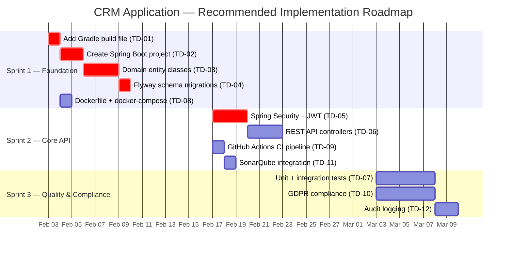

---

## 12. Glossary

| Term | Definition |
|------|-----------|
| **Account** | A company or organisation that is a customer or prospect. One account can have multiple contacts. |
| **Activity** | A logged interaction or task associated with a contact or opportunity — can be a call, email, meeting, task, or note. |
| **ADR** | Architecture Decision Record — a document capturing a key architectural choice, its context, rationale, and consequences. |
| **Arc42** | A template for software architecture documentation with 12 standardised sections. |
| **BPMN** | Business Process Model and Notation — a graphical standard for modelling business workflows. |
| **CRM** | Customer Relationship Management — a system for managing a company's interactions with current and potential customers. |
| **Contact** | An individual person (customer, prospect, partner) tracked in the CRM, usually associated with an Account. |
| **Circuit Breaker** | A resilience pattern that stops calls to a failing external service to prevent cascading failures. |
| **DTO** | Data Transfer Object — a simple object used to transport data between the API layer and the service layer, decoupled from JPA entities. |
| **Flyway** | A Java library for managing database schema version migrations using SQL scripts. |
| **GDPR** | General Data Protection Regulation — EU regulation governing the processing of personal data. |
| **JPA** | Java Persistence API — a specification for ORM (Object-Relational Mapping) in Java. |
| **JWT** | JSON Web Token — a compact, URL-safe token format used for stateless authentication. |
| **KPI** | Key Performance Indicator — a measurable value demonstrating how effectively objectives are achieved. |
| **Modular Monolith** | A single deployable application divided into clearly bounded modules with explicit interfaces, providing monolith simplicity with microservices-style isolation. |
| **OIDC** | OpenID Connect — an identity layer on top of OAuth 2.0 for authentication. |
| **Opportunity** | A potential sale being tracked through the sales pipeline from initial contact to close. |
| **ORM** | Object-Relational Mapping — a technique for converting data between incompatible type systems (objects and relational tables). |
| **PII** | Personally Identifiable Information — any data that can be used to identify an individual (name, email, phone). |
| **Pipeline Stage** | A defined phase in the sales process (e.g., Prospecting → Qualification → Proposal → Negotiation → Closed). |
| **RBAC** | Role-Based Access Control — a method of restricting system access based on the roles assigned to users. |
| **Repository Pattern** | A design pattern that abstracts the data layer, providing a collection-like interface for accessing domain objects. |
| **Service Layer** | An application layer that encapsulates business logic, coordinating between the API layer and the data layer. |
| **SLA** | Service Level Agreement — a commitment between a service provider and a client defining expected service levels. |
| **SSO** | Single Sign-On — allows users to authenticate once and gain access to multiple systems. |
| **Support Case** | A customer support request or issue tracked from creation through resolution. |
| **TLS** | Transport Layer Security — cryptographic protocol providing secure communication over a network. |

---

*Documentation generated by the **arc42-documentor** agent on 2025-01-30.*  
*Source repository: `copilot-test-ktruchcz` — analysed files: `HelloWorld.java`, `README.md`, `.gitignore`*  
*All target architecture sections are clearly marked where they represent design intent vs. observed implementation.*
