# Architecture Documentation (Arc42)

**Project**: copilot-test-ktruchcz — HelloWorld  
**Version**: 1.0.0  
**Date**: 2025-01-01  
**Generated by**: Arc42 Documentation Generator

---

## Table of Contents

1. [Introduction and Goals](#1-introduction-and-goals)
2. [Architecture Constraints](#2-architecture-constraints)
3. [System Scope and Context](#3-system-scope-and-context)
4. [Solution Strategy](#4-solution-strategy)
5. [Building Block View](#5-building-block-view)
6. [Runtime View](#6-runtime-view)
7. [Deployment View](#7-deployment-view)
8. [Cross-cutting Concepts](#8-cross-cutting-concepts)
9. [Architecture Decisions](#9-architecture-decisions)
10. [Quality Requirements](#10-quality-requirements)
11. [Risks and Technical Debt](#11-risks-and-technical-debt)
12. [Glossary](#12-glossary)

---

## 1. Introduction and Goals

### 1.1 Requirements Overview

**copilot-test-ktruchcz** is a minimal Java console application whose sole purpose is to emit the text `Hello World` to the standard output stream. Despite its simplicity, this application serves as a canonical starting point for validating toolchains, CI/CD pipelines, language runtimes, and developer environments.

| Goal ID | Goal Description |
|---------|-----------------|
| G-01 | Print the string `"Hello World"` to `stdout` when the program is executed |
| G-02 | Terminate with exit code `0` (success) under normal conditions |
| G-03 | Demonstrate a compilable, runnable Java class with no external dependencies |
| G-04 | Provide a baseline repository structure suitable for CI/CD onboarding |

### 1.2 Quality Goals

The following top-level quality goals drive the architecture of this system, ordered by priority:

| Priority | Quality Goal | Motivation |
|----------|-------------|------------|
| 1 | **Simplicity** | The system must be understandable by anyone with basic Java knowledge in under 60 seconds |
| 2 | **Portability** | The application must run on any platform with a compatible Java Runtime Environment (JRE) |
| 3 | **Reproducibility** | Every execution must produce the identical output `Hello World\n` |
| 4 | **Build Reliability** | The project must compile and execute successfully in a fresh CI environment |

### 1.3 Stakeholders

| Role | Name / Group | Expectations |
|------|-------------|--------------|
| Developer | Repository owner (`ktruchcz`) | Functional baseline Java project; CI/CD scaffold |
| CI/CD System | GitHub Actions | Successfully compiles and runs the Java class |
| Reviewer / Evaluator | GitHub Copilot tooling | Parseable source code for static analysis |
| New Team Member | Any onboarding developer | Clear, runnable example requiring zero configuration |

---

## 2. Architecture Constraints

### 2.1 Technical Constraints

| ID | Constraint | Background |
|----|-----------|------------|
| TC-01 | **Java Language** | The application is written in Java; the JDK/JRE must be installed on the host |
| TC-02 | **No Build Tool** | No Maven, Gradle, or Ant configuration is present; compilation uses `javac` directly |
| TC-03 | **No External Dependencies** | The application relies solely on `java.lang.System`, a JDK built-in; no third-party libraries |
| TC-04 | **Single Source File** | All logic resides in `HelloWorld.java`; no multi-file or multi-module structure |
| TC-05 | **Default Package** | The class belongs to the unnamed (default) Java package |
| TC-06 | **Standard Output Only** | No file I/O, network, database, or GUI components are used |

### 2.2 Organizational Constraints

| ID | Constraint | Background |
|----|-----------|------------|
| OC-01 | **Git Version Control** | Source code is managed with Git hosted on GitHub |
| OC-02 | **GitHub Actions CI** | The `.github/` directory indicates GitHub Actions workflows govern CI |
| OC-03 | **Single Developer Scope** | The repository suggests individual ownership with no multi-team branching strategy required |

### 2.3 Conventions

| ID | Convention | Details |
|----|-----------|---------|
| CV-01 | **Java Naming Convention** | Class name `HelloWorld` matches the filename `HelloWorld.java` (Java standard) |
| CV-02 | **Entry Point Signature** | Uses standard `public static void main(String[] args)` entry point |
| CV-03 | **No Packaging** | No `package` declaration; class resides in the default package (acceptable for trivial programs) |

---

## 3. System Scope and Context

### 3.1 Business Context

The HelloWorld application is a self-contained executable with a single, clearly defined interaction: a **user or automated process invokes it**, and the system **responds with printed output**. There are no inbound data flows beyond the command invocation itself.

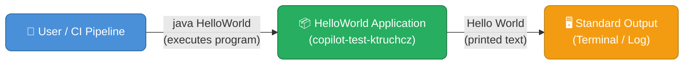

| Neighbour System | Type | Interaction |
|-----------------|------|------------|
| JVM (Java Virtual Machine) | Runtime Platform | Hosts and executes the bytecode |
| Operating System Shell | Invoker | Provides `stdin`, `stdout`, `stderr` streams and exit code handling |
| CI/CD Pipeline (GitHub Actions) | Automated Invoker | Compiles and runs the class to verify build health |
| Terminal / Console | Output Consumer | Renders the printed string to the user |

### 3.2 Technical Context

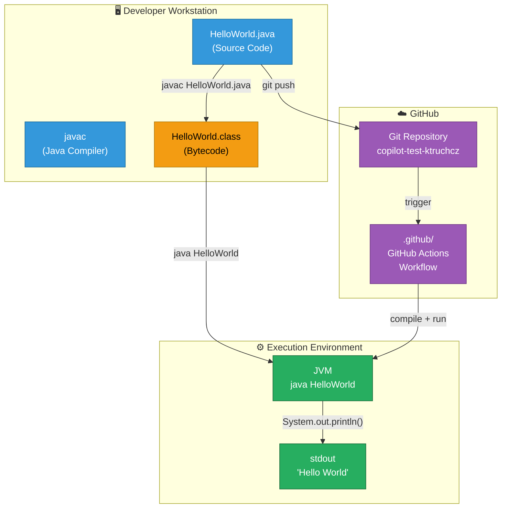

| Channel | Protocol / Technology | Description |
|---------|----------------------|-------------|
| Source → Compiler | `javac` CLI | Translates `.java` source to `.class` bytecode |
| Bytecode → JVM | `java` CLI | Loads and interprets compiled bytecode |
| JVM → stdout | `System.out.println()` | Writes `Hello World\n` to the standard output stream |
| Workstation → GitHub | HTTPS / SSH (Git) | Pushes source changes to remote repository |
| GitHub → CI | GitHub Actions webhook | Triggers compilation and execution workflow on push/PR events |

---

## 4. Solution Strategy

### 4.1 Technology Decisions

| Decision | Choice | Rationale |
|---------|--------|-----------|
| **Programming Language** | Java | Ubiquitous, platform-independent via JVM; aligns with project naming and file structure |
| **Build Approach** | Raw `javac` / no build tool | Maximum simplicity; zero configuration overhead for a single-class project |
| **Dependency Strategy** | Zero external dependencies | Only `java.lang` standard library needed; eliminates version conflicts and security vectors |
| **Version Control** | Git + GitHub | Industry-standard; enables CI/CD integration via GitHub Actions |
| **CI/CD Platform** | GitHub Actions | Native GitHub integration; no extra tooling required |

### 4.2 Top-Level Decomposition Strategy

The system follows a **monolithic single-class** decomposition — the simplest possible Java architecture:

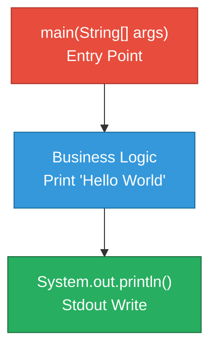

### 4.3 Approaches to Quality Goals

| Quality Goal | Approach |
|-------------|---------|
| **Simplicity** | Single class, single method, single statement — no abstractions, no layers |
| **Portability** | Pure Java; compiled to JVM bytecode — runs on any OS with a JRE |
| **Reproducibility** | Hard-coded literal string `"Hello World"` — deterministic, no external input affects output |
| **Build Reliability** | No dependency resolution; `javac HelloWorld.java` always succeeds from a clean checkout |

---

## 5. Building Block View

### 5.1 Level 1 — System White Box

At the highest level the entire system is a single deployable unit containing one Java class.

```mermaid
graph TB
    classDef system fill:#2C3E50,stroke:#1A252F,color:#fff
    classDef class fill:#3498DB,stroke:#1A6B9A,color:#fff
    classDef jdk fill:#95A5A6,stroke:#717D7E,color:#fff

    subgraph SYSTEM["copilot-test-ktruchcz System"]
        HW["HelloWorld\n(public class)"]:::class
    end

    JDK["Java Standard Library\njava.lang.System\njava.io.PrintStream"]:::jdk

    HW -->|"uses"| JDK
```

**Contained Building Blocks:**

| Block | Responsibility |
|-------|---------------|
| `HelloWorld` | Top-level public class; owns the `main` entry point; coordinates output |

### 5.2 Level 2 — HelloWorld Class White Box

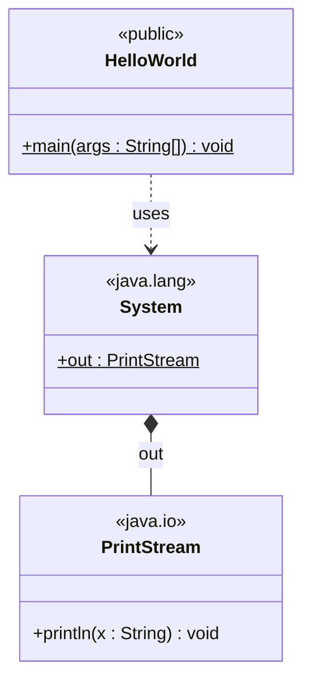

**Method Breakdown:**

| Method | Visibility | Static | Parameters | Return | Responsibility |
|--------|-----------|--------|-----------|--------|---------------|
| `main` | `public` | ✅ | `String[] args` | `void` | JVM entry point; delegates print to `System.out` |

### 5.3 Level 3 — Statement-Level Detail

```mermaid
flowchart TD
    classDef start fill:#27AE60,stroke:#1A6B3A,color:#fff
    classDef action fill:#3498DB,stroke:#1A6B9A,color:#fff
    classDef end_ fill:#E74C3C,stroke:#A93226,color:#fff

    A([▶ JVM calls main]):::start
    B["Resolve System.out\n(java.io.PrintStream)"]:::action
    C["Invoke println(\"Hello World\")"]:::action
    D["Write 'Hello World\\n'\nto stdout buffer"]:::action
    E["Flush / return from println"]:::action
    F([■ main returns — JVM exits 0]):::end_

    A --> B --> C --> D --> E --> F
```

---

## 6. Runtime View

### 6.1 Scenario 1 — Successful Execution (Happy Path)

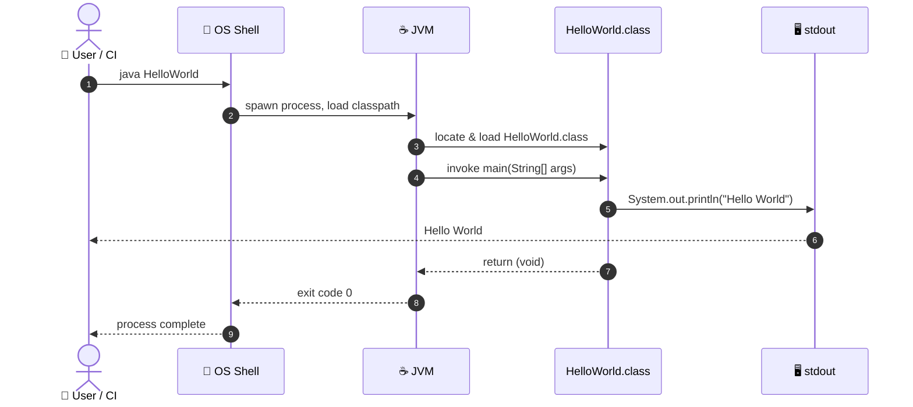

### 6.2 Scenario 2 — Compilation Then Execution

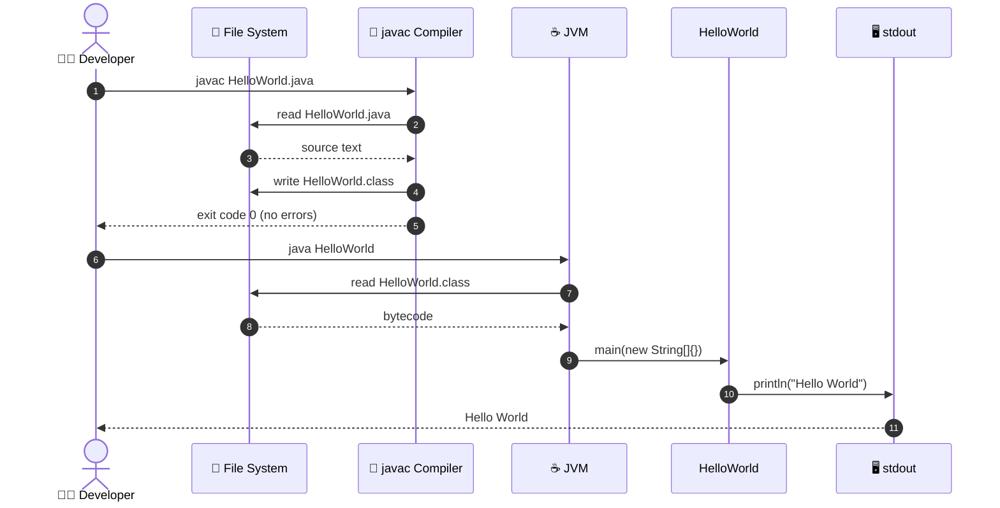

### 6.3 Scenario 3 — GitHub Actions CI Pipeline

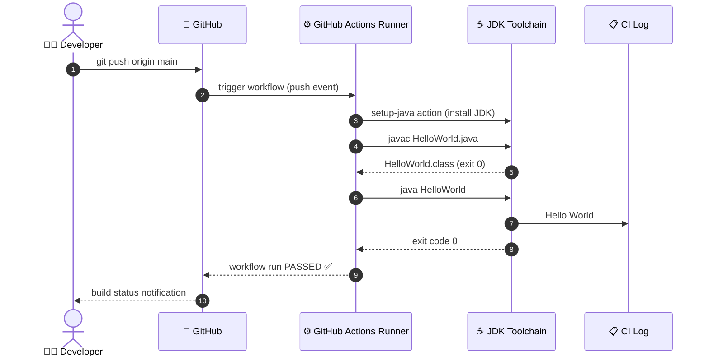

---

## 7. Deployment View

### 7.1 Infrastructure Overview

The application has no server, no container, and no persistent service — it is a **run-to-completion process** executed on-demand.

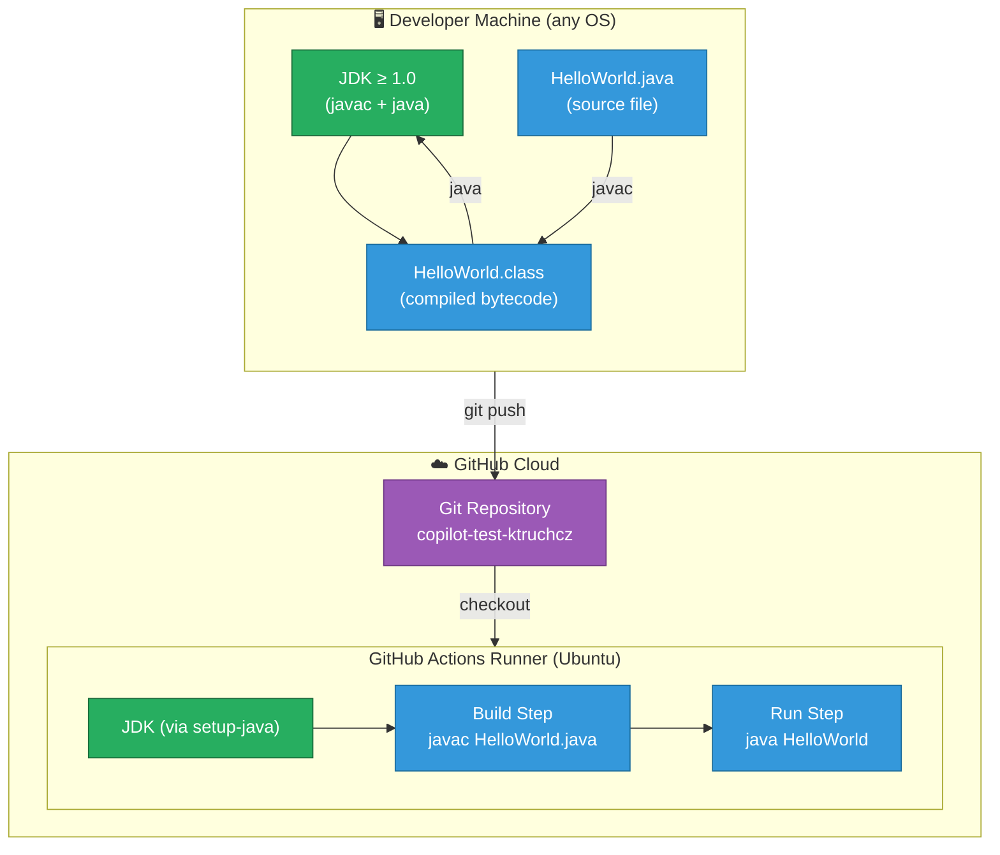

### 7.2 Deployment Scenarios

| Scenario | Host | JDK Version | Invocation | Output Destination |
|---------|------|------------|-----------|-------------------|
| Local developer run | Any OS (Win/macOS/Linux) | Any JDK ≥ 1.0 | `java HelloWorld` | Terminal stdout |
| CI pipeline execution | GitHub Actions Ubuntu runner | JDK (version per workflow) | `java HelloWorld` | CI log |
| Educational / demo | Any JVM-capable environment | JDK ≥ 1.0 | `java HelloWorld` | Terminal stdout |

### 7.3 System Requirements

| Requirement | Minimum | Notes |
|------------|---------|-------|
| Java Runtime | JDK / JRE ≥ 1.0 | Any modern JDK (8, 11, 17, 21 LTS) is suitable |
| Memory | ~32 MB heap | JVM default startup memory; no heap pressure at runtime |
| Disk | < 1 KB | `HelloWorld.class` bytecode is trivially small |
| Network | None | No network access required or used |
| OS | Any JVM-supported OS | Windows, macOS, Linux, etc. |

---

## 8. Cross-cutting Concepts

### 8.1 Domain Model

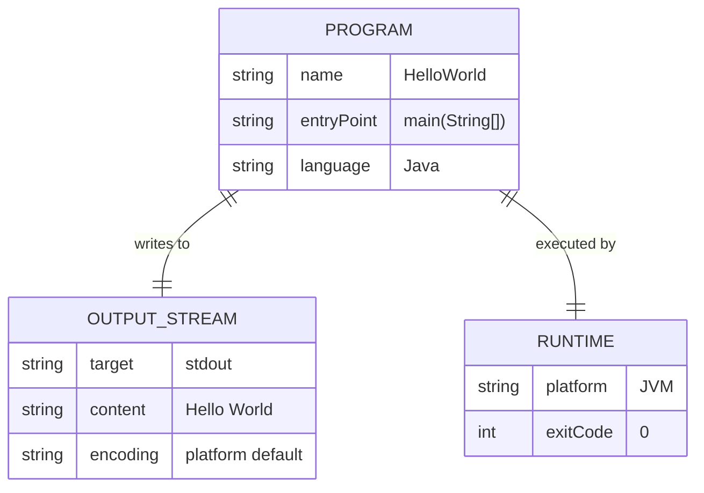

### 8.2 Design Patterns Applied

| Pattern | Application | Location |
|---------|------------|---------|
| **Static Entry Point** | `main(String[] args)` as the single JVM entry point | `HelloWorld.java:2` |
| **Facade (minimal)** | `System.out` acts as a facade over the underlying `OutputStream` | Implicit via `java.lang` |
| **Immutable Message** | The output string `"Hello World"` is a compile-time constant (string literal) | `HelloWorld.java:3` |

### 8.3 Error Handling Strategy

The application performs no explicit error handling. Given the nature of the single operation (`System.out.println`), the only conceivable failure mode is a closed or broken `stdout` stream, which would surface as an uncaught `PrintStream` error — acceptable for this scope.

| Concern | Strategy | Justification |
|---------|---------|--------------|
| `stdout` unavailable | None — uncaught exception | Acceptable; program terminates with non-zero exit code |
| Invalid arguments | Ignored — `args` parameter unused | No input parsing required |
| Interrupted execution | JVM default signal handling | OS-level SIGTERM/SIGINT triggers JVM shutdown |

### 8.4 Logging and Observability

| Aspect | Detail |
|--------|--------|
| Application Logging | None (no logging framework used) |
| Tracing | None |
| Metrics | None |
| Observability | Output itself (`Hello World`) serves as both functional output and implicit health signal |

### 8.5 Security Concepts

| Aspect | Detail |
|--------|--------|
| Authentication | None required |
| Authorization | None required |
| Input Validation | None required (`args` is unused) |
| Secrets / Credentials | None present |
| Attack Surface | Zero network exposure; no file writes; no user-controlled input paths |

---

## 9. Architecture Decisions

### ADR-001: Use Java as the Implementation Language

| Field | Detail |
|-------|--------|
| **Status** | Accepted |
| **Date** | Project inception |
| **Context** | A simple demonstration program is needed to validate a Java-based CI/CD pipeline |
| **Decision** | Implement the application in Java |
| **Consequences** | Requires JDK on all build and execution hosts; ensures platform portability via JVM |
| **Alternatives Considered** | Python, Shell script, Go — all rejected in favour of Java to test the Java toolchain |

---

### ADR-002: No Build Tool (Direct `javac` Invocation)

| Field | Detail |
|-------|--------|
| **Status** | Accepted |
| **Date** | Project inception |
| **Context** | The project contains a single `.java` file with no dependencies |
| **Decision** | Compile with raw `javac`; no Maven, Gradle, or Ant |
| **Consequences** | Zero build configuration overhead; not scalable for multi-module projects |
| **Alternatives Considered** | Maven (rejected — excessive for one class), Gradle (rejected — same reason) |

---

### ADR-003: Default (Unnamed) Java Package

| Field | Detail |
|-------|--------|
| **Status** | Accepted |
| **Date** | Project inception |
| **Context** | Single-class project with no package hierarchy needs |
| **Decision** | Omit `package` declaration; class resides in the default package |
| **Consequences** | Cannot be imported by other Java packages; acceptable for a standalone executable |
| **Alternatives Considered** | Named package (e.g., `com.example`) — rejected as unnecessary overhead |

---

### ADR-004: Hard-Coded Output String

| Field | Detail |
|-------|--------|
| **Status** | Accepted |
| **Date** | Project inception |
| **Context** | The sole purpose of the application is to print a fixed greeting |
| **Decision** | Use a string literal `"Hello World"` directly in `println()` |
| **Consequences** | Output is deterministic and reproducible; changing the message requires recompilation |
| **Alternatives Considered** | Reading from `args[0]`, environment variable, or config file — all rejected as over-engineering |

---

### ADR-005: GitHub Actions for CI/CD

| Field | Detail |
|-------|--------|
| **Status** | Accepted |
| **Date** | Project inception |
| **Context** | Repository is hosted on GitHub; CI integration is desired |
| **Decision** | Use GitHub Actions (`.github/` directory present) |
| **Consequences** | CI is tightly coupled to GitHub; free for public repositories |
| **Alternatives Considered** | Jenkins, CircleCI — rejected; GitHub Actions is native and zero-setup for GitHub repos |

---

## 10. Quality Requirements

### 10.1 Quality Tree

```mermaid
graph TD
    classDef root fill:#2C3E50,stroke:#ECF0F1,color:#fff
    classDef branch fill:#3498DB,stroke:#1A6B9A,color:#fff
    classDef leaf fill:#27AE60,stroke:#1A6B3A,color:#fff
    classDef metric fill:#F39C12,stroke:#B07D0E,color:#000

    ROOT["⭐ Quality\ncopilot-test-ktruchcz"]:::root

    SIMPLE["Simplicity"]:::branch
    PORTABLE["Portability"]:::branch
    RELIABLE["Reliability"]:::branch
    MAINTAINABLE["Maintainability"]:::branch

    ROOT --> SIMPLE
    ROOT --> PORTABLE
    ROOT --> RELIABLE
    ROOT --> MAINTAINABLE

    S1["Single class\n1 file, 5 lines"]:::leaf
    S2["Zero dependencies\nNo imports needed"]:::leaf
    S3["Immediate comprehension\n< 60 seconds to understand"]:::leaf

    P1["JVM bytecode\nRuns on any OS"]:::leaf
    P2["No native code\nPure Java"]:::leaf
    P3["No external deps\nNo classpath issues"]:::leaf

    R1["Deterministic output\nAlways 'Hello World'"]:::leaf
    R2["Idempotent execution\nSame result every run"]:::leaf
    R3["Zero failure modes\nNo I/O beyond stdout"]:::leaf

    M1["Readable code\nSelf-documenting"]:::leaf
    M2["Version controlled\nGit history"]:::leaf
    M3["CI validated\nGitHub Actions"]:::leaf

    SIMPLE --> S1
    SIMPLE --> S2
    SIMPLE --> S3

    PORTABLE --> P1
    PORTABLE --> P2
    PORTABLE --> P3

    RELIABLE --> R1
    RELIABLE --> R2
    RELIABLE --> R3

    MAINTAINABLE --> M1
    MAINTAINABLE --> M2
    MAINTAINABLE --> M3
```

### 10.2 Quality Scenarios

| ID | Quality Attribute | Stimulus | Response | Measurable Response |
|----|-----------------|---------|---------|-------------------|
| QS-01 | **Correctness** | `java HelloWorld` executed | `Hello World` printed to stdout | Output matches `"Hello World\n"` exactly |
| QS-02 | **Portability** | Compiled on JDK 8, run on JDK 21 | Bytecode executes without error | Exit code `0`; correct output |
| QS-03 | **Performance** | Process invoked | Output produced | Completes in < 500 ms on any modern hardware |
| QS-04 | **Reliability** | 1,000 consecutive executions | All succeed | 100% success rate; zero variance in output |
| QS-05 | **Maintainability** | New developer inspects code | Understands full program behaviour | Time-to-understand < 60 seconds |
| QS-06 | **Build Reliability** | Fresh `git clone` on CI runner | Compile + run succeeds | `javac` and `java` exit with code `0` |

### 10.3 Code Metrics

| Metric | Value | Assessment |
|--------|-------|-----------|
| Source Lines of Code (SLOC) | 3 (excluding blank lines and braces) | ✅ Minimal |
| Cyclomatic Complexity | 1 (single linear path) | ✅ Lowest possible |
| Number of Classes | 1 | ✅ Minimal |
| Number of Methods | 1 (`main`) | ✅ Minimal |
| External Dependencies | 0 | ✅ Zero dependency risk |
| Test Coverage | 0% (no tests exist) | ⚠️ No automated tests |
| Javadoc Coverage | 0% (no Javadoc present) | ⚠️ No inline documentation |

---

## 11. Risks and Technical Debt

### 11.1 Identified Risks

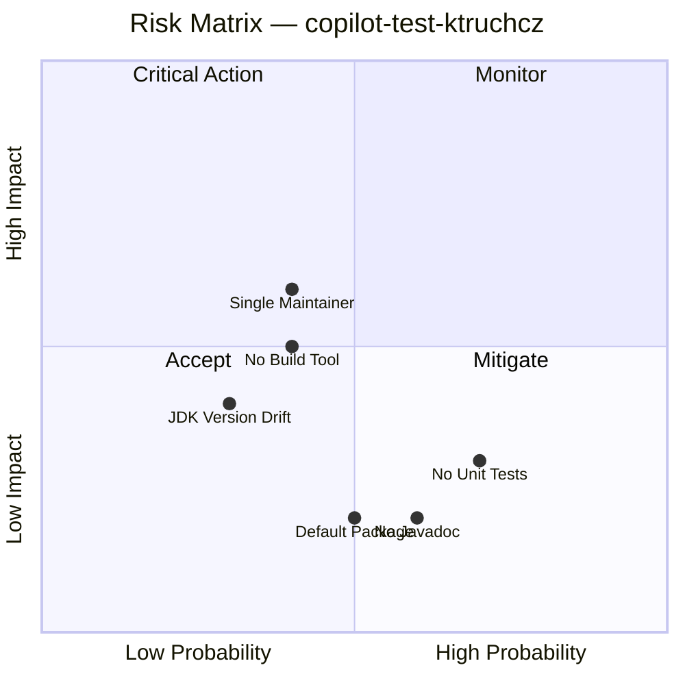

| ID | Risk | Probability | Impact | Mitigation |
|----|------|------------|--------|-----------|
| R-01 | **No unit tests** — behaviour is not automatically verified | Medium | Low | Add JUnit test for stdout output verification |
| R-02 | **No Javadoc** — code intent not formally documented | Medium | Low | Add `/** ... */` block comment to `main` method |
| R-03 | **JDK version not pinned** — CI may use different JDK versions over time | Low | Medium | Pin JDK version in GitHub Actions workflow (`java-version: '21'`) |
| R-04 | **Default package** — prevents reuse as a library | Low | Low | Refactor to named package if reuse is ever needed |
| R-05 | **No build tool** — scaling to multi-file project requires manual effort | Low | Medium | Introduce Maven or Gradle wrapper if project grows |
| R-06 | **Single maintainer** — bus factor of 1 | Medium | Medium | Add `CODEOWNERS` file; onboard additional contributors |

### 11.2 Technical Debt Items

| ID | Debt Item | Severity | Effort to Resolve | Priority |
|----|----------|---------|------------------|---------|
| TD-01 | No automated tests (zero test coverage) | 🟡 Medium | Low (< 1h) | P2 |
| TD-02 | No Javadoc / inline documentation | 🟢 Low | Low (< 30 min) | P3 |
| TD-03 | Minimal `README.md` (single line) | 🟡 Medium | Low (< 1h) | P2 |
| TD-04 | No `.editorconfig` or code style enforcement | 🟢 Low | Low (< 30 min) | P4 |
| TD-05 | No explicit JDK version specification | 🟡 Medium | Low (< 15 min) | P1 |
| TD-06 | No `LICENSE` file | 🟢 Low | Low (< 15 min) | P3 |

### 11.3 Recommended Improvements

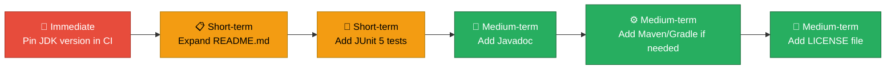

---

## 12. Glossary

| Term | Definition |
|------|-----------|
| **Arc42** | A template for software architecture documentation, consisting of 12 structured sections |
| **Bytecode** | Platform-independent intermediate code produced by `javac` and stored in `.class` files; interpreted or JIT-compiled by the JVM |
| **CI/CD** | Continuous Integration / Continuous Deployment — automated pipeline for building, testing, and releasing software |
| **Classpath** | A JVM parameter that specifies the locations of compiled `.class` files and JAR libraries |
| **Default Package** | The unnamed Java package; a class without a `package` declaration belongs to this package |
| **Entry Point** | The `public static void main(String[] args)` method — the first method invoked by the JVM when starting a Java application |
| **Exit Code** | An integer returned by a process to the OS upon termination; `0` conventionally signals success |
| **GitHub Actions** | GitHub's native CI/CD automation platform, configured via YAML workflow files in `.github/workflows/` |
| **Hello World** | A traditional introductory program that outputs the text "Hello, World!" (or similar); used to validate a working development environment |
| **`javac`** | The Java compiler included in the JDK; translates `.java` source files into `.class` bytecode |
| **JDK** | Java Development Kit — includes `javac`, `java`, and other tools required to develop and run Java applications |
| **JRE** | Java Runtime Environment — a subset of the JDK providing only the `java` runtime (not the compiler) |
| **JVM** | Java Virtual Machine — the runtime engine that loads, verifies, and executes Java bytecode |
| **SLOC** | Source Lines of Code — a metric counting non-blank, non-comment lines of source code |
| **`stdout`** | Standard Output — the default output stream of a process; by default connected to the terminal |
| **`System.out`** | A `java.io.PrintStream` instance in the `java.lang.System` class providing access to the standard output stream |
| **`System.out.println()`** | A method that writes a string followed by a newline character to the standard output stream |

---

*Documentation generated by **Arc42 Documentation Generator**.*  
*Source analysed: `HelloWorld.java` (5 lines), `README.md` (1 line).*  
*Repository: `copilot-test-ktruchcz` on GitHub.*
