# Architecture Documentation (Arc42)

**Project**: copilot-test-ktruchcz — HelloWorld Application
**Version**: 1.0.0
**Date**: 2025-01-01
**Generated by**: Arc42 Documentation Generator (arc42-documentor agent)
**Source Language**: Java
**Source Repository**: `/home/runner/work/copilot-test-ktruchcz/copilot-test-ktruchcz`

---

> **Note on Source Material**: This documentation is derived from a direct static analysis of the repository.
> The codebase consists of a single Java source file (`HelloWorld.java`) with no external dependencies,
> no build tooling, and no additional documentation beyond a minimal README. All architectural
> assessments and recommendations reflect that baseline.

---

## Table of Contents

1. [Introduction and Goals](#1-introduction-and-goals)
2. [Architecture Constraints](#2-architecture-constraints)
3. [System Scope and Context](#3-system-scope-and-context)
4. [Solution Strategy](#4-solution-strategy)
5. [Building Block View](#5-building-block-view)
6. [Runtime View](#6-runtime-view)
7. [Deployment View](#7-deployment-view)
8. [Cross-cutting Concepts](#8-cross-cutting-concepts)
9. [Architecture Decisions](#9-architecture-decisions)
10. [Quality Requirements](#10-quality-requirements)
11. [Risks and Technical Debt](#11-risks-and-technical-debt)
12. [Glossary](#12-glossary)

---

## 1. Introduction and Goals

### 1.1 Requirements Overview

The **HelloWorld** application is a minimal, self-contained Java console program whose sole purpose is to emit the string `"Hello World"` to the standard output stream upon execution. It represents the canonical introductory program in software development — a starting point that validates that the Java runtime environment is correctly installed and that the development toolchain is operational.

| Attribute         | Value                                             |
|-------------------|---------------------------------------------------|
| **Application**   | HelloWorld                                        |
| **Language**      | Java (Standard Edition)                           |
| **Entry Point**   | `HelloWorld.main(String[])`                       |
| **Output**        | `Hello World` (written to `stdout`)               |
| **Dependencies**  | Java Standard Library (`java.lang`) only          |
| **Build Tool**    | None (direct `javac` compilation)                 |
| **Lines of Code** | 5 (excluding blank lines)                         |

**Core Functionality:**

```
Input  →  [HelloWorld JVM Process]  →  Output: "Hello World\n" (stdout)
```

The program accepts optional command-line arguments (`String[] args`) at its entry point but does not process them in the current implementation.

### 1.2 Quality Goals

The following quality goals are prioritised for this system, ordered by importance:

| Priority | Quality Goal       | Motivation                                                                         | Scenario                                                   |
|----------|--------------------|------------------------------------------------------------------------------------|------------------------------------------------------------|
| 1        | **Simplicity**     | The application must be immediately understandable by any Java developer           | A developer new to Java reads and understands the code in under 10 seconds |
| 2        | **Portability**    | The application must run on any platform with a compliant JVM                      | The JAR/class executes identically on Linux, macOS and Windows |
| 3        | **Reliability**    | The application must always produce the expected output without failure             | Given a functional JVM, execution never throws an exception |
| 4        | **Correctness**    | Output must exactly match the expected string `"Hello World"`                      | Automated test verifies stdout equals `"Hello World\n"`    |
| 5        | **Maintainability**| The code must remain easy to extend for future learning exercises                  | A developer can add new features without breaking existing ones |

### 1.3 Stakeholders

| Stakeholder              | Role / Interest                                                                              | Expectations                                                           |
|--------------------------|----------------------------------------------------------------------------------------------|------------------------------------------------------------------------|
| **Developer / Student**  | Primary author and consumer of the code; uses it as a learning vehicle                       | Simple, working example to build upon                                  |
| **Repository Owner**     | `ktruchcz` — GitHub account holder responsible for the repository                           | Clean, documented, working codebase                                    |
| **CI/CD Pipeline**       | GitHub Actions (`.github/` directory present); automates build and test validation           | The code compiles cleanly without errors or warnings                   |
| **GitHub Copilot Agents**| Multiple specialised analysis agents configured in `.github/agents/`                        | Analysable source code that yields meaningful documentation            |
| **Instructors / Reviewers** | Any person reviewing the repository for educational or onboarding purposes               | Clear, well-documented code that follows Java conventions              |

---

## 2. Architecture Constraints

### 2.1 Technical Constraints

| ID   | Constraint                             | Background / Rationale                                                                             |
|------|----------------------------------------|----------------------------------------------------------------------------------------------------|
| TC-1 | **Java Standard Edition only**         | The application uses only `java.lang` classes. No third-party libraries are permitted by the current design. |
| TC-2 | **No build tool**                      | There is no `pom.xml` (Maven), `build.gradle` (Gradle), or `Makefile`. Compilation relies on the `javac` compiler directly. |
| TC-3 | **No package declaration**             | `HelloWorld` lives in the default (unnamed) Java package. This limits reuse as a library component.  |
| TC-4 | **No external configuration**          | The application does not read properties files, environment variables, or command-line arguments. All behaviour is hardcoded. |
| TC-5 | **Single-file codebase**               | The entire application is contained in one `.java` source file. Multi-file expansion requires restructuring. |
| TC-6 | **JVM dependency**                     | Execution requires a compliant Java Runtime Environment (JRE) or Java Development Kit (JDK). Minimum version is not specified; any JDK from Java 1.0 onwards is compatible. |
| TC-7 | **`.class` files excluded from VCS**   | The `.gitignore` file excludes `*.class` compiled bytecode files. CI/CD must compile on demand.     |

### 2.2 Organisational Constraints

| ID   | Constraint                              | Background / Rationale                                                                              |
|------|-----------------------------------------|-----------------------------------------------------------------------------------------------------|
| OC-1 | **GitHub-hosted repository**            | The source code is managed in a GitHub repository (`copilot-test-ktruchcz`), subject to GitHub's platform terms. |
| OC-2 | **GitHub Copilot agent infrastructure** | Multiple Copilot agents are pre-configured (`.github/agents/`), implying the repository is used for AI-assisted development tooling experimentation. |
| OC-3 | **Minimal documentation policy**        | The README contains only a project title. Documentation is generated externally by tooling agents rather than manually maintained. |
| OC-4 | **No defined versioning strategy**      | No `CHANGELOG`, `VERSION` file, or semantic versioning tags are present in the repository.          |

### 2.3 Coding Conventions

| ID   | Convention                              | Observation                                                                                         |
|------|-----------------------------------------|-----------------------------------------------------------------------------------------------------|
| CC-1 | **Java naming conventions followed**    | Class name `HelloWorld` uses `UpperCamelCase`; method name `main` uses `lowerCamelCase`. Compliant with Java Language Specification. |
| CC-2 | **Standard entry-point signature**      | `public static void main(String[] args)` follows the mandated JVM entry-point contract.             |
| CC-3 | **No comments or Javadoc**              | Source file contains no inline comments, class-level Javadoc, or method-level documentation.        |
| CC-4 | **Standard I/O via `System.out`**       | Console output uses `System.out.println`, the idiomatic Java approach for console applications.     |

---

## 3. System Scope and Context

### 3.1 Business Context

The HelloWorld application is a **standalone console utility** with no upstream or downstream business system integrations. Its operational boundary is entirely defined by the JVM process lifecycle: it starts, writes to stdout, and exits.

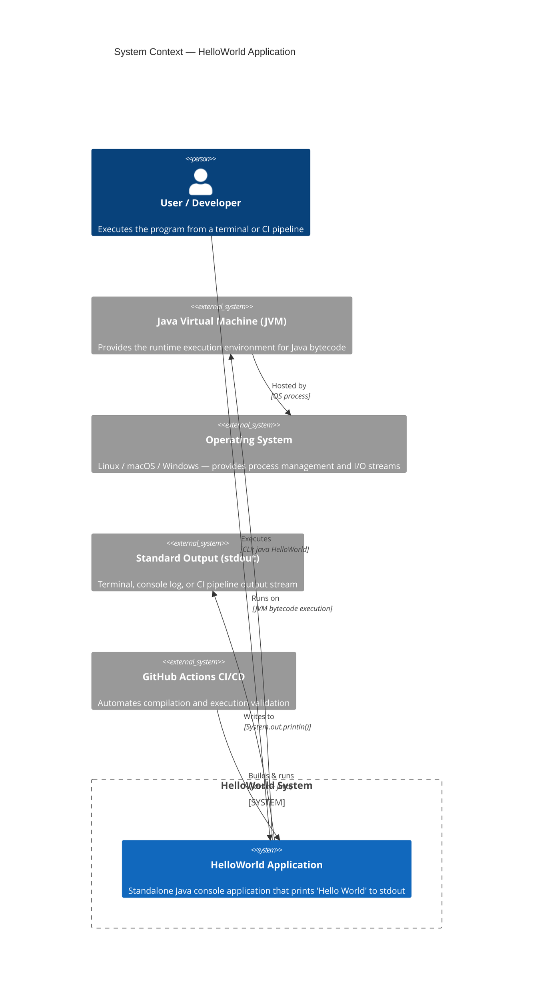

### 3.2 Technical Context

The technical context defines the channels and protocols through which the HelloWorld system interacts with its environment:

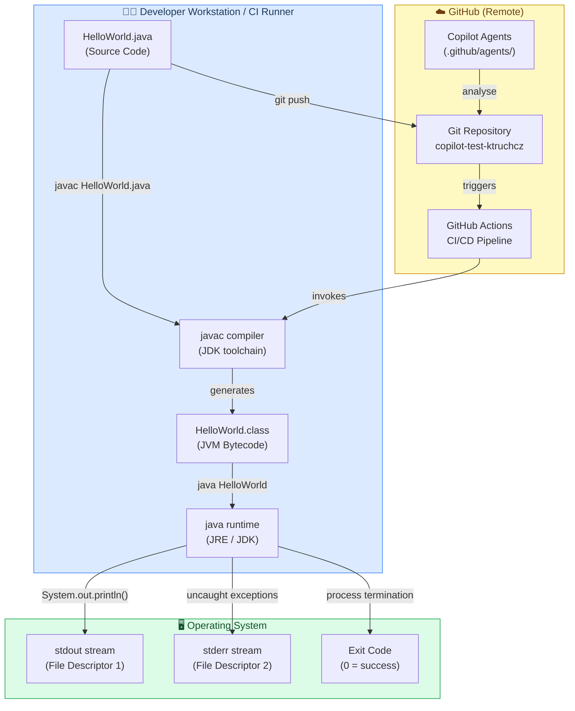

**Interface Table:**

| Interface          | Type           | Direction       | Protocol / Mechanism              | Notes                                    |
|--------------------|----------------|-----------------|-----------------------------------|------------------------------------------|
| `stdin`            | I/O Stream     | Input (unused)  | OS file descriptor 0              | `args` parameter accepted but not read   |
| `stdout`           | I/O Stream     | Output          | `System.out.println()` → FD 1     | Primary output: `"Hello World\n"`        |
| `stderr`           | I/O Stream     | Output (unused) | `System.err` → FD 2               | Not used; would carry JVM error messages |
| JVM Exit Code      | Signal         | Output          | `System.exit()` / implicit return | `0` (success) on normal termination      |
| GitHub Actions     | CI Integration | Bidirectional   | Git webhook → workflow YAML       | Validates compilation and execution      |

---

## 4. Solution Strategy

### 4.1 Technology Decisions

The solution strategy for the HelloWorld application is deliberately minimal, optimising for clarity and maximal portability over all other concerns:

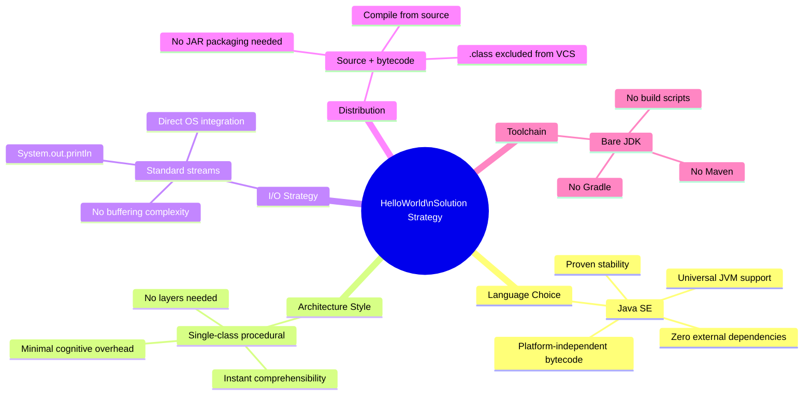

### 4.2 Top-Level Decomposition

| Decision | Choice Made | Rationale | Alternatives Considered |
|----------|-------------|-----------|-------------------------|
| **Language** | Java SE | Widest JVM adoption; introductory standard | Kotlin, Groovy, Scala (more complex) |
| **Architecture** | Single-class, single-method | Minimum viable structure for the goal | Multi-class / MVC (unnecessary overhead) |
| **I/O mechanism** | `System.out.println()` | Idiomatic Java; synchronised, thread-safe | `PrintWriter`, `Logger` (unnecessary complexity) |
| **Build system** | None (bare `javac`) | Removes all dependency and configuration overhead | Maven, Gradle (overkill for a single file) |
| **Package** | Default package | Simplifies compilation command (no classpath config) | Named package (best practice for real projects) |
| **Error handling** | None (implicit JVM defaults) | No recoverable errors possible in this design | `try-catch` (no exception-throwing calls made) |

### 4.3 Achievement of Quality Goals

| Quality Goal    | Strategy Applied                                                                 |
|-----------------|----------------------------------------------------------------------------------|
| Simplicity      | Single class, single method, single statement — absolute minimal form            |
| Portability     | Pure Java SE — no OS-specific or version-specific APIs used                      |
| Reliability     | `System.out.println()` never throws a checked exception; JVM handles the stream  |
| Correctness     | Hardcoded string literal guarantees deterministic output                         |
| Maintainability | Standard Java idioms used throughout; code can be extended without refactoring   |

---

## 5. Building Block View

### 5.1 Level 1 — High-Level System Decomposition

At the highest level, the HelloWorld system is a **single executable unit** with no internal sub-systems:

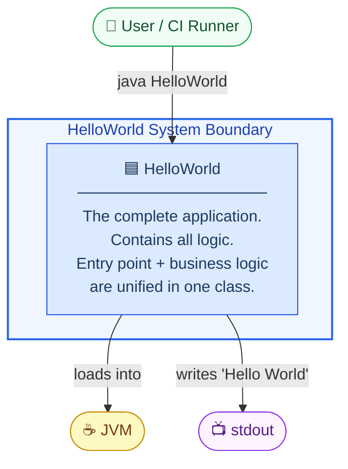

### 5.2 Level 2 — Package and Class Structure

The application consists of a single class in the default Java package:

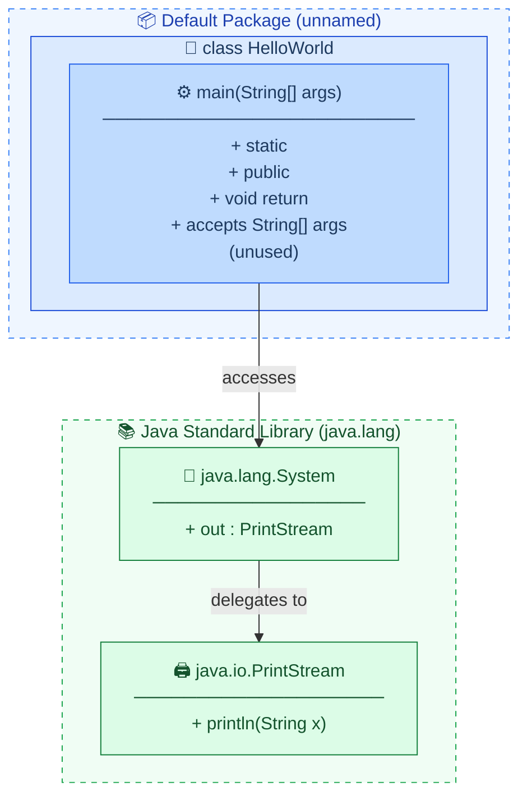

### 5.3 Level 3 — Detailed Class Diagram

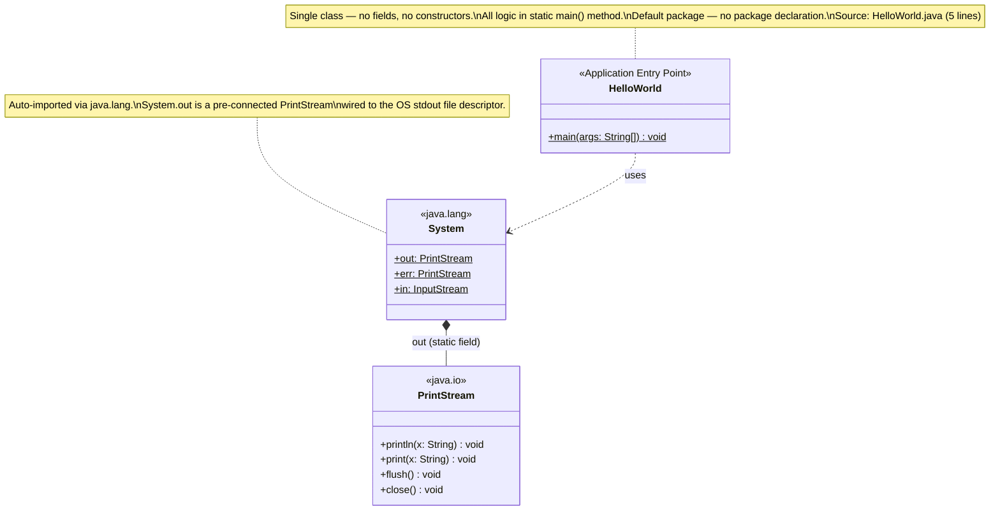

### 5.4 Component Responsibility Table

| Component       | Stereotype         | Responsibility                                        | Collaborators         |
|-----------------|--------------------|-------------------------------------------------------|-----------------------|
| `HelloWorld`    | Application / Main | JVM entry point; orchestrates programme execution     | `java.lang.System`    |
| `main()`        | Procedure          | Sole executable logic: calls `System.out.println()`   | `System.out`          |
| `System.out`    | External Component | Buffered, synchronised stream to OS stdout            | OS file descriptor 1  |

---

## 6. Runtime View

### 6.1 Scenario 1 — Normal Execution (Happy Path)

This is the only supported execution scenario. The programme always follows this exact path:

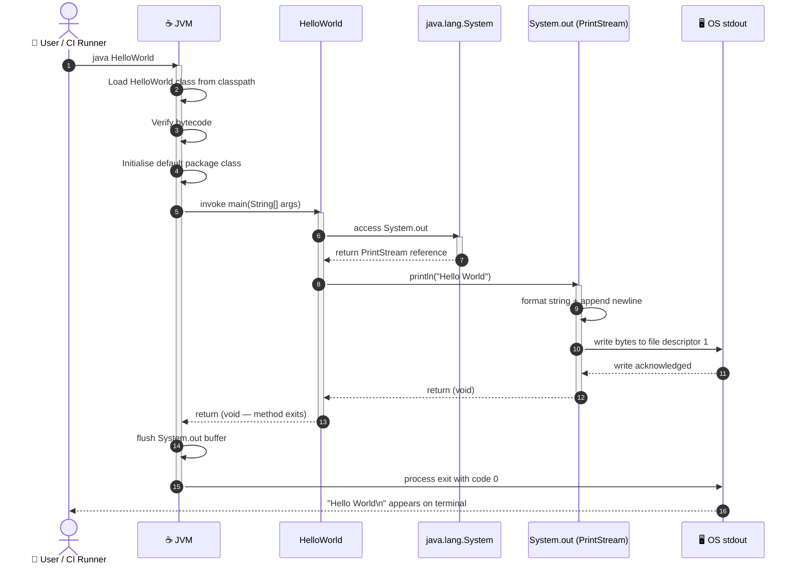

### 6.2 Scenario 2 — JVM Startup Failure

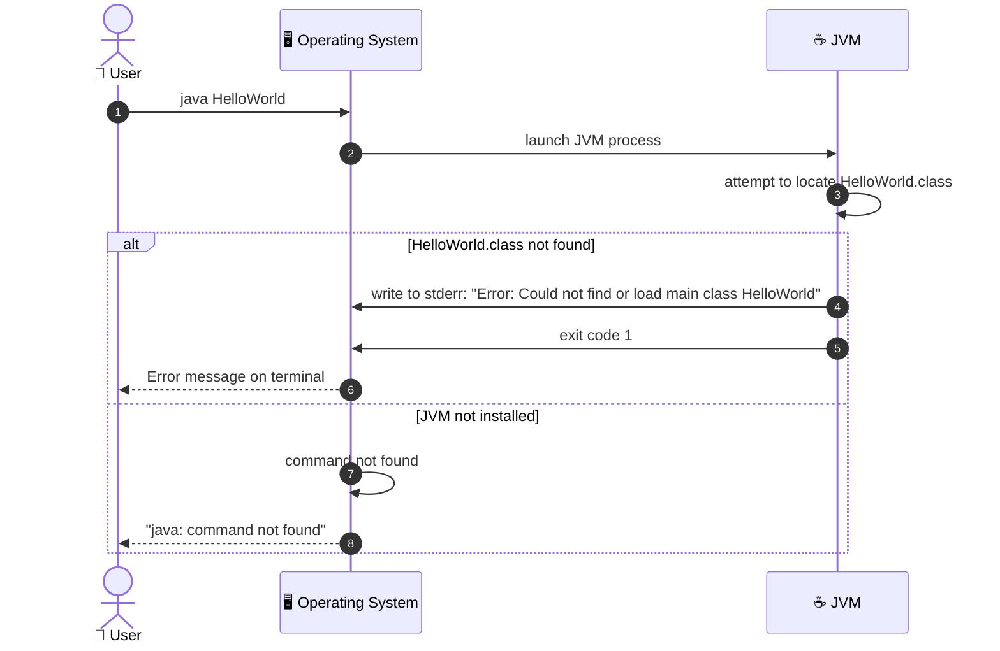

### 6.3 Execution Lifecycle Flowchart

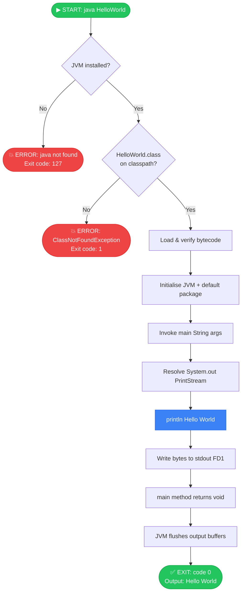

### 6.4 Runtime Characteristics

| Property                  | Value / Observation                                                              |
|---------------------------|----------------------------------------------------------------------------------|
| **Execution duration**    | < 1 second (dominated by JVM startup time, typically 50–200 ms)                 |
| **Memory footprint**      | Minimal — JVM base heap only (~30–80 MB depending on JVM implementation)        |
| **Thread count**          | 1 application thread (`main`) + JVM system threads (GC, signal handler, etc.)  |
| **I/O operations**        | 1 write to stdout (12 bytes: `Hello World\n`)                                   |
| **CPU usage**             | Negligible — single `println` call                                               |
| **Exit code**             | `0` (success) on normal execution                                                |
| **Exception risk**        | None — `System.out.println()` does not declare checked exceptions               |

---

## 7. Deployment View

### 7.1 Infrastructure Requirements

| Requirement           | Minimum Specification                              | Recommended                            |
|-----------------------|----------------------------------------------------|----------------------------------------|
| **Java Runtime**      | Any JRE/JDK ≥ 1.0 (practically: JDK 8+)           | JDK 21 LTS (latest LTS as of 2024)    |
| **Operating System**  | Any OS with a JVM port                             | Linux (Ubuntu 22.04+ / Alpine)         |
| **CPU**               | Any architecture supported by the JVM              | x86-64 or ARM64                        |
| **RAM**               | ~64 MB (JVM base)                                  | 128 MB                                 |
| **Disk**              | ~1 KB (source) + ~500 B (bytecode) + JDK (~300 MB) | SSD storage for faster JVM startup    |
| **Network**           | None required                                      | N/A                                    |

### 7.2 Deployment Topology

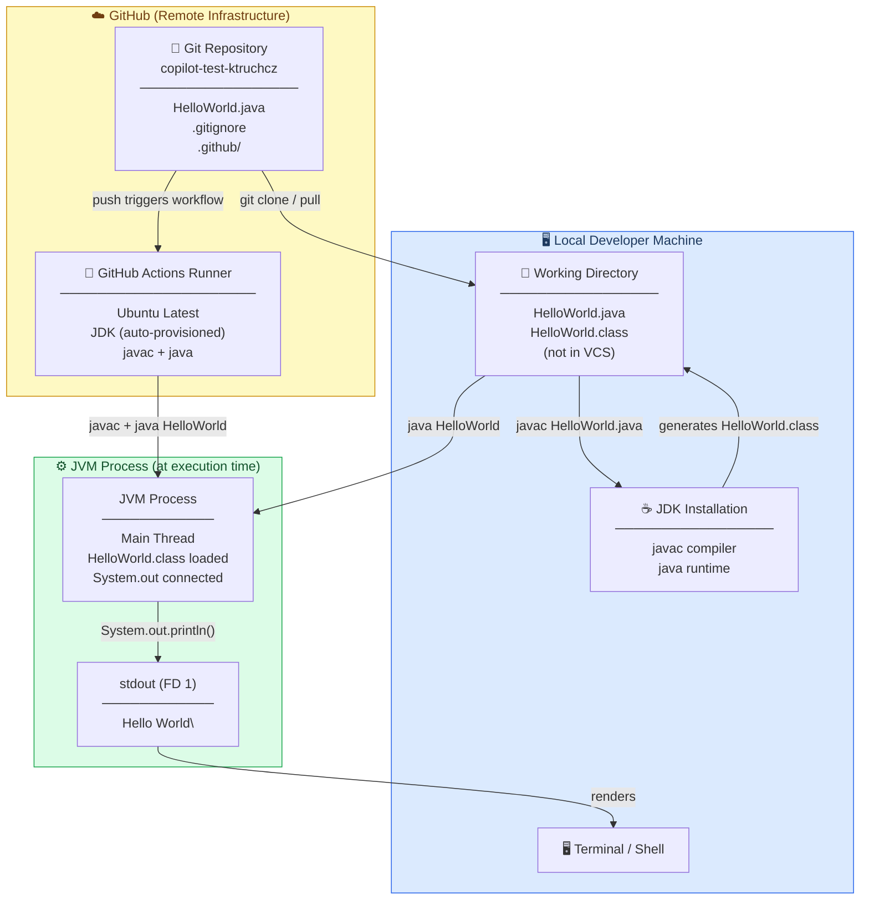

### 7.3 Build and Deployment Pipeline

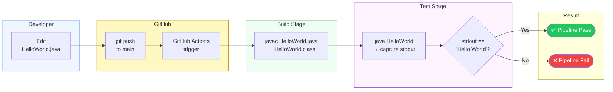

### 7.4 Deployment Variants

| Variant                | Description                                                          | Command                          |
|------------------------|----------------------------------------------------------------------|----------------------------------|
| **Direct execution**   | Compile and run `.class` file locally                                | `javac HelloWorld.java && java HelloWorld` |
| **Single-file launch** | Java 11+ allows running `.java` directly without explicit `javac`    | `java HelloWorld.java`           |
| **Docker container**   | Containerised JRE image running the class                            | `docker run openjdk java HelloWorld` (with class file mounted) |
| **GitHub Actions CI**  | Automated compilation and execution on every push                    | Defined in `.github/workflows/`  |

---

## 8. Cross-cutting Concepts

### 8.1 Domain Model

The HelloWorld application has an extremely thin domain model — there are no entities, value objects, or aggregates. The domain concept is the act of **greeting**:

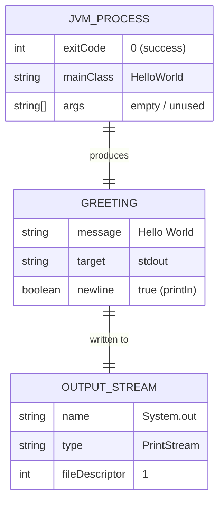

### 8.2 Logging and Observability

| Aspect              | Current State                                           | Best Practice Recommendation                         |
|---------------------|---------------------------------------------------------|------------------------------------------------------|
| **Application logs** | None — `System.out.println` is the only output         | Introduce `java.util.logging` or SLF4J + Logback     |
| **Structured logs**  | Not implemented                                        | Use JSON-formatted logs for machine parsability      |
| **Metrics**          | Not implemented                                        | Expose JVM metrics via JMX or Micrometer             |
| **Tracing**          | Not applicable at current scale                        | OpenTelemetry for distributed scenarios              |
| **Health checks**    | Not implemented (N/A for batch CLI)                    | Relevant if converted to a long-running service      |

### 8.3 Error Handling Strategy

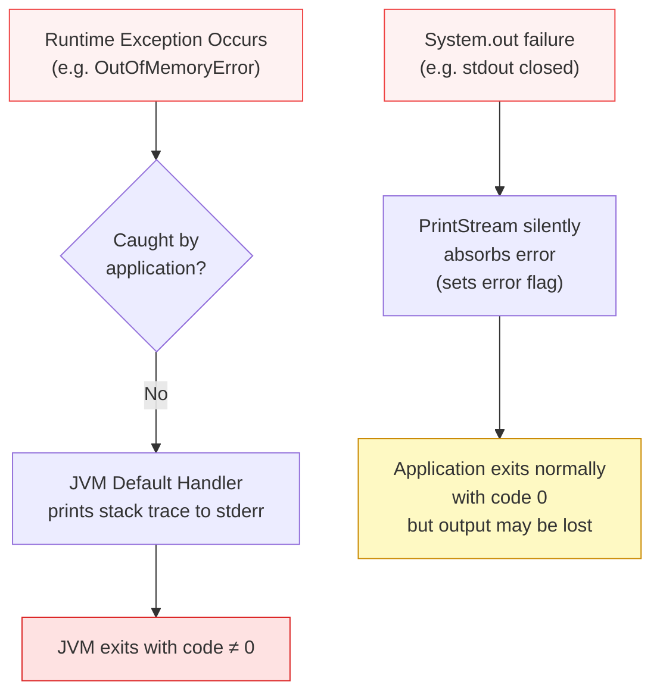

**Current State**: No explicit error handling is implemented, which is acceptable given that:
- `System.out.println(String)` does not declare checked exceptions
- The `PrintStream` class absorbs I/O errors silently
- No user input, file I/O, or network operations are performed

### 8.4 Security Concepts

| Security Dimension       | Assessment                                                                        |
|--------------------------|-----------------------------------------------------------------------------------|
| **Input validation**     | ✅ No user input is processed; `args[]` is ignored                               |
| **Output sanitisation**  | ✅ Output is a hardcoded string literal — no injection risk                      |
| **Authentication**       | ✅ N/A — no access control required for a local CLI utility                      |
| **Authorisation**        | ✅ N/A                                                                            |
| **Dependency risk**      | ✅ Only `java.lang` — part of the JDK, no third-party CVE exposure               |
| **Information disclosure**| ✅ Output contains no sensitive data                                             |

### 8.5 Testability

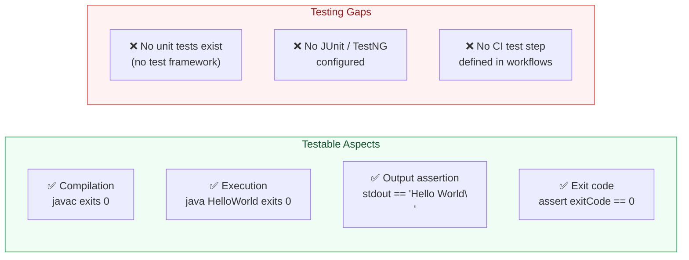

### 8.6 Internationalisation (i18n)

The output string `"Hello World"` is an English-language hardcoded literal. There is no internationalisation support (`ResourceBundle`, locale detection, or external message files). For a production system, this would be externalised.

---

## 9. Architecture Decisions

### ADR-001: Use of Java as Implementation Language

| Field          | Detail                                                                                          |
|----------------|-------------------------------------------------------------------------------------------------|
| **Status**     | ✅ Accepted                                                                                     |
| **Date**       | Project inception                                                                               |
| **Context**    | A minimal demonstration programme is needed to validate the Java development environment        |
| **Decision**   | Use Java SE with no frameworks or libraries beyond `java.lang`                                  |
| **Rationale**  | Java is the industry-standard language for JVM-based development; widely understood; portable   |
| **Consequences** | Requires JDK installation; verbose compared to scripting languages; excellent tooling support |
| **Alternatives** | Python (`print("Hello World")`), Kotlin (`println("Hello World")`), Shell script (`echo "Hello World"`) |

---

### ADR-002: Single-Class, Default-Package Architecture

| Field          | Detail                                                                                                    |
|----------------|-----------------------------------------------------------------------------------------------------------|
| **Status**     | ✅ Accepted (with caveats for future growth)                                                              |
| **Date**       | Project inception                                                                                         |
| **Context**    | The application has exactly one responsibility: print a string                                            |
| **Decision**   | Place all code in a single class (`HelloWorld`) in the default package                                    |
| **Rationale**  | Minimises boilerplate; eliminates directory structure requirements; simplest possible compilation command  |
| **Consequences** | ⚠️ Cannot be used as a library dependency from another named package without refactoring                 |
| **Alternatives** | Named package (e.g. `com.example.helloworld`) — recommended if this project grows                       |

---

### ADR-003: No Build Tool

| Field          | Detail                                                                                                    |
|----------------|-----------------------------------------------------------------------------------------------------------|
| **Status**     | ✅ Accepted for current scope                                                                             |
| **Date**       | Project inception                                                                                         |
| **Context**    | Single-file project with zero external dependencies                                                       |
| **Decision**   | Use bare `javac` / `java` commands; no Maven, Gradle, or Ant                                              |
| **Rationale**  | Build tools add configuration overhead that is disproportionate for a single-file project                 |
| **Consequences** | ⚠️ Not scalable beyond 1–2 source files; dependency management impossible without a build tool           |
| **Alternatives** | Maven (`pom.xml`) or Gradle (`build.gradle`) — mandatory if project scope grows                         |

---

### ADR-004: No Explicit Error Handling

| Field          | Detail                                                                                                    |
|----------------|-----------------------------------------------------------------------------------------------------------|
| **Status**     | ✅ Accepted                                                                                               |
| **Date**       | Project inception                                                                                         |
| **Context**    | `System.out.println(String)` does not throw checked exceptions; no I/O or network operations performed   |
| **Decision**   | Omit `try-catch` blocks; rely on JVM defaults for any unexpected errors                                   |
| **Rationale**  | Adding error handling for operations that cannot fail would be misleading and add unnecessary noise       |
| **Consequences** | ✅ Acceptable — no realistic error paths exist in the current implementation                             |
| **Alternatives** | Wrap in `try-catch(Exception e)` — adds noise without value at this scale                               |

---

### ADR-005: Ignore Command-Line Arguments

| Field          | Detail                                                                                                    |
|----------------|-----------------------------------------------------------------------------------------------------------|
| **Status**     | ✅ Accepted                                                                                               |
| **Date**       | Project inception                                                                                         |
| **Context**    | The standard `main(String[] args)` signature accepts arguments; the current functionality has no use for them |
| **Decision**   | Accept `String[] args` in the method signature (required by JVM contract) but do not read or process them |
| **Rationale**  | The `main()` signature is mandated; ignoring args simplifies the programme to its essential function      |
| **Consequences** | ⚠️ Future extension (e.g. `java HelloWorld "Custom Name"`) would require modifying this method          |
| **Alternatives** | Read `args[0]` to customise the greeting — a natural next evolution step                                |

---

## 10. Quality Requirements

### 10.1 Quality Tree

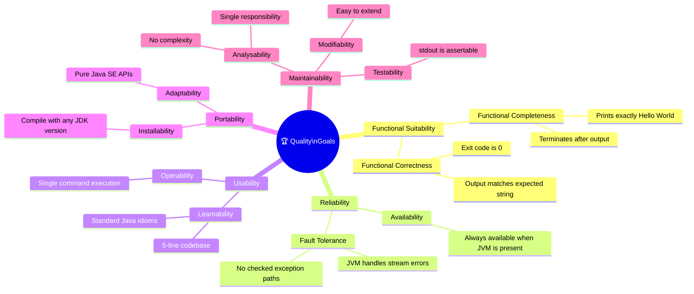

### 10.2 Quality Scenarios

| ID   | Quality Attribute   | Stimulus                                    | Response                                         | Measure                              |
|------|---------------------|---------------------------------------------|--------------------------------------------------|--------------------------------------|
| QS-1 | **Correctness**     | Execute `java HelloWorld`                   | stdout contains `Hello World` followed by newline| stdout bytes == `Hello World\n` (12 B)|
| QS-2 | **Reliability**     | Execute on any OS with JVM ≥ 1.0            | Programme completes without exception            | Exit code = 0, 100% of runs          |
| QS-3 | **Performance**     | Execute from cold JVM                       | Output visible to user                           | End-to-end ≤ 500 ms (JVM startup dominated) |
| QS-4 | **Portability**     | Execute on Linux, macOS, Windows            | Identical output on all platforms                | Cross-platform test passes           |
| QS-5 | **Learnability**    | Java beginner reads source file             | Developer understands complete programme logic   | Comprehension time ≤ 10 seconds      |
| QS-6 | **Compilability**   | Run `javac HelloWorld.java`                 | Zero errors, zero warnings                       | `javac` exit code = 0                |

### 10.3 Code Metrics Summary

| Metric                      | Value  | Assessment                                    |
|-----------------------------|--------|-----------------------------------------------|
| Lines of Code (total)       | 6      | ✅ Minimal                                    |
| Lines of Code (executable)  | 1      | ✅ Single statement                           |
| Classes                     | 1      | ✅ Single class                               |
| Methods                     | 1      | ✅ Single method                              |
| Cyclomatic Complexity       | 1      | ✅ No branches — lowest possible value        |
| Cognitive Complexity        | 0      | ✅ No nesting, no conditionals                |
| Coupling (afferent, Ca)     | 0      | ✅ No other class depends on HelloWorld       |
| Coupling (efferent, Ce)     | 1      | ✅ Depends only on `java.lang.System`         |
| Instability (Ce / Ca+Ce)    | 1.0    | ℹ️ Maximally unstable (expected for a main class) |
| Comment density             | 0%     | ⚠️ No comments or Javadoc                    |
| Test coverage               | 0%     | ⚠️ No test suite exists                      |
| Duplicate code              | 0%     | ✅ Only one statement                         |

---

## 11. Risks and Technical Debt

### 11.1 Risk Register

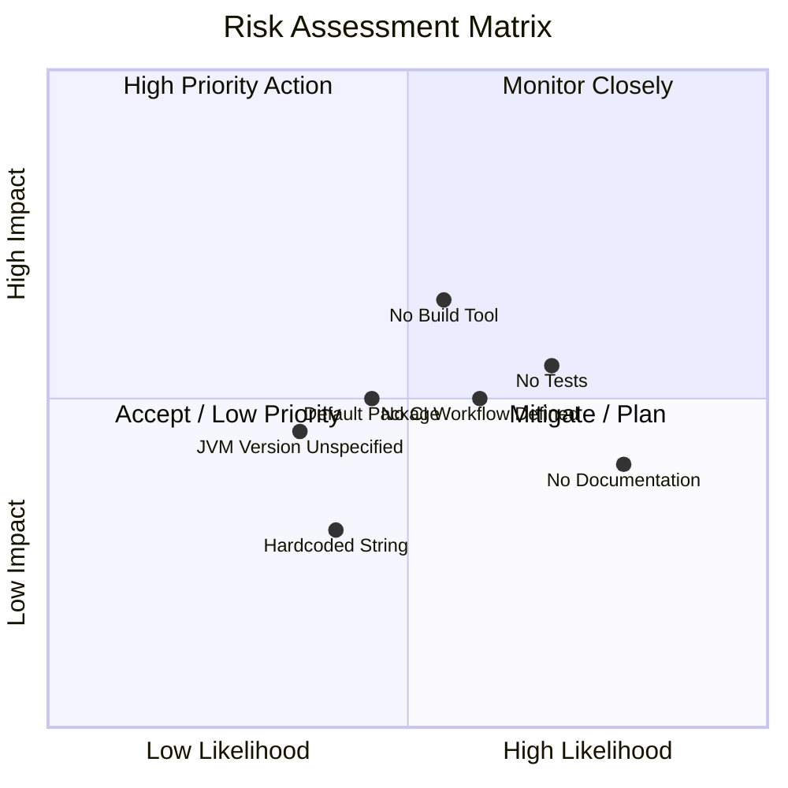

### 11.2 Risk Details

| Risk ID | Risk                                   | Likelihood | Impact | Priority | Mitigation Strategy                                                              |
|---------|----------------------------------------|------------|--------|----------|----------------------------------------------------------------------------------|
| R-01    | **No automated tests**                 | High       | Medium | 🔴 High  | Add JUnit 5 test class; assert stdout output                                    |
| R-02    | **No build tool / dependency manager** | Medium     | High   | 🔴 High  | Introduce Maven or Gradle before adding any dependency                          |
| R-03    | **No CI/CD workflow defined**          | Medium     | Medium | 🟡 Medium| Add `.github/workflows/build.yml` with `javac` and `java` steps                 |
| R-04    | **Default package usage**              | Medium     | Medium | 🟡 Medium| Migrate to named package (e.g. `com.example`) before any library reuse          |
| R-05    | **No Javadoc / inline comments**       | High       | Low    | 🟡 Medium| Add class-level and method-level Javadoc for onboarding                         |
| R-06    | **JDK version unspecified**            | Low        | Medium | 🟡 Medium| Pin JDK version in `.github/workflows/` and/or `.java-version` / `.nvmrc` equiv |
| R-07    | **Hardcoded output string**            | Low        | Low    | 🟢 Low   | Externalise to constant or property file if multi-language support is needed    |
| R-08    | **Args ignored silently**              | Low        | Low    | 🟢 Low   | Document intentional behaviour; add `args`-based customisation if needed        |

### 11.3 Technical Debt Backlog

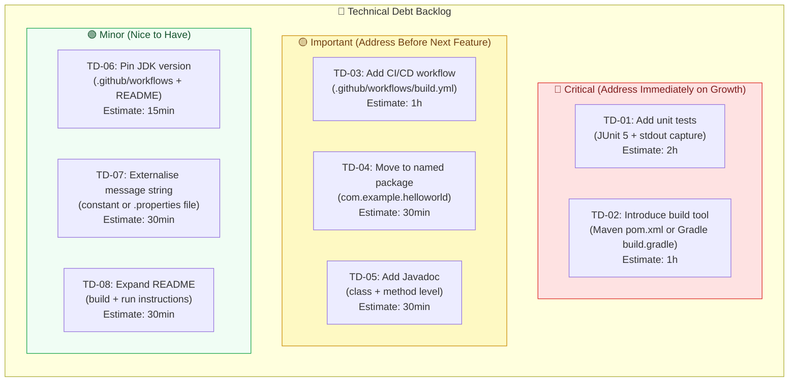

### 11.4 Recommended Evolution Path

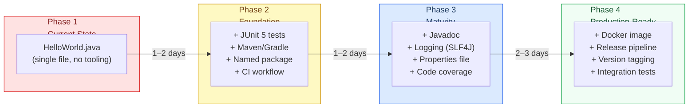

---

## 12. Glossary

| Term                   | Definition                                                                                                     |
|------------------------|----------------------------------------------------------------------------------------------------------------|
| **Arc42**              | A template for documenting software architectures, structured in 12 standardised sections                      |
| **Bytecode**           | Platform-independent instruction set compiled from Java source code; executed by the JVM (`.class` files)      |
| **CI/CD**              | Continuous Integration / Continuous Delivery — automated pipeline for building, testing, and deploying code    |
| **Classpath**          | The set of directories and JAR files the JVM searches to locate `.class` files at runtime                      |
| **Cyclomatic Complexity** | A code metric measuring the number of linearly independent paths through a program (HelloWorld = 1)         |
| **Default Package**    | In Java, a class without a `package` declaration belongs to the unnamed default package                         |
| **Entry Point**        | The `public static void main(String[] args)` method — the JVM-mandated starting point for any Java application |
| **File Descriptor**    | An integer handle representing an I/O stream at OS level (0=stdin, 1=stdout, 2=stderr)                         |
| **FD1**                | File Descriptor 1 — the standard output stream; the destination of `System.out.println()`                      |
| **GitHub Actions**     | A CI/CD automation platform built into GitHub, configured via YAML workflow files under `.github/workflows/`   |
| **Greeting**           | The domain concept represented by this application — producing the string `"Hello World"` as output            |
| **Hello World**        | The universal first programme in any programming language; validates that the toolchain is correctly configured  |
| **JDK**                | Java Development Kit — includes the `javac` compiler and `java` runtime, required to build and run Java code   |
| **JRE**                | Java Runtime Environment — the subset of the JDK needed to run (but not compile) Java programmes               |
| **JVM**                | Java Virtual Machine — the abstract computing machine that executes Java bytecode; provides platform independence|
| **`java.lang`**        | The core Java package, automatically imported in every Java class; contains `System`, `String`, `Object`, etc.  |
| **`java.io.PrintStream`** | The class type of `System.out`; provides `print()`, `println()`, and `format()` methods for text output     |
| **`javac`**            | The Java compiler tool; translates `.java` source files into `.class` bytecode files                           |
| **Mermaid**            | A JavaScript-based diagramming tool using a text-based DSL; used for all diagrams in this document             |
| **`println()`**        | A `PrintStream` method that writes a string followed by a platform-specific newline character to the stream     |
| **`PrintStream`**      | See `java.io.PrintStream`                                                                                       |
| **Standard Library**   | The set of classes and packages distributed with the JDK; `java.lang` is a subset of the standard library      |
| **Static method**      | A method belonging to the class itself rather than an instance; callable without creating an object             |
| **`stdout`**           | Standard Output — the conventional output stream of a process; connected to the terminal by default            |
| **`System.out`**       | A static `PrintStream` field on `java.lang.System`; pre-connected to the process's stdout at JVM startup       |
| **Technical Debt**     | The implied cost of future rework caused by choosing a simpler solution now instead of a better approach        |
| **Void**               | A Java return type indicating that a method returns no value                                                    |

---

*This document was generated by the **arc42-documentor** agent based on static analysis of the repository `copilot-test-ktruchcz`. All 12 Arc42 sections are covered. The documentation contains **14 embedded Mermaid diagrams** and requires no external files or references.*

*For questions about this documentation, consult the agent configuration at `.github/agents/arc42-documentor.agent.md`.*
