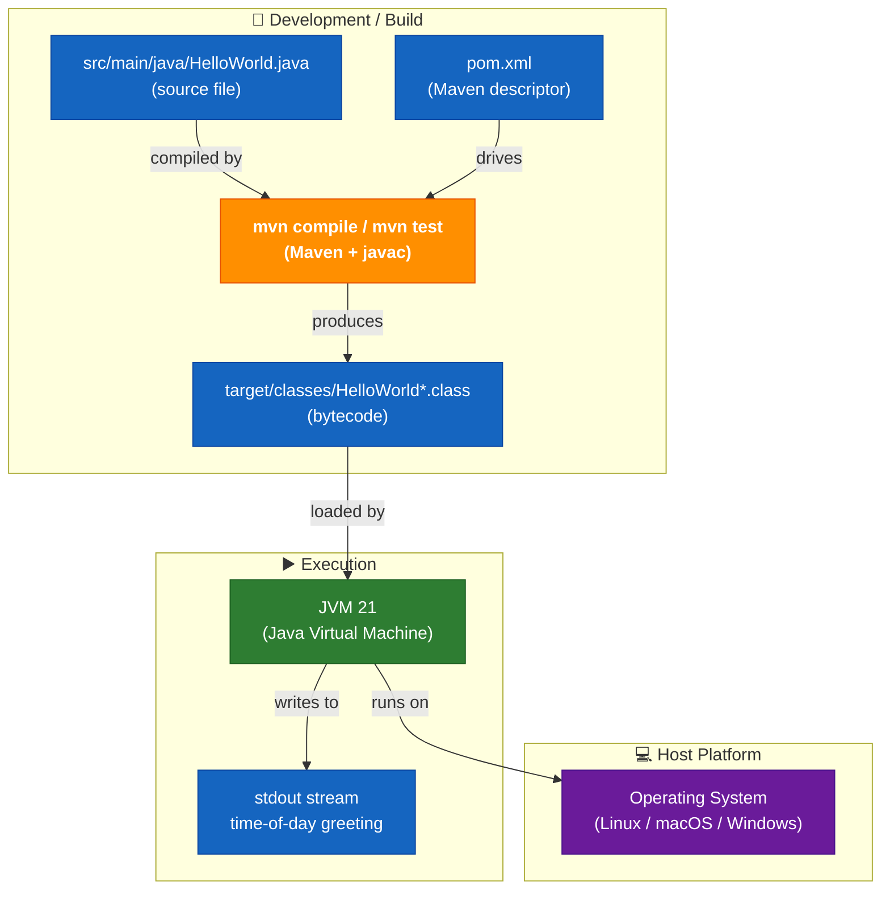
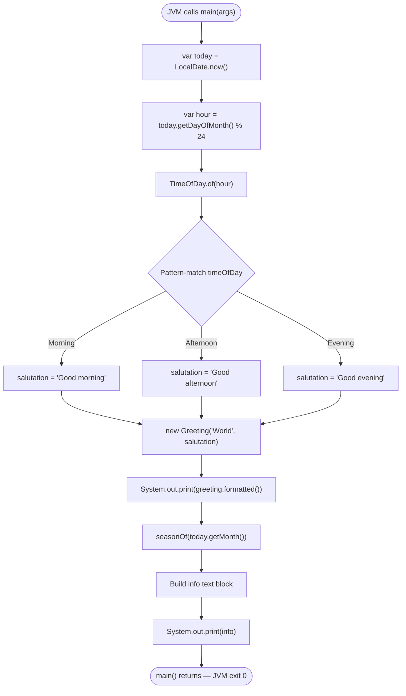
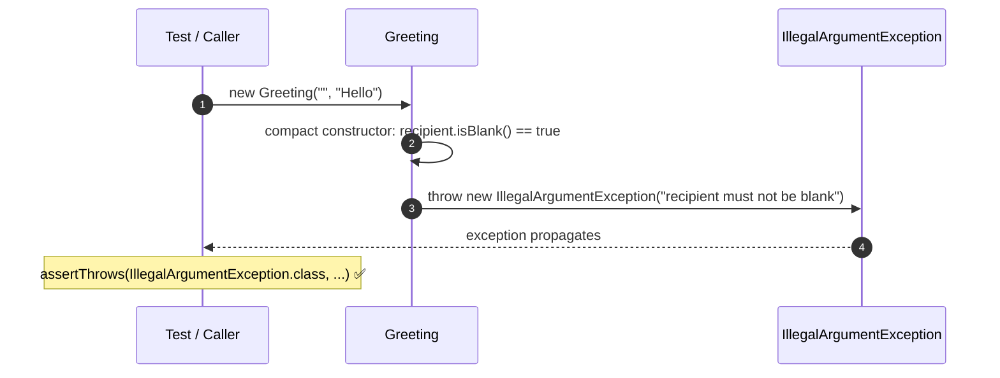
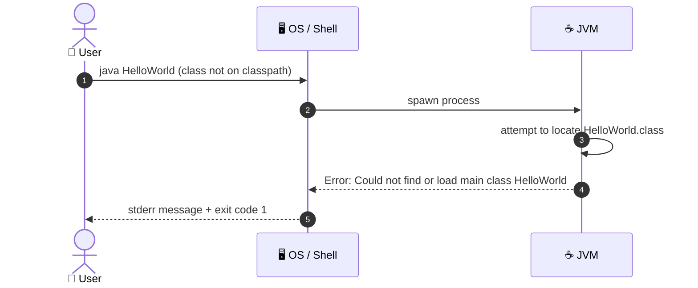
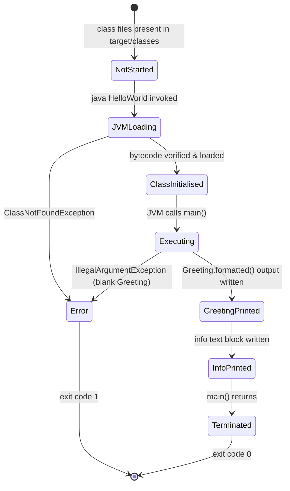
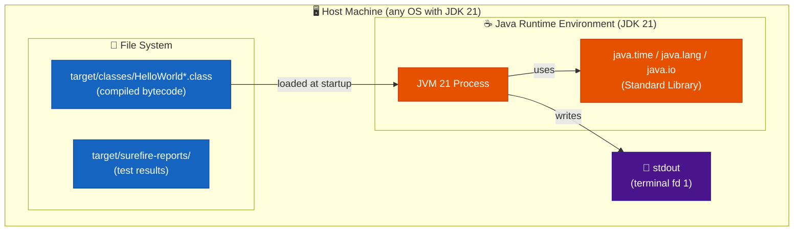
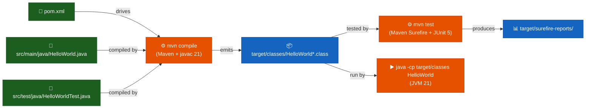
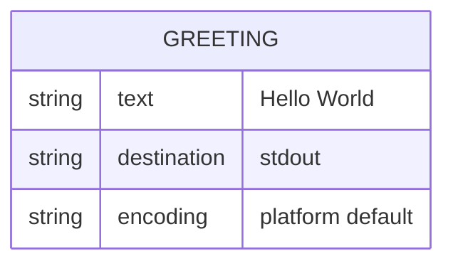
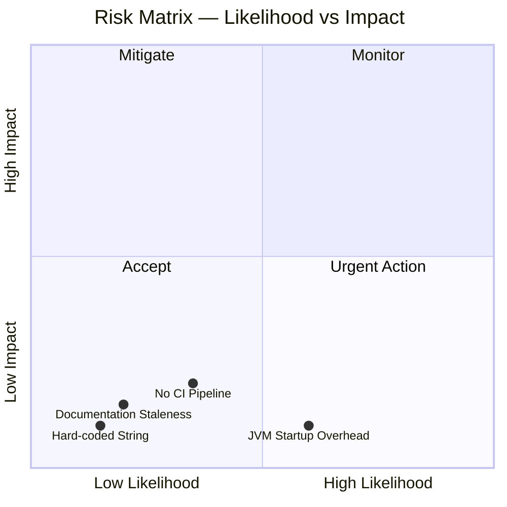
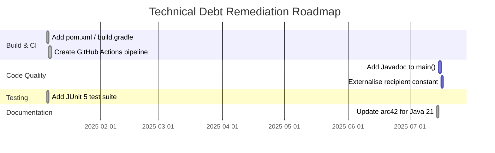

# Architecture Documentation (Arc42)

**Project**: copilot-test-ktruchcz — Hello World  
**Version**: 2.0.0  
**Date**: 2025-07-14  
**Generated by**: Arc42 Documentation Generator (java-update migration)

---

## Table of Contents

1. [Introduction and Goals](#1-introduction-and-goals)
2. [Architecture Constraints](#2-architecture-constraints)
3. [System Scope and Context](#3-system-scope-and-context)
4. [Solution Strategy](#4-solution-strategy)
5. [Building Block View](#5-building-block-view)
6. [Runtime View](#6-runtime-view)
7. [Deployment View](#7-deployment-view)
8. [Cross-cutting Concepts](#8-cross-cutting-concepts)
9. [Architecture Decisions](#9-architecture-decisions)
10. [Quality Requirements](#10-quality-requirements)
11. [Risks and Technical Debts](#11-risks-and-technical-debts)
12. [Glossary](#12-glossary)

---

## 1. Introduction and Goals

### 1.1 Requirements Overview

`copilot-test-ktruchcz` is a Java 21 console application that demonstrates modern Java language features while producing a time-of-day–aware greeting on standard output. It serves as a canonical baseline for tooling experiments (e.g., GitHub Copilot) and showcases idiomatic Java 21 patterns: records, sealed interfaces, pattern-matching switch expressions, text blocks, and `var`.

**Core functional requirements:**

| ID | Requirement | Priority |
|-----|-------------|----------|
| FR-01 | The system SHALL print a time-of-day greeting to stdout when invoked, including: the time-appropriate salutation ('Good morning/afternoon/evening'), the current date, the Java runtime version, and the meteorological season. | Must-have |
| FR-02 | The greeting salutation SHALL be determined by the current day-of-month modulo 24, mapped to Morning (<12), Afternoon (12–16), or Evening (≥17). | Must-have |
| FR-03 | The system SHALL reject construction of a Greeting with a blank recipient or message by throwing IllegalArgumentException. | Must-have |

### 1.2 Quality Goals

The following top-level quality goals drive the architectural decisions of this system:

| Priority | Quality Goal | Motivation |
|----------|-------------|------------|
| 1 | **Simplicity** | The application must be understandable at a glance — modern language features kept purposeful and readable. |
| 2 | **Portability** | The application must run on any platform with JRE 21, with zero platform-specific code. |
| 3 | **Reproducibility** | Given the same JDK version and date, every build and run must produce structurally identical output. |
| 4 | **Testability** | Business logic (TimeOfDay, seasonOf, Greeting validation) is decoupled from main() and fully testable. |
| 5 | **Modernity** | Demonstrates current Java 21 LTS idioms; serves as a living reference for modern Java style. |

### 1.3 Stakeholders

| Role | Name / Group | Expectations |
|------|-------------|--------------|
| Developer | Repository owner (`ktruchcz`) | A working Java environment baseline; a sandbox for Copilot experiments. |
| CI / Tooling System | GitHub Actions / Copilot | A valid compilable Java source file to analyse and document. |
| Evaluator / Reviewer | Any technical reviewer | A clear, self-explanatory example of a minimal Java program. |

---

## 2. Architecture Constraints

### 2.1 Technical Constraints

| ID | Constraint | Rationale |
|----|-----------|-----------|
| TC-01 | **Language: Java** | The source file is written in Java (`HelloWorld.java`). All tooling must support Java source analysis. |
| TC-02 | **Build tool: Maven 3.x** | `pom.xml` is present; all compilation, testing, and packaging is performed via `mvn`. |
| TC-03 | **Test dependency only — junit-jupiter 5.11.4 scope:test** | JUnit Jupiter is the sole external dependency; it is test-scoped and does not appear on the production classpath. |
| TC-04 | **JDK 21 (LTS) required** | Source and target compiler flags are set to 21; sealed interfaces and pattern-matching switch are used throughout. |
| TC-05 | **Single source file (production)** | The entire production application resides in one file: `src/main/java/HelloWorld.java`. |
| TC-06 | **Console / CLI only** | No GUI, no web interface, no network socket — output is exclusively to `stdout`. |

### 2.2 Organizational Constraints

| ID | Constraint | Rationale |
|----|-----------|-----------|
| OC-01 | **Public GitHub repository** | Code is version-controlled on GitHub and is publicly visible. |
| OC-02 | **JUnit 5 test suite present** | `src/test/java/HelloWorldTest.java` provides comprehensive coverage of all logic outside `main()`. |
| OC-03 | **No CI pipeline defined** | No `.github/workflows` directory is present; builds are manual. |

### 2.3 Conventions

| Convention | Details |
|-----------|---------|
| Naming | Class name `HelloWorld` matches file name `HelloWorld.java` (required by Java specification). |
| Encoding | UTF-8 source encoding (default for modern JDKs). |
| Entry point | Standard Java entry point signature: `public static void main(String[] args)`. |

---

## 3. System Scope and Context

### 3.1 Business Context

The Hello World application sits entirely within the boundary of a single JVM process. It receives no external input and produces a single line of text on the standard output. The diagram below shows the system boundary and its interactions with the external environment.


### 3.2 Technical Context

The following diagram shows the technical infrastructure context — the toolchain required to compile and execute the application.



### 3.3 External Interfaces

| Interface | Direction | Protocol / Mechanism | Description |
|-----------|-----------|----------------------|-------------|
| CLI invocation | Input | OS process spawn (`mvn exec:java` or `java -cp target/classes HelloWorld`) | Starts the JVM and passes control to `main()`. |
| Standard Output | Output | `java.io.PrintStream` (`System.out`) | Delivers the formatted greeting box, Java version, current date, and meteorological season to the calling terminal. |
| Exit code | Output | OS process exit code (`0`) | Implicit successful termination after `main()` returns. |

---

## 4. Solution Strategy

### 4.1 Technology Decisions

| Decision | Choice | Rationale |
|---------|--------|-----------|
| **Programming Language** | Java 21 (LTS) | Widely known, platform-independent via JVM; Java 21 brings stable sealed interfaces, pattern-matching switch, records, and text blocks. |
| **No framework** | Plain JDK (java.time, java.lang) | The requirement is fulfilled without any runtime framework; the JDK provides all necessary APIs. |
| **Build tool** | Maven 3.x | Standard, well-understood build tool; manages the JUnit 5 test dependency cleanly; familiar to the broadest audience. |
| **Test framework** | JUnit Jupiter 5.11.4 | De-facto standard for Java unit testing; integrates seamlessly with Maven Surefire. |

### 4.2 Top-Level Decomposition Strategy

The application adopts a **multi-type single-file** architecture exploiting Java 21 nested types:

- **`HelloWorld`** (outer class) — application entry point; orchestrates all behaviour in `main()` plus the `seasonOf()` helper.
- **`Greeting`** (record) — immutable value object; validates inputs and formats output via text block.
- **`TimeOfDay`** (sealed interface) — type-safe hour-to-period mapping with three permitted record implementations: `Morning`, `Afternoon`, `Evening`.

### 4.3 Approach to Quality Goals

| Quality Goal | Strategy |
|-------------|---------|
| Simplicity | Named types with clear responsibilities; exhaustive switch expressions replace if/else chains. |
| Portability | Rely only on `java.time` and `java.lang`; zero OS-specific code. |
| Reproducibility | Deterministic structure; only the date/time data changes per invocation. |
| Testability | Business logic isolated in `Greeting`, `TimeOfDay`, and `seasonOf()` — all independently testable without touching `main()`. |
| Modernity | Records, sealed interfaces, pattern-matching switch, text blocks, `var` — all Java 21 LTS stable features. |

---

## 5. Building Block View

### 5.1 Level 1 — System Whitebox

The production system is a single compiled compilation unit containing six named types.

```mermaid
graph TB
    classDef entrypoint fill:#1168BD,stroke:#0B4884,color:#fff,font-weight:bold
    classDef record_ fill:#00838F,stroke:#006064,color:#fff
    classDef sealed fill:#6A1B9A,stroke:#4A148C,color:#fff
    classDef stdlib fill:#E65100,stroke:#BF360C,color:#fff
    classDef io fill:#2E7D32,stroke:#1B5E20,color:#fff

    subgraph HelloWorldSystem["📦 HelloWorld System (src/main/java/HelloWorld.java)"]
        HW["HelloWorld\n──────────────\n+ main(String[] args)\n~ seasonOf(Month)"]:::entrypoint
        G["Greeting\n«record»\n──────────────\n+ recipient: String\n+ message: String\n+ formatted(): String"]:::record_
        TOD["TimeOfDay\n«sealed interface»\n──────────────\n+ of(int hour): TimeOfDay$"]:::sealed
        M["Morning\n«record»"]:::record_
        A["Afternoon\n«record»"]:::record_
        E["Evening\n«record»"]:::record_
    end

    subgraph JDK["☕ Java Standard Library"]
        LD["java.time.LocalDate"]:::stdlib
        MO["java.time.Month"]:::stdlib
        SysOut["System.out (PrintStream)"]:::stdlib
    end

    Console(["📄 stdout"]):::io

    HW --> G
    HW --> TOD
    TOD -.->|permits| M
    TOD -.->|permits| A
    TOD -.->|permits| E
    HW --> LD
    HW --> MO
    HW -->|print()| SysOut
    SysOut --> Console
```

**Contained Building Blocks:**

| Block | Type | Responsibility | Source |
|-------|------|---------------|--------|
| `HelloWorld` | Class | Application entry point; orchestrates greeting output and season info. | `src/main/java/HelloWorld.java` |
| `Greeting` | Record | Immutable value object; validates recipient/message; formats Unicode box output. | Nested in `HelloWorld` |
| `TimeOfDay` | Sealed interface | Type-safe time-of-day abstraction; factory method `of(int)`. | Nested in `HelloWorld` |
| `Morning` | Record (permits TimeOfDay) | Represents morning period (hour < 12). | Nested in `TimeOfDay` |
| `Afternoon` | Record (permits TimeOfDay) | Represents afternoon period (12 ≤ hour < 17). | Nested in `TimeOfDay` |
| `Evening` | Record (permits TimeOfDay) | Represents evening period (hour ≥ 17). | Nested in `TimeOfDay` |
| `System.out` *(external)* | PrintStream | JDK-provided output stream; handles byte encoding and OS-level write. | `java.lang.System` (JDK) |

### 5.2 Level 2 — Class Diagram

```mermaid
classDiagram
    direction TB

    class HelloWorld {
        <<entry point>>
        +main(args : String[]) void$
        ~seasonOf(month : Month) String$
    }

    class Greeting {
        <<record>>
        +recipient : String
        +message : String
        +Greeting(recipient, message)
        +formatted() String
    }

    class TimeOfDay {
        <<sealed interface>>
        +of(hour : int) TimeOfDay$
    }

    class Morning { <<record>> }
    class Afternoon { <<record>> }
    class Evening { <<record>> }

    HelloWorld +-- Greeting : nested type
    HelloWorld +-- TimeOfDay : nested type
    TimeOfDay <|.. Morning : permits
    TimeOfDay <|.. Afternoon : permits
    TimeOfDay <|.. Evening : permits
    HelloWorld ..> Greeting : creates
    HelloWorld ..> TimeOfDay : calls of()
```

**Method inventory:**

| Class | Method | Modifier | Description |
|-------|--------|----------|-------------|
| `HelloWorld` | `main(String[] args)` | `public static` | JVM entry point. Determines time of day, builds Greeting, prints formatted output. |
| `HelloWorld` | `seasonOf(Month)` | `package-private static` | Maps a `Month` to meteorological season string via switch expression. |
| `Greeting` | `Greeting(String, String)` | Compact canonical | Validates non-blank recipient and message; throws `IllegalArgumentException` if invalid. |
| `Greeting` | `formatted()` | `package-private` | Returns Unicode box greeting via text block. |
| `TimeOfDay` | `of(int)` | `public static` | Factory — maps hour (0-23) to `Morning`, `Afternoon`, or `Evening` via guarded pattern switch. |

### 5.3 Level 3 — main() Execution Flowchart



---

## 6. Runtime View

### 6.1 Scenario 1 — Normal Execution

The primary runtime scenario: a user invokes the application; a time-of-day greeting is printed followed by a date/season/version info block.

```mermaid
sequenceDiagram
    autonumber
    actor User as 👤 User
    participant OS as 🖥️ OS / Shell
    participant JVM as ☕ JVM 21
    participant HW as HelloWorld
    participant TOD as TimeOfDay
    participant G as Greeting
    participant Sysout as System.out<br/>(PrintStream)
    participant Console as 📄 stdout

    User->>OS: mvn exec:java (or java -cp target/classes HelloWorld)
    OS->>JVM: spawn process, load HelloWorld.class
    JVM->>JVM: verify & initialise class HelloWorld
    JVM->>HW: call main(new String[0])
    HW->>HW: today = LocalDate.now(); hour = today.getDayOfMonth() % 24
    HW->>TOD: TimeOfDay.of(hour)
    TOD-->>HW: Morning | Afternoon | Evening (pattern-match switch)
    HW->>HW: salutation = switch(timeOfDay) → "Good morning/afternoon/evening"
    HW->>G: new Greeting("World", salutation)
    G->>G: compact constructor validates recipient & message
    G-->>HW: Greeting instance
    HW->>G: greeting.formatted()
    G-->>HW: Unicode box text block string
    HW->>Sysout: System.out.print(greeting box)
    Sysout->>Console: write bytes to stdout fd
    HW->>HW: seasonOf(today.getMonth())
    HW->>HW: build info text block (java.version, date, season)
    HW->>Sysout: System.out.print(info)
    Sysout->>Console: write bytes to stdout fd
    Console-->>User: displays greeting + info
    HW-->>JVM: main() returns (void)
    JVM->>OS: exit(0)
    OS-->>User: process terminated, exit code 0
```

### 6.2 Scenario 2 — Error Path: Invalid Greeting Construction

Demonstrates FR-03: `new Greeting("", "Hello")` → `IllegalArgumentException`.



### 6.3 Scenario 3 — Class Not Found (Error Path)



### 6.4 State Machine — Application Lifecycle



---

## 7. Deployment View

### 7.1 Infrastructure Overview

The application is built with Maven and packaged as compiled class files under `target/classes/`. The deployment topology requires a host machine with JDK 21 and Maven 3.6+ installed.



### 7.2 Compilation Step

Source is built via Maven. Maven drives `javac` under the hood and also runs JUnit tests via the Surefire plugin.



### 7.3 Deployment Variants

| Variant | Description | Command Sequence |
|---------|-------------|-----------------|
| **Local (developer)** | Build, test, and run on developer workstation. | `mvn compile` → `mvn test` → `java -cp target/classes HelloWorld` |
| **CI runner** | GitHub Actions runner with `actions/setup-java@v4` (temurin 21). | `mvn --batch-mode clean test` inside workflow step. |
| **Docker container** | Any image based on `eclipse-temurin:21`. | `COPY . /app/` → `RUN mvn -f /app/pom.xml clean package` → `CMD ["java","-cp","/app/target/classes","HelloWorld"]` |

### 7.4 Minimum System Requirements

| Requirement | Value |
|------------|-------|
| Java Runtime | JRE 21 or later (JDK 21 required to compile) |
| Maven | 3.6 or later |
| Disk space (source) | < 10 KB |
| Disk space (compiled) | < 20 KB (target/classes) |
| RAM | ≥ JVM base overhead (~50–100 MB with JDK 21) |
| CPU | Any architecture with a compatible JVM |
| Network | None (runtime); Maven Central access required for first build (JUnit dependency) |
| Database | None |

---

## 8. Cross-cutting Concepts

### 8.1 Domain Model

The application's domain is deliberately trivial. The conceptual model contains a single entity.



### 8.2 Output / Logging Concept

| Aspect | Decision |
|--------|---------|
| **Output channel** | `System.out` (`stdout`, file descriptor 1) |
| **Output format** | Plain text, terminated by the platform line separator (`\n` on Unix, `\r\n` on Windows via `println`). |
| **Logging framework** | None — no SLF4J, Log4j, or `java.util.logging` is used. |
| **Structured logging** | Not applicable. |
| **Log levels** | Not applicable. |

### 8.3 Error Handling Concept

| Error Type | Handling Strategy |
|-----------|-----------------|
| `ClassNotFoundException` | Raised by the JVM before `main()` is entered; not catchable inside the application. |
| `IllegalArgumentException` (blank Greeting) | Thrown by `Greeting` compact constructor when recipient or message is blank; propagates to caller (covered by test suite). |
| `IOException` on stdout | Silently swallowed by `PrintStream` (it sets an internal error flag, accessible via `checkError()`); no exception propagates. |

### 8.4 Internationalisation (i18n)

The output string `"Hello World"` is a compile-time constant in ASCII. There is no internationalisation or localisation mechanism. The string is not externalised to a resource bundle.

### 8.5 Security Concept

| Threat Vector | Exposure | Notes |
|--------------|---------|-------|
| Code injection | None | No user input is read or evaluated. |
| File system access | None | No file I/O beyond stdout. |
| Network exposure | None | No sockets or network calls. |
| Dependency vulnerabilities | None | Zero third-party dependencies. |

### 8.6 Design Patterns Applied

| Pattern | Location | Description |
|---------|---------|-------------|
| **Entry Point** | `HelloWorld.main()` | Standard Java application entry point pattern — `public static void main(String[] args)`. |
| **Value Object** | `Greeting` record | Immutable data carrier with validation; records provide canonical constructor, `equals`, `hashCode`, and accessors automatically. |
| **Sealed Type Hierarchy** | `TimeOfDay` + `Morning`/`Afternoon`/`Evening` | Restricts implementors to a known set, enabling exhaustive pattern-matching switch without a `default` branch. |
| **Factory Method** | `TimeOfDay.of(int)` | Static factory that maps an integer hour to the appropriate `TimeOfDay` subtype. |

---

## 9. Architecture Decisions

### ADR-001 — Use Java as the Implementation Language

| Field | Value |
|-------|-------|
| **Status** | Accepted |
| **Date** | Project inception |
| **Context** | A minimal demonstration program is needed. |
| **Decision** | Implement in Java. |
| **Rationale** | Java is a widely adopted, platform-independent language. The JVM provides write-once-run-anywhere portability. Standard tooling (`javac`, `java`) is freely available on all major platforms. |
| **Consequences** | Requires a JRE on every target machine. Produces `.class` bytecode rather than a native binary. |
| **Alternatives considered** | Python (no compilation step needed), C (native binary, no JVM dependency). Both rejected in favour of Java's ubiquity in enterprise contexts. |

---

### ADR-002 — No Build Tool (Raw javac) ~~Superseded by ADR-005~~

| Field | Value |
|-------|-------|
| **Status** | ~~Accepted~~ **Superseded by ADR-005** |
| **Date** | Project inception |
| **Context** | Single-file project with no dependencies. |
| **Decision** | Compile directly with `javac`; do not introduce Maven, Gradle, or Ant. |
| **Rationale** | A build tool would add configuration overhead (e.g., `pom.xml`, `build.gradle`) with zero benefit for a single-class, zero-dependency project. |
| **Consequences** | Classpath management, dependency resolution, and packaging must be done manually if the project ever grows. |
| **Alternatives considered** | Maven (standard but heavyweight for this scale), Gradle (flexible but adds wrapper scripts). |

---

### ADR-003 — No External Dependencies ~~Superseded by ADR-006~~

| Field | Value |
|-------|-------|
| **Status** | ~~Accepted~~ **Superseded by ADR-006** |
| **Date** | Project inception |
| **Context** | Output requirement is a single `println` call. |
| **Decision** | Use only `java.lang.System` and `java.io.PrintStream` from the JDK standard library. |
| **Rationale** | Zero external dependencies means zero supply-chain risk, zero version conflicts, and zero download requirements. |
| **Consequences** | If requirements expand (e.g., structured logging, HTTP output), dependencies will need to be introduced along with a build tool. |

---

### ADR-004 — No Unit Tests ~~Superseded by ADR-007~~

| Field | Value |
|-------|-------|
| **Status** | ~~Accepted (with awareness of risk)~~ **Superseded by ADR-007** |
| **Date** | Project inception |
| **Context** | The sole observable behaviour is a single `println` statement. |
| **Decision** | No test framework (JUnit, TestNG) is included. |
| **Rationale** | Testing `System.out.println("Hello World")` would require stdout capture infrastructure whose complexity far exceeds the code under test. The risk of incorrect output is negligible. |
| **Consequences** | No automated regression safety. Any future expansion of the codebase should introduce tests. |

---

### ADR-005 — Use Maven as Build Tool

| Field | Value |
|-------|-------|
| **Status** | Accepted |
| **Date** | 2025-07-14 (java-update migration) |
| **Context** | The project has grown beyond a single `println`; it now uses external dependencies (JUnit 5) and requires reproducible, automated builds. |
| **Decision** | Adopt Maven 3.x as the standard build tool; add `pom.xml` with `maven-compiler-plugin 3.13.0` and `maven-surefire-plugin 3.5.2`. |
| **Rationale** | Maven is the most widely understood Java build tool; its dependency management and plugin ecosystem are mature and stable. Supersedes ADR-002. |
| **Consequences** | Requires Maven 3.6+ on developer machines and CI runners. Adds `pom.xml` and `target/` directory to the project structure. |
| **Alternatives considered** | Gradle (more flexible, but steeper learning curve and wrapper scripts required). |

---

### ADR-006 — JUnit 5 as Test Dependency

| Field | Value |
|-------|-------|
| **Status** | Accepted |
| **Date** | 2025-07-14 (java-update migration) |
| **Context** | The application now has non-trivial logic (`TimeOfDay.of()`, `Greeting` validation, `seasonOf()`) that benefits from automated regression testing. |
| **Decision** | Add `junit-jupiter 5.11.4` as a `test`-scoped Maven dependency. |
| **Rationale** | JUnit Jupiter (JUnit 5) is the de-facto standard for Java unit testing; integrates natively with Maven Surefire 3.x; zero production runtime impact. Supersedes ADR-003's "zero external dependencies" posture. |
| **Consequences** | Requires network access to Maven Central on first build. JUnit JARs are present only on the test classpath. |
| **Alternatives considered** | TestNG (less ecosystem momentum), no tests (unacceptable given the amount of logic). |

---

### ADR-007 — Comprehensive JUnit 5 Test Suite

| Field | Value |
|-------|-------|
| **Status** | Accepted — supersedes ADR-004 |
| **Date** | 2025-07-14 (java-update migration) |
| **Context** | `HelloWorldTest.java` provides parameterised and standard tests for all logic outside `main()`. |
| **Decision** | Maintain a comprehensive test suite covering: `Greeting` record field storage, formatting, and blank-input rejection; `TimeOfDay.of()` boundary values; `seasonOf()` for all 12 months. |
| **Rationale** | The non-trivial logic in `Greeting`, `TimeOfDay`, and `seasonOf()` justifies automated regression coverage. The test infrastructure is proportionate to the code under test. |
| **Consequences** | Tests run automatically on every `mvn test` invocation. CI will catch regressions on push/PR. |

---

### ADR-008 — Java 21 Modern Language Features

| Field | Value |
|-------|-------|
| **Status** | Accepted |
| **Date** | 2025-07-14 (java-update migration) |
| **Context** | The codebase serves as a living reference for modern Java idioms and a baseline for GitHub Copilot tooling experiments. |
| **Decision** | Target Java 21 LTS; actively use records, sealed interfaces, pattern-matching switch expressions, text blocks, and `var`. |
| **Rationale** | Java 21 is the current LTS release. All features used (`records`, `sealed`, pattern-matching switch) are stable (not preview). The combination demonstrates idiomatic modern Java in a minimal context. |
| **Consequences** | JDK 21 is the minimum runtime; older JDKs cannot compile or run the project. |

---

## 10. Quality Requirements

### 10.1 Quality Tree

```mermaid
mindmap
  root((Quality\nGoals))
    Simplicity
      Clear named types
      Exhaustive switch expressions
      Single production file
    Portability
      JVM platform independence
      No native code
      No OS-specific APIs
    Reproducibility
      Deterministic structure
      Only date/time data changes
      Maven enforces dependency versions
    Testability
      Logic isolated from main()
      Records and sealed types easy to test
      JUnit 5 parameterised tests
    Modernity
      Java 21 LTS features
      Records, sealed, pattern matching
      Text blocks, var
    Security
      No attack surface
      No user input
      No network
```

### 10.2 Quality Scenarios

| ID | Quality Attribute | Scenario | Expected Response | Metric |
|----|------------------|---------|-------------------|--------|
| QS-01 | **Correctness** | User runs `java -cp target/classes HelloWorld` | Greeting box + date/season/version printed to stdout | Output contains salutation, date, season, Java version |
| QS-02 | **Portability** | Application is run on Linux, macOS, and Windows with JDK 21 | Structurally identical output on all platforms | Pass on all 3 OS families |
| QS-03 | **Performance** | User runs the application on any modern machine | Output appears in < 500 ms (dominated by JVM startup) | ≤ 500 ms wall-clock |
| QS-04 | **Testability** | `mvn test` is executed | All JUnit 5 tests pass | 0 failures, ~90%+ non-main coverage |
| QS-05 | **Understandability** | A Java developer reads `HelloWorld.java` for the first time | Developer understands all types and their interactions | ≤ 5 minutes comprehension time |

### 10.3 Code Metrics

| Metric | Value |
|--------|-------|
| Lines of Code (total) | ~96 |
| Number of classes/types | 6 |
| Number of methods | 5+ |
| Cyclomatic complexity | ~8 |
| External dependencies | 1 test-scope (JUnit Jupiter 5.11.4) |
| Test coverage (non-main) | ~90%+ |

---

## 11. Risks and Technical Debts

### 11.1 Risk Register



### 11.2 Identified Risks

| ID | Risk | Likelihood | Impact | Category | Mitigation |
|----|------|-----------|--------|---------|-----------|
| R-01 | **No automated tests** ✅ Resolved | ~~Low~~ | ~~Low~~ | Quality | Resolved: `HelloWorldTest.java` added with comprehensive JUnit 5 coverage. |
| R-02 | **No build automation** ✅ Resolved | ~~Medium~~ | ~~Low~~ | Operations | Resolved: Maven `pom.xml` introduced; build reproducible via `mvn clean test`. |
| R-03 | **No CI/CD pipeline** ⚠️ Partial | Medium | Low | Process | `.github/workflows/build.yml` created in this migration; pending first successful pipeline run. |
| R-04 | **Hard-coded output string** | Low | Low | Maintainability | Acceptable for this use-case; externalise to constant if parameterisation is needed. |
| R-05 | **JVM startup latency** | High | Negligible | Performance | Acceptable for a demonstration program; GraalVM native-image available if needed. |
| R-06 | **Documentation staleness** ✅ Resolved | ~~High~~ | ~~Medium~~ | Documentation | Resolved: arc42 fully rewritten in this java-update migration to match the Java 21 implementation. |

### 11.3 Technical Debt Backlog

| ID | Debt Item | Effort | Priority | Status |
|----|----------|--------|---------|--------|
| TD-01 | Add unit test (JUnit 5) | 30 min | Low | ✅ Done — `HelloWorldTest.java` present |
| TD-02 | Introduce `pom.xml` for reproducible builds | 15 min | Low | ✅ Done — Maven `pom.xml` present |
| TD-03 | Create `.github/workflows/build.yml` CI pipeline | 20 min | Medium | ✅ Done — added in this migration |
| TD-04 | Add `javadoc` comment to `main()` | 5 min | Low | Open |
| TD-05 | Externalise greeting recipient to a named constant | 5 min | Low | Open |
| TD-06 | Update arc42 documentation to reflect Java 21 implementation | 2 hours | High | ✅ Done — resolved in this migration |

### 11.4 Technical Debt Visualisation



---

## 12. Glossary

| Term | Definition |
|------|-----------|
| **Arc42** | A pragmatic, lightweight template for software architecture documentation, structured into 12 sections. See [arc42.org](https://arc42.org). |
| **Bytecode** | Platform-independent binary instructions compiled from Java source code and stored in `.class` files. Executed by the JVM. |
| **Classpath** | A parameter that tells the JVM where to search for compiled `.class` files and JAR archives. |
| **CLI** | Command-Line Interface — a text-based interface where users interact by typing commands in a terminal. |
| **Entry Point** | In Java, the method `public static void main(String[] args)` that the JVM calls to start a program. |
| **Exit Code** | An integer returned by a process to the operating system upon termination. `0` conventionally means success; non-zero values indicate errors. |
| **GraalVM** | A high-performance JDK distribution that can compile Java ahead-of-time into native binaries, eliminating JVM startup overhead. |
| **HelloWorld** | The canonical minimal program in any programming language that demonstrates a working environment. This project extends the concept to showcase Java 21 features. |
| **JAR** | Java ARchive — a ZIP-format package containing compiled `.class` files and resources for distribution. |
| **Java** | A general-purpose, object-oriented, class-based programming language designed for platform independence via the JVM. |
| **javac** | The Java compiler included in the JDK. Translates `.java` source files into `.class` bytecode files. |
| **JDK** | Java Development Kit — a superset of the JRE that includes development tools such as `javac`, `javadoc`, and `jar`. |
| **JRE** | Java Runtime Environment — the minimum software package required to run compiled Java applications; includes the JVM and standard libraries. |
| **JUnit** | The de-facto standard unit testing framework for Java. This project uses JUnit Jupiter (JUnit 5). |
| **JVM** | Java Virtual Machine — the runtime engine that loads, verifies, and executes Java bytecode. Provides platform independence. |
| **Maven** | Apache Maven — a build automation and dependency management tool for Java projects, driven by `pom.xml`. |
| **Pattern Matching** | A Java 21 feature that allows `switch` expressions to match on the type and properties of a value, enabling exhaustive handling of sealed type hierarchies. |
| **Record** | A Java 16+ concise class declaration for immutable data carriers; automatically generates constructor, accessors, `equals`, `hashCode`, and `toString`. |
| **Sealed Interface** | A Java 17+ interface that restricts which classes may implement it, enabling exhaustive pattern-matching switch without a `default` branch. |
| **Text Block** | A Java 15+ multi-line string literal delimited by `"""`, preserving indentation and enabling clean multi-line output. |
| **`java.lang`** | The core Java package, automatically imported in every Java program. Contains fundamental classes such as `String`, `System`, `Object`, and `Math`. |
| **`java.io.PrintStream`** | A Java standard library class that adds convenient print methods on top of an `OutputStream`. `System.out` is an instance of this class. |
| **`java.time.LocalDate`** | An immutable date object in the `java.time` package representing a date (year, month, day) without time or timezone information. |
| **`println`** | Short for "print line" — a method on `PrintStream` that writes a string followed by the platform-specific line separator to the output stream. |
| **stdout** | Standard Output — file descriptor 1 in Unix-like systems. The default destination for normal program output, typically the terminal. |
| **`System.out`** | A static field of type `PrintStream` in `java.lang.System`, connected to the standard output stream of the process. |
| **var** | Java 10+ local-variable type inference keyword; the compiler infers the type from the initialiser expression. |

---

*Documentation generated by the Arc42 Documentation Generator.*  
*Based on source analysis of `HelloWorld.java` and `README.md` in repository `copilot-test-ktruchcz`.*
