# Architecture Documentation (Arc42)

**Project**: copilot-test-ktruchcz — HelloWorld  
**Version**: 1.0.0  
**Date**: 2025-01-01  
**Generated by**: Arc42 Documentation Generator  
**Language**: Java (Standard Edition)  
**Source analysed**: `HelloWorld.java`, `README.md`, `.gitignore`, `.github/`

---

## Table of Contents

1. [Introduction and Goals](#1-introduction-and-goals)
2. [Architecture Constraints](#2-architecture-constraints)
3. [System Scope and Context](#3-system-scope-and-context)
4. [Solution Strategy](#4-solution-strategy)
5. [Building Block View](#5-building-block-view)
6. [Runtime View](#6-runtime-view)
7. [Deployment View](#7-deployment-view)
8. [Cross-cutting Concepts](#8-cross-cutting-concepts)
9. [Architecture Decisions](#9-architecture-decisions)
10. [Quality Requirements](#10-quality-requirements)
11. [Risks and Technical Debt](#11-risks-and-technical-debt)
12. [Glossary](#12-glossary)

---

## 1. Introduction and Goals

> **Arc42 Purpose**: This section describes the fundamental requirements and driving forces that architects and the development team must consider. It covers the relevant requirements, quality goals, and key stakeholders.

### 1.1 Business Context and Objectives

The **HelloWorld** application is a canonical introductory Java program whose sole purpose is to demonstrate the minimal structure required to write, compile, and execute a Java application. It serves as the foundational baseline for the `copilot-test-ktruchcz` repository and as a reference artefact for validating the repository's automated analysis agent pipeline.

| Objective | Description |
|-----------|-------------|
| **Demonstrate Java Entry Point** | Show the minimum viable Java class with a `main` method |
| **Validate Agent Pipeline** | Provide a well-understood artefact for all `.github/agents/` analysis tools to process |
| **Verify Build Environment** | Confirm the Java toolchain (compiler + JVM) is correctly configured |
| **Serve as Documentation Baseline** | Act as the simplest possible subject for Arc42 and UML documentation generation |

### 1.2 Quality Goals

The following top-level quality goals drive the architecture of this system, ordered by priority:

| Priority | Quality Goal | Motivation |
|----------|-------------|------------|
| 1 | **Correctness** | The program must compile without errors and print `Hello World` to stdout exactly as specified |
| 2 | **Simplicity** | The implementation must remain at the absolute minimum — one class, one method, one statement |
| 3 | **Portability** | Must execute on any standard JVM without platform-specific dependencies |
| 4 | **Maintainability** | The code structure must be immediately understandable by any Java developer |
| 5 | **Analysability** | The codebase must be parseable by all agents in the `.github/agents/` pipeline |

### 1.3 Stakeholders

| Role | Name / Group | Expectations |
|------|-------------|--------------|
| **Developer** | Repository owner (`ktruchcz`) | A working Java entry-point example that compiles and runs |
| **Agent Pipeline** | `.github/agents/` automated analysis tools | A syntactically valid Java source file to analyse, document, and diagram |
| **Architects / Reviewers** | Anyone reading this document | Clear, complete Arc42 documentation generated from the source |
| **Learners** | Java beginners | The simplest possible demonstration of a Java program |

---

## 2. Architecture Constraints

> **Arc42 Purpose**: Anything that constrains architects in their freedom of design and implementation decisions. These constraints often come from the organisation, technology decisions, or the problem domain itself.

### 2.1 Technical Constraints

| ID | Constraint | Rationale |
|----|-----------|-----------|
| TC-01 | **Java Standard Edition** | The source file `HelloWorld.java` uses only `java.lang` (implicitly imported); no third-party libraries are referenced |
| TC-02 | **No build tool** | There is no `pom.xml`, `build.gradle`, `Makefile`, or `Ant` script in the repository; compilation must be done manually with `javac` |
| TC-03 | **Single source file** | The entire application is contained in one `.java` file; no multi-module or multi-package structure exists |
| TC-04 | **`.class` files excluded** | The `.gitignore` explicitly excludes `*.class` artefacts, meaning compiled bytecode is never committed to version control |
| TC-05 | **Standard output only** | All output is written to `System.out`; no file I/O, network, or GUI components are permitted by the current design |
| TC-06 | **No external dependencies** | The application imports nothing beyond what is automatically provided by the JVM bootstrap classloader (`java.lang.*`) |

### 2.2 Organisational Constraints

| ID | Constraint | Rationale |
|----|-----------|-----------|
| OC-01 | **GitHub repository** | Source is hosted on GitHub under the `copilot-test-ktruchcz` organisation/user; all automation runs via GitHub Actions |
| OC-02 | **Agent-driven analysis** | Twelve specialised agents (arc42, UML, BPMN, DDL, AST, etc.) defined in `.github/agents/` form the mandatory documentation pipeline |
| OC-03 | **Minimal README policy** | The `README.md` contains only the repository name, establishing a documentation-by-generation philosophy (docs produced by agents, not written by hand) |

### 2.3 Conventions

| ID | Convention | Description |
|----|-----------|-------------|
| CV-01 | **Java naming conventions** | Class name `HelloWorld` matches the filename `HelloWorld.java` (required by the Java Language Specification) |
| CV-02 | **4-space indentation** | Source code uses 4-space indentation consistent with standard Java style guides (Google, Sun/Oracle) |
| CV-03 | **`public static void main`** | Entry point follows the JVM-mandated signature `public static void main(String[] args)` |

---

## 3. System Scope and Context

> **Arc42 Purpose**: Delimits the system from its environment (neighbouring systems and users). Specifies the external interfaces.

### 3.1 Business Context

The HelloWorld system has a minimal set of interactions with its environment. The diagram below illustrates all actors and external systems:

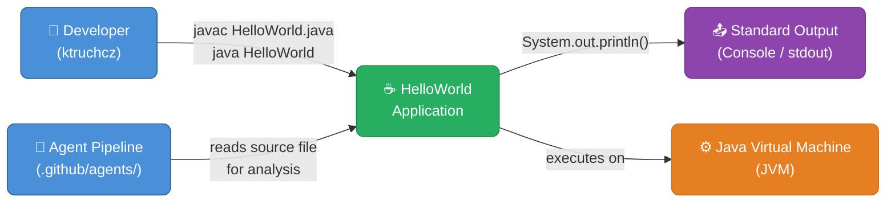

| Interface | Direction | Description |
|-----------|-----------|-------------|
| **Developer → Application** | Inbound | Developer invokes `javac` to compile and `java` to execute |
| **Agent Pipeline → Source** | Inbound (read-only) | Analysis agents read `HelloWorld.java` for code inspection |
| **Application → stdout** | Outbound | Writes the string `"Hello World\n"` to standard output |
| **Application ↔ JVM** | Bidirectional | The JVM loads, verifies, and executes the bytecode; provides `java.lang` runtime |

### 3.2 Technical Context

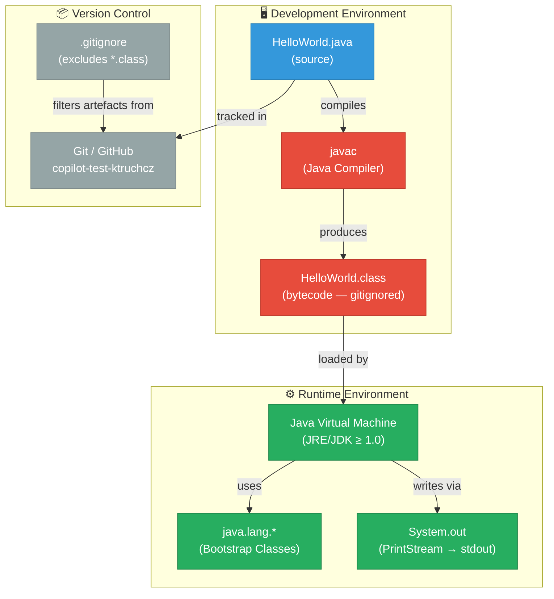

| Technical Channel | Protocol / Mechanism | Data |
|-------------------|---------------------|------|
| `javac HelloWorld.java` | OS process / POSIX exec | Java source text → JVM bytecode |
| `java HelloWorld` | OS process / POSIX exec | Bytecode execution trigger |
| `System.out.println()` | Java I/O stream → OS file descriptor 1 | UTF-8 string `"Hello World\n"` |
| Git push/pull | HTTPS / SSH | Source file versions |

---

## 4. Solution Strategy

> **Arc42 Purpose**: A short summary and explanation of the fundamental decisions and solution strategies that shape the system's architecture.

### 4.1 Technology Decisions

| Decision | Choice | Rationale |
|----------|--------|-----------|
| **Programming Language** | Java SE | Industry-standard, platform-independent, widely taught, required by repository context |
| **Runtime** | JVM (any version ≥ Java 1.0) | The code uses no APIs introduced after Java 1.0; maximum compatibility |
| **Build Tooling** | None (plain `javac`) | The project is a single file; a build tool would add unnecessary complexity |
| **Dependency Management** | None | Zero external dependencies; `java.lang` is provided by the JVM itself |
| **Output Mechanism** | `System.out.println()` | The standard, idiomatic Java way to write a line to standard output |
| **Source Organisation** | Single file, default (unnamed) package | Minimal-complexity; no package declaration needed for a standalone class |

### 4.2 Top-Level Decomposition Strategy

The architecture follows the **Single Responsibility Principle** at the macro level: the entire application performs exactly one responsibility — printing a greeting to stdout. There is no layering, no domain model, and no service boundary. This is intentional.

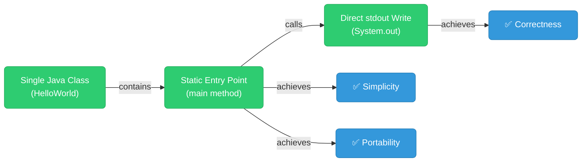

### 4.3 Approach to Quality Goals

| Quality Goal | Strategy |
|-------------|----------|
| **Correctness** | No branching logic, no conditional execution — the output is deterministic |
| **Simplicity** | Absolute minimum code: 5 lines, 1 class, 1 method, 1 statement |
| **Portability** | Relies solely on `java.lang.System` which is part of every JVM implementation |
| **Maintainability** | Any Java developer can understand the code in under 5 seconds |
| **Analysability** | Standard Java syntax; parseable by any AST tool, linter, or analysis agent |

---

## 5. Building Block View

> **Arc42 Purpose**: The static decomposition of the system into building blocks (modules, components, subsystems, classes, interfaces, packages, etc.) and their dependencies.

### 5.1 Level 1 — Whitebox: Overall System

At the highest level, the system consists of a single deployable unit: the `HelloWorld` class.

```mermaid
graph TB
    classDef system fill:#2C3E50,stroke:#1A252F,color:#fff,rx:8
    classDef class fill:#2980B9,stroke:#1F618D,color:#fff,rx:6
    classDef method fill:#27AE60,stroke:#1E8449,color:#fff,rx:4
    classDef dep fill:#7F8C8D,stroke:#5D6D7E,color:#fff,rx:4

    subgraph System["HelloWorld System"]
        HW["HelloWorld<br/>(public class)"]:::class
    end

    subgraph JDK["Java SE Runtime (provided)"]
        SYS["java.lang.System"]:::dep
        PS["java.io.PrintStream"]:::dep
        STR["java.lang.String"]:::dep
    end

    HW -->|"uses System.out"| SYS
    SYS -->|"out: PrintStream"| PS
    HW -->|"passes literal"| STR
```

**Contained Building Blocks:**

| Building Block | Type | Responsibility |
|----------------|------|----------------|
| `HelloWorld` | `public class` | Top-level container; application entry point |
| `main(String[])` | `public static void` method | JVM entry point; orchestrates all program logic |

**Important Interfaces:**

| Interface | Description |
|-----------|-------------|
| `java HelloWorld` (CLI) | External interface — invoked by OS/JVM to start the application |
| `System.out` (`PrintStream`) | Outbound channel — delivers output to the terminal |

---

### 5.2 Level 2 — Whitebox: HelloWorld Class

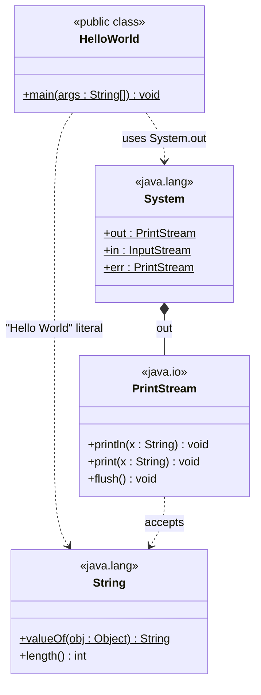

**Method Inventory:**

| Method | Signature | Visibility | Static | Description |
|--------|-----------|------------|--------|-------------|
| `main` | `main(String[] args) : void` | `public` | ✅ Yes | JVM entry point. Calls `System.out.println("Hello World")` and returns. |

**Control Flow inside `main`:**

```mermaid
flowchart TD
    classDef start fill:#27AE60,stroke:#1E8449,color:#fff,rx:20
    classDef step fill:#2980B9,stroke:#1F618D,color:#fff,rx:6
    classDef finish fill:#E74C3C,stroke:#C0392B,color:#fff,rx:20

    START(["▶ JVM calls main(String[])"]):::start
    PUSH["Load string literal<br/>\"Hello World\"<br/>onto operand stack"]:::step
    PRINTLN["Invoke PrintStream.println(String)<br/>via System.out"]:::step
    FLUSH["JVM flushes stdout<br/>on normal exit"]:::step
    END(["⏹ Method returns (void)<br/>JVM exits with code 0"]):::finish

    START --> PUSH --> PRINTLN --> FLUSH --> END
```

---

### 5.3 Level 3 — Bytecode Building Blocks

Although the source is a single statement, the compiled bytecode (as produced by `javac`) consists of the following logical instructions:

| Bytecode Instruction | Mnemonic | Description |
|---------------------|----------|-------------|
| `getstatic` | `System.out` | Push the static `PrintStream` reference onto the stack |
| `ldc` | `"Hello World"` | Load string constant from the constant pool |
| `invokevirtual` | `PrintStream.println` | Call `println(String)` on the `PrintStream` object |
| `return` | — | Return from `main`; JVM terminates with exit code 0 |

---

## 6. Runtime View

> **Arc42 Purpose**: The runtime view describes the behaviour and interaction of the system's building blocks in the form of scenarios covering important use cases or features.

### 6.1 Scenario 1 — Successful Execution (Happy Path)

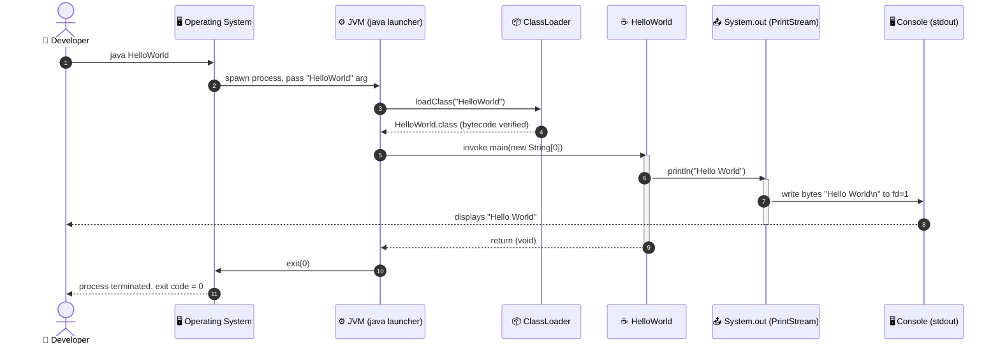

**Narrative:**
1. The developer issues `java HelloWorld` in a terminal.
2. The OS spawns a new JVM process.
3. The JVM bootstrap `ClassLoader` locates and loads `HelloWorld.class` from the current directory.
4. Bytecode verification succeeds (simple, no security concerns).
5. The JVM calls `HelloWorld.main(new String[0])`.
6. `main` pushes `"Hello World"` onto the operand stack and calls `System.out.println()`.
7. `PrintStream.println()` writes `"Hello World\n"` (UTF-8, platform line separator) to file descriptor 1.
8. The operating system delivers the bytes to the terminal emulator.
9. `main` returns; the JVM exits with status code `0` (success).

---

### 6.2 Scenario 2 — Compilation Phase

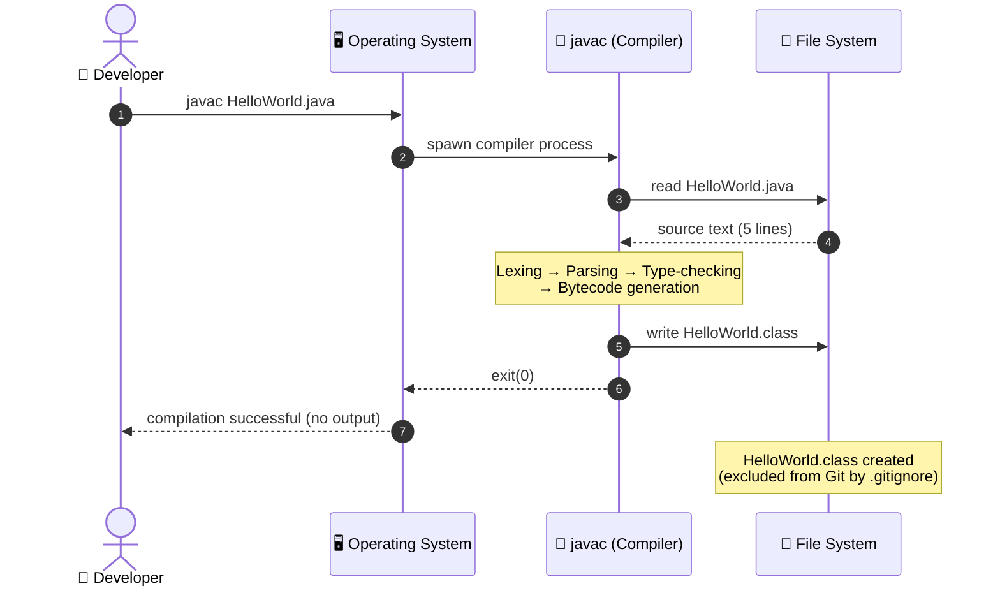

---

### 6.3 Scenario 3 — Error Case: Class Not Found

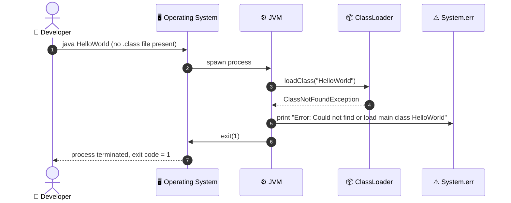

---

### 6.4 Runtime State Machine

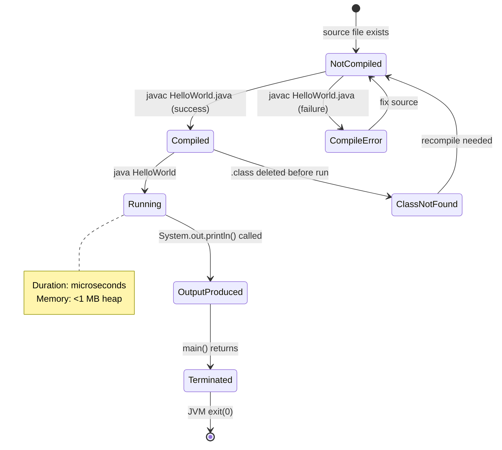

---

## 7. Deployment View

> **Arc42 Purpose**: Describes the technical infrastructure used to execute the system, and the mapping of building blocks to that infrastructure.

### 7.1 Infrastructure Overview

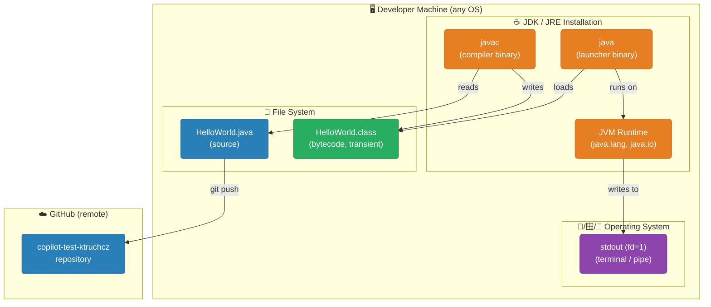

### 7.2 Deployment Topology

| Node | Type | Contents | Notes |
|------|------|----------|-------|
| **Developer Machine** | Physical / Virtual | JDK + source file | Any machine with JDK ≥ 1.0 installed |
| **Operating System** | Linux / macOS / Windows | File system, stdout | No OS-specific APIs used; fully portable |
| **JDK/JRE** | Software platform | `javac`, `java`, `java.lang.*` | Minimum: JDK 1.0; tested on any modern JDK |
| **GitHub** | SaaS / Cloud | Git repository | Source of truth for `HelloWorld.java` |

### 7.3 Deployment Steps

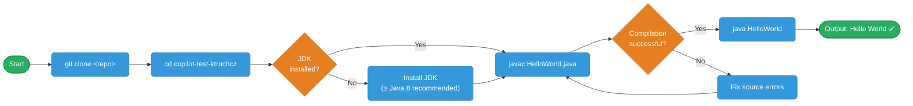

### 7.4 System Requirements

| Requirement | Minimum | Recommended |
|-------------|---------|-------------|
| **Java Version** | JDK 1.0 | JDK 17 LTS or 21 LTS |
| **Memory (heap)** | &lt; 1 MB | Default JVM settings |
| **Disk space** | &lt; 1 KB (source + class) | N/A |
| **Operating System** | Any POSIX / Windows with JVM | Linux, macOS, Windows 10+ |
| **Network** | Not required for execution | Required only for `git clone` |

---

## 8. Cross-cutting Concepts

> **Arc42 Purpose**: Describes overall, principal regulations and solution approaches that are relevant in multiple parts of the system — technical and non-technical cross-cutting concerns.

### 8.1 Domain Model

The HelloWorld application has a trivial domain model: a single action (greeting) with a single, fixed output.

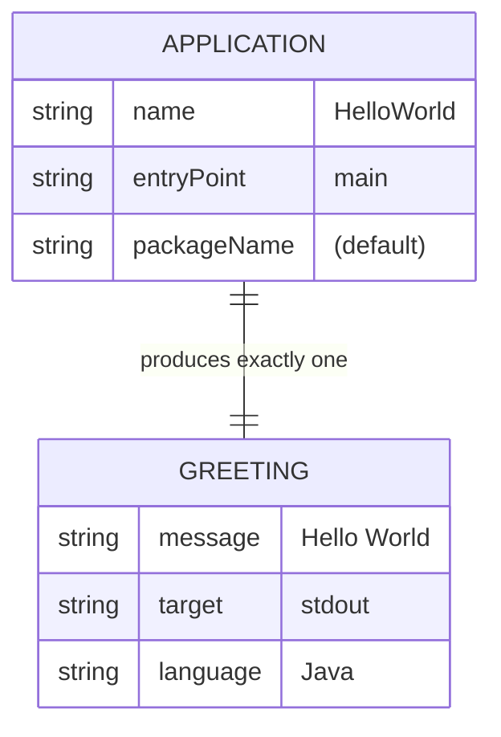

### 8.2 Design Patterns Identified

| Pattern | Where Applied | Description |
|---------|--------------|-------------|
| **Static Factory / Entry Point** | `main(String[])` | JVM-mandated static entry-point pattern — no instantiation required |
| **Null Object (implicit)** | `args` parameter | The `args` array is accepted but never used; functionally equivalent to ignoring input |
| **Template Method (JVM contract)** | `public static void main` | Follows the rigid JVM-defined template for application bootstrapping |

### 8.3 Logging and Observability

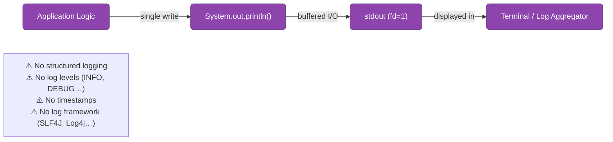

| Aspect | Current State | Recommendation |
|--------|--------------|----------------|
| **Output format** | Plain string, no metadata | Add log level prefix for non-trivial apps |
| **Log framework** | None (`System.out` only) | Use SLF4J + Logback for production systems |
| **Error output** | Not applicable | Use `System.err` for error messages |
| **Observability** | None | Not required at this scale |

### 8.4 Error Handling Strategy

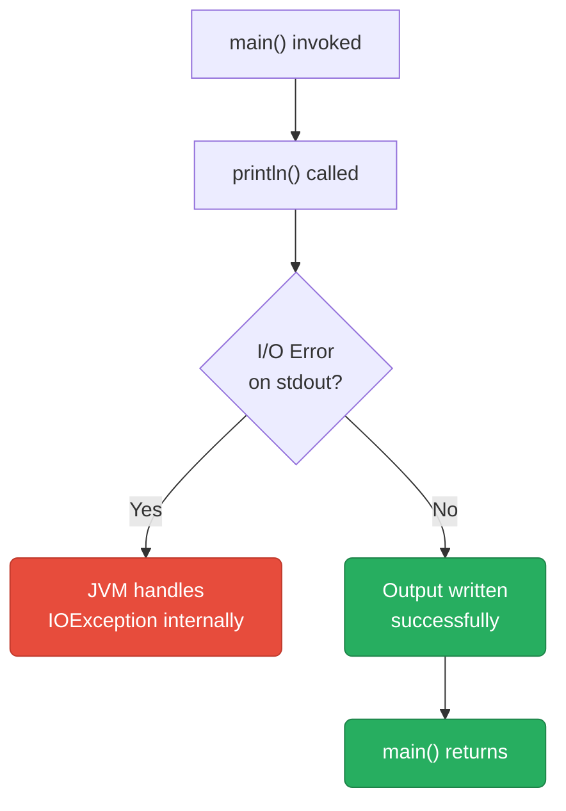

- The application contains **no explicit exception handling**.
- `System.out.println()` swallows `IOException` internally within `PrintStream` (sets an internal error flag accessible via `checkError()`).
- For a program of this scope, this is entirely acceptable.

### 8.5 Security Concepts

| Aspect | Assessment |
|--------|-----------|
| **Input validation** | No user input is processed; `args[]` is ignored |
| **Injection risks** | None — the output string is a compile-time constant |
| **Authentication / Authorisation** | Not applicable |
| **Sensitive data** | None present |
| **Attack surface** | Effectively zero for this application |

### 8.6 Internationalisation (i18n)

- The greeting string `"Hello World"` is **hardcoded in English** as a string literal.
- No `ResourceBundle`, `Locale`, or `MessageFormat` is used.
- For a production greeting application, externalising strings via `ResourceBundle` would be the standard Java approach.

---

## 9. Architecture Decisions

> **Arc42 Purpose**: Important, expensive, large-scale, or risky architecture decisions including their rationale. ADR (Architecture Decision Record) format.

---

### ADR-001: Use Plain Java SE Without a Build Tool

| Field | Value |
|-------|-------|
| **Status** | Accepted |
| **Date** | 2025-01-01 |
| **Deciders** | Repository owner |

**Context:**  
The application is a single Java source file with zero external dependencies. A build tool such as Maven or Gradle would add configuration files (100–1000 lines) that exceed the size of the application itself.

**Decision:**  
Compile and run using bare `javac` and `java` commands. No `pom.xml`, `build.gradle`, or `Makefile` will be added.

**Consequences:**
- ✅ Zero configuration overhead
- ✅ No dependency version management required
- ✅ Instantly runnable on any machine with a JDK
- ⚠️ No automated test execution (`mvn test` / `gradle test`)
- ⚠️ No packaging into a JAR artefact
- ⚠️ No CI/CD integration via standard build lifecycle

---

### ADR-002: Use `System.out.println()` for Output

| Field | Value |
|-------|-------|
| **Status** | Accepted |
| **Date** | 2025-01-01 |
| **Deciders** | Repository owner |

**Context:**  
The application must write a single line of text to the console. Available options include `System.out.println()`, `System.out.print()` + `\n`, `System.out.printf()`, or a logging framework.

**Decision:**  
Use `System.out.println("Hello World")` — the idiomatic, simplest Java construct for line-oriented console output.

**Consequences:**
- ✅ Most readable and recognisable by all Java developers
- ✅ Automatically appends the platform-appropriate line separator
- ✅ No additional imports required
- ⚠️ Not thread-safe in multi-threaded contexts (not relevant here)
- ⚠️ No log level, timestamp, or structured metadata

---

### ADR-003: Use Default (Unnamed) Package

| Field | Value |
|-------|-------|
| **Status** | Accepted |
| **Date** | 2025-01-01 |
| **Deciders** | Repository owner |

**Context:**  
Java classes can be placed in named packages (e.g., `com.example.hello`) or in the default unnamed package. Named packages are mandatory for library code but optional for standalone applications.

**Decision:**  
Place `HelloWorld` in the default package (no `package` declaration). This simplifies execution: `java HelloWorld` rather than `java com.example.hello.HelloWorld`.

**Consequences:**
- ✅ Simpler execution command
- ✅ No directory structure required
- ⚠️ Classes in the default package cannot be imported by classes in named packages (not applicable here)
- ⚠️ Not suitable for library or reusable code

---

### ADR-004: Exclude Compiled Artefacts from Version Control

| Field | Value |
|-------|-------|
| **Status** | Accepted |
| **Date** | 2025-01-01 |
| **Deciders** | Repository owner |

**Context:**  
Java compilation produces `.class` bytecode files. These are binary derived artefacts that can be reproduced from source at any time.

**Decision:**  
Add `*.class` to `.gitignore`. Only source files are version-controlled.

**Consequences:**
- ✅ Keeps repository clean; no binary blobs in Git history
- ✅ Eliminates merge conflicts on compiled artefacts
- ✅ Forces reproducible builds from source
- ⚠️ Recipients must compile before running (no pre-built artefact provided)

---

## 10. Quality Requirements

> **Arc42 Purpose**: Contains all quality requirements as a quality tree with scenarios — the concrete quality requirements that provide the architects measurable criteria to evaluate the architecture.

### 10.1 Quality Tree

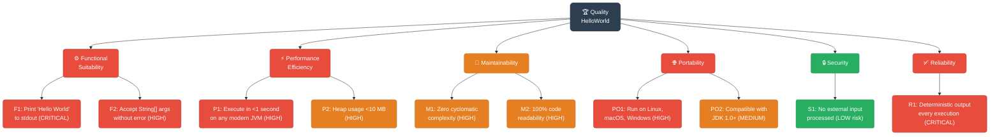

### 10.2 Quality Scenarios

| ID | Quality Attribute | Scenario | Stimulus | Response | Measurable Criterion |
|----|------------------|----------|----------|----------|---------------------|
| QS-01 | **Correctness** | Developer runs the compiled application | `java HelloWorld` executed | `Hello World` printed to stdout, exit code 0 | Output equals `"Hello World\n"` exactly |
| QS-02 | **Performance** | Application starts up and completes | JVM launches `HelloWorld` | Execution completes | Total wall-clock time &lt; 1 second on any JDK 8+ |
| QS-03 | **Portability** | Application run on a different OS | Same `.class` file on Windows/macOS/Linux | Output identical on all platforms | `Hello World` on all three OS families |
| QS-04 | **Maintainability** | New developer reads the code | Opens `HelloWorld.java` | Understands the full program logic | Time to understand &lt; 30 seconds |
| QS-05 | **Reliability** | Application run 1000 consecutive times | Looped execution | Consistent output every time | 100% identical output across all runs |
| QS-06 | **Analysability** | Analysis agent reads source | Agent parses `HelloWorld.java` | AST constructed successfully | Zero parse errors; all 12 agents complete |

### 10.3 Code Metrics (Static Analysis)

| Metric | Value | Assessment |
|--------|-------|------------|
| **Lines of Code (LoC)** | 5 | ✅ Minimal |
| **Number of Classes** | 1 | ✅ Single responsibility |
| **Number of Methods** | 1 | ✅ Single entry point |
| **Cyclomatic Complexity** | 1 (minimum possible) | ✅ No branching |
| **Cognitive Complexity** | 0 | ✅ No nested constructs |
| **External Dependencies** | 0 | ✅ Self-contained |
| **Test Coverage** | 0% | ⚠️ No tests exist |
| **Javadoc Coverage** | 0% | ⚠️ No documentation comments |
| **Coupling (CBO)** | 1 (`java.lang.System`) | ✅ Minimal coupling |
| **Depth of Inheritance (DIT)** | 1 (implicit `Object`) | ✅ Flat hierarchy |

---

## 11. Risks and Technical Debt

> **Arc42 Purpose**: A list of identified technical risks or technical debt, along with suggested measures to minimise, mitigate, or avoid each risk.

### 11.1 Risk Register

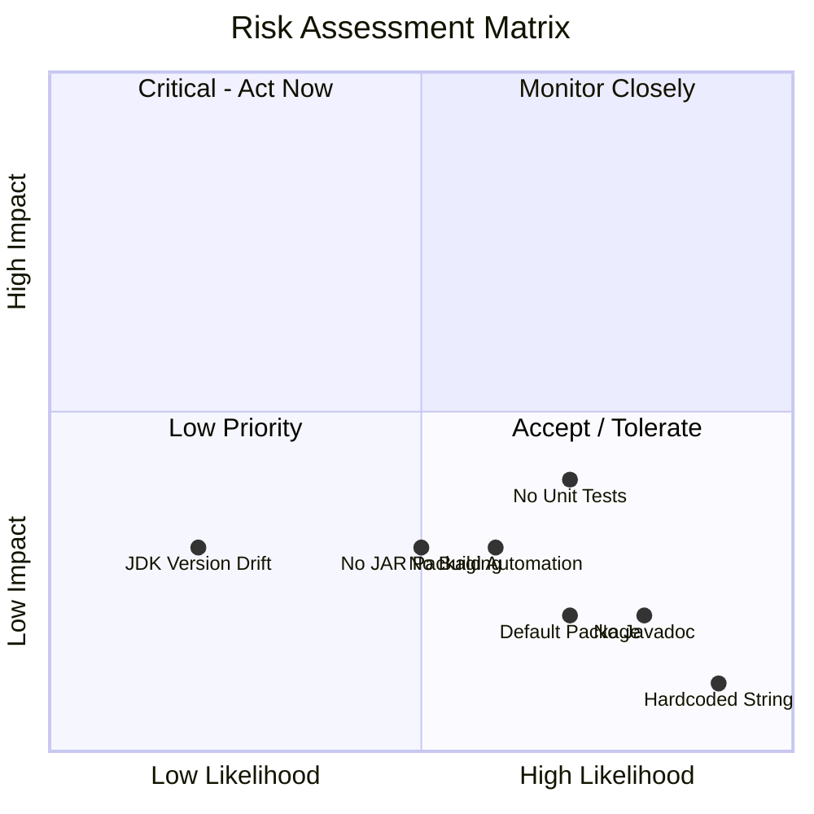

| ID | Risk | Category | Likelihood | Impact | Severity | Mitigation |
|----|------|----------|------------|--------|----------|------------|
| R-01 | **No unit tests** | Quality | High | Medium | 🟡 Medium | Add JUnit 5 test class; assert `System.out` output |
| R-02 | **No build automation** | Operations | Medium | Medium | 🟡 Medium | Add `pom.xml` (Maven) or `build.gradle` (Gradle) |
| R-03 | **Hardcoded greeting string** | Maintainability | High | Low | 🟢 Low | Externalise to a `messages.properties` resource file |
| R-04 | **No JAR packaging** | Distribution | Medium | Low | 🟢 Low | Add Maven/Gradle build to produce an executable JAR |
| R-05 | **No Javadoc** | Documentation | High | Low | 🟢 Low | Add `/** */` Javadoc to class and `main` method |
| R-06 | **Default package usage** | Maintainability | High | Low | 🟢 Low | Move to named package (e.g., `com.example.hello`) if code grows |
| R-07 | **No CI/CD pipeline** | Operations | Medium | Low | 🟢 Low | Add GitHub Actions workflow to compile and test on push |
| R-08 | **JDK version not pinned** | Reproducibility | Low | Medium | 🟢 Low | Specify minimum JDK version in README or toolchain config |

### 11.2 Technical Debt Summary

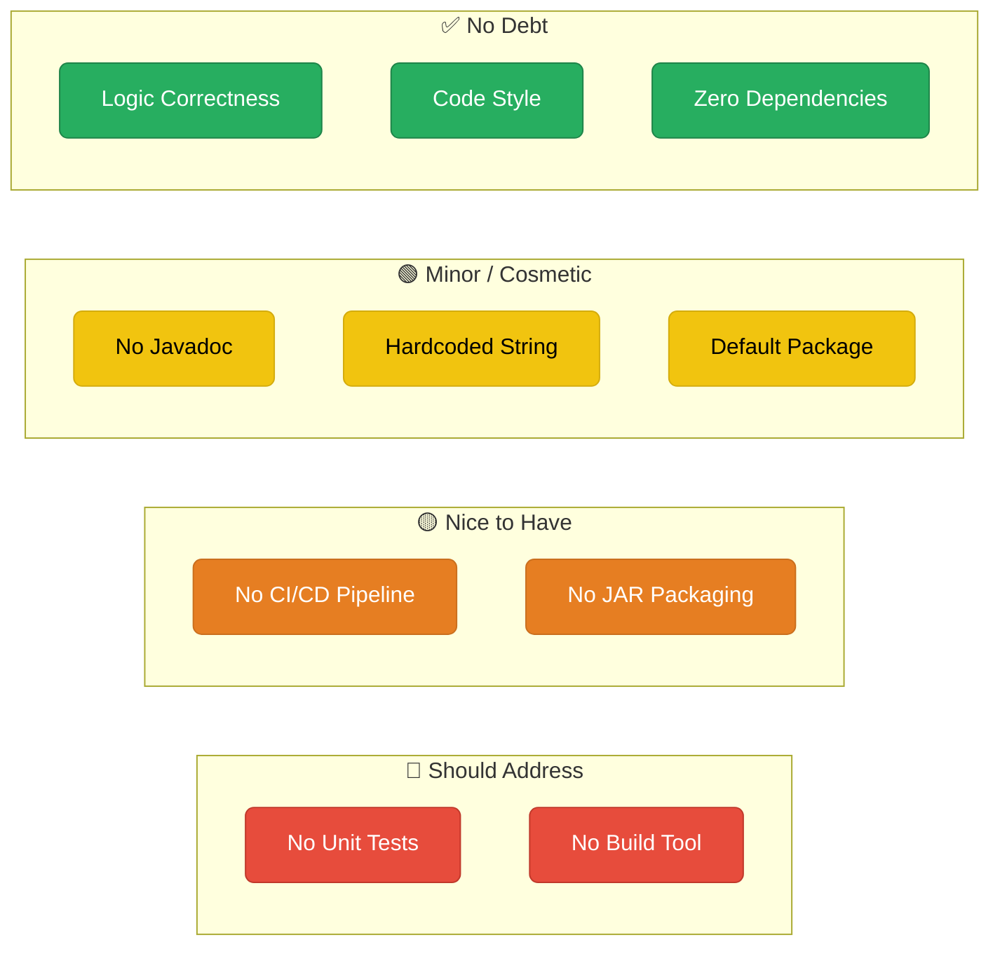

### 11.3 Recommended Improvement Backlog

| Priority | Item | Effort | Value |
|----------|------|--------|-------|
| 🔴 High | Add JUnit 5 unit test (`HelloWorldTest.java`) | 30 min | High — establishes test baseline |
| 🔴 High | Add `pom.xml` or `build.gradle` | 15 min | High — enables `mvn test`, JAR generation, CI |
| 🟡 Medium | Add GitHub Actions CI workflow | 30 min | Medium — automated build on every push |
| 🟡 Medium | Package into executable JAR | 10 min | Medium — easier distribution |
| 🟢 Low | Add Javadoc to class and method | 10 min | Low — improves `javadoc` output |
| 🟢 Low | Move to named package | 5 min | Low — better practice for growing codebases |
| 🟢 Low | Externalise greeting to `messages.properties` | 15 min | Low — enables i18n |

---

## 12. Glossary

> **Arc42 Purpose**: The most important domain and technical terms that stakeholders use when discussing the system — with a consistent definition to avoid misunderstandings.

### 12.1 Domain Terms

| Term | Definition |
|------|-----------|
| **Hello World** | A traditional introductory program that outputs the text "Hello World" to demonstrate the basic syntax and execution of a programming language. First popularised by Kernighan & Ritchie in "The C Programming Language" (1978). |
| **Greeting** | The sole business action of this application — producing the string `"Hello World"` on standard output. |
| **Standard Output (stdout)** | The default output stream of a process, typically connected to the terminal. In Java, represented by `System.out`. |

### 12.2 Technical Terms

| Term | Definition |
|------|-----------|
| **Java SE** | Java Standard Edition — the core Java platform providing fundamental libraries (`java.lang`, `java.io`, etc.) without enterprise extensions. |
| **JVM** | Java Virtual Machine — the runtime engine that executes Java bytecode. Provides platform independence via the "write once, run anywhere" abstraction. |
| **JDK** | Java Development Kit — the full development package including `javac` (compiler), `java` (launcher), and the JRE. |
| **JRE** | Java Runtime Environment — the subset of the JDK needed to *run* (but not compile) Java applications. |
| **`javac`** | The Java compiler. Translates `.java` source files into `.class` bytecode files. |
| **Bytecode** | Platform-independent binary instruction format produced by `javac` and executed by the JVM. Stored in `.class` files. |
| **`main` method** | The mandatory entry point for a standalone Java application, with signature `public static void main(String[] args)`. |
| **`System.out`** | A static `PrintStream` field on `java.lang.System`, pre-connected to the process's standard output (fd=1). |
| **`println()`** | A method on `PrintStream` that writes a string followed by a platform-specific newline to the output stream. |
| **`.gitignore`** | A Git configuration file listing filename patterns that Git should not track. Used here to exclude `*.class` files. |
| **Arc42** | A practical, lightweight template for software architecture documentation, structured into 12 sections. Created by Gernot Starke and Peter Hruschka. |
| **Cyclomatic Complexity** | A software metric measuring the number of linearly independent paths through a method. `HelloWorld.main()` has a value of 1 (the minimum). |
| **ADR** | Architecture Decision Record — a short document capturing a single architectural decision, its context, and its consequences. |
| **AST** | Abstract Syntax Tree — a tree representation of the source code structure, produced by a parser and used by analysis agents. |
| **BPMN** | Business Process Model and Notation — a graphical standard for modelling business processes. Used by the `bpmn-generator` agent. |
| **UML** | Unified Modelling Language — a standardised visual language for software design. Used by the `uml-generator` agent. |
| **CBO** | Coupling Between Objects — a metric measuring how many other classes a given class depends on. |
| **DIT** | Depth of Inheritance Tree — a metric measuring how many levels of inheritance a class is from the root (`Object`). |

### 12.3 Acronyms

| Acronym | Expansion |
|---------|-----------|
| JVM | Java Virtual Machine |
| JDK | Java Development Kit |
| JRE | Java Runtime Environment |
| SE | Standard Edition |
| LoC | Lines of Code |
| CI/CD | Continuous Integration / Continuous Delivery |
| fd | File Descriptor |
| ADR | Architecture Decision Record |
| AST | Abstract Syntax Tree |
| BPMN | Business Process Model and Notation |
| UML | Unified Modelling Language |
| CBO | Coupling Between Objects |
| DIT | Depth of Inheritance Tree |
| SRP | Single Responsibility Principle |
| i18n | Internationalisation |

---

## Appendix: Source Code Reference

### HelloWorld.java (complete)

```java
public class HelloWorld {
    public static void main(String[] args) {
        System.out.println("Hello World");
    }
}
```

### .gitignore (complete)

```gitignore
*.class
```

---

*Documentation generated by the **Arc42 Documentation Generator** agent.*  
*Repository: `copilot-test-ktruchcz` | Source analysed: `HelloWorld.java` (5 LoC) | Sections: 12 | Diagrams: 14*
