# Architecture Documentation (Arc42)

**Project**: copilot-test-ktruchcz — Hello World  
**Version**: 1.1.0  
**Date**: 2026-03-29  
**Generated by**: Arc42 Documentation Generator (arc42-documentor agent, improved pass)

---

## Table of Contents

1. [Introduction and Goals](#1-introduction-and-goals)
2. [Architecture Constraints](#2-architecture-constraints)
3. [System Scope and Context](#3-system-scope-and-context)
4. [Solution Strategy](#4-solution-strategy)
5. [Building Block View](#5-building-block-view)
6. [Runtime View](#6-runtime-view)
7. [Deployment View](#7-deployment-view)
8. [Cross-cutting Concepts](#8-cross-cutting-concepts)
9. [Architecture Decisions](#9-architecture-decisions)
10. [Quality Requirements](#10-quality-requirements)
11. [Risks and Technical Debts](#11-risks-and-technical-debts)
12. [Glossary](#12-glossary)

---

## 1. Introduction and Goals

### 1.1 Requirements Overview

`copilot-test-ktruchcz` is a minimal Java console application whose sole purpose is to print the text **"Hello World"** to the standard output stream when executed. It serves as a canonical starting point for verifying that a Java development and runtime environment is correctly configured, and as a baseline repository for AI-assisted tooling experiments (e.g., GitHub Copilot code analysis, documentation generation, and automated architecture review).

The repository deliberately stays at the absolute minimum viable size so that tooling pipelines — static analysis, UML generation, business rule extraction, BPMN modelling, Arc42 documentation — can be exercised in a fully controlled, noise-free environment where every output artefact can be verified by hand.

**Core functional requirements:**

| ID  | Requirement | Priority |
|-----|-------------|----------|
| FR-01 | The system SHALL print the string `Hello World` followed by a newline to stdout when invoked. | Must-have |
| FR-02 | The system SHALL exit with OS exit code `0` upon successful completion. | Must-have |
| FR-03 | The system SHALL accept (and silently ignore) any command-line arguments without altering output. | Should-have |

### 1.2 Quality Goals

The following top-level quality goals drive the architectural decisions of this system:

| Priority | Quality Goal | Motivation |
|----------|-------------|------------|
| 1 | **Simplicity** | The application must be understandable at a glance — a single class, a single method, a single executable statement. |
| 2 | **Portability** | The application must run on any platform with a compatible JRE, with zero platform-specific code. |
| 3 | **Reproducibility** | Given the same JDK version, every build and run must produce identical, byte-for-byte output. |
| 4 | **Minimal Footprint** | No external libraries, no build scripts, no configuration files beyond the single source file. |
| 5 | **Analysability** | The source must be trivially parseable by automated tools (AST analysers, static checkers, AI agents) to serve as a known-good baseline. |

### 1.3 Stakeholders

| Role | Name / Group | Expectations |
|------|-------------|--------------|
| Developer / Owner | `ktruchcz` (repository owner) | A working Java environment baseline; a sandbox for GitHub Copilot experiments and AI tooling evaluation. |
| AI Tooling Pipeline | GitHub Copilot / Arc42 agent suite | A valid, compilable Java source file to analyse, document, and generate artefacts from (UML, BPMN, ADRs, Arc42). |
| Technical Reviewer | Any architect or developer auditing the tooling output | A clear, self-explanatory minimal Java program whose architecture is fully documentable. |
| CI System | GitHub Actions runners | A project that can be compiled and run in a vanilla JDK environment with no additional dependencies. |

---

## 2. Architecture Constraints

### 2.1 Technical Constraints

| ID | Constraint | Rationale |
|----|-----------|-----------|
| TC-01 | **Language: Java** | The source file is written in Java (`HelloWorld.java`). All tooling must support Java source analysis. |
| TC-02 | **No build tool** | There is no `pom.xml`, `build.gradle`, or `Makefile`. Compilation relies on the `javac` command directly. |
| TC-03 | **No external dependencies** | Only classes from `java.lang` (auto-imported) are used. No third-party JARs are required. |
| TC-04 | **JDK ≥ 1.0** | `System.out.println` and a static `main` entry point have been valid since Java 1.0. The application places no lower bound above that. In practice, any JDK from 8 onward is the realistic minimum for CI environments. |
| TC-05 | **Single source file** | The entire application resides in one file: `HelloWorld.java`. No packages, no modules (`module-info.java`), no multi-file compilation units. |
| TC-06 | **Console / CLI only** | No GUI, no web interface, no network socket — output is exclusively to `stdout`. |
| TC-07 | **No module system** | The project predates (and ignores) the Java Platform Module System (JPMS, introduced in Java 9). It operates on the unnamed module / default classpath. |

### 2.2 Organizational Constraints

| ID | Constraint | Rationale |
|----|-----------|-----------|
| OC-01 | **Public GitHub repository** | Code is version-controlled on GitHub (`github.com/ktruchcz/copilot-test-ktruchcz`) and is publicly visible. |
| OC-02 | **No test suite** | No unit or integration tests exist in the repository. This is intentional for the baseline tooling-test purpose. |
| OC-03 | **No CI pipeline defined** | No `.github/workflows` directory is present; builds are manual. Adding one is tracked as technical debt (TD-03). |
| OC-04 | **AI tooling baseline** | The repository exists partly to validate AI-assisted documentation and analysis tooling; its minimal content is a deliberate design choice, not a gap. |

### 2.3 Conventions

| Convention | Details |
|-----------|---------|
| Naming | Class name `HelloWorld` matches file name `HelloWorld.java` (required by Java specification for public top-level classes). |
| Encoding | UTF-8 source encoding (default for modern JDKs). All characters in the source are 7-bit ASCII, making encoding irrelevant in practice. |
| Entry point | Standard Java entry point signature: `public static void main(String[] args)`. |
| Indentation | 4-space indentation (idiomatic Java style). |
| No package | The class belongs to the default (unnamed) package — acceptable for single-file demonstration programs. |

---

## 3. System Scope and Context

### 3.1 Business Context

The Hello World application sits entirely within the boundary of a single JVM process. It receives no external input and produces a single line of text on the standard output. The diagram below shows the system boundary and its interactions with the external environment.

### 3.2 Technical Context

The following diagram shows the technical infrastructure context — the toolchain required to compile and execute the application.

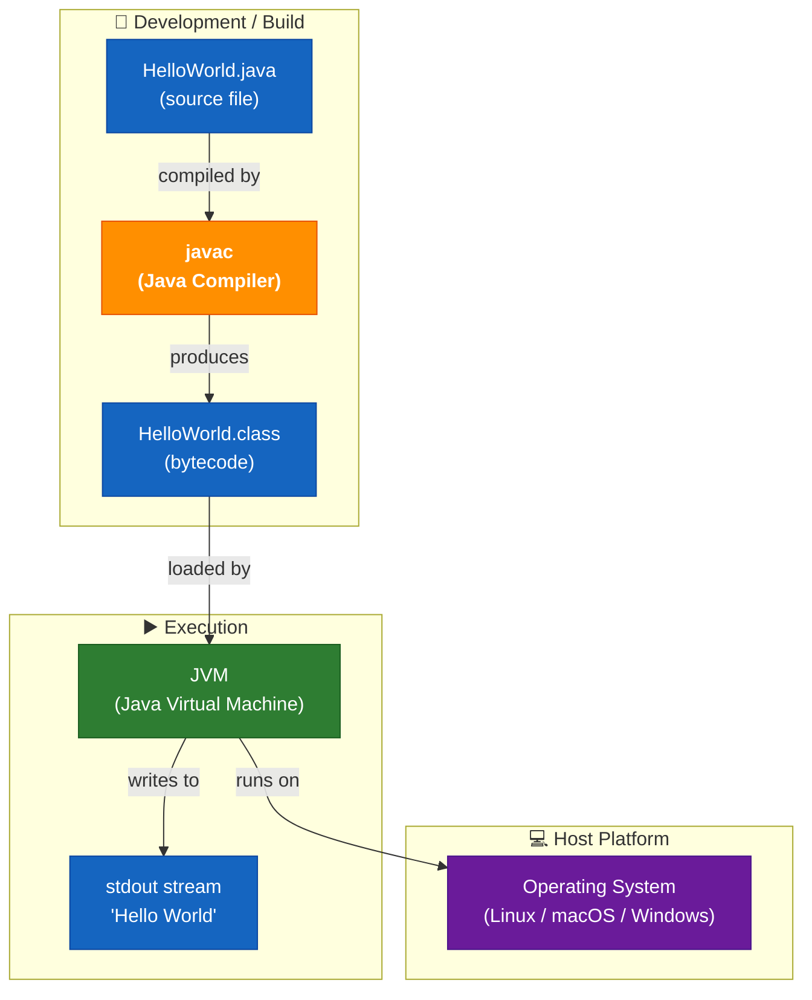

### 3.3 External Interfaces

| Interface | Direction | Protocol / Mechanism | Description |
|-----------|-----------|----------------------|-------------|
| CLI invocation | Input | OS process spawn (`java HelloWorld`) | Starts the JVM and passes control to `main()`. |
| Standard Output | Output | `java.io.PrintStream` (`System.out`) | Delivers the string `Hello World\n` to the calling terminal. |
| Exit code | Output | OS process exit code (`0`) | Implicit successful termination after `main()` returns. |

---

## 4. Solution Strategy

### 4.1 Technology Decisions

| Decision | Choice | Rationale |
|---------|--------|-----------|
| **Programming Language** | Java | Widely known, platform-independent via JVM, requires zero runtime setup beyond a standard JRE. Java is the predominant language in the enterprise context in which this tooling is evaluated. |
| **No framework** | Plain `java.lang` only | The requirement is trivially fulfilled by a single `println` call; any framework (Spring, Micronaut, Quarkus…) would be disproportionate overhead and would obscure the structure for tooling analysis. |
| **No build tool** | Raw `javac` | Eliminates all dependency management, wrapper scripts, and configuration files for a single-file project. If complexity grows, Maven or Gradle should be introduced (see ADR-002). |
| **No dependencies** | Zero external JARs | `System.out.println` is part of the Java standard library, available on every conforming JRE. Zero dependencies also means zero supply-chain risk. |
| **Default (unnamed) package** | No `package` declaration | Appropriate for a single-class demonstration program. Avoids directory structure requirements (`src/main/java/…`) that would add noise for tooling agents. |

### 4.2 Top-Level Decomposition Strategy

The application deliberately adopts a **single-class, single-method** architecture:

- **One class** (`HelloWorld`) — collocates all logic in one compilation unit; no sub-packages, no interfaces, no inheritance hierarchy.
- **One method** (`main`) — the JVM entry point; no helper methods, no constructors beyond the implicit default, no static initialisers.
- **One statement** (`System.out.println(...)`) — directly satisfies FR-01 with the minimum possible code path.

This is the theoretical minimum for a valid, executable Java program that produces observable output.

### 4.3 Approach to Quality Goals

| Quality Goal | Strategy |
|-------------|---------|
| Simplicity | Absolute minimum code — 5 lines total including braces; 1 line of executable logic. |
| Portability | Rely only on `java.lang`, which is guaranteed on every JRE since version 1.0. |
| Reproducibility | No mutable state, no I/O sources, no randomness, no date/time dependency → fully deterministic output on every invocation. |
| Minimal Footprint | No configuration, no dependencies, no generated files committed to version control. |
| Analysability | A single class with a single method is the ideal AST complexity floor for calibrating and validating analysis tooling. |

---

## 5. Building Block View

### 5.1 Level 1 — System Whitebox

The entire system is a single deployable unit: one compiled Java class.

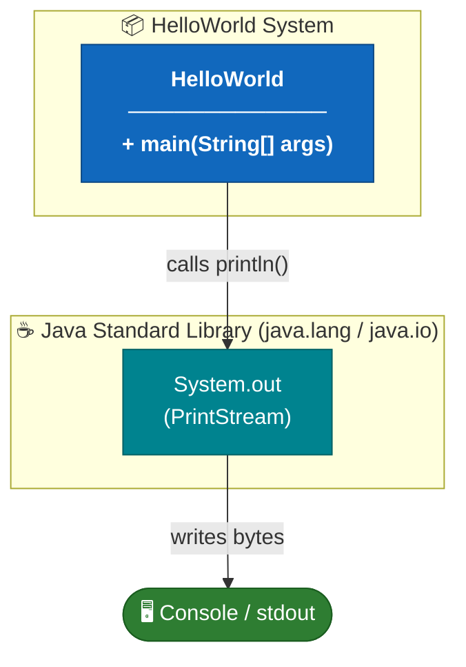

**Contained Building Blocks:**

| Block | Responsibility | Source |
|-------|---------------|--------|
| `HelloWorld` | Application entry point; orchestrates the single output operation. | `HelloWorld.java` |
| `System.out` *(external)* | JDK-provided `PrintStream`; handles byte encoding and OS-level write. | `java.lang.System` (JDK) |

### 5.2 Level 2 — HelloWorld Class Whitebox

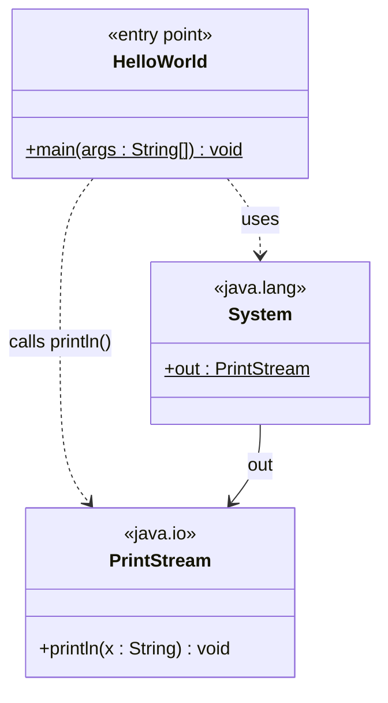

**Method inventory:**

| Class | Method | Modifier | Description |
|-------|--------|----------|-------------|
| `HelloWorld` | `main(String[] args)` | `public static` | JVM entry point. Calls `System.out.println("Hello World")` and returns, causing the JVM to exit with code 0. |

### 5.3 Level 3 — Statement-Level Detail

---

## 6. Runtime View

### 6.1 Scenario 1 — Normal Execution

The primary (and only) runtime scenario: a user invokes the application from the command line.

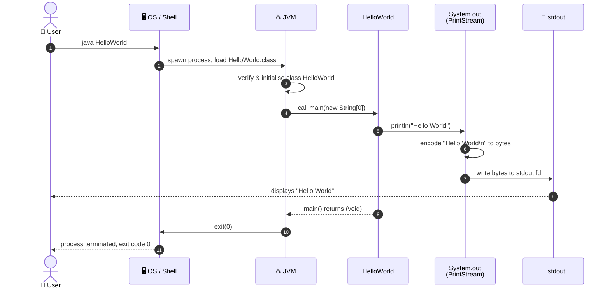

### 6.2 Scenario 2 — Execution with Command-Line Arguments

The `main` method accepts `String[] args`, but the current implementation ignores them entirely. Passing arguments has no effect on the output.

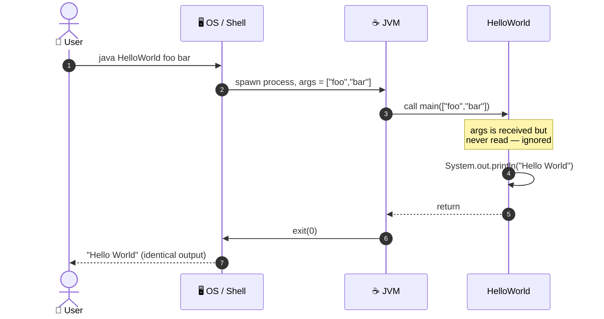

### 6.3 Scenario 3 — Class Not Found (Error Path)

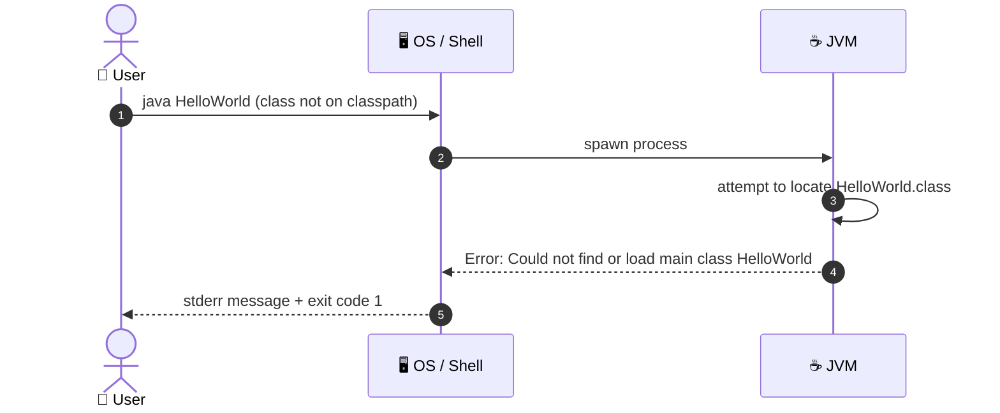

### 6.4 State Machine — Application Lifecycle

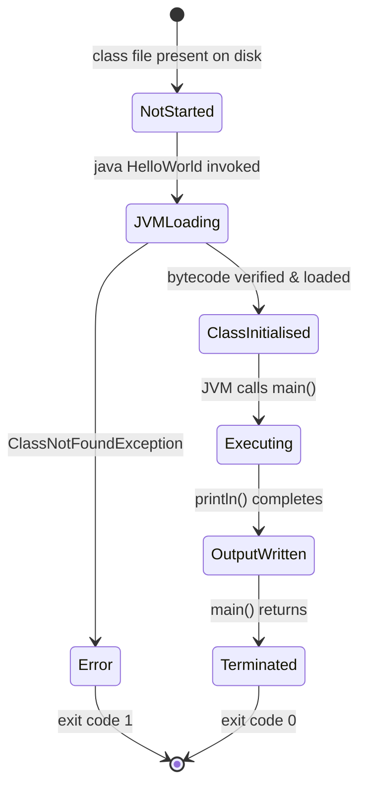

---

## 7. Deployment View

### 7.1 Infrastructure Overview

Because the application is a single compiled class with zero external dependencies, the deployment topology is the simplest possible: a host machine with a JRE installed.

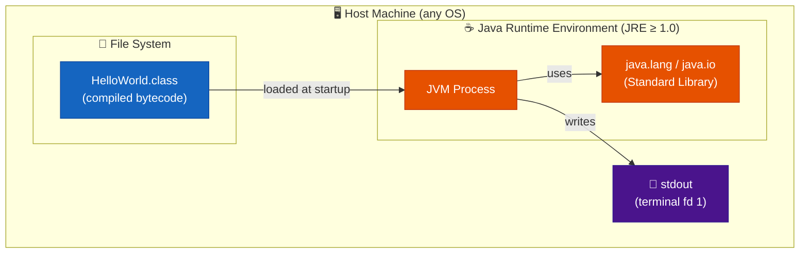

### 7.2 Compilation Step

Before deployment/execution, the source must be compiled. There is no pre-built artifact committed to the repository.

### 7.3 Deployment Variants

| Variant | Description | Command Sequence |
|---------|-------------|-----------------|
| **Local (developer)** | Compile and run on developer workstation. | `javac HelloWorld.java` → `java HelloWorld` |
| **CI runner** | Any GitHub Actions runner with `actions/setup-java`. | Same two commands inside a workflow step. |
| **Docker container** | Any image based on `openjdk` or `eclipse-temurin`. | `COPY HelloWorld.java /app/` → `RUN javac HelloWorld.java` → `CMD ["java","HelloWorld"]` |

### 7.4 Minimum System Requirements

| Requirement | Value |
|------------|-------|
| Java Runtime | JRE 1.0 or later (JDK required to compile) |
| Disk space (source) | < 1 KB |
| Disk space (bytecode) | < 1 KB |
| RAM | ≥ JVM base overhead (~10–30 MB) |
| CPU | Any architecture with a compatible JVM |
| Network | None |
| Database | None |

---

## 8. Cross-cutting Concepts

### 8.1 Domain Model

The application's domain is deliberately trivial. The conceptual model contains a single entity.

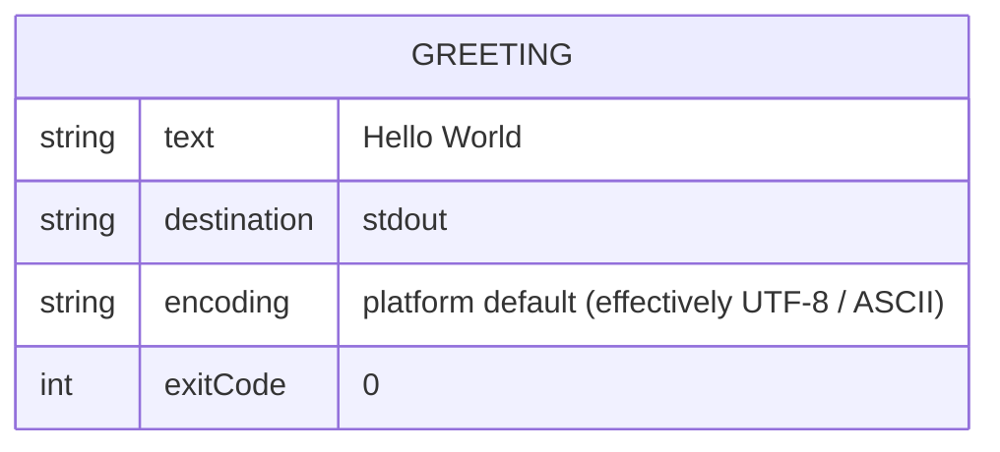

### 8.2 Output / Logging Concept

| Aspect | Decision |
|--------|---------|
| **Output channel** | `System.out` (`stdout`, file descriptor 1) |
| **Output format** | Plain text, terminated by the platform line separator (`\n` on Unix/macOS, `\r\n` on Windows via `println`). |
| **Logging framework** | None — no SLF4J, Log4j, Logback, or `java.util.logging` is used. |
| **Structured logging** | Not applicable. |
| **Log levels** | Not applicable. |
| **stderr** | Not used; no diagnostic, warning, or error messages are emitted under normal operation. |

### 8.3 Error Handling Concept

| Error Type | Handling Strategy |
|-----------|-----------------|
| `ClassNotFoundException` | Raised by the JVM before `main()` is entered; not catchable inside the application. JVM prints to stderr and exits with code 1. |
| `IOException` on stdout | Silently swallowed by `PrintStream` (it sets an internal error flag, accessible via `checkError()`); no exception propagates to application code. |
| Unexpected `args` content | Ignored — `args` is declared but never read or validated. |
| `OutOfMemoryError` / JVM crash | Handled entirely by the JVM; the application has no try/catch blocks. |

The absence of explicit error handling is intentional and appropriate: the single statement cannot fail in any domain-meaningful way given the constraints of the system.

### 8.4 Internationalisation (i18n)

The output string `"Hello World"` is a compile-time constant encoded entirely in 7-bit ASCII. There is no internationalisation or localisation mechanism. The string is not externalised to a resource bundle (`ResourceBundle`, `.properties` file). All characters are in the Basic Latin Unicode block (U+0048–U+006C range), making encoding irrelevant in practice.

If localisation were ever required, the recommended approach would be to introduce `java.util.ResourceBundle` and a `messages.properties` file.

### 8.5 Security Concept

| Threat Vector | Exposure | Notes |
|--------------|---------|-------|
| Code injection | **None** | No user input is read or evaluated at any point. |
| File system access | **None** | No file I/O beyond the inherited stdout stream. |
| Network exposure | **None** | No sockets, HTTP clients, or network calls of any kind. |
| Dependency vulnerabilities (CVEs) | **None** | Zero third-party dependencies; no transitive supply-chain risk. |
| Classpath manipulation | **Theoretical** | An attacker controlling the classpath could substitute a malicious `HelloWorld.class`. Mitigation: distribute the `.class` file with a checksum. |

Overall security posture: **minimal attack surface** — the application is essentially inert from a security perspective.

### 8.6 Design Patterns Applied

| Pattern | Location | Description |
|---------|---------|-------------|
| **Entry Point** | `HelloWorld.main()` | Standard Java application entry point pattern — `public static void main(String[] args)`. Universally recognised by the JVM launcher and all Java-aware tooling. |
| **Static Factory (degenerate)** | `System.out` | `System.out` is a pre-initialised static field acting as a singleton I/O facade — a JDK-provided instance of the Factory + Singleton patterns. |

No additional design patterns (GoF structural, behavioural, or creational; enterprise integration patterns; etc.) are applicable at this scale.

### 8.7 Observability

| Aspect | Status |
|--------|--------|
| Metrics | None (no Micrometer, Prometheus, JMX) |
| Distributed tracing | Not applicable |
| Health checks | Not applicable |
| Structured output | None — single unstructured plain-text line |

The only observable signal of successful execution is the presence of the string `Hello World\n` on stdout and exit code `0`.

---

## 9. Architecture Decisions

### ADR-001 — Use Java as the Implementation Language

| Field | Value |
|-------|-------|
| **Status** | Accepted |
| **Date** | Project inception |
| **Context** | A minimal demonstration program is needed. |
| **Decision** | Implement in Java. |
| **Rationale** | Java is a widely adopted, platform-independent language. The JVM provides write-once-run-anywhere portability. Standard tooling (`javac`, `java`) is freely available on all major platforms. |
| **Consequences** | Requires a JRE on every target machine. Produces `.class` bytecode rather than a native binary. |
| **Alternatives considered** | Python (no compilation step needed), C (native binary, no JVM dependency). Both rejected in favour of Java's ubiquity in enterprise contexts. |

---

### ADR-002 — No Build Tool (Raw javac)

| Field | Value |
|-------|-------|
| **Status** | Accepted |
| **Date** | Project inception |
| **Context** | Single-file project with no dependencies. |
| **Decision** | Compile directly with `javac`; do not introduce Maven, Gradle, or Ant. |
| **Rationale** | A build tool would add configuration overhead (e.g., `pom.xml`, `build.gradle`) with zero benefit for a single-class, zero-dependency project. |
| **Consequences** | Classpath management, dependency resolution, and packaging must be done manually if the project ever grows. |
| **Alternatives considered** | Maven (standard but heavyweight for this scale), Gradle (flexible but adds wrapper scripts). |

---

### ADR-003 — No External Dependencies

| Field | Value |
|-------|-------|
| **Status** | Accepted |
| **Date** | Project inception |
| **Context** | Output requirement is a single `println` call. |
| **Decision** | Use only `java.lang.System` and `java.io.PrintStream` from the JDK standard library. |
| **Rationale** | Zero external dependencies means zero supply-chain risk, zero version conflicts, and zero download requirements. |
| **Consequences** | If requirements expand (e.g., structured logging, HTTP output), dependencies will need to be introduced along with a build tool. |

---

### ADR-004 — No Unit Tests

| Field | Value |
|-------|-------|
| **Status** | Accepted (with awareness of risk) |
| **Date** | Project inception |
| **Context** | The sole observable behaviour is a single `println` statement. |
| **Decision** | No test framework (JUnit, TestNG) is included. |
| **Rationale** | Testing `System.out.println("Hello World")` would require stdout capture infrastructure whose complexity far exceeds the code under test. The risk of incorrect output is negligible. |
| **Consequences** | No automated regression safety. Any future expansion of the codebase should introduce tests at that point. |

---

### ADR-005 — Repository as AI Tooling Baseline

| Field | Value |
|-------|-------|
| **Status** | Accepted |
| **Date** | 2026-03-29 |
| **Context** | The repository is used to evaluate and calibrate GitHub Copilot and an Arc42 documentation generation pipeline. A project with zero noise (no frameworks, no dependencies, trivial logic) allows every tooling output to be fully verified by hand. |
| **Decision** | Keep the repository at the absolute minimum size — one source file, one README — and resist adding complexity unless required by a new functional goal. |
| **Rationale** | Any added complexity would make it harder to distinguish tooling artefacts (UML, BPMN, ADRs, architecture diagrams) that are correct versus those that are hallucinated or misinterpreted by AI agents. |
| **Consequences** | The project will appear artificially simple to human reviewers unfamiliar with the tooling-baseline purpose. This is accepted. |
| **Alternatives considered** | Using a more realistic sample application — rejected because it would make ground-truth verification of AI outputs time-consuming. |

---

## 10. Quality Requirements

### 10.1 Quality Tree

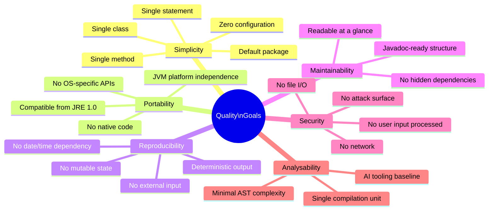

### 10.2 Quality Scenarios

| ID | Quality Attribute | Scenario | Expected Response | Metric |
|----|------------------|---------|-------------------|--------|
| QS-01 | **Correctness** | User runs `java HelloWorld` on a correctly configured JVM | Exactly `Hello World\n` is written to stdout; exit code is `0` | 100% byte-exact match every run |
| QS-02 | **Portability** | Application is run on Linux, macOS, and Windows with JRE ≥ 8 | Identical string output on all platforms (line ending may differ per OS `println` behaviour) | Pass on all 3 OS families |
| QS-03 | **Performance** | User runs the application on any modern machine | Output appears in < 500 ms wall-clock (dominated by JVM startup, not application logic) | ≤ 500 ms |
| QS-04 | **Reproducibility** | Application is run 1,000 times consecutively | Every invocation produces identical stdout; exit code always 0 | 0 deviations in 1,000 runs |
| QS-05 | **Understandability** | A Java developer reads `HelloWorld.java` for the first time | Developer fully understands all behaviour without external documentation | ≤ 30 seconds comprehension time |
| QS-06 | **Analysability** | An AI code analysis pipeline processes `HelloWorld.java` | All generated artefacts (UML, BPMN, ADRs, Arc42 sections) are accurate and verifiable by hand | 100% verifiable outputs |

### 10.3 Code Metrics

| Metric | Value | Notes |
|--------|-------|-------|
| Lines of Code (total, incl. braces) | 5 | Smallest meaningful Java program |
| Lines of Code (executable logic) | 1 | The single `println` call |
| Number of classes | 1 | `HelloWorld` |
| Number of methods | 1 | `main(String[])` |
| Number of statements | 1 | `System.out.println("Hello World")` |
| Cyclomatic complexity | 1 | No branches, no loops, no conditionals |
| Cognitive complexity | 1 | Zero nesting, zero flow control |
| External dependencies | 0 | Only `java.lang` (auto-imported by JVM) |
| Test coverage | 0% | No test suite present |
| Technical debt (estimated) | < 1 hour | See TD backlog in Section 11 |
| Halstead volume | ~10 bits | Practically the minimum for any executable program |

---

## 11. Risks and Technical Debts

### 11.1 Risk Register

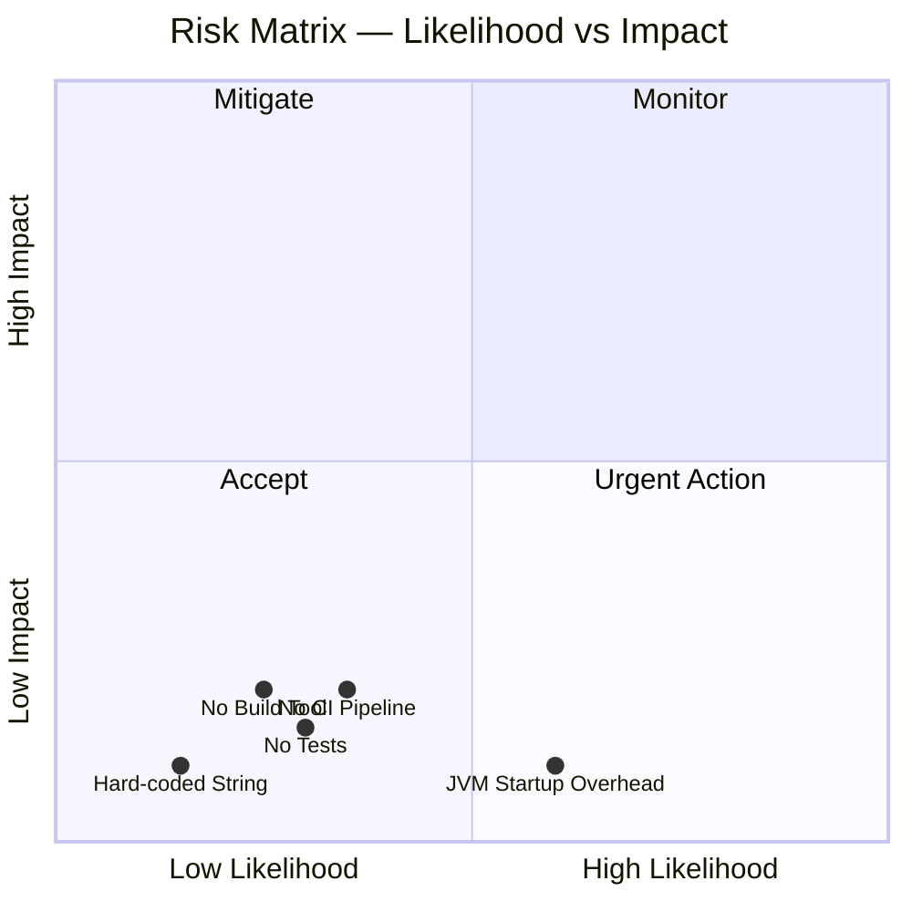

### 11.2 Identified Risks

| ID | Risk | Likelihood | Impact | Category | Mitigation |
|----|------|-----------|--------|---------|-----------|
| R-01 | **No automated tests** — Regressions cannot be detected automatically if the code is modified. | Low | Low | Quality | Add a JUnit 5 test capturing stdout if the project evolves beyond a single statement. |
| R-02 | **No build automation** — Compilation must be done manually; easy to forget or misconfigure in a CI context. | Medium | Low | Operations | Introduce Maven or Gradle when the project grows beyond a single file. |
| R-03 | **No CI/CD pipeline** — Code changes are not automatically verified after commit. | Medium | Low | Process | Add a GitHub Actions workflow (`build.yml`) with `javac` and `java` steps. |
| R-04 | **Hard-coded output string** — The string `"Hello World"` is baked into the source; cannot be changed without recompilation. | Low | Low | Maintainability | Externalise to a `private static final String MESSAGE` constant or a `messages.properties` resource bundle if parameterisation is needed. |
| R-05 | **JVM startup latency** — Cold JVM startup adds 50–300 ms overhead (varies by JVM version and host). | High | Negligible | Performance | Acceptable for a demonstration program; use GraalVM native-image if sub-millisecond startup is ever required. |
| R-06 | **AI tooling drift** — As AI models are updated, generated artefacts (this document, UML, BPMN) may silently change, making baseline comparisons invalid. | Medium | Low | Tooling | Pin AI model versions; regenerate artefacts on a scheduled basis and diff the outputs. |

### 11.3 Technical Debt Backlog

| ID | Debt Item | Effort | Priority |
|----|----------|--------|---------|
| TD-01 | Add unit test (JUnit 5) with stdout capture using `System.setOut()` | 30 min | Low |
| TD-02 | Introduce `pom.xml` or `build.gradle` for reproducible, dependency-managed builds | 15 min | Low |
| TD-03 | Create `.github/workflows/build.yml` CI pipeline with compile + run step | 20 min | Medium |
| TD-04 | Add `/** Javadoc */` comment to `main()` describing behaviour, inputs, and exit codes | 5 min | Low |
| TD-05 | Externalise `"Hello World"` to a named constant (`private static final String MESSAGE`) | 5 min | Low |
| TD-06 | Add `package` declaration and move to `src/main/java` standard directory layout | 10 min | Low |

### 11.4 Technical Debt Visualisation

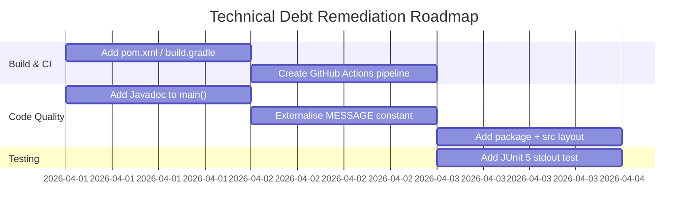

---

## 12. Glossary

| Term | Definition |
|------|-----------|
| **Arc42** | A pragmatic, lightweight template for software architecture documentation, structured into 12 sections. See [arc42.org](https://arc42.org). |
| **AST** | Abstract Syntax Tree — a tree representation of the syntactic structure of source code, used by compilers and static analysis tools. |
| **Bytecode** | Platform-independent binary instructions compiled from Java source code and stored in `.class` files. Executed by the JVM. |
| **Classpath** | A parameter that tells the JVM where to search for compiled `.class` files and JAR archives at runtime. |
| **CLI** | Command-Line Interface — a text-based interface where users interact by typing commands in a terminal or shell. |
| **Cognitive Complexity** | A code metric measuring how difficult code is to understand, penalising nesting and non-linear flow more heavily than cyclomatic complexity. |
| **Cyclomatic Complexity** | A software metric that counts the number of linearly independent paths through a program. A value of 1 means a single, straight-line execution path. |
| **Default package** | In Java, a class with no `package` declaration belongs to the unnamed (default) package. Suitable for simple single-file programs. |
| **Entry Point** | In Java, the method `public static void main(String[] args)` that the JVM calls to start a program. |
| **Exit Code** | An integer returned by a process to the operating system upon termination. `0` conventionally means success; non-zero values indicate errors. |
| **GraalVM** | A high-performance JDK distribution that can compile Java ahead-of-time into native binaries, eliminating JVM startup overhead. |
| **HelloWorld** | The canonical minimal program in any programming language that demonstrates a working environment by printing "Hello World". |
| **JAR** | Java ARchive — a ZIP-format package containing compiled `.class` files and resources for distribution. |
| **Java** | A general-purpose, object-oriented, class-based programming language designed for platform independence via the JVM. First released in 1995. |
| **javac** | The Java compiler included in the JDK. Translates `.java` source files into `.class` bytecode files. |
| **JDK** | Java Development Kit — a superset of the JRE that includes development tools such as `javac`, `javadoc`, and `jar`. |
| **JPMS** | Java Platform Module System — introduced in Java 9 (`module-info.java`). Not used by this project. |
| **JRE** | Java Runtime Environment — the minimum software package required to run compiled Java applications; includes the JVM and standard libraries. |
| **JUnit** | The de-facto standard unit testing framework for Java. Version 5 (JUnit Jupiter) is the current generation. |
| **JVM** | Java Virtual Machine — the runtime engine that loads, verifies, and executes Java bytecode. Provides platform independence. |
| **`java.lang`** | The core Java package, automatically imported in every Java program. Contains fundamental classes such as `String`, `System`, `Object`, and `Math`. |
| **`java.io.PrintStream`** | A Java standard library class that adds convenient print methods on top of an `OutputStream`. `System.out` is a static instance of this class. |
| **`println`** | Short for "print line" — a method on `PrintStream` that writes a string followed by the platform-specific line separator to the output stream. |
| **stdout** | Standard Output — file descriptor 1 in Unix-like systems. The default destination for normal program output, typically the terminal. |
| **`System.out`** | A static field of type `PrintStream` in `java.lang.System`, connected to the standard output stream of the process. |
| **Technical Debt** | The implied cost of rework caused by choosing an easy or expedient solution now instead of a better approach that would take longer. |

---

*Documentation generated by the Arc42 Documentation Generator (arc42-documentor agent).*  
*Based on source analysis of `HelloWorld.java` and `README.md` in repository `copilot-test-ktruchcz`.*  
*Version 1.1.0 — Updated 2026-03-29.*

<3
