# Architecture Documentation (Arc42)

**Project**: copilot-test-ktruchcz  
**Version**: 1.0.0  
**Date**: 2025-01-01  
**Generated by**: Arc42 Documentation Generator  
**Source Repository**: `/home/runner/work/copilot-test-ktruchcz/copilot-test-ktruchcz`

---

## Table of Contents

1. [Introduction and Goals](#1-introduction-and-goals)
2. [Architecture Constraints](#2-architecture-constraints)
3. [System Scope and Context](#3-system-scope-and-context)
4. [Solution Strategy](#4-solution-strategy)
5. [Building Block View](#5-building-block-view)
6. [Runtime View](#6-runtime-view)
7. [Deployment View](#7-deployment-view)
8. [Crosscutting Concepts](#8-crosscutting-concepts)
9. [Architecture Decisions](#9-architecture-decisions)
10. [Quality Requirements](#10-quality-requirements)
11. [Risks and Technical Debt](#11-risks-and-technical-debt)
12. [Glossary](#12-glossary)

---

## 1. Introduction and Goals

### 1.1 Requirements Overview

**copilot-test-ktruchcz** is a minimal Java application whose sole purpose is to print the string `"Hello World"` to the standard output stream (`stdout`). It serves as a baseline project for tooling validation, CI/CD pipeline smoke-tests, and onboarding exercises within the GitHub Copilot experimentation context (as implied by the repository name prefix `copilot-test-`).

| ID | Requirement | Priority |
|----|-------------|----------|
| REQ-01 | The system SHALL print the text `"Hello World"` to stdout when executed. | High |
| REQ-02 | The system SHALL terminate with exit code `0` on successful execution. | High |
| REQ-03 | The system SHALL require no user input or runtime configuration. | Medium |
| REQ-04 | The system SHALL be executable on any JVM-compatible environment. | Medium |

### 1.2 Quality Goals

The top quality goals for this architecture, ordered by priority:

| Priority | Quality Goal | Motivation |
|----------|-------------|------------|
| 1 | **Simplicity** | The system has a single responsibility. All complexity is unnecessary overhead. |
| 2 | **Portability** | Must run on any standard JVM (Java 8+) without environment-specific configuration. |
| 3 | **Reliability** | Must produce deterministic output (`"Hello World"`) on every execution. |
| 4 | **Maintainability** | Code should remain readable and modifiable with minimal effort. |

### 1.3 Stakeholders

| Role | Name / Group | Expectations |
|------|-------------|--------------|
| Developer / Owner | `ktruchcz` (inferred from repo name) | Working Hello World application for Copilot testing |
| CI/CD Pipeline | GitHub Actions (`.github/` directory present) | Green build, predictable output for pipeline validation |
| Tooling / Copilot Agent | GitHub Copilot | Analyzable codebase for AI-assisted development demos |

---

## 2. Architecture Constraints

### 2.1 Technical Constraints

| ID | Constraint | Background / Rationale |
|----|-----------|------------------------|
| TC-01 | **Language: Java** | The application is written in Java (`HelloWorld.java`). No alternative language is in scope. |
| TC-02 | **JVM Runtime Required** | Execution requires a Java Virtual Machine (JRE/JDK, minimum Java 8). |
| TC-03 | **No Build Tool Defined** | No `pom.xml`, `build.gradle`, or `Makefile` is present. Compilation is performed manually via `javac`. |
| TC-04 | **No External Dependencies** | The application uses only `java.lang` (implicitly imported), the most fundamental Java package. |
| TC-05 | **Single Source File** | The entire application resides in a single file: `HelloWorld.java`. |
| TC-06 | **No Configuration Files** | No application properties, YAML, or environment variable handling exists. |

### 2.2 Organizational Constraints

| ID | Constraint | Background / Rationale |
|----|-----------|------------------------|
| OC-01 | **GitHub-hosted Repository** | The project is hosted on GitHub under the `copilot-test-ktruchcz` repository. |
| OC-02 | **GitHub Actions CI** | A `.github/` directory is present, indicating automated workflows are configured or planned. |
| OC-03 | **Minimal Documentation Policy** | The README contains only the project name, suggesting documentation is intentionally lightweight. |

### 2.3 Conventions

| Convention | Description |
|-----------|-------------|
| Java Naming | Class name `HelloWorld` follows UpperCamelCase (PascalCase) Java convention. |
| Entry Point | Standard Java entry point signature: `public static void main(String[] args)`. |
| Output Method | Uses `System.out.println()` — standard Java console output idiom. |

---

## 3. System Scope and Context

### 3.1 Business Context

The system operates as a standalone command-line application. It has no inbound data flows (no user input, no network calls, no file reads) and a single outbound data flow: writing `"Hello World\n"` to the standard output stream.

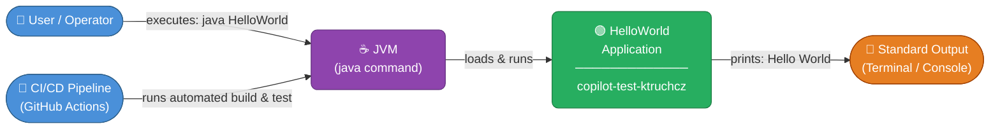

**External Interfaces:**

| Interface | Direction | Protocol / Technology | Description |
|-----------|-----------|----------------------|-------------|
| JVM Invocation | Inbound | OS Process (`java` command) | Triggers program execution |
| Standard Output (`stdout`) | Outbound | POSIX stream / Java `PrintStream` | Carries the `"Hello World"` message |
| CI Pipeline | Inbound | GitHub Actions runner | Automated compilation and execution |

### 3.2 Technical Context

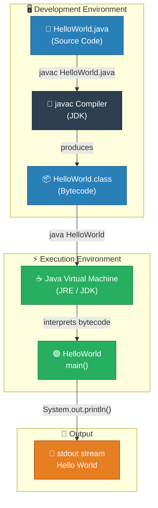

---

## 4. Solution Strategy

### 4.1 Technology Decisions

| Decision | Choice | Rationale |
|----------|--------|-----------|
| **Programming Language** | Java | Standard, portable, JVM-based language appropriate for the task |
| **Output Mechanism** | `System.out.println()` | Idiomatic Java standard output; no library dependencies required |
| **Entry Point Pattern** | `public static void main(String[] args)` | Standard JVM entry point; universally recognized |
| **Build Approach** | Manual `javac` compilation | No build tool overhead for a single-class project |
| **Architecture Style** | Monolithic single-class | Simplest possible structure matching the minimal requirements |

### 4.2 Top-Level Decomposition

The system is decomposed into a single logical unit — one Java class with one method. No further decomposition is warranted given the scope.

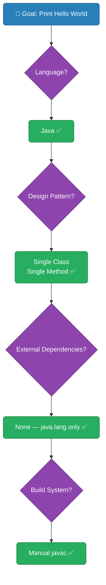

### 4.3 Approaches to Achieve Quality Goals

| Quality Goal | Approach |
|-------------|----------|
| **Simplicity** | Single class, single method, zero dependencies, ≤5 lines of code |
| **Portability** | Pure `java.lang` usage; compiles and runs on any JDK 8+ environment |
| **Reliability** | Hardcoded string constant; no I/O errors possible, no external state |
| **Maintainability** | Self-documenting code; no configuration needed; trivially understandable |

---

## 5. Building Block View

### 5.1 Level 1 — Whitebox: Overall System

The entire system is composed of a single building block.

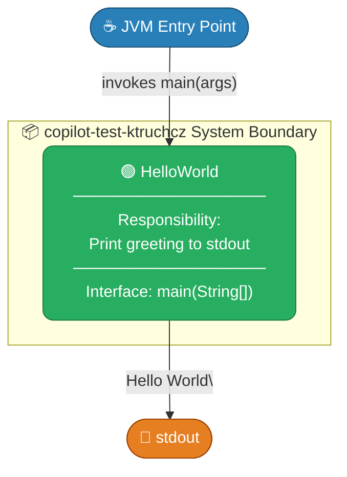

**Contained Building Blocks:**

| Block | Responsibility |
|-------|---------------|
| `HelloWorld` | The sole application class. Receives JVM invocation, writes greeting to `stdout`, exits. |

### 5.2 Level 2 — Whitebox: HelloWorld Class

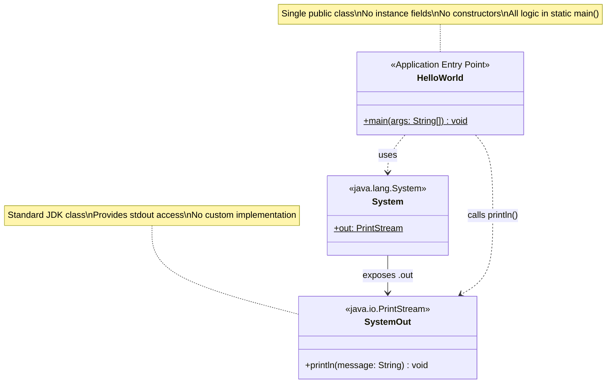

**Method Decomposition of `HelloWorld`:**

| Method | Visibility | Type | Parameters | Return | Description |
|--------|-----------|------|-----------|--------|-------------|
| `main` | `public` | `static` | `String[] args` | `void` | JVM entry point; prints `"Hello World"` and returns |

**Internal Execution Steps of `main()`:**

| Step | Operation | Detail |
|------|-----------|--------|
| 1 | Resolve `System.out` | JVM resolves the static `out` field on `java.lang.System` |
| 2 | Invoke `println` | Calls `println("Hello World")` on the `PrintStream` |
| 3 | Flush & write | `PrintStream` writes `"Hello World\n"` to file descriptor 1 (stdout) |
| 4 | Return | Method returns; JVM exits with code `0` |

### 5.3 Level 3 — Source File Structure


---

## 6. Runtime View

### 6.1 Scenario 1 — Normal Execution (Happy Path)

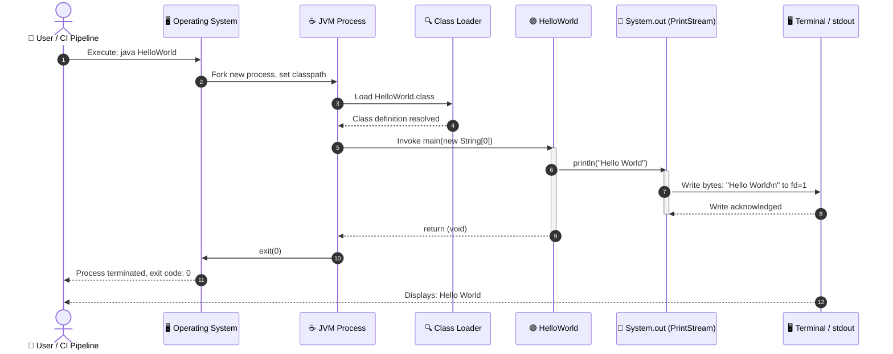

### 6.2 Scenario 2 — CI/CD Pipeline Execution

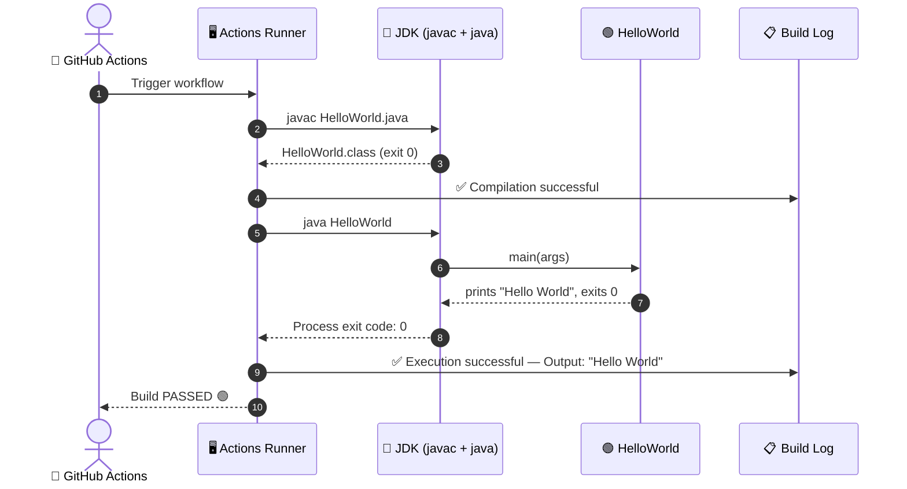

### 6.3 Execution Flow (Internal Logic)

```mermaid
flowchart TD
    classDef start fill:#27AE60,stroke:#1A7A40,color:#fff,rx:20
    classDef process fill:#2980B9,stroke:#1A5276,color:#fff,rx:6
    classDef decision fill:#E67E22,stroke:#A04000,color:#fff,rx:6
    classDef end_node fill:#C0392B,stroke:#922B21,color:#fff,rx:20

    START(["▶️ JVM starts main()"]):::start
    RESOLVE["Resolve System.out<br/>PrintStream reference"]:::process
    CALL["Call println(&#34;Hello World&#34;)"]:::process
    BUFFER["PrintStream buffers<br/>the string + newline"]:::process
    FLUSH["Flush buffer to<br/>stdout file descriptor"]:::process
    WRITE["OS writes bytes to<br/>connected terminal/pipe"]:::process
    RETURN["main() returns void"]:::process
    EXIT(["⏹️ JVM exit(0)"]):::end_node

    START --> RESOLVE --> CALL --> BUFFER --> FLUSH --> WRITE --> RETURN --> EXIT
```

---

## 7. Deployment View

### 7.1 Infrastructure Overview

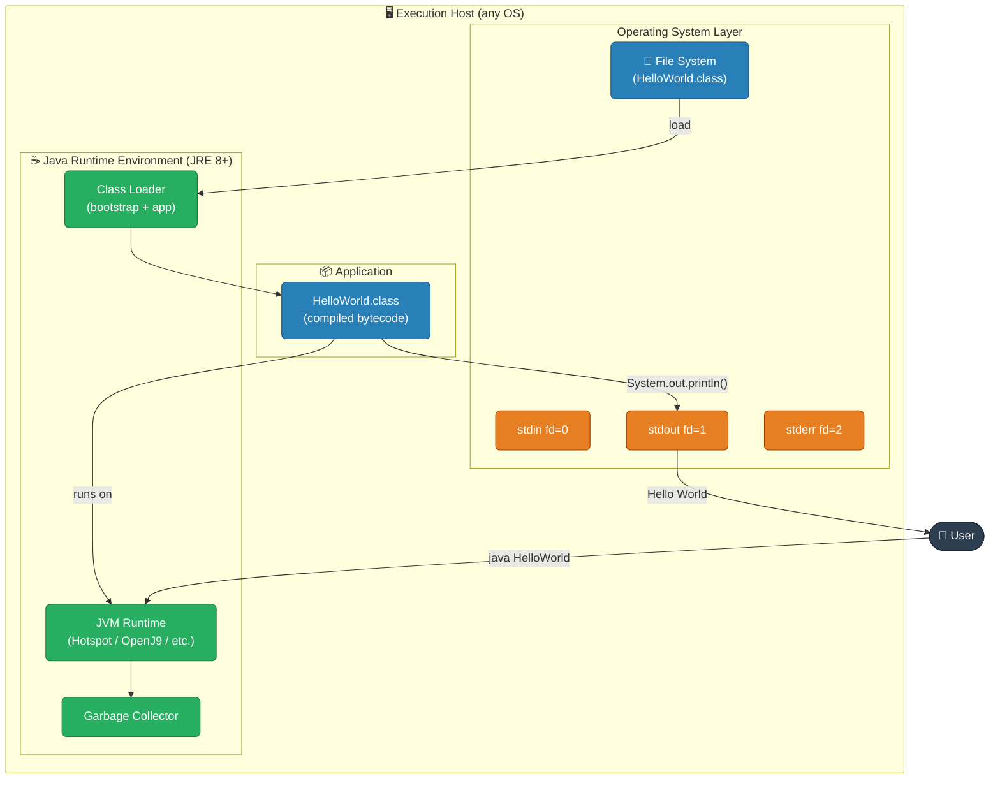

### 7.2 Deployment Steps


### 7.3 Supported Deployment Targets

| Environment | Compatible | Notes |
|------------|-----------|-------|
| Local Developer Machine (Linux) | ✅ | Requires JDK 8+ |
| Local Developer Machine (macOS) | ✅ | Requires JDK 8+ |
| Local Developer Machine (Windows) | ✅ | Requires JDK 8+, use `javac`/`java` from PATH |
| GitHub Actions Runner | ✅ | JDK pre-installed on `ubuntu-latest` runners |
| Docker Container (openjdk image) | ✅ | `docker run openjdk java HelloWorld` |
| Cloud VM (AWS EC2, GCP, Azure) | ✅ | Install JRE, copy `.class` file, execute |

---

## 8. Crosscutting Concepts

### 8.1 Domain Model

```mermaid
erDiagram
    APPLICATION {
        string name "copilot-test-ktruchcz"
        string language "Java"
        string version "1.0.0"
    }

    SOURCE_FILE {
        string filename "HelloWorld.java"
        int lines 5
        string encoding "UTF-8"
    }

    COMPILED_ARTIFACT {
        string filename "HelloWorld.class"
        string format "JVM Bytecode"
        int javaVersion 8
    }

    CLASS {
        string name "HelloWorld"
        string visibility "public"
        boolean hasMainMethod true
    }

    METHOD {
        string name "main"
        string visibility "public"
        boolean isStatic true
        string returnType "void"
        string parameter "String[] args"
    }

    OUTPUT {
        string content "Hello World"
        string stream "stdout"
        string terminator "newline (LF)"
    }

    APPLICATION ||--|| SOURCE_FILE : "contains"
    SOURCE_FILE ||--|| COMPILED_ARTIFACT : "compiles to"
    SOURCE_FILE ||--|| CLASS : "defines"
    CLASS ||--|| METHOD : "contains entry point"
    METHOD ||--|| OUTPUT : "produces"
```

### 8.2 Design Patterns

| Pattern | Applied Where | Description |
|---------|--------------|-------------|
| **Static Entry Point** | `main(String[] args)` | Standard JVM bootstrap pattern; no object instantiation required |
| **Hardcoded Constant** | `"Hello World"` string literal | Value is invariant; no configuration or injection needed |
| **Void Command** | `main()` returns `void` | Fire-and-forget; result communicated through side effect (stdout write) |

### 8.3 Architecture Patterns

| Pattern | Applicability |
|---------|--------------|
| **Procedural / Imperative** | The application executes a single sequential statement with no branching, loops, or state |
| **Command-Line Application (CLI)** | Invoked via OS shell/CI; result observed through process exit code and stdout |
| **Single Responsibility Principle** | The class has exactly one responsibility: printing the greeting |

### 8.4 Logging and Observability

| Aspect | Current State | Recommendation |
|--------|-------------|----------------|
| Logging Framework | ❌ None | Not required at this scale |
| Structured Output | ❌ None (plain string) | Acceptable for current purpose |
| Exit Codes | ✅ Implicit `0` on success | No error paths exist to signal |
| Error Handling | ❌ None | No I/O errors can occur with stdout in normal operation |

### 8.5 Security Considerations

| Concern | Assessment |
|---------|-----------|
| **Input Validation** | N/A — No user input is read or processed |
| **Injection Attacks** | N/A — No dynamic content, no external data sources |
| **Sensitive Data** | None — Output is a hardcoded, non-sensitive string |
| **Dependency Vulnerabilities** | None — Zero third-party dependencies |

---

## 9. Architecture Decisions

### ADR-001: Use Java as the Implementation Language

| Field | Value |
|-------|-------|
| **Status** | Accepted |
| **Date** | Project inception |
| **Context** | A simple greeting application is required for tooling tests. |
| **Decision** | Implement in Java. |
| **Rationale** | Java is the designated language for the Copilot testing scope; JVM portability ensures cross-platform compatibility. |
| **Consequences** | Requires JDK for compilation and JRE for execution. Class file must be distributed or recompiled per target. |
| **Alternatives Considered** | Python (no compilation step), Shell script (platform-specific) |

---

### ADR-002: Single-Class, No Build Tool

| Field | Value |
|-------|-------|
| **Status** | Accepted |
| **Date** | Project inception |
| **Context** | The application has exactly one source file and zero external dependencies. |
| **Decision** | No build tool (Maven, Gradle, Ant) is introduced. Direct `javac` compilation is sufficient. |
| **Rationale** | Adding a build tool would create accidental complexity disproportionate to the project size. |
| **Consequences** | Compilation is a one-liner: `javac HelloWorld.java`. No automated dependency management. |
| **Alternatives Considered** | Maven (adds `pom.xml` overhead), Gradle (adds `build.gradle` overhead) |

---

### ADR-003: Use `System.out.println()` for Output

| Field | Value |
|-------|-------|
| **Status** | Accepted |
| **Date** | Project inception |
| **Context** | Output must reach the user's terminal or be captured by CI tooling. |
| **Decision** | Use `System.out.println("Hello World")`. |
| **Rationale** | `System.out` is the standard Java idiom for console output. No logging framework is warranted for a single-statement application. Adds a trailing newline, which is the expected POSIX convention. |
| **Consequences** | Output goes to `stdout` (fd=1), making it easily redirectable (`java HelloWorld > output.txt`) and capturable in CI. |
| **Alternatives Considered** | `System.out.print()` (no newline), logging framework (unnecessary overhead), writing directly to `FileDescriptor.out` (non-idiomatic) |

---

### ADR-004: No Unit Tests in Initial Version

| Field | Value |
|-------|-------|
| **Status** | Accepted (with caveat) |
| **Date** | Project inception |
| **Context** | Testing a `void main()` that writes to `stdout` requires stdout capture infrastructure. |
| **Decision** | No JUnit tests are included in the initial commit. |
| **Rationale** | The risk is minimal for a hardcoded string output. Integration-level validation via CI execution (observe exit code = 0 and stdout = "Hello World") is sufficient. |
| **Consequences** | No automated unit-level regression protection. See Risk R-002. |
| **Alternatives Considered** | JUnit 5 with `System.setOut()` capture — valid but adds test infrastructure for marginal benefit at this scope. |

---

## 10. Quality Requirements

### 10.1 Quality Tree

```mermaid
graph TD
    classDef root fill:#2C3E50,stroke:#1A252F,color:#fff,rx:8
    classDef quality fill:#2980B9,stroke:#1A5276,color:#fff,rx:6
    classDef scenario fill:#27AE60,stroke:#1A7A40,color:#fff,rx:4
    classDef metric fill:#8E44AD,stroke:#5E2D7A,color:#fff,rx:4

    ROOT["🏆 Quality Goals<br/>copilot-test-ktruchcz"]:::root

    SIMPLE["⚡ Simplicity"]:::quality
    PORTABLE["🌍 Portability"]:::quality
    RELIABLE["🔒 Reliability"]:::quality
    MAINTAIN["🔧 Maintainability"]:::quality

    ROOT --> SIMPLE
    ROOT --> PORTABLE
    ROOT --> RELIABLE
    ROOT --> MAINTAIN

    S1["✅ ≤10 lines of code"]:::scenario
    S2["✅ Zero dependencies"]:::scenario
    S3["✅ Single class, single method"]:::scenario

    P1["✅ Runs on JDK 8, 11, 17, 21"]:::scenario
    P2["✅ Works on Linux / macOS / Windows"]:::scenario
    P3["✅ No OS-specific APIs used"]:::scenario

    R1["✅ Output is deterministic"]:::scenario
    R2["✅ Exit code always 0 on valid JVM"]:::scenario
    R3["✅ No external I/O that can fail"]:::scenario

    M1["✅ Self-documenting code"]:::scenario
    M2["⚠️ No automated tests"]:::metric
    M3["✅ No configuration to maintain"]:::scenario

    SIMPLE --> S1
    SIMPLE --> S2
    SIMPLE --> S3

    PORTABLE --> P1
    PORTABLE --> P2
    PORTABLE --> P3

    RELIABLE --> R1
    RELIABLE --> R2
    RELIABLE --> R3

    MAINTAIN --> M1
    MAINTAIN --> M2
    MAINTAIN --> M3
```

### 10.2 Quality Scenarios

| ID | Quality Attribute | Stimulus | Response | Measure |
|----|------------------|----------|----------|---------|
| QS-01 | **Reliability** | JVM invokes `main()` on any supported JDK | Prints `"Hello World"` followed by newline | 100% deterministic; zero variance |
| QS-02 | **Portability** | Developer clones repo on a new OS | Compiles and runs with `javac` + `java` commands | Must work on Linux, macOS, Windows without modification |
| QS-03 | **Simplicity** | New developer reads the source | Understands full behavior in under 30 seconds | Cyclomatic complexity = 1 |
| QS-04 | **Performance** | Program is executed | Output appears in terminal | Startup + execution < 1 second on any modern hardware |
| QS-05 | **Maintainability** | Developer modifies the greeting string | Change requires editing exactly 1 string literal in 1 file | Lines of change = 1 |

### 10.3 Code Metrics

| Metric | Value | Assessment |
|--------|-------|------------|
| Lines of Code (LoC) | 5 | ✅ Minimal |
| Cyclomatic Complexity | 1 | ✅ No branching |
| Number of Classes | 1 | ✅ Single responsibility |
| Number of Methods | 1 | ✅ Single entry point |
| External Dependencies | 0 | ✅ Zero risk |
| Test Coverage | 0% | ⚠️ No tests present |
| Code Duplication | 0% | ✅ No duplication |
| Technical Debt Ratio | ~0% | ✅ Negligible |

---

## 11. Risks and Technical Debt

### 11.1 Risk Register

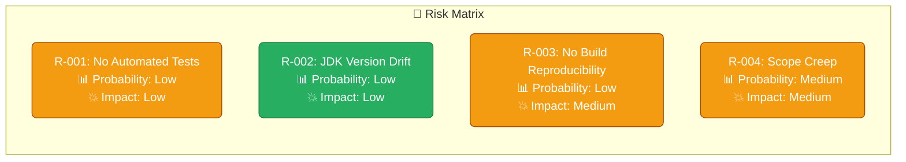

| ID | Risk | Probability | Impact | Mitigation |
|----|------|------------|--------|------------|
| R-001 | **No Automated Unit Tests** — Regression to output can go undetected | Low | Low | Add a JUnit 5 test that captures `System.out` and asserts `"Hello World"` |
| R-002 | **JDK Version Incompatibility** — Future JDK drops backward compat | Very Low | Low | Pin JDK version in CI workflow; use LTS releases |
| R-003 | **No Reproducible Build** — No `pom.xml` or `build.gradle` means dependency on ambient `javac` version | Low | Medium | Introduce a minimal `pom.xml` or Gradle wrapper |
| R-004 | **Scope Creep** — Project evolves beyond Hello World without architectural refactoring | Medium | Medium | Define explicit scope boundaries; create a new module if requirements grow |

### 11.2 Technical Debt

| Item | Category | Severity | Effort to Resolve |
|------|----------|----------|-------------------|
| **No unit tests** | Test Coverage | ⚠️ Low | 1–2 hours (add JUnit 5 + Maven/Gradle) |
| **No build system** | Build Tooling | ⚠️ Low | 1 hour (add `pom.xml` skeleton) |
| **No CI workflow defined** (`.github/` present but content unknown) | CI/CD | ⚠️ Low | 1–2 hours (add compile + run step) |
| **Hardcoded greeting string** | Configuration | ℹ️ Info | 30 min (extract to constant or args) |
| **No Javadoc** | Documentation | ℹ️ Info | 15 min (add class/method documentation) |

### 11.3 Recommended Improvements

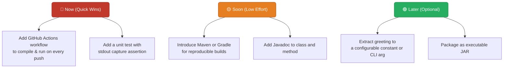

---

## 12. Glossary

| Term | Definition |
|------|-----------|
| **Arc42** | A template for software architecture documentation, consisting of 12 standardized sections. Named after the arc42 open-source project. |
| **Bytecode** | Platform-independent intermediate code produced by the Java compiler (`javac`). Stored in `.class` files and interpreted/JIT-compiled by the JVM. |
| **CI/CD** | Continuous Integration / Continuous Delivery. Automated pipelines that compile, test, and optionally deploy software on every code change. |
| **Classpath** | A JVM parameter that specifies the location(s) of `.class` files and JAR archives. |
| **Entry Point** | The designated method where program execution begins. In Java, this is `public static void main(String[] args)`. |
| **fd=1** | POSIX file descriptor 1, corresponding to the standard output stream (`stdout`). |
| **Hello World** | A traditional introductory program that outputs the string "Hello, World!" (or a variation thereof). Used to verify a working development environment. |
| **JDK** | Java Development Kit. Includes the Java compiler (`javac`), the JVM, and standard libraries. Required for compiling Java source code. |
| **JRE** | Java Runtime Environment. A subset of the JDK containing only the JVM and standard libraries. Sufficient for running compiled `.class` files. |
| **JVM** | Java Virtual Machine. The runtime engine that interprets and executes Java bytecode. Provides platform independence. |
| **`javac`** | The Java compiler command. Converts `.java` source files to `.class` bytecode files. |
| **`main(String[] args)`** | The standard JVM entry point method signature. `args` contains command-line arguments passed to the program. |
| **PrintStream** | A Java class (`java.io.PrintStream`) that wraps an output stream and provides convenient `print()` and `println()` methods. `System.out` is an instance of `PrintStream`. |
| **stdout** | Standard Output. The default output channel of a process, typically connected to the terminal display. In Java, accessed via `System.out`. |
| **`System.out`** | A static field on `java.lang.System` of type `java.io.PrintStream`, connected to the process's stdout. |
| **`System.out.println()`** | A method that writes a string followed by a platform-specific newline character to stdout. |
| **Void** | A Java return type indicating that a method does not return a value. The `main()` method is always `void`. |

---

*This document was generated by the **Arc42 Documentation Generator** agent.*  
*Source files analyzed: `HelloWorld.java`, `README.md`*  
*Diagrams: All diagrams are embedded as Mermaid code blocks.*  
*Last updated: 2025-01-01*
