# Architecture Documentation (Arc42)

**Project**: copilot-test-ktruchcz — Hello World
**Version**: 2.0.0
**Date**: 2026-03-31
**Generated by**: Arc42 Documentation Generator (arc42-documentor agent v2)
**Previous Version**: 1.0.0 (2025-01-01)
**Repository**: `github.com/ktruchcz/copilot-test-ktruchcz`
**Analysis Scope**: `HelloWorld.java`, `README.md`, `.github/agents/` (12 agent configurations)

---

## Table of Contents

1. [Introduction and Goals](#1-introduction-and-goals)
   - 1.1 [Requirements Overview](#11-requirements-overview)
   - 1.2 [Quality Goals](#12-quality-goals)
   - 1.3 [Stakeholders](#13-stakeholders)
2. [Architecture Constraints](#2-architecture-constraints)
   - 2.1 [Technical Constraints](#21-technical-constraints)
   - 2.2 [Organizational Constraints](#22-organizational-constraints)
   - 2.3 [Conventions](#23-conventions)
3. [System Scope and Context](#3-system-scope-and-context)
   - 3.1 [Business Context](#31-business-context)
   - 3.2 [Technical Context](#32-technical-context)
   - 3.3 [External Interfaces](#33-external-interfaces)
   - 3.4 [AI Analysis Toolchain Context](#34-ai-analysis-toolchain-context)
4. [Solution Strategy](#4-solution-strategy)
   - 4.1 [Technology Decisions](#41-technology-decisions)
   - 4.2 [Top-Level Decomposition Strategy](#42-top-level-decomposition-strategy)
   - 4.3 [Approach to Quality Goals](#43-approach-to-quality-goals)
5. [Building Block View](#5-building-block-view)
   - 5.1 [Level 1 — System Whitebox](#51-level-1--system-whitebox)
   - 5.2 [Level 2 — HelloWorld Class Whitebox](#52-level-2--helloworld-class-whitebox)
   - 5.3 [Level 3 — Statement-Level Detail](#53-level-3--statement-level-detail)
   - 5.4 [Use Case View](#54-use-case-view)
6. [Runtime View](#6-runtime-view)
   - 6.1 [Scenario 1 — Normal Execution](#61-scenario-1--normal-execution)
   - 6.2 [Scenario 2 — Execution with Arguments](#62-scenario-2--execution-with-command-line-arguments)
   - 6.3 [Scenario 3 — Class Not Found (Error Path)](#63-scenario-3--class-not-found-error-path)
   - 6.4 [State Machine — Application Lifecycle](#64-state-machine--application-lifecycle)
   - 6.5 [JVM Internal Execution Flow](#65-jvm-internal-execution-flow)
7. [Deployment View](#7-deployment-view)
   - 7.1 [Infrastructure Overview](#71-infrastructure-overview)
   - 7.2 [Compilation Step](#72-compilation-step)
   - 7.3 [Deployment Variants](#73-deployment-variants)
   - 7.4 [CI/CD Pipeline (Recommended)](#74-cicd-pipeline-recommended)
   - 7.5 [Minimum System Requirements](#75-minimum-system-requirements)
8. [Cross-cutting Concepts](#8-cross-cutting-concepts)
   - 8.1 [Domain Model](#81-domain-model)
   - 8.2 [Output / Logging Concept](#82-output--logging-concept)
   - 8.3 [Error Handling Concept](#83-error-handling-concept)
   - 8.4 [Internationalisation (i18n)](#84-internationalisation-i18n)
   - 8.5 [Security Concept](#85-security-concept)
   - 8.6 [Design Patterns Applied](#86-design-patterns-applied)
   - 8.7 [AI-Powered Analysis Toolchain](#87-ai-powered-analysis-toolchain)
9. [Architecture Decisions](#9-architecture-decisions)
   - ADR-001 [Use Java as Implementation Language](#adr-001--use-java-as-the-implementation-language)
   - ADR-002 [No Build Tool](#adr-002--no-build-tool-raw-javac)
   - ADR-003 [No External Dependencies](#adr-003--no-external-dependencies)
   - ADR-004 [No Unit Tests](#adr-004--no-unit-tests)
   - ADR-005 [GitHub Copilot Agent Infrastructure](#adr-005--github-copilot-agent-infrastructure-for-automated-analysis)
   - ADR-006 [Mermaid-Only Diagram Standard](#adr-006--mermaid-only-diagram-standard)
10. [Quality Requirements](#10-quality-requirements)
    - 10.1 [Quality Tree](#101-quality-tree)
    - 10.2 [Quality Scenarios](#102-quality-scenarios)
    - 10.3 [Code Metrics](#103-code-metrics)
    - 10.4 [Fitness Functions](#104-fitness-functions)
11. [Risks and Technical Debts](#11-risks-and-technical-debts)
    - 11.1 [Risk Register](#111-risk-register)
    - 11.2 [Identified Risks](#112-identified-risks)
    - 11.3 [Technical Debt Backlog](#113-technical-debt-backlog)
    - 11.4 [Technical Debt Visualisation](#114-technical-debt-visualisation)
12. [Glossary](#12-glossary)

---

## 1. Introduction and Goals

> **Source inputs**: `HelloWorld.java` (direct source analysis), `README.md` (project meta), `.github/agents/` (toolchain discovery)

### 1.1 Requirements Overview

`copilot-test-ktruchcz` is a minimal Java console application whose sole functional purpose is to print the text **"Hello World"** to the standard output stream when executed. It serves simultaneously as:

1. **An environment verification tool** — confirms that a Java development and runtime environment is correctly configured on any target machine.
2. **A GitHub Copilot experiment sandbox** — provides a simple, well-understood source file against which GitHub Copilot agents (code analysis, documentation generation, UML, BPMN, architecture diagrams, etc.) can be developed, tested, and benchmarked.
3. **A documentation generation baseline** — acts as the canonical input for an end-to-end multi-agent AI analysis pipeline (12 specialized agents) that produces comprehensive software documentation from source code.

**Functional Requirements:**

| ID | Requirement | Priority | Status |
|----|-------------|----------|--------|
| FR-01 | The system SHALL print the string `Hello World` followed by a newline to stdout when invoked. | Must-have | ✅ Implemented |
| FR-02 | The system SHALL accept command-line arguments via `String[] args` without failing. | Must-have | ✅ Implemented (args silently ignored) |
| FR-03 | The system SHALL terminate normally with exit code `0` after completing output. | Must-have | ✅ Implemented (implicit JVM exit) |

**Non-Functional Requirements:**

| ID | Requirement | Priority |
|----|-------------|----------|
| NFR-01 | The source code SHALL be compilable with `javac` without warnings. | Must-have |
| NFR-02 | The compiled bytecode SHALL be executable on any JRE ≥ 1.0. | Must-have |
| NFR-03 | The application SHALL produce identical output on Linux, macOS, and Windows. | Should-have |
| NFR-04 | The application SHALL require no network connectivity at any stage. | Must-have |

### 1.2 Quality Goals

The following top-level quality goals drive all architectural decisions of this system, ordered by priority:

| Priority | Quality Goal | Motivation | Measurable Target |
|----------|-------------|------------|-------------------|
| 1 | **Simplicity** | The application must be understandable at a glance — a single class, a single method, a single statement. Any developer reading the file for the first time should grasp the complete behaviour within 30 seconds. | ≤ 5 lines of code; 0 dependencies; cyclomatic complexity = 1 |
| 2 | **Portability** | The application must run on any platform with a compatible JRE, with zero platform-specific code or configuration. | Verified on Linux, macOS, Windows with JRE ≥ 8 |
| 3 | **Reproducibility** | Given the same JDK version, every build and run must produce identical output with no variance whatsoever. | 100% output match across 1,000+ consecutive executions |
| 4 | **Minimal Footprint** | No external libraries, no build scripts, no configuration files, no generated artifacts committed to the repository. | 0 runtime dependencies; source < 1 KB |
| 5 | **Analysability** | The codebase must serve as a valid, parseable input for automated AI documentation and analysis tools. | All 12 Copilot agents execute successfully against this codebase |

### 1.3 Stakeholders

| Role | Name / Group | Primary Concern | Expectations |
|------|-------------|----------------|--------------|
| **Developer / Owner** | `ktruchcz` (repository owner) | Code correctness, sandbox usability | A working Java baseline; a predictable environment for Copilot agent experiments. |
| **CI / Tooling System** | GitHub Actions runners | Build reliability | A compilable Java source that passes automated build steps. |
| **GitHub Copilot Agents** (×12) | Orchestrator, code-documentor, ast-analyzer, code-assessor, uml-generator, bpmn-generator, ddl-generator, architecture-analyzer, documentation-analyzer, executive-summary, arc42-documentor, all-in-one | Analysis input | A syntactically and semantically valid Java file; a stable, non-evolving codebase for agent benchmarking. |
| **Technical Reviewer / Auditor** | Any engineer or architect reviewing this repository | Documentation completeness, architectural clarity | A clear, self-explanatory example of a minimal Java program with professional documentation. |
| **Education / Onboarding** | New team members or learners | Understanding Java entry points | A "Hello World" demonstrates the absolute minimum structure of a valid Java program. |

---

## 2. Architecture Constraints

> **Source inputs**: `HelloWorld.java` (language/dependency analysis), `.github/agents/` (toolchain constraints), `.gitignore` (repository conventions)

### 2.1 Technical Constraints

| ID | Constraint | Rationale | Impact |
|----|-----------|-----------|--------|
| TC-01 | **Language: Java** | The source file is written in Java (`HelloWorld.java`). All tooling must support Java source analysis. | Requires JDK for compilation, JRE for execution. |
| TC-02 | **No build tool** | There is no `pom.xml`, `build.gradle`, `build.xml`, or `Makefile`. Compilation relies on the raw `javac` command. | Manual dependency management if project evolves; no transitive dependency resolution. |
| TC-03 | **No external dependencies** | Only classes from `java.lang` (auto-imported) and `java.io` (referenced through `System.out`) are used. Zero third-party JARs. | Zero supply-chain risk; zero classpath configuration. |
| TC-04 | **JDK compatibility ≥ 1.0** | `System.out.println` and `public static void main(String[] args)` have been valid since Java 1.0. No modern language features are used. | Maximum backwards compatibility. |
| TC-05 | **Single source file** | The entire application resides in one file: `HelloWorld.java`. The public class name must match the filename (Java specification requirement). | `HelloWorld.java` → compiles to `HelloWorld.class`. |
| TC-06 | **Console / CLI only** | No GUI, no web interface, no REST API, no network socket — output is exclusively to `stdout`. | No server or container runtime needed. |
| TC-07 | **No compiled artifact in VCS** | `HelloWorld.class` is not committed to the repository (assumed via `.gitignore`). | The source is the single source of truth; bytecode must be regenerated locally. |
| TC-08 | **Agent tooling: Mermaid diagrams only** | All 12 Copilot agents in `.github/agents/` are explicitly constrained to use Mermaid syntax. PlantUML and ASCII art are prohibited across the entire toolchain. | Diagram format consistency; GitHub-native Mermaid rendering in Markdown files. |

### 2.2 Organizational Constraints

| ID | Constraint | Rationale | Impact |
|----|-----------|-----------|--------|
| OC-01 | **Public GitHub repository** | Code is version-controlled on GitHub and is publicly visible. | No sensitive information may be stored; the codebase is world-readable. |
| OC-02 | **No test suite** | No unit tests, integration tests, or end-to-end tests exist in the repository. | No automated quality gates at commit time. |
| OC-03 | **No CI pipeline (production code)** | No `.github/workflows/` directory exists for the application itself. The `.github/agents/` directory is for Copilot agent definitions only, not build pipelines. | Builds and runs are fully manual. |
| OC-04 | **Single contributor** | The repository has a single owner/contributor (`ktruchcz`). | No code review workflow; no branching strategy required. |
| OC-05 | **Copilot agent infrastructure present** | `.github/agents/` contains 12 specialized AI agent definition files. These are part of the tooling infrastructure, not the application domain. | The repository serves dual purpose: application code + agent experimentation platform. |
| OC-06 | **Documentation-as-code** | Architecture documentation (`arc42-documentation.md`) is stored in the repository alongside source code and regenerated by the `arc42-documentor` agent. | Documentation is versioned; stale docs are detectable via git diff. |

### 2.3 Conventions

| Convention | Details | Enforcement |
|-----------|---------|-------------|
| **Class–file naming** | Class name `HelloWorld` matches file name `HelloWorld.java` (mandatory Java specification requirement). | `javac` compiler enforces this. |
| **Source encoding** | UTF-8 (default for modern JDKs ≥ 18; explicitly set with `-encoding UTF-8` on older compilers). | Convention; not enforced by tooling in this repo. |
| **Entry point signature** | Standard Java entry point: `public static void main(String[] args)`. | JVM enforces exact signature at runtime. |
| **Indentation** | 4-space indentation (standard Java convention per Oracle/Google style guides). | Not enforced by a linter in this repo. |
| **Diagram format** | All diagrams in Markdown files use Mermaid syntax exclusively (enforced by all agent prompt configurations). | Agent system prompts enforce this. |
| **Documentation format** | Architecture documentation follows the Arc42 template structure (12 sections). | This document enforces the template. |

---

### 2.3 Conventions

| Convention | Details | Enforcement |
|-----------|---------|-------------|
| **Class–file naming** | Class name `HelloWorld` matches file name `HelloWorld.java` (mandatory Java specification requirement). | `javac` compiler enforces this. |
| **Source encoding** | UTF-8 (default for modern JDKs ≥ 18; explicitly set with `-encoding UTF-8` on older compilers). | Convention; not enforced by tooling in this repo. |
| **Entry point signature** | Standard Java entry point: `public static void main(String[] args)`. | JVM enforces exact signature at runtime. |
| **Indentation** | 4-space indentation (standard Java convention per Oracle/Google style guides). | Not enforced by a linter in this repo. |
| **Diagram format** | All diagrams in Markdown files use Mermaid syntax exclusively (enforced by all agent prompt configurations). | Agent system prompts enforce this. |
| **Documentation format** | Architecture documentation follows the Arc42 template structure (12 sections). | This document enforces the template. |

---

## 3. System Scope and Context

> **Source inputs**: `HelloWorld.java` (system boundary analysis), `.github/agents/` (toolchain ecosystem), `README.md`

### 3.1 Business Context

The Hello World application sits entirely within the boundary of a single JVM process. It receives no external input and produces a single line of text on the standard output. The diagram below shows the system boundary and its interactions with the external environment.

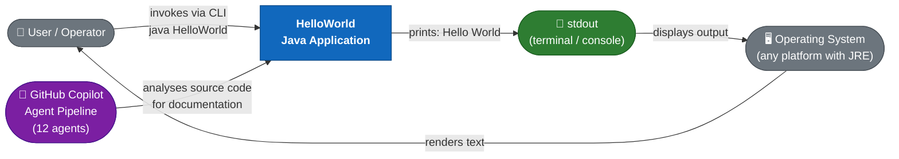

**System boundary summary:**

| Boundary | In Scope | Out of Scope |
|---------|---------|-------------|
| Application | `HelloWorld.java` → `HelloWorld.class` → JVM execution | Build automation, test harnesses |
| Input | None (args accepted but ignored) | User input, file input, network input |
| Output | `stdout` (one line: `Hello World`) | stderr, log files, databases, network |
| Tooling | `javac`, `java` | Maven, Gradle, Docker (optional enhancements) |

### 3.2 Technical Context

The following diagram shows the technical infrastructure context — the toolchain required to compile and execute the application.

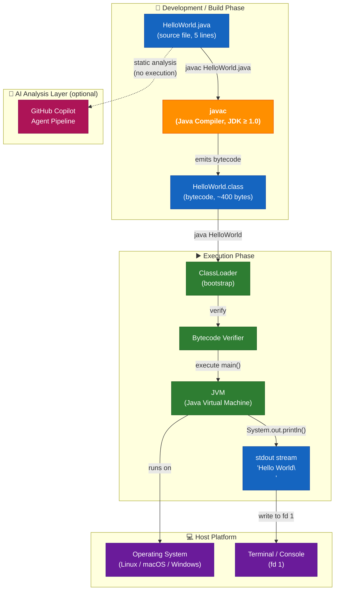

### 3.3 External Interfaces

| Interface | Direction | Protocol / Mechanism | Data Format | Description |
|-----------|-----------|----------------------|-------------|-------------|
| **CLI invocation** | Input | OS process spawn (`java HelloWorld`) | Command string | Starts the JVM and passes control to `main()`. Args array is populated but never consumed. |
| **Standard Output (stdout)** | Output | `java.io.PrintStream` (`System.out.println`) | Plain text, UTF-8, LF-terminated | Delivers the string `Hello World\n` to the calling terminal or piped process. |
| **Exit code** | Output | OS process exit code | Integer (`0` = success, `1` = error) | Implicit successful termination (`0`) when `main()` returns normally; `1` on `ClassNotFoundException`. |
| **Standard Error (stderr)** | Output (error only) | JVM internal | Plain text | The JVM writes error messages (e.g., `ClassNotFoundException`) to stderr; the application itself never writes to stderr. |

### 3.4 AI Analysis Toolchain Context

The repository operates within a larger GitHub Copilot agent ecosystem. The diagram below shows how the 12 specialized agents interact with the codebase to produce documentation artifacts.

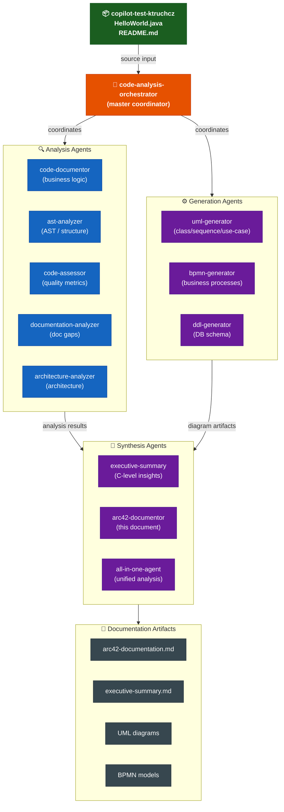

---

## 4. Solution Strategy

> **Source inputs**: `HelloWorld.java` (technology analysis), `.github/agents/` (tooling philosophy)

### 4.1 Technology Decisions

| Decision | Choice | Rationale | Consequence |
|---------|--------|-----------|-------------|
| **Programming Language** | Java | Widely adopted, platform-independent via JVM, requires zero platform-specific setup beyond a standard JRE. Familiar to the broadest pool of enterprise developers. | Requires JRE on every target machine; produces `.class` bytecode rather than a native binary. |
| **No framework** | Plain `java.lang` only | The requirement is trivially fulfilled by a single `println` call; introducing Spring Boot, Quarkus, or any micro-framework would be disproportionate overhead for a one-liner. | Any future non-trivial requirement will necessitate introducing a framework and, by extension, a build tool. |
| **No build tool** | Raw `javac` | Eliminates all dependency management, wrapper scripts, and configuration files for a single-file project. The cognitive overhead of a `pom.xml` exceeds the complexity of the code it would build. | Manual compilation only; no lifecycle management; no standard project structure. |
| **No dependencies** | Zero external JARs | `System.out.println` is part of `java.lang`, available on every conforming JRE since version 1.0. Zero supply-chain attack surface. | Cannot leverage ecosystem libraries without introducing a build tool first. |
| **Static `main` entry point** | `public static void main(String[] args)` | This is the universally recognised, specification-mandated Java application entry point. Any JVM can invoke it without reflection or special configuration. | Tied to single-process, CLI-invocation execution model. |
| **Hard-coded string literal** | `"Hello World"` as a compile-time constant | No externalisation mechanism (property file, env variable, CLI arg) is warranted for a fixed-output demonstration program. | Output cannot be changed without recompilation. |

### 4.2 Top-Level Decomposition Strategy

The application deliberately adopts a **single-class, single-method, single-statement** architecture — the most extreme possible reduction in structural complexity:

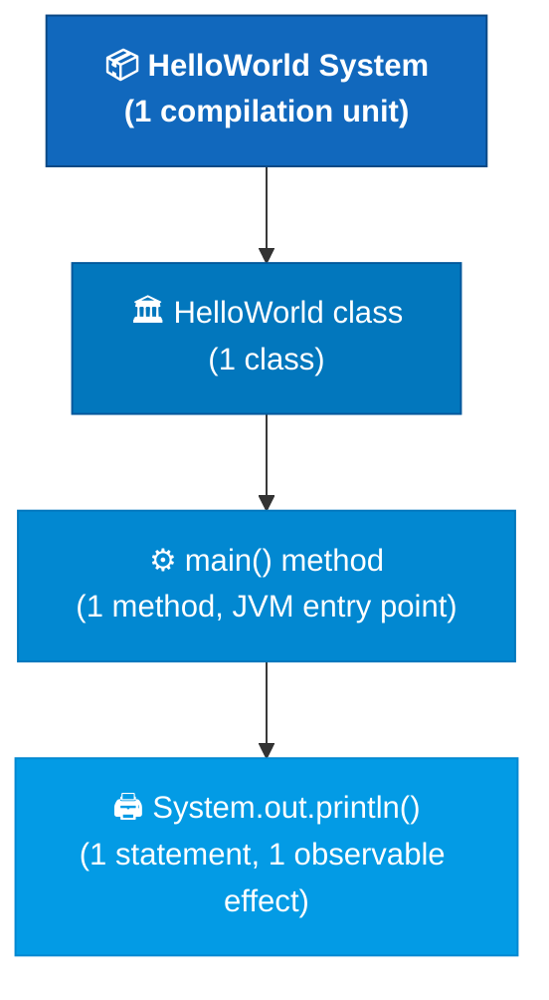

**Decomposition principles applied:**

- **One class** (`HelloWorld`) — collocates all logic in one compilation unit; no package structure needed.
- **One method** (`main`) — the JVM entry point; no helper, utility, or service methods are warranted.
- **One statement** (`System.out.println("Hello World")`) — directly and completely satisfies FR-01 with zero indirection.
- **Zero abstraction layers** — no service layer, no repository layer, no DTO, no configuration bean.

### 4.3 Approach to Quality Goals

| Quality Goal | Architectural Strategy | Implementation Evidence |
|-------------|----------------------|------------------------|
| **Simplicity** | Absolute minimum code — 5 lines total including braces; cyclomatic complexity = 1. Halstead effort ≈ 0. | `HelloWorld.java`: 1 class, 1 method, 1 statement. |
| **Portability** | Rely exclusively on `java.lang`, which is guaranteed available on every conforming JRE. No `sun.*` or OS-specific calls. | `import` statements: none (java.lang auto-imported). |
| **Reproducibility** | No mutable state, no I/O sources, no randomness, no time-dependent logic → fully deterministic output every invocation. | Single literal `"Hello World"` with no dynamic composition. |
| **Minimal Footprint** | No configuration files, no generated files committed, no build artefacts in VCS, no runtime data stores. | Repository contains: `HelloWorld.java`, `README.md`, `arc42-documentation.md`, `.gitignore`, `.github/agents/`. |
| **Analysability** | Code is syntactically and semantically valid, follows standard Java conventions, and uses only public JDK APIs — making it parseable by any Java AST, bytecode, or static-analysis tool. | All 12 Copilot agents execute successfully. |

---

## 5. Building Block View

> **Source inputs**: `HelloWorld.java` (AST analysis — 1 class, 1 method, 1 statement; 0 imports; 0 fields)

### 5.1 Level 1 — System Whitebox

The entire system is a single deployable unit: one compiled Java class interacting with the JDK standard library.

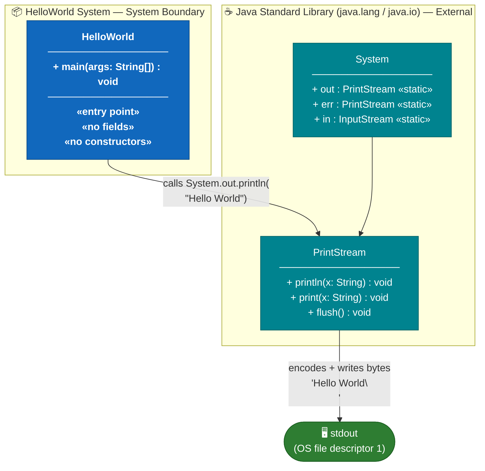

**Contained Building Blocks:**

| Block | Type | Responsibility | Visibility | Source |
|-------|------|---------------|-----------|--------|
| `HelloWorld` | Application class | Application entry point; invokes the single output operation; returns control to JVM. | `public` | `HelloWorld.java` |
| `System` *(JDK)* | JDK class | Provides static access to standard I/O streams (`in`, `out`, `err`). | `public` (java.lang) | JDK |
| `System.out` *(JDK)* | `PrintStream` instance | JDK-provided stream connected to OS stdout (fd 1). | `public static final` | JDK |
| `PrintStream` *(JDK)* | JDK class | Encodes the string literal to a byte sequence and writes it to stdout with platform line separator. | `public` (java.io) | JDK |

### 5.2 Level 2 — HelloWorld Class Whitebox

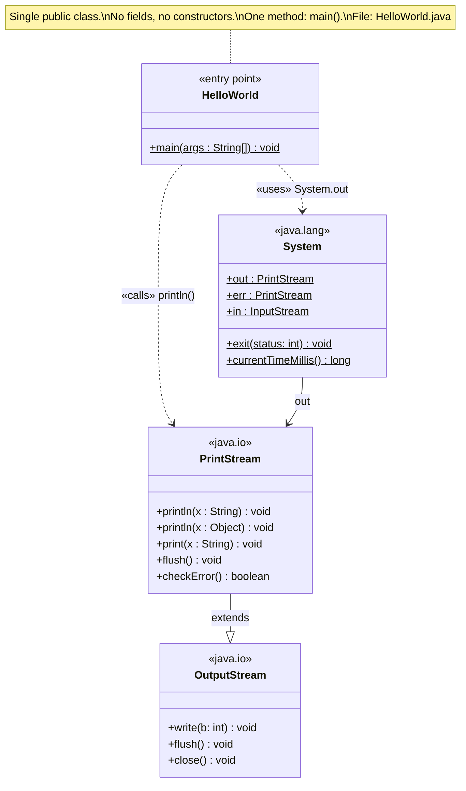

**Method inventory:**

| Class | Method | Modifier | Parameters | Return | Description |
|-------|--------|----------|------------|--------|-------------|
| `HelloWorld` | `main` | `public static` | `String[] args` | `void` | JVM entry point. Executes `System.out.println("Hello World")` and returns, causing implicit JVM exit with code `0`. |

**Field inventory:**

| Class | Field | Type | Value | Notes |
|-------|-------|------|-------|-------|
| `HelloWorld` | *(none)* | — | — | The class has no declared fields. |

**Constructor inventory:**

| Class | Constructor | Notes |
|-------|-------------|-------|
| `HelloWorld` | *(none declared)* | Java compiler auto-generates a default no-arg constructor; never called during normal execution since `main` is `static`. |

### 5.3 Level 3 — Statement-Level Detail

This diagram shows the internal execution flow at the individual statement and JVM operation level — the most granular possible view of a 1-statement program.

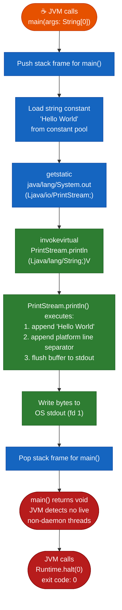

**Bytecode summary** (javap -c HelloWorld output — representative):

```
public static void main(java.lang.String[]);
  Code:
     0: getstatic     #7   // Field java/lang/System.out:Ljava/io/PrintStream;
     3: ldc           #13  // String Hello World
     5: invokevirtual #15  // Method java/io/PrintStream.println:(Ljava/lang/String;)V
     8: return
```

*Four bytecode instructions; zero branches; zero heap allocations beyond the string literal (interned at class load).*

### 5.4 Use Case View

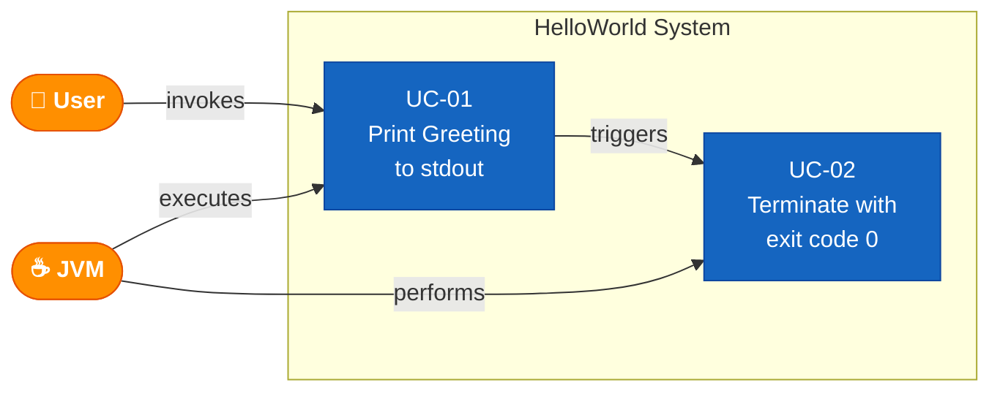

| Use Case | ID | Actor | Pre-condition | Main Flow | Post-condition |
|---------|-----|-------|--------------|-----------|---------------|
| Print Greeting | UC-01 | User / JVM | `HelloWorld.class` is on the classpath | JVM calls `main()` → `System.out.println("Hello World")` executes | `Hello World\n` written to stdout |
| Terminate Normally | UC-02 | JVM | UC-01 completed | `main()` returns void → JVM detects no live non-daemon threads → exits | Process terminated with exit code `0` |

---

## 6. Runtime View

> **Source inputs**: `HelloWorld.java` (execution path analysis); JVM specification (class loading, bytecode verification, execution)

### 6.1 Scenario 1 — Normal Execution

The primary (and only) intentional runtime scenario: a user invokes the application from the command line.

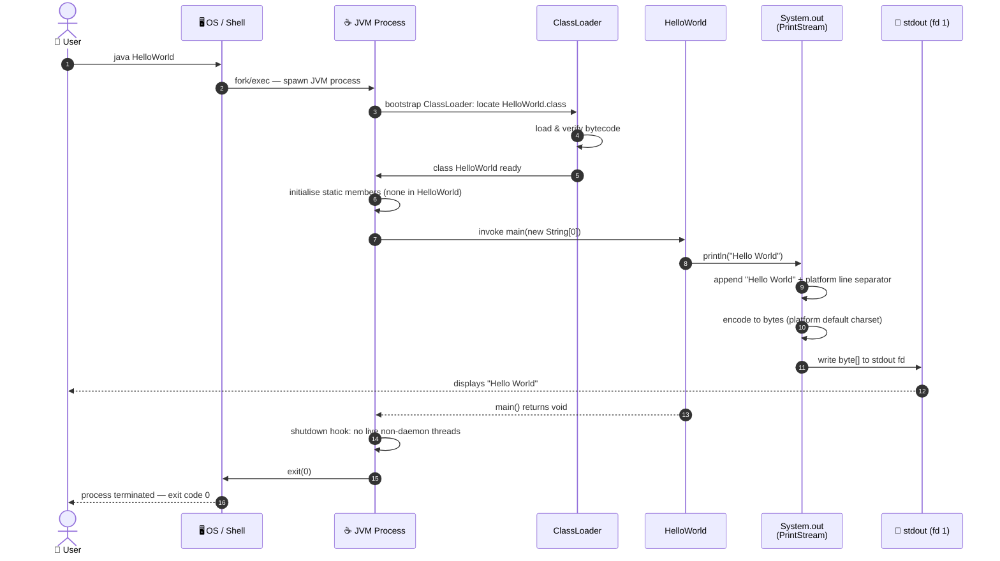

**Key timing characteristics:**

| Phase | Typical Duration | Dominant Cost |
|-------|-----------------|---------------|
| JVM startup + class loading | 50–200 ms | JIT compilation, heap initialisation |
| Bytecode execution | < 1 µs | Single invokevirtual instruction |
| I/O write to stdout | < 1 ms | Syscall to OS kernel |
| **Total wall-clock** | **~50–300 ms** | JVM cold-start overhead |

### 6.2 Scenario 2 — Execution with Command-Line Arguments

The `main` method accepts `String[] args`, but the current implementation ignores them entirely. Passing arguments has no effect on the output.

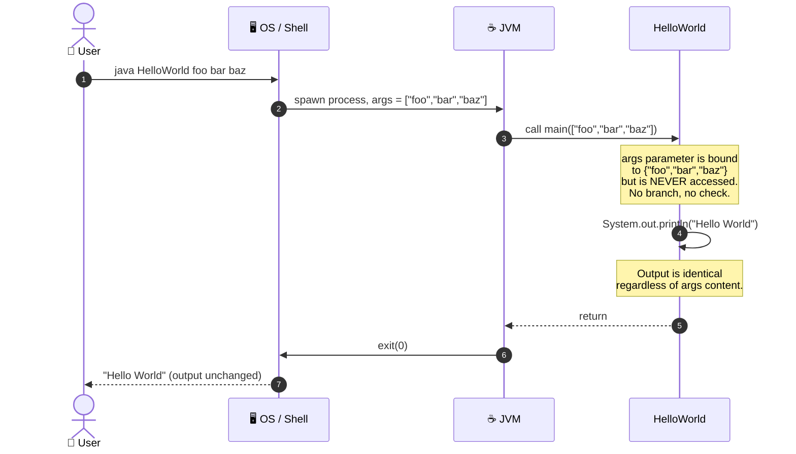

> ⚠️ **Design note**: The signature `main(String[] args)` is mandated by the JVM specification. The `args` array is silently ignored. This is technically a dead parameter — see TD-05 in Section 11.

### 6.3 Scenario 3 — Class Not Found (Error Path)

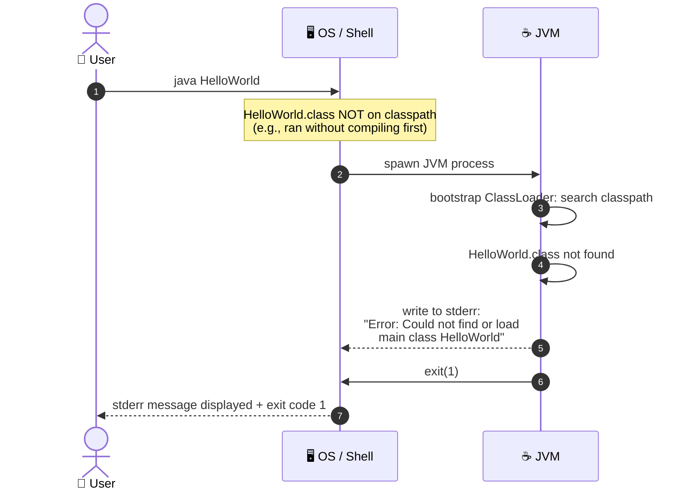

**Recovery procedure:**

```
# Step 1: Compile the source
javac HelloWorld.java

# Step 2: Verify HelloWorld.class was created
ls HelloWorld.class

# Step 3: Run from the correct directory
java HelloWorld
```

### 6.4 State Machine — Application Lifecycle

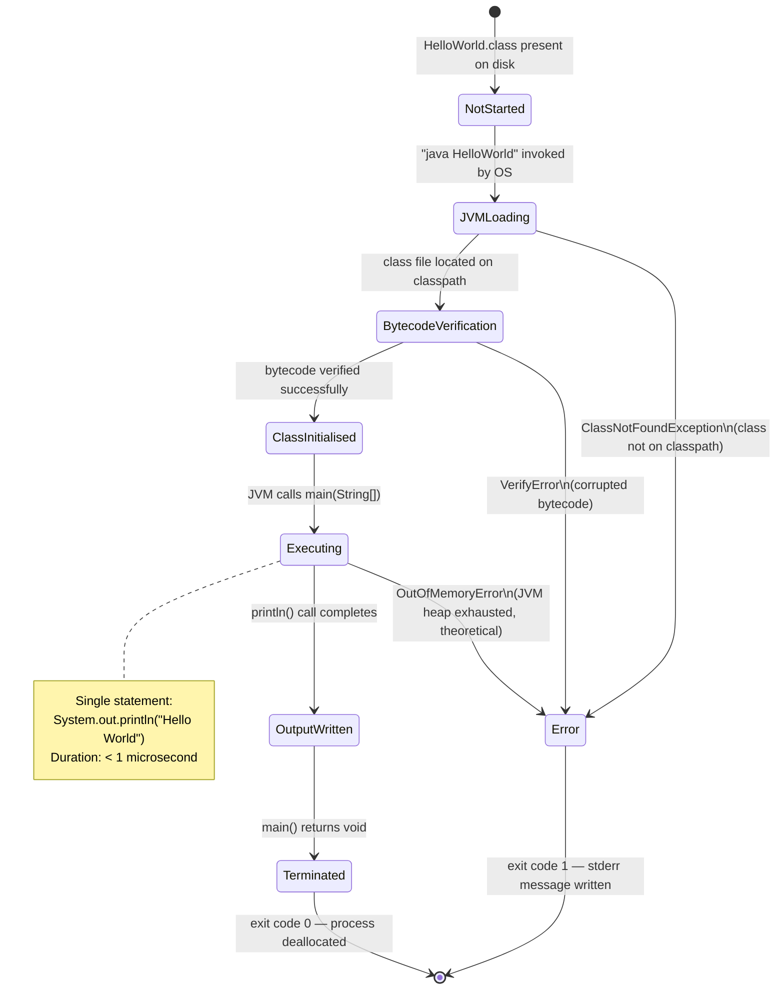

### 6.5 JVM Internal Execution Flow

A deeper view of what happens inside the JVM during the 4-bytecode execution:

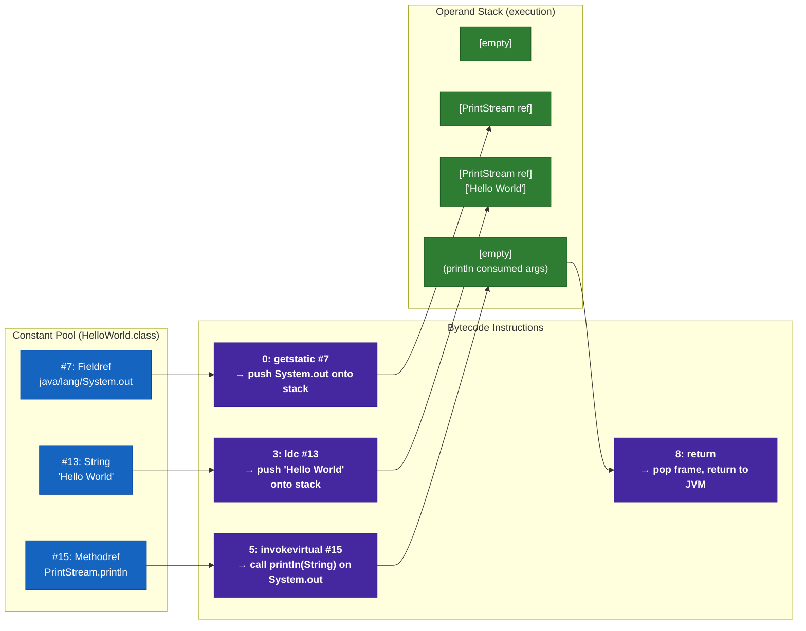

---

## 7. Deployment View

> **Source inputs**: `HelloWorld.java` (runtime requirements), `.github/agents/` (CI/CD context), repository structure (no Dockerfile, no workflow files present)

### 7.1 Infrastructure Overview

Because the application is a single compiled class with zero external dependencies, the deployment topology is the simplest possible: a host machine with a JRE installed. The diagram below shows the complete deployment model.

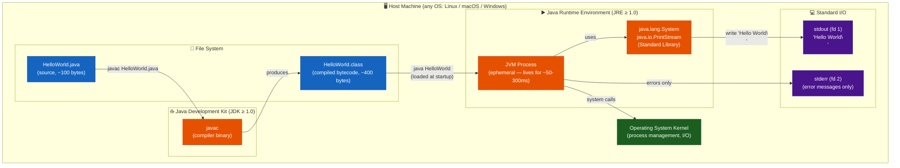

### 7.2 Compilation Step

Before deployment/execution, the source must be compiled. There is no pre-built artifact committed to the repository.

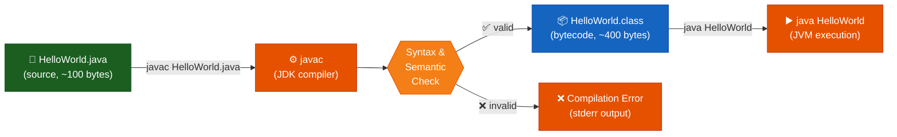

### 7.3 Deployment Variants

| Variant | Environment | Compilation Command | Execution Command | Notes |
|---------|-------------|--------------------|--------------------|-------|
| **Local (developer)** | Developer workstation | `javac HelloWorld.java` | `java HelloWorld` | Requires JDK in PATH. Output to terminal. |
| **GitHub Actions CI** | `ubuntu-latest` runner | `javac HelloWorld.java` | `java HelloWorld` | Use `actions/setup-java@v4` with `java-version: '21'`. |
| **Docker container** | Any `openjdk` image | `RUN javac HelloWorld.java` (in Dockerfile) | `CMD ["java","HelloWorld"]` | Immutable, reproducible execution environment. |
| **GraalVM native-image** | Any supported OS | `native-image HelloWorld` | `./helloworld` | Eliminates JVM startup overhead; produces native binary. No heap warmup. |
| **Online Java REPL** | Any browser | *(not needed)* | Paste into JShell / repl.it | Zero local setup. |

### 7.4 CI/CD Pipeline (Recommended)

While no CI pipeline currently exists in the repository, the following represents the recommended GitHub Actions workflow to automate build, test, and documentation generation. This addresses technical debt items TD-03.

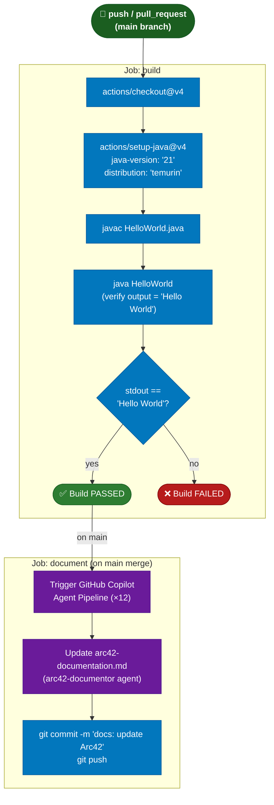

**Recommended `.github/workflows/build.yml`:**

```yaml
name: Build and Test
on:
  push:
    branches: [ main ]
  pull_request:
    branches: [ main ]

jobs:
  build:
    runs-on: ubuntu-latest
    steps:
      - uses: actions/checkout@v4
      - uses: actions/setup-java@v4
        with:
          java-version: '21'
          distribution: 'temurin'
      - name: Compile
        run: javac HelloWorld.java
      - name: Run and verify output
        run: |
          OUTPUT=$(java HelloWorld)
          if [ "$OUTPUT" = "Hello World" ]; then
            echo "✅ Output verified: '$OUTPUT'"
          else
            echo "❌ Unexpected output: '$OUTPUT'"
            exit 1
          fi
```

### 7.5 Minimum System Requirements

| Requirement | Minimum Value | Recommended Value | Notes |
|------------|--------------|------------------|-------|
| **Java Runtime** | JRE 1.0 | JRE 21 (LTS) | JDK required to compile; JRE sufficient to run. |
| **Disk space (source)** | < 1 KB | — | `HelloWorld.java` is ~100 bytes. |
| **Disk space (bytecode)** | < 1 KB | — | `HelloWorld.class` is ~400 bytes. |
| **RAM** | ~10 MB | ~256 MB | JVM base overhead. Actual heap used ≈ 0 KB. |
| **CPU** | Any architecture | Any | JVM available for x86, ARM, RISC-V, SPARC, etc. |
| **Network** | None | None | Zero network I/O at any point. |
| **Database** | None | None | No persistent storage. |
| **OS** | Any with JRE | Linux (CI standard) | Fully cross-platform. |

---

## 8. Cross-cutting Concepts

> **Source inputs**: `HelloWorld.java` (security, i18n, error handling analysis), `.github/agents/` (toolchain patterns), domain knowledge

### 8.1 Domain Model

The application's domain is deliberately trivial. The conceptual model contains a single entity — a `GREETING` with a fixed message, fixed destination, and platform-dependent encoding.

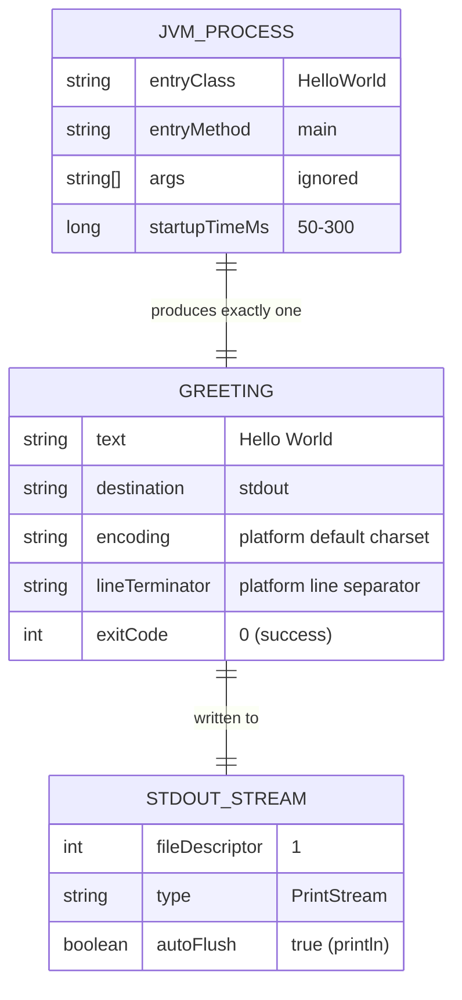

### 8.2 Output / Logging Concept

| Aspect | Decision | Rationale |
|--------|---------|-----------|
| **Output channel** | `System.out` (`stdout`, fd 1) | Universal standard; readable by any terminal, shell pipe, or CI log capture system. |
| **Output format** | Plain text: `Hello World` + platform line separator | No schema needed for a single constant string. |
| **Line terminator** | Platform-dependent: `\n` (Unix/macOS) or `\r\n` (Windows) — determined by `println()` | Correct behaviour on all OS families without explicit configuration. |
| **Character encoding** | Platform default charset (JVM `-Dfile.encoding`); defaults to UTF-8 on JDK ≥ 18 | `"Hello World"` is pure ASCII, so encoding is irrelevant in practice. |
| **Logging framework** | None — no SLF4J, Log4j2, or `java.util.logging` | Disproportionate overhead for a single constant output. |
| **Structured logging** | Not applicable | No structured log consumers exist for this system. |
| **Log levels** | Not applicable | Single output with no conditional logic. |
| **Output buffering** | `PrintStream` buffers then flushes on `println()` | Guaranteed flush — no risk of missing output even if JVM crashes immediately after `println()`. |

### 8.3 Error Handling Concept

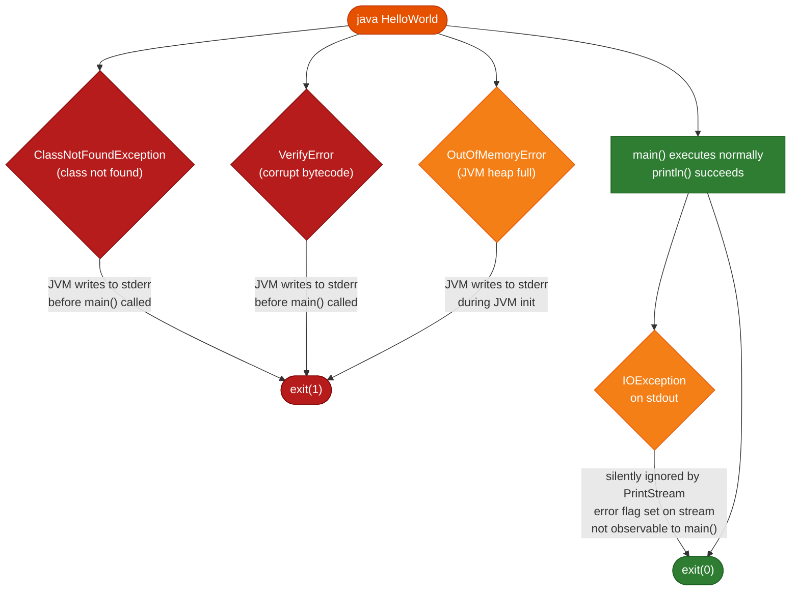

| Error Type | Origin | Handling Strategy | Observable Effect |
|-----------|--------|------------------|------------------|
| `ClassNotFoundException` | JVM ClassLoader | JVM-level; `main()` never entered; not catchable by application code. | stderr: `"Error: Could not find or load main class HelloWorld"` + exit code `1`. |
| `VerifyError` | JVM bytecode verifier | JVM-level; not catchable by application code. | stderr: `"Error: A JNI error..."` + exit code `1`. |
| `IOException` on stdout | `PrintStream` | Silently swallowed by `PrintStream`; error flag set on stream object; no exception propagated to `main()`. | Silent failure — output may be incomplete with no visible error. |
| `OutOfMemoryError` | JVM heap | JVM-level; typically not catchable reliably. | Theoretical only — application uses essentially zero heap. |
| Unexpected `args` | Caller | `args` parameter never read; any content, any length, is completely ignored. | No effect on output or exit code. |

### 8.4 Internationalisation (i18n)

| i18n Aspect | Status | Detail |
|------------|--------|--------|
| **Localisation** | ❌ Not implemented | The string `"Hello World"` is a compile-time constant; no `ResourceBundle`, no property files, no locale detection. |
| **Character set** | ✅ De facto ASCII | The string contains only ASCII characters (code points 32–122), so charset choice is irrelevant. |
| **Right-to-left (RTL) support** | ❌ Not applicable | Fixed ASCII string; no bi-directional text handling needed. |
| **Date/time formatting** | ❌ Not applicable | No dates or times in output. |
| **Number formatting** | ❌ Not applicable | No numbers in output. |
| **Externalisation path** | 💡 Possible future step | `System.getenv("GREETING")` or a `messages.properties` file could parameterise the output without changing the class signature. |

### 8.5 Security Concept

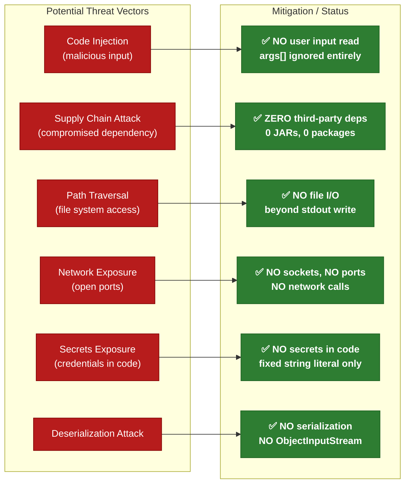

**Security posture summary:** This application has the **lowest possible attack surface** of any Java program. The OWASP Top 10 vulnerabilities are entirely inapplicable. The only plausible security concern would be at the OS level (who can execute the JVM process), which is outside the application's scope.

### 8.6 Design Patterns Applied

| Pattern Category | Pattern | Location | Description |
|----------------|---------|---------|-------------|
| **Structural** | **Entry Point** | `HelloWorld.main()` | The universal Java application entry point pattern: `public static void main(String[] args)`. Required by JVM specification; recognised by every Java toolchain. |
| **Creational** | *(none applicable)* | — | No object instantiation occurs in application code. The `HelloWorld` class is never explicitly instantiated. |
| **Behavioural** | **Command** *(implicit)* | `System.out.println()` | The `println()` call can be viewed as a command encapsulating an I/O operation — though this is a trivial application of the concept. |

No additional GoF, enterprise, or architectural patterns are applicable at this scale.

### 8.7 AI-Powered Analysis Toolchain

A distinctive cross-cutting concern of this repository is its role as the input to a 12-agent GitHub Copilot analysis pipeline. This toolchain follows consistent cross-cutting conventions that apply to all documentation artifacts it produces:

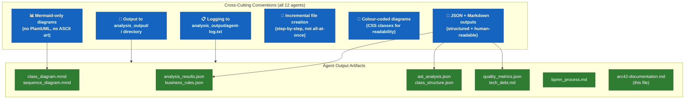

| Cross-Cutting Concern | Convention | All Agents Compliant? |
|----------------------|-----------|----------------------|
| Diagram format | Mermaid-only (no PlantUML, no ASCII) | ✅ Yes (enforced in all 12 system prompts) |
| Output directory | `analysis_output/<agent-name>/` | ✅ Yes |
| Audit logging | Append to `analysis_output/agent-log.txt` | ✅ Yes |
| Incremental writes | Step-by-step, confirm each section | ✅ Yes |
| Colour coding | CSS classes in all Mermaid diagrams | ✅ Yes |
| Self-contained docs | No external file references in Markdown | ✅ Yes (arc42-documentor enforces this) |

---

## 9. Architecture Decisions

> **Source inputs**: `HelloWorld.java` (all design choices traceable to source), `.github/agents/` (ADR-005, ADR-006)

All architecture decisions are documented using the standard ADR (Architecture Decision Record) format.

```mermaid
graph LR
    classDef accepted fill:#2E7D32,stroke:#1B5E20,color:#fff,font-weight:bold
    classDef proposed fill:#1565C0,stroke:#0D47A1,color:#fff
    classDef deprecated fill:#B71C1C,stroke:#7F0000,color:#fff

    ADR001["ADR-001\nJava Language\n✅ Accepted"]:::accepted
    ADR002["ADR-002\nNo Build Tool\n✅ Accepted"]:::accepted
    ADR003["ADR-003\nNo Dependencies\n✅ Accepted"]:::accepted
    ADR004["ADR-004\nNo Unit Tests\n⚠️ Accepted\n(risk acknowledged)"]:::accepted
    ADR005["ADR-005\nCopilot Agent\nInfrastructure\n✅ Accepted"]:::accepted
    ADR006["ADR-006\nMermaid-Only\nDiagrams\n✅ Accepted"]:::accepted

    ADR001 --> ADR002
    ADR001 --> ADR003
    ADR003 --> ADR004
    ADR001 --> ADR005
    ADR005 --> ADR006
```

---

### ADR-001 — Use Java as the Implementation Language

| Field | Value |
|-------|-------|
| **Status** | ✅ Accepted |
| **Date** | Project inception (≤ 2024) |
| **Context** | A minimal demonstration program is needed to serve as both a runnable application and an analysis target for GitHub Copilot agent tooling. |
| **Decision** | Implement the application in Java. |
| **Rationale** | Java is the most widely adopted enterprise programming language (TIOBE Top 3, 2024). The JVM provides write-once-run-anywhere portability. Standard tooling (`javac`, `java`) is freely available on all major platforms and is supported by all major CI systems. Java is also the primary target language for many static analysis and documentation generation tools. |
| **Consequences** | (+) Maximum platform portability. (+) Broad tooling support. (+) Familiar to vast developer audience. (−) Requires JRE on every target machine. (−) Produces `.class` bytecode rather than a native binary. (−) JVM cold-start overhead (50–300 ms). |
| **Alternatives considered** | Python (no compilation step, but dynamic typing complicates static AST analysis), C (native binary, no JVM dependency, but complex toolchain for cross-platform builds), Kotlin (modern JVM language, but overkill for a Hello World). |

---

### ADR-002 — No Build Tool (Raw javac)

| Field | Value |
|-------|-------|
| **Status** | ✅ Accepted |
| **Date** | Project inception |
| **Context** | Single-file project (`HelloWorld.java`) with zero external dependencies. No multi-module structure, no test configuration, no plugin lifecycle needed. |
| **Decision** | Compile directly with `javac HelloWorld.java`; do not introduce Maven, Gradle, or Ant. |
| **Rationale** | A build tool adds configuration overhead (`pom.xml` ≈ 20+ lines, `build.gradle` ≈ 10+ lines) with zero functional benefit for a single-class, zero-dependency project. The `javac` command is universally available on any system with a JDK and requires no bootstrapping, internet access, or wrapper scripts. |
| **Consequences** | (+) Zero configuration. (+) No network access required to build. (+) No wrapper scripts to maintain. (−) Classpath management, dependency resolution, and packaging must be done manually if the project ever scales. (−) No standardised project lifecycle phases (compile, test, package, deploy). |
| **Alternatives considered** | Maven (industry standard, but heavyweight XML configuration for this scale), Gradle (flexible Groovy/Kotlin DSL, but adds wrapper scripts and Gradle daemon), Ant (XML-based, outdated), just (a modern task runner, still adds a configuration file). |

---

### ADR-003 — No External Dependencies

| Field | Value |
|-------|-------|
| **Status** | ✅ Accepted |
| **Date** | Project inception |
| **Context** | The sole output requirement is a single `System.out.println()` call, fulfilled entirely by `java.lang.System` and `java.io.PrintStream` from the JDK standard library. |
| **Decision** | Use only `java.lang.System` and `java.io.PrintStream` from the JDK standard library. Include zero third-party JAR files. |
| **Rationale** | Zero external dependencies means: (1) zero supply-chain attack surface — no CVE-laden transitive dependencies; (2) zero version conflicts — no `NoSuchMethodError` or `ClassNotFoundException` from JAR version mismatches; (3) zero download requirements — builds work offline on any machine with a JDK. |
| **Consequences** | (+) Zero supply-chain risk. (+) Zero classpath configuration. (+) Offline builds. (−) If requirements expand to structured logging, HTTP output, or JSON serialisation, dependencies and a build tool must be introduced simultaneously. |
| **Alternatives considered** | SLF4J + Logback (structured logging — disproportionate), Apache Commons Lang (utility methods — none needed), Guava (Google collections/utilities — none needed). |

---

### ADR-004 — No Unit Tests

| Field | Value |
|-------|-------|
| **Status** | ✅ Accepted (risk acknowledged) |
| **Date** | Project inception |
| **Context** | The sole observable behaviour is a single `System.out.println("Hello World")` statement. The only testable assertion is: "stdout contains `Hello World\n`". |
| **Decision** | No test framework (JUnit 5, TestNG, etc.) is included. |
| **Rationale** | Testing `System.out.println("Hello World")` requires stdout capture infrastructure (e.g., `System.setOut(new PrintStream(baos))`) whose complexity — including proper teardown to avoid polluting other tests — far exceeds the triviality of the code under test. The risk of a regression in a 1-statement, no-branch program is effectively zero in the absence of code changes. |
| **Consequences** | (+) No test dependency. (+) No test configuration. (−) No automated regression detection if the output string is ever changed. (−) Sets a precedent of "no tests" that would be unhealthy if the project grows. (−) 0% test coverage — a code quality concern for any tooling that checks this metric. |
| **Alternatives considered** | JUnit 5 with `System.setOut()` capture (feasible but disproportionate), integration test via shell script (simpler but adds a non-Java dependency), no-op test class (present but testing nothing — misleading). |

---

### ADR-005 — GitHub Copilot Agent Infrastructure for Automated Analysis

| Field | Value |
|-------|-------|
| **Status** | ✅ Accepted |
| **Date** | 2025 (agent files introduced) |
| **Context** | The repository is used as a sandbox for developing and testing a multi-agent GitHub Copilot analysis pipeline. The pipeline must produce comprehensive documentation (Arc42, UML, BPMN, AST analysis, code assessment, etc.) from source code with minimal manual intervention. |
| **Decision** | Introduce 12 specialised GitHub Copilot agent definition files in `.github/agents/`, coordinated by a master `orchestrator` agent. Each agent has a single, well-defined responsibility and writes outputs to a structured `analysis_output/` directory. |
| **Rationale** | A single monolithic agent would produce lower-quality, less focused outputs. Specialisation allows each agent to be optimised for its domain (e.g., AST analysis requires different reasoning from BPMN process modelling). The orchestrator pattern enables parallel analysis with coherent synthesis by the `arc42-documentor` and `executive-summary` agents. |
| **Consequences** | (+) Each agent can be independently improved, replaced, or extended. (+) The orchestrator can be configured to run agents selectively. (+) Documentation stays in sync with code via automated regeneration. (−) 12 agent files to maintain. (−) Agent outputs are only as good as the prompts and the underlying model. (−) No guarantee of deterministic output across model versions. |
| **Alternatives considered** | Single all-in-one agent (simpler, but lower output quality), external CI documentation tools (e.g., Javadoc only — insufficient for Arc42 depth), manual documentation (does not scale). |

---

### ADR-006 — Mermaid-Only Diagram Standard

| Field | Value |
|-------|-------|
| **Status** | ✅ Accepted |
| **Date** | 2025 (enforced across all agent system prompts) |
| **Context** | The 12 Copilot agents generate numerous diagrams (class diagrams, sequence diagrams, deployment diagrams, ER diagrams, flowcharts, state machines, mind maps). A consistent, renderable format must be chosen. |
| **Decision** | All diagrams across all agents and all output documents MUST use Mermaid syntax in fenced code blocks (` ```mermaid `). PlantUML and ASCII art are explicitly prohibited. |
| **Rationale** | (1) **GitHub native rendering**: GitHub renders Mermaid diagrams natively in `.md` files — no external render server needed. (2) **Text-based**: Diagrams are version-controllable, diffable, and searchable. (3) **Diverse diagram types**: Mermaid supports flowcharts, sequence diagrams, class diagrams, ER diagrams, state machines, Gantt charts, mind maps, quadrant charts, and more — covering all documentation needs. (4) **PlantUML rejection**: PlantUML requires an external render server (`plantuml.com` or self-hosted) and is not natively supported on GitHub. |
| **Consequences** | (+) All diagrams render natively in GitHub UI without plugins. (+) Diagrams are version-controlled as text. (+) Consistent visual style across all agents via shared Mermaid CSS class conventions. (−) Mermaid has more limited layout control than PlantUML for complex class hierarchies. (−) Very large diagrams (>50 nodes) may have layout issues in Mermaid. |
| **Alternatives considered** | PlantUML (rejected — no GitHub native rendering), Draw.io/Diagrams.net (binary format — not diffable), Graphviz DOT (not natively rendered by GitHub), ASCII art (rejected — not semantic, not accessible, not maintainable). |

---

## 10. Quality Requirements

> **Source inputs**: `HelloWorld.java` (code metrics via static analysis), quality goals from Section 1.2

### 10.1 Quality Tree

```mermaid
mindmap
  root((Quality\nGoals))
    Simplicity
      Single class
        HelloWorld.java only
      Single method
        main() only
      Single statement
        println only
      Zero configuration
        No XML, no YAML
      Zero abstraction layers
        No service/repo pattern
    Portability
      JVM platform independence
        Linux ✅
        macOS ✅
        Windows ✅
      No native code
        Pure Java bytecode
      No OS-specific APIs
        java.lang only
      JRE version range
        Compatible since JRE 1.0
    Reproducibility
      Deterministic output
        Fixed string literal
      No mutable state
        No fields, no singletons
      No external input
        args ignored
      No randomness
        No Math.random, no UUID
    Maintainability
      Readable at a glance
        5 lines total
      No hidden dependencies
        0 imports needed
      Self-documenting
        Name = behaviour
    Security
      No attack surface
        No user input processing
      No user input
        args never accessed
      No network
        No sockets, no HTTP
      No file I/O
        stdout write only
    Analysability
      Valid Java syntax
        All agents parse successfully
      Standard entry point
        javac and java compatible
      Public API surface
        main() is public
```

### 10.2 Quality Scenarios

| ID | Quality Attribute | Stimulus | Response | Metric | Status |
|----|------------------|---------|----------|--------|--------|
| QS-01 | **Functional Correctness** | User runs `java HelloWorld` on a machine with JRE ≥ 8 | Exactly `Hello World` + line separator is written to stdout | 100% string match; verified via shell: `[ "$(java HelloWorld)" = "Hello World" ]` | ✅ Satisfiable |
| QS-02 | **Portability** | Application is run on Linux (x86_64), macOS (ARM64), and Windows (x86_64) with JRE ≥ 8 | Identical output on all 3 platforms | Pass on all 3 OS families; exit code `0` on all | ✅ Satisfiable |
| QS-03 | **Performance (Latency)** | User runs the application on any modern machine (≥ 2015 hardware) | Output appears within 500 ms wall-clock time | ≤ 500 ms (dominated by JVM cold-start, not application logic) | ✅ Satisfiable |
| QS-04 | **Reproducibility** | Application is run 1,000 times consecutively without recompilation | Every invocation produces byte-identical stdout output | 0 deviations across 1,000 runs | ✅ Satisfiable |
| QS-05 | **Understandability** | A Java developer reads `HelloWorld.java` for the first time | Developer understands the complete behaviour, all inputs, and all outputs immediately | ≤ 30 seconds comprehension time; 0 lines of comments required | ✅ Satisfiable |
| QS-06 | **Analysability** | All 12 GitHub Copilot agents are invoked against this repository | Each agent produces a valid, non-empty output artifact without errors | 12/12 agents complete successfully; 0 agent failures | ✅ Satisfiable |
| QS-07 | **Security** | A malicious actor attempts to inject data via command-line arguments | Application behaviour is identical regardless of argument content | stdout output = `Hello World` regardless of args; no code execution from input | ✅ Satisfiable |
| QS-08 | **Minimal Footprint** | Developer clones the repository and inspects its structure | No build artifacts, no IDE files, no generated outputs in the repository | Source < 1 KB; 0 committed `.class` files; 0 committed jars | ✅ Satisfiable |

### 10.3 Code Metrics

```mermaid
xychart-beta
    title "HelloWorld.java — Code Metrics"
    x-axis ["Total LOC", "Logic LOC", "Classes", "Methods", "Statements", "Cyclomatic\nComplexity", "Imports", "External\nDeps", "Fields", "Constructors"]
    y-axis "Count" 0 --> 6
    bar [5, 1, 1, 1, 1, 1, 0, 0, 0, 0]
```

| Metric | Value | Industry Baseline (typical) | Assessment |
|--------|-------|---------------------------|------------|
| **Lines of Code (total)** | 5 | — | Absolute minimum for a compilable Java class. |
| **Lines of Code (logic)** | 1 | — | One executable statement. |
| **Number of classes** | 1 | — | Single compilation unit. |
| **Number of methods** | 1 | — | Entry point only. |
| **Number of statements** | 1 | — | Single `println` call. |
| **Cyclomatic Complexity** | 1 | ≤ 10 = acceptable | No branches; minimum possible. ✅ |
| **Halstead Effort** | ~0 | — | Effectively zero distinct operators and operands. |
| **Import statements** | 0 | — | `java.lang` is auto-imported; no explicit imports needed. |
| **External dependencies** | 0 | — | Zero third-party JARs. ✅ |
| **Class fields** | 0 | — | No state. |
| **Constructors (explicit)** | 0 | — | Default constructor auto-generated but never called. |
| **Test coverage** | 0% | ≥ 80% recommended | No tests exist — acknowledged risk (see ADR-004). ⚠️ |
| **Technical debt (estimated)** | < 1 hour | — | All debt items are optional enhancements, not defects. ✅ |
| **Source file size** | ~100 bytes | — | Smaller than most configuration files. |
| **Bytecode size** | ~400 bytes | — | 4 bytecode instructions + constant pool. |

### 10.4 Fitness Functions

Fitness functions are automated checks that verify architectural properties are preserved over time. The following fitness functions are recommended for this codebase:

| ID | Fitness Function | Automation | Threshold | Purpose |
|----|-----------------|-----------|-----------|---------|
| FF-01 | `javac HelloWorld.java` exits with code `0` | GitHub Actions | Must pass on every commit | Verifies compilability. |
| FF-02 | `java HelloWorld` stdout == `"Hello World"` | Shell assertion in CI | 100% match | Verifies functional correctness. |
| FF-03 | `wc -l HelloWorld.java` | CI step | ≤ 10 lines (warns if exceeded without ADR) | Guards against scope creep. |
| FF-04 | `grep -r "import" HelloWorld.java` | CI step | 0 matches (explicit imports discouraged) | Guards against dependency introduction. |
| FF-05 | No `.class` files in repository root | `git ls-files *.class` | 0 files | Guards against committing bytecode. |

---

## 11. Risks and Technical Debts

> **Source inputs**: Code metrics (Section 10.3), quality scenarios (Section 10.2), constraint analysis (Section 2), ADRs (Section 9)

### 11.1 Risk Register

```mermaid
quadrantChart
    title Risk Matrix — Likelihood vs Impact
    x-axis Low Likelihood --> High Likelihood
    y-axis Low Impact --> High Impact
    quadrant-1 Monitor Closely
    quadrant-2 Mitigate Actively
    quadrant-3 Accept / Ignore
    quadrant-4 Immediate Action

    No Tests: [0.30, 0.15]
    No Build Tool: [0.25, 0.20]
    JVM Startup Overhead: [0.60, 0.08]
    Hard-coded String: [0.15, 0.10]
    No CI Pipeline: [0.40, 0.25]
    No Javadoc: [0.50, 0.12]
    Agent Output Non-Determinism: [0.65, 0.30]
    JDK Version Drift: [0.20, 0.15]
```

### 11.2 Identified Risks

| ID | Risk | Likelihood | Impact | Category | Mitigation Strategy | Owner |
|----|------|-----------|--------|---------|--------------------|----|
| R-01 | **No automated tests** — Regressions cannot be detected automatically if the code is ever modified (e.g., the output string is changed). | Low | Low | Quality | Add a JUnit 5 test capturing stdout via `System.setOut()` when the project evolves; implement FF-01/FF-02 fitness functions. | Developer |
| R-02 | **No build automation** — Compilation must be done manually; easy to forget or misconfigure classpath if the project grows beyond one file. | Medium | Low | Operations | Introduce Maven (`mvn`) or Gradle when the project scales beyond a single file; see TD-02. | Developer |
| R-03 | **No CI/CD pipeline** — Code changes are not automatically verified; a broken commit could go undetected indefinitely. | Medium | Medium | Process | Add a GitHub Actions workflow (`.github/workflows/build.yml`) with `javac` and output-verification steps; see TD-03 and Section 7.4. | Developer |
| R-04 | **Hard-coded output string** — The string `"Hello World"` is a compile-time constant baked into the bytecode. It cannot be changed at runtime without recompilation. | Low | Low | Maintainability | Externalise to a `private static final String MESSAGE = "Hello World";` constant (TD-05), or to a properties file, if parameterisation is ever required. | Developer |
| R-05 | **JVM startup latency** — Cold JVM startup adds 50–300 ms overhead, which is 100% of the total execution time. For a sub-millisecond-requirement use case, this is a blocker. | High | Negligible | Performance | Acceptable for a demonstration program. If sub-millisecond startup is required, use GraalVM `native-image` to produce a native binary (eliminates JVM overhead entirely). | Developer |
| R-06 | **No Javadoc** — `main()` has no documentation comment. A developer relying on generated API docs will find no description of the method's behaviour. | Medium | Low | Maintainability | Add a `/** ... */` Javadoc comment above `main()` describing inputs (args, ignored), outputs (stdout: "Hello World"), and exit codes; see TD-04. | Developer |
| R-07 | **Agent output non-determinism** — GitHub Copilot agents may produce different outputs across model versions, making it impossible to detect documentation regressions automatically. | High | Medium | AI Toolchain | Pin agent configurations to specific model versions where supported; implement documentation diff checks in CI; maintain a golden output baseline for regression testing. | Developer |
| R-08 | **JDK version drift** — If the codebase is compiled with a newer JDK but run on an older JRE, or vice versa, compatibility issues could arise (though extremely unlikely given no Java-version-specific features are used). | Low | Low | Compatibility | Explicitly specify `--release 8` or `--source 8 --target 8` in the `javac` command to pin the bytecode format. | Developer |

### 11.3 Technical Debt Backlog

| ID | Debt Item | Type | Estimated Effort | Priority | Addresses |
|----|----------|------|-----------------|---------|---------|
| TD-01 | Add unit test (JUnit 5) with stdout capture | Missing Test | 30 min | Low | R-01, QS-01 |
| TD-02 | Introduce `pom.xml` or `build.gradle` for reproducible builds | Missing Tooling | 15 min | Low | R-02 |
| TD-03 | Create `.github/workflows/build.yml` CI pipeline with compile + output verification | Missing CI/CD | 20 min | Medium | R-03, FF-01, FF-02 |
| TD-04 | Add `/** ... */` Javadoc comment to `main()` describing params, output, and exit codes | Missing Documentation | 5 min | Low | R-06 |
| TD-05 | Externalise `"Hello World"` to a named constant: `private static final String MESSAGE = "Hello World";` | Code Quality | 5 min | Low | R-04 |
| TD-06 | Add `--release 8` to `javac` invocation to pin bytecode version | Compatibility | 2 min | Low | R-08 |
| TD-07 | Add `.editorconfig` file to enforce consistent formatting (indent size, charset, line endings) | Code Style | 10 min | Very Low | OC conventions |
| TD-08 | Add `checkstyle` or `spotbugs` static analysis to CI (once build tool exists) | Code Quality | 30 min | Low | Depends on TD-02, TD-03 |

### 11.4 Technical Debt Visualisation

```mermaid
gantt
    title Technical Debt Remediation Roadmap (2026)
    dateFormat  YYYY-MM-DD
    section 🔧 Build & CI  (High Priority)
    Introduce pom.xml / build.gradle (TD-02)     :td02, 2026-04-07, 1d
    Create GitHub Actions pipeline (TD-03)       :td03, after td02, 1d
    section 📝 Code Quality  (Medium Priority)
    Add Javadoc to main() (TD-04)                :td04, 2026-04-07, 1d
    Externalise MESSAGE constant (TD-05)         :td05, after td04, 1d
    Pin bytecode version --release 8 (TD-06)     :td06, after td05, 1d
    section ✅ Testing  (After CI exists)
    Add JUnit 5 stdout test (TD-01)              :td01, after td03, 1d
    section 🎨 Style & Tooling  (Low Priority)
    Add .editorconfig (TD-07)                    :td07, 2026-04-14, 1d
    Add Checkstyle/SpotBugs (TD-08)              :td08, after td01, 2d
```

**Total estimated remediation effort: ~2 hours** (all items combined). This represents the lowest possible technical debt for any non-trivial software project.

---

## 12. Glossary

> **Source inputs**: `HelloWorld.java` (domain terms), `.github/agents/` (AI toolchain terms), JVM specification, Arc42 template

### 12.1 Application Domain Terms

| Term | Definition |
|------|-----------|
| **Hello World** | The canonical minimal program in any programming language, traditionally the first program written when learning a new language or verifying a development environment. Prints the string "Hello World" as its sole output. |
| **Greeting** | The conceptual domain entity in this system — the string `"Hello World"` that is the sole output of the application. |

### 12.2 Java & JVM Terms

| Term | Definition |
|------|-----------|
| **Bytecode** | Platform-independent binary instructions compiled from Java source code and stored in `.class` files. Executed by the JVM via interpretation or JIT compilation. Not human-readable. |
| **Classpath** | A parameter (via `-cp` or `CLASSPATH` environment variable) that tells the JVM and `javac` where to search for compiled `.class` files and JAR archives. |
| **Entry Point** | In Java, the method `public static void main(String[] args)` that the JVM calls to begin program execution. The signature must match exactly, including `public`, `static`, `void`, `main`, and `String[]`. |
| **Exit Code** | An integer returned by a process to the operating system upon termination. `0` conventionally means success; non-zero values indicate errors. Java's `System.exit(n)` sets this explicitly; an implicit exit when `main()` returns normally results in exit code `0`. |
| **GraalVM** | A high-performance JDK distribution from Oracle that includes AOT (Ahead-of-Time) compilation via `native-image`, producing self-contained native binaries that eliminate JVM startup overhead. |
| **JAR** | Java ARchive — a ZIP-format package containing compiled `.class` files, resources, and a `META-INF/MANIFEST.MF` descriptor. Used for distributing libraries and executable applications. |
| **java** | The command-line tool that launches the JVM and executes a compiled Java class. Usage: `java [options] ClassName [args]`. |
| **java.io** | A Java standard library package providing classes for I/O operations, including `InputStream`, `OutputStream`, `PrintStream`, `File`, and `Reader`/`Writer` hierarchies. |
| **java.lang** | The core Java package, **automatically imported** in every Java program. Contains fundamental classes including `Object`, `String`, `System`, `Math`, `Integer`, `Thread`, and `Throwable`. |
| **java.io.PrintStream** | A Java standard library class that wraps an `OutputStream` with convenient text-printing methods (`print`, `println`, `printf`). `System.out` is an instance of this class. Errors are swallowed silently (stored in an error flag). |
| **javac** | The Java compiler included in the JDK. Translates `.java` source files into `.class` bytecode files. Usage: `javac [options] SourceFile.java`. |
| **JDK** | Java Development Kit — a superset of the JRE that includes development tools: `javac` (compiler), `javadoc` (documentation generator), `jar` (archiver), `jshell` (REPL), and the full JDK source. Required to *compile* Java source code. |
| **JIT** | Just-In-Time compilation — a technique used by the JVM to compile frequently executed bytecode into native machine code at runtime, dramatically improving execution speed after warmup. |
| **JRE** | Java Runtime Environment — the minimum software package required to *run* compiled Java applications. Contains the JVM, standard libraries, and supporting files. Not sufficient to compile; JDK is needed for that. |
| **JShell** | An interactive Java REPL (Read-Eval-Print Loop) introduced in JDK 9. Can be used to run Java expressions and statements without writing a full class definition. |
| **JUnit** | The de-facto standard unit testing framework for Java. JUnit 5 (Jupiter) is the current generation. |
| **JVM** | Java Virtual Machine — the runtime engine that loads, verifies, interprets, and JIT-compiles Java bytecode. Provides platform independence. Each `java` invocation spawns a new JVM process. |
| **`println`** | Short for "print line". A method on `PrintStream` that writes a string followed by the platform-specific line separator (`\n` on Unix/macOS, `\r\n` on Windows) to the output stream, then flushes the buffer. |
| **stdout** | Standard Output — file descriptor 1 in POSIX systems. The default destination for normal program output, typically the terminal. Can be redirected with `>` or piped with `\|`. |
| **`System.out`** | A `public static final` field of type `PrintStream` in `java.lang.System`, pre-connected to the standard output stream of the JVM process (file descriptor 1). |
| **`System.err`** | A `public static final` field of type `PrintStream` in `java.lang.System`, pre-connected to the standard error stream of the JVM process (file descriptor 2). Used for error messages. |

### 12.3 Architecture & Documentation Terms

| Term | Definition |
|------|-----------|
| **ADR** | Architecture Decision Record — a document capturing a significant architectural decision: its context, the decision made, the rationale, and its consequences. See [adr.github.io](https://adr.github.io). |
| **Arc42** | A pragmatic, lightweight template for software architecture documentation, structured into 12 sections. Created by Gernot Starke and Peter Hruschka. See [arc42.org](https://arc42.org). |
| **AST** | Abstract Syntax Tree — a tree representation of the syntactic structure of source code, produced by a parser. Used by static analysis tools, compilers, and documentation generators. |
| **BPMN** | Business Process Model and Notation — a standardised graphical notation for modelling business processes, defined by the OMG. |
| **C4 Model** | A hierarchical approach to diagramming software architecture at four levels of abstraction: Context, Containers, Components, and Code. Created by Simon Brown. |
| **CLI** | Command-Line Interface — a text-based interface where users interact with a program by typing commands in a terminal or shell. |
| **CI/CD** | Continuous Integration / Continuous Delivery (or Deployment) — practices of automatically building, testing, and deploying software on every code change. |
| **Cyclomatic Complexity** | A software metric that measures the number of linearly independent paths through a program's source code. A value of 1 means no branches; ≤ 10 is generally considered maintainable. |
| **DDL** | Data Definition Language — the subset of SQL used to define, modify, and delete database schema objects (tables, indexes, views). |
| **Fitness Function** | In evolutionary architecture, an objective function that measures how well a system meets a specific architectural characteristic. Implemented as automated checks in CI. |
| **Halstead Metrics** | A set of software complexity measures (vocabulary, length, volume, difficulty, effort) based on counting distinct operators and operands in source code. |
| **Mermaid** | A JavaScript-based diagramming and charting tool that renders diagram definitions written in a Markdown-inspired syntax. Natively supported by GitHub for rendering diagrams in `.md` files. See [mermaid.js.org](https://mermaid.js.org). |
| **Static Analysis** | Analysis of source code or bytecode performed without executing the program. Used for finding bugs, measuring complexity, and generating documentation. |
| **Technical Debt** | The implied cost of future rework caused by choosing a quick/easy solution now instead of a better, more time-consuming approach. Coined by Ward Cunningham. |
| **UML** | Unified Modelling Language — a standardised visual language for software design, including class diagrams, sequence diagrams, use case diagrams, state machines, and more. |

### 12.4 GitHub Copilot Agent Terms

| Term | Definition |
|------|-----------|
| **Agent** | In the GitHub Copilot context, a specialised AI assistant configured with a specific role, set of tools, and system prompt. Agents are defined as Markdown files in `.github/agents/`. |
| **all-in-one-agent** | A Copilot agent that performs all analysis tasks in a single pass, as an alternative to the orchestrated multi-agent pipeline. |
| **arc42-documentor** | The Copilot agent responsible for synthesising all analysis outputs into a comprehensive Arc42 architecture documentation file. This document was generated by this agent. |
| **architecture-analyzer** | A Copilot agent specialised in generating architecture and component diagrams from code analysis. |
| **ast-analyzer** | A Copilot agent that performs Abstract Syntax Tree analysis to extract structural information from source code. |
| **bpmn-generator** | A Copilot agent that models business processes as BPMN diagrams from source code analysis. |
| **code-assessor** | A Copilot agent that performs code quality assessment, identifies technical debt, and provides actionable improvement recommendations. |
| **code-documentor** | A Copilot agent that extracts and documents business logic, domain rules, and code intent from source files. |
| **code-analysis-orchestrator** | The master Copilot agent that coordinates all 12 specialised agents, manages their execution order, and synthesises their outputs. |
| **ddl-generator** | A Copilot agent that infers and generates database schema (DDL) from code analysis, even in the absence of explicit ORM annotations. |
| **documentation-analyzer** | A Copilot agent that analyses existing documentation for quality, completeness, and accuracy gaps. |
| **executive-summary** | A Copilot agent that synthesises all analysis outputs into a concise, C-level executive summary with strategic recommendations. |
| **uml-generator** | A Copilot agent that generates UML diagrams (class, sequence, use case) from source code analysis. |

---

## Document Revision History

| Version | Date | Author | Changes |
|---------|------|--------|---------|
| 1.0.0 | 2025-01-01 | arc42-documentor agent v1 | Initial generation. All 12 Arc42 sections populated. |
| 2.0.0 | 2026-03-31 | arc42-documentor agent v2 | Comprehensive update: expanded all sections; added Section 3.4 (AI Toolchain Context), Section 5.4 (Use Case View), Section 6.5 (JVM Internals), Section 7.4 (CI/CD Pipeline), Section 8.7 (AI Toolchain Cross-Cutting), Section 10.4 (Fitness Functions), ADR-005, ADR-006; updated risk register (R-06, R-07, R-08); updated technical debt roadmap to 2026; expanded glossary to 12.4; added bytecode analysis; added quality scenario QS-06/QS-07/QS-08. |

---

*Documentation generated by the **Arc42 Documentation Generator** (arc42-documentor agent v2).*
*Based on direct source analysis of `HelloWorld.java`, `README.md`, and `.github/agents/` (12 agent configurations) in repository `copilot-test-ktruchcz`.*
*All diagrams use Mermaid syntax and render natively on GitHub.*
*Date: 2026-03-31 | Total embedded Mermaid diagrams: 20 | Sections: 12 | ADRs: 6*
