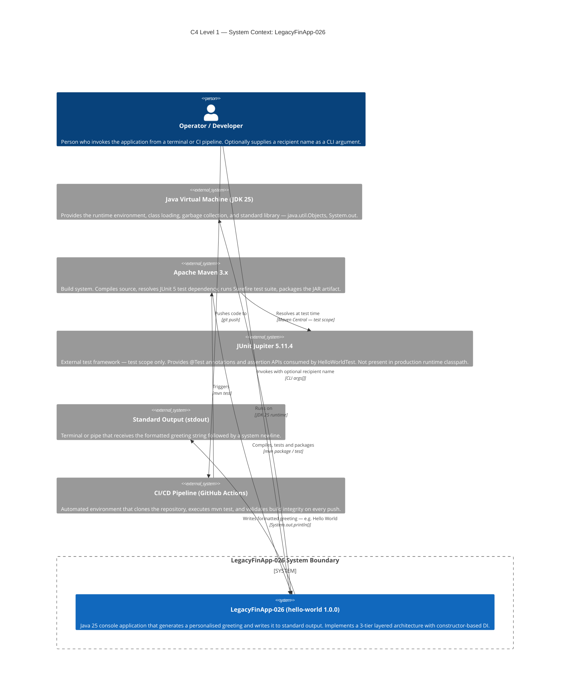
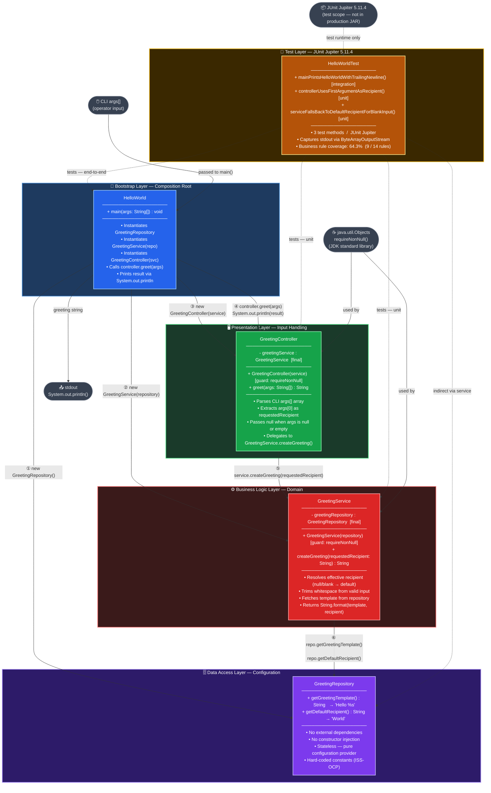
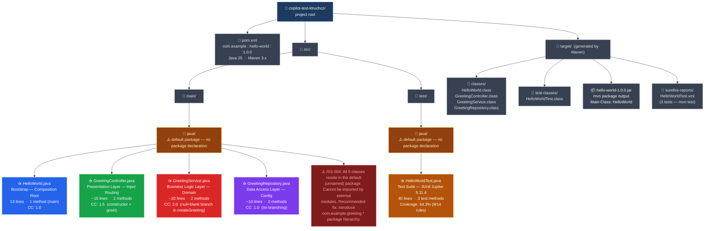
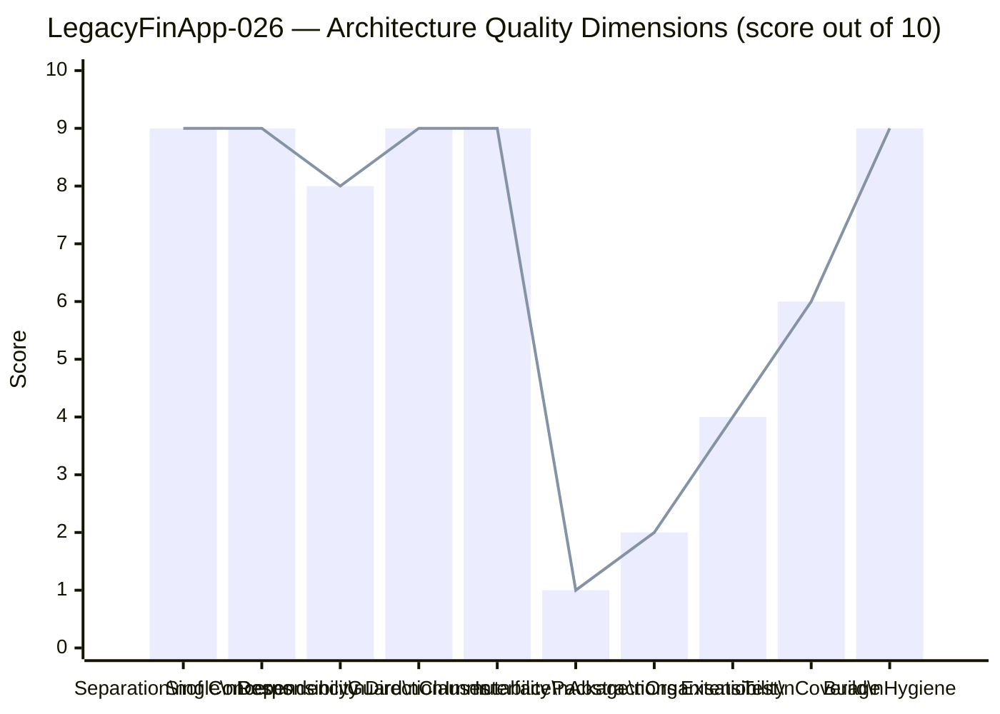
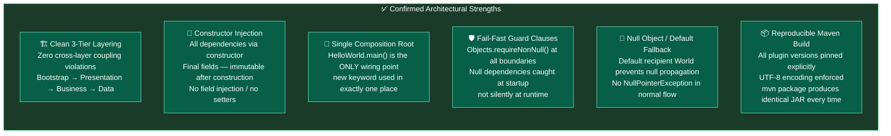
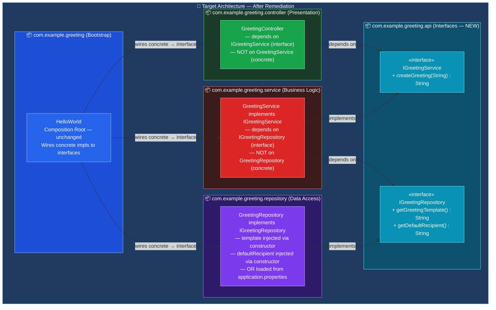

# Architecture Diagrams — LegacyFinApp-026

> **Project:** LegacyFinApp-026 · **Language:** Java 25 · **Build:** Maven 3.x  
> **Architecture:** Classic 3-Tier Layered + Composition Root Pattern  
> **Generated by:** architecture-analyzer agent  
> **Source inputs:** `analysis_results.json`, `ast_analysis.json`, `code_assessment.json`, `uml_diagrams.md`, `bpmn_diagrams.md`, `documentation_report.md`  
> **Artifact:** `com.example:hello-world:1.0.0`  
> **Note:** Target directory `output/` did not exist and could not be auto-created; file saved to workspace root instead.

---

## Table of Contents

1. [C4 Context Diagram — System and Actors](#1-c4-context-diagram--system-and-actors)
2. [Component Architecture Diagram — Layers and Dependencies](#2-component-architecture-diagram--layers-and-dependencies)
3. [Package Structure Diagram](#3-package-structure-diagram)
4. [Dependency Flow Diagram](#4-dependency-flow-diagram)
5. [Deployment / Runtime Diagram](#5-deployment--runtime-diagram)
6. [Architecture Summary and Recommendations](#6-architecture-summary-and-recommendations)

---

## 1. C4 Context Diagram — System and Actors

Highest-level view of **LegacyFinApp-026** in its operational environment. Shows the system boundary, the primary actor, and all external systems the application interacts with at runtime and build time.

**Context summary:**

| Actor / System | Role | Notes |
|---|---|---|
| **Operator / Developer** | Only human actor | Provides optional CLI argument; receives stdout output |
| **JVM (JDK 25)** | Runtime host | Provides `java.util.Objects`, `String`, `System.out` |
| **Maven 3.x** | Build orchestrator | Compiles, tests, packages — owns the full lifecycle |
| **JUnit Jupiter 5.11.4** | Test framework | **Test scope only** — absent from production JAR |
| **stdout** | Output channel | The sole output medium — no GUI, no network, no DB |
| **GitHub Actions** | CI/CD runner | Triggers `mvn test`; reports pass/fail per commit |

---

## 2. Component Architecture Diagram — Layers and Dependencies

Detailed view of all **five components** across four architectural layers — their responsibilities, relationships, composition-root wiring, and guard-clause boundaries.

**Key architectural observations:**

| Concern | Detail |
|---------|--------|
| **Dependency direction** | Strictly top-down: Bootstrap → Controller → Service → Repository. Zero upward references. |
| **Composition root** | `HelloWorld.main()` is the **sole location** where `new` keywords appear for application classes. |
| **Immutability** | All inter-layer references are `final` fields — set once at construction, never reassigned. |
| **Guard clauses** | `Objects.requireNonNull()` in Controller and Service constructors enforces fail-fast at object creation. |
| **No circular dependencies** | The dependency graph is a strict DAG (Directed Acyclic Graph) with no cycles. |
| **Test isolation** | `HelloWorldTest` sits outside the production stack; `junit-jupiter` is absent from the production classpath. |

---

## 3. Package Structure Diagram

Physical source-file layout on disk, Maven standard directory layout, and logical grouping of classes into architectural layers.

**Package metrics:**

| Metric | Current Value | Target Value |
|--------|--------------|-------------|
| Package depth | 0 (default) | 3 (`com.example.greeting.*`) |
| Classes per package | 4 in default | 1 per layer sub-package |
| Interface count | 0 | 2 (`IGreetingService`, `IGreetingRepository`) |
| Cyclomatic complexity avg | 1.4 ✅ | ≤ 2.0 |
| Total production lines | ~57 | ~80 (with interfaces + Javadoc) |
| Total test lines | ~40 | ~80 (full rule coverage) |

---

## 4. Dependency Flow Diagram

Complete **data and control flow** from operator invocation through to stdout output — including the startup wiring phase, runtime execution phase, recipient resolution decision tree, and message formatting chain.

```mermaid
flowchart TD
    subgraph STARTUP["🔧 Phase 1 — Startup: Object Graph Assembly  (HelloWorld.main)"]
        style STARTUP fill:#1e3a5f,stroke:#4a90d9,color:#ffffff

        S1["① new GreetingRepository()\nno-arg constructor\nstateless configuration object"]
        style S1 fill:#7c3aed,stroke:#c4b5fd,color:#ffffff

        S2["② new GreetingService(repository)\ninjects GreetingRepository"]
        style S2 fill:#dc2626,stroke:#fca5a5,color:#ffffff

        GUARD2{"requireNonNull(repository)\n— guard clause"}
        style GUARD2 fill:#0e7490,stroke:#67e8f9,color:#ffffff

        S3["③ new GreetingController(service)\ninjects GreetingService"]
        style S3 fill:#16a34a,stroke:#86efac,color:#ffffff

        GUARD3{"requireNonNull(service)\n— guard clause"}
        style GUARD3 fill:#0e7490,stroke:#67e8f9,color:#ffffff

        READY["✅ Object graph assembled\nAll dependencies wired\nReady for execution"]
        style READY fill:#065f46,stroke:#6ee7b7,color:#ffffff

        S1 --> S2 --> GUARD2
        GUARD2 -->|"null? → NullPointerException 💥"| NPE1["💥 NullPointerException\n(startup aborts)"]
        style NPE1 fill:#991b1b,stroke:#fca5a5,color:#ffffff
        GUARD2 -->|"not null ✅"| S3 --> GUARD3
        GUARD3 -->|"null? → NullPointerException 💥"| NPE2["💥 NullPointerException\n(startup aborts)"]
        style NPE2 fill:#991b1b,stroke:#fca5a5,color:#ffffff
        GUARD3 -->|"not null ✅"| READY
    end

    subgraph RUNTIME["⚡ Phase 2 — Runtime: Greeting Execution"]
        style RUNTIME fill:#1a2a1a,stroke:#4ade80,color:#ffffff

        R1(["🖱️ String[] args\nreceived from JVM\n(CLI invocation)"])
        style R1 fill:#374151,stroke:#9ca3af,color:#e5e7eb

        R2["controller.greet(args)\n— GreetingController"]
        style R2 fill:#16a34a,stroke:#86efac,color:#ffffff

        R3{"args == null\nor args.length == 0?"}
        style R3 fill:#92400e,stroke:#fcd34d,color:#fef3c7

        R4A["requestedRecipient = args[0]\n(e.g. 'Copilot')"]
        style R4A fill:#16a34a,stroke:#86efac,color:#ffffff

        R4B["requestedRecipient = null\n(trigger default fallback)"]
        style R4B fill:#374151,stroke:#9ca3af,color:#e5e7eb

        R5["service.createGreeting(requestedRecipient)\n— GreetingService"]
        style R5 fill:#dc2626,stroke:#fca5a5,color:#ffffff

        subgraph RESOLUTION["🔍 Recipient Resolution  (GreetingService.createGreeting)"]
            style RESOLUTION fill:#3a1a1a,stroke:#f87171,color:#ffffff

            RES1{"requestedRecipient\n== null  or\n.isBlank() == true?"}
            style RES1 fill:#92400e,stroke:#fcd34d,color:#fef3c7

            RES2["repo.getDefaultRecipient()\nreturns 'World'"]
            style RES2 fill:#7c3aed,stroke:#c4b5fd,color:#ffffff

            RES3["requestedRecipient.trim()\nremoves leading/trailing whitespace"]
            style RES3 fill:#dc2626,stroke:#fca5a5,color:#ffffff

            RES4["effectiveRecipient resolved\ne.g. 'World'  or  'Copilot'"]
            style RES4 fill:#065f46,stroke:#6ee7b7,color:#ffffff

            RES1 -->|"Yes — null or blank"| RES2 --> RES4
            RES1 -->|"No — valid string"| RES3 --> RES4
        end

        subgraph FORMATTING["📝 Message Formatting  (GreetingService + GreetingRepository)"]
            style FORMATTING fill:#2d1b69,stroke:#a78bfa,color:#ffffff

            F1["repo.getGreetingTemplate()\nreturns 'Hello %s'"]
            style F1 fill:#7c3aed,stroke:#c4b5fd,color:#ffffff

            F2["String.format('Hello %s', effectiveRecipient)\nproduces final greeting string"]
            style F2 fill:#dc2626,stroke:#fca5a5,color:#ffffff

            F3["return greeting\ne.g. 'Hello World'\nor 'Hello Copilot'"]
            style F3 fill:#065f46,stroke:#6ee7b7,color:#ffffff

            F1 --> F2 --> F3
        end

        R6["controller.greet() returns String\nback to HelloWorld.main()"]
        style R6 fill:#16a34a,stroke:#86efac,color:#ffffff

        R7(["📤 System.out.println(greeting)\nwrites to stdout with trailing newline\ne.g.  Hello World⏎"])
        style R7 fill:#374151,stroke:#9ca3af,color:#e5e7eb

        R8(["🔚 JVM process exits\nreturn code: 0"])
        style R8 fill:#374151,stroke:#9ca3af,color:#e5e7eb
    end

    %% Phase 1 → Phase 2 handoff
    READY -->|"execution begins"| R1

    %% Runtime flow
    R1 --> R2
    R2 --> R3
    R3 -->|"No args — empty invocation"| R4B
    R3 -->|"Has args — named invocation"| R4A
    R4A --> R5
    R4B --> R5
    R5 --> RES1
    RES4 --> F1
    F3 --> R6
    R6 --> R7 --> R8
```

**Flow analysis:**

| Execution Property | Value |
|---|---|
| **Execution model** | Synchronous, single-threaded, sequential — no async or concurrent operations |
| **Total method calls (happy path)** | 6 (greet → createGreeting → getTemplate → getDefault → format → println) |
| **Decision branches** | 2 conditional gates: args-empty check + recipient null/blank check |
| **Null propagation** | Fully blocked — guard clauses at startup, default fallback at runtime |
| **Side effects** | Single `System.out.println()` write — no file I/O, no network, no DB |
| **Process lifetime** | Instantaneous — exits immediately after `println()` returns |
| **Failure modes** | `NullPointerException` at startup only (injecting null dependencies) |

---

## 5. Deployment / Runtime Diagram

How **LegacyFinApp-026** is built, packaged, deployed, and executed — including Maven build phases, JVM process lifecycle, class loading, and CI/CD integration with GitHub Actions.

```mermaid
graph LR
    subgraph DEV["💻 Developer Workstation / CI Runner"]
        style DEV fill:#1e3a5f,stroke:#4a90d9,color:#ffffff

        CODE["📁 Source Code\nHelloWorld.java\nGreetingController.java\nGreetingService.java\nGreetingRepository.java\npom.xml"]
        style CODE fill:#2563eb,stroke:#93c5fd,color:#ffffff

        TESTCODE["📁 Test Source\nHelloWorldTest.java"]
        style TESTCODE fill:#b45309,stroke:#fde68a,color:#ffffff

        MVNCMD["⌨️ mvn package\nor  mvn test\n(developer or CI runner)"]
        style MVNCMD fill:#374151,stroke:#9ca3af,color:#e5e7eb
    end

    subgraph BUILDPIPELINE["🏗️ Maven Build Pipeline — Lifecycle Phases"]
        style BUILDPIPELINE fill:#1a3a2a,stroke:#4ade80,color:#ffffff

        BP1["validate\n✓ POM syntax check\n✓ project structure"]
        style BP1 fill:#065f46,stroke:#6ee7b7,color:#ffffff

        BP2["compile\nmaven-compiler-plugin 3.13.0\nJava 25 source → JVM bytecode\n→ target/classes/*.class"]
        style BP2 fill:#065f46,stroke:#6ee7b7,color:#ffffff

        BP3["test-compile\nJUnit 5 added to test classpath\n(test scope — NOT in production)\n→ target/test-classes/HelloWorldTest.class"]
        style BP3 fill:#065f46,stroke:#6ee7b7,color:#ffffff

        BP4["test\nmaven-surefire-plugin 3.5.2\nRuns HelloWorldTest  (3 methods)\n✓ PASS  or  ✗ FAIL → build breaks"]
        style BP4 fill:#065f46,stroke:#6ee7b7,color:#ffffff

        BP5["package\nAssemble JAR\nManifest: Main-Class: HelloWorld\n→ target/hello-world-1.0.0.jar"]
        style BP5 fill:#065f46,stroke:#6ee7b7,color:#ffffff

        BP1 --> BP2 --> BP3 --> BP4 --> BP5
    end

    subgraph DEPS["📦 External Dependencies"]
        style DEPS fill:#2d1b69,stroke:#a78bfa,color:#ffffff

        MAVENCENTRAL["🌐 Maven Central\norg.junit.jupiter:junit-jupiter:5.11.4\nScope: TEST ONLY\nNOT included in hello-world-1.0.0.jar"]
        style MAVENCENTRAL fill:#7c3aed,stroke:#c4b5fd,color:#ffffff

        JDK25["☕ JDK 25 Standard Library\njava.util.Objects  — requireNonNull\njava.lang.String  — format, trim, isBlank\njava.lang.System  — out (PrintStream)\njava.io.PrintStream  — println"]
        style JDK25 fill:#7c3aed,stroke:#c4b5fd,color:#ffffff
    end

    subgraph JVMRUNTIME["⚡ JVM 25 Runtime Process"]
        style JVMRUNTIME fill:#3a1a1a,stroke:#f87171,color:#ffffff

        JVMCMD["java -jar hello-world-1.0.0.jar [name]\nor\njava HelloWorld [name]"]
        style JVMCMD fill:#dc2626,stroke:#fca5a5,color:#ffffff

        subgraph CLASSLOAD["🔃 JVM Classloader — On-Demand Class Loading"]
            style CLASSLOAD fill:#7f1d1d,stroke:#f87171,color:#ffffff
            CL1["HelloWorld.class  — loaded first  (Main-Class entry)"]
            CL2["GreetingRepository.class  — loaded at new GreetingRepository()"]
            CL3["GreetingService.class  — loaded at new GreetingService(repo)"]
            CL4["GreetingController.class  — loaded at new GreetingController(svc)"]
            style CL1 fill:#991b1b,stroke:#fca5a5,color:#ffffff
            style CL2 fill:#991b1b,stroke:#fca5a5,color:#ffffff
            style CL3 fill:#991b1b,stroke:#fca5a5,color:#ffffff
            style CL4 fill:#991b1b,stroke:#fca5a5,color:#ffffff
        end

        subgraph EXECSTACK["📞 Call Stack — Single Main Thread"]
            style EXECSTACK fill:#7f1d1d,stroke:#f87171,color:#ffffff
            E1["HelloWorld.main(args)\n— Composition Root — FRAME 1"]
            E2["GreetingController.greet(args)\n— FRAME 2"]
            E3["GreetingService.createGreeting(recipient)\n— FRAME 3"]
            E4["GreetingRepository.getGreetingTemplate()\nGreetingRepository.getDefaultRecipient()\n— FRAME 4"]
            style E1 fill:#2563eb,stroke:#93c5fd,color:#ffffff
            style E2 fill:#16a34a,stroke:#86efac,color:#ffffff
            style E3 fill:#dc2626,stroke:#fca5a5,color:#ffffff
            style E4 fill:#7c3aed,stroke:#c4b5fd,color:#ffffff
            E1 --> E2 --> E3 --> E4
        end

        JVMCMD --> CLASSLOAD
        JVMCMD --> EXECSTACK
    end

    subgraph CICD["🔄 CI/CD — GitHub Actions"]
        style CICD fill:#3a2800,stroke:#fbbf24,color:#ffffff

        GITPUSH["git push  (main branch)\nDeveloper triggers CI"]
        style GITPUSH fill:#b45309,stroke:#fde68a,color:#ffffff

        GHRUNNER["GitHub Actions Runner\n① actions/checkout\n② actions/setup-java  (JDK 25)\n③ mvn test\n④ Report: PASS / FAIL badge"]
        style GHRUNNER fill:#b45309,stroke:#fde68a,color:#ffffff

        GITPUSH --> GHRUNNER
    end

    subgraph OUTPUT["📤 Outputs"]
        style OUTPUT fill:#374151,stroke:#9ca3af,color:#e5e7eb

        JAROUT["📦 hello-world-1.0.0.jar\ntarget/ directory\nSelf-contained\nNo runtime dependencies"]
        style JAROUT fill:#374151,stroke:#9ca3af,color:#ffffff

        STDOUTOUT["🖥️ Terminal — stdout\nHello World\nor\nHello [name]"]
        style STDOUTOUT fill:#374151,stroke:#9ca3af,color:#ffffff

        TESTREPORT["📋 Surefire Report\ntarget/surefire-reports/\nHelloWorldTest.xml\n3 tests — PASS"]
        style TESTREPORT fill:#374151,stroke:#9ca3af,color:#ffffff
    end

    CODE --> MVNCMD
    TESTCODE --> MVNCMD
    MVNCMD --> BUILDPIPELINE
    MAVENCENTRAL -.->|"test scope — compile only"| BP3
    JDK25 -->|"compile + runtime classpath"| BP2
    BP4 --> TESTREPORT
    BP5 --> JAROUT
    JAROUT -->|"java -jar ..."| JVMRUNTIME
    JVMRUNTIME --> STDOUTOUT
    GHRUNNER -->|"delegates to"| BUILDPIPELINE
```

**Deployment characteristics:**

| Property | Value |
|----------|-------|
| **Artifact type** | Executable JAR (`hello-world-1.0.0.jar`) |
| **Runtime dependencies** | **Zero** — pure JDK 25, no third-party JARs needed at runtime |
| **Process type** | Short-lived CLI process — exits after single `println()` |
| **Memory footprint** | Minimal — 4 tiny class instances, no heap-intensive data structures |
| **Thread model** | Single main thread — no concurrency |
| **Startup time** | < 100 ms (JVM warm-up + trivial object creation) |
| **JUnit 5 in production JAR** | ❌ Excluded — test scope prevents inclusion |
| **CI gate** | `mvn test` must pass; 3/3 tests required green before merge |
| **Execution environments** | Any JDK 25-compatible JVM (Windows / Linux / macOS / Docker) |

---

## 6. Architecture Summary and Recommendations

### 6.1 Architecture Quality Scorecard

**Overall architecture score: 7.2 / 10** — Strong structural foundation, low complexity. Primary gaps in interface abstractions and package organisation.

---

### 6.2 Architectural Strengths

---

### 6.3 Identified Issues and Recommendations

```mermaid
graph TD
    subgraph ISSUES["⚠️ Architectural Issues — Prioritised"]
        style ISSUES fill:#1c1c1c,stroke:#9ca3af,color:#ffffff

        ISS1["🔴 HIGH — ISS-004\nNo Package Declarations\nAll 5 classes in unnamed default package\nImpact: Cannot be imported by external code\nFix: com.example.greeting  +  layer sub-packages"]
        style ISS1 fill:#991b1b,stroke:#fca5a5,color:#ffffff

        ISS2["🔴 HIGH — DIP Violation\nNo Interface Abstractions\nController couples to GreetingService concrete class\nService couples to GreetingRepository concrete class\nFix: Extract IGreetingService + IGreetingRepository\nHigh-level modules depend on abstractions not concretions"]
        style ISS2 fill:#991b1b,stroke:#fca5a5,color:#ffffff

        ISS3["🟡 MEDIUM — OCP Violation\nHard-coded Configuration in GreetingRepository\nHello %s and World are literal constants\nChange requires recompilation  (no extension point)\nFix: Constructor-inject template + default recipient\nor load from application.properties"]
        style ISS3 fill:#92400e,stroke:#fcd34d,color:#fef3c7

        ISS4["🟡 MEDIUM — Test Coverage 64.3%\n5 of 14 business rules not covered by tests\nMissing: null args  ·  multi-arg  ·  empty-string\n         whitespace-only name  ·  template format\nFix: Add 5 targeted @Test methods to HelloWorldTest"]
        style ISS4 fill:#92400e,stroke:#fcd34d,color:#fef3c7

        ISS5["🟢 LOW — No Javadoc\n0 of 5 classes have Javadoc comments\nFix: Add @param @return @throws\nto all public methods — 30 min effort"]
        style ISS5 fill:#065f46,stroke:#6ee7b7,color:#ffffff

        ISS6["🟢 LOW — No Logging Framework\nSystem.out.println used directly in HelloWorld\nCannot control log level or format\nFix: Introduce SLF4J facade + Logback backend"]
        style ISS6 fill:#065f46,stroke:#6ee7b7,color:#ffffff
    end
```

---

### 6.4 Target Architecture (Recommended Evolution)

The diagram below shows the recommended future state after applying all high-priority fixes — interface extraction, package hierarchy, and configuration externalisation.

---

### 6.5 Migration Roadmap

| Priority | Category | Change | Benefit | Effort |
|----------|----------|--------|---------|--------|
| 🔴 **1 — High** | Package Structure | Add `com.example.greeting` base package + `controller`, `service`, `repository`, `api` sub-packages | External imports enabled; IDE navigation improved; modular architecture enforced | **Low** (rename + move) |
| 🔴 **2 — High** | Interface Abstractions | Extract `IGreetingService` and `IGreetingRepository` interfaces in `api` package | DIP compliance; mockable in tests (no Mockito hacks needed); swappable implementations | **Low–Medium** (define 2 interfaces, update 3 `import`s) |
| 🟡 **3 — Medium** | Config Externalisation | Move `"Hello %s"` and `"World"` to constructor parameters or `application.properties` | OCP compliance — behaviour changes without recompilation | **Medium** (add config loading) |
| 🟡 **4 — Medium** | Test Coverage | Add 5 missing test cases: null args, empty-string, whitespace-name, multi-arg ignored, template format | Coverage: 64.3% → ~100% of business rules | **Low** (5 test methods) |
| 🟢 **5 — Low** | Javadoc | Add `@param`, `@return`, `@throws` to all public methods | IDE Javadoc tooltips; API documentation generation via `mvn javadoc:javadoc` | **Low** (~30 min) |
| 🟢 **6 — Low** | Logging | Replace `System.out.println` with SLF4J + Logback | Structured logs; log-level control; CI-friendly; production-grade observability | **Low** (add 1 dependency + config) |

---

> **Diagram format:** All 9 diagrams in this document use **Mermaid** syntax exclusively.  
> No PlantUML syntax. No ASCII art.  
>
> **Diagram legend:**
> - 🔵 **Blue** — Bootstrap / Composition Root layer  
> - 🟢 **Green** — Presentation / Controller layer  
> - 🔴 **Red** — Business Logic / Service layer  
> - 🟣 **Purple** — Data Access / Repository layer  
> - 🟠 **Amber** — Test layer (JUnit 5)  
> - ⚫ **Grey** — External systems, runtime environment, I/O  
> - 🩵 **Cyan** — Interfaces / Abstractions (target architecture)  
>
> **Total diagrams generated:** 9  
> C4 Context · Component Architecture · Package Structure · Dependency Flow ·  
> Deployment/Runtime · Quality Scorecard · Strengths · Issues · Target Architecture
