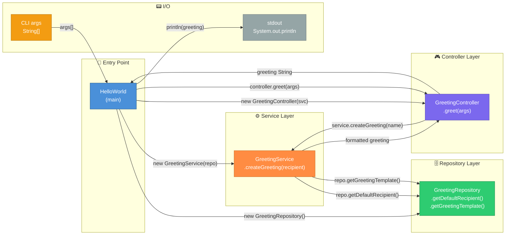
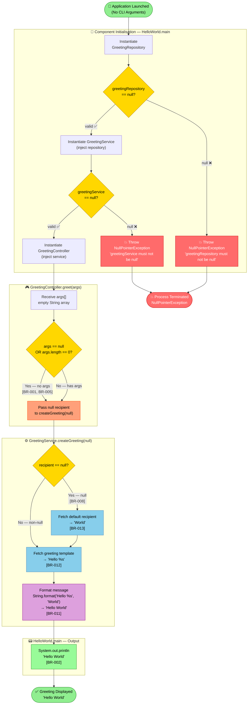
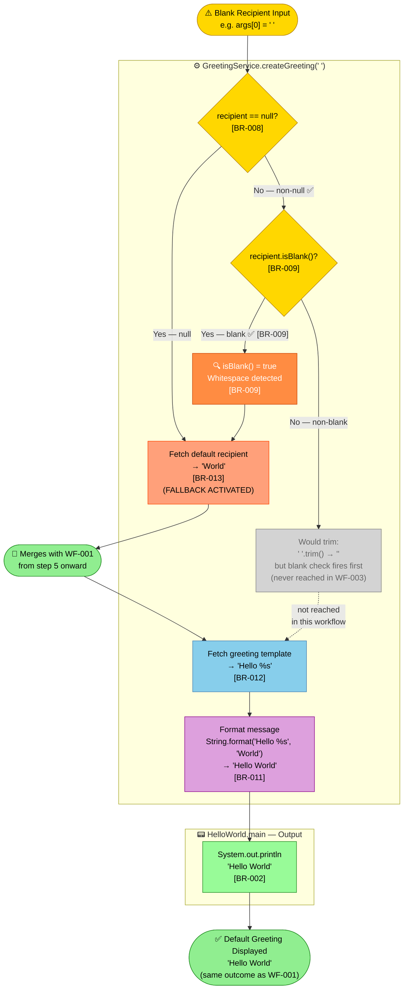
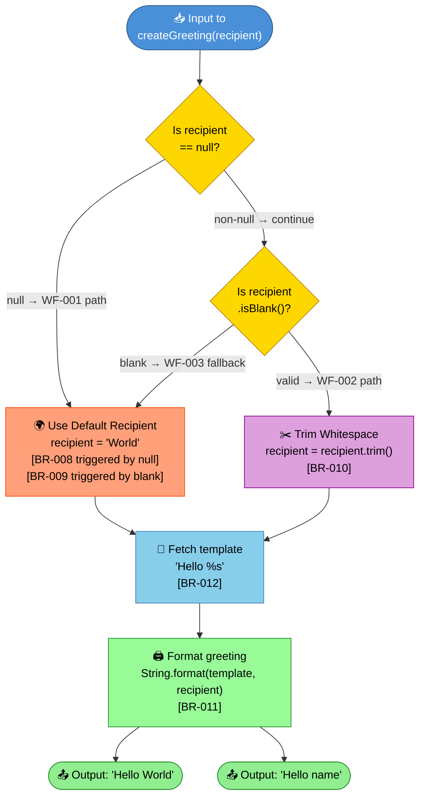
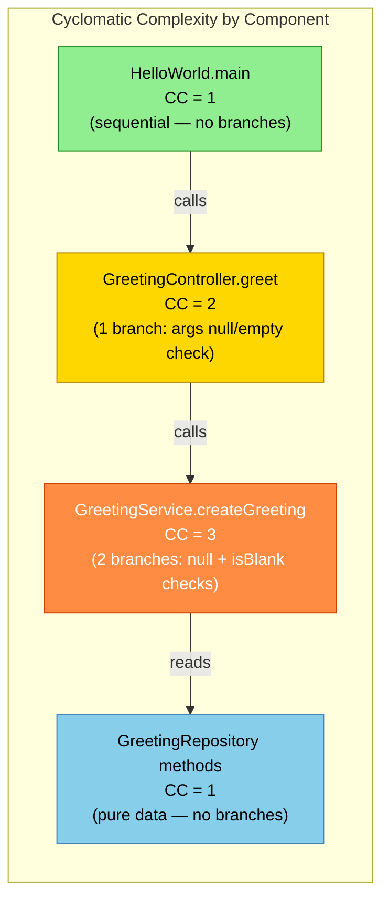
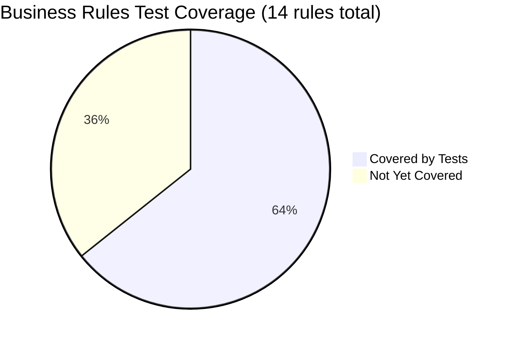

# BPMN 2.0 Business Process Diagrams
## Project: LegacyFinApp-026 — Java Hello World Greeting Application

> **Generated by**: BPMN Generator Agent  
> **Date**: 2025-01-01  
> **Source**: `business_rules_extractor_analysis.json` + `ast_analysis.json`  
> **Architecture**: Layered — `HelloWorld` (Entry) → `GreetingController` → `GreetingService` → `GreetingRepository`  
> **Note**: Requested output path `output/bpmn_diagrams.md` — target directory did not exist; saved to workspace root.

---

## Table of Contents

1. [System Architecture Overview](#system-architecture-overview)
2. [WF-001: Default Greeting Process](#wf-001-default-greeting-process)
3. [WF-002: Named Recipient Greeting Process](#wf-002-named-recipient-greeting-process)
4. [WF-003: Blank/Whitespace Recipient Fallback](#wf-003-blankwhitespace-recipient-fallback)
5. [Consolidated Decision Gateway Analysis](#consolidated-decision-gateway-analysis)
6. [Combined Master Workflow](#combined-master-workflow)
7. [Business Rules Traceability Matrix](#business-rules-traceability-matrix)
8. [Process Metrics Summary](#process-metrics-summary)

---

## System Architecture Overview

Before diving into individual workflows, the following diagram shows the static component dependency chain that underpins every process in this application.

---

## WF-001: Default Greeting Process

### Description

**Workflow ID**: WF-001  
**Name**: Default Greeting Workflow  
**Trigger**: Application launched with **zero** command-line arguments  
**Outcome**: `Hello World` printed to stdout  
**Business Rules Applied**: BR-001, BR-002, BR-005, BR-008, BR-011, BR-012, BR-013

The system initialises all three layers via constructor injection and falls back to the repository-supplied default recipient "World" because no CLI argument is provided.

### BPMN 2.0 Process Description

| Element | Type | Description |
|---------|------|-------------|
| `Application Launched (No Args)` | **Start Event** | User invokes `java HelloWorld` without arguments |
| `Initialise GreetingRepository` | **Service Task** | Instantiate repository — holds config data |
| `Initialise GreetingService` | **Service Task** | Constructor-inject repository; null-guard enforced (BR-007) |
| `Initialise GreetingController` | **Service Task** | Constructor-inject service; null-guard enforced (BR-003) |
| `Receive CLI Args` | **User Task** | OS passes empty `String[]` to `main(args)` |
| `Args null or empty?` | **Exclusive Gateway (XOR)** | Checks `args == null \|\| args.length == 0` |
| `Pass null to createGreeting` | **Script Task** | Controller forwards `null` recipient to service (BR-004, BR-005) |
| `Recipient null?` | **Exclusive Gateway (XOR)** | Service checks `requestedRecipient == null` |
| `Fetch Default Recipient` | **Service Task** | Repository returns `"World"` (BR-013) |
| `Fetch Greeting Template` | **Service Task** | Repository returns `"Hello %s"` (BR-012) |
| `Format Greeting Message` | **Script Task** | `String.format("Hello %s", "World")` → `"Hello World"` (BR-011) |
| `Print Greeting to stdout` | **Service Task** | `System.out.println(greeting)` with newline (BR-002) |
| `Greeting Displayed` | **End Event** | Process completes successfully |

### Mermaid Flowchart — WF-001

### WF-001 Process Elements

| Metric | Count |
|--------|-------|
| Start Events | 1 |
| End Events (Success) | 1 |
| End Events (Error) | 1 |
| Service Tasks | 6 |
| Script Tasks | 2 |
| Exclusive Gateways (XOR) | 4 |
| Sequence Flows | 14 |
| Swimlane Participants | 4 |

---

## WF-002: Named Recipient Greeting Process

### Description

**Workflow ID**: WF-002  
**Name**: Named Recipient Greeting Workflow  
**Trigger**: Application launched with **one or more** CLI arguments (e.g., `java HelloWorld Alice`)  
**Outcome**: `Hello Alice` printed to stdout  
**Business Rules Applied**: BR-002, BR-006, BR-010, BR-011, BR-012

The controller extracts `args[0]`, passes it to the service which trims whitespace and formats the personalised greeting. Arguments beyond index 0 are silently discarded (BR-006).

### BPMN 2.0 Process Description

| Element | Type | Description |
|---------|------|-------------|
| `Application Launched (With Args)` | **Start Event** | User invokes `java HelloWorld Alice` |
| `Initialise Components` | **Sub-Process** | Repository → Service → Controller (same as WF-001) |
| `Receive CLI Args` | **User Task** | OS passes `String[]{"Alice"}` to `main(args)` |
| `Args null or empty?` | **Exclusive Gateway (XOR)** | `args.length == 0` → false |
| `Extract args[0]` | **Script Task** | Controller reads `args[0]` = `"Alice"` (BR-006) |
| `Discard args[1..n]` | **Script Task** | Remaining args silently ignored (BR-006) |
| `Pass recipient to createGreeting` | **Service Task** | Controller calls `service.createGreeting("Alice")` |
| `Recipient null?` | **Exclusive Gateway (XOR)** | Service checks null → false |
| `Recipient blank?` | **Exclusive Gateway (XOR)** | Service checks `isBlank()` → false |
| `Trim Whitespace` | **Script Task** | `"Alice".trim()` → `"Alice"` (BR-010) |
| `Fetch Greeting Template` | **Service Task** | Repository returns `"Hello %s"` (BR-012) |
| `Format Greeting Message` | **Script Task** | `String.format("Hello %s", "Alice")` → `"Hello Alice"` (BR-011) |
| `Print Greeting to stdout` | **Service Task** | `System.out.println("Hello Alice")` (BR-002) |
| `Greeting Displayed` | **End Event** | Process completes |

### Mermaid Flowchart — WF-002

```mermaid
flowchart TD
    Start(["🚀 Application Launched\n(CLI arg: 'Alice')"])

    subgraph Init["🔧 Component Initialisation — HelloWorld.main"]
        InitAll["Instantiate Repository → Service → Controller\n(constructor injection chain)"]
    end

    subgraph Controller["🎮 GreetingController.greet(args)"]
        ReceiveArgs["Receive args[]\ne.g. String[]{'Alice'}"]
        CheckArgs{"args == null\nOR args.length == 0?"}
        ExtractArg0["Extract args[0]\n→ 'Alice'\n[BR-006]"]
        DiscardRest["Discard args[1..n]\n(silently ignored)\n[BR-006]"]
        CallService["Call createGreeting('Alice')"]
    end

    subgraph Service["⚙️ GreetingService.createGreeting('Alice')"]
        CheckNull{"recipient == null?\n[BR-008]"}
        CheckBlank{"recipient.isBlank()?\n[BR-009]"}
        TrimWS["Trim whitespace\n'Alice'.trim() → 'Alice'\n[BR-010]"]
        FetchTemplate["Fetch greeting template\n→ 'Hello %s'\n[BR-012]"]
        FormatMsg["Format message\nString.format('Hello %s', 'Alice')\n→ 'Hello Alice'\n[BR-011]"]
        FetchDefault["Fetch default recipient\n→ 'World'\n[BR-013]"]
    end

    subgraph Output["📟 HelloWorld.main — Output"]
        PrintOut["System.out.println\n'Hello Alice'\n[BR-002]"]
    end

    End(["✅ Greeting Displayed\n'Hello Alice'"])

    Start --> InitAll
    InitAll --> ReceiveArgs
    ReceiveArgs --> CheckArgs
    CheckArgs -->|"No — has args ✅"| ExtractArg0
    CheckArgs -->|"Yes — empty ⚠️"| CallService
    ExtractArg0 --> DiscardRest
    DiscardRest --> CallService
    CallService --> CheckNull
    CheckNull -->|"No — non-null ✅"| CheckBlank
    CheckNull -->|"Yes — null"| FetchDefault
    CheckBlank -->|"No — has content ✅\n[BR-010]"| TrimWS
    CheckBlank -->|"Yes — blank"| FetchDefault
    FetchDefault --> FetchTemplate
    TrimWS --> FetchTemplate
    FetchTemplate --> FormatMsg
    FormatMsg --> PrintOut
    PrintOut --> End

    style Start fill:#90EE90,stroke:#228B22,color:#000
    style End fill:#90EE90,stroke:#228B22,color:#000
    style CheckArgs fill:#FFD700,stroke:#B8860B,color:#000
    style CheckNull fill:#FFD700,stroke:#B8860B,color:#000
    style CheckBlank fill:#FFD700,stroke:#B8860B,color:#000
    style ExtractArg0 fill:#87CEEB,stroke:#4682B4,color:#000
    style DiscardRest fill:#D3D3D3,stroke:#808080,color:#000
    style TrimWS fill:#DDA0DD,stroke:#8B008B,color:#000
    style FetchTemplate fill:#87CEEB,stroke:#4682B4,color:#000
    style FormatMsg fill:#DDA0DD,stroke:#8B008B,color:#000
    style FetchDefault fill:#FFA07A,stroke:#FF4500,color:#000
    style PrintOut fill:#98FB98,stroke:#228B22,color:#000
    style InitAll fill:#E6E6FA,stroke:#7B68EE,color:#000
```

### WF-002 Process Elements

| Metric | Count |
|--------|-------|
| Start Events | 1 |
| End Events (Success) | 1 |
| Service Tasks | 4 |
| Script Tasks | 4 |
| Exclusive Gateways (XOR) | 3 |
| Sequence Flows | 15 |
| Swimlane Participants | 4 |

---

## WF-003: Blank/Whitespace Recipient Fallback

### Description

**Workflow ID**: WF-003  
**Name**: Blank Recipient Fallback Workflow  
**Trigger**: Service receives a recipient string that contains **only whitespace** (e.g., `"   "`)  
**Outcome**: `Hello World` printed to stdout (same as WF-001)  
**Business Rules Applied**: BR-009, BR-011, BR-012, BR-013

This workflow can be triggered either directly (service called with blank string) or as a branch within WF-002 when the CLI argument is all whitespace. The `String.isBlank()` method detects this condition and routes execution to the default-recipient path.

### BPMN 2.0 Process Description

| Element | Type | Description |
|---------|------|-------------|
| `Blank Input Received` | **Start Event** | Service called with whitespace-only string (e.g., `"   "`) |
| `Recipient null?` | **Exclusive Gateway (XOR)** | null check → false (string is non-null but blank) |
| `Recipient blank?` | **Exclusive Gateway (XOR)** | `"   ".isBlank()` → `true` (BR-009) |
| `Fallback: Fetch Default Recipient` | **Service Task** | Repository returns `"World"` (BR-013) |
| `Fetch Greeting Template` | **Service Task** | Repository returns `"Hello %s"` (BR-012) |
| `Format Greeting Message` | **Script Task** | `String.format("Hello %s", "World")` → `"Hello World"` (BR-011) |
| `Print Greeting to stdout` | **Service Task** | Output matches WF-001 result (BR-002) |
| `Greeting Displayed` | **End Event** | Fallback completes — user receives default greeting |

### Mermaid Flowchart — WF-003

### WF-003 Process Elements

| Metric | Count |
|--------|-------|
| Start Events | 1 |
| End Events (Success) | 1 |
| Service Tasks | 3 |
| Script Tasks | 1 |
| Exclusive Gateways (XOR) | 2 |
| Merge Points | 1 |
| Sequence Flows | 10 |
| Swimlane Participants | 2 |

---

## Consolidated Decision Gateway Analysis

This section analyses every decision point (Exclusive Gateway / XOR) across all three workflows, documenting inputs, conditions, and routing outcomes.

```mermaid
flowchart TD
    subgraph GW1["Gateway Group 1 — Dependency Null Guards (BR-003, BR-007)"]
        GW1_In["Constructor receives\ndependency object"]
        GW1_Q{"dependency == null?"}
        GW1_Y["💥 NullPointerException\n(fail fast — startup aborted)"]
        GW1_N["✅ Assign & Continue\nnormal startup"]
        GW1_In --> GW1_Q
        GW1_Q -->|"Yes — null"| GW1_Y
        GW1_Q -->|"No — valid"| GW1_N
    end

    subgraph GW2["Gateway 2 — CLI Args Presence Check (BR-001, BR-004, BR-005)"]
        GW2_In["args[] received\nby GreetingController.greet()"]
        GW2_Q{"args == null\nOR args.length == 0?"}
        GW2_Y["Pass null to service\n→ triggers default recipient path\n[BR-001 / BR-005]"]
        GW2_N["Extract args[0]\nas named recipient\n[BR-006]"]
        GW2_In --> GW2_Q
        GW2_Q -->|"Yes — no args"| GW2_Y
        GW2_Q -->|"No — has args"| GW2_N
    end

    subgraph GW3["Gateway 3 — Null Recipient Guard (BR-008)"]
        GW3_In["GreetingService.createGreeting\nreceives recipient param"]
        GW3_Q{"recipient == null?"}
        GW3_Y["Use default 'World'\nfrom repository\n[BR-008 / BR-013]"]
        GW3_N["Continue to\nblank-string check"]
        GW3_In --> GW3_Q
        GW3_Q -->|"Yes — null"| GW3_Y
        GW3_Q -->|"No — non-null"| GW3_N
    end

    subgraph GW4["Gateway 4 — Blank Recipient Guard (BR-009 / BR-010)"]
        GW4_In["Non-null recipient\nstring to evaluate"]
        GW4_Q{"recipient.isBlank()?"}
        GW4_Y["Fallback to default\n'World'\n[BR-009 / BR-013]"]
        GW4_N["Trim whitespace\nand use recipient\n[BR-010]"]
        GW4_In --> GW4_Q
        GW4_Q -->|"Yes — blank / whitespace-only"| GW4_Y
        GW4_Q -->|"No — printable content present"| GW4_N
    end

    style GW1_Q fill:#FFD700,stroke:#B8860B,color:#000
    style GW2_Q fill:#FFD700,stroke:#B8860B,color:#000
    style GW3_Q fill:#FFD700,stroke:#B8860B,color:#000
    style GW4_Q fill:#FFD700,stroke:#B8860B,color:#000
    style GW1_Y fill:#FF6B6B,stroke:#CC0000,color:#fff
    style GW2_Y fill:#FFA07A,stroke:#FF4500,color:#000
    style GW3_Y fill:#FFA07A,stroke:#FF4500,color:#000
    style GW4_Y fill:#FFA07A,stroke:#FF4500,color:#000
    style GW1_N fill:#90EE90,stroke:#228B22,color:#000
    style GW2_N fill:#90EE90,stroke:#228B22,color:#000
    style GW3_N fill:#90EE90,stroke:#228B22,color:#000
    style GW4_N fill:#90EE90,stroke:#228B22,color:#000
```

### Decision Gateway Reference Table

| Gateway ID | Location | Condition | True Branch | False Branch | Rules |
|------------|----------|-----------|-------------|--------------|-------|
| **GW-1a** | `GreetingController` constructor | `greetingService == null` | Throw NPE (fail-fast) | Assign & continue | BR-003 |
| **GW-1b** | `GreetingService` constructor | `greetingRepository == null` | Throw NPE (fail-fast) | Assign & continue | BR-007 |
| **GW-2** | `GreetingController.greet()` | `args == null \|\| args.length == 0` | Pass `null` to service | Extract `args[0]` | BR-001, BR-004, BR-005 |
| **GW-3** | `GreetingService.createGreeting()` | `requestedRecipient == null` | Use default `"World"` | Proceed to blank check | BR-008 |
| **GW-4** | `GreetingService.createGreeting()` | `requestedRecipient.isBlank()` | Use default `"World"` | Trim & use recipient | BR-009, BR-010 |

### Recipient Resolution Decision Tree

---

## Combined Master Workflow

This diagram unifies all three workflows into a single process view showing how different inputs route through the same application components.

```mermaid
flowchart TD
    Start(["🚀 java HelloWorld [args...]"])

    subgraph Bootstrap["🔧 Bootstrap — HelloWorld.main()"]
        Repo["new GreetingRepository()"]
        Svc["new GreetingService(repo)"]
        Ctrl["new GreetingController(service)"]
        NullRepo{"repo == null?\n[BR-007]"}
        NullSvc{"svc == null?\n[BR-003]"}
    end

    subgraph ControllerLayer["🎮 GreetingController.greet(args)"]
        CheckArgs{"args == null\nOR length == 0?\n[BR-001/004/005]"}
        ExtractName["Extract args[0]\n→ recipient name\n[BR-006]"]
        UseNull["recipient = null\n(no args supplied)"]
    end

    subgraph ServiceLayer["⚙️ GreetingService.createGreeting(recipient)"]
        CheckRecipNull{"recipient == null?\n[BR-008]"}
        CheckRecipBlank{"recipient.isBlank()?\n[BR-009]"}
        TrimRecipient["Trim whitespace\nrecipient.trim()\n[BR-010]"]
        GetDefault["repo.getDefaultRecipient()\n→ 'World'\n[BR-013]"]
        GetTemplate["repo.getGreetingTemplate()\n→ 'Hello %s'\n[BR-012]"]
        FormatGreeting["String.format(template, recipient)\n[BR-011]"]
    end

    subgraph OutputLayer["📟 Output — HelloWorld.main"]
        Print["System.out.println(greeting)\n[BR-002]"]
    end

    End1(["✅ 'Hello World'\nWF-001 / WF-003 outcome"])
    End2(["✅ 'Hello name'\nWF-002 outcome"])
    ErrEnd(["💥 NullPointerException\nstartup failure"])

    Start --> Repo
    Repo --> NullRepo
    NullRepo -->|"null ❌"| ErrEnd
    NullRepo -->|"ok ✅"| Svc
    Svc --> NullSvc
    NullSvc -->|"null ❌"| ErrEnd
    NullSvc -->|"ok ✅"| Ctrl
    Ctrl --> CheckArgs

    CheckArgs -->|"empty / null — WF-001"| UseNull
    CheckArgs -->|"has args — WF-002/003"| ExtractName
    UseNull --> CheckRecipNull
    ExtractName --> CheckRecipNull

    CheckRecipNull -->|"null — default path"| GetDefault
    CheckRecipNull -->|"non-null"| CheckRecipBlank
    CheckRecipBlank -->|"blank — WF-003 fallback"| GetDefault
    CheckRecipBlank -->|"valid — WF-002 path"| TrimRecipient

    GetDefault --> GetTemplate
    TrimRecipient --> GetTemplate
    GetTemplate --> FormatGreeting
    FormatGreeting --> Print

    Print -->|"used default recipient"| End1
    Print -->|"used named recipient"| End2

    style Start fill:#4A90D9,color:#fff,stroke:#2C5F8A
    style End1 fill:#90EE90,stroke:#228B22,color:#000
    style End2 fill:#90EE90,stroke:#228B22,color:#000
    style ErrEnd fill:#FF6B6B,stroke:#CC0000,color:#fff
    style CheckArgs fill:#FFD700,stroke:#B8860B,color:#000
    style CheckRecipNull fill:#FFD700,stroke:#B8860B,color:#000
    style CheckRecipBlank fill:#FFD700,stroke:#B8860B,color:#000
    style NullRepo fill:#FFD700,stroke:#B8860B,color:#000
    style NullSvc fill:#FFD700,stroke:#B8860B,color:#000
    style GetDefault fill:#FFA07A,stroke:#FF4500,color:#000
    style TrimRecipient fill:#DDA0DD,stroke:#8B008B,color:#000
    style GetTemplate fill:#87CEEB,stroke:#4682B4,color:#000
    style FormatGreeting fill:#DDA0DD,stroke:#8B008B,color:#000
    style Print fill:#98FB98,stroke:#228B22,color:#000
    style UseNull fill:#FFB6C1,stroke:#FF69B4,color:#000
    style ExtractName fill:#87CEEB,stroke:#4682B4,color:#000
```

---

## Business Rules Traceability Matrix

The following table maps every business rule to the workflow(s) and BPMN element where it is enforced.

| Rule ID | Rule Summary | WF-001 | WF-002 | WF-003 | BPMN Element | Test Coverage |
|---------|-------------|:------:|:------:|:------:|-------------|:-------------:|
| **BR-001** | No CLI args → use default `"World"` | ✅ | — | — | GW-2 (true branch) | ✅ |
| **BR-002** | Output to stdout with newline | ✅ | ✅ | ✅ | `System.out.println` task | ✅ |
| **BR-003** | `GreetingService` must not be null in controller | ✅ | ✅ | ✅ | GW-1a constructor guard | ❌ |
| **BR-004** | `null` args array → pass null to service | ✅ | — | — | GW-2 (true branch, null case) | ❌ |
| **BR-005** | Empty args array → pass null to service | ✅ | — | — | GW-2 (true branch, empty case) | ✅ |
| **BR-006** | Only `args[0]` used; rest discarded | — | ✅ | — | Extract args[0] task | ✅ |
| **BR-007** | `GreetingRepository` must not be null in service | ✅ | ✅ | ✅ | GW-1b constructor guard | ❌ |
| **BR-008** | `null` recipient → use default | ✅ | — | — | GW-3 (true branch) | ✅ |
| **BR-009** | Blank recipient → use default | — | — | ✅ | GW-4 (true branch) | ✅ |
| **BR-010** | Non-blank recipient → trim whitespace | — | ✅ | — | Trim task after GW-4 | ❌ |
| **BR-011** | Format with template | ✅ | ✅ | ✅ | `String.format` task | ✅ |
| **BR-012** | Template is `"Hello %s"` | ✅ | ✅ | ✅ | `getGreetingTemplate()` task | ✅ |
| **BR-013** | Default recipient is `"World"` | ✅ | — | ✅ | `getDefaultRecipient()` task | ✅ |
| **BR-014** | Template has exactly one `%s` placeholder | ✅ | ✅ | ✅ | Repository contract (implicit) | ❌ |

**Legend**: ✅ = Applies / Covered &nbsp;|&nbsp; ❌ = Not Covered / Not Applicable &nbsp;|&nbsp; — = Not triggered in this workflow

---

## Process Metrics Summary

### Overall Statistics

| Metric | WF-001 | WF-002 | WF-003 | Master |
|--------|--------|--------|--------|--------|
| Start Events | 1 | 1 | 1 | 1 |
| Success End Events | 1 | 1 | 1 | 2 |
| Error End Events | 1 | 0 | 0 | 1 |
| Tasks (total) | 8 | 8 | 4 | 12 |
| Exclusive Gateways | 4 | 3 | 2 | 5 |
| Sequence Flows | 14 | 15 | 10 | 18 |
| Swimlane Participants | 4 | 4 | 2 | 4 |
| Business Rules Applied | 7 | 5 | 4 | 14 |

### Cyclomatic Complexity by Component

| Component | Cyclomatic Complexity | Branch Count | Risk Level |
|-----------|----------------------|--------------|------------|
| `HelloWorld.main` | 1 | 0 | 🟢 Low |
| `GreetingController.greet` | 2 | 1 (`args` null/empty check) | 🟢 Low |
| `GreetingService.createGreeting` | 3 | 2 (`null` + `isBlank` checks) | 🟡 Medium |
| `GreetingRepository` methods | 1 | 0 | 🟢 Low |

### Test Coverage Gap Analysis

**Uncovered rules requiring test attention:**

| Rule | Description | Risk Level | Suggested Test |
|------|-------------|:----------:|----------------|
| BR-003 | Null `GreetingService` injected into controller | 🔴 High | `new GreetingController(null)` → expect NPE |
| BR-004 | Null `args` array passed to `greet()` | 🟡 Medium | `controller.greet(null)` → expect default greeting |
| BR-007 | Null `GreetingRepository` injected into service | 🔴 High | `new GreetingService(null)` → expect NPE |
| BR-010 | Whitespace trimming on valid recipient | 🟡 Medium | `greet([" Alice "])` → expect `"Hello Alice"` |
| BR-014 | Template has exactly one `%s` placeholder | 🟡 Medium | Verify `getGreetingTemplate()` format contract |

---

*Document generated by BPMN Generator Agent for project **LegacyFinApp-026***  
*Source data: `business_rules_extractor_analysis.json`, `ast_analysis.json`*  
*All diagrams use Mermaid flowchart syntax — BPMN 2.0 semantics*
