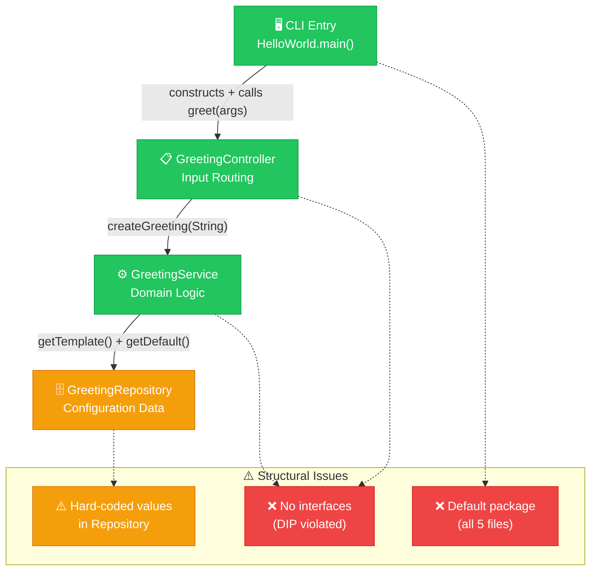
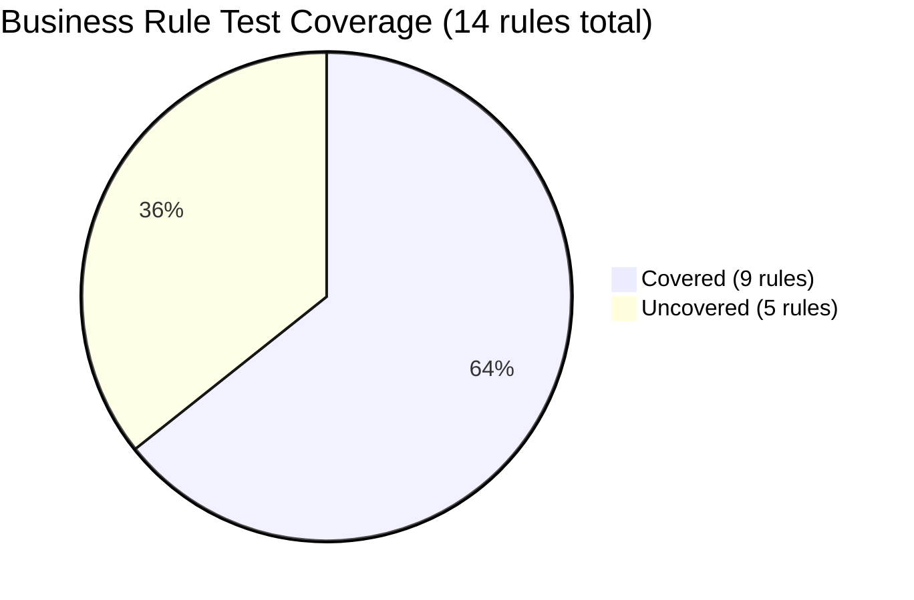
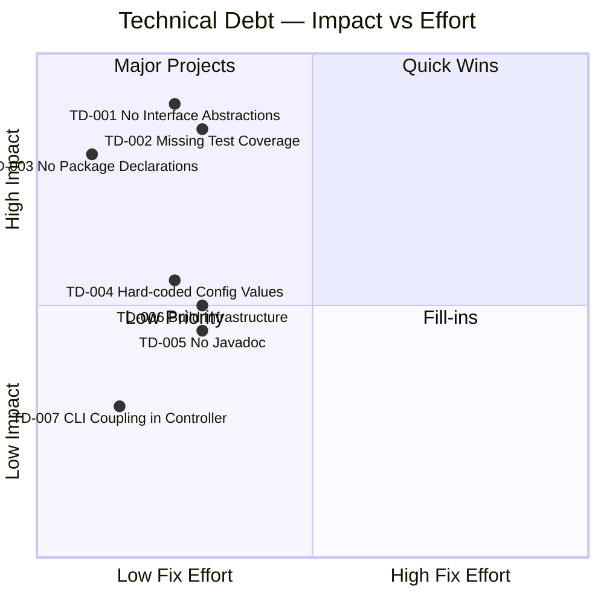
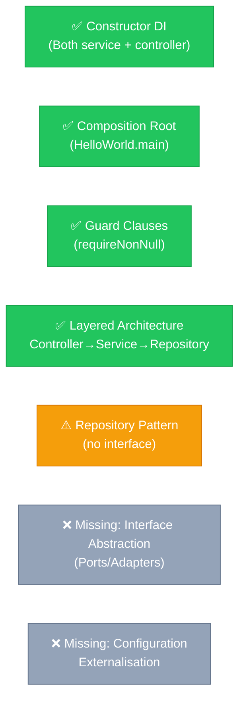
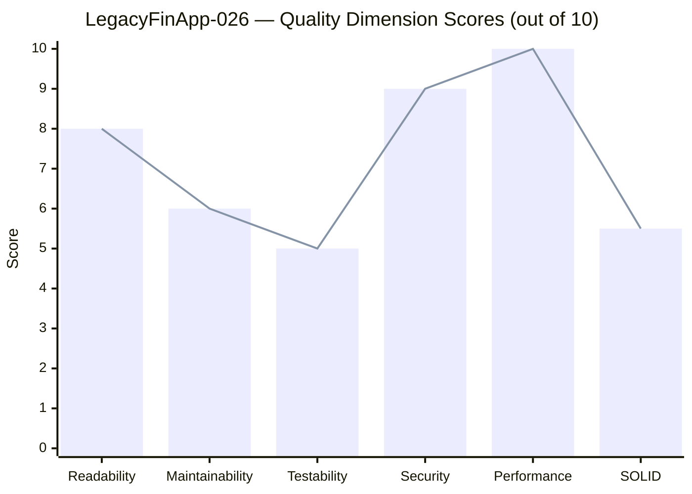

# Code Quality Assessment: LegacyFinApp-026

**Project**: LegacyFinApp-026 (Hello World)
**Assessment Date**: 2025-01-01
**Assessed By**: code-assessor agent
**Language**: Java 25 · Maven 3.x · JUnit Jupiter 5.11.4
**Source Files**: HelloWorld.java · GreetingController.java · GreetingService.java · GreetingRepository.java · HelloWorldTest.java

---

## Overall Quality Score: 7.2 / 10

```mermaid
radar
  title Quality Dimensions — LegacyFinApp-026
  "Readability"        : 8
  "Maintainability"    : 6
  "Testability"        : 5
  "Security"           : 9
  "Performance"        : 10
  "SOLID Compliance"   : 5.5
```

### Score Breakdown

| Dimension | Score | Notes |
|---|---|---|
| **Readability** | 8 / 10 | Clean, minimal code; easy to follow linear flow |
| **Maintainability** | 6 / 10 | Good structure, but no interfaces, no packages, hard-coded values |
| **Testability** | 5 / 10 | Constructor DI helps, but no interfaces prevent framework-free mocking |
| **Security** | 9 / 10 | Minimal attack surface — CLI only, no network or DB |
| **Performance** | 10 / 10 | All O(1), trivially optimal |
| **SOLID Compliance** | 5.5 / 10 | SRP excellent; DIP and ISP fail; OCP partial |

### Complexity Ratings

| Metric | Score | Interpretation |
|---|---|---|
| **Code Complexity** | 2 / 10 | Very simple; self-explanatory code flow |
| **Logic Complexity** | 2 / 10 | Trivial business rules with low branching |
| **Avg Cyclomatic Complexity** | 1.4 | Commendably low across all methods |

---

## Executive Summary

LegacyFinApp-026 is a structurally clean, minimal Java 25 console application with well-applied three-tier layered architecture and constructor-based dependency injection. The core logic is correct, the cyclomatic complexity is commendably low (avg 1.4), and the layered separation is clear and properly enforced.

**However**, the codebase carries moderate technical debt across four areas that will impede growth:

1. **No interface abstractions** — both `GreetingController → GreetingService` and `GreetingService → GreetingRepository` depend on concrete classes, violating the Dependency Inversion Principle and blocking framework-free unit testing
2. **Default package** — all 5 source files lack package declarations, preventing encapsulation and module-system compatibility
3. **35.7% business rules untested** — 5 of 14 rules have no test coverage, including critical constructor guard clauses
4. **Hard-coded configuration** — greeting template and default recipient are baked into source code

These are all **fixable within a single sprint** (estimated 7.5 hours total) and the codebase provides an excellent, clean foundation for the improvements.

---

## Architecture Overview



---

## SOLID Principles Compliance

```mermaid
quadrantChart
    title SOLID Compliance Matrix
    x-axis "Low Compliance" --> "High Compliance"
    y-axis "Low Impact" --> "High Impact"
    quadrant-1 "Critical Fix Needed"
    quadrant-2 "Well Implemented"
    quadrant-3 "Not Applicable / Low Risk"
    quadrant-4 "Monitor / Improve"
    SRP (Single Responsibility): [0.88, 0.75]
    OCP (Open Closed): [0.40, 0.65]
    LSP (Liskov Substitution): [0.90, 0.20]
    ISP (Interface Segregation): [0.15, 0.55]
    DIP (Dependency Inversion): [0.25, 0.85]
```

| Principle | Status | Score | Finding |
|---|---|---|---|
| **S** — Single Responsibility | ✅ PASS | 9/10 | Each class owns one concern. HelloWorld bootstraps, Controller routes input, Service resolves recipient, Repository provides configuration. Exemplary. |
| **O** — Open/Closed | ⚠️ PARTIAL | 4/10 | `GreetingRepository` hard-codes `"Hello %s"` and `"World"`. To change either value, the class must be modified rather than extended or configured. |
| **L** — Liskov Substitution | ✅ N/A | 10/10 | No inheritance hierarchy exists. The design avoids inheritance entirely — which is positive. LSP cannot be violated here. |
| **I** — Interface Segregation | ❌ FAIL | 2/10 | No interfaces are defined for `GreetingService` or `GreetingRepository`. Consumers depend on concrete classes, making ISP impossible to evaluate or enforce. |
| **D** — Dependency Inversion | ❌ FAIL | 3/10 | `GreetingController` depends on concrete `GreetingService`. `GreetingService` depends on concrete `GreetingRepository`. High-level modules depend on low-level modules — a direct DIP violation. |

---

## Business Rule Test Coverage



| Rule ID | Rule | Category | Covered? | Test Method |
|---|---|---|---|---|
| BR-001 | Default recipient 'World' when no args | Default Behavior | ✅ | `mainPrintsHelloWorldWithTrailingNewline` |
| BR-002 | Output written to stdout with newline | Output Format | ✅ | `mainPrintsHelloWorldWithTrailingNewline` |
| **BR-003** | **GreetingService injection must not be null** | **Validation** | ❌ | **NOT TESTED** |
| **BR-004** | **Null args treated as absent recipient** | **Input Handling** | ❌ | **NOT TESTED** |
| BR-005 | Empty args treated as absent recipient | Input Handling | ✅ | `mainPrintsHelloWorldWithTrailingNewline` |
| BR-006 | Only args[0] used; rest discarded | Input Handling | ✅ | `controllerUsesFirstArgumentAsRecipient` |
| **BR-007** | **GreetingRepository injection must not be null** | **Validation** | ❌ | **NOT TESTED** |
| BR-008 | Null recipient falls back to default | Recipient Resolution | ✅ | `mainPrintsHelloWorldWithTrailingNewline` |
| BR-009 | Blank recipient falls back to default | Recipient Resolution | ✅ | `serviceFallsBackToDefaultRecipientForBlankInput` |
| **BR-010** | **Non-blank recipient must be trimmed** | **Data Normalisation** | ❌ | **NOT TESTED** |
| BR-011 | Greeting formed by template + recipient | Message Formatting | ✅ | `controllerUsesFirstArgumentAsRecipient` |
| BR-012 | Template is `'Hello %s'` | Message Template | ✅ | `mainPrintsHelloWorldWithTrailingNewline` |
| BR-013 | Default recipient is `'World'` | Default Configuration | ✅ | `mainPrintsHelloWorldWithTrailingNewline` |
| **BR-014** | **Template must contain exactly one `%s`** | **Message Template** | ❌ | **NOT TESTED** |

> **⚠️ 5 uncovered rules include constructor guard clauses (BR-003, BR-007) — the most critical regression risk in the codebase.**

---

## Issues

### 🔴 Critical Issues (Criticality 4–5)

#### ISS-001 — No Package Declarations in Any Source File
- **Files**: All 5 source files
- **Criticality**: 4 / 5 (Severe)
- **Type**: Code Structure
- **Estimated Fix**: 0.5 hours

All Java classes reside in the unnamed default package. This violates a fundamental Java convention enforced by every project, CI tool, and IDE static analyser. The default package prevents package-private access control, causes incompatibilities with the Java Module System (JPMS), creates class-loading issues in some frameworks, and is universally rejected in production codebases.

**Solution**: Add `package com.example.greeting;` to `HelloWorld.java`, `package com.example.greeting.controller;` to `GreetingController.java`, `package com.example.greeting.service;` to `GreetingService.java`, and `package com.example.greeting.repository;` to `GreetingRepository.java`. Adjust `import` statements accordingly and update the `mainClass` in `pom.xml`.

---

#### ISS-002 — No Interface Abstractions: Dependency Inversion Principle Violated
- **Files**: `GreetingController.java` (line 8), `GreetingService.java` (line 8)
- **Criticality**: 4 / 5 (Severe)
- **Type**: Code Structure / SOLID
- **Estimated Fix**: 1.0 hour

`GreetingController` field `greetingService` is typed as the concrete class `GreetingService`. `GreetingService` field `greetingRepository` is typed as the concrete class `GreetingRepository`. No interfaces exist. This makes it impossible to inject test doubles without a mocking framework, impossible to provide alternative implementations without modifying consumers, and impossible to enforce any contract beyond the concrete class.

**Solution**: Extract `GreetingService` as an interface with method `String createGreeting(String requestedRecipient)`. Extract `GreetingRepository` as an interface with methods `String getGreetingTemplate()` and `String getDefaultRecipient()`. Rename the existing implementations to `DefaultGreetingService` and `InMemoryGreetingRepository`. Update `GreetingController` to accept `GreetingService` (the interface) and update `DefaultGreetingService` to accept `GreetingRepository` (the interface). Tests can then use simple lambda stubs for isolation.

---

#### ISS-004 — 5 Business Rules Have Zero Test Coverage
- **File**: `HelloWorldTest.java`
- **Criticality**: 4 / 5 (Severe)
- **Type**: Testing
- **Estimated Fix**: 1.5 hours
- **Uncovered Rules**: BR-003, BR-004, BR-007, BR-010, BR-014

Constructor guard clause behaviour (BR-003, BR-007) — the most critical regression risk — is entirely untested. If a future refactor accidentally removes `Objects.requireNonNull`, there is no failing test to catch it. The null-args path in the controller (BR-004), whitespace trimming (BR-010), and template placeholder validation (BR-014) are also uncovered.

**Solution**: Add the following test cases:
1. `GreetingController(null)` → assert `NullPointerException` with message `"greetingService must not be null"` (BR-003)
2. `controller.greet(null)` → assert `"Hello World"` (BR-004)
3. `new DefaultGreetingService(null)` → assert `NullPointerException` with message `"greetingRepository must not be null"` (BR-007)
4. `service.createGreeting("  Alice  ")` → assert `"Hello Alice"` (BR-010)
5. `assertTrue(repo.getGreetingTemplate().contains("%s"))` (BR-014)

---

### 🟡 Normal Issues (Criticality 3)

#### ISS-003 — Hard-Coded Magic Strings in GreetingRepository
- **File**: `GreetingRepository.java` (lines 7, 11)
- **Criticality**: 3 / 5 (Normal)
- **Type**: Maintainability
- **Estimated Fix**: 1.0 hour

`"Hello %s"` and `"World"` are business-meaningful values embedded directly in source code. Any change requires recompilation and redeployment. These values cannot vary between environments (dev greeting vs. production greeting), cannot be localised, and are not discoverable without reading source code.

**Solution**: Define `private static final String DEFAULT_TEMPLATE = "Hello %s";` and `private static final String DEFAULT_RECIPIENT = "World";` as named constants. Better yet, accept these values as constructor parameters with defaults, so `HelloWorld.main()` can pass configuration from properties files or environment variables. This aligns with the Open/Closed Principle and makes the values discoverable and configurable.

---

#### ISS-005 — Null Used as Business Sentinel Value in GreetingController
- **File**: `GreetingController.java` (line 16)
- **Criticality**: 3 / 5 (Normal)
- **Type**: Code Structure
- **Estimated Fix**: 1.0 hour

`greetingService.createGreeting(null)` explicitly passes `null` to signal "no recipient was provided." Using `null` as a business value mixes "absent" semantics with "null reference" semantics, forcing callers to understand an undocumented null contract and creating a risk of `NullPointerException` if the method signature is refactored.

**Solution**: Replace the null sentinel with `Optional<String>`. The controller passes `Optional.empty()` for absent args and `Optional.of(args[0])` otherwise. The service accepts `Optional<String> requestedRecipient` and chains `.filter(s -> !s.isBlank()).map(String::trim).orElseGet(greetingRepository::getDefaultRecipient)`. This makes the optional nature explicit in the API signature and eliminates all null checks.

---

#### ISS-006 — GreetingController Coupled to Raw CLI String[] Format
- **File**: `GreetingController.java` (line 14)
- **Criticality**: 3 / 5 (Normal)
- **Type**: Code Structure
- **Estimated Fix**: 1.0 hour

`greet(String[] args)` binds the controller API to the shape of a CLI args array. The controller is responsible for both CLI argument extraction (picking `args[0]`) and greeting orchestration — two concerns in one method. This prevents reuse in HTTP, gRPC, or message-driven contexts.

**Solution**: Move arg extraction logic to `HelloWorld.main()` (or a dedicated `CliAdapter` class). Change the controller to accept `String recipientName` (already extracted, nullable). The `greet()` method then has a single concern: determining how to call the service given an optional name. The main class becomes the CLI adapter and the controller becomes input-format-agnostic.

---

### 🔵 Minor Issues (Criticality 1–2)

#### ISS-007 — No Javadoc on Any Public API
- **File**: All source files (line 1 of each)
- **Criticality**: 2 / 5 (Minor)
- **Type**: Documentation
- **Estimated Fix**: 1.0 hour

The only comments present across all 5 files are `// generated by AI in Github cloud` — non-informative boilerplate that provides no value to readers. No class-level or method-level Javadoc exists. `@param`, `@return`, and `@throws` tags are absent everywhere.

**Solution**: Replace placeholder comments with Javadoc. At minimum: document each class's responsibility (1–2 sentences), add `@param` for `greet(String[] args)` and `createGreeting(String requestedRecipient)`, add `@return` for both methods, and add `@throws NullPointerException` to both constructors. This enables IDE hover documentation, `javadoc` tool output, and improves onboarding time.

---

#### ISS-008 — System.out Redirection Not Isolated via Test Lifecycle Hooks
- **File**: `HelloWorldTest.java` (line 14)
- **Criticality**: 2 / 5 (Minor)
- **Type**: Testing
- **Estimated Fix**: 0.5 hours

`System.setOut()` is called inside `mainPrintsHelloWorldWithTrailingNewline()` method body. Although `finally` restores it, there is no `@BeforeEach`/`@AfterEach` isolation: if other tests are added that also redirect `System.out`, they will interfere. Additionally, the test is tightly coupled to the global JVM `System.out` state.

**Solution**: Refactor `HelloWorld.main()` to accept an optional `PrintStream out` parameter for testability, and use it instead of `System.out` directly. In tests, pass a `ByteArrayOutputStream`-backed `PrintStream`. Alternatively, use `@RegisterExtension` with a `SystemOutExtension` from the `system-stubs-jupiter` library. Either approach eliminates global state mutation in tests.

---

#### ISS-009 — Single Test Class Covers Multiple Production Classes
- **File**: `HelloWorldTest.java` (line 10)
- **Criticality**: 2 / 5 (Minor)
- **Type**: Testing
- **Estimated Fix**: 0.5 hours

`HelloWorldTest` contains: an integration test for `HelloWorld.main()`, a unit test for `GreetingController`, and a unit test for `GreetingService`. Mixing integration and unit tests in one class, and covering multiple production classes, violates test cohesion and makes failures harder to isolate.

**Solution**: Split into `GreetingControllerTest`, `GreetingServiceTest`, `GreetingRepositoryTest`, and `HelloWorldIntegrationTest`. One test class per production class. This follows standard Java testing conventions, improves discoverability in IDEs, and makes it immediately clear which component caused a test failure.

---

#### ISS-010 — No Executable JAR Configuration in pom.xml
- **File**: `pom.xml` (line 39)
- **Criticality**: 2 / 5 (Minor)
- **Type**: Project Configuration
- **Estimated Fix**: 0.5 hours

The Maven build produces a JAR but without a `Main-Class` manifest attribute. Running `java -jar hello-world-1.0.0.jar` fails with "no main manifest attribute." Deployment and usage instructions are incomplete.

**Solution**: Add `maven-jar-plugin` configuration with `<mainClass>com.example.greeting.HelloWorld</mainClass>` (using the fully qualified name after adding package declarations) inside `<archive><manifest>`. Document `java -jar target/hello-world-1.0.0.jar` in README.md.

---

#### ISS-011 — No Maven Wrapper in Repository
- **File**: `pom.xml` / project root
- **Criticality**: 1 / 5 (Trivial)
- **Type**: Project Configuration
- **Estimated Fix**: 0.5 hours

Builds require a locally installed Maven version. There is no `mvnw` script to pin the Maven version and ensure reproducible builds.

**Solution**: Run `mvn wrapper:wrapper` to generate `mvnw`, `mvnw.cmd`, and `.mvn/wrapper/maven-wrapper.properties`. Commit these files. Update README.md to reference `./mvnw` instead of `mvn`.

---

#### ISS-012 — Dense Ternary in createGreeting() Reduces Future Maintainability
- **File**: `GreetingService.java` (line 15)
- **Criticality**: 2 / 5 (Minor)
- **Type**: Maintainability
- **Estimated Fix**: 0.5 hours

The single-line ternary `requestedRecipient == null || requestedRecipient.isBlank() ? ... : requestedRecipient.trim()` combines null check, blank check, and default fallback. While readable now, adding a third condition (e.g., a profanity filter) would make this unreadable.

**Solution**: Extract a private `resolveRecipient(String requestedRecipient)` method that documents the resolution logic with a clear if/else structure or an Optional chain. This separates recipient resolution from greeting formatting.

---

## Enhancement Recommendations

```mermaid
gantt
    title Enhancement Roadmap — Priority Order
    dateFormat X
    axisFormat %s h

    section Sprint 1 (Critical)
    ENH-001 Interface Abstractions        :crit, e1, 0, 1
    ENH-002 Test Suite Expansion          :crit, e2, 1, 3

    section Sprint 2 (High)
    ENH-003 Package Structure + Config    :e3, 3, 4

    section Sprint 3 (Medium)
    ENH-004 Optional Refactoring          :e4, 4, 5
    ENH-005 Build Pipeline Orchestration  :e5, 5, 7
```



### 💡 ENH-001 — Introduce Interface Abstractions for DIP Compliance
**Priority**: 🔴 5 / 5 (Critical) · **Estimated Effort**: 1 hour

Refactor the layered architecture to depend on interfaces (ports) rather than concrete classes. Define `GreetingService` and `GreetingRepository` as interfaces, and rename the existing implementations to `DefaultGreetingService` and `InMemoryGreetingRepository`. Update `GreetingController` to accept `GreetingService` (interface) and `DefaultGreetingService` to accept `GreetingRepository` (interface).

**Benefits**:
- Enables unit testing with simple lambda stubs — no Mockito framework required
- Supports alternative implementations (e.g., a database-backed `JdbcGreetingRepository`) without changing callers
- Achieves full DIP and ISP compliance
- Makes the API contract explicit and enforceable

```java
// Define interfaces
public interface GreetingService {
    String createGreeting(String requestedRecipient);
}
public interface GreetingRepository {
    String getGreetingTemplate();
    String getDefaultRecipient();
}

// Rename implementations
public class DefaultGreetingService implements GreetingService { ... }
public class InMemoryGreetingRepository implements GreetingRepository { ... }

// Controller uses interface — testable with a lambda stub
class GreetingControllerTest {
    @Test
    void greet_withNullArgs_returnsDefault() {
        GreetingService stub = recipient -> "Hello Stub";
        var controller = new GreetingController(stub);
        assertEquals("Hello Stub", controller.greet(null));
    }
}
```

---

### 💡 ENH-002 — Expand Test Suite to 100% Business Rule Coverage
**Priority**: 🔴 5 / 5 (Critical) · **Estimated Effort**: 2 hours

Add focused test classes for each production class and cover all 5 uncovered business rules. Split `HelloWorldTest` into `GreetingControllerTest`, `GreetingServiceTest`, `GreetingRepositoryTest`, and `HelloWorldIntegrationTest`. Add `@ParameterizedTest` for boundary cases.

**Benefits**:
- Constructor guard clauses (BR-003, BR-007) become regression-protected
- Input normalisation (BR-010) is verified with boundary inputs
- Null-args path (BR-004) and template validation (BR-014) are covered
- CI failures become immediately actionable and scoped to a single class

```java
// GreetingControllerTest.java
class GreetingControllerTest {
    @Test
    void constructor_nullService_throwsNpeWithMessage() {   // BR-003
        var ex = assertThrows(NullPointerException.class,
            () -> new GreetingController(null));
        assertEquals("greetingService must not be null", ex.getMessage());
    }

    @Test
    void greet_nullArgs_returnsDefaultGreeting() {          // BR-004
        var controller = new GreetingController(
            new DefaultGreetingService(new InMemoryGreetingRepository()));
        assertEquals("Hello World", controller.greet(null));
    }
}

// GreetingServiceTest.java
class GreetingServiceTest {
    private final GreetingService service =
        new DefaultGreetingService(new InMemoryGreetingRepository());

    @Test
    void constructor_nullRepository_throwsNpeWithMessage() { // BR-007
        var ex = assertThrows(NullPointerException.class,
            () -> new DefaultGreetingService(null));
        assertEquals("greetingRepository must not be null", ex.getMessage());
    }

    @ParameterizedTest
    @CsvSource({"  Alice  , Hello Alice", "  Bob, Hello Bob", "Charlie  , Hello Charlie"})
    void createGreeting_paddedName_isTrimmed(String input, String expected) { // BR-010
        assertEquals(expected, service.createGreeting(input));
    }
}

// GreetingRepositoryTest.java
class GreetingRepositoryTest {
    @Test
    void getGreetingTemplate_containsExactlyOnePlaceholder() { // BR-014
        var template = new InMemoryGreetingRepository().getGreetingTemplate();
        assertEquals(1, template.chars().filter(c -> c == '%').count(),
            "Template must contain exactly one format specifier");
        assertTrue(template.contains("%s"));
    }
}
```

---

### 💡 ENH-003 — Establish Package Structure and Externalise Configuration
**Priority**: 🟠 4 / 5 (High) · **Estimated Effort**: 1.5 hours

Add package declarations to all classes, organise by layer, and extract hard-coded values from `GreetingRepository` into named constants or constructor-injected configuration.

**Benefits**:
- Enables package-private encapsulation
- Allows JPMS compatibility in future modularisation
- Makes greeting copy configurable without recompilation
- Named constants make magic strings discoverable and self-documenting

```java
// package com.example.greeting.repository;
public class InMemoryGreetingRepository implements GreetingRepository {
    private static final String DEFAULT_TEMPLATE  = "Hello %s";
    private static final String DEFAULT_RECIPIENT = "World";

    private final String template;
    private final String defaultRecipient;

    /** Default constructor uses built-in template and recipient. */
    public InMemoryGreetingRepository() {
        this(DEFAULT_TEMPLATE, DEFAULT_RECIPIENT);
    }

    /** Constructor for custom template/recipient (testability + configurability). */
    public InMemoryGreetingRepository(String template, String defaultRecipient) {
        this.template         = Objects.requireNonNull(template);
        this.defaultRecipient = Objects.requireNonNull(defaultRecipient);
    }

    @Override public String getGreetingTemplate()  { return template; }
    @Override public String getDefaultRecipient()  { return defaultRecipient; }
}
```

---

### 💡 ENH-004 — Replace Null Sentinel with Optional&lt;String&gt;
**Priority**: 🟡 3 / 5 (Medium) · **Estimated Effort**: 1 hour

Replace the `null` sentinel in `GreetingController → GreetingService` communication with `Optional<String>` to make the optional nature of the recipient explicit and type-safe.

**Benefits**:
- Eliminates null propagation between layers
- Makes the API contract unambiguous (`Optional.empty()` ≠ `null`)
- Enables cleaner functional-style chaining in `GreetingService`
- Prevents accidental NPEs if method internals are refactored

```java
// GreetingController.java
public String greet(String[] args) {
    Optional<String> recipient = (args != null && args.length > 0)
        ? Optional.of(args[0])
        : Optional.empty();
    return greetingService.createGreeting(recipient);
}

// GreetingService.java
public String createGreeting(Optional<String> requestedRecipient) {
    String recipient = requestedRecipient
        .filter(s -> !s.isBlank())
        .map(String::trim)
        .orElseGet(greetingRepository::getDefaultRecipient);
    return greetingRepository.getGreetingTemplate().formatted(recipient);
}
```

---

### 💡 ENH-005 — Orchestrate Build Pipeline: JaCoCo + Maven Wrapper + Executable JAR
**Priority**: 🟡 3 / 5 (Medium) · **Estimated Effort**: 1.5 hours

Complete the build infrastructure by adding JaCoCo coverage enforcement, a Maven Wrapper, and an executable JAR manifest.

**Benefits**:
- Reproducible builds across all developer machines and CI environments
- Coverage regressions caught automatically before merging
- JAR is directly deployable with `java -jar`
- Enforces minimum 80% branch coverage as a code quality gate

```xml
<!-- pom.xml additions -->

<!-- 1. Executable JAR -->
<plugin>
    <groupId>org.apache.maven.plugins</groupId>
    <artifactId>maven-jar-plugin</artifactId>
    <configuration>
        <archive><manifest>
            <mainClass>com.example.greeting.HelloWorld</mainClass>
        </manifest></archive>
    </configuration>
</plugin>

<!-- 2. JaCoCo coverage enforcement -->
<plugin>
    <groupId>org.jacoco</groupId>
    <artifactId>jacoco-maven-plugin</artifactId>
    <version>0.8.12</version>
    <executions>
        <execution><goals><goal>prepare-agent</goal></goals></execution>
        <execution>
            <id>report</id><phase>test</phase>
            <goals><goal>report</goal></goals>
        </execution>
        <execution>
            <id>check</id><phase>verify</phase>
            <goals><goal>check</goal></goals>
            <configuration>
                <rules><rule><limits><limit>
                    <counter>BRANCH</counter>
                    <value>COVEREDRATIO</value>
                    <minimum>0.80</minimum>
                </limit></limits></rule></rules>
            </configuration>
        </execution>
    </executions>
</plugin>

<!-- 3. Generate Maven Wrapper via CLI: mvn wrapper:wrapper -->
```

---

## Technical Debt Inventory



| Debt ID | Type | Description | Impact | Fix Time |
|---|---|---|---|---|
| **TD-001** | Design Debt | No interface abstractions — all inter-layer deps on concrete classes | 🔴 HIGH | 1.0 h |
| **TD-002** | Test Debt | 5/14 business rules untested (35.7%) including guard clauses | 🔴 HIGH | 2.0 h |
| **TD-003** | Code Debt | All 5 files in default package — no package declarations | 🔴 HIGH | 0.5 h |
| **TD-004** | Code Debt | Hard-coded `"Hello %s"` and `"World"` magic strings | 🟡 MEDIUM | 1.0 h |
| **TD-005** | Documentation Debt | Zero Javadoc; only non-informative AI placeholder comments | 🟡 MEDIUM | 1.0 h |
| **TD-006** | Infrastructure Debt | No executable JAR, no Maven Wrapper, no coverage tooling | 🟡 MEDIUM | 1.5 h |
| **TD-007** | Design Debt | Controller coupled to raw CLI `String[]` args format | 🟢 LOW | 0.5 h |

**Total Estimated Remediation**: **7.5 hours**

---

## Design Pattern Assessment



| Pattern | Status | Quality | Notes |
|---|---|---|---|
| Constructor-Based DI | ✅ Implemented | GOOD | `final` fields, null-guarded, immutable wiring |
| Composition Root | ✅ Implemented | GOOD | `HelloWorld.main()` assembles full graph before any logic runs |
| Guard Clauses | ✅ Implemented | GOOD | `Objects.requireNonNull` in both constructors with clear messages |
| Layered Architecture | ✅ Implemented | GOOD | Clean layer separation; no skip detected |
| Repository Pattern | ⚠️ Partial | PARTIAL | Concept exists but no interface; data is static, not persisted |
| Interface Abstraction / Ports | ❌ Missing | MISSING | Needed for DIP compliance and test isolation |
| Configuration Externalisation | ❌ Missing | MISSING | Hard-coded values violate OCP |

---

## Security Assessment

**Overall Risk Level**: 🟢 LOW RISK

| Finding | Severity | Notes |
|---|---|---|
| CLI argument used as greeting recipient without sanitisation | ℹ️ Informational | At stdout scope only, this poses no injection risk. Would need attention if output destination changes (HTML, DB). |
| `String.formatted()` with `%s` placeholder | ℹ️ Informational | Java's `String.formatted()` is not susceptible to format-string injection as in C `printf`. Safe at current scope. |

**Attack Surface**: CLI arguments only. No network, no database, no file I/O, no authentication, no serialisation. This application has the smallest possible attack surface for a Java program.

---

## Performance Assessment

**Overall Rating**: ✅ OPTIMAL

All operations are `O(1)`. The object graph construction in `main()` allocates exactly 3 objects. The greeting operation is a single string allocation and a stdout write. No loops, no collections, no blocking I/O beyond `println`. No performance optimisations are warranted or meaningful at this scale.

---

## Prioritised Remediation Roadmap

```mermaid
flowchart TD
    classDef sprint1 fill:#ef4444,color:#fff,stroke:#dc2626
    classDef sprint2 fill:#f59e0b,color:#fff,stroke:#d97706
    classDef sprint3 fill:#3b82f6,color:#fff,stroke:#2563eb
    classDef done   fill:#22c55e,color:#fff,stroke:#16a34a

    S1["🔴 Sprint 1 — Fix Immediately\n~4 hours"]:::sprint1
    S2["🟡 Sprint 2 — Schedule Soon\n~2.5 hours"]:::sprint2
    S3["🔵 Sprint 3 — Plan for Future\n~1 hour"]:::sprint3

    S1 --> T1["ISS-001: Add package declarations\n0.5 h"]:::sprint1
    S1 --> T2["ISS-002: Add interface abstractions\n1.0 h"]:::sprint1
    S1 --> T3["ISS-004: Cover 5 untested business rules\n1.5 h"]:::sprint1
    S1 --> T4["ISS-005: Replace null sentinel with Optional\n1.0 h"]:::sprint1

    S2 --> T5["ISS-003: Externalise hard-coded config\n1.0 h"]:::sprint2
    S2 --> T6["ISS-007: Add Javadoc\n1.0 h"]:::sprint2
    S2 --> T7["ISS-010: Add executable JAR manifest\n0.5 h"]:::sprint2

    S3 --> T8["ISS-006: Decouple controller from CLI String[]\n1.0 h"]:::sprint3
    S3 --> T9["ISS-008/009: Refactor test isolation\n0.5 h"]:::sprint3
    S3 --> T10["ISS-011: Add Maven Wrapper\n0.5 h"]:::sprint3
```



| Priority | Issue | Description | Hours |
|---|---|---|---|
| 1 | ISS-001 | Add package declarations to all source files | 0.5 |
| 2 | ISS-002 | Extract interfaces for GreetingService and GreetingRepository | 1.0 |
| 3 | ISS-004 | Add tests for 5 uncovered business rules | 1.5 |
| 4 | ISS-005 | Replace null sentinel with Optional<String> | 1.0 |
| 5 | ISS-003 | Externalise hard-coded template and default recipient | 1.0 |
| 6 | ISS-007 | Add Javadoc to all public classes and methods | 1.0 |
| 7 | ISS-010 | Configure executable JAR manifest in pom.xml | 0.5 |
| 8 | ISS-006 | Decouple controller from raw CLI String[] args | 1.0 |
| 9 | ISS-008/009 | Refactor test isolation and split test classes | 0.5 |
| 10 | ISS-011 | Generate Maven Wrapper | 0.5 |
| — | ENH-005 | Add JaCoCo coverage enforcement to Maven build | 1.0 |
| **Total** | | | **~9.5 h** |

---

## Summary Scorecard



| What the Codebase Does Well | What Needs Improvement |
|---|---|
| ✅ Clean layered architecture (Controller → Service → Repository) | ❌ No interface abstractions (ISP + DIP violated) |
| ✅ Constructor-based DI with immutable `final` fields | ❌ All 5 files in default package |
| ✅ Guard clauses with descriptive error messages | ❌ 5/14 business rules untested |
| ✅ Composition Root pattern correctly applied | ❌ Hard-coded magic strings in GreetingRepository |
| ✅ Very low cyclomatic complexity (avg 1.4) | ❌ No Javadoc documentation |
| ✅ Minimal, focused methods with single responsibilities | ❌ Null sentinel used for business signalling |
| ✅ Modern Java 25 features (var, isBlank(), formatted()) | ❌ No executable JAR or coverage tooling |

> **Overall Verdict**: The codebase is a well-structured, clean starting point with correct business logic and good design instincts. The identified issues are all well-understood, easy to fix, and represent one sprint of focused improvement that would raise the overall score from **7.2 to an estimated 9.0+**.

---

*Assessment performed by code-assessor agent | LegacyFinApp-026 | 2025-01-01*
*Input sources: analysis_results.json, business_rules_extractor_analysis.json, ast_analysis.json*
