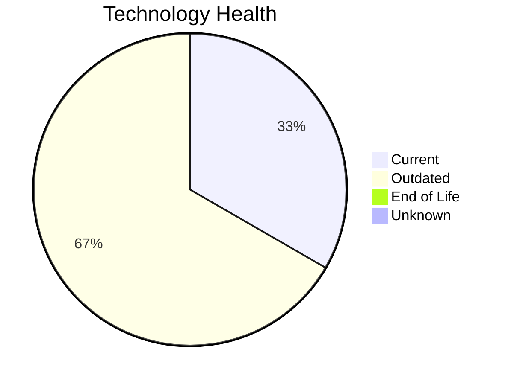

# Application Report: ERPApp-001

**ID:** app001
**Generated:** 2026-05-11

## Overview

| Attribute | Value |
|-----------|-------|
| Business Unit | Finance |
| Solution Type | Custom made |
| Deployment | On-Premise |
| Business Criticality | High |
| Users | 350 |
| Servers | 2 (sv01, sv02) |
| Containerized | No |
| CI/CD | No |
| Architecture | 1-Tier |

## Technology Stack

| Component | Technology | Version | Status |
|-----------|-----------|---------|--------|
| Os | AIX 7.2 | AIX 7.2 | 🟡 OUTDATED |
| Language | COBOL-2014 | COBOL-2014 | 🟡 OUTDATED |
| Database | Oracle 19c | Oracle 19c | 🟢 CURRENT_VERSION |

## Complexity Assessment

**Score:** 5/10 — **MEDIUM**
**Confidence:** 8/10

| Factor | Value |
|--------|-------|
| Technology Age (EOL/Outdated) | 0 EOL / 2 outdated |
| Integration (External Interfaces) | 5 |
| Infrastructure (Servers) | 2 |
| Business Criticality | High |
| Containerized | No |
| CI/CD Present | No |

> Complexity MEDIUM (5/10). Technology age: 6/10 (0 EOL, 2 outdated components). Integration: 4/10 (5 external interfaces). Infrastructure: 4/10 (2 servers). Business criticality High: 7/10. Architecture 1-tier: 8/10. Data complexity: 3/10.

## Modernization Scenarios

### Applicable Scenarios

#### ✅ Operating System Update

- **Reason:** OS AIX 7.2 has status OUTDATED. Security patches and OS update recommended.
- **Confidence:** 8/10
- **Cost:** €1,006 (one-time)
- **Savings:** €500/year

#### ✅ Switch to standard Linux Operating System

- **Reason:** Application runs on AIX 7.2 (proprietary AIX). Migration to standard Linux recommended.
- **Confidence:** 8/10
- **Cost:** €302 (one-time)
- **Savings:** €400/year

#### ✅ Application Migration to Cloud Infrastructure (Lift & Shift)

- **Reason:** Application is deployed on-premise. Migration to cloud infrastructure is applicable.
- **Confidence:** 8/10
- **Cost:** €5,028 (one-time)
- **Savings:** €2,700/year

#### ✅ Application Refactoring and De-coupling

- **Reason:** Custom application with 1-tier architecture. Refactoring and de-coupling recommended.
- **Confidence:** 8/10
- **Cost:** €251,420 (one-time)
- **Savings:** €135,000/year

#### ✅ Switch DB Engine to open-source database solution

- **Reason:** Proprietary database Oracle 19c detected. Switch to open-source (e.g., PostgreSQL) is applicable.
- **Confidence:** 8/10
- **Cost:** €25,142 (one-time)
- **Savings:** €15,000/year

#### ✅ Update outdated components

- **Reason:** Application has outdated components that should be updated.
- **Confidence:** 8/10

### Other Scenarios

| Scenario | Status | Reason |
|----------|--------|--------|
| Upgrade Legacy Databases | ✔️ FULFILLED | Database Oracle 19c is current version, no upgrade needed. |
| Applications Server replacement | ❌ NOT_APPLICABLE | No application server configured. |
| Switch to ARM-based CPU | 🚫 BLOCKED | AIX OS is POWER architecture, ARM migration not applicable. |
| Application Containerization | 🚫 BLOCKED | AIX (AIX 7.2) does not support standard container runtimes. |

## Financial Summary

| Metric | Value |
|--------|-------|
| Total One-Time Investment | €282,897 |
| Total Annual Savings | €153,600 |
| Break-Even | 1.8 years |

