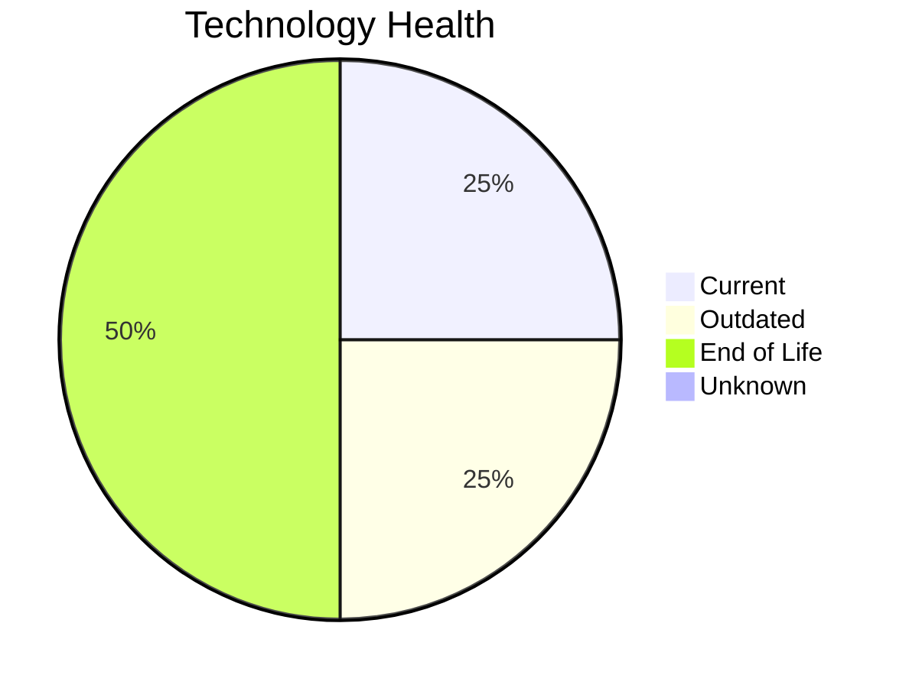

# Application Report: CRMApp-002

**ID:** app002
**Generated:** 2026-05-11

## Overview

| Attribute | Value |
|-----------|-------|
| Business Unit | Marketing |
| Solution Type | 3rd party software |
| Deployment | AWS |
| Business Criticality | Medium |
| Users | 1200 |
| Servers | 2 (sv05, sv07) |
| Containerized | No |
| CI/CD | Yes |
| Architecture | unknown |

## Technology Stack

| Component | Technology | Version | Status |
|-----------|-----------|---------|--------|
| Os | RHEL 7 | RHEL 7 | 🔴 EOL |
| Language | Java 11 | Java 11 | 🟡 OUTDATED |
| Database | Amazon RDS MySQL | Amazon RDS MySQL | 🟢 CURRENT_VERSION |
| Application Server | Websphere 7.0 | Websphere 7.0 | 🔴 EOL |

## Complexity Assessment

**Score:** 6/10 — **MEDIUM**
**Confidence:** 8/10

| Factor | Value |
|--------|-------|
| Technology Age (EOL/Outdated) | 2 EOL / 1 outdated |
| Integration (External Interfaces) | 8 |
| Infrastructure (Servers) | 2 |
| Business Criticality | Medium |
| Containerized | No |
| CI/CD Present | Yes |

> Complexity MEDIUM (6/10). Technology age: 9/10 (2 EOL, 1 outdated components). Integration: 6/10 (8 external interfaces). Infrastructure: 4/10 (2 servers). Business criticality Medium: 4/10. Architecture unknown: 8/10. Data complexity: 3/10.

## Modernization Scenarios

### Applicable Scenarios

#### ✅ Operating System Update

- **Reason:** OS RHEL 7 has status EOL. Security patches and OS update recommended.
- **Confidence:** 8/10
- **Cost:** €1,157 (one-time)
- **Savings:** €500/year

### Other Scenarios

| Scenario | Status | Reason |
|----------|--------|--------|
| Switch to standard Linux Operating System | ✔️ FULFILLED | Application already runs on standard Linux (RHEL 7). |
| Application Migration to Cloud Infrastructure (Lift & Shift) | ✔️ FULFILLED | Application is already deployed on AWS cloud infrastructure. |
| Upgrade Legacy Databases | ✔️ FULFILLED | Database Amazon RDS MySQL is current version, no upgrade needed. |
| Switch DB Engine to open-source database solution | ✔️ FULFILLED | Database Amazon RDS MySQL is already open-source. |
| Application Refactoring and De-coupling | ❌ NOT_APPLICABLE | 3rd party or open-source software; refactoring not in scope. |
| Switch to ARM-based CPU | 🚫 BLOCKED | 3rd party software may not support ARM architecture without vendor approval. |
| Applications Server replacement | 🚫 BLOCKED | 3rd party software; app server replacement depends on vendor. |
| Application Containerization | 🚫 BLOCKED | 3rd party software containerization depends on vendor support. |
| Update outdated components | 🚫 BLOCKED | 3rd party software; component updates depend on vendor release cycle. |

## Financial Summary

| Metric | Value |
|--------|-------|
| Total One-Time Investment | €1,157 |
| Total Annual Savings | €500 |
| Break-Even | 2.3 years |

