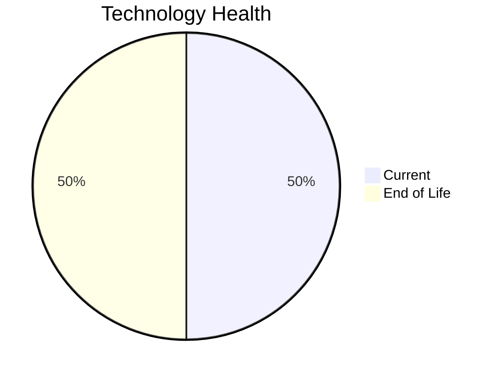

# Application Report: CRMApp-002

**ID:** app002  
**Generated:** 2026-05-13

## Overview

| Attribute | Value |
|-----------|-------|
| Business Unit | Marketing |
| Solution Type | 3rd party software |
| Deployment Type | AWS |
| Business Criticality | Medium |
| Users | 1200 |
| Servers | sv05, sv07 |
| Environments | 2 |
| External Interfaces | 8 |
| Containerized | No |
| CI/CD Present | Yes |
| Architecture | unknown |
| Data Classification | Internal |

## Technology Stack

| Component | Technology | Version | Status |
|-----------|-----------|---------|--------|
| Operating System | RHEL 7 | RHEL 7 | 🔴 EOL |
| Database | Amazon RDS MySQL | Amazon RDS MySQL | 🟢 Current |
| Programming Language | Java 11 | Java 11 | 🟢 Current |
| Application Server | WebSphere 7.0 | WebSphere 7.0 | 🔴 EOL |

## Complexity Assessment

**Score:** 6/10 — **MEDIUM**  
**Confidence:** 8/10

> Technology age score 9/10: Multiple EOL components detected. Integration score 6/10: 8 external interfaces. Infrastructure score 4/10: 2 server(s), 2 environment(s). Business criticality score 5/10: Medium criticality application. Architecture score 5/10: unknown architecture, not containerized, CI/CD present. Data score 2/10: Database in good standing.

| Factor | Value |
|--------|-------|
| Servers | 2 |
| Environments | 2 |
| External Interfaces | 8 |
| EOL Technologies | 2 |
| Outdated Technologies | 0 |
| Business Criticality | Medium |
| CI/CD Present | Yes |
| Containerized | No |

## Modernization Scenarios

### ✅ Applicable Scenarios

#### Operating System Update

- **Priority:** High
- **Effort:** Low
- **Effects:** security
- **One-Time Cost:** €1,157
- **Annual Savings:** €500/year
- **Reasoning:** OS (RHEL 7) is EOL and requires urgent update/replacement.

#### Application Server Replacement

- **Priority:** Medium
- **Effort:** Medium
- **Effects:** agility, cost
- **One-Time Cost:** €11,565
- **Annual Savings:** €10,800/year
- **Reasoning:** Application server (Websphere 7.0) is EOL and requires replacement.

#### Managed ARM Database

- **Priority:** Medium
- **Effort:** Low
- **Effects:** cost, sustainability
- **One-Time Cost:** €5,783
- **Annual Savings:** €5,000/year
- **Reasoning:** Managed database service could be migrated to ARM-based instances for cost and sustainability benefits.

#### Serverless Database Migration

- **Priority:** Medium
- **Effort:** Medium
- **Effects:** cost, agility
- **One-Time Cost:** €5,783
- **Annual Savings:** €15,000/year
- **Reasoning:** Managed cloud database is a candidate for serverless migration to further reduce operational overhead.

### Other Scenarios

| Scenario | Status | Reason |
|----------|--------|--------|
| Switch to Standard Linux OS | ✔️ Fulfilled | Application already runs on standard Linux OS (RHEL 7). |
| Switch to ARM-based CPU | 🚫 Blocked | 3rd party application with potential x86-specific dependencies. |
| Application Migration to Cloud (Lift & Shift) | ✔️ Fulfilled | Application is already hosted on cloud infrastructure (AWS). |
| Application Containerization | 🚫 Blocked | 3rd party / SaaS application: runtime packaging cannot be modified by the customer. |
| Application Refactoring and De-coupling | 🚫 Blocked | 3rd party or SaaS application. Internal architecture cannot be refactored by the customer. |
| Upgrade Legacy Databases | ✔️ Fulfilled | Database (Amazon RDS MySQL) is on a current supported version. |
| Switch DB Engine to Open-Source | ✔️ Fulfilled | Database (Amazon RDS MySQL) is already a managed open-source/cloud-native solution. |
| Update Outdated Components | 🚫 Blocked | 3rd party or SaaS application. Component versions are vendor-managed and not upgradeable by the cust... |
| Switch to Managed Database Service | ✔️ Fulfilled | Database (Amazon RDS MySQL) is already a managed cloud service. |
| Switch DB Engine to PostgreSQL | ❌ N/A | Database (Amazon RDS MySQL) is already open-source/managed; PostgreSQL migration not prioritized. |

## Financial Summary

| Metric | Value |
|--------|-------|
| Total One-Time Investment | €24,288 |
| Total Annual Savings | €31,300 |
| Break-Even | 0.8 years |
