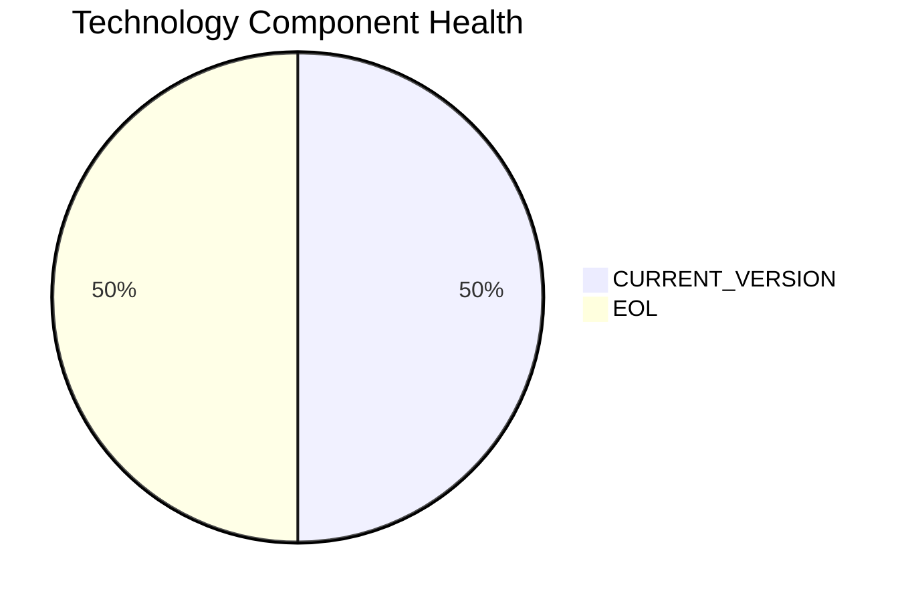

# CRMApp-002 — Application Modernization Report

> **Application ID:** app002  
> **Business Unit:** Marketing  
> **Criticality:** Medium

## Application Overview

| Attribute | Value |
|-----------|-------|
| Application ID | app002 |
| Name | CRMApp-002 |
| Business Unit | Marketing |
| Criticality | Medium |
| Status | Production |
| Deployment Type | AWS |
| Architecture | unknown |
| Containerized | No |
| CI/CD | Yes |
| Users | 1,200 |
| Environments | 2 |
| External Interfaces | 8 |
| Servers | sv05, sv07 |
| DB Storage (GB) | 500 |
| DB License Required | No |

## Technology Stack Assessment

| Component | Name | Status |
|-----------|------|--------|
| Operating System | RHEL 7 | 🔴 EOL |
| Database | Amazon RDS MySQL | 🟢 CURRENT_VERSION |
| Programming Language | Java 11 | 🟢 CURRENT_VERSION |
| Application Server | Websphere 7.0 | 🔴 EOL |

### Technology Health Distribution

## Complexity Assessment

**Overall Complexity:** 🟡 **MEDIUM** (Score: 6/10)

| Factor | Score | Weight |
|--------|-------|--------|
| Technology Age | 8 | 25% |
| Integration Complexity | 7 | 20% |
| Infrastructure | 5 | 15% |
| Business Criticality | 5 | 15% |
| Architecture | 6 | 15% |
| Data Complexity | 2 | 10% |

## Modernization Scenarios

### Applicable Scenarios

| Scenario | Reasoning |
|----------|-----------|
| OS Security Patch | OS RHEL 7 is EOL and requires security patching or upgrade. |
| Switch to Standard Linux | RHEL 7 is EOL. Upgrading to a current Linux distribution is recommended. |
| Switch to ARM CPU | Cloud deployment can leverage ARM-based instances (e.g., AWS Graviton) for cost savings. |
| App Server Replacement | Application server Websphere 7.0 is EOL and must be replaced. |
| Containerization | Application is not containerized. Containerization would improve deployment consistency and portability. |
| Refactor & Decouple | Application with unknown architecture could benefit from decoupling and modernization. |
| Update Outdated Components | Outdated/EOL components detected: RHEL 7, Websphere 7.0. Updates required. |
| Managed ARM DB | Existing managed database service can be evaluated for ARM-based instances for cost optimization. |
| Serverless DB Migration | Application already uses a managed database; migration to serverless variant is feasible. |
| Switch to PostgreSQL | Migrating from Amazon RDS MySQL to PostgreSQL would provide a more feature-rich open-source database. |

### All Scenario Statuses

| Scenario | Status |
|----------|--------|
| OS Security Patch | ✅ APPLICABLE |
| Switch to Standard Linux | ✅ APPLICABLE |
| Switch to ARM CPU | ✅ APPLICABLE |
| App Server Replacement | ✅ APPLICABLE |
| Cloud Deployment | 🔵 FULFILLED |
| Containerization | ✅ APPLICABLE |
| Refactor & Decouple | ✅ APPLICABLE |
| Upgrade Legacy DB | 🔵 FULFILLED |
| Switch to OSS DB | 🔵 FULFILLED |
| Update Outdated Components | ✅ APPLICABLE |
| Switch to Managed DB | 🔵 FULFILLED |
| Managed ARM DB | ✅ APPLICABLE |
| Serverless DB Migration | ✅ APPLICABLE |
| Switch to PostgreSQL | ✅ APPLICABLE |

## Financial Summary

| Metric | Value |
|--------|-------|
| Total Estimated Implementation Cost | $464,115.64 |
| Total Estimated Annual Savings | $272,700.00 |
| Estimated ROI Payback Period | 1.7 years |

### Cost/Savings Breakdown by Scenario

| Scenario | Est. Cost | Est. Annual Savings | ROI (years) |
|----------|-----------|---------------------|-------------|
| OS Security Patch | $1,156.53 | $500.00 | 2.31 |
| Switch to Standard Linux | $346.96 | $400.00 | 0.87 |
| Switch to ARM CPU | $5,782.65 | $1,000.00 | 5.78 |
| App Server Replacement | $11,565.30 | $10,800.00 | 1.07 |
| Containerization | $115,653.04 | $90,000.00 | 1.29 |
| Refactor & Decouple | $289,132.60 | $135,000.00 | 2.14 |
| Update Outdated Components | N/A | N/A | N/A |
| Managed ARM DB | $5,782.65 | $5,000.00 | 1.16 |
| Serverless DB Migration | $5,782.65 | $15,000.00 | 0.39 |
| Switch to PostgreSQL | $28,913.26 | $15,000.00 | 1.93 |
