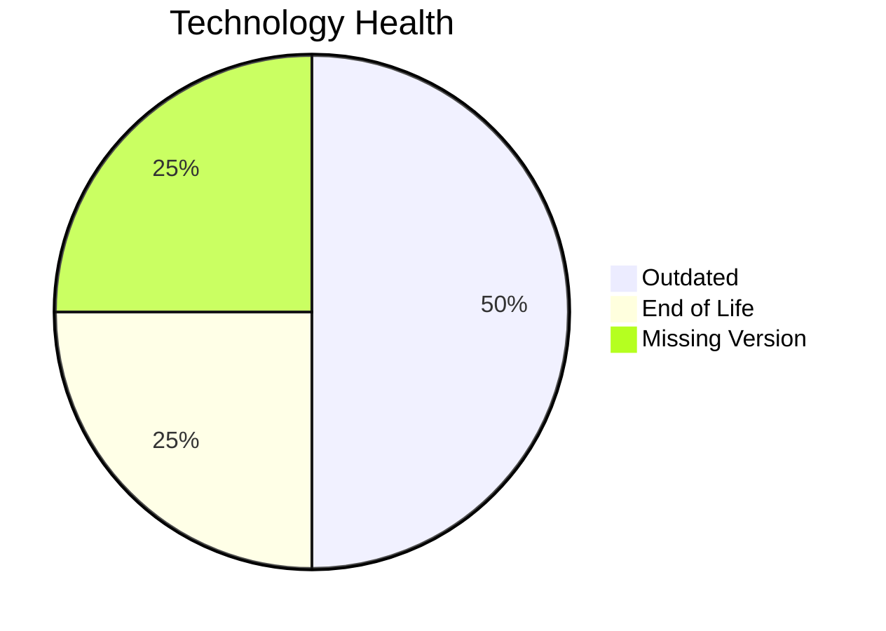

# Application Report: CRMApp-002

**ID:** app002  
**Generated:** 2026-05-11

## Overview

| Attribute | Value |
|-----------|-------|
| Business Unit | Marketing |
| Solution Type | 3rd party software |
| Deployment Type | AWS |
| Business Criticality | Medium |
| Users | 1200 |
| Servers | 2 |
| Architecture | unknown |
| Containerized | No |
| CI/CD | Yes |
| Data Classification | Internal |

## Technology Stack

| Component | Technology | Status |
|-----------|-----------|--------|
| Os | RHEL 7 | 🔴 EOL |
| Database | MySQL  | ⚪ NO_KNOWLEDGE |
| Language | Java 11 | 🟡 OUTDATED |
| Application Server | Websphere 7.0 | 🟡 OUTDATED |

## Complexity Assessment

**Score:** 6/10 — **MEDIUM**  
**Confidence:** 7

> Score 6/10 (MEDIUM): 1 EOL component(s), 2 outdated, 8 external interfaces, 2 server(s), criticality=Medium, architecture=unknown.

| Factor | Value |
|--------|-------|
| Servers | 2 |
| Interfaces | 8 |
| Environments | 2 |
| EOL Technologies | 1 |
| Outdated Technologies | 2 |
| CI/CD Present | Yes |
| Containerized | No |

## Modernization Scenarios

### Applicable Scenarios

#### ✅ Operating System Update

- **Priority:** High
- **Effort:** Low
- **Effects:** security
- **Cost:** €1,157 (one-time)
- **Annual Savings:** €500/year
- **Reasoning:** OS (rhel 7) is EOL and requires update.

#### ✅ Switch to ARM-based CPU

- **Priority:** Medium
- **Effort:** Medium
- **Effects:** cost, sustainability
- **Cost:** €5,783 (one-time)
- **Annual Savings:** €1,000/year
- **Reasoning:** Application runs on cloud and could benefit from ARM-based instances (e.g., AWS Graviton).

#### ✅ Applications Server replacement

- **Priority:** Medium
- **Effort:** Medium
- **Effects:** agility, cost
- **Cost:** €11,565 (one-time)
- **Annual Savings:** €10,800/year
- **Reasoning:** Application server (Websphere 7.0) is outdated.

#### ✅ Update outdated components

- **Priority:** High
- **Effort:** High
- **Effects:** security, agility, cost
- **Reasoning:** EOL components found: RHEL 7. Update required.

### Other Scenarios

| Scenario | Status | Reason |
|----------|--------|--------|
| Switch to standard Linux Operating System | ✔️ FULFILLED | Application already runs on standard Linux (RHEL 7). |
| Application Migration to Cloud Infrastructure (Lift & Shift) | ✔️ FULFILLED | Application is already deployed on cloud (AWS). |
| Application Containerization | ❌ NOT_APPLICABLE | 3rd party/SaaS application - containerization managed by vendor. |
| Application Refactoring and De-coupling | ❌ NOT_APPLICABLE | 3rd party/SaaS application - refactoring not applicable. |
| Upgrade Legacy Databases | ❓ LACK_OF_DATA | Database lifecycle status could not be determined. |
| Switch DB Engine to open-source database solution | ✔️ FULFILLED | Database (Amazon RDS MySQL) is already an open-source solution. |

## Financial Summary

| Metric | Value |
|--------|-------|
| Total One-Time Cost | €18,505 |
| Total Yearly Savings | €12,300 |
| Break-Even | 1.5 years |
