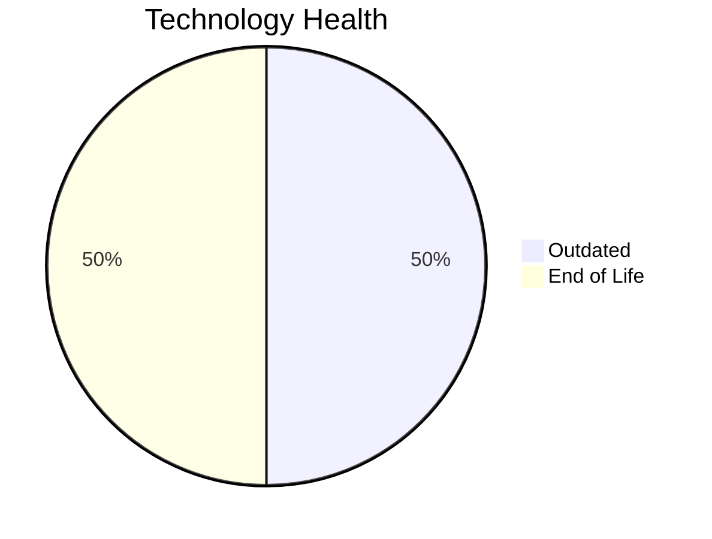

# Application Report: AnalyticsApp-003

**ID:** app003  
**Generated:** 2026-05-13

## Overview

| Attribute | Value |
|-----------|-------|
| Business Unit | IT |
| Solution Type | Open Source |
| Deployment Type | AWS |
| Business Criticality | Low |
| Users | 480 |
| Servers | sv03 |
| Environments | 1 |
| External Interfaces | 3 |
| Containerized | Yes |
| CI/CD Present | Yes |
| Architecture | 3-Tier |
| Data Classification | Public |

## Technology Stack

| Component | Technology | Version | Status |
|-----------|-----------|---------|--------|
| Operating System | RHEL 7 | RHEL 7 | 🔴 EOL |
| Database | PostgreSQL 13 | PostgreSQL 13 | 🟡 Outdated |
| Programming Language | Python 3.9 | Python 3.9 | 🟡 Outdated |
| Application Server | Apache Tomcat 6.x | Apache Tomcat 6.x | 🔴 EOL |

## Complexity Assessment

**Score:** 5/10 — **MEDIUM**  
**Confidence:** 8/10

> Technology age score 9/10: Multiple EOL components detected. Integration score 4/10: 3 external interfaces. Infrastructure score 2/10: 1 server(s), 1 environment(s). Business criticality score 3/10: Low criticality application. Architecture score 3/10: 3-Tier architecture, containerized, CI/CD present. Data score 4/10: Outdated database components present.

| Factor | Value |
|--------|-------|
| Servers | 1 |
| Environments | 1 |
| External Interfaces | 3 |
| EOL Technologies | 2 |
| Outdated Technologies | 2 |
| Business Criticality | Low |
| CI/CD Present | Yes |
| Containerized | Yes |

## Modernization Scenarios

### ✅ Applicable Scenarios

#### Operating System Update

- **Priority:** High
- **Effort:** Low
- **Effects:** security
- **One-Time Cost:** €1,006
- **Annual Savings:** €500/year
- **Reasoning:** OS (RHEL 7) is EOL and requires urgent update/replacement.

#### Switch to ARM-based CPU

- **Priority:** Medium
- **Effort:** Medium
- **Effects:** cost, sustainability
- **One-Time Cost:** €5,028
- **Annual Savings:** €900/year
- **Reasoning:** Application is containerized and runs on standard OS, making ARM migration feasible.

#### Application Server Replacement

- **Priority:** Medium
- **Effort:** Medium
- **Effects:** agility, cost
- **One-Time Cost:** €10,057
- **Annual Savings:** €10,800/year
- **Reasoning:** Application server (Apache Tomcat 6.1) is EOL and requires replacement.

#### Upgrade Legacy Databases

- **Priority:** High
- **Effort:** Medium
- **Effects:** security, agility
- **One-Time Cost:** €10,057
- **Annual Savings:** €10,000/year
- **Reasoning:** Database (PostgreSQL 13) is OUTDATED and approaching EOL.

#### Update Outdated Components

- **Priority:** High
- **Effort:** High
- **Effects:** security, agility, cost
- **Cost:** No financial data available
- **Reasoning:** Outdated or EOL components detected: RHEL 7, Apache Tomcat 6.x, PostgreSQL 13, Python 3.9. Updates required to maintain security and supportability.

### Other Scenarios

| Scenario | Status | Reason |
|----------|--------|--------|
| Switch to Standard Linux OS | ✔️ Fulfilled | Application already runs on standard Linux OS (RHEL 7). |
| Application Migration to Cloud (Lift & Shift) | ✔️ Fulfilled | Application is already hosted on cloud infrastructure (AWS). |
| Application Containerization | ✔️ Fulfilled | Application is already containerized. |
| Application Refactoring and De-coupling | 🔶 Partial | Application architecture (3-Tier) suggests some coupling. Partial refactoring may benefit the applic... |
| Switch DB Engine to Open-Source | ✔️ Fulfilled | Database (PostgreSQL 13) is already an open-source database engine. |
| Switch to Managed Database Service | ❌ N/A | Database is already cloud-hosted or scenario not applicable. |
| Managed ARM Database | ❌ N/A | Database is not on a managed cloud service; ARM database migration not applicable. |
| Serverless Database Migration | ❌ N/A | Application deployment pattern does not support serverless database migration at this time. |
| Switch DB Engine to PostgreSQL | ✔️ Fulfilled | Database (PostgreSQL 13) is already PostgreSQL or PostgreSQL-compatible. |

## Financial Summary

| Metric | Value |
|--------|-------|
| Total One-Time Investment | €26,148 |
| Total Annual Savings | €22,200 |
| Break-Even | 1.2 years |
