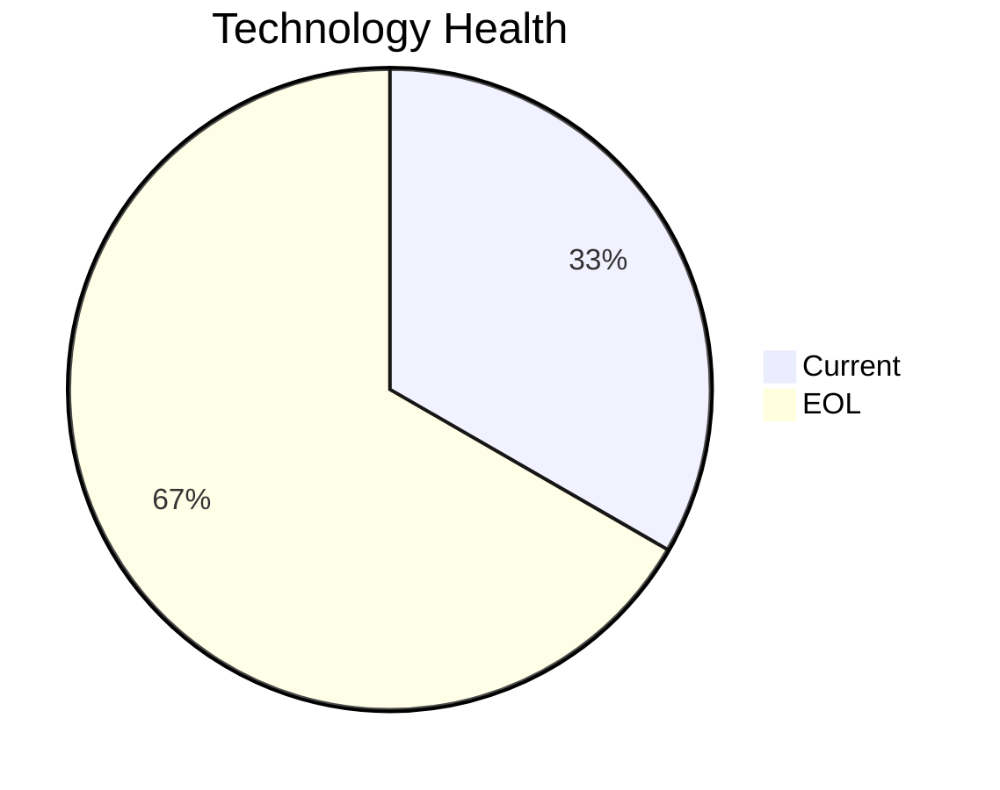

<!-- generated by AI in Github cloud -->
# HRApp-004 (app004)

## Application Overview

| Attribute | Value |
|-----------|-------|
| **App ID** | app004 |
| **Name** | HRApp-004 |
| **Status** | Production |
| **Criticality** | High |
| **Solution Type** | Custom made |
| **Deployment** | AWS, On-premise |
| **Containerized** | Yes |
| **Architecture** | 2-Tier |
| **Business Unit** | HR |
| **External Interfaces** | 6 |
| **Servers** | 2 |
| **Environments** | 2 |

## Technology Stack

| Component | Type | Version | Status | EOL Date |
|-----------|------|---------|--------|----------|
| Windows | os | Server 2012 | 🔴 EOL | 2023-10-10 |
| Microsoft IIS 8.0 | application_server | 8.0 | 🔴 EOL | 2023-10-10 |
| SQL Server 2019 | database | 2019 | 🟢 CURRENT | 2030-01-08 |

## Complexity Assessment

**Score: 6/10 (MEDIUM)**

Technology age score 8 (2 EOL, 0 outdated components). Integration score 5 (6 external interfaces). Infrastructure score 6 (2 servers, 2 environments). Criticality score 7 (High). Architecture score 3. Data score 5. Weighted final: 5.9 → 6 (MEDIUM).

| Factor | Value |
|--------|-------|
| Number Of Servers | 2 |
| Number Of Databases | 1 |
| Number Of Environments | 2 |
| Number Of Interfaces | 6 |
| Business Criticality | High |
| Number Of Outdated Technologies | 0 |
| Number Of Eol Technologies | 2 |
| Number Of Dependencies | 0 |
| Ci Cd Present | Yes |
| Containerized | Yes |

## Applicable Modernization Scenarios

### Os Update Security Patch
- **Status**: APPLICABLE
- **Reason**: OS 'Windows Server 2012' is EOL and requires security patching or upgrade.
- **Confidence**: 8/10

### Application Server Replacement
- **Status**: APPLICABLE
- **Reason**: Application server 'Microsoft IIS 8.0' is EOL and must be replaced.
- **Confidence**: 8/10

### App Deployment To Cloud
- **Status**: APPLICABLE
- **Reason**: Application is on-premise (AWS, On-premise); cloud migration (lift & shift) is applicable.
- **Confidence**: 8/10

### App Refactor Decoupling
- **Status**: APPLICABLE
- **Reason**: Custom application with 2-Tier architecture; refactoring to reduce coupling is applicable.
- **Confidence**: 8/10

### Switch Db Engine Open Source
- **Status**: APPLICABLE
- **Reason**: Proprietary database 'SQL Server 2019' with custom app; switching to open-source DB is applicable.
- **Confidence**: 8/10

### Update Outdated Components
- **Status**: APPLICABLE
- **Reason**: Outdated/EOL components found: Windows, Microsoft IIS 8.0. Updates required.
- **Confidence**: 8/10

## Other Scenarios

| Scenario | Status | Reason |
|----------|--------|--------|
| switch_to_standard_linux_os | NOT_APPLICABLE | OS 'Windows Server 2012' is Windows; switching to Linux is not applicable. |
| switch_to_arm_cpu | LACK_OF_DATA | No explicit CPU architecture data (x86 vs ARM) is available in the application m... |
| app_containerization | FULFILLED | Application is already containerized. |
| upgrade_legacy_databases | FULFILLED | Database 'SQL Server 2019' is current. |

## Financial Summary

| Scenario | Cost (USD) | Annual Savings (USD) | ROI 3yr % | Payback (yrs) |
|----------|-----------|---------------------|-----------|---------------|
| os_update_security_patch | $1,157 | $500 | 29.7% | 2.3 |
| application_server_replacement | $11,565 | $10,800 | 180.1% | 1.1 |
| app_deployment_to_cloud | $5,783 | $2,700 | 40.1% | 2.1 |
| app_refactor_decoupling | $289,133 | $135,000 | 40.1% | 2.1 |
| switch_db_engine_open_source | $28,913 | $15,000 | 55.6% | 1.9 |
| **TOTAL** | **$336,550** | **$164,000** | | |
