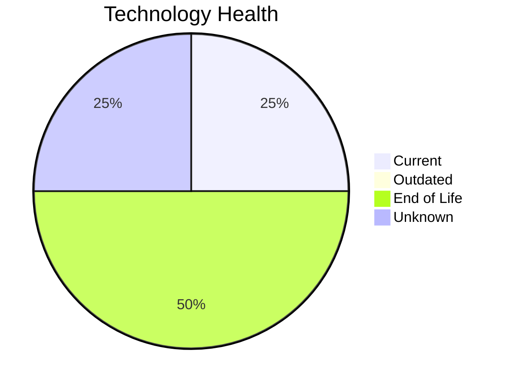

# Application Report: HRApp-004

**ID:** app004
**Generated:** 2026-05-11

## Overview

| Attribute | Value |
|-----------|-------|
| Business Unit | HR |
| Solution Type | Custom made |
| Deployment | AWS, On-premise |
| Business Criticality | High |
| Users | 670 |
| Servers | 2 (sv06, sv02) |
| Containerized | Yes |
| CI/CD | Yes |
| Architecture | 2-Tier |

## Technology Stack

| Component | Technology | Version | Status |
|-----------|-----------|---------|--------|
| Os | Windows Server 2012 | Windows Server 2012 | 🔴 EOL |
| Language | .NET Core | .NET Core | ⚪ NO_KNOWLEDGE |
| Database | SQL Server 2019 | SQL Server 2019 | 🟢 CURRENT_VERSION |
| Application Server | Microsoft IIS 8.0 | Microsoft IIS 8.0 | 🔴 EOL |

## Complexity Assessment

**Score:** 6/10 — **MEDIUM**
**Confidence:** 8/10

| Factor | Value |
|--------|-------|
| Technology Age (EOL/Outdated) | 2 EOL / 0 outdated |
| Integration (External Interfaces) | 6 |
| Infrastructure (Servers) | 2 |
| Business Criticality | High |
| Containerized | Yes |
| CI/CD Present | Yes |

> Complexity MEDIUM (6/10). Technology age: 9/10 (2 EOL, 0 outdated components). Integration: 6/10 (6 external interfaces). Infrastructure: 4/10 (2 servers). Business criticality High: 7/10. Architecture 2-tier: 5/10. Data complexity: 3/10.

## Modernization Scenarios

### Applicable Scenarios

#### ✅ Operating System Update

- **Reason:** OS Windows Server 2012 has status EOL. Security patches and OS update recommended.
- **Confidence:** 8/10
- **Cost:** €1,157 (one-time)
- **Savings:** €500/year

#### ✅ Applications Server replacement

- **Reason:** Application server Microsoft IIS 8.0 has status EOL. Replacement recommended.
- **Confidence:** 8/10
- **Cost:** €11,565 (one-time)
- **Savings:** €10,800/year

#### ✅ Application Migration to Cloud Infrastructure (Lift & Shift)

- **Reason:** Application has hybrid deployment. Full cloud migration can be considered.
- **Confidence:** 8/10
- **Cost:** €5,783 (one-time)
- **Savings:** €2,700/year

#### ✅ Application Refactoring and De-coupling

- **Reason:** Custom application with 2-tier architecture. Refactoring and de-coupling recommended.
- **Confidence:** 8/10
- **Cost:** €289,133 (one-time)
- **Savings:** €135,000/year

#### ✅ Switch DB Engine to open-source database solution

- **Reason:** Proprietary database SQL Server 2019 detected. Switch to open-source (e.g., PostgreSQL) is applicable.
- **Confidence:** 8/10
- **Cost:** €28,913 (one-time)
- **Savings:** €15,000/year

#### ✅ Update outdated components

- **Reason:** Application has EOL components that should be updated.
- **Confidence:** 8/10

### Other Scenarios

| Scenario | Status | Reason |
|----------|--------|--------|
| Application Containerization | ✔️ FULFILLED | Application is already containerized. |
| Upgrade Legacy Databases | ✔️ FULFILLED | Database SQL Server 2019 is current version, no upgrade needed. |
| Switch to standard Linux Operating System | ❌ NOT_APPLICABLE | Application runs on Windows Server. Switch to Linux may not be suitable for Windows-native stack. |
| Switch to ARM-based CPU | 🚫 BLOCKED | Windows-based OS limits ARM migration options. |

## Financial Summary

| Metric | Value |
|--------|-------|
| Total One-Time Investment | €336,550 |
| Total Annual Savings | €164,000 |
| Break-Even | 2.1 years |

