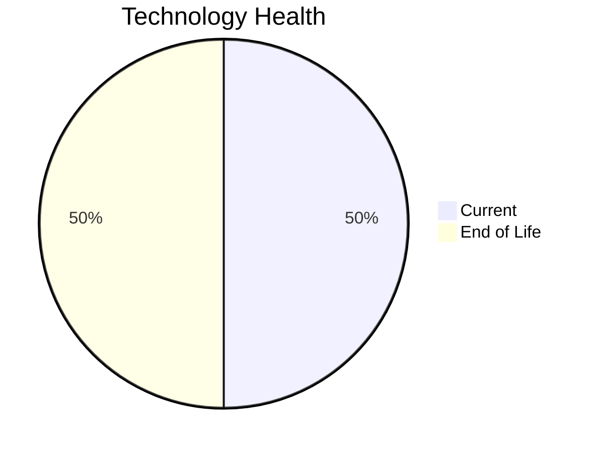

# Application Report: HRApp-004

**ID:** app004  
**Generated:** 2026-05-13

## Overview

| Attribute | Value |
|-----------|-------|
| Business Unit | HR |
| Solution Type | Custom made |
| Deployment Type | AWS, On-premise |
| Business Criticality | High |
| Users | 670 |
| Servers | sv06, sv02 |
| Environments | 2 |
| External Interfaces | 6 |
| Containerized | Yes |
| CI/CD Present | Yes |
| Architecture | 2-Tier |
| Data Classification | Internal |

## Technology Stack

| Component | Technology | Version | Status |
|-----------|-----------|---------|--------|
| Operating System | Windows Server 2012 | Windows Server 2012 | 🔴 EOL |
| Database | SQL Server 2019 | SQL Server 2019 | 🟢 Current |
| Programming Language | .NET Core (modern) | .NET Core (modern) | 🟢 Current |
| Application Server | IIS 8.0 | IIS 8.0 | 🔴 EOL |

## Complexity Assessment

**Score:** 6/10 — **MEDIUM**  
**Confidence:** 8/10

> Technology age score 9/10: Multiple EOL components detected. Integration score 6/10: 6 external interfaces. Infrastructure score 4/10: 2 server(s), 2 environment(s). Business criticality score 7/10: High criticality application. Architecture score 4/10: 2-Tier architecture, containerized, CI/CD present. Data score 4/10: Database in good standing.

| Factor | Value |
|--------|-------|
| Servers | 2 |
| Environments | 2 |
| External Interfaces | 6 |
| EOL Technologies | 2 |
| Outdated Technologies | 0 |
| Business Criticality | High |
| CI/CD Present | Yes |
| Containerized | Yes |

## Modernization Scenarios

### ✅ Applicable Scenarios

#### Operating System Update

- **Priority:** High
- **Effort:** Low
- **Effects:** security
- **One-Time Cost:** €1,157
- **Annual Savings:** €500/year
- **Reasoning:** OS (Windows Server 2012) is EOL and requires urgent update/replacement.

#### Switch to ARM-based CPU

- **Priority:** Medium
- **Effort:** Medium
- **Effects:** cost, sustainability
- **One-Time Cost:** €5,783
- **Annual Savings:** €900/year
- **Reasoning:** Application is containerized and runs on standard OS, making ARM migration feasible.

#### Application Server Replacement

- **Priority:** Medium
- **Effort:** Medium
- **Effects:** agility, cost
- **One-Time Cost:** €11,565
- **Annual Savings:** €10,800/year
- **Reasoning:** Application server (Microsoft IIS 8.0) is EOL and requires replacement.

#### Application Migration to Cloud (Lift & Shift)

- **Priority:** High
- **Effort:** Low
- **Effects:** security, agility
- **One-Time Cost:** €5,783
- **Annual Savings:** €2,700/year
- **Reasoning:** Application is deployed on-premise (AWS, On-premise). Cloud migration would improve scalability and reduce infrastructure costs.

#### Switch DB Engine to Open-Source

- **Priority:** High
- **Effort:** Medium
- **Effects:** cost
- **One-Time Cost:** €28,913
- **Annual Savings:** €15,000/year
- **Reasoning:** Commercial database (SQL Server 2019) detected. Migrating to PostgreSQL or MySQL would eliminate licensing costs.

#### Update Outdated Components

- **Priority:** High
- **Effort:** High
- **Effects:** security, agility, cost
- **Cost:** No financial data available
- **Reasoning:** Outdated or EOL components detected: Windows Server 2012, IIS 8.0. Updates required to maintain security and supportability.

#### Switch to Managed Database Service

- **Priority:** Medium
- **Effort:** Low
- **Effects:** agility, cost
- **One-Time Cost:** €5,783
- **Annual Savings:** €10,000/year
- **Reasoning:** Hybrid deployment with on-premise database (SQL Server 2019) could migrate to managed service.

#### Switch DB Engine to PostgreSQL

- **Priority:** High
- **Effort:** Medium
- **Effects:** cost
- **One-Time Cost:** €28,913
- **Annual Savings:** €15,000/year
- **Reasoning:** Commercial database (SQL Server 2019) is a candidate for migration to PostgreSQL to eliminate licensing costs.

### Other Scenarios

| Scenario | Status | Reason |
|----------|--------|--------|
| Switch to Standard Linux OS | ❌ N/A | Application runs on Windows-based OS. Exclusion criterion applies. |
| Application Containerization | ✔️ Fulfilled | Application is already containerized. |
| Application Refactoring and De-coupling | 🔶 Partial | Application architecture (2-Tier) suggests some coupling. Partial refactoring may benefit the applic... |
| Upgrade Legacy Databases | ✔️ Fulfilled | Database (SQL Server 2019) is on a current supported version. |
| Managed ARM Database | ❌ N/A | Database is not on a managed cloud service; ARM database migration not applicable. |
| Serverless Database Migration | ❌ N/A | Application deployment pattern does not support serverless database migration at this time. |

## Financial Summary

| Metric | Value |
|--------|-------|
| Total One-Time Investment | €87,897 |
| Total Annual Savings | €54,900 |
| Break-Even | 1.6 years |
