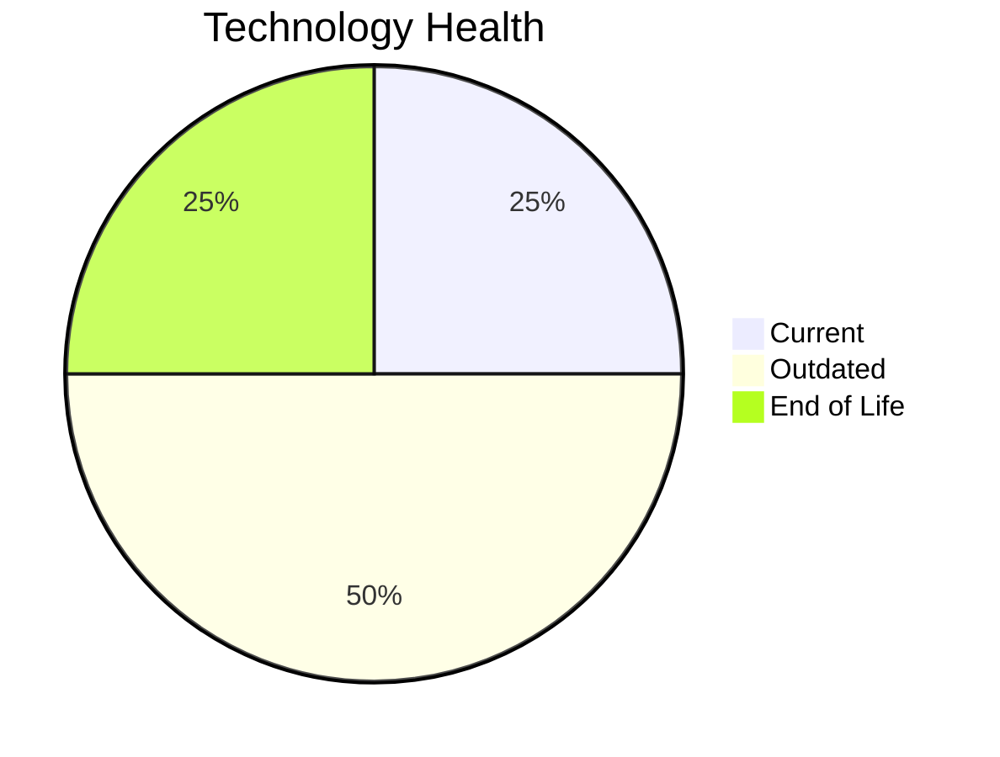

# Application Report: SupportApp-006

**ID:** app006  
**Generated:** 2026-05-13

## Overview

| Attribute | Value |
|-----------|-------|
| Business Unit | IT |
| Solution Type | 3rd party software |
| Deployment Type | AWS |
| Business Criticality | Medium |
| Users | 290 |
| Servers | sv10 |
| Environments | 2 |
| External Interfaces | 4 |
| Containerized | No |
| CI/CD Present | Yes |
| Architecture | unknown |
| Data Classification | Internal |

## Technology Stack

| Component | Technology | Version | Status |
|-----------|-----------|---------|--------|
| Operating System | Debian 6 | Debian 6 | 🔴 EOL |
| Database | PostgreSQL 13 | PostgreSQL 13 | 🟡 Outdated |
| Programming Language | Java 11 | Java 11 | 🟢 Current |
| Application Server | GlassFish 5.x | GlassFish 5.x | 🟡 Outdated |

## Complexity Assessment

**Score:** 5/10 — **MEDIUM**  
**Confidence:** 8/10

> Technology age score 8/10: Multiple EOL components detected. Integration score 4/10: 4 external interfaces. Infrastructure score 2/10: 1 server(s), 2 environment(s). Business criticality score 5/10: Medium criticality application. Architecture score 5/10: unknown architecture, not containerized, CI/CD present. Data score 4/10: Outdated database components present.

| Factor | Value |
|--------|-------|
| Servers | 1 |
| Environments | 2 |
| External Interfaces | 4 |
| EOL Technologies | 1 |
| Outdated Technologies | 2 |
| Business Criticality | Medium |
| CI/CD Present | Yes |
| Containerized | No |

## Modernization Scenarios

### ✅ Applicable Scenarios

#### Operating System Update

- **Priority:** High
- **Effort:** Low
- **Effects:** security
- **One-Time Cost:** €1,006
- **Annual Savings:** €500/year
- **Reasoning:** OS (Debian 6) is EOL and requires urgent update/replacement.

#### Application Server Replacement

- **Priority:** Medium
- **Effort:** Medium
- **Effects:** agility, cost
- **One-Time Cost:** €10,057
- **Annual Savings:** €10,800/year
- **Reasoning:** Application server (Glassfish 5.0) is OUTDATED and approaching EOL.

#### Upgrade Legacy Databases

- **Priority:** High
- **Effort:** Medium
- **Effects:** security, agility
- **One-Time Cost:** €10,057
- **Annual Savings:** €10,000/year
- **Reasoning:** Database (PostgreSQL 13) is OUTDATED and approaching EOL.

### Other Scenarios

| Scenario | Status | Reason |
|----------|--------|--------|
| Switch to Standard Linux OS | ✔️ Fulfilled | Application already runs on standard Linux OS (Debian 6). |
| Switch to ARM-based CPU | 🚫 Blocked | 3rd party application with potential x86-specific dependencies. |
| Application Migration to Cloud (Lift & Shift) | ✔️ Fulfilled | Application is already hosted on cloud infrastructure (AWS). |
| Application Containerization | 🚫 Blocked | 3rd party / SaaS application: runtime packaging cannot be modified by the customer. |
| Application Refactoring and De-coupling | 🚫 Blocked | 3rd party or SaaS application. Internal architecture cannot be refactored by the customer. |
| Switch DB Engine to Open-Source | ✔️ Fulfilled | Database (PostgreSQL 13) is already an open-source database engine. |
| Update Outdated Components | 🚫 Blocked | 3rd party or SaaS application. Component versions are vendor-managed and not upgradeable by the cust... |
| Switch to Managed Database Service | ❌ N/A | Database is already cloud-hosted or scenario not applicable. |
| Managed ARM Database | ❌ N/A | Database is not on a managed cloud service; ARM database migration not applicable. |
| Serverless Database Migration | ❌ N/A | Application deployment pattern does not support serverless database migration at this time. |
| Switch DB Engine to PostgreSQL | ✔️ Fulfilled | Database (PostgreSQL 13) is already PostgreSQL or PostgreSQL-compatible. |

## Financial Summary

| Metric | Value |
|--------|-------|
| Total One-Time Investment | €21,120 |
| Total Annual Savings | €21,300 |
| Break-Even | 1.0 years |
