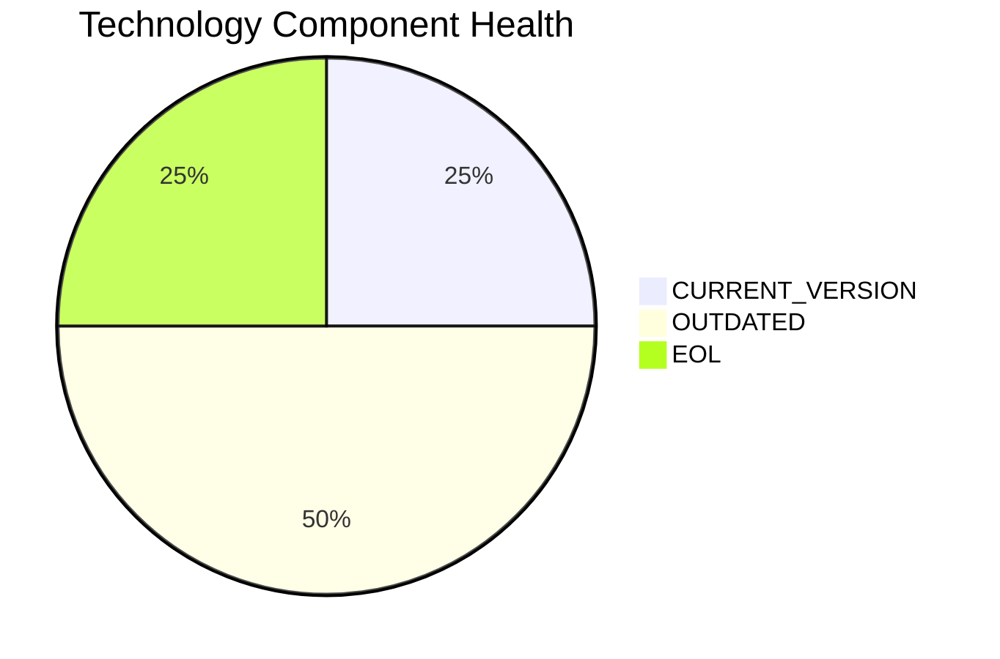

# SupportApp-006 — Application Modernization Report

> **Application ID:** app006  
> **Business Unit:** IT  
> **Criticality:** Medium

## Application Overview

| Attribute | Value |
|-----------|-------|
| Application ID | app006 |
| Name | SupportApp-006 |
| Business Unit | IT |
| Criticality | Medium |
| Status | Production |
| Deployment Type | AWS |
| Architecture | unknown |
| Containerized | No |
| CI/CD | Yes |
| Users | 290 |
| Environments | 2 |
| External Interfaces | 4 |
| Servers | s, v, 1, 0 |
| DB Storage (GB) | 200 |
| DB License Required | No |

## Technology Stack Assessment

| Component | Name | Status |
|-----------|------|--------|
| Operating System | Debian 6 | 🔴 EOL |
| Database | PostgreSQL 13 | 🟡 OUTDATED |
| Programming Language | Java 11 | 🟢 CURRENT_VERSION |
| Application Server | Glassfish 5.0 | 🟡 OUTDATED |

### Technology Health Distribution

## Complexity Assessment

**Overall Complexity:** 🟡 **MEDIUM** (Score: 6/10)

| Factor | Score | Weight |
|--------|-------|--------|
| Technology Age | 7 | 25% |
| Integration Complexity | 5 | 20% |
| Infrastructure | 7 | 15% |
| Business Criticality | 5 | 15% |
| Architecture | 6 | 15% |
| Data Complexity | 6 | 10% |

## Modernization Scenarios

### Applicable Scenarios

| Scenario | Reasoning |
|----------|-----------|
| OS Security Patch | OS Debian 6 is EOL and requires security patching or upgrade. |
| Switch to Standard Linux | Debian 6 is EOL. Upgrading to a current Linux distribution is recommended. |
| Switch to ARM CPU | Cloud deployment can leverage ARM-based instances (e.g., AWS Graviton) for cost savings. |
| App Server Replacement | Application server Glassfish 5.0 is outdated and should be upgraded. |
| Containerization | Application is not containerized. Containerization would improve deployment consistency and portability. |
| Refactor & Decouple | Application with unknown architecture could benefit from decoupling and modernization. |
| Upgrade Legacy DB | Database PostgreSQL 13 is outdated and should be upgraded. |
| Update Outdated Components | Outdated/EOL components detected: Debian 6, PostgreSQL 13, Glassfish 5.0. Updates required. |
| Switch to Managed DB | Database could be migrated to a fully managed cloud database service for reduced operational overhead. |
| Managed ARM DB | Database can be evaluated for ARM-based managed service deployment. |
| Serverless DB Migration | Database can be migrated to a serverless database solution to reduce operational overhead. |

### All Scenario Statuses

| Scenario | Status |
|----------|--------|
| OS Security Patch | ✅ APPLICABLE |
| Switch to Standard Linux | ✅ APPLICABLE |
| Switch to ARM CPU | ✅ APPLICABLE |
| App Server Replacement | ✅ APPLICABLE |
| Cloud Deployment | 🔵 FULFILLED |
| Containerization | ✅ APPLICABLE |
| Refactor & Decouple | ✅ APPLICABLE |
| Upgrade Legacy DB | ✅ APPLICABLE |
| Switch to OSS DB | 🔵 FULFILLED |
| Update Outdated Components | ✅ APPLICABLE |
| Switch to Managed DB | ✅ APPLICABLE |
| Managed ARM DB | ✅ APPLICABLE |
| Serverless DB Migration | ✅ APPLICABLE |
| Switch to PostgreSQL | 🔵 FULFILLED |

## Financial Summary

| Metric | Value |
|--------|-------|
| Total Estimated Implementation Cost | $452,550.33 |
| Total Estimated Annual Savings | $277,700.00 |
| Estimated ROI Payback Period | 1.6 years |

### Cost/Savings Breakdown by Scenario

| Scenario | Est. Cost | Est. Annual Savings | ROI (years) |
|----------|-----------|---------------------|-------------|
| OS Security Patch | $1,156.53 | $500.00 | 2.31 |
| Switch to Standard Linux | $346.96 | $400.00 | 0.87 |
| Switch to ARM CPU | $5,782.65 | $1,000.00 | 5.78 |
| App Server Replacement | $11,565.30 | $10,800.00 | 1.07 |
| Containerization | $115,653.04 | $90,000.00 | 1.29 |
| Refactor & Decouple | $289,132.60 | $135,000.00 | 2.14 |
| Upgrade Legacy DB | $11,565.30 | $10,000.00 | 1.16 |
| Update Outdated Components | N/A | N/A | N/A |
| Switch to Managed DB | $5,782.65 | $10,000.00 | 0.58 |
| Managed ARM DB | $5,782.65 | $5,000.00 | 1.16 |
| Serverless DB Migration | $5,782.65 | $15,000.00 | 0.39 |
