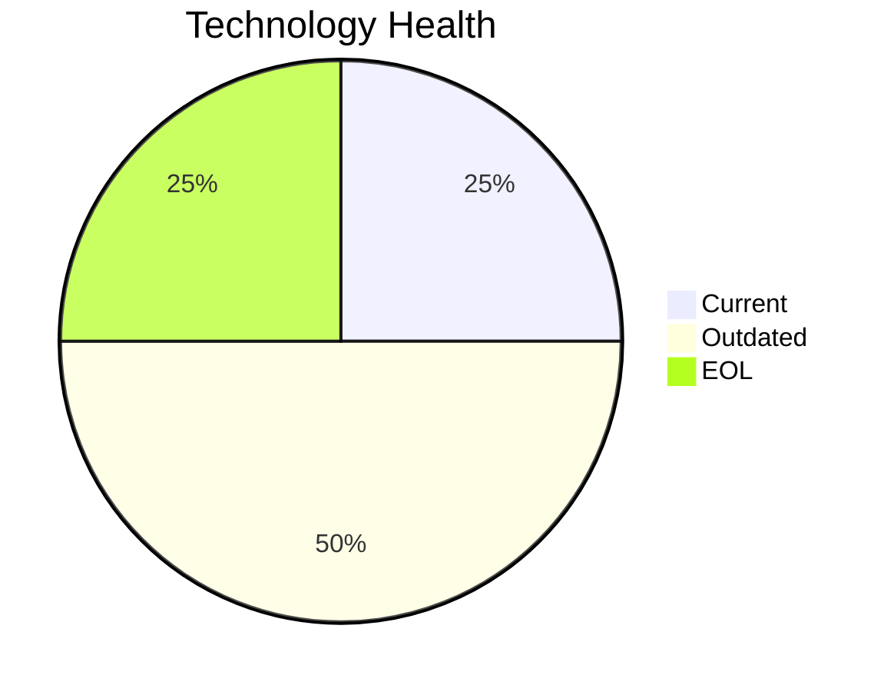

<!-- generated by AI in Github cloud -->
# SupportApp-006 (app006)

## Application Overview

| Attribute | Value |
|-----------|-------|
| **App ID** | app006 |
| **Name** | SupportApp-006 |
| **Status** | Production |
| **Criticality** | Medium |
| **Solution Type** | 3rd party software |
| **Deployment** | AWS |
| **Containerized** | No |
| **Architecture** | unknown |
| **Business Unit** | IT |
| **External Interfaces** | 4 |
| **Servers** | 1 |
| **Environments** | 2 |

## Technology Stack

| Component | Type | Version | Status | EOL Date |
|-----------|------|---------|--------|----------|
| Debian | os | 6 | 🔴 EOL | 2016-02-29 |
| Java 11 | programming_language | 11 | 🟢 CURRENT | 2026-09-30 |
| Glassfish 5.0 | application_server | 5.0 | 🟡 OUTDATED | 2026-12-31 |
| PostgreSQL 13 | database | 13 | 🟡 OUTDATED | 2025-11-13 |

## Complexity Assessment

**Score: 5/10 (MEDIUM)**

Technology age score 7 (1 EOL, 2 outdated components). Integration score 4 (4 external interfaces). Infrastructure score 4 (1 servers, 2 environments). Criticality score 5 (Medium). Architecture score 5. Data score 4. Weighted final: 5.1 → 5 (MEDIUM).

| Factor | Value |
|--------|-------|
| Number Of Servers | 1 |
| Number Of Databases | 1 |
| Number Of Environments | 2 |
| Number Of Interfaces | 4 |
| Business Criticality | Medium |
| Number Of Outdated Technologies | 2 |
| Number Of Eol Technologies | 1 |
| Number Of Dependencies | 0 |
| Ci Cd Present | Yes |
| Containerized | No |

## Applicable Modernization Scenarios

### Os Update Security Patch
- **Status**: APPLICABLE
- **Reason**: OS 'Debian 6' is EOL and requires security patching or upgrade.
- **Confidence**: 8/10

### Upgrade Legacy Databases
- **Status**: APPLICABLE
- **Reason**: Database 'PostgreSQL 13' is OUTDATED; upgrade is required.
- **Confidence**: 8/10

### Update Outdated Components
- **Status**: APPLICABLE
- **Reason**: Outdated/EOL components found: Debian, Glassfish 5.0, PostgreSQL 13. Updates required.
- **Confidence**: 8/10

## Other Scenarios

| Scenario | Status | Reason |
|----------|--------|--------|
| switch_to_standard_linux_os | FULFILLED | OS 'Debian 6' is already a standard Linux distribution. |
| switch_to_arm_cpu | LACK_OF_DATA | No explicit CPU architecture data (x86 vs ARM) is available in the application m... |
| application_server_replacement | BLOCKED | Application is 3rd party software; app server replacement depends on vendor. |
| app_deployment_to_cloud | FULFILLED | Application is already deployed to cloud (AWS). |
| app_containerization | BLOCKED | 3rd party application; containerization depends on vendor support. |
| app_refactor_decoupling | NOT_APPLICABLE | 3rd party application; refactoring is not applicable. |
| switch_db_engine_open_source | NOT_APPLICABLE | 3rd party application; database engine change depends on vendor. |

## Financial Summary

| Scenario | Cost (USD) | Annual Savings (USD) | ROI 3yr % | Payback (yrs) |
|----------|-----------|---------------------|-----------|---------------|
| os_update_security_patch | $1,006 | $500 | 49.2% | 2.0 |
| upgrade_legacy_databases | $10,057 | $10,000 | 198.3% | 1.0 |
| **TOTAL** | **$11,062** | **$10,500** | | |
