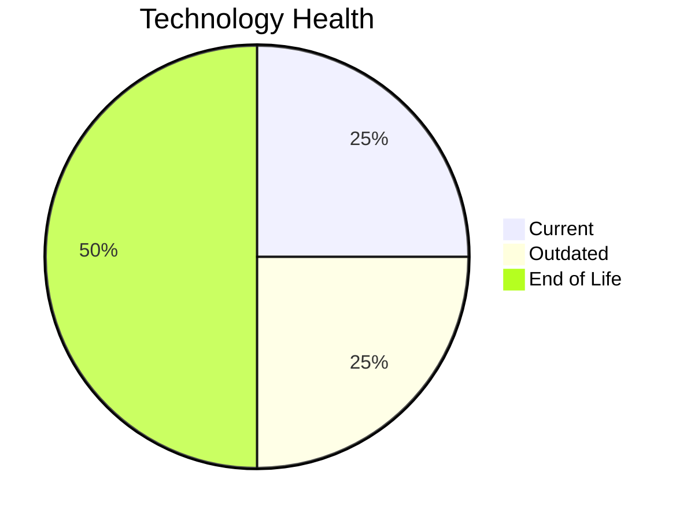

# Application Report: InventoryApp-008

**ID:** app008  
**Generated:** 2026-05-13

## Overview

| Attribute | Value |
|-----------|-------|
| Business Unit | Operations |
| Solution Type | Custom made |
| Deployment Type | On-Premise |
| Business Criticality | High |
| Users | 875 |
| Servers | sv11, sv01 |
| Environments | 3 |
| External Interfaces | 2 |
| Containerized | No |
| CI/CD Present | No |
| Architecture | 1-Tier |
| Data Classification | Confidential |

## Technology Stack

| Component | Technology | Version | Status |
|-----------|-----------|---------|--------|
| Operating System | AIX 6 | AIX 6 | 🔴 EOL |
| Database | SQL Server 2019 | SQL Server 2019 | 🟢 Current |
| Programming Language | COBOL-2014 | COBOL-2014 | 🟡 Outdated |
| Application Server | Oracle WebLogic 8.1 | Oracle WebLogic 8.1 | 🔴 EOL |

## Complexity Assessment

**Score:** 6/10 — **MEDIUM**  
**Confidence:** 8/10

> Technology age score 9/10: Multiple EOL components detected. Integration score 2/10: 2 external interfaces. Infrastructure score 4/10: 2 server(s), 3 environment(s). Business criticality score 7/10: High criticality application. Architecture score 9/10: 1-Tier architecture, not containerized, no CI/CD. Data score 3/10: Database in good standing.

| Factor | Value |
|--------|-------|
| Servers | 2 |
| Environments | 3 |
| External Interfaces | 2 |
| EOL Technologies | 2 |
| Outdated Technologies | 1 |
| Business Criticality | High |
| CI/CD Present | No |
| Containerized | No |

## Modernization Scenarios

### ✅ Applicable Scenarios

#### Operating System Update

- **Priority:** High
- **Effort:** Low
- **Effects:** security
- **One-Time Cost:** €1,157
- **Annual Savings:** €500/year
- **Reasoning:** OS (AIX 6) is EOL and requires urgent update/replacement.

#### Switch to Standard Linux OS

- **Priority:** Medium
- **Effort:** Medium
- **Effects:** agility, security, cost
- **One-Time Cost:** €347
- **Annual Savings:** €400/year
- **Reasoning:** OS (AIX 6) is a proprietary Unix system. Migrating to standard Linux would reduce costs and improve supportability.

#### Application Server Replacement

- **Priority:** Medium
- **Effort:** Medium
- **Effects:** agility, cost
- **One-Time Cost:** €11,565
- **Annual Savings:** €10,800/year
- **Reasoning:** Application server (Oracle Weblogic 8.0) is EOL and requires replacement.

#### Application Migration to Cloud (Lift & Shift)

- **Priority:** High
- **Effort:** Low
- **Effects:** security, agility
- **One-Time Cost:** €5,783
- **Annual Savings:** €2,700/year
- **Reasoning:** Application is deployed on-premise (On-Premise). Cloud migration would improve scalability and reduce infrastructure costs.

#### Application Refactoring and De-coupling

- **Priority:** High
- **Effort:** High
- **Effects:** agility, cost, sustainability
- **One-Time Cost:** €289,133
- **Annual Savings:** €135,000/year
- **Reasoning:** Application has monolithic 1-Tier architecture. Refactoring to a decoupled architecture would improve maintainability and scalability.

#### Switch DB Engine to Open-Source

- **Priority:** High
- **Effort:** Medium
- **Effects:** cost
- **One-Time Cost:** €28,913
- **Annual Savings:** €15,000/year
- **Reasoning:** Commercial database (SQL Server 2019) detected. Migrating to PostgreSQL or MySQL would eliminate licensing costs.

#### Update Outdated Components

- **Priority:** High
- **Effort:** High
- **Effects:** security, agility, cost
- **Cost:** No financial data available
- **Reasoning:** Outdated or EOL components detected: AIX 6, Oracle WebLogic 8.1, COBOL-2014. Updates required to maintain security and supportability.

#### Switch to Managed Database Service

- **Priority:** Medium
- **Effort:** Low
- **Effects:** agility, cost
- **One-Time Cost:** €5,783
- **Annual Savings:** €10,000/year
- **Reasoning:** On-premise database (SQL Server 2019) could benefit from migration to a managed cloud database service.

#### Switch DB Engine to PostgreSQL

- **Priority:** High
- **Effort:** Medium
- **Effects:** cost
- **One-Time Cost:** €28,913
- **Annual Savings:** €15,000/year
- **Reasoning:** Commercial database (SQL Server 2019) is a candidate for migration to PostgreSQL to eliminate licensing costs.

### Other Scenarios

| Scenario | Status | Reason |
|----------|--------|--------|
| Switch to ARM-based CPU | 🚫 Blocked | Legacy proprietary Unix OS prevents ARM migration without OS change first. |
| Application Containerization | 🚫 Blocked | Legacy Unix OS (AIX 6) is not compatible with standard container technologies. OS migration required... |
| Upgrade Legacy Databases | ✔️ Fulfilled | Database (SQL Server 2019) is on a current supported version. |
| Managed ARM Database | 🚫 Blocked | Legacy Unix OS constrains ARM adoption for database as well. |
| Serverless Database Migration | ❌ N/A | On-premise deployment: serverless DB migration requires cloud infrastructure first. |

## Financial Summary

| Metric | Value |
|--------|-------|
| Total One-Time Investment | €371,594 |
| Total Annual Savings | €189,400 |
| Break-Even | 2.0 years |
