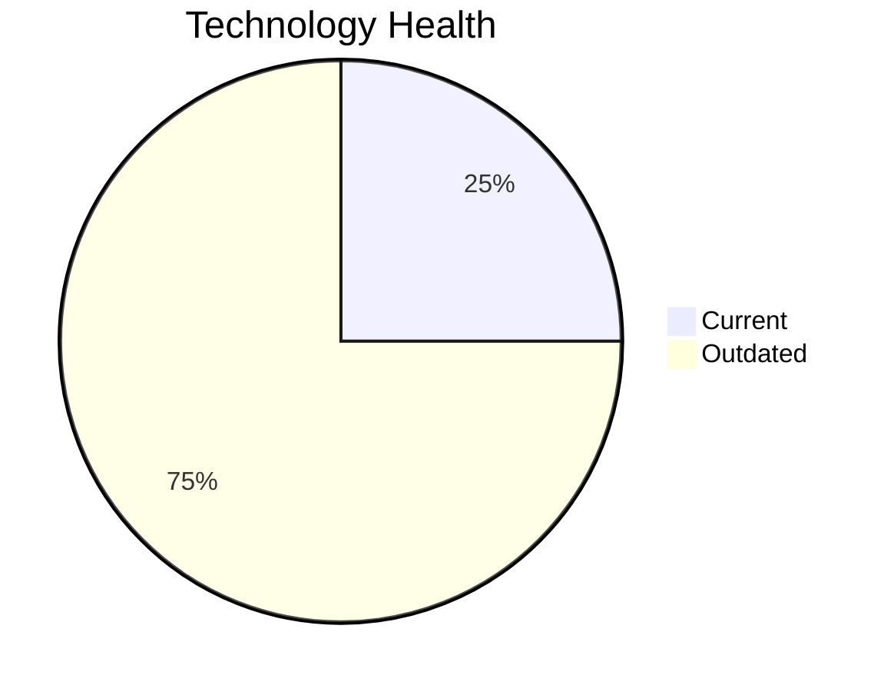

# Application Report: InventoryApp-008

**ID:** app008  
**Generated:** 2026-05-11

## Overview

| Attribute | Value |
|-----------|-------|
| Business Unit | Operations |
| Solution Type | Custom made |
| Deployment Type | On-Premise |
| Business Criticality | High |
| Users | 875 |
| Servers | 2 |
| Architecture | 1-Tier |
| Containerized | No |
| CI/CD | No |
| Data Classification | Confidential |

## Technology Stack

| Component | Technology | Status |
|-----------|-----------|--------|
| Os | AIX 6 | 🟡 OUTDATED |
| Database | SQL Server 2019 | 🟢 CURRENT_VERSION |
| Language | COBOL-2014 | 🟡 OUTDATED |
| Application Server | Oracle Weblogic 8.0 | 🟡 OUTDATED |

## Complexity Assessment

**Score:** 5/10 — **MEDIUM**  
**Confidence:** 7

> Score 5/10 (MEDIUM): 0 EOL component(s), 3 outdated, 2 external interfaces, 2 server(s), criticality=High, architecture=1-Tier.

| Factor | Value |
|--------|-------|
| Servers | 2 |
| Interfaces | 2 |
| Environments | 3 |
| EOL Technologies | 0 |
| Outdated Technologies | 3 |
| CI/CD Present | No |
| Containerized | No |

## Modernization Scenarios

### Applicable Scenarios

#### ✅ Operating System Update

- **Priority:** High
- **Effort:** Low
- **Effects:** security
- **Cost:** €1,006 (one-time)
- **Annual Savings:** €500/year
- **Reasoning:** OS (aix 6) is outdated and should be updated.

#### ✅ Switch to standard Linux Operating System

- **Priority:** Medium
- **Effort:** Medium
- **Effects:** agility, security, cost
- **Cost:** €302 (one-time)
- **Annual Savings:** €400/year
- **Reasoning:** Application runs on proprietary OS (AIX 6) which should be migrated to standard Linux.

#### ✅ Switch to ARM-based CPU

- **Priority:** Medium
- **Effort:** Medium
- **Effects:** cost, sustainability
- **Cost:** €5,028 (one-time)
- **Annual Savings:** €1,000/year
- **Reasoning:** Application on on-premise x86 infrastructure could benefit from ARM migration for cost savings.

#### ✅ Applications Server replacement

- **Priority:** Medium
- **Effort:** Medium
- **Effects:** agility, cost
- **Cost:** €10,057 (one-time)
- **Annual Savings:** €10,800/year
- **Reasoning:** Application server (Oracle Weblogic 8.0) is outdated.

#### ✅ Application Migration to Cloud Infrastructure (Lift & Shift)

- **Priority:** High
- **Effort:** Low
- **Effects:** security, agility
- **Cost:** €5,028 (one-time)
- **Annual Savings:** €2,700/year
- **Reasoning:** Application runs on-premise and is a candidate for cloud migration.

#### ✅ Application Refactoring and De-coupling

- **Priority:** High
- **Effort:** High
- **Effects:** agility, cost, sustainability
- **Cost:** €251,420 (one-time)
- **Annual Savings:** €135,000/year
- **Reasoning:** Application has 1-Tier architecture - refactoring to microservices would improve scalability.

#### ✅ Switch DB Engine to open-source database solution

- **Priority:** High
- **Effort:** Medium
- **Effects:** cost
- **Reasoning:** Application uses commercial database (SQL Server 2019) with license cost; migration to open-source is recommended.

#### ✅ Update outdated components

- **Priority:** High
- **Effort:** High
- **Effects:** security, agility, cost
- **Reasoning:** Outdated components found. Updating to current versions is recommended.

### Other Scenarios

| Scenario | Status | Reason |
|----------|--------|--------|
| Application Containerization | 🚫 BLOCKED | Legacy architecture (COBOL/1-Tier) makes containerization impractical without major refactoring. |
| Upgrade Legacy Databases | ✔️ FULFILLED | Database (SQL Server 2019) is on a current, supported version. |

## Financial Summary

| Metric | Value |
|--------|-------|
| Total One-Time Cost | €272,841 |
| Total Yearly Savings | €150,400 |
| Break-Even | 1.8 years |
