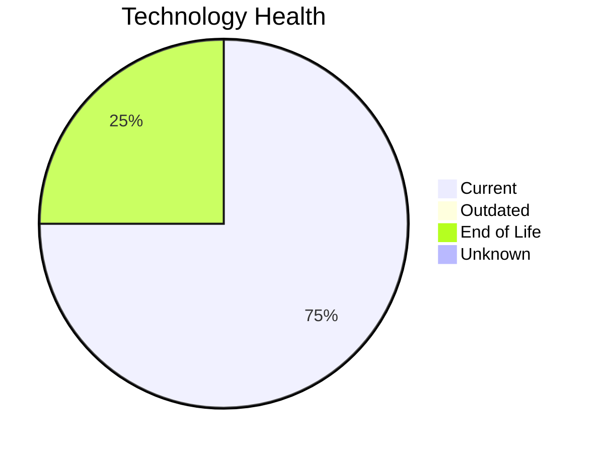

# Application Report: PayrollApp-010

**ID:** app010
**Generated:** 2026-05-11

## Overview

| Attribute | Value |
|-----------|-------|
| Business Unit | HR |
| Solution Type | 3rd party software |
| Deployment | AWS |
| Business Criticality | Medium |
| Users | 315 |
| Servers | 1 (sv13) |
| Containerized | No |
| CI/CD | Yes |
| Architecture | unknown |

## Technology Stack

| Component | Technology | Version | Status |
|-----------|-----------|---------|--------|
| Os | Windows Server 2019 | Windows Server 2019 | 🟢 CURRENT_VERSION |
| Language | Ruby 2.7 | Ruby 2.7 | 🔴 EOL |
| Database | MySQL 8.0 | MySQL 8.0 | 🟢 CURRENT_VERSION |
| Application Server | Microsoft IIS 10.0 | Microsoft IIS 10.0 | 🟢 CURRENT_VERSION |

## Complexity Assessment

**Score:** 5/10 — **MEDIUM**
**Confidence:** 8/10

| Factor | Value |
|--------|-------|
| Technology Age (EOL/Outdated) | 1 EOL / 0 outdated |
| Integration (External Interfaces) | 4 |
| Infrastructure (Servers) | 1 |
| Business Criticality | Medium |
| Containerized | No |
| CI/CD Present | Yes |

> Complexity MEDIUM (5/10). Technology age: 8/10 (1 EOL, 0 outdated components). Integration: 4/10 (4 external interfaces). Infrastructure: 2/10 (1 servers). Business criticality Medium: 4/10. Architecture unknown: 8/10. Data complexity: 3/10.

## Modernization Scenarios

### Applicable Scenarios
_No applicable scenarios._

### Other Scenarios

| Scenario | Status | Reason |
|----------|--------|--------|
| Operating System Update | ✔️ FULFILLED | OS Windows Server 2019 is current version, no update needed. |
| Application Migration to Cloud Infrastructure (Lift & Shift) | ✔️ FULFILLED | Application is already deployed on AWS cloud infrastructure. |
| Upgrade Legacy Databases | ✔️ FULFILLED | Database MySQL 8.0 is current version, no upgrade needed. |
| Switch DB Engine to open-source database solution | ✔️ FULFILLED | Database MySQL 8.0 is already open-source. |
| Switch to standard Linux Operating System | ❌ NOT_APPLICABLE | Application runs on Windows Server. Switch to Linux may not be suitable for Windows-native stack. |
| Application Refactoring and De-coupling | ❌ NOT_APPLICABLE | 3rd party or open-source software; refactoring not in scope. |
| Switch to ARM-based CPU | 🚫 BLOCKED | 3rd party software may not support ARM architecture without vendor approval. |
| Applications Server replacement | 🚫 BLOCKED | 3rd party software; app server replacement depends on vendor. |
| Application Containerization | 🚫 BLOCKED | 3rd party software containerization depends on vendor support. |
| Update outdated components | 🚫 BLOCKED | 3rd party software; component updates depend on vendor release cycle. |

## Financial Summary

No applicable scenarios with financial data found.

