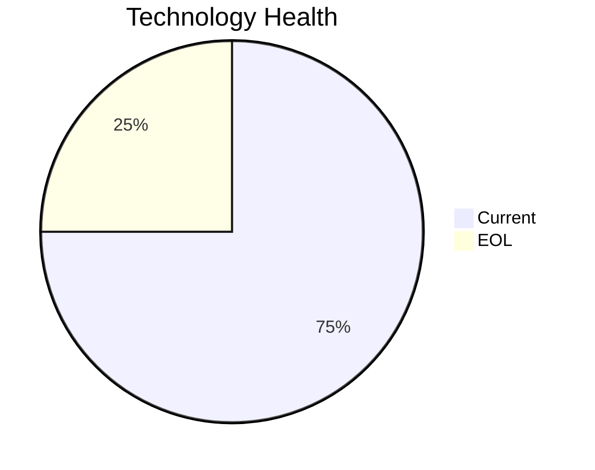

<!-- generated by AI in Github cloud -->
# PayrollApp-010 (app010)

## Application Overview

| Attribute | Value |
|-----------|-------|
| **App ID** | app010 |
| **Name** | PayrollApp-010 |
| **Status** | Production |
| **Criticality** | Medium |
| **Solution Type** | 3rd party software |
| **Deployment** | AWS |
| **Containerized** | No |
| **Architecture** | unknown |
| **Business Unit** | HR |
| **External Interfaces** | 4 |
| **Servers** | 1 |
| **Environments** | 1 |

## Technology Stack

| Component | Type | Version | Status | EOL Date |
|-----------|------|---------|--------|----------|
| Windows | os | Server 2019 | 🟢 CURRENT | 2029-01-09 |
| Ruby 2.7 | programming_language | 2.7 | 🔴 EOL | 2023-03-31 |
| Microsoft IIS 10.0 | application_server | 10.0 | 🟢 CURRENT | N/A |
| MySQL 8.0 | database | 8.0 | 🟢 CURRENT | 2026-04-30 |

## Complexity Assessment

**Score: 5/10 (MEDIUM)**

Technology age score 7 (1 EOL, 0 outdated components). Integration score 4 (4 external interfaces). Infrastructure score 2 (1 servers, 1 environments). Criticality score 5 (Medium). Architecture score 5. Data score 4. Weighted final: 4.8 → 5 (MEDIUM).

| Factor | Value |
|--------|-------|
| Number Of Servers | 1 |
| Number Of Databases | 1 |
| Number Of Environments | 1 |
| Number Of Interfaces | 4 |
| Business Criticality | Medium |
| Number Of Outdated Technologies | 0 |
| Number Of Eol Technologies | 1 |
| Number Of Dependencies | 0 |
| Ci Cd Present | Yes |
| Containerized | No |

## Applicable Modernization Scenarios

### Update Outdated Components
- **Status**: APPLICABLE
- **Reason**: Outdated/EOL components found: Ruby 2.7. Updates required.
- **Confidence**: 8/10

## Other Scenarios

| Scenario | Status | Reason |
|----------|--------|--------|
| os_update_security_patch | FULFILLED | OS 'Windows Server 2019' is current and receiving security patches. |
| switch_to_standard_linux_os | NOT_APPLICABLE | OS 'Windows Server 2019' is Windows; switching to Linux is not applicable. |
| switch_to_arm_cpu | LACK_OF_DATA | No explicit CPU architecture data (x86 vs ARM) is available in the application m... |
| application_server_replacement | BLOCKED | Application is 3rd party software; app server replacement depends on vendor. |
| app_deployment_to_cloud | FULFILLED | Application is already deployed to cloud (AWS). |
| app_containerization | BLOCKED | 3rd party application; containerization depends on vendor support. |
| app_refactor_decoupling | NOT_APPLICABLE | 3rd party application; refactoring is not applicable. |
| upgrade_legacy_databases | FULFILLED | Database 'MySQL 8.0' is current. |
| switch_db_engine_open_source | NOT_APPLICABLE | 3rd party application; database engine change depends on vendor. |

## Financial Summary

_No financial data available for applicable scenarios._
