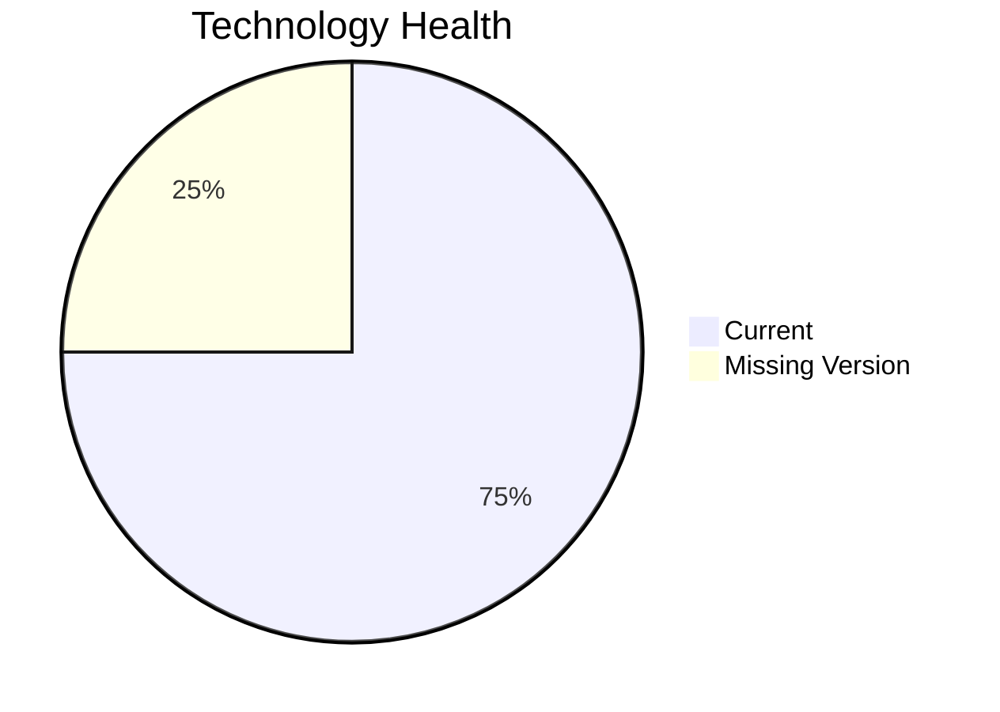

# Application Report: PayrollApp-010

**ID:** app010  
**Generated:** 2026-05-11

## Overview

| Attribute | Value |
|-----------|-------|
| Business Unit | HR |
| Solution Type | 3rd party software |
| Deployment Type | AWS |
| Business Criticality | Medium |
| Users | 315 |
| Servers | 1 |
| Architecture | unknown |
| Containerized | No |
| CI/CD | Yes |
| Data Classification | Internal |

## Technology Stack

| Component | Technology | Status |
|-----------|-----------|--------|
| Os | Windows Server 2019 | 🟢 CURRENT_VERSION |
| Database | MySQL 8.0 | 🟢 CURRENT_VERSION |
| Language | Ruby 2.7 | ⚪ NO_KNOWLEDGE |
| Application Server | Microsoft IIS 10.0 | 🟢 CURRENT_VERSION |

## Complexity Assessment

**Score:** 4/10 — **MEDIUM**  
**Confidence:** 7

> Score 4/10 (MEDIUM): 0 EOL component(s), 0 outdated, 4 external interfaces, 1 server(s), criticality=Medium, architecture=unknown.

| Factor | Value |
|--------|-------|
| Servers | 1 |
| Interfaces | 4 |
| Environments | 1 |
| EOL Technologies | 0 |
| Outdated Technologies | 0 |
| CI/CD Present | Yes |
| Containerized | No |

## Modernization Scenarios

### Applicable Scenarios

#### ✅ Switch to ARM-based CPU

- **Priority:** Medium
- **Effort:** Medium
- **Effects:** cost, sustainability
- **Cost:** €4,373 (one-time)
- **Annual Savings:** €1,000/year
- **Reasoning:** Application runs on cloud and could benefit from ARM-based instances (e.g., AWS Graviton).

### Other Scenarios

| Scenario | Status | Reason |
|----------|--------|--------|
| Operating System Update | ✔️ FULFILLED | Operating system is on a current, supported version. |
| Switch to standard Linux Operating System | ❌ NOT_APPLICABLE | Application runs on Windows or is SaaS; switching to standard Linux OS is not applicable. |
| Applications Server replacement | ✔️ FULFILLED | Application server appears to be on a supported version. |
| Application Migration to Cloud Infrastructure (Lift & Shift) | ✔️ FULFILLED | Application is already deployed on cloud (AWS). |
| Application Containerization | ❌ NOT_APPLICABLE | 3rd party/SaaS application - containerization managed by vendor. |
| Application Refactoring and De-coupling | ❌ NOT_APPLICABLE | 3rd party/SaaS application - refactoring not applicable. |
| Upgrade Legacy Databases | ✔️ FULFILLED | Database (MySQL 8.0) is on a current, supported version. |
| Switch DB Engine to open-source database solution | ✔️ FULFILLED | Database (MySQL 8.0) is already an open-source solution. |
| Update outdated components | ❓ LACK_OF_DATA | Component lifecycle status insufficient to evaluate. |

## Financial Summary

| Metric | Value |
|--------|-------|
| Total One-Time Cost | €4,373 |
| Total Yearly Savings | €1,000 |
| Break-Even | 4.4 years |
